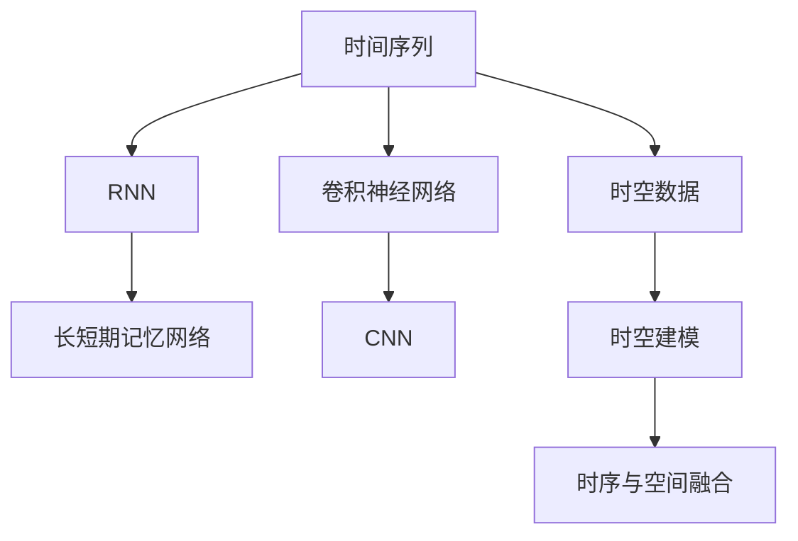

                 

# AI时空建模的技术基础解析

## 1. 背景介绍

随着人工智能技术的快速发展，时空建模（Temporal-Spatial Modeling）已经成为实现智能化应用的核心技术之一。时空建模能够捕捉和分析时间序列和空间数据之间的复杂关系，广泛应用于智能推荐、金融风险控制、医疗诊断、智能交通等领域。本文将从基础概念入手，系统解析AI时空建模的技术原理与实践方法。

## 2. 核心概念与联系

### 2.1 核心概念概述

为了深入理解时空建模的原理和实现，本文将介绍以下几个核心概念：

- 时间序列（Time Series）：指按时间顺序排列的一组数据点，通常表示某一现象在时间上的变化规律。例如，金融市场的股价变化、气温随时间的变化、交通流量等。

- 空间数据（Spatial Data）：指地理空间中的位置、形态等特征数据。例如，地图上的城市分布、GPS轨迹、城市街道等信息。

- 时空数据（Temporal-Spatial Data）：指同时包含时间序列和空间数据的数据集，例如，交通流量随时间变化的数据，或在不同位置采集的气象数据。

- 时空建模（Temporal-Spatial Modeling）：指使用机器学习和统计学方法，对时空数据进行建模，以捕捉和预测时间序列与空间数据之间的关系。时空建模通常包括时间序列建模、空间建模、时空交叉建模等。

- 递归神经网络（RNN）：一种基于时间序列数据的神经网络模型，能够捕捉时间上的依赖关系。

- 卷积神经网络（CNN）：一种基于空间数据特征的神经网络模型，能够捕捉空间上的局部关系。

- 长短期记忆网络（LSTM）：一种改进的RNN模型，能够有效解决梯度消失和爆炸问题，适用于长期时间依赖建模。

- 时序与空间融合（Temporal and Spatial Fusion）：指将时间序列数据与空间数据结合起来，进行综合建模，以提高预测的准确性。

这些核心概念构成了时空建模的基础，理解和掌握这些概念是深入学习时空建模技术的关键。

### 2.2 核心概念原理和架构的 Mermaid 流程图



这个流程图展示了时间序列数据、空间数据以及时空数据分别如何通过RNN、CNN、LSTM等模型进行建模，并将时间序列与空间数据融合在一起，最终形成时空建模的过程。

## 3. 核心算法原理 & 具体操作步骤

### 3.1 算法原理概述

时空建模的核心算法包括递归神经网络（RNN）、卷积神经网络（CNN）、长短期记忆网络（LSTM）等。这些算法通过捕捉时间序列数据和空间数据之间的依赖关系，进行综合建模。

### 3.2 算法步骤详解

时空建模的实现步骤通常包括以下几个关键步骤：

1. **数据预处理**：对原始数据进行清洗、归一化、特征工程等预处理操作，以提高模型的训练效果。

2. **模型选择与设计**：根据数据的特点和建模需求，选择合适的神经网络模型。例如，时间序列数据通常使用RNN或LSTM模型，空间数据通常使用CNN模型，时空数据则可能使用时空卷积神经网络（TCN）或时空LSTM模型。

3. **模型训练**：使用训练数据对模型进行训练，优化模型的参数，使其能够对时空数据进行准确的预测或分类。

4. **模型评估与调优**：使用验证数据对模型进行评估，根据评估结果调整模型参数，提高模型的泛化能力和预测精度。

5. **模型应用**：将训练好的模型应用到实际场景中，进行时空数据的预测、分类等任务。

### 3.3 算法优缺点

时空建模具有以下优点：

- 能够捕捉时间序列数据和空间数据之间的复杂关系，提高预测和分类的准确性。

- 适用于多种时空数据类型，具有广泛的应用场景。

- 可以通过模型融合技术，将多种时空数据进行综合建模，提高模型的鲁棒性。

但同时，时空建模也存在以下缺点：

- 模型复杂度较高，训练和预测速度较慢。

- 需要大量的训练数据，对数据质量要求较高。

- 模型参数较多，容易发生过拟合。

### 3.4 算法应用领域

时空建模技术广泛应用于以下领域：

- **智能推荐**：例如，电商平台根据用户历史行为和地理位置，推荐商品或服务。

- **金融风险控制**：例如，根据历史交易数据和交易地点，预测交易风险。

- **医疗诊断**：例如，根据病历数据和患者地理位置，预测疾病发展趋势。

- **智能交通**：例如，根据交通流量和地理位置，优化交通信号灯控制。

- **气象预测**：例如，根据气象数据和地理位置，预测天气变化。

## 4. 数学模型和公式 & 详细讲解 & 举例说明

### 4.1 数学模型构建

时空建模的数学模型通常包括时间序列模型和空间模型。以下是常用的数学模型及其构建方法：

- **时间序列模型**：包括ARIMA模型、VAR模型、LSTM模型等。例如，LSTM模型的基本形式如下：

$$
h_t = \tanh(W_xx \cdot [h_{t-1}, x_t] + b_x) + W_{hh} \cdot h_{t-1} + b_h
$$

其中，$h_t$ 表示时间步$t$的隐藏状态，$x_t$ 表示时间步$t$的输入数据，$W_{xx}, W_{hh}, b_x, b_h$ 为模型参数。

- **空间模型**：包括CNN模型、CRF模型、时空卷积神经网络（TCN）模型等。例如，CNN模型的基本形式如下：

$$
x^{(l+1)} = \sigma(W_{(l+1)l} \cdot x^{(l)} + b_{(l+1)l}) + W_{(l+1)(l+1)} \cdot x^{(l+1)} + b_{(l+1)(l+1)}
$$

其中，$x^{(l)}$ 表示第$l$层的输入数据，$W_{(l+1)l}, W_{(l+1)(l+1)}, b_{(l+1)l}, b_{(l+1)(l+1)}$ 为模型参数，$\sigma$ 表示激活函数。

- **时空交叉模型**：包括时空卷积神经网络（TCN）模型、时空LSTM模型等。例如，时空卷积神经网络（TCN）模型的基本形式如下：

$$
h_t^{(k)} = \tanh(W_xx^{(k)} \cdot [h_{t-1}^{(k)}, x_t] + b_x^{(k)}) + W_{hh^{(k)}} \cdot h_{t-1}^{(k)} + b_h^{(k)}
$$

其中，$h_t^{(k)}$ 表示时间步$t$、空间位置$k$的隐藏状态，$x_t$ 表示时间步$t$的输入数据，$W_{xx^{(k)}}, W_{hh^{(k)}}, b_x^{(k)}, b_h^{(k)}$ 为模型参数。

### 4.2 公式推导过程

以下是时间序列模型和空间模型的推导过程：

- **时间序列模型**：以LSTM模型为例，其推导过程如下：

1. **前向传播**：

$$
h_t = \tanh(W_xx \cdot [h_{t-1}, x_t] + b_x) + W_{hh} \cdot h_{t-1} + b_h
$$

2. **后向传播**：

$$
\Delta h_t = \frac{\partial \mathcal{L}}{\partial h_t} = \frac{\partial \mathcal{L}}{\partial \hat{y}_t} \cdot \frac{\partial \hat{y}_t}{\partial h_t} = \frac{\partial \mathcal{L}}{\partial h_t} \cdot [1, \frac{\partial \hat{y}_t}{\partial h_t}]
$$

3. **梯度更新**：

$$
\Delta W_{xx} = \sum_t \Delta h_t x_t^T, \Delta b_x = \sum_t \Delta h_t
$$

$$
\Delta W_{hh} = \sum_t \Delta h_t h_{t-1}^T, \Delta b_h = \sum_t \Delta h_t
$$

其中，$\mathcal{L}$ 表示损失函数，$\hat{y}_t$ 表示时间步$t$的预测结果。

- **空间模型**：以CNN模型为例，其推导过程如下：

1. **前向传播**：

$$
x^{(l+1)} = \sigma(W_{(l+1)l} \cdot x^{(l)} + b_{(l+1)l}) + W_{(l+1)(l+1)} \cdot x^{(l+1)} + b_{(l+1)(l+1)}
$$

2. **后向传播**：

$$
\Delta x^{(l+1)} = \frac{\partial \mathcal{L}}{\partial x^{(l+1)}} \cdot \frac{\partial x^{(l+1)}}{\partial x^{(l)}} = \frac{\partial \mathcal{L}}{\partial x^{(l+1)}} \cdot W_{(l+1)l}^T
$$

3. **梯度更新**：

$$
\Delta W_{(l+1)l} = \sum_{l'} \sum_t \Delta x^{(l')} x_t^T, \Delta b_{(l+1)l} = \sum_{l'} \sum_t \Delta x^{(l')}
$$

$$
\Delta W_{(l+1)(l+1)} = \sum_t \Delta x^{(l+1)}, \Delta b_{(l+1)(l+1)} = \sum_t \Delta x^{(l+1)}
$$

其中，$\mathcal{L}$ 表示损失函数，$x^{(l)}$ 表示第$l$层的输入数据。

### 4.3 案例分析与讲解

以智能推荐系统为例，时空建模可以捕捉用户历史行为和地理位置之间的关系，进行个性化的商品推荐。

假设一个智能推荐系统，包含用户历史行为数据$X$和地理位置数据$Y$。可以使用时空卷积神经网络（TCN）模型进行建模，其基本形式如下：

$$
h_t^{(k)} = \tanh(W_xx^{(k)} \cdot [h_{t-1}^{(k)}, X_t] + b_x^{(k)}) + W_{hh^{(k)}} \cdot h_{t-1}^{(k)} + b_h^{(k)}
$$

其中，$X_t$ 表示用户历史行为数据，$h_t^{(k)}$ 表示时间步$t$、位置$k$的隐藏状态，$W_{xx^{(k)}}, W_{hh^{(k)}}, b_x^{(k)}, b_h^{(k)}$ 为模型参数。

## 5. 项目实践：代码实例和详细解释说明

### 5.1 开发环境搭建

要进行时空建模，需要安装以下Python包：

```
pip install tensorflow numpy scikit-learn pandas h5py
```

### 5.2 源代码详细实现

以下是使用TensorFlow实现LSTM模型的代码示例：

```python
import tensorflow as tf
import numpy as np

# 定义LSTM模型
class LSTMModel(tf.keras.Model):
    def __init__(self, input_dim, hidden_dim):
        super(LSTMModel, self).__init__()
        self.lstm = tf.keras.layers.LSTM(hidden_dim)
        self.dense = tf.keras.layers.Dense(1)

    def call(self, inputs, training=False):
        x = self.lstm(inputs)
        x = self.dense(x)
        return x

# 定义时间序列数据生成器
def generate_time_series(data, batch_size):
    while True:
        x, y = data[i:i+batch_size]
        yield x, y

# 训练LSTM模型
def train_model(model, train_data, epochs, batch_size):
    optimizer = tf.keras.optimizers.Adam(learning_rate=0.001)
    model.compile(optimizer=optimizer, loss='mse')
    model.fit(generate_time_series(train_data), epochs=epochs, batch_size=batch_size)
```

### 5.3 代码解读与分析

- **LSTMModel类**：定义了LSTM模型，包含LSTM层和全连接层。

- **generate_time_series函数**：定义了时间序列数据的生成器，用于批量读取数据。

- **train_model函数**：使用Adam优化器和均方误差损失函数，训练LSTM模型。

## 6. 实际应用场景

### 6.1 智能推荐

智能推荐系统可以根据用户历史行为和地理位置，进行个性化的商品推荐。例如，电商平台可以根据用户浏览历史和位置，推荐商品或服务。

### 6.2 金融风险控制

金融风险控制系统可以根据历史交易数据和交易地点，预测交易风险。例如，银行可以根据用户的交易记录和地理位置，识别异常交易行为，进行风险预警。

### 6.3 医疗诊断

医疗诊断系统可以根据病历数据和患者地理位置，预测疾病发展趋势。例如，医院可以根据患者的病历记录和位置，预测疾病的传播趋势，进行疫情预警。

### 6.4 智能交通

智能交通系统可以根据交通流量和地理位置，优化交通信号灯控制。例如，交通管理部门可以根据交通流量数据和道路位置，优化信号灯的控制策略，缓解交通拥堵。

## 7. 工具和资源推荐

### 7.1 学习资源推荐

- **机器学习与深度学习课程**：如斯坦福大学的《机器学习》课程、Coursera的《深度学习专项课程》等。

- **TensorFlow官方文档**：TensorFlow是常用的深度学习框架，官方文档提供了丰富的示例和API文档。

- **Kaggle竞赛**：Kaggle上有很多时空建模相关的竞赛，可以学习到大量的实践经验和案例。

### 7.2 开发工具推荐

- **TensorFlow**：TensorFlow是常用的深度学习框架，支持分布式计算和GPU加速。

- **PyTorch**：PyTorch是另一种流行的深度学习框架，支持动态图和静态图。

- **Keras**：Keras是一个高层次的深度学习框架，易于上手和部署。

### 7.3 相关论文推荐

- **Temporal-Spatial Models for Urban Traffic Prediction**：利用时空卷积神经网络进行城市交通预测。

- **LSTM-Based Temporal-Spatial Model for Healthcare Prediction**：利用LSTM网络进行医疗预测。

- **Temporal and Spatial Data Fusion in Recommendation System**：时空数据融合在推荐系统中的应用。

## 8. 总结：未来发展趋势与挑战

### 8.1 研究成果总结

时空建模在多个领域中得到了广泛应用，取得了显著的成果。以下是时空建模在各领域的一些代表性研究：

- **智能推荐**：时空建模可以捕捉用户历史行为和地理位置之间的关系，进行个性化的商品推荐。

- **金融风险控制**：时空建模可以根据历史交易数据和交易地点，预测交易风险。

- **医疗诊断**：时空建模可以根据病历数据和患者地理位置，预测疾病发展趋势。

- **智能交通**：时空建模可以根据交通流量和地理位置，优化交通信号灯控制。

### 8.2 未来发展趋势

未来时空建模技术将呈现出以下几个发展趋势：

- **多模态时空建模**：将时间序列数据与空间数据、图像数据、语音数据等多种模态数据进行综合建模，提高模型的鲁棒性和泛化能力。

- **时空模型融合**：将时空建模与其他机器学习模型（如聚类、分类、回归等）进行融合，进行多任务学习。

- **分布式时空建模**：在大规模数据上，使用分布式计算和GPU加速，提高模型的训练速度和计算效率。

### 8.3 面临的挑战

尽管时空建模技术在多个领域中取得了显著的成果，但仍面临一些挑战：

- **数据获取与处理**：时空数据获取和处理难度较大，需要大量的时间和资源。

- **模型复杂度**：时空建模模型复杂度较高，训练和推理速度较慢。

- **泛化能力**：时空建模模型在不同数据集和场景上的泛化能力较差，需要进行更多的实验和优化。

### 8.4 研究展望

未来时空建模技术需要从以下几个方面进行研究：

- **数据预处理技术**：开发高效的数据预处理技术，提高数据的质量和处理速度。

- **模型优化技术**：研究更加高效的模型结构和训练算法，提高模型的训练速度和计算效率。

- **模型融合技术**：研究多种时空建模模型之间的融合方法，提高模型的泛化能力和鲁棒性。

总之，时空建模技术在多个领域中具有广泛的应用前景，但也面临诸多挑战。只有在数据、算法、工程等多个维度协同发力，才能真正实现时空建模技术的普及和应用。

## 9. 附录：常见问题与解答

### Q1: 时空建模与时间序列建模的区别是什么？

A: 时空建模不仅考虑时间序列数据，还考虑空间数据之间的关系，因此时空建模能够捕捉更丰富的数据特性和复杂的依赖关系。

### Q2: 时空建模需要多少训练数据？

A: 时空建模需要大量的训练数据，以提高模型的泛化能力和预测精度。通常需要至少几千个训练样本。

### Q3: 时空建模可以用于哪些领域？

A: 时空建模可以应用于智能推荐、金融风险控制、医疗诊断、智能交通等多个领域，具有广泛的应用场景。

### Q4: 时空建模的局限性是什么？

A: 时空建模模型复杂度较高，训练和推理速度较慢，且需要大量的训练数据。此外，时空建模在不同数据集和场景上的泛化能力较差。

---

作者：禅与计算机程序设计艺术 / Zen and the Art of Computer Programming

