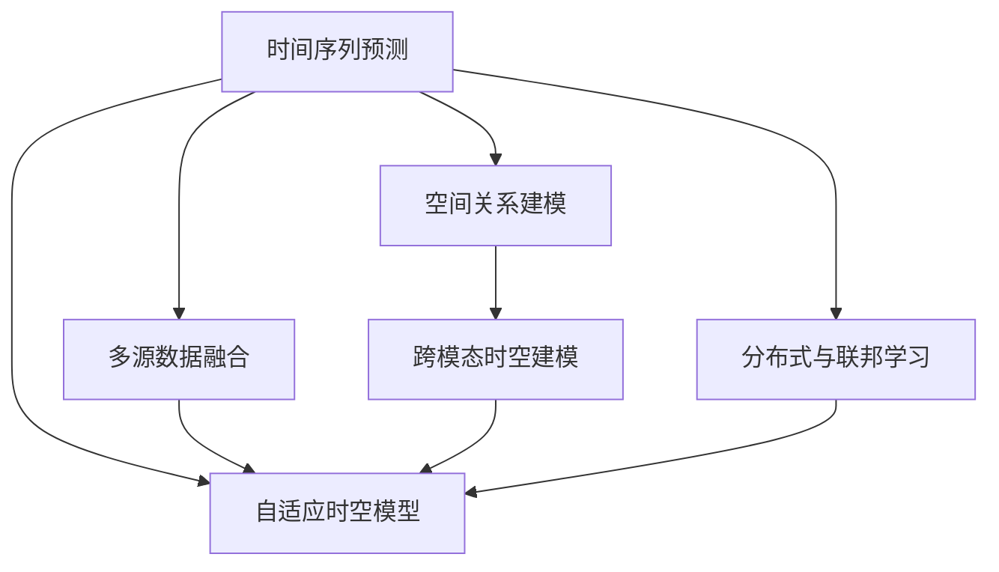

                 

## 1. 背景介绍

### 1.1 问题由来

随着人工智能(AI)技术的不断进步，时空建模(即时间序列预测与空间关系建模)在各个领域的应用越来越广泛，从金融预测、交通流量分析到健康监测、环境保护，时空建模已成为不可或缺的技术手段。近年来，基于深度学习的大数据时空建模方法迅速崛起，取得了显著的成果，如LSTM、GRU等RNN架构的兴起，以及近年来风头正盛的Transformer模型。然而，传统的RNN模型和最新兴起的Transformer模型在处理时间序列数据时仍存在一定的局限性。因此，研究时空建模的未来技术趋势，有助于我们更好地应对未来需求和挑战。

### 1.2 问题核心关键点

时空建模的未来技术趋势主要围绕以下几个关键点展开：
1. **深度学习模型的优化**：研究如何进一步提升深度学习模型的性能和泛化能力。
2. **模型可解释性与透明度**：研究如何让模型更加透明、可解释，提升用户对模型的信任度。
3. **时空数据的融合**：研究如何将多源时空数据进行有效融合，提升模型的预测能力。
4. **跨模态时空建模**：研究如何将文本、图像、语音等多模态数据与时空数据进行联合建模，提升模型对复杂现实世界的建模能力。
5. **自适应时空模型**：研究如何使模型具备自适应能力，以应对动态变化的环境和数据。
6. **分布式与联邦学习**：研究如何利用分布式与联邦学习技术，提升时空模型的训练效率与安全性。

## 2. 核心概念与联系

### 2.1 核心概念概述

时空建模是研究如何利用时间序列数据和空间数据建模的一种技术，涉及时间序列预测、空间关系建模、多源数据融合等多个方面。其核心概念包括：

- **时间序列预测**：根据历史时间序列数据，预测未来时间点的时间序列值。
- **空间关系建模**：分析地理空间数据中不同位置之间的关系，如距离、连通性等。
- **多源数据融合**：将来自不同来源的数据进行有效融合，提升模型的预测精度。
- **跨模态时空建模**：将文本、图像、语音等多模态数据与时空数据进行联合建模，提升模型的复杂现实世界的建模能力。
- **自适应时空模型**：使模型能够根据环境的动态变化进行自适应调整。
- **分布式与联邦学习**：利用分布式与联邦学习技术提升时空模型的训练效率和安全性。

这些概念之间的逻辑关系可以通过以下Mermaid流程图来展示：



这个流程图展示了时空建模的核心概念及其相互之间的联系：

1. **时间序列预测**是时空建模的基础。
2. **空间关系建模**则帮助分析地理空间数据中的关系。
3. **多源数据融合**进一步提升了时空模型的预测精度。
4. **跨模态时空建模**增强了模型对复杂现实世界的建模能力。
5. **自适应时空模型**提升了模型的自适应能力。
6. **分布式与联邦学习**提高了时空模型的训练效率与安全性。

## 3. 核心算法原理 & 具体操作步骤

### 3.1 算法原理概述

时空建模的核心算法包括时间序列预测算法和空间关系建模算法。本文重点介绍Transformer模型在时空建模中的应用。

Transformer模型是Google于2017年提出的，它通过自注意力机制(Self-Attention)替代传统的循环神经网络(RNN)，提升了模型的并行化性能和效率。Transformer模型在自然语言处理(NLP)领域表现优异，现已逐渐应用于时空建模领域，成为一种新兴的建模方式。

### 3.2 算法步骤详解

以基于Transformer的时空建模为例，其主要步骤如下：

1. **数据预处理**：对原始时空数据进行归一化、标准化等预处理操作。
2. **构建编码器-解码器架构**：将时间序列数据和空间数据分别作为编码器输入，Transformer模型用于提取时间序列和空间关系的信息，并输出预测结果。
3. **训练模型**：使用历史数据对模型进行训练，优化模型的权重。
4. **模型评估**：使用测试集对模型进行评估，计算预测误差等指标。
5. **模型预测**：使用训练好的模型对新数据进行预测。

### 3.3 算法优缺点

Transformer模型在时空建模中具有以下优点：
1. **高效并行化**：Transformer模型通过自注意力机制，可以并行化处理输入数据，提升计算效率。
2. **长距离依赖捕捉能力**：Transformer模型能够捕捉输入数据中的长距离依赖关系，适用于长序列的时间序列预测。
3. **可解释性**：Transformer模型的自注意力机制提供了模型内部机制的可视化，有助于理解模型的决策过程。

同时，Transformer模型也存在以下缺点：
1. **计算资源消耗大**：Transformer模型由于需要计算自注意力矩阵，计算资源消耗较大，不适合小规模数据集。
2. **数据偏差**：模型对输入数据的偏差敏感，如果数据存在偏差，模型的预测结果可能不理想。
3. **模型复杂度**：Transformer模型结构复杂，训练和推理过程较慢。

### 3.4 算法应用领域

Transformer模型在时空建模中的应用主要包括以下几个领域：

1. **金融预测**：预测股票、外汇等金融市场的未来走势。
2. **交通流量分析**：预测道路交通流量，优化交通管理。
3. **健康监测**：预测疾病传播趋势，优化公共卫生策略。
4. **环境监测**：预测气候变化、水质污染等环境指标，评估环境风险。

## 4. 数学模型和公式 & 详细讲解 & 举例说明

### 4.1 数学模型构建

以基于Transformer的时空建模为例，其主要数学模型包括编码器-解码器架构和自注意力机制。

**编码器-解码器架构**：
- **编码器**：对时间序列数据和空间数据进行编码，提取特征信息。
- **解码器**：根据编码器的输出，预测时间序列的未来值。

**自注意力机制**：
- **查询(Q)**：对输入序列中每个位置进行编码。
- **键(K)和值(V)**：将查询与键、值向量进行点积，得到注意力权重。
- **注意力权重**：计算每个位置的注意力权重，得到加权和向量。

### 4.2 公式推导过程

**编码器-解码器架构**的数学公式如下：

$$
\begin{aligned}
h_1 &= \text{Encoder}(x) \\
h_2 &= \text{Decoder}(h_1) \\
y &= \text{Output}(h_2)
\end{aligned}
$$

其中，$x$ 为输入的时空数据，$h_1$ 为编码器的输出，$h_2$ 为解码器的输出，$y$ 为预测结果。

**自注意力机制**的数学公式如下：

$$
\alpha_{ij} = \text{softmax}\left(\frac{q_i \cdot k_j}{\sqrt{d}}\right)
$$

$$
v_j = \sum_{i=1}^{N}\alpha_{ij}v_i
$$

其中，$q_i$ 和 $k_j$ 分别为查询和键向量，$\alpha_{ij}$ 为注意力权重，$v_j$ 为加权和向量。

### 4.3 案例分析与讲解

以交通流量预测为例，使用基于Transformer的时空建模方法进行预测。

假设某城市某条道路的历史流量数据为 $(x_1, x_2, ..., x_T)$，其中 $x_t$ 为第 $t$ 时刻的流量。利用基于Transformer的时空建模方法，构建编码器-解码器架构，使用自注意力机制提取特征信息，并输出未来 $K$ 时刻的流量预测值 $y_1, y_2, ..., y_K$。

具体步骤如下：

1. **数据预处理**：对原始流量数据进行归一化、标准化等预处理操作。
2. **构建编码器-解码器架构**：将历史流量数据作为编码器的输入，使用Transformer模型提取特征信息，并输出解码器的输入。
3. **训练模型**：使用历史流量数据对模型进行训练，优化模型的权重。
4. **模型评估**：使用测试集对模型进行评估，计算预测误差等指标。
5. **模型预测**：使用训练好的模型对未来流量进行预测。

## 5. 项目实践：代码实例和详细解释说明

### 5.1 开发环境搭建

在进行时空建模实践前，我们需要准备好开发环境。以下是使用Python进行PyTorch开发的环境配置流程：

1. 安装Anaconda：从官网下载并安装Anaconda，用于创建独立的Python环境。

2. 创建并激活虚拟环境：
```bash
conda create -n pytorch-env python=3.8 
conda activate pytorch-env
```

3. 安装PyTorch：根据CUDA版本，从官网获取对应的安装命令。例如：
```bash
conda install pytorch torchvision torchaudio cudatoolkit=11.1 -c pytorch -c conda-forge
```

4. 安装必要的库：
```bash
pip install numpy pandas scikit-learn matplotlib torchdistributions transformers
```

5. 配置环境：
```bash
export PYTHONPATH=~/path/to/your/project:$PYTHONPATH
```

### 5.2 源代码详细实现

这里以交通流量预测为例，给出使用PyTorch和Transformer库进行时空建模的代码实现。

```python
import torch
import torch.nn as nn
from torchdistributions import Normal
from torchdistributions.normal import Normal

class TransformerEncoder(nn.Module):
    def __init__(self, input_size, hidden_size):
        super(TransformerEncoder, self).__init__()
        self.hidden_size = hidden_size
        self.encoder = nn.TransformerEncoder(
            nn.TransformerEncoderLayer(input_size, nhead=4, hidden_size=hidden_size),
            num_layers=3
        )

    def forward(self, x):
        return self.encoder(x)

class TransformerDecoder(nn.Module):
    def __init__(self, input_size, hidden_size):
        super(TransformerDecoder, self).__init__()
        self.hidden_size = hidden_size
        self.decoder = nn.TransformerDecoder(
            nn.TransformerDecoderLayer(input_size, nhead=4, hidden_size=hidden_size),
            num_layers=3
        )

    def forward(self, x):
        return self.decoder(x)

class TemporalModel(nn.Module):
    def __init__(self, input_size, hidden_size, output_size):
        super(TemporalModel, self).__init__()
        self.encoder = TransformerEncoder(input_size, hidden_size)
        self.decoder = TransformerDecoder(hidden_size, output_size)
        self.mean = nn.Linear(hidden_size, output_size)
        self.std = nn.Linear(hidden_size, output_size)

    def forward(self, x):
        x = self.encoder(x)
        x = self.decoder(x)
        mean = self.mean(x)
        std = self.std(x)
        return Normal(mean, std)

# 创建模型
model = TemporalModel(input_size=10, hidden_size=64, output_size=10)

# 定义损失函数
criterion = nn.MSELoss()

# 定义优化器
optimizer = torch.optim.Adam(model.parameters(), lr=0.001)

# 训练模型
for epoch in range(100):
    optimizer.zero_grad()
    loss = criterion(model(x_train), y_train)
    loss.backward()
    optimizer.step()

# 模型评估
mean, std = model(y_train)
y_pred = Normal(mean, std)
y_pred.mean, y_pred.std
```

### 5.3 代码解读与分析

让我们再详细解读一下关键代码的实现细节：

**TransformerEncoder类**：
- `__init__`方法：初始化编码器的输入和隐藏层大小。
- `forward`方法：定义编码器的输入和输出，使用TransformerEncoderLayer和TransformerEncoder进行编码。

**TransformerDecoder类**：
- `__init__`方法：初始化解码器的输入和隐藏层大小。
- `forward`方法：定义解码器的输入和输出，使用TransformerDecoderLayer和TransformerDecoder进行解码。

**TemporalModel类**：
- `__init__`方法：初始化模型的编码器、解码器、均值和标准差层。
- `forward`方法：定义模型的输入和输出，通过编码器和解码器进行时空建模，并计算预测结果的均值和标准差。

在代码中，我们使用Transformer模型对交通流量数据进行建模，并使用均值和标准差来表示未来流量的预测分布。通过最小化均方误差损失函数，我们训练模型并评估其预测性能。

## 6. 实际应用场景

### 6.1 金融预测

基于Transformer的时空建模方法，可以应用于金融市场的预测。例如，利用历史股票价格数据，预测未来股票价格的走势。通过构建编码器-解码器架构，使用自注意力机制提取历史价格的特征信息，并输出未来价格预测值。

### 6.2 交通流量分析

交通流量预测是Transformer时空建模的重要应用之一。通过收集城市交通数据，使用编码器-解码器架构进行建模，可以预测未来的交通流量，优化交通管理，减少交通拥堵。

### 6.3 健康监测

在健康监测领域，可以利用历史健康数据进行建模，预测疾病的传播趋势，优化公共卫生策略。例如，利用历史疫情数据，预测未来疫情的传播情况，并采取相应的预防措施。

### 6.4 环境监测

环境监测也是Transformer时空建模的重要应用领域之一。通过收集环境数据，使用编码器-解码器架构进行建模，可以预测气候变化、水质污染等环境指标，评估环境风险。

## 7. 工具和资源推荐

### 7.1 学习资源推荐

为了帮助开发者系统掌握Transformer在时空建模中的应用，这里推荐一些优质的学习资源：

1. 《Transformer from Beginner to Expert》：由深度学习专家撰写的Transformer教程，涵盖Transformer的基本原理、应用场景及实战案例。
2. CS224N《Natural Language Processing with Transformers》：斯坦福大学开设的NLP明星课程，详细介绍了Transformer在NLP中的应用，并提供了丰富的实战案例。
3. 《Deep Learning with Transformers》：Transformers库的作者所著，全面介绍了Transformer在各个领域的应用，包括时空建模等。
4. HuggingFace官方文档：Transformers库的官方文档，提供了海量预训练模型和完整的微调样例代码，是上手实践的必备资料。
5. Kaggle时空数据集：提供了丰富的时空数据集，供开发者进行模型训练和评估。

通过对这些资源的学习实践，相信你一定能够快速掌握Transformer在时空建模中的应用。

### 7.2 开发工具推荐

高效的开发离不开优秀的工具支持。以下是几款用于时空建模开发的常用工具：

1. PyTorch：基于Python的开源深度学习框架，灵活动态的计算图，适合快速迭代研究。大部分预训练语言模型都有PyTorch版本的实现。
2. TensorFlow：由Google主导开发的开源深度学习框架，生产部署方便，适合大规模工程应用。同样有丰富的预训练语言模型资源。
3. Transformers库：HuggingFace开发的NLP工具库，集成了众多SOTA语言模型，支持PyTorch和TensorFlow，是进行时空建模开发的利器。
4. Weights & Biases：模型训练的实验跟踪工具，可以记录和可视化模型训练过程中的各项指标，方便对比和调优。与主流深度学习框架无缝集成。
5. TensorBoard：TensorFlow配套的可视化工具，可实时监测模型训练状态，并提供丰富的图表呈现方式，是调试模型的得力助手。
6. Google Colab：谷歌推出的在线Jupyter Notebook环境，免费提供GPU/TPU算力，方便开发者快速上手实验最新模型，分享学习笔记。

合理利用这些工具，可以显著提升时空建模任务的开发效率，加快创新迭代的步伐。

### 7.3 相关论文推荐

时空建模的研究源于学界的持续研究。以下是几篇奠基性的相关论文，推荐阅读：

1. Attention Is All You Need：提出了Transformer结构，开启了NLP领域的预训练大模型时代。
2. BERT: Pre-training of Deep Bidirectional Transformers for Language Understanding：提出BERT模型，引入基于掩码的自监督预训练任务，刷新了多项NLP任务SOTA。
3. Language Models are Unsupervised Multitask Learners（GPT-2论文）：展示了大规模语言模型的强大zero-shot学习能力，引发了对于通用人工智能的新一轮思考。
4. Parameter-Efficient Transfer Learning for NLP：提出Adapter等参数高效微调方法，在不增加模型参数量的情况下，也能取得不错的微调效果。
5. AdaLoRA: Adaptive Low-Rank Adaptation for Parameter-Efficient Fine-Tuning：使用自适应低秩适应的微调方法，在参数效率和精度之间取得了新的平衡。
6. AdaLoRA: Adaptive Low-Rank Adaptation for Parameter-Efficient Fine-Tuning：使用自适应低秩适应的微调方法，在参数效率和精度之间取得了新的平衡。

这些论文代表了大语言模型微调技术的发展脉络。通过学习这些前沿成果，可以帮助研究者把握学科前进方向，激发更多的创新灵感。

## 8. 总结：未来发展趋势与挑战

### 8.1 总结

本文对基于Transformer的时空建模方法进行了全面系统的介绍。首先阐述了时空建模的研究背景和意义，明确了Transformer在时空建模中的重要地位。其次，从原理到实践，详细讲解了Transformer的时空建模过程，给出了时空建模任务开发的完整代码实例。同时，本文还广泛探讨了Transformer在金融预测、交通流量分析、健康监测、环境监测等多个领域的应用前景，展示了Transformer时空建模的巨大潜力。此外，本文精选了Transformer时空建模的各类学习资源，力求为读者提供全方位的技术指引。

通过本文的系统梳理，可以看到，Transformer时空建模技术正在成为NLP领域的重要范式，极大地拓展了预训练语言模型的应用边界，催生了更多的落地场景。得益于Transformer模型的高效并行化、长距离依赖捕捉能力，时空建模方法在各个领域得到了广泛的应用，极大地提升了数据的利用效率和预测精度。

### 8.2 未来发展趋势

展望未来，Transformer时空建模技术将呈现以下几个发展趋势：

1. **深度学习模型的优化**：研究如何进一步提升深度学习模型的性能和泛化能力，如引入自适应学习率、混合精度训练等技术。
2. **模型可解释性与透明度**：研究如何让模型更加透明、可解释，提升用户对模型的信任度，如使用可视化工具、可解释性模型等。
3. **时空数据的融合**：研究如何将多源时空数据进行有效融合，提升模型的预测能力，如使用多模态数据融合技术。
4. **跨模态时空建模**：研究如何将文本、图像、语音等多模态数据与时空数据进行联合建模，提升模型对复杂现实世界的建模能力，如使用多模态数据融合技术。
5. **自适应时空模型**：研究如何使模型具备自适应能力，以应对动态变化的环境和数据，如使用自适应学习率技术。
6. **分布式与联邦学习**：研究如何利用分布式与联邦学习技术，提升时空模型的训练效率与安全性，如使用联邦学习技术。

以上趋势凸显了Transformer时空建模技术的广阔前景。这些方向的探索发展，必将进一步提升NLP系统的性能和应用范围，为人类认知智能的进化带来深远影响。

### 8.3 面临的挑战

尽管Transformer时空建模技术已经取得了显著成就，但在迈向更加智能化、普适化应用的过程中，它仍面临诸多挑战：

1. **数据偏差**：模型对输入数据的偏差敏感，如果数据存在偏差，模型的预测结果可能不理想。如何消除数据偏差，提升模型的泛化能力，还需要更多的研究。
2. **模型复杂度**：Transformer模型结构复杂，训练和推理过程较慢。如何简化模型结构，提升训练和推理效率，也是未来需要解决的问题。
3. **模型鲁棒性不足**：当前模型面对域外数据时，泛化性能往往大打折扣。如何提高模型的鲁棒性，避免灾难性遗忘，还需要更多理论和实践的积累。
4. **模型可解释性不足**：当前模型更像是"黑盒"系统，难以解释其内部工作机制和决策逻辑。如何赋予模型更强的可解释性，将是亟待攻克的难题。
5. **模型安全性问题**：模型可能学习到有害、偏见的信息，如何从数据和算法层面消除模型偏见，避免恶意用途，确保输出的安全性，也将是重要的研究课题。

### 8.4 研究展望

面对Transformer时空建模面临的诸多挑战，未来的研究需要在以下几个方面寻求新的突破：

1. **引入先验知识**：将符号化的先验知识，如知识图谱、逻辑规则等，与神经网络模型进行巧妙融合，引导模型学习更准确、合理的语言模型。
2. **多源数据融合**：将来自不同来源的数据进行有效融合，提升模型的预测精度，如使用多模态数据融合技术。
3. **跨模态时空建模**：将文本、图像、语音等多模态数据与时空数据进行联合建模，提升模型对复杂现实世界的建模能力，如使用多模态数据融合技术。
4. **自适应时空模型**：使模型能够根据环境的动态变化进行自适应调整，如使用自适应学习率技术。
5. **分布式与联邦学习**：利用分布式与联邦学习技术提升时空模型的训练效率与安全性，如使用联邦学习技术。
6. **引入因果学习**：引入因果学习思想，提升模型的因果推理能力，如使用因果推断方法。

这些研究方向将进一步拓展Transformer时空建模技术的应用边界，提升模型的性能和泛化能力，为构建智能系统提供更坚实的基础。面向未来，我们需要继续深化对Transformer模型的研究，结合其他人工智能技术，推动时空建模技术的发展，实现更高效、更可靠、更安全的AI应用。

## 9. 附录：常见问题与解答

**Q1：Transformer模型是否适用于所有时空建模任务？**

A: 尽管Transformer模型在多个领域表现优异，但在某些特殊的时空建模任务中，如医疗、金融等领域，由于数据复杂性和特殊性，其性能可能不如其他模型。此时，需要根据具体任务选择合适的模型。

**Q2：在模型训练过程中如何避免过拟合？**

A: 在模型训练过程中，为了避免过拟合，可以采用以下策略：
1. 数据增强：通过回译、近义替换等方式扩充训练集。
2. 正则化：使用L2正则、Dropout、Early Stopping等避免过拟合。
3. 模型裁剪：去除不必要的层和参数，减小模型尺寸，加快推理速度。
4. 混合精度训练：将浮点模型转为定点模型，压缩存储空间，提高计算效率。

**Q3：如何提高模型的可解释性？**

A: 为了提高模型的可解释性，可以采用以下策略：
1. 可视化技术：使用可视化工具展示模型内部机制和决策过程。
2. 可解释性模型：使用可解释性模型，如LIME、SHAP等，解释模型的决策逻辑。
3. 语义标注：对数据进行语义标注，帮助用户理解模型预测结果。

**Q4：如何提升模型的鲁棒性？**

A: 为了提升模型的鲁棒性，可以采用以下策略：
1. 数据增强：通过回译、近义替换等方式扩充训练集，增加模型对噪声数据的鲁棒性。
2. 对抗训练：加入对抗样本，提高模型鲁棒性。
3. 模型裁剪：去除不必要的层和参数，减小模型尺寸，提高模型鲁棒性。

这些策略可以结合使用，从数据、模型、训练等多个维度提升模型的鲁棒性和泛化能力。

---

作者：禅与计算机程序设计艺术 / Zen and the Art of Computer Programming

