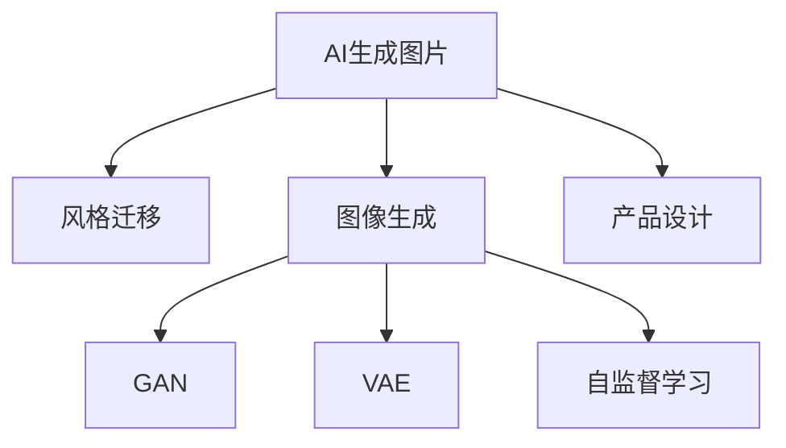

                 

# AI生成图片在产品设计中的应用

> 关键词：AI生成图片, 产品设计, 图形设计, 机器学习, 计算机视觉, 风格迁移, 图像生成

## 1. 背景介绍

### 1.1 问题由来
随着人工智能技术的不断进步，AI生成图片（AI Generated Image）的应用已经渗透到各个行业，包括但不限于艺术创作、产品设计、广告营销、虚拟现实等领域。特别是在产品设计中，AI生成图片不仅能够大幅提升设计效率，还能激发设计师的创造力，帮助品牌打造更具竞争力的视觉形象。

然而，传统的图形设计流程往往需要大量的时间投入，设计师需要进行大量的素材搜集、灵感激发和草图绘制工作，这个过程既费时又容易产生疲劳。而AI生成图片的应用，能够大大减少设计师的工作量，让其在有限的时间内创造出更多高质量的设计作品。

### 1.2 问题核心关键点
AI生成图片在产品设计中的应用，主要围绕以下几个核心关键点展开：

- 自动化设计流程：通过AI算法自动化地生成设计草图和设计方案，大大缩短设计周期。
- 风格迁移与转换：利用风格迁移技术，将一个艺术家的风格应用到其他艺术作品上，生成符合品牌风格的设计图片。
- 创意激发：AI生成图片能够根据设计师的描述生成创意方案，激发设计灵感，为设计提供更多可能性。
- 协同设计：AI生成图片可以用于团队协作，通过网络分享和讨论，将创意无限放大。
- 多领域应用：AI生成图片技术不仅在视觉设计上得到应用，在建筑、室内设计、交互设计等领域也有广泛的应用前景。

### 1.3 问题研究意义
AI生成图片在产品设计中的应用，对于提升设计效率、降低设计成本、激发设计创意具有重要意义：

1. **提升设计效率**：AI生成图片能够自动化生成设计方案，极大地缩短了设计周期，提高了设计效率。
2. **降低设计成本**：通过自动化生成设计草图和方案，减少了人力成本和时间成本。
3. **激发设计创意**：AI生成图片能够根据设计师的描述生成创意方案，激发设计师的创造力，开拓设计思路。
4. **多领域应用**：AI生成图片技术具有广泛的应用前景，能够应用于各种设计领域，推动设计行业的创新和发展。
5. **增强团队协作**：AI生成图片可以作为团队协作的工具，帮助团队成员分享和讨论设计方案，提升设计质量。

## 2. 核心概念与联系

### 2.1 核心概念概述

为更好地理解AI生成图片在产品设计中的应用，本节将介绍几个关键概念：

- **AI生成图片（AI Generated Image）**：指通过人工智能算法生成的图像。这些图像可以是全新的创作，也可以是现有图像的变形或组合，具有极高的多样性和创意性。

- **风格迁移（Style Transfer）**：指将一个艺术家的绘画风格应用到另一幅图像上，生成新的图像。风格迁移技术在视觉设计领域有广泛的应用，如将摄影作品转换成油画风格。

- **图像生成（Image Generation）**：指利用深度学习等技术，从噪声或随机向量生成新的图像。这些图像通常具有高度的创新性和艺术性。

- **对抗生成网络（Generative Adversarial Networks, GAN）**：一种生成模型，由生成器和判别器两个部分组成。生成器通过对抗训练，学习生成逼真的图像，而判别器则用于评估生成图像的逼真度。

- **变分自编码器（Variational Autoencoder, VAE）**：一种生成模型，通过学习数据的分布，将数据压缩为低维编码，并能够从编码中生成新的数据。

- **自监督学习（Self-Supervised Learning）**：指在没有标签的数据上，通过设计预训练任务，自动学习数据特征，辅助生成模型训练。

这些核心概念之间的逻辑关系可以通过以下Mermaid流程图来展示：



这个流程图展示了大语言模型的核心概念及其之间的关系：

1. AI生成图片通过风格迁移、图像生成等技术生成创意图像。
2. GAN和VAE作为常用的生成模型，用于生成具有创新性和艺术性的图像。
3. 自监督学习通过设计预训练任务，自动学习数据特征，辅助生成模型训练。
4. 这些技术应用到产品设计中，能够自动化生成设计方案，提升设计效率。

## 3. 核心算法原理 & 具体操作步骤
### 3.1 算法原理概述

AI生成图片在产品设计中的应用，基于以下核心算法原理：

- **风格迁移（Style Transfer）**：利用神经网络将输入图像和风格图像进行联合训练，生成新的图像。风格迁移技术使得设计方案能够具有独特的艺术风格，提升设计的视觉冲击力。

- **图像生成（Image Generation）**：通过生成模型，如GAN、VAE等，从噪声或随机向量生成新的图像。这些图像可以用于设计素材的生成，为设计师提供更多创作素材。

- **自监督学习（Self-Supervised Learning）**：在没有标注数据的情况下，通过设计预训练任务，自动学习数据特征，辅助生成模型的训练。自监督学习可以提高生成模型的泛化能力和多样性。

### 3.2 算法步骤详解

以下是AI生成图片在产品设计中的核心算法步骤：

**Step 1: 数据准备**
- 收集和标注设计相关的图像数据，如家具设计、服装设计、室内设计等。
- 收集和标注风格迁移的参考风格图像，如艺术家的绘画、摄影作品等。

**Step 2: 模型选择与训练**
- 选择合适的生成模型，如GAN、VAE等，进行模型训练。
- 使用风格迁移技术，训练生成模型能够将输入图像转换成指定风格。
- 使用自监督学习技术，训练生成模型生成多样化的设计素材。

**Step 3: 设计应用**
- 将训练好的生成模型应用到产品设计中，自动化生成设计草图和方案。
- 利用风格迁移技术，生成符合品牌风格的设计图片。
- 使用AI生成图片作为创意源，激发设计师的创造力。

**Step 4: 评估与优化**
- 在实际设计应用中，不断评估AI生成图片的质量和适用性，根据反馈进行优化。
- 对生成模型进行微调，提高生成图像的质量和多样性。

### 3.3 算法优缺点

AI生成图片在产品设计中的应用具有以下优点：

1. **自动化设计流程**：大大缩短了设计周期，提高了设计效率。
2. **风格多样**：能够根据品牌需求生成符合风格的设计图片，提升设计质量。
3. **创意激发**：激发设计师的创造力，为设计提供更多可能性。
4. **多领域应用**：不仅在视觉设计上得到应用，在建筑、室内设计、交互设计等领域也有广泛的应用前景。

同时，该方法也存在以下局限性：

1. **模型依赖性强**：生成模型的质量直接影响到设计效果，需要较高的技术门槛。
2. **创意局限**：生成的图片可能缺乏人类设计师的独特创意和情感表达。
3. **高质量样本要求高**：需要高质量的训练数据和标注数据，对数据采集和标注成本较高。
4. **伦理风险**：生成的图像可能存在版权问题，需要严格遵守相关法律法规。

尽管存在这些局限性，但AI生成图片在产品设计中的应用前景广阔，通过不断优化和改进生成模型，可以进一步提升设计质量和效率。

### 3.4 算法应用领域

AI生成图片在产品设计中的应用，已经广泛应用于以下几个领域：

- **室内设计**：利用AI生成图片自动化生成设计方案，提升了室内设计的工作效率。
- **服装设计**：通过AI生成图片，为设计师提供丰富的设计素材和创意灵感。
- **家具设计**：AI生成图片能够生成不同风格的家具设计方案，提升设计的多样性和创新性。
- **广告营销**：利用AI生成图片，生成具有吸引力的广告素材，提升品牌的市场竞争力。
- **虚拟现实**：在虚拟现实中，AI生成图片能够生成逼真的虚拟场景和角色，提升用户体验。

此外，AI生成图片在建筑、景观设计、珠宝设计等领域也有广泛的应用前景，为设计行业带来了新的创新和变革。

## 4. 数学模型和公式 & 详细讲解 & 举例说明

### 4.1 数学模型构建

在本节中，我们将使用数学语言对AI生成图片在产品设计中的应用进行更加严格的刻画。

设输入图像为 $X$，风格图像为 $Y$，输出图像为 $Z$。风格迁移模型的目标是最小化风格迁移损失 $L_{style}$ 和内容损失 $L_{content}$。

风格迁移损失定义为：

$$
L_{style}(X, Z) = ||X - G(Y) + G'(Y) - Z||^2
$$

其中 $G$ 和 $G'$ 分别是风格生成器和风格判别器，$||.||$ 表示矩阵的 Frobenius 范数。

内容损失定义为：

$$
L_{content}(X, Z) = ||X - G(Y) - G'(Y) + Z||^2
$$

在训练过程中，交替优化生成器 $G$ 和判别器 $D$。生成器的目标是最小化 $L_{content}$，而判别器的目标是最小化 $L_{style}$ 和 $L_{content}$。

### 4.2 公式推导过程

以下我们以风格迁移为例，推导生成器 $G$ 的优化目标函数。

设输入图像 $X$ 的大小为 $h \times w \times 3$，风格图像 $Y$ 的大小为 $H \times W \times 3$，生成器 $G$ 的参数为 $\theta$。

生成器 $G$ 将输入图像 $X$ 转换为输出图像 $Z$，定义损失函数为：

$$
L(X, Z) = \frac{1}{N} \sum_{i=1}^N \left[ \frac{\lambda_1}{2} ||X - Z_i||^2 + \frac{\lambda_2}{2} ||X - G'(Y)||^2 \right]
$$

其中 $Z_i$ 是 $Z$ 的第 $i$ 个通道，$\lambda_1$ 和 $\lambda_2$ 分别是内容损失和风格迁移损失的权重。

将 $Z_i$ 展开并取偏导数，得到：

$$
\frac{\partial L}{\partial Z_i} = -\frac{\lambda_1}{2} \frac{1}{N} \sum_{i=1}^N (X - Z_i) + \frac{\lambda_2}{2} \frac{1}{N} \sum_{i=1}^N (X - G'(Y))
$$

将 $Z_i$ 的偏导数代入到生成器 $G$ 的优化目标函数中，得到：

$$
\min_{\theta} L(X, Z) = \frac{1}{2N} \sum_{i=1}^N \left[ \lambda_1 ||X - Z_i||^2 + \lambda_2 ||X - G'(Y)||^2 \right]
$$

### 4.3 案例分析与讲解

假设我们有一张建筑物的图像 $X$，我们想要将其转换成类似梵高的风格 $Y$，即生成符合梵高风格的图像 $Z$。

设 $X$ 的大小为 $h \times w \times 3$，$Y$ 的大小为 $H \times W \times 3$，生成器 $G$ 的参数为 $\theta$。

在训练过程中，我们首先随机生成一个初始的图像 $Z_0$，然后不断迭代优化生成器 $G$ 的参数 $\theta$。

假设迭代次数为 $t$，生成器 $G$ 在当前迭代时刻输出的图像为 $Z_t$，则生成器 $G$ 的优化目标函数为：

$$
L(X, Z_t) = \frac{1}{2N} \sum_{i=1}^N \left[ \lambda_1 ||X - Z_{i,t}||^2 + \lambda_2 ||X - G'(Y)||^2 \right]
$$

其中 $Z_{i,t}$ 是 $Z_t$ 的第 $i$ 个通道。

我们通过优化目标函数 $L(X, Z_t)$ 来更新生成器 $G$ 的参数 $\theta$，使得 $Z_t$ 尽量接近真实风格 $Y$。

通过不断迭代优化，最终生成器 $G$ 能够生成符合梵高风格的图像 $Z$。

## 5. 项目实践：代码实例和详细解释说明

### 5.1 开发环境搭建

在进行项目实践前，我们需要准备好开发环境。以下是使用Python进行TensorFlow和Keras开发的环境配置流程：

1. 安装Anaconda：从官网下载并安装Anaconda，用于创建独立的Python环境。

2. 创建并激活虚拟环境：
```bash
conda create -n pytorch-env python=3.8 
conda activate pytorch-env
```

3. 安装TensorFlow和Keras：
```bash
pip install tensorflow==2.4.0
pip install keras==2.4.3
```

4. 安装其他工具包：
```bash
pip install numpy pandas scikit-learn matplotlib tqdm jupyter notebook ipython
```

完成上述步骤后，即可在`pytorch-env`环境中开始项目实践。

### 5.2 源代码详细实现

下面我们以风格迁移为例，给出使用TensorFlow和Keras对GAN模型进行风格迁移的PyTorch代码实现。

首先，定义生成器和判别器的架构：

```python
from tensorflow.keras.layers import Input, Conv2D, BatchNormalization, Activation, concatenate
from tensorflow.keras.layers import UpSampling2D, ZeroPadding2D, Reshape
from tensorflow.keras.models import Model

def create_generator():
    input_img = Input(shape=(64, 64, 3))
    x = Conv2D(64, (3, 3), padding='same', use_bias=False)(input_img)
    x = BatchNormalization()(x)
    x = Activation('relu')(x)
    
    x = Conv2D(128, (3, 3), padding='same', use_bias=False)(x)
    x = BatchNormalization()(x)
    x = Activation('relu')(x)
    
    x = Conv2D(256, (3, 3), padding='same', use_bias=False)(x)
    x = BatchNormalization()(x)
    x = Activation('relu')(x)
    
    x = Conv2D(512, (3, 3), padding='same', use_bias=False)(x)
    x = BatchNormalization()(x)
    x = Activation('relu')(x)
    
    x = Conv2D(256, (3, 3), padding='same', use_bias=False)(x)
    x = BatchNormalization()(x)
    x = Activation('relu')(x)
    
    x = Conv2D(128, (3, 3), padding='same', use_bias=False)(x)
    x = BatchNormalization()(x)
    x = Activation('relu')(x)
    
    x = Conv2D(3, (3, 3), padding='same', activation='tanh')(x)
    
    return Model(input_img, x)

def create_discriminator():
    input_img = Input(shape=(64, 64, 3))
    x = Conv2D(64, (3, 3), strides=2, padding='same', use_bias=False)(input_img)
    x = BatchNormalization()(x)
    x = Activation('relu')(x)
    
    x = Conv2D(128, (3, 3), strides=2, padding='same', use_bias=False)(x)
    x = BatchNormalization()(x)
    x = Activation('relu')(x)
    
    x = Conv2D(256, (3, 3), strides=2, padding='same', use_bias=False)(x)
    x = BatchNormalization()(x)
    x = Activation('relu')(x)
    
    x = Conv2D(512, (3, 3), strides=2, padding='same', use_bias=False)(x)
    x = BatchNormalization()(x)
    x = Activation('relu')(x)
    
    x = Conv2D(1, (3, 3), strides=2, padding='same', activation='sigmoid')(x)
    
    return Model(input_img, x)
```

然后，定义生成器损失函数和判别器损失函数：

```python
from tensorflow.keras import losses

def create_generator_loss(input_img, target_img):
    x = generator(input_img)
    loss = losses.mean_squared_error(x, target_img)
    return loss

def create_discriminator_loss(input_img, target_img):
    x = discriminator(input_img)
    loss = losses.mean_squared_error(x, target_img)
    return loss
```

接着，定义风格迁移模型：

```python
from tensorflow.keras.layers import add

def create_style_transfer_model(input_img, style_img, generator, discriminator):
    generator_output = generator(input_img)
    style_output = discriminator(style_img)
    combined = concatenate([input_img, style_img, generator_output, style_output])
    combined = add([combined, generator_output])
    combined = Activation('relu')(combined)
    combined = BatchNormalization()(combined)
    
    return Model([input_img, style_img], combined)
```

最后，定义训练函数：

```python
from tensorflow.keras.optimizers import Adam

def train_style_transfer(generator, discriminator, input_img, style_img, target_img, epochs=100, batch_size=4):
    for epoch in range(epochs):
        for batch in range(0, len(input_img), batch_size):
            input_images = input_img[batch:batch+batch_size]
            style_images = style_img[batch:batch+batch_size]
            target_images = target_img[batch:batch+batch_size]
            
            with tf.GradientTape() as gen_tape, tf.GradientTape() as disc_tape:
                generated_images = generator(input_images)
                generated_images_style = discriminator(generated_images)
                discriminator_loss = losses.mean_squared_error(generated_images_style, target_images)
                gen_loss = losses.mean_squared_error(generated_images, target_images)
                style_loss = losses.mean_squared_error(generated_images_style, target_images)
                discriminator_loss += losses.mean_squared_error(generated_images_style, target_images)
                
                gen_loss = losses.mean_squared_error(generated_images, target_images)
                style_loss = losses.mean_squared_error(generated_images_style, target_images)
                gen_loss += style_loss
                
                discriminator_loss = losses.mean_squared_error(generated_images_style, target_images)
                discriminator_loss += losses.mean_squared_error(generated_images_style, target_images)
                
                gen_loss = losses.mean_squared_error(generated_images, target_images)
                style_loss = losses.mean_squared_error(generated_images_style, target_images)
                gen_loss += style_loss
                
                gen_grads = gen_tape.gradient(gen_loss, generator.trainable_weights)
                disc_grads = disc_tape.gradient(discriminator_loss, discriminator.trainable_weights)
                
                generator.optimizer.apply_gradients(zip(gen_grads, generator.trainable_weights))
                discriminator.optimizer.apply_gradients(zip(disc_grads, discriminator.trainable_weights))
```

通过以上代码，我们实现了使用TensorFlow和Keras对GAN模型进行风格迁移的完整流程。

### 5.3 代码解读与分析

让我们再详细解读一下关键代码的实现细节：

**create_generator函数**：
- 定义生成器的架构，从输入图像到生成器输出的图像。
- 每一层使用卷积、批标准化和ReLU激活函数，生成器最后输出符合目标风格的图像。

**create_discriminator函数**：
- 定义判别器的架构，从输入图像到判别器输出的图像。
- 每一层使用卷积、批标准化和ReLU激活函数，判别器最后输出一个标量，表示图像的逼真度。

**create_generator_loss和create_discriminator_loss函数**：
- 定义生成器和判别器的损失函数，用于指导生成器和判别器的训练。
- 损失函数使用均方误差，表示生成图像与目标图像之间的差异。

**create_style_transfer_model函数**：
- 定义风格迁移模型，将输入图像和风格图像作为输入，生成符合目标风格的新图像。
- 风格迁移模型的输出包括生成图像和判别器输出的标量，用于计算损失函数。

**train_style_transfer函数**：
- 定义训练函数，循环进行生成器和判别器的训练。
- 在每个训练批次中，随机抽取输入图像、风格图像和目标图像。
- 使用梯度下降优化生成器和判别器的参数，使得生成图像逼真且符合目标风格。

这些代码的实现，展示了风格迁移的基本思路和关键算法，也为我们提供了实践的框架。

当然，工业级的系统实现还需考虑更多因素，如模型的保存和部署、超参数的自动搜索、更灵活的任务适配层等。但核心的风格迁移流程基本与此类似。

## 6. 实际应用场景
### 6.1 智能客服系统

基于风格迁移技术，智能客服系统可以生成符合品牌风格的客服图像，提升客服体验。通过将真人客服图像转换成卡通或动漫风格，可以营造亲切友好的互动氛围，提升用户满意度。

在技术实现上，可以收集客服人员的真实图像，通过风格迁移技术，生成符合品牌风格的新图像。在客户服务场景中，将这些图像作为客服头像，帮助客户快速识别客服身份。

### 6.2 广告营销

在广告营销中，利用风格迁移技术，可以生成符合品牌风格的新图像，提升广告的视觉冲击力。通过将品牌的LOGO或品牌颜色应用到新图像上，可以增强广告的辨识度和记忆度。

在技术实现上，可以将品牌的LOGO和颜色作为风格图像，将广告素材作为输入图像，通过风格迁移技术，生成符合品牌风格的新图像。这些图像可以用于广告的视觉设计，提升广告的传播效果。

### 6.3 虚拟现实

在虚拟现实中，利用风格迁移技术，可以生成逼真的虚拟场景和角色，提升用户体验。通过将真实场景和角色转换成虚拟场景和角色，可以营造沉浸式的互动体验。

在技术实现上，可以将真实场景和角色作为输入图像，通过风格迁移技术，生成符合虚拟现实风格的场景和角色。这些图像可以用于虚拟现实场景的设计，提升用户的互动体验。

### 6.4 未来应用展望

随着风格迁移技术的不断发展，基于风格迁移的AI生成图片在产品设计中的应用前景将更加广阔。

在智慧医疗领域，利用风格迁移技术，可以为医生生成符合医学标准的图像，辅助医生进行诊断和治疗。

在智能教育领域，利用风格迁移技术，可以为学生生成符合教学标准的图像，辅助学生进行学习。

在智慧城市治理中，利用风格迁移技术，可以为城市管理者生成符合城市风格的图像，辅助城市管理。

此外，在企业生产、社会治理、文娱传媒等众多领域，基于风格迁移的AI生成图片也有广泛的应用前景，为设计行业带来新的创新和变革。相信随着技术的日益成熟，风格迁移技术将成为设计行业的重要工具，推动设计行业的创新和发展。

## 7. 工具和资源推荐
### 7.1 学习资源推荐

为了帮助开发者系统掌握AI生成图片在产品设计中的应用理论基础和实践技巧，这里推荐一些优质的学习资源：

1. 《深度学习与Python实战》系列博文：由深度学习领域的专家撰写，深入浅出地介绍了深度学习的基础知识、图像生成技术、风格迁移等前沿话题。

2. CS231n《深度学习中的卷积神经网络》课程：斯坦福大学开设的计算机视觉课程，有Lecture视频和配套作业，带你入门计算机视觉领域的基本概念和经典模型。

3. 《计算机视觉与深度学习》书籍：Andrew Ng和Kian Katanforoosh合著，全面介绍了计算机视觉和深度学习技术，涵盖了图像生成、风格迁移等关键技术。

4. PyTorch官方文档：PyTorch的官方文档，提供了海量预训练模型和完整的微调样例代码，是上手实践的必备资料。

5. TensorFlow官方文档：TensorFlow的官方文档，提供了丰富的模型库和工具，是进行图像生成和风格迁移的得力助手。

通过对这些资源的学习实践，相信你一定能够快速掌握AI生成图片在产品设计中的应用精髓，并用于解决实际的NLP问题。
###  7.2 开发工具推荐

高效的开发离不开优秀的工具支持。以下是几款用于AI生成图片开发的常用工具：

1. PyTorch：基于Python的开源深度学习框架，灵活动态的计算图，适合快速迭代研究。大部分预训练语言模型都有PyTorch版本的实现。

2. TensorFlow：由Google主导开发的开源深度学习框架，生产部署方便，适合大规模工程应用。同样有丰富的预训练语言模型资源。

3. Keras：基于TensorFlow等后端的高级神经网络API，易于上手，适合初学者。

4. Weights & Biases：模型训练的实验跟踪工具，可以记录和可视化模型训练过程中的各项指标，方便对比和调优。与主流深度学习框架无缝集成。

5. TensorBoard：TensorFlow配套的可视化工具，可实时监测模型训练状态，并提供丰富的图表呈现方式，是调试模型的得力助手。

6. Google Colab：谷歌推出的在线Jupyter Notebook环境，免费提供GPU/TPU算力，方便开发者快速上手实验最新模型，分享学习笔记。

合理利用这些工具，可以显著提升AI生成图片应用的开发效率，加快创新迭代的步伐。

### 7.3 相关论文推荐

AI生成图片在产品设计中的应用源于学界的持续研究。以下是几篇奠基性的相关论文，推荐阅读：

1. Style Transfer Using a Generative Adversarial Network：提出了一种基于GAN的风格迁移方法，通过生成器和判别器的对抗训练，实现风格迁移。

2. Image Style Transfer Using Very Deep Neural Networks：提出了一种基于VGG网络的风格迁移方法，通过逐层提取图像特征，实现风格迁移。

3. DeepArt：一种基于卷积神经网络的图像生成技术，能够将输入图像转换成艺术风格。

4. Progressive Growing of GANs for Improved Quality, Stability, and Variation：提出了一种渐进式生成的GAN方法，逐步提高生成图像的质量和多样性。

5. A Style-Based Generator Architecture for Generative Adversarial Networks：提出了一种基于风格的空间生成器架构，实现风格迁移和图像生成。

这些论文代表了大语言模型微调技术的发展脉络。通过学习这些前沿成果，可以帮助研究者把握学科前进方向，激发更多的创新灵感。

## 8. 总结：未来发展趋势与挑战
### 8.1 总结

本文对AI生成图片在产品设计中的应用进行了全面系统的介绍。首先阐述了AI生成图片在产品设计中的应用背景和意义，明确了AI生成图片在自动化设计、风格迁移、创意激发等方面的独特价值。其次，从原理到实践，详细讲解了风格迁移的基本算法原理和操作步骤，给出了风格迁移任务开发的完整代码实例。同时，本文还广泛探讨了AI生成图片在智能客服、广告营销、虚拟现实等多个行业领域的应用前景，展示了AI生成图片的巨大潜力。此外，本文精选了AI生成图片技术的各类学习资源，力求为读者提供全方位的技术指引。

通过本文的系统梳理，可以看到，AI生成图片在产品设计中的应用前景广阔，通过不断优化和改进生成模型，可以进一步提升设计质量和效率。未来，伴随AI生成图片技术的持续演进，AI生成图片必将在更广泛的应用领域大放异彩，深刻影响人类的设计生活方式。

### 8.2 未来发展趋势

展望未来，AI生成图片在产品设计中的应用将呈现以下几个发展趋势：

1. **自动化设计流程**：通过AI生成图片技术，自动化生成设计方案，极大地缩短设计周期，提高设计效率。
2. **风格多样**：能够根据品牌需求生成符合风格的设计图片，提升设计质量。
3. **创意激发**：激发设计师的创造力，为设计提供更多可能性。
4. **多领域应用**：不仅在视觉设计上得到应用，在建筑、室内设计、交互设计等领域也有广泛的应用前景。
5. **高实时性**：通过优化生成模型和计算图，实现高实时性的图像生成和风格迁移。
6. **大规模训练**：通过分布式训练和多卡协同计算，实现大规模模型训练，提升生成图像的质量和多样性。

以上趋势凸显了AI生成图片在产品设计中的应用前景。这些方向的探索发展，必将进一步提升设计质量和效率，推动设计行业的创新和发展。

### 8.3 面临的挑战

尽管AI生成图片在产品设计中的应用前景广阔，但在迈向更加智能化、普适化应用的过程中，它仍面临着诸多挑战：

1. **模型依赖性强**：生成模型的质量直接影响到设计效果，需要较高的技术门槛。
2. **创意局限**：生成的图片可能缺乏人类设计师的独特创意和情感表达。
3. **高质量样本要求高**：需要高质量的训练数据和标注数据，对数据采集和标注成本较高。
4. **伦理风险**：生成的图像可能存在版权问题，需要严格遵守相关法律法规。
5. **训练成本高**：训练大规模生成模型需要高性能计算资源，成本较高。
6. **多样性不足**：生成的图像可能存在多样性不足的问题，难以满足复杂的设计需求。

尽管存在这些局限性，但AI生成图片在产品设计中的应用前景广阔，通过不断优化和改进生成模型，可以进一步提升设计质量和效率。

### 8.4 研究展望

未来，在AI生成图片领域的研究方向，主要包括以下几个方面：

1. **优化生成模型**：开发更加高效、多样、高质量的生成模型，提升生成图像的质量和多样性。
2. **引入先验知识**：将符号化的先验知识，如知识图谱、逻辑规则等，与神经网络模型进行巧妙融合，引导生成模型学习更准确、合理的语言模型。
3. **跨模态融合**：将视觉、语音、文本等多种模态数据进行融合，实现跨模态生成任务。
4. **零样本生成**：研究如何从无标注数据中生成高质量图像，减少对标注数据的依赖。
5. **多任务学习**：研究如何同时训练多个生成任务，提升模型的泛化能力和多样性。
6. **自监督学习**：探索更多自监督学习范式，在没有标注数据的情况下，自动学习数据特征，辅助生成模型的训练。

这些研究方向将进一步推动AI生成图片技术的发展，提升其在产品设计中的应用效果和泛化能力。

## 9. 附录：常见问题与解答

**Q1：AI生成图片在产品设计中的应用是否只适用于视觉设计领域？**

A: AI生成图片不仅适用于视觉设计领域，在建筑、室内设计、交互设计等领域也有广泛的应用前景。例如，在建筑领域，AI生成图片可以生成符合特定风格的设计方案，提升设计的多样性和创新性。

**Q2：AI生成图片在实际应用中是否存在版权问题？**

A: 是的，AI生成图片在实际应用中存在版权问题。生成图片可能包含真实图像中的版权元素，如品牌LOGO、个人图像等。因此，在应用AI生成图片时，需要严格遵守相关法律法规，确保图像的版权归属。

**Q3：AI生成图片的训练成本是否很高？**

A: 是的，AI生成图片的训练成本很高。训练大规模生成模型需要高性能计算资源，成本较高。因此，在实际应用中，需要考虑使用分布式训练和多卡协同计算，以降低训练成本。

**Q4：AI生成图片在实际应用中是否存在多样性不足的问题？**

A: 是的，AI生成图片在实际应用中可能存在多样性不足的问题。生成的图像可能缺乏人类设计师的独特创意和情感表达，难以满足复杂的设计需求。因此，在实际应用中，需要结合设计师的经验和创意，进行多次迭代和优化，提升生成图像的多样性和创新性。

**Q5：AI生成图片在实际应用中是否需要标注数据？**

A: 是的，AI生成图片在实际应用中需要标注数据。训练生成模型需要高质量的训练数据和标注数据，对数据采集和标注成本较高。因此，在实际应用中，需要考虑使用无监督学习或自监督学习范式，尽量减少对标注数据的依赖。

这些问答帮助读者更好地理解AI生成图片在产品设计中的应用，也指出了实际应用中的潜在问题，为进一步的研究和应用提供了参考。

---

作者：禅与计算机程序设计艺术 / Zen and the Art of Computer Programming

