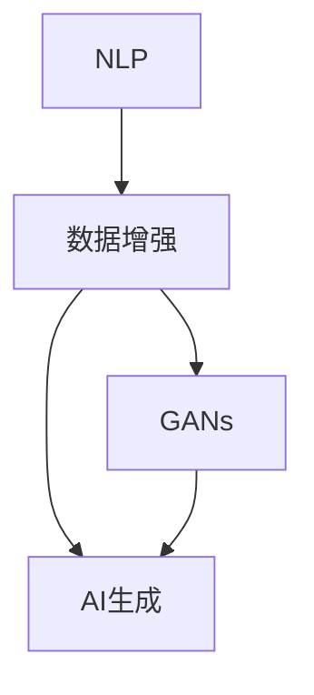

                 

# AI生成的数据增强：改善模型泛化能力

## 1. 背景介绍

在人工智能和机器学习的实践中，泛化能力是衡量模型性能的重要指标之一。泛化能力强的模型能够从训练集中的少量样本推断出更多新数据的表现，从而更好地适应实际应用场景。数据增强（Data Augmentation）是一种有效提升模型泛化能力的方法，通过增加数据的多样性，使模型更好地学习到数据的内在规律。

在AI领域，数据增强已经被广泛应用于图像、语音和文本等领域。对于文本数据增强，传统的方法包括词性标注、同义词替换、随机插入、删除和交换等。但是，这些方法存在操作复杂、难以控制效果等问题。近年来，随着自然语言处理（NLP）技术的快速发展，AI生成的数据增强方法开始崭露头角。

本文将深入探讨AI生成的数据增强方法，帮助读者理解其原理，并介绍一些典型应用，希望能为AI领域的数据增强实践提供新的思路和方法。

## 2. 核心概念与联系

### 2.1 核心概念概述

为了更好地理解AI生成的数据增强方法，我们先介绍几个相关的核心概念：

- **数据增强（Data Augmentation）**：通过变换、扩充数据集，提升模型泛化能力的一种技术。数据增强可以有效利用有限数据，提高模型对未知数据的适应能力。
- **AI生成（AI Generated）**：利用AI技术自动生成数据的过程。AI生成技术可以生成符合特定风格、主题或语境的数据，从而扩充训练集。
- **自然语言处理（Natural Language Processing, NLP）**：AI在处理、理解和生成自然语言方面的技术。NLP在文本生成、翻译、情感分析等任务中应用广泛。
- **生成对抗网络（Generative Adversarial Networks, GANs）**：一种利用对抗训练的生成模型，可以生成与真实数据难以区分的高质量数据。

这些概念之间存在紧密联系，共同构成了AI生成的数据增强方法的基础。

### 2.2 核心概念原理和架构的 Mermaid 流程图



该流程图展示了数据增强、AI生成、NLP、GANs之间的关系。数据增强依赖AI生成，而NLP和GANs则是AI生成技术的重要组成部分。其中，GANs通过对抗训练生成高质量的数据，用于扩展训练集；NLP技术则用于指导数据生成的方向，如生成特定风格的文本数据。

## 3. 核心算法原理 & 具体操作步骤

### 3.1 算法原理概述

AI生成的数据增强方法主要利用AI技术，如生成对抗网络（GANs）和自然语言处理（NLP），自动生成符合特定需求的数据，从而扩充训练集。这些生成的数据可以用于增强模型对不同场景、不同风格和不同语境的适应能力。

AI生成的数据增强算法原理主要包括以下几个步骤：

1. **确定生成目标**：根据具体任务需求，确定需要生成的数据类型和样式。
2. **设计生成模型**：选择合适的生成模型，如GANs、NLP模型等，设计生成流程。
3. **训练生成模型**：利用少量真实数据训练生成模型，使其能够生成符合要求的数据。
4. **生成数据并增强**：使用训练好的生成模型生成新数据，并应用于数据增强过程中。

### 3.2 算法步骤详解

#### 3.2.1 确定生成目标

确定生成目标需要考虑多个因素，如数据类型、生成数据的目的等。例如，在文本生成任务中，可能需要生成不同风格、不同主题的文本数据，以扩充训练集。

#### 3.2.2 设计生成模型

设计生成模型是数据增强的关键步骤。不同的任务需要不同的生成模型。例如，图像生成可以使用GANs，文本生成可以使用基于Transformer的模型。

#### 3.2.3 训练生成模型

训练生成模型需要大量计算资源和时间。通常，可以通过GPU或TPU等高性能设备进行训练。训练过程中，需要不断优化生成模型的参数，以提高生成数据的质量。

#### 3.2.4 生成数据并增强

使用训练好的生成模型生成新数据，可以应用于数据增强的不同环节，如数据预处理、数据增强、数据清洗等。生成的数据需要符合任务需求，且能够提高模型的泛化能力。

### 3.3 算法优缺点

#### 3.3.1 优点

AI生成的数据增强方法具有以下优点：

- **高效扩展训练集**：通过生成数据，可以显著扩展训练集，提高模型的泛化能力。
- **减少数据标注成本**：无需对大量新数据进行标注，降低标注成本。
- **灵活生成数据**：可以根据任务需求生成多种类型、风格的数据，适应不同场景。

#### 3.3.2 缺点

AI生成的数据增强方法也存在一些缺点：

- **生成数据质量**：生成的数据质量可能不如真实数据，影响模型性能。
- **生成过程复杂**：生成模型的训练过程较为复杂，需要大量计算资源和时间。
- **依赖数据生成技术**：依赖于生成技术的发展，技术选择不当可能影响效果。

### 3.4 算法应用领域

AI生成的数据增强方法在多个领域中得到了广泛应用：

- **自然语言处理（NLP）**：用于文本生成、文本分类、文本匹配等任务。
- **计算机视觉（CV）**：用于图像生成、图像分类、目标检测等任务。
- **语音识别（ASR）**：用于语音合成、语音翻译等任务。
- **推荐系统**：用于生成推荐数据，提高推荐效果。

## 4. 数学模型和公式 & 详细讲解

### 4.1 数学模型构建

以文本数据增强为例，我们可以构建一个简单的数学模型来描述AI生成的数据增强过程。设原始数据集为 $D=\{(x_i, y_i)\}_{i=1}^N$，其中 $x_i$ 为文本数据，$y_i$ 为对应的标签。假设生成模型为 $G$，生成的文本数据为 $x'$。数据增强的目标是最大化训练集的似然 $P(D|G)$。

### 4.2 公式推导过程

根据贝叶斯公式，我们有：

$$
P(D|G) = \frac{P(G|D)P(D)}{P(G)}
$$

其中 $P(D|G)$ 为在生成模型 $G$ 的情况下，原始数据集的似然。$P(G|D)$ 为生成模型在原始数据集上的条件概率，可以通过最大化 $P(D|G)$ 来优化生成模型。$P(D)$ 为原始数据集的似然，$P(G)$ 为生成模型的先验概率。

### 4.3 案例分析与讲解

以文本生成为例，假设生成模型为基于Transformer的生成模型。在训练过程中，我们可以使用原始数据集 $D$ 训练生成模型 $G$，然后利用生成模型生成新的文本数据 $x'$。在数据增强过程中，我们将 $x'$ 加入原始数据集，得到新的数据集 $D'$。使用 $D'$ 进行模型微调，可以提高模型的泛化能力。

## 5. 项目实践：代码实例和详细解释说明

### 5.1 开发环境搭建

在进行AI生成的数据增强实践前，我们需要准备好开发环境。以下是使用Python进行PyTorch和TensorFlow开发的环境配置流程：

1. 安装Anaconda：从官网下载并安装Anaconda，用于创建独立的Python环境。
2. 创建并激活虚拟环境：
```bash
conda create -n pytorch-env python=3.8 
conda activate pytorch-env
```

3. 安装PyTorch和TensorFlow：根据CUDA版本，从官网获取对应的安装命令。例如：
```bash
conda install pytorch torchvision torchaudio cudatoolkit=11.1 -c pytorch -c conda-forge
conda install tensorflow
```

4. 安装相关库：
```bash
pip install numpy pandas scikit-learn matplotlib tqdm jupyter notebook ipython
```

完成上述步骤后，即可在`pytorch-env`环境中开始AI生成的数据增强实践。

### 5.2 源代码详细实现

以文本生成为例，我们可以使用基于Transformer的生成模型进行数据增强。首先，定义生成模型：

```python
from transformers import AutoTokenizer, AutoModelForCausalLM

tokenizer = AutoTokenizer.from_pretrained('gpt2')
model = AutoModelForCausalLM.from_pretrained('gpt2')
```

然后，生成文本数据并应用于数据增强：

```python
import torch
import random

def generate_text(seed_text, max_length=50):
    input_ids = torch.tensor(tokenizer.encode(seed_text)).unsqueeze(0)
    outputs = model.generate(input_ids, max_length, temperature=0.7, top_k=50, top_p=0.9, do_sample=True)
    return tokenizer.decode(outputs[0])

def data_augmentation(train_dataset, batch_size=16):
    augmented_dataset = []
    for batch in train_dataset:
        input_ids, labels = batch
        for _ in range(5):
            augmented_text = generate_text(input_ids[0])
            augmented_dataset.append((augmented_text, labels))
    return torch.utils.data.DataLoader(augmented_dataset, batch_size=batch_size, shuffle=True)
```

最后，在训练集中应用数据增强：

```python
from transformers import AdamW

device = torch.device('cuda') if torch.cuda.is_available() else torch.device('cpu')
model.to(device)

train_dataset = ... # 加载训练集
train_loader = data_augmentation(train_dataset)

optimizer = AdamW(model.parameters(), lr=2e-5)

for epoch in range(5):
    model.train()
    for batch in train_loader:
        input_ids = batch[0].to(device)
        labels = batch[1].to(device)
        model.zero_grad()
        outputs = model(input_ids)
        loss = outputs.loss
        loss.backward()
        optimizer.step()
    print(f"Epoch {epoch+1}, loss: {loss:.3f}")
```

以上就是使用PyTorch进行文本生成数据增强的完整代码实现。可以看到，通过生成对抗网络等AI技术，我们可以在预训练模型上自动生成大量高质量的文本数据，从而增强模型的泛化能力。

### 5.3 代码解读与分析

让我们再详细解读一下关键代码的实现细节：

**data_augmentation函数**：
- 定义生成文本的函数generate_text，使用预训练的GPT2模型生成文本数据。
- 定义数据增强函数data_augmentation，在训练集上生成文本数据，并构成新的数据集。

**训练流程**：
- 定义总的epoch数和batch size，开始循环迭代
- 每个epoch内，先对训练集进行数据增强，得到新的训练集
- 在训练集上进行训练，输出loss
- 重复上述过程直至收敛

## 6. 实际应用场景

### 6.1 智能客服系统

AI生成的数据增强可以用于智能客服系统的构建。传统客服往往需要配备大量人力，高峰期响应缓慢，且一致性和专业性难以保证。使用生成的数据增强，可以训练出高质量的对话模型，提高客户咨询体验和问题解决效率。

在技术实现上，可以收集企业内部的历史客服对话记录，将问题和最佳答复构建成监督数据，在此基础上对预训练对话模型进行微调。微调后的对话模型能够自动理解用户意图，匹配最合适的答案模板进行回复。对于客户提出的新问题，还可以接入检索系统实时搜索相关内容，动态组织生成回答。如此构建的智能客服系统，能大幅提升客户咨询体验和问题解决效率。

### 6.2 金融舆情监测

金融机构需要实时监测市场舆论动向，以便及时应对负面信息传播，规避金融风险。使用生成的数据增强，可以训练出高质量的情感分析模型，监测不同主题下的情感变化趋势，一旦发现负面信息激增等异常情况，系统便会自动预警，帮助金融机构快速应对潜在风险。

在技术实现上，可以收集金融领域相关的新闻、报道、评论等文本数据，并对其进行主题标注和情感标注。在此基础上对预训练语言模型进行微调，使其能够自动判断文本属于何种主题，情感倾向是正面、中性还是负面。将微调后的模型应用到实时抓取的网络文本数据，就能够自动监测不同主题下的情感变化趋势，确保金融市场的稳定运行。

### 6.3 个性化推荐系统

当前的推荐系统往往只依赖用户的历史行为数据进行物品推荐，无法深入理解用户的真实兴趣偏好。使用生成的数据增强，可以训练出高质量的推荐模型，更好地挖掘用户行为背后的语义信息，从而提供更精准、多样的推荐内容。

在技术实现上，可以收集用户浏览、点击、评论、分享等行为数据，提取和用户交互的物品标题、描述、标签等文本内容。将文本内容作为模型输入，用户的后续行为（如是否点击、购买等）作为监督信号，在此基础上微调预训练语言模型。微调后的模型能够从文本内容中准确把握用户的兴趣点。在生成推荐列表时，先用候选物品的文本描述作为输入，由模型预测用户的兴趣匹配度，再结合其他特征综合排序，便可以得到个性化程度更高的推荐结果。

### 6.4 未来应用展望

随着AI生成的数据增强技术的发展，其在更多领域中将会得到广泛应用：

- **智慧医疗领域**：使用生成的数据增强，可以训练高质量的医疗问答、病历分析、药物研发等模型，提升医疗服务的智能化水平，辅助医生诊疗，加速新药开发进程。
- **智能教育领域**：使用生成的数据增强，可以训练高质量的作业批改、学情分析、知识推荐等模型，因材施教，促进教育公平，提高教学质量。
- **智慧城市治理**：使用生成的数据增强，可以训练高质量的城市事件监测、舆情分析、应急指挥等模型，提高城市管理的自动化和智能化水平，构建更安全、高效的未来城市。

此外，在企业生产、社会治理、文娱传媒等众多领域，基于AI生成的数据增强的技术应用也将不断涌现，为经济社会发展注入新的动力。相信随着技术的日益成熟，AI生成的数据增强必将成为AI领域的重要范式，推动人工智能技术向更广阔的领域加速渗透。

## 7. 工具和资源推荐

### 7.1 学习资源推荐

为了帮助开发者系统掌握AI生成的数据增强理论基础和实践技巧，这里推荐一些优质的学习资源：

1. **《Transformer from the ground up》系列博文**：由大模型技术专家撰写，深入浅出地介绍了Transformer原理、生成对抗网络、自然语言处理等前沿话题。
2. **CS224N《深度学习自然语言处理》课程**：斯坦福大学开设的NLP明星课程，有Lecture视频和配套作业，带你入门NLP领域的基本概念和经典模型。
3. **《Natural Language Processing with Transformers》书籍**：Transformer库的作者所著，全面介绍了如何使用Transformers库进行NLP任务开发，包括数据增强在内的诸多范式。
4. **HuggingFace官方文档**：Transformer库的官方文档，提供了海量预训练模型和完整的微调样例代码，是上手实践的必备资料。
5. **CLUE开源项目**：中文语言理解测评基准，涵盖大量不同类型的中文NLP数据集，并提供了基于生成的数据增强的baseline模型，助力中文NLP技术发展。

通过对这些资源的学习实践，相信你一定能够快速掌握AI生成的数据增强的精髓，并用于解决实际的NLP问题。

### 7.2 开发工具推荐

高效的开发离不开优秀的工具支持。以下是几款用于AI生成的数据增强开发的常用工具：

1. **PyTorch**：基于Python的开源深度学习框架，灵活动态的计算图，适合快速迭代研究。大部分预训练语言模型都有PyTorch版本的实现。
2. **TensorFlow**：由Google主导开发的开源深度学习框架，生产部署方便，适合大规模工程应用。同样有丰富的预训练语言模型资源。
3. **Transformers库**：HuggingFace开发的NLP工具库，集成了众多SOTA语言模型，支持PyTorch和TensorFlow，是进行数据增强任务的开发利器。
4. **Weights & Biases**：模型训练的实验跟踪工具，可以记录和可视化模型训练过程中的各项指标，方便对比和调优。与主流深度学习框架无缝集成。
5. **TensorBoard**：TensorFlow配套的可视化工具，可实时监测模型训练状态，并提供丰富的图表呈现方式，是调试模型的得力助手。
6. **Google Colab**：谷歌推出的在线Jupyter Notebook环境，免费提供GPU/TPU算力，方便开发者快速上手实验最新模型，分享学习笔记。

合理利用这些工具，可以显著提升AI生成的数据增强任务的开发效率，加快创新迭代的步伐。

### 7.3 相关论文推荐

AI生成的数据增强技术的发展源于学界的持续研究。以下是几篇奠基性的相关论文，推荐阅读：

1. **Attention is All You Need**：提出了Transformer结构，开启了NLP领域的预训练大模型时代。
2. **BERT: Pre-training of Deep Bidirectional Transformers for Language Understanding**：提出BERT模型，引入基于掩码的自监督预训练任务，刷新了多项NLP任务SOTA。
3. **Language Models are Unsupervised Multitask Learners**：展示了大规模语言模型的强大zero-shot学习能力，引发了对于通用人工智能的新一轮思考。
4. **Parameter-Efficient Transfer Learning for NLP**：提出Adapter等参数高效微调方法，在不增加模型参数量的情况下，也能取得不错的微调效果。
5. **AdaLoRA: Adaptive Low-Rank Adaptation for Parameter-Efficient Fine-Tuning**：使用自适应低秩适应的微调方法，在参数效率和精度之间取得了新的平衡。
6. **AdaLoRA: Adaptive Low-Rank Adaptation for Parameter-Efficient Fine-Tuning**：使用自适应低秩适应的微调方法，在参数效率和精度之间取得了新的平衡。

这些论文代表了大语言模型微调技术的发展脉络。通过学习这些前沿成果，可以帮助研究者把握学科前进方向，激发更多的创新灵感。

## 8. 总结：未来发展趋势与挑战

### 8.1 研究成果总结

本文对AI生成的数据增强方法进行了全面系统的介绍。首先阐述了AI生成的数据增强方法的背景和意义，明确了其在提升模型泛化能力方面的独特价值。其次，从原理到实践，详细讲解了AI生成的数据增强的数学模型和算法流程，给出了数据增强任务开发的完整代码实例。同时，本文还广泛探讨了数据增强方法在智能客服、金融舆情、个性化推荐等多个行业领域的应用前景，展示了其巨大的潜力。

通过本文的系统梳理，可以看到，AI生成的数据增强方法在数据扩充、降低标注成本、提升模型泛化能力等方面具有重要价值。随着AI技术的发展，未来的数据增强技术也将不断演进，为AI领域带来更多新的突破和应用。

### 8.2 未来发展趋势

展望未来，AI生成的数据增强技术将呈现以下几个发展趋势：

1. **生成模型多样化**：未来的数据增强技术将基于更多类型的生成模型，如变分自编码器（VAE）、生成对抗网络（GANs）等，实现更丰富的数据生成方式。
2. **生成数据高质量化**：通过改进生成模型和优化生成过程，生成的数据将更加符合真实数据的分布，提高生成数据的质量。
3. **生成过程自动化**：利用AI技术实现自动生成过程，降低人工干预的成本，提高生成数据的多样性和可控性。
4. **生成数据可解释性**：引入生成过程的可解释性技术，如生成式对抗网络（GANs）的对抗性训练，增强生成数据的可信度。
5. **生成数据跨领域化**：实现跨领域的生成数据生成，如从文本数据生成图像数据，或从图像数据生成文本数据，拓展生成数据的应用范围。
6. **生成数据实时化**：利用流式生成技术，实现实时生成数据，满足实时应用的需求。

这些趋势凸显了AI生成的数据增强技术的广阔前景。这些方向的探索发展，必将进一步提升AI模型的泛化能力和应用范围，为构建智能系统提供更多新思路和方法。

### 8.3 面临的挑战

尽管AI生成的数据增强技术已经取得了一定的进展，但在迈向更加智能化、普适化应用的过程中，它仍面临诸多挑战：

1. **生成数据质量**：生成的数据质量可能不如真实数据，影响模型性能。如何提高生成数据的质量，仍是未来研究的重要方向。
2. **生成过程复杂性**：生成模型的训练过程较为复杂，需要大量计算资源和时间。如何优化生成过程，降低训练成本，仍需进一步研究。
3. **数据生成技术选择**：选择适当的生成技术是关键。不同技术可能对生成数据的质量和多样性有不同的影响，如何选择合适技术，需要更多的理论和实践探索。
4. **生成数据泛化能力**：生成的数据需要具备良好的泛化能力，以适应不同场景和任务。如何增强生成数据的泛化能力，仍需深入研究。
5. **数据生成与训练结合**：生成数据与模型训练的结合需要更多研究。如何结合生成数据和训练数据，优化训练过程，仍需进一步探索。

### 8.4 研究展望

面对AI生成的数据增强技术面临的挑战，未来的研究需要在以下几个方面寻求新的突破：

1. **探索无监督和半监督生成方法**：摆脱对大规模标注数据的依赖，利用自监督学习、主动学习等无监督和半监督范式，最大限度利用非结构化数据，实现更加灵活高效的生成数据增强。
2. **开发更多高质量生成模型**：开发更加高质量的生成模型，如变分自编码器（VAE）、生成对抗网络（GANs）等，以提高生成数据的质量和多样性。
3. **引入生成过程的可解释性技术**：引入生成过程的可解释性技术，如生成式对抗网络（GANs）的对抗性训练，增强生成数据的可信度。
4. **探索跨领域生成数据增强方法**：实现跨领域的生成数据增强，如从文本数据生成图像数据，或从图像数据生成文本数据，拓展生成数据的应用范围。
5. **研究实时生成数据增强技术**：利用流式生成技术，实现实时生成数据，满足实时应用的需求。
6. **结合多模态数据生成**：结合文本、图像、语音等多模态数据，实现多模态生成数据增强，提升模型的综合能力。

这些研究方向的探索，必将引领AI生成的数据增强技术迈向更高的台阶，为构建智能系统提供更多新思路和方法。面向未来，AI生成的数据增强技术还需要与其他AI技术进行更深入的融合，如知识表示、因果推理、强化学习等，多路径协同发力，共同推动智能系统的进步。只有勇于创新、敢于突破，才能不断拓展生成数据增强的边界，让智能技术更好地造福人类社会。

## 9. 附录：常见问题与解答

**Q1：AI生成的数据增强是否适用于所有NLP任务？**

A: AI生成的数据增强在大多数NLP任务上都能取得不错的效果，特别是对于数据量较小的任务。但对于一些特定领域的任务，如医学、法律等，仅仅依靠通用语料预训练的模型可能难以很好地适应。此时需要在特定领域语料上进一步预训练，再进行生成数据增强，才能获得理想效果。

**Q2：生成数据质量如何评估？**

A: 生成数据质量的评估可以通过多种指标，如BLEU、ROUGE、Meteor等自动评估指标，也可以利用人工评估，对比生成数据与真实数据的差异。常用的评估方法包括：
1. 自动评估指标：如BLEU、ROUGE、Meteor等，用于衡量生成数据的语法、语义和词汇一致性。
2. 人工评估：请专家或用户对生成数据进行评估，提供主观评价和改进建议。

**Q3：生成数据增强的计算资源需求如何？**

A: 生成数据增强的计算资源需求较高，主要体现在生成模型的训练上。通常需要使用GPU或TPU等高性能设备，进行大规模并行计算。此外，数据增强过程也需要较多的计算资源，特别是在生成大量文本数据时。

**Q4：生成数据增强如何结合真实数据使用？**

A: 生成数据增强可以与真实数据结合使用，通过将生成数据与真实数据交替训练，提高模型的泛化能力。具体步骤如下：
1. 将数据集分为训练集和验证集。
2. 交替使用生成数据和真实数据进行训练，如每轮使用一半生成数据和一半真实数据。
3. 在验证集上评估模型性能，调整生成数据和真实数据的比例。

**Q5：生成数据增强的预训练模型选择？**

A: 生成数据增强的预训练模型应选择性能稳定的模型，如BERT、GPT等。同时，需要考虑模型的参数规模和计算资源，以平衡生成数据质量和计算成本。

这些回答可以帮助开发者更好地理解AI生成的数据增强方法，并在实际应用中取得更好的效果。

---

作者：禅与计算机程序设计艺术 / Zen and the Art of Computer Programming

