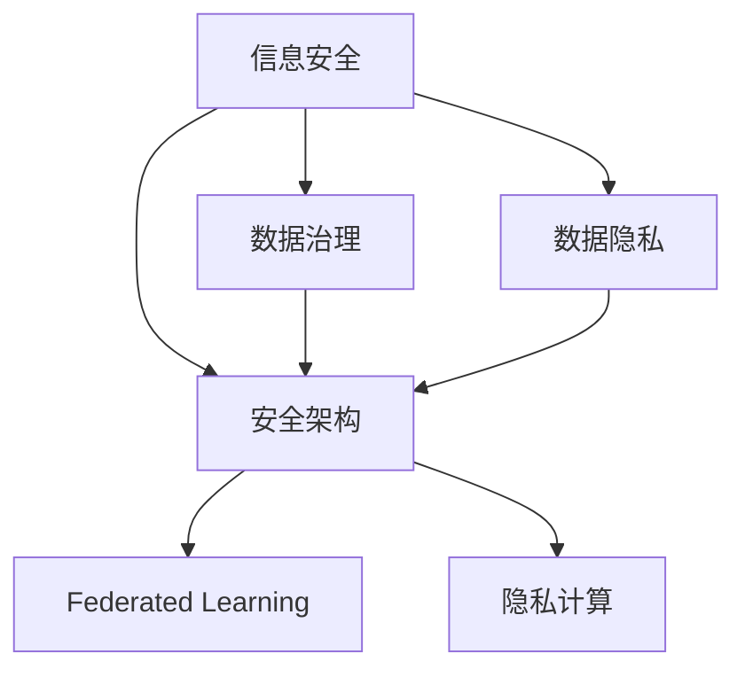

                 

# AI系统的信息化与安全性

> 关键词：AI系统, 信息安全, 数据隐私, 数据治理, 安全架构, 联邦学习, 隐私计算, 数据生命周期管理

## 1. 背景介绍

在数字化转型的背景下，AI系统已成为各行业提高效率、优化决策的关键手段。然而，随着AI应用的深入，信息安全与数据隐私等问题也日益凸显。如何构建可靠、安全的AI系统，成为了当前和未来科技发展的重点之一。

### 1.1 问题由来

近年来，随着深度学习和大数据技术的迅猛发展，AI系统在智能推荐、图像识别、语音识别、自然语言处理等领域取得了显著的进步。AI系统的广泛应用极大提升了企业的竞争力，但同时也带来了诸多挑战：

1. **数据隐私**：AI系统需要大量数据进行训练和优化，而数据隐私问题成为了公众关注的焦点。如何保护用户数据不被滥用，成为了一个重要的议题。

2. **信息安全**：AI系统在自动化和智能化的同时，也成为了黑客攻击的重要目标。确保系统的安全性和可靠性，成为了必须面对的难题。

3. **模型偏见**：由于训练数据的不均衡和偏见，AI系统可能输出有偏见的结果，导致歧视性、不公平的决策。

4. **系统透明**：AI系统往往被认为是“黑箱”，难以解释其决策过程。这在使用AI系统的多个领域，特别是医疗、金融等领域，造成了信任危机。

5. **数据治理**：AI系统的复杂性和多样性要求建立全面的数据治理体系，包括数据收集、存储、处理、分析等环节的标准化和自动化。

针对上述问题，本文将从信息安全与数据隐私两个维度，探讨如何构建安全可靠的AI系统。通过深入分析信息安全与数据隐私的核心概念及其联系，提出一系列有效的策略和措施，以期为读者提供系统化的解决方案。

## 2. 核心概念与联系

### 2.1 核心概念概述

AI系统的信息化与安全性涉及多个核心概念，包括信息安全、数据隐私、数据治理、安全架构、联邦学习、隐私计算等。这些概念之间具有紧密的联系，相互影响，共同构成了AI系统的完整信息安全体系。

- **信息安全（Information Security）**：保护AI系统免受非法攻击、恶意操作或技术缺陷的影响，确保系统的完整性和可用性。

- **数据隐私（Data Privacy）**：保护数据主体的隐私权利，防止数据泄露、滥用或未经授权的访问。

- **数据治理（Data Governance）**：管理和规范数据的收集、存储、处理和分析等环节，确保数据质量、安全性和合规性。

- **安全架构（Security Architecture）**：通过设计安全策略、技术措施和管理流程，构建多层次、多维度的安全防护体系。

- **联邦学习（Federated Learning）**：在分散的数据源上联合训练模型，保护数据隐私的同时实现模型优化。

- **隐私计算（Privacy-Preserving Computing）**：在不泄露数据的前提下，对数据进行处理和分析，保护数据隐私。

这些概念之间的逻辑关系可以通过以下Mermaid流程图来展示：



这个流程图展示了一个完整的AI系统信息安全体系：

1. 信息安全是构建AI系统的基础，保护系统免受非法攻击。
2. 数据隐私是信息安全的重要组成部分，保护数据不被滥用。
3. 数据治理是信息安全的重要保障，确保数据质量和安全。
4. 安全架构则是信息安全的具体实现，通过技术和管理手段构建防护体系。
5. 联邦学习和隐私计算是信息安全的新兴技术，在保护隐私的同时实现模型优化。

## 3. 核心算法原理 & 具体操作步骤

### 3.1 算法原理概述

AI系统的信息化与安全性涉及多个核心算法和技术，包括安全模型训练、隐私保护技术、数据治理方法等。其核心原理是通过设计安全策略、应用先进技术和管理手段，构建全面的信息安全体系。

### 3.2 算法步骤详解

构建安全可靠的AI系统需要以下关键步骤：

**Step 1: 数据收集与治理**

- 数据收集：根据业务需求，从多渠道收集数据，如用户行为数据、公共数据、合作伙伴数据等。
- 数据治理：建立数据收集、存储、处理、分析等环节的标准化流程，确保数据质量和安全。

**Step 2: 数据加密与访问控制**

- 数据加密：对数据进行加密保护，确保数据在传输和存储过程中的安全性。
- 访问控制：设置数据访问权限，确保只有授权人员能够访问和使用数据。

**Step 3: 安全模型训练与优化**

- 安全模型训练：在数据加密和访问控制的基础上，进行安全模型训练，避免数据泄露。
- 模型优化：通过联邦学习、隐私计算等技术，在保护隐私的前提下优化模型性能。

**Step 4: 安全监控与审计**

- 安全监控：实时监测系统运行状态，及时发现和应对安全威胁。
- 安全审计：定期进行安全审计，评估系统安全性和合规性。

**Step 5: 应急响应与恢复**

- 应急响应：在发现安全威胁时，迅速采取措施，阻止进一步损害。
- 系统恢复：在应急响应后，确保系统恢复正常运行，恢复数据和模型。

### 3.3 算法优缺点

构建安全可靠的AI系统具有以下优点：

- **提高数据安全性**：通过数据加密、访问控制等技术，确保数据在传输和存储过程中的安全性。
- **保护隐私权利**：通过联邦学习、隐私计算等技术，保护用户数据隐私，避免数据滥用。
- **优化模型性能**：通过安全模型训练和优化，提高模型性能，增强AI系统的实用性和竞争力。

然而，构建安全可靠的AI系统也存在一些缺点：

- **技术复杂**：需要应用多种先进技术和管理手段，技术门槛较高。
- **成本高**：数据加密、安全模型训练等过程需要较大的计算资源和人力投入。
- **易受攻击**：安全措施虽然能够提高安全性，但并不能完全避免攻击。

### 3.4 算法应用领域

基于安全可靠的AI系统构建方法，可以在多个领域中得到广泛应用：

- **金融科技**：在金融领域，保护用户隐私和数据安全至关重要。AI系统应用于信用评分、风险管理、反欺诈等领域，需要确保数据的安全性和合规性。
- **医疗健康**：在医疗健康领域，保护患者隐私和数据安全是关键。AI系统应用于疾病预测、诊断、治疗等领域，需要确保数据的安全性和隐私性。
- **智能制造**：在智能制造领域，数据安全和管理是基础。AI系统应用于生产优化、质量控制、预测性维护等领域，需要确保数据的质量和安全。
- **智能交通**：在智能交通领域，数据安全和隐私保护是重要保障。AI系统应用于交通流量预测、事故预防、智能调度等领域，需要确保数据的安全性和隐私性。

## 4. 数学模型和公式 & 详细讲解 & 举例说明

### 4.1 数学模型构建

构建安全可靠的AI系统需要构建多个数学模型，包括数据治理模型、安全模型训练模型、隐私保护模型等。这些模型通过数学公式和算法描述，确保系统的安全性、可靠性和合规性。

### 4.2 公式推导过程

以下以安全模型训练为例，推导安全模型训练的数学模型和公式。

假设AI系统需要进行模型训练，数据集为 $D=\{(x_i, y_i)\}_{i=1}^N$，其中 $x_i$ 为输入，$y_i$ 为标签。在安全模型训练中，数据集 $D$ 需要在多个参与方之间进行联合训练，每个参与方拥有部分数据，数据量为 $n$。

定义安全模型训练的目标函数为 $L(D)$，目标是最小化该函数。假设每个参与方在本地对数据进行训练，得到本地模型参数 $\theta_i$，然后通过联邦学习技术聚合这些本地模型参数，得到全局模型参数 $\theta$。

安全模型训练的数学模型为：

$$
\min_{\theta} \sum_{i=1}^n L_i(\theta)
$$

其中 $L_i(\theta)$ 为第 $i$ 个参与方的损失函数。假设 $L_i(\theta)$ 为 $L(\theta)$ 的加权和，即：

$$
L_i(\theta) = \frac{1}{|D_i|} \sum_{j=1}^{|D_i|} l_i(x_j, y_j, \theta)
$$

其中 $l_i(x_j, y_j, \theta)$ 为第 $i$ 个参与方的局部损失函数，$|D_i|$ 为第 $i$ 个参与方拥有的数据量。

通过求解上述优化问题，可以在保护数据隐私的前提下，得到全局最优模型参数 $\theta$。

### 4.3 案例分析与讲解

**案例1: 联邦学习在医疗数据共享中的应用**

在医疗数据共享中，保护患者隐私和数据安全至关重要。通过联邦学习技术，可以在多个医疗机构之间联合训练AI模型，共享模型参数，同时不泄露患者数据。

假设某医疗机构有 $n$ 个患者数据样本，每个样本包含患者的医疗记录、体检结果等。医疗机构希望利用这些数据训练一个疾病预测模型，但每个患者的医疗记录都是敏感数据，不能直接共享。

通过联邦学习技术，每个医疗机构可以在本地对数据进行训练，得到本地模型参数 $\theta_i$。然后，通过聚合这些本地模型参数，得到全局模型参数 $\theta$。在聚合过程中，只有模型参数被共享，不涉及患者数据，确保了数据的安全性和隐私性。

**案例2: 隐私计算在金融风控中的应用**

在金融风控领域，保护用户数据隐私至关重要。通过隐私计算技术，可以在不泄露用户数据的情况下，利用用户数据进行风险评估和模型训练。

假设某金融机构有 $n$ 个用户数据样本，每个样本包含用户的消费记录、信用评分等。金融机构希望利用这些数据训练一个风险评估模型，但每个用户的数据都是敏感数据，不能直接共享。

通过隐私计算技术，每个金融机构可以在本地对数据进行训练，得到本地模型参数 $\theta_i$。然后，通过聚合这些本地模型参数，得到全局模型参数 $\theta$。在聚合过程中，只有模型参数被共享，不涉及用户数据，确保了数据的安全性和隐私性。

## 5. 项目实践：代码实例和详细解释说明

### 5.1 开发环境搭建

在进行安全可靠的AI系统开发时，需要准备好开发环境。以下是使用Python进行PyTorch开发的环境配置流程：

1. 安装Anaconda：从官网下载并安装Anaconda，用于创建独立的Python环境。

2. 创建并激活虚拟环境：
```bash
conda create -n ai-env python=3.8 
conda activate ai-env
```

3. 安装PyTorch：根据CUDA版本，从官网获取对应的安装命令。例如：
```bash
conda install pytorch torchvision torchaudio cudatoolkit=11.1 -c pytorch -c conda-forge
```

4. 安装相关库：
```bash
pip install numpy pandas sklearn torchmetrics tqdm
```

5. 安装TensorBoard：用于可视化模型训练过程。
```bash
pip install tensorboard
```

完成上述步骤后，即可在`ai-env`环境中开始开发实践。

### 5.2 源代码详细实现

下面以联邦学习在医疗数据共享中的应用为例，给出使用PyTorch实现联邦学习模型的代码实现。

首先，定义联邦学习模型的训练函数：

```python
import torch
import torch.nn as nn
import torch.optim as optim
from torchmetrics import Accuracy

class FLModel(nn.Module):
    def __init__(self):
        super(FLModel, self).__init__()
        self.fc1 = nn.Linear(10, 10)
        self.fc2 = nn.Linear(10, 1)
    
    def forward(self, x):
        x = self.fc1(x)
        x = nn.functional.relu(x)
        x = self.fc2(x)
        return x

def train_epoch(model, data_loader, optimizer, device, metrics):
    model.to(device)
    model.train()
    epoch_loss = 0
    epoch_acc = 0
    for batch in data_loader:
        x, y = batch
        x, y = x.to(device), y.to(device)
        optimizer.zero_grad()
        output = model(x)
        loss = nn.BCEWithLogitsLoss()(output, y)
        loss.backward()
        optimizer.step()
        epoch_loss += loss.item()
        epoch_acc += metrics(output, y).item()
    return epoch_loss / len(data_loader), epoch_acc / len(data_loader)

def evaluate(model, data_loader, device, metrics):
    model.eval()
    total_loss = 0
    total_acc = 0
    with torch.no_grad():
        for batch in data_loader:
            x, y = batch
            x, y = x.to(device), y.to(device)
            output = model(x)
            loss = nn.BCEWithLogitsLoss()(output, y)
            total_loss += loss.item()
            total_acc += metrics(output, y).item()
    return total_loss / len(data_loader), total_acc / len(data_loader)
```

然后，定义联邦学习模型的参数和优化器：

```python
class ClientDataLoader:
    def __init__(self, data):
        self.data = data
        self.shuffle()

    def shuffle(self):
        random.shuffle(self.data)

def create_clients():
    data = [torch.randn(10, 10) for _ in range(10)]
    return [ClientDataLoader(data) for _ in range(10)]

def main():
    clients = create_clients()
    model = FLModel()
    optimizer = optim.SGD(model.parameters(), lr=0.01)
    metrics = Accuracy()
    device = 'cuda' if torch.cuda.is_available() else 'cpu'
    
    for epoch in range(10):
        local_losses = []
        local_accs = []
        for client in clients:
            client_data = client.data
            local_loss, local_acc = train_epoch(model, client_data, optimizer, device, metrics)
            local_losses.append(local_loss)
            local_accs.append(local_acc)
        
        global_loss = sum(local_losses) / len(clients)
        global_acc = sum(local_accs) / len(clients)
        print(f'Epoch {epoch+1}, global loss: {global_loss:.3f}, global acc: {global_acc:.3f}')
        
    test_data = [torch.randn(10, 10) for _ in range(10)]
    test_loss, test_acc = evaluate(model, test_data, device, metrics)
    print(f'Test loss: {test_loss:.3f}, Test acc: {test_acc:.3f}')
```

最后，启动联邦学习模型训练：

```python
if __name__ == '__main__':
    main()
```

以上就是使用PyTorch实现联邦学习模型的完整代码实现。可以看到，通过定义客户端数据集和训练函数，可以方便地构建多个联邦学习节点，共同训练全局模型。

### 5.3 代码解读与分析

让我们再详细解读一下关键代码的实现细节：

**FLModel类**：
- `__init__`方法：定义模型结构，包括两个全连接层。
- `forward`方法：定义前向传播过程，输入数据通过两个全连接层，得到输出结果。

**train_epoch和evaluate函数**：
- `train_epoch`函数：定义训练过程，包括模型前向传播、损失计算、反向传播和优化器更新。
- `evaluate`函数：定义评估过程，包括模型前向传播和评估指标计算。

**ClientDataLoader类**：
- `__init__`方法：初始化数据集。
- `shuffle`方法：对数据集进行随机打乱。

**create_clients函数**：
- `create_clients`函数：创建多个客户端数据集，用于模拟联邦学习中的多个参与方。

**main函数**：
- `main`函数：定义联邦学习模型的训练和评估过程，包括训练每个客户端模型，聚合模型参数，输出训练结果。

通过以上代码，可以清晰地看到联邦学习模型的实现过程。需要注意的是，实际应用中需要进一步优化模型结构、损失函数和优化器，以适应特定的数据分布和任务需求。

## 6. 实际应用场景

### 6.1 金融风控

在金融风控领域，保护用户数据隐私至关重要。通过联邦学习技术，可以在不泄露用户数据的情况下，利用用户数据进行风险评估和模型训练。

具体而言，金融机构可以收集用户的历史交易数据、信用记录等敏感数据，并将其分发给多个参与方进行处理。每个参与方在本地对数据进行训练，得到本地模型参数，然后通过联邦学习技术聚合这些参数，得到全局模型参数。在聚合过程中，只有模型参数被共享，不涉及用户数据，确保了数据的安全性和隐私性。

### 6.2 智能制造

在智能制造领域，数据安全和隐私保护是基础。通过隐私计算技术，可以在不泄露数据的情况下，对生产数据进行分析和优化。

具体而言，智能制造系统可以收集生产设备的数据、生产线的运行状态、产品质量等敏感数据，并将其分发给多个参与方进行处理。每个参与方在本地对数据进行训练，得到本地模型参数，然后通过隐私计算技术聚合这些参数，得到全局模型参数。在聚合过程中，只有模型参数被共享，不涉及敏感数据，确保了数据的安全性和隐私性。

### 6.3 医疗健康

在医疗健康领域，保护患者隐私和数据安全至关重要。通过联邦学习技术，可以在多个医疗机构之间联合训练AI模型，共享模型参数，同时不泄露患者数据。

具体而言，医疗机构可以收集患者的医疗记录、体检结果等敏感数据，并将其分发给多个医疗机构进行处理。每个医疗机构在本地对数据进行训练，得到本地模型参数，然后通过联邦学习技术聚合这些参数，得到全局模型参数。在聚合过程中，只有模型参数被共享，不涉及患者数据，确保了数据的安全性和隐私性。

## 7. 工具和资源推荐

### 7.1 学习资源推荐

为了帮助开发者系统掌握信息安全与数据隐私的核心概念及其联系，这里推荐一些优质的学习资源：

1. 《信息安全与数据隐私》系列博文：由信息安全专家撰写，深入浅出地介绍了信息安全、数据隐私的基本概念和前沿技术。

2. 《Python数据安全》课程：通过Python实现数据加密、数据传输、访问控制等安全技术，帮助开发者掌握数据保护的基本方法。

3. 《联邦学习入门》书籍：介绍联邦学习的原理、算法和应用场景，提供丰富的实际案例和代码实现。

4. 《隐私计算技术》书籍：介绍隐私计算的原理、算法和应用场景，提供详细的技术实现和案例分析。

5. 《数据治理与数据管理》课程：介绍数据治理的基本概念、方法和管理策略，帮助开发者构建完善的数据治理体系。

通过对这些资源的学习实践，相信你一定能够系统地掌握信息安全与数据隐私的核心概念，并将其应用于实际工作中。

### 7.2 开发工具推荐

高效的工具是提高开发效率的关键。以下是几款用于信息安全与数据隐私开发的常用工具：

1. Jupyter Notebook：用于数据处理、模型训练和结果展示，支持多种语言和库的集成。

2. TensorFlow Privacy：Google开发的隐私保护库，提供多种隐私保护技术，如差分隐私、 federated learning等。

3. Apache Spark：大数据处理框架，支持分布式计算和数据治理，适用于大规模数据处理。

4. Python Package Index（PyPI）：Python包管理工具，提供大量安全相关的第三方库和工具。

5. Visual Studio Code：轻量级IDE，支持代码编写、调试和版本控制，适合快速迭代开发。

合理利用这些工具，可以显著提升信息安全与数据隐私开发的效率，加快创新迭代的步伐。

### 7.3 相关论文推荐

信息安全与数据隐私的研究源于学界的持续研究。以下是几篇奠基性的相关论文，推荐阅读：

1. 《A Secure ML for Adversarial Attacks》：介绍一种安全机器学习框架，能够防御各种类型的攻击。

2. 《Federated Learning》：介绍联邦学习的原理、算法和应用场景，提供丰富的实际案例和代码实现。

3. 《Differential Privacy》：介绍差分隐私的原理、算法和应用场景，提供详细的技术实现和案例分析。

4. 《Privacy-Preserving Multi-Party Machine Learning》：介绍多方机器学习的原理、算法和应用场景，提供详细的技术实现和案例分析。

5. 《Data Governance in Big Data Analytics》：介绍数据治理的基本概念、方法和应用场景，提供详细的技术实现和案例分析。

这些论文代表了大规模数据处理和隐私保护技术的发展脉络。通过学习这些前沿成果，可以帮助研究者把握学科前进方向，激发更多的创新灵感。

## 8. 总结：未来发展趋势与挑战

### 8.1 总结

本文对基于安全可靠的AI系统构建方法进行了全面系统的介绍。首先阐述了信息安全与数据隐私的核心概念及其联系，明确了构建安全可靠的AI系统的重要性。其次，从原理到实践，详细讲解了安全模型训练、隐私保护技术、数据治理方法等核心算法和具体操作步骤，给出了实际应用中的代码实现。同时，本文还广泛探讨了信息安全与数据隐私在多个行业领域的应用场景，展示了其广阔的应用前景。最后，本文精选了信息安全与数据隐私的学习资源和工具，力求为读者提供全方位的技术指引。

通过本文的系统梳理，可以看到，构建安全可靠的AI系统对于保护用户数据隐私和提高系统安全性至关重要。未来的AI系统将越来越依赖于数据和模型的高效治理和保护，只有全面考虑数据安全、隐私保护和系统可靠性的多方面因素，才能构建出真正可靠、安全的AI系统。

### 8.2 未来发展趋势

展望未来，信息安全与数据隐私技术将呈现以下几个发展趋势：

1. **多层次安全策略**：随着攻击手段的不断演进，未来的安全策略将更加复杂，需要构建多层次、多维度的安全防护体系。

2. **智能化安全技术**：通过引入人工智能技术，安全系统将具备更强的自主分析和应对能力，能够更加及时、准确地识别和应对安全威胁。

3. **自动化安全管理**：通过建立自动化安全管理系统，实现对数据和模型的自动监测、分析和审计，提高安全管理的效率和准确性。

4. **分布式安全体系**：随着数据处理规模的不断扩大，未来的安全体系将更加分布式，支持大规模、高并发的数据处理和保护。

5. **合规性管理**：随着法律法规的不断完善，未来的安全系统将更加注重合规性管理，确保系统的合法性和合规性。

这些趋势凸显了信息安全与数据隐私技术的前景广阔，未来将继续在各领域得到广泛应用，为构建安全可靠的AI系统提供坚实保障。

### 8.3 面临的挑战

尽管信息安全与数据隐私技术取得了显著进展，但在实现全面、可靠的安全防护体系的过程中，仍面临诸多挑战：

1. **技术复杂性**：构建复杂的安全策略和系统需要深厚的技术积累和实践经验，技术门槛较高。

2. **资源需求高**：数据加密、安全模型训练等过程需要较大的计算资源和人力投入，增加了系统的运营成本。

3. **更新迭代快**：安全威胁和攻击手段不断变化，安全系统需要不断更新和迭代，以应对新的安全挑战。

4. **跨领域协作**：信息安全与数据隐私涉及多个领域和学科，需要多方协作和跨学科合作，共同推动技术进步。

5. **法律法规变化**：随着法律法规的不断变化，安全系统需要及时调整和更新，以适应新的法律要求。

这些挑战需要技术、管理和法规等多方面的协同努力，只有持续改进和创新，才能构建更加全面、可靠的安全体系。

### 8.4 研究展望

面向未来，信息安全与数据隐私技术的研究和应用将进一步深入：

1. **跨领域融合**：将信息安全与数据隐私技术与区块链、物联网等新兴技术相结合，构建更加全面、高效的安全体系。

2. **多模态融合**：通过引入多模态数据融合技术，提升系统的感知能力和决策能力，增强系统的鲁棒性和安全性。

3. **智能化决策**：通过引入人工智能技术，提升系统的自主分析和应对能力，实现更加智能化的安全防护。

4. **自动化管理**：通过建立自动化安全管理系统，实现对数据和模型的自动监测、分析和审计，提高安全管理的效率和准确性。

5. **跨行业应用**：将信息安全与数据隐私技术广泛应用于医疗、金融、智能制造等多个行业，推动各行各业的数字化转型。

这些研究方向将为信息安全与数据隐私技术带来新的突破，为构建更加全面、可靠的安全体系提供更多可能性。

## 9. 附录：常见问题与解答

**Q1：如何构建安全可靠的信息安全与数据隐私系统？**

A: 构建安全可靠的信息安全与数据隐私系统需要以下关键步骤：
1. 数据收集与治理：建立数据收集、存储、处理、分析等环节的标准化流程，确保数据质量和安全。
2. 数据加密与访问控制：对数据进行加密保护，设置数据访问权限，确保只有授权人员能够访问和使用数据。
3. 安全模型训练与优化：在数据加密和访问控制的基础上，进行安全模型训练，避免数据泄露。通过联邦学习、隐私计算等技术，在保护隐私的前提下优化模型性能。
4. 安全监控与审计：实时监测系统运行状态，定期进行安全审计，评估系统安全性和合规性。
5. 应急响应与恢复：在发现安全威胁时，迅速采取措施，阻止进一步损害。在应急响应后，确保系统恢复正常运行，恢复数据和模型。

**Q2：联邦学习和隐私计算有什么区别？**

A: 联邦学习和隐私计算都是用于保护数据隐私的技术，但具体实现方式有所不同：
1. 联邦学习：多个参与方共同训练一个全局模型，但每个参与方只在自己的数据集上进行训练，不共享原始数据。通过聚合各个参与方的模型参数，得到全局最优模型。联邦学习适用于大规模数据集的处理和模型优化。
2. 隐私计算：在不共享原始数据的前提下，对数据进行处理和分析，保护数据隐私。隐私计算适用于单个参与方的数据保护，通过加密、差分隐私等技术实现数据隐私保护。

**Q3：如何应对数据隐私的挑战？**

A: 应对数据隐私的挑战需要从多个方面入手：
1. 数据加密：对数据进行加密保护，确保数据在传输和存储过程中的安全性。
2. 差分隐私：通过引入差分隐私技术，确保数据处理过程中的隐私性，避免数据泄露。
3. 数据脱敏：对数据进行脱敏处理，去除敏感信息，保护数据隐私。
4. 访问控制：设置数据访问权限，确保只有授权人员能够访问和使用数据。
5. 多模型集成：训练多个模型，取平均输出，抑制过拟合，保护数据隐私。

这些策略需要根据具体应用场景进行灵活组合，才能最大限度地保护数据隐私。

---

作者：禅与计算机程序设计艺术 / Zen and the Art of Computer Programming

