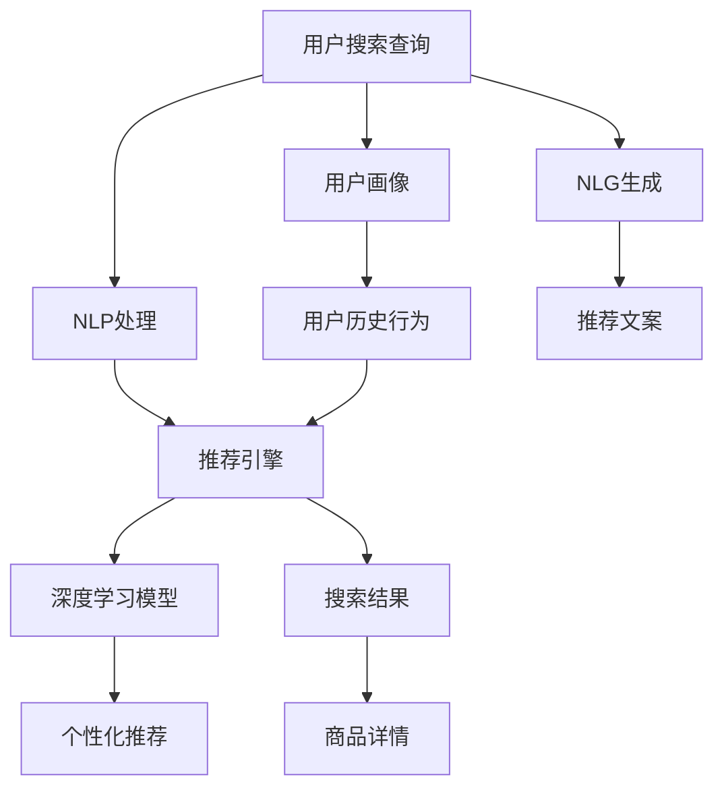

                 

# AI赋能电商搜索导购：提升用户体验和转化率的实践案例

> 关键词：人工智能,电商搜索,导购系统,用户体验,转化率,推荐算法,自然语言处理,NLP

## 1. 背景介绍

### 1.1 问题由来

在电子商务的繁荣与竞争中，用户体验（User Experience, UX）和转化率（Conversion Rate, CR）成为了决定企业成败的关键指标。优质的搜索体验能帮助用户快速找到他们需要的商品，而导购系统的精准推荐则能提升用户的购买意愿。然而，随着商品种类日益增多，用户需求日益多样化，传统的基于规则和关键词匹配的搜索导购系统已难以满足用户需求。

为应对这些挑战，人工智能（AI）技术，特别是深度学习和大语言模型（Large Language Model, LLM），被引入到电商搜索导购系统中。通过自然语言处理（Natural Language Processing, NLP）、推荐算法和个性化定制的深度融合，AI系统能够提供更加智能、高效的搜索导购服务，显著提升用户体验和转化率。

### 1.2 问题核心关键点

电商搜索导购AI系统核心关键点主要包括：
1. **自然语言处理（NLP）**：将用户输入的搜索查询转化为机器可理解的形式，以便进行后续的推荐。
2. **推荐算法**：根据用户历史行为和商品属性，为每个查询生成最相关、最具吸引力的商品列表。
3. **深度学习模型**：基于大规模数据进行训练，学习复杂的用户行为和商品之间的关系，以实现精准推荐。
4. **个性化定制**：根据用户行为数据和偏好，调整推荐策略，实现千人千面。

这些关键技术通过不同程度的融合和优化，共同构成了电商搜索导购AI系统的核心架构，帮助电商平台提高搜索效率和推荐精准度，进而提升用户体验和转化率。

### 1.3 问题研究意义

AI赋能电商搜索导购具有重要研究意义：
1. **提升用户满意度**：通过智能搜索和精准推荐，满足用户个性化需求，提高用户购物体验。
2. **增加销售转化**：精准推荐相关商品，减少用户浏览和搜索成本，增加购买转化率。
3. **优化库存管理**：通过推荐引擎实时调整商品展示和库存管理，提升运营效率。
4. **数据驱动决策**：基于用户行为数据进行深度分析，为企业提供决策支持。
5. **市场竞争力增强**：通过技术创新和优化，保持平台在市场中的领先地位。

## 2. 核心概念与联系

### 2.1 核心概念概述

为更好地理解AI赋能电商搜索导购，本节将介绍几个核心概念：

- **自然语言处理（NLP）**：涉及语言理解、处理和生成，旨在使计算机能够理解、解析和生成人类语言。
- **推荐系统**：利用用户行为数据和商品属性信息，为用户提供个性化推荐，提高转化率。
- **深度学习模型**：特别是神经网络，用于从大量数据中学习模式和特征，实现智能推荐和预测。
- **大语言模型（LLM）**：通过大规模无标签数据预训练，具备处理自然语言的能力，用于搜索和导购系统。
- **自然语言生成（NLG）**：根据数据生成可读性强的自然语言文本，用于导购系统中的商品描述和推荐文案。
- **用户画像（User Profiling）**：通过分析用户行为数据，建立详细的用户特征档案，实现个性化推荐。

这些概念之间的联系可以通过以下Mermaid流程图来展示：



这个流程图展示了NLP、推荐系统、深度学习、LLM、NLG和用户画像之间的相互联系：

1. 用户输入查询，NLP处理后生成结构化数据。
2. 推荐引擎结合用户画像和历史行为数据，选择商品进行推荐。
3. 深度学习模型分析用户行为和商品数据，提供个性化推荐。
4. NLG生成推荐文案，提升导购效果。
5. 搜索结果和推荐文案呈现在用户面前，完成导购过程。

## 3. 核心算法原理 & 具体操作步骤

### 3.1 算法原理概述

基于AI的电商搜索导购系统，核心算法原理主要包含以下几个部分：

1. **自然语言处理（NLP）**：使用BERT、GPT等预训练语言模型，将用户输入的自然语言查询转化为机器可理解的向量表示，用于后续的搜索和推荐。
2. **推荐算法**：包括协同过滤、矩阵分解、深度学习等，结合用户行为数据和商品属性信息，生成个性化推荐。
3. **深度学习模型**：如DNN、CNN、RNN、Transformer等，通过大规模数据进行训练，学习用户行为和商品之间的关系。
4. **用户画像**：基于用户搜索历史、浏览行为、购买记录等数据，构建详细的用户画像，用于推荐系统的个性化定制。

### 3.2 算法步骤详解

基于AI的电商搜索导购系统主要包括以下几个关键步骤：

**Step 1: 用户输入处理**

1. 用户通过搜索输入查询，系统首先使用NLP模型（如BERT、GPT）进行预处理。
2. NLP模型将自然语言查询转化为向量表示，用于后续的推荐和搜索。

**Step 2: 用户画像生成**

1. 根据用户历史行为数据，如浏览记录、购买记录、评分记录等，生成用户画像。
2. 用户画像包含用户的兴趣偏好、购买历史、行为特征等信息。

**Step 3: 搜索匹配**

1. 结合用户画像和查询向量，使用推荐引擎匹配最相关的商品。
2. 推荐引擎基于协同过滤、深度学习等算法，对商品进行排序。

**Step 4: 个性化推荐**

1. 根据用户画像和历史行为，使用深度学习模型（如DNN、Transformer）进行个性化推荐。
2. 深度学习模型分析用户行为和商品属性，学习用户与商品之间的关联。

**Step 5: 自然语言生成（NLG）**

1. 使用NLG技术生成推荐文案或商品描述，提升导购效果。
2. NLG模型可以基于商品属性、用户画像和推荐结果，生成自然流畅的文本。

**Step 6: 搜索结果展示**

1. 将搜索结果和推荐文案展示给用户，辅助用户做出购买决策。
2. 通过展示效果反馈，系统不断优化推荐策略。

### 3.3 算法优缺点

基于AI的电商搜索导购系统具有以下优点：
1. 智能高效：通过深度学习和大语言模型，系统能够实现高度个性化的推荐和搜索，提升用户体验。
2. 数据驱动：系统能够实时分析用户行为数据，提供精准的推荐，增加转化率。
3. 实时响应：基于用户的实时行为数据，系统能够快速调整推荐策略，提高运营效率。

同时，该系统也存在一些缺点：
1. 数据隐私：用户的搜索行为和数据隐私需要得到妥善保护。
2. 模型复杂：深度学习模型和大语言模型参数众多，训练和推理成本高。
3. 推荐偏差：模型可能存在推荐偏差，导致某些商品被过度推荐或忽视。
4. 冷启动问题：新用户没有足够的历史数据，系统难以进行个性化推荐。

### 3.4 算法应用领域

基于AI的电商搜索导购系统已经广泛应用于多个领域，包括：

1. **电商购物平台**：如亚马逊、淘宝、京东等，通过推荐引擎提升搜索和导购效果。
2. **在线旅游平台**：如携程、去哪儿等，提供个性化的旅游目的地推荐。
3. **智能家居设备**：如小米、华为等，推荐相关产品和服务。
4. **在线教育平台**：如Coursera、Udemy等，推荐个性化课程和学习资源。
5. **内容推荐平台**：如YouTube、Netflix等，推荐视频和电影。

除了上述应用场景外，基于AI的搜索导购系统还在社交网络、金融服务、智能交通等领域得到广泛应用。

## 4. 数学模型和公式 & 详细讲解  
### 4.1 数学模型构建

本节将使用数学语言对基于AI的电商搜索导购系统的核心算法进行更加严格的刻画。

假设用户查询为 $x$，用户画像为 $u$，商品集合为 $I$，商品属性集合为 $A$。

定义推荐系统为用户行为 $x$ 和用户画像 $u$ 的函数 $f$，形式化表示为：

$$
f(x, u) = \{y \in I \mid y = \mathop{\arg\max}_{i \in I} f_i(x, u)\}
$$

其中，$f_i(x, u)$ 为商品 $i$ 对用户 $x$ 的评分，表示商品 $i$ 对用户 $x$ 的吸引力。

假设商品 $i$ 的属性向量为 $a_i$，用户的兴趣向量为 $u$，则评分函数 $f_i(x, u)$ 可以表示为：

$$
f_i(x, u) = \langle a_i, u \rangle
$$

其中，$\langle \cdot, \cdot \rangle$ 为向量内积运算。

假设用户画像 $u$ 可以通过用户行为数据 $\{x_t\}_{t=1}^T$ 训练得到，形式化表示为：

$$
u = \mathop{\arg\min}_{u} \sum_{t=1}^T \mathcal{L}(u, x_t)
$$

其中，$\mathcal{L}$ 为损失函数，用于衡量用户行为数据与用户画像之间的差异。

### 4.2 公式推导过程

以下我们以协同过滤（Collaborative Filtering, CF）算法为例，推导推荐函数的评分函数和损失函数。

协同过滤算法基于用户-商品评分矩阵 $R \in \mathbb{R}^{N \times M}$ 进行推荐，其中 $N$ 为用户数，$M$ 为商品数。用户 $u$ 对商品 $i$ 的评分 $r_{ui}$ 表示为：

$$
r_{ui} = \langle a_u, a_i \rangle
$$

其中，$a_u$ 为用户 $u$ 的兴趣向量，$a_i$ 为商品 $i$ 的属性向量。

协同过滤算法使用用户 $u$ 的历史评分数据 $\{r_{ui}\}_{i \in I_u}$ 来预测用户对商品 $i$ 的评分，其中 $I_u$ 为商品集合 $I$ 中用户 $u$ 已经评分过的商品。协同过滤算法的评分函数为：

$$
f_{ui}(x, u) = \frac{1}{|I_u|} \sum_{j \in I_u} r_{uj} r_{ij}
$$

其中，$|I_u|$ 为用户 $u$ 的历史评分商品数。

协同过滤算法的损失函数为均方误差：

$$
\mathcal{L}(R, \hat{R}) = \frac{1}{N} \sum_{u=1}^N \frac{1}{M} \sum_{i=1}^M (r_{ui} - f_{ui}(x, u))^2
$$

其中，$\hat{R}$ 为预测评分矩阵。

通过最小化损失函数，协同过滤算法优化预测评分，提升推荐效果。

### 4.3 案例分析与讲解

以电商购物平台为例，用户输入查询 $x$ 为 "运动鞋"。

1. **用户画像生成**：系统分析用户历史行为数据，如浏览记录、购买记录、评分记录等，生成用户画像 $u$。
2. **搜索匹配**：结合用户画像和查询向量，使用推荐引擎匹配最相关的商品 $y$。
3. **个性化推荐**：根据用户画像和历史行为，使用深度学习模型（如DNN、Transformer）进行个性化推荐，生成推荐商品 $i$。
4. **自然语言生成（NLG）**：使用NLG技术生成推荐文案或商品描述，提升导购效果。
5. **搜索结果展示**：将搜索结果和推荐文案展示给用户，辅助用户做出购买决策。

例如，用户输入 "运动鞋" 后，系统使用BERT模型预处理查询，生成向量表示。系统结合用户画像和向量表示，使用协同过滤算法匹配相关商品，并使用深度学习模型进行个性化推荐。推荐商品可能包括不同品牌、价格、颜色和款式的运动鞋，系统使用NLG生成推荐文案，如 "您的运动鞋选择：X品牌Y款式，价格Z元"，并展示在搜索结果页面。

## 5. 项目实践：代码实例和详细解释说明

### 5.1 开发环境搭建

在进行项目实践前，我们需要准备好开发环境。以下是使用Python进行TensorFlow开发的环境配置流程：

1. 安装Anaconda：从官网下载并安装Anaconda，用于创建独立的Python环境。

2. 创建并激活虚拟环境：
```bash
conda create -n tf-env python=3.8 
conda activate tf-env
```

3. 安装TensorFlow：根据CUDA版本，从官网获取对应的安装命令。例如：
```bash
conda install tensorflow-gpu=tensorflow-2.x -c pypi
```

4. 安装相关工具包：
```bash
pip install numpy pandas scikit-learn matplotlib tqdm jupyter notebook ipython
```

完成上述步骤后，即可在`tf-env`环境中开始项目实践。

### 5.2 源代码详细实现

下面我们以推荐系统为例，给出使用TensorFlow进行电商搜索导购的Python代码实现。

首先，定义推荐系统的评分函数和损失函数：

```python
import tensorflow as tf

def score(x, u):
    return tf.reduce_sum(tf.multiply(a_x, u))

def loss(x, u, r):
    return tf.reduce_mean(tf.square(r - score(x, u)))
```

其中，$x$ 为用户输入查询，$u$ 为用户画像，$r$ 为用户历史评分数据。

然后，定义推荐引擎的优化过程：

```python
optimizer = tf.keras.optimizers.Adam(learning_rate=0.001)

@tf.function
def train_step(x, u, r):
    with tf.GradientTape() as tape:
        score_value = score(x, u)
        loss_value = loss(x, u, r)
    grads = tape.gradient(loss_value, u)
    optimizer.apply_gradients(zip(grads, u))
    return loss_value
```

接着，定义模型训练和评估函数：

```python
def train(x_train, u_train, r_train, x_test, u_test, r_test, epochs=10, batch_size=128):
    for epoch in range(epochs):
        losses = []
        for i in range(0, len(x_train), batch_size):
            x_batch = x_train[i:i+batch_size]
            u_batch = u_train[i:i+batch_size]
            r_batch = r_train[i:i+batch_size]
            loss = train_step(x_batch, u_batch, r_batch)
            losses.append(loss)
        print(f"Epoch {epoch+1}, loss: {np.mean(losses):.4f}")
        
    losses_test = []
    for i in range(0, len(x_test), batch_size):
        x_batch = x_test[i:i+batch_size]
        u_batch = u_test[i:i+batch_size]
        r_batch = r_test[i:i+batch_size]
        loss = train_step(x_batch, u_batch, r_batch)
        losses_test.append(loss)
    print(f"Test loss: {np.mean(losses_test):.4f}")

# 训练模型
x_train = ...
u_train = ...
r_train = ...
x_test = ...
u_test = ...
r_test = ...
train(x_train, u_train, r_train, x_test, u_test, r_test, epochs=10, batch_size=128)
```

以上就是使用TensorFlow进行电商搜索导购的推荐系统开发的完整代码实现。可以看到，TensorFlow提供的高效计算能力和便捷的API，使得推荐系统的实现变得简洁高效。

### 5.3 代码解读与分析

让我们再详细解读一下关键代码的实现细节：

**评分函数和损失函数**：
- 评分函数使用内积运算计算用户对商品的评分。
- 损失函数使用均方误差计算预测评分与真实评分之间的差异。

**训练过程**：
- 使用Adam优化器进行参数更新。
- 在每个epoch中，遍历数据集，进行mini-batch的训练和损失计算。
- 记录训练过程中的损失值，并在每个epoch结束时输出。
- 在测试集上评估模型性能，输出测试损失。

**代码优化**：
- 使用`tf.function`进行模型函数化，提升计算效率。
- 使用`tf.GradientTape`进行梯度计算，减少手动记录梯度的麻烦。

## 6. 实际应用场景

### 6.1 智能客服系统

基于AI的智能客服系统可以集成到电商搜索导购中，提升用户满意度。系统通过自然语言处理技术，理解用户的查询意图，快速回答常见问题，提供定制化解决方案。例如，用户输入 "如何退换货"，系统自动识别为退换货问题，并给出详细操作步骤和常见原因，解决用户困惑，提升购物体验。

### 6.2 个性化推荐

个性化推荐是电商搜索导购的核心功能。系统通过分析用户行为数据，学习用户的兴趣偏好，生成个性化推荐。例如，用户输入 "运动鞋"，系统根据用户历史浏览和购买记录，推荐用户可能感兴趣的某品牌某款式运动鞋，并展示推荐文案和评分信息，提升购买转化率。

### 6.3 商品详情展示

商品详情展示是电商搜索导购的重要环节。系统通过自然语言生成技术，生成商品描述和推荐文案，提升用户对商品的了解和兴趣。例如，用户输入 "运动鞋"，系统根据推荐结果，生成详细的商品描述，如 "专业运动跑鞋，透气轻便，耐磨防滑，适合跑步和健身"，并展示在搜索结果页面，提升用户购买意愿。

### 6.4 未来应用展望

随着AI技术的发展，基于AI的电商搜索导购系统将在未来呈现更多应用场景：

1. **多模态搜索**：结合图像、视频等多模态数据，提升搜索效果。
2. **语音搜索**：通过语音识别技术，实现语音搜索和导购，提升用户体验。
3. **情感分析**：通过情感分析技术，理解用户情绪，优化推荐策略。
4. **行为预测**：结合用户行为数据和预测模型，提前预测用户需求，提供个性化推荐。
5. **虚拟试穿**：通过虚拟试穿技术，提升购物体验，减少用户决策成本。

这些新技术的融合，将使电商搜索导购系统更加智能和高效，提升用户体验和转化率，为电商平台带来更大的商业价值。

## 7. 工具和资源推荐

### 7.1 学习资源推荐

为了帮助开发者系统掌握AI赋能电商搜索导购的理论基础和实践技巧，这里推荐一些优质的学习资源：

1. 《深度学习框架TensorFlow官方文档》：提供从入门到高级的TensorFlow教程和API参考，涵盖推荐系统、NLP等多个领域。
2. 《自然语言处理综述》：全面介绍自然语言处理的基本概念和前沿技术，包括语言模型、深度学习、文本生成等。
3. 《推荐系统理论与实践》：讲解推荐系统的理论基础和算法实现，适合工程实践者参考。
4. 《深度学习》（Goodfellow等著）：介绍深度学习的基本原理和应用，适合深入学习者参考。
5. 《机器学习实战》（Peter Harrington著）：提供从理论到实践的机器学习实战案例，适合初学者学习。

通过对这些资源的学习实践，相信你一定能够快速掌握AI赋能电商搜索导购的精髓，并用于解决实际的电商问题。

### 7.2 开发工具推荐

高效的开发离不开优秀的工具支持。以下是几款用于AI赋能电商搜索导购开发的常用工具：

1. TensorFlow：由Google主导开发的开源深度学习框架，生产部署方便，适合大规模工程应用。
2. PyTorch：基于Python的开源深度学习框架，灵活动态的计算图，适合快速迭代研究。
3. BERT模型：由Google开发的预训练语言模型，可用于电商搜索导购中的自然语言处理。
4. NLG工具：如OpenAI的GPT-3，用于电商搜索导购中的自然语言生成。
5. Spark：Apache Hadoop基金会下的分布式计算框架，适合大规模数据处理。

合理利用这些工具，可以显著提升AI赋能电商搜索导购开发的效率，加快创新迭代的步伐。

### 7.3 相关论文推荐

AI赋能电商搜索导购的研究涉及多个前沿领域，以下是几篇奠基性的相关论文，推荐阅读：

1. Attention Is All You Need：介绍Transformer模型，提出自注意力机制，开启NLP领域的预训练大模型时代。
2. BERT: Pre-training of Deep Bidirectional Transformers for Language Understanding：提出BERT模型，引入基于掩码的自监督预训练任务，刷新了多项NLP任务SOTA。
3. Deep Neural Networks for Recommendation：提出DNN模型，用于电商推荐系统中的深度学习推荐。
4. Hierarchical Matrix Factorization：提出HMF算法，用于电商推荐系统中的矩阵分解推荐。
5. Matrix Factorization Techniques for Recommender Systems：全面介绍电商推荐系统中的矩阵分解方法。

这些论文代表了大语言模型和推荐系统的发展脉络。通过学习这些前沿成果，可以帮助研究者把握学科前进方向，激发更多的创新灵感。

## 8. 总结：未来发展趋势与挑战

### 8.1 总结

本文对AI赋能电商搜索导购进行了全面系统的介绍。首先阐述了电商搜索导购AI系统在提升用户体验和转化率方面的研究背景和意义，明确了推荐系统、自然语言处理、深度学习和大语言模型在其中的核心作用。其次，从原理到实践，详细讲解了电商搜索导购的数学模型和算法实现，给出了微调系统开发的完整代码实例。同时，本文还广泛探讨了电商搜索导购AI系统在智能客服、个性化推荐、商品详情展示等多个行业领域的应用前景，展示了AI技术在电商搜索导购中的广阔应用。此外，本文精选了推荐系统、NLP和深度学习等关键技术的各类学习资源，力求为读者提供全方位的技术指引。

通过本文的系统梳理，可以看到，AI赋能电商搜索导购系统正在成为电商领域的重要工具，通过深度学习和自然语言处理技术的融合，实现了智能、高效、个性化的推荐和搜索，显著提升了用户体验和转化率。未来，伴随AI技术的持续进步和优化，基于AI的电商搜索导购系统将在更多电商平台得到应用，为电商平台带来更大的商业价值。

### 8.2 未来发展趋势

展望未来，AI赋能电商搜索导购技术将呈现以下几个发展趋势：

1. **技术融合**：随着技术的不断发展，AI赋能电商搜索导购将与其他AI技术进行更深入的融合，如知识图谱、强化学习等，提升推荐和搜索效果。
2. **多模态应用**：结合图像、视频、语音等多模态数据，实现更加全面、精准的推荐和搜索。
3. **实时响应**：通过实时分析用户行为数据，实现动态调整推荐策略，提升用户满意度。
4. **数据驱动决策**：通过深度学习模型和大语言模型，实现数据驱动的电商运营优化。
5. **个性化定制**：结合用户画像和历史行为，实现个性化推荐和搜索，提升用户体验和转化率。

这些趋势将使AI赋能电商搜索导购系统更加智能、高效、个性化，为电商平台带来更大的商业价值。

### 8.3 面临的挑战

尽管AI赋能电商搜索导购技术已经取得了显著成效，但在走向大规模应用的过程中，仍面临以下挑战：

1. **数据隐私**：用户数据隐私保护是电商平台面临的重要挑战。如何在保证用户隐私的前提下，充分利用用户行为数据进行推荐，成为亟待解决的问题。
2. **模型复杂度**：深度学习模型和大语言模型的参数众多，训练和推理成本高，需要进一步优化和简化。
3. **冷启动问题**：新用户没有足够的历史数据，系统难以进行个性化推荐，如何实现冷启动推荐，是急需解决的问题。
4. **推荐偏差**：模型可能存在推荐偏差，导致某些商品被过度推荐或忽视，如何避免推荐偏差，提升推荐效果，是亟待解决的问题。
5. **计算资源**：大规模数据处理和模型训练需要大量计算资源，如何优化计算资源使用，降低成本，是亟待解决的问题。

这些挑战需要学术界和工业界共同努力，寻找新的解决方案，进一步推动AI赋能电商搜索导购技术的发展。

### 8.4 研究展望

面对AI赋能电商搜索导购所面临的挑战，未来的研究需要在以下几个方面寻求新的突破：

1. **数据隐私保护**：研究如何保护用户数据隐私，如差分隐私、联邦学习等技术。
2. **模型优化**：开发更加参数高效、计算高效的推荐模型，如 Adapter、LoRA等，提升模型性能和推理速度。
3. **冷启动推荐**：研究如何利用用户行为数据和先验知识进行冷启动推荐，提升新用户的推荐效果。
4. **推荐偏差校正**：研究如何校正推荐偏差，提升推荐系统的公平性和准确性。
5. **计算资源优化**：研究如何优化计算资源使用，如分布式训练、模型压缩等技术。

这些研究方向将使AI赋能电商搜索导购技术更加成熟和稳定，为电商平台提供更智能、高效、个性化的推荐和搜索服务。相信随着研究的深入，AI赋能电商搜索导购技术必将带来更多的创新应用和商业价值。

## 9. 附录：常见问题与解答

**Q1：AI赋能电商搜索导购是否适用于所有电商平台？**

A: AI赋能电商搜索导购系统在大多数电商平台中都能取得不错的效果，特别是在商品种类繁多、用户需求多样化的场景下。然而，对于某些特定类型的电商平台，如垂直领域平台，可能需要根据平台特点进行优化和调整。

**Q2：如何选择合适的电商搜索导购算法？**

A: 电商搜索导购算法的选择需要根据平台的特点和用户需求进行调整。常用的算法包括协同过滤、深度学习、矩阵分解等。协同过滤适用于用户行为数据较多的平台，深度学习适用于个性化需求较高的平台，矩阵分解适用于商品结构化的平台。选择合适的算法需要考虑平台的商品种类、用户行为数据量和用户需求多样性等因素。

**Q3：AI赋能电商搜索导购系统如何保护用户数据隐私？**

A: 保护用户数据隐私是电商平台的重要责任。可以使用差分隐私、联邦学习等技术，对用户数据进行处理，防止数据泄露和滥用。同时，平台应该明确告知用户数据使用方式，并确保用户同意。

**Q4：如何优化冷启动推荐？**

A: 冷启动推荐是AI赋能电商搜索导购面临的挑战之一。可以使用基于内容的推荐、协同过滤等技术，结合先验知识进行推荐。同时，可以通过用户画像、用户行为预测等手段，提前预测用户需求，提升冷启动推荐的效果。

**Q5：如何应对推荐偏差？**

A: 推荐偏差是AI赋能电商搜索导购系统的常见问题。可以通过数据预处理、算法优化、模型校正等手段，减少推荐偏差。例如，使用多样化的数据源和算法，防止推荐偏差。

这些问题的解答有助于理解AI赋能电商搜索导购系统的核心问题，并指导实际应用中的技术选择和优化。相信通过不断探索和实践，AI赋能电商搜索导购技术将不断成熟和完善，为电商平台带来更大的商业价值。

---

作者：禅与计算机程序设计艺术 / Zen and the Art of Computer Programming

