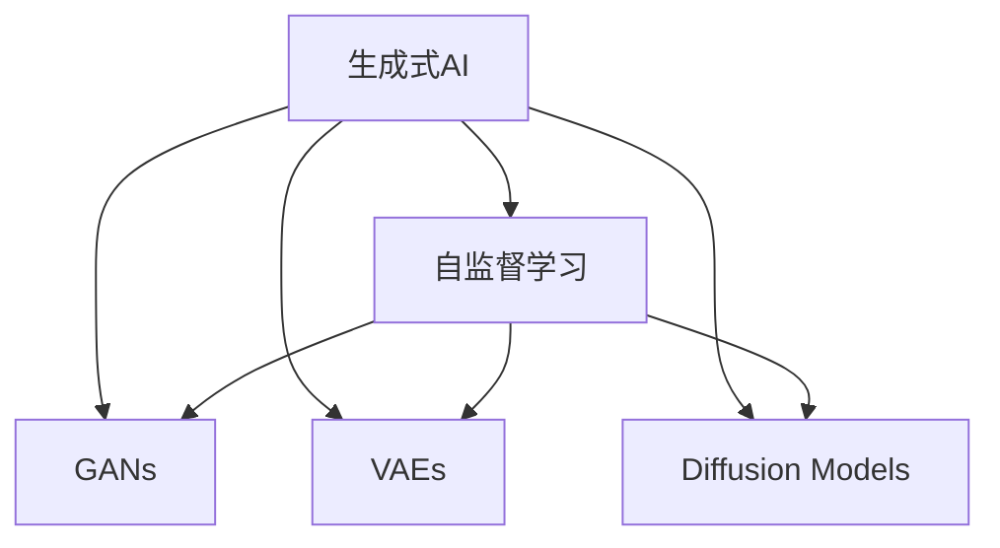

                 

## 1. 背景介绍

### 1.1 问题由来
人工智能(AI)技术的迅猛发展正深刻改变着各行各业的运行模式。特别是生成式AI(Generative AI)，凭借其强大的生成和优化能力，在图像、文本、音频等多个领域取得了突破性进展。生成式AI技术的应用范围涵盖了内容创作、医学研究、自动设计、金融分析等多个领域，逐步展现出其巨大的潜力和影响力。

近年来，随着深度学习技术的不断进步，生成式AI迎来了新的发展高峰。生成式模型如GANs、VAEs、VQ-VAEs等，通过强大的生成能力，为机器学习领域带来了革命性的变化。这些模型能够在没有大量标注数据的情况下，自动生成高质量的数据和内容，极大地提升了数据集构建和内容创作的工作效率。

### 1.2 问题核心关键点
生成式AI的核心在于如何高效地生成数据和内容。生成式AI通过学习已知数据的统计特征，生成与数据相似但全新的样本，其效果可以接近甚至超越真实数据。这些生成的数据在图像识别、自然语言处理、音乐生成、图像翻译等多个领域都有广泛的应用。

目前，生成式AI的主要应用方向包括：
- 数据增强：用于训练数据不足或难以收集的场景，生成大量合成数据用于训练。
- 图像生成：用于艺术创作、虚拟现实、游戏设计等领域，生成高质量的图像和场景。
- 文本生成：用于自动写作、对话生成、文本摘要等领域，生成符合语义规则的文本。
- 音频生成：用于音乐创作、语音合成、声音翻译等领域，生成逼真的音频效果。

生成式AI技术正在推动各行业的智能化转型，带来前所未有的变革和机遇。

## 2. 核心概念与联系

### 2.1 核心概念概述

为了更好地理解生成式AI的原理和应用，本节将介绍几个核心概念：

- **生成式AI**：利用深度学习模型生成符合特定规则或统计特征的数据和内容的技术。主要包括GANs、VAEs、VQ-VAEs、diffusion models等。
- **自监督学习**：利用未标注数据进行训练，使得模型学习到数据的统计特征和生成能力。自监督学习是生成式AI的重要基础。
- **对抗生成网络(GANs)**：通过两个相互对抗的神经网络（生成器和判别器）进行训练，使生成器能够生成与真实数据无法区分的伪造数据。
- **变分自编码器(VAEs)**：通过学习数据的分布，生成逼真的数据样本，广泛应用于图像和音频生成。
- **扩散模型(Diffusion Models)**：通过动态噪声的减少逐步生成高质量的数据，已广泛应用于生成图像和视频。

这些核心概念之间的逻辑关系可以通过以下Mermaid流程图来展示：



这个流程图展示生成式AI的核心概念及其之间的关系：

1. 生成式AI通过自监督学习学习数据的统计特征和生成能力。
2. GANs、VAEs和Diffusion Models是生成式AI的重要模型，分别利用不同的训练策略实现数据生成。

## 3. 核心算法原理 & 具体操作步骤
### 3.1 算法原理概述

生成式AI的原理是通过模型学习已知数据的统计特征，生成符合特定规则或概率分布的新数据。形式化地，假设已知数据集为 $\{(x_i, y_i)\}_{i=1}^N$，其中 $x_i$ 为输入样本，$y_i$ 为标签，生成式模型 $G$ 学习到生成器 $z \to x$ 和判别器 $x \to y$，其中 $z$ 为潜在空间中的随机噪声。

训练过程中，生成器 $G$ 通过最小化判别器 $D$ 的损失函数，生成逼真的数据样本。判别器 $D$ 通过最大化区分真实数据和生成数据，训练生成器 $G$ 的生成能力。最终生成器 $G$ 能够生成高质量的数据样本，这些样本在统计上与真实数据分布相同。

### 3.2 算法步骤详解

生成式AI的训练过程一般包括以下几个关键步骤：

**Step 1: 数据准备**
- 收集或生成目标领域的大量未标注数据。
- 使用数据增强技术扩充数据集。

**Step 2: 选择模型架构**
- 根据任务类型选择合适的生成模型架构。
- 对于图像生成，可以选择GANs、VAEs等模型。
- 对于文本生成，可以选择语言模型、RNN、Transformer等模型。
- 对于音频生成，可以选择WaveNet、Diffusion Models等模型。

**Step 3: 初始化模型参数**
- 使用随机初始化或预训练模型初始化生成器参数。
- 对于VAEs和Diffusion Models，通常使用正态分布初始化。
- 对于GANs，生成器初始化为一个简单的网络结构，判别器初始化为一个简单的分类器。

**Step 4: 交替训练生成器和判别器**
- 对生成器和判别器交替进行训练。
- 每轮训练中，先训练判别器 $D$，使 $D$ 能够更好地区分真实数据和生成数据。
- 然后训练生成器 $G$，使 $G$ 生成的数据能够更好地欺骗判别器。
- 重复交替训练，直到生成器能够生成高质量的数据。

**Step 5: 评估和应用**
- 在测试集上评估生成器的生成质量。
- 根据应用需求，对生成器生成的数据进行后处理，如滤波、去噪等。
- 将生成数据应用于图像生成、文本生成、音频生成等领域。

### 3.3 算法优缺点

生成式AI具有以下优点：
1. 数据生成能力强。生成式AI能够生成高质量、多样化的数据，满足不同应用场景的需求。
2. 无需标注数据。生成式AI利用自监督学习进行训练，大大减少了对标注数据的依赖。
3. 应用广泛。生成式AI在图像生成、文本生成、音频生成等多个领域都有广泛应用。
4. 提升数据集多样性。通过生成大量合成数据，生成式AI可以提升数据集的多样性，缓解数据偏见问题。

同时，生成式AI也存在一定的局限性：
1. 生成数据质量不稳定。生成式AI生成的数据质量受训练参数、数据分布等影响，可能存在一定的波动。
2. 需要较长的训练时间。生成式AI的训练时间较长，对于大规模数据集和高维数据，训练过程尤为耗时。
3. 存在模式崩溃问题。在训练过程中，生成器可能会陷入局部最优解，导致生成数据质量下降。
4. 生成数据不具可解释性。生成式AI生成的数据往往缺乏可解释性，难以理解其生成逻辑。

尽管存在这些局限性，但生成式AI凭借其强大的生成能力，在多个领域展现出巨大的潜力，成为当前AI技术研究的热点。

### 3.4 算法应用领域

生成式AI在多个领域都得到了广泛应用，具体如下：

- **图像生成**：用于艺术创作、虚拟现实、游戏设计等领域，生成高质量的图像和场景。
- **文本生成**：用于自动写作、对话生成、文本摘要等领域，生成符合语义规则的文本。
- **音频生成**：用于音乐创作、语音合成、声音翻译等领域，生成逼真的音频效果。
- **药物发现**：生成式AI用于模拟药物分子的生成，加速药物筛选和设计过程。
- **城市规划**：生成式AI用于生成城市三维模型和虚拟环境，辅助城市规划和建筑设计。
- **教育娱乐**：生成式AI用于生成教育内容和娱乐内容，提升教育体验和娱乐效果。

## 4. 数学模型和公式 & 详细讲解
### 4.1 数学模型构建

形式化地，生成式AI的训练过程可以表示为以下数学模型：

- **生成器模型**：$x=G(z)$，其中 $x$ 为生成数据，$z$ 为潜在空间的随机噪声。
- **判别器模型**：$y=D(x)$，其中 $y$ 为判别器的输出，表示 $x$ 为真实数据的概率。

生成器和判别器之间的优化目标为：

$$
\min_G \max_D V(G, D) = \min_G \max_D E_{x \sim p_{data}} [\log D(x)] + E_{z \sim p(z)} [\log (1-D(G(z))]]
$$

其中 $p_{data}$ 为真实数据的分布，$p(z)$ 为潜在空间的噪声分布。

### 4.2 公式推导过程

以GANs为例，以下是生成器和判别器的优化过程：

1. 生成器 $G$ 的损失函数为：
$$
L_G = -E_{z \sim p(z)} \log D(G(z))
$$

2. 判别器 $D$ 的损失函数为：
$$
L_D = E_{x \sim p_{data}} \log D(x) + E_{z \sim p(z)} \log (1-D(G(z)))
$$

3. 交替优化生成器和判别器：
- 固定判别器 $D$，优化生成器 $G$：
$$
G \leftarrow G - \eta \nabla_{G} L_G
$$
- 固定生成器 $G$，优化判别器 $D$：
$$
D \leftarrow D - \eta \nabla_{D} L_D
$$

其中 $\eta$ 为学习率。

### 4.3 案例分析与讲解

以下是GANs在图像生成任务中的实现案例：

1. 数据准备
- 收集或生成目标领域的图像数据集，如MNIST手写数字、CelebA人脸图像等。
- 使用数据增强技术扩充数据集，如旋转、裁剪、加噪声等。

2. 模型架构
- 选择GANs作为生成器，包括一个卷积神经网络（CNN）生成器和判别器。
- 生成器 $G$ 的结构包括多层卷积和反卷积操作，用于将潜在空间的噪声映射到图像空间。
- 判别器 $D$ 的结构为多层卷积和池化操作，用于判断输入图像是否为真实数据。

3. 初始化模型参数
- 使用随机初始化生成器和判别器的参数。
- 使用正态分布初始化生成器和判别器的权重和偏置。

4. 交替训练生成器和判别器
- 交替进行生成器和判别器的训练，直至生成器能够生成高质量的图像。
- 在每个epoch中，先固定生成器 $G$，优化判别器 $D$，再固定判别器 $D$，优化生成器 $G$。

5. 评估和应用
- 在测试集上评估生成器的生成质量，如Inception Score、Fréchet Inception Distance等指标。
- 根据应用需求，对生成器生成的图像进行后处理，如滤波、去噪等。
- 将生成图像应用于图像生成、图像编辑、图像修复等领域。

## 5. 项目实践：代码实例和详细解释说明
### 5.1 开发环境搭建

在进行生成式AI项目开发前，需要准备以下开发环境：

1. 安装Anaconda：从官网下载并安装Anaconda，用于创建独立的Python环境。

2. 创建并激活虚拟环境：
```bash
conda create -n pytorch-env python=3.8 
conda activate pytorch-env
```

3. 安装PyTorch：根据CUDA版本，从官网获取对应的安装命令。例如：
```bash
conda install pytorch torchvision torchaudio cudatoolkit=11.1 -c pytorch -c conda-forge
```

4. 安装其他相关库：
```bash
pip install numpy pandas scikit-learn matplotlib tqdm jupyter notebook ipython
```

完成上述步骤后，即可在`pytorch-env`环境中开始生成式AI项目的开发。

### 5.2 源代码详细实现

以下是使用PyTorch实现GANs图像生成的代码实现：

```python
import torch
import torch.nn as nn
import torch.optim as optim
from torchvision import datasets, transforms

# 定义生成器和判别器网络
class Generator(nn.Module):
    def __init__(self):
        super(Generator, self).__init__()
        self.main = nn.Sequential(
            nn.ConvTranspose2d(100, 256, 4, 1, 0, bias=False),
            nn.BatchNorm2d(256),
            nn.ReLU(True),
            nn.ConvTranspose2d(256, 128, 4, 2, 1, bias=False),
            nn.BatchNorm2d(128),
            nn.ReLU(True),
            nn.ConvTranspose2d(128, 64, 4, 2, 1, bias=False),
            nn.BatchNorm2d(64),
            nn.ReLU(True),
            nn.ConvTranspose2d(64, 3, 4, 2, 1, bias=False),
            nn.Tanh()
        )
    
    def forward(self, input):
        return self.main(input)

class Discriminator(nn.Module):
    def __init__(self):
        super(Discriminator, self).__init__()
        self.main = nn.Sequential(
            nn.Conv2d(3, 64, 4, 2, 1, bias=False),
            nn.LeakyReLU(0.2, inplace=True),
            nn.Conv2d(64, 128, 4, 2, 1, bias=False),
            nn.BatchNorm2d(128),
            nn.LeakyReLU(0.2, inplace=True),
            nn.Conv2d(128, 256, 4, 2, 1, bias=False),
            nn.BatchNorm2d(256),
            nn.LeakyReLU(0.2, inplace=True),
            nn.Conv2d(256, 1, 4, 1, 0, bias=False),
            nn.Sigmoid()
        )
    
    def forward(self, input):
        return self.main(input)

# 加载数据集
train_dataset = datasets.MNIST(root='data', train=True, transform=transforms.ToTensor(), download=True)
test_dataset = datasets.MNIST(root='data', train=False, transform=transforms.ToTensor(), download=True)

# 定义数据加载器
batch_size = 64
train_loader = torch.utils.data.DataLoader(train_dataset, batch_size=batch_size, shuffle=True)
test_loader = torch.utils.data.DataLoader(test_dataset, batch_size=batch_size, shuffle=False)

# 定义模型和优化器
G = Generator()
D = Discriminator()
G_optimizer = optim.Adam(G.parameters(), lr=0.0002, betas=(0.5, 0.999))
D_optimizer = optim.Adam(D.parameters(), lr=0.0002, betas=(0.5, 0.999))

# 定义损失函数
def discriminator_loss(real, fake):
    real_loss = D(torch.randn(batch_size, 1, 28, 28).to(device))
    fake_loss = D(G(torch.randn(batch_size, 100).to(device)))
    return -torch.mean(torch.log(real_loss) + torch.log(1 - fake_loss))

def generator_loss(real, fake):
    real_loss = D(torch.randn(batch_size, 1, 28, 28).to(device))
    fake_loss = D(G(torch.randn(batch_size, 100).to(device)))
    return torch.mean(torch.log(1 - real_loss) + torch.log(fake_loss))

# 训练过程
for epoch in range(num_epochs):
    for i, (real_images, _) in enumerate(train_loader):
        # 训练判别器
        D_optimizer.zero_grad()
        real_images = real_images.to(device)
        real_loss = discriminator_loss(real_images, G(torch.randn(batch_size, 100).to(device)))
        real_loss.backward()
        D_optimizer.step()
        
        # 训练生成器
        G_optimizer.zero_grad()
        fake_loss = generator_loss(real_images, G(torch.randn(batch_size, 100).to(device)))
        fake_loss.backward()
        G_optimizer.step()
        
        if (i+1) % 100 == 0:
            print('Epoch [{}/{}], Step [{}/{}], Loss_G: {:.4f}, Loss_D: {:.4f}'
                  .format(epoch+1, num_epochs, i+1, len(train_loader), fake_loss.data[0], real_loss.data[0]))

    if (epoch+1) % 100 == 0:
        fake_images = G(torch.randn(64, 100).to(device))
        save_image(fake_images, 'images/generated_{}.png'.format(epoch+1))

# 评估和应用
# 使用训练好的生成器生成新图像
fake_images = G(torch.randn(64, 100).to(device))
save_image(fake_images, 'images/generated_last.png')
```

### 5.3 代码解读与分析

这段代码实现了一个简单的GANs模型，用于生成手写数字图像。关键步骤包括：

1. 定义生成器和判别器网络：使用PyTorch定义生成器和判别器的网络结构，包括卷积、反卷积、批归一化、激活函数等操作。
2. 加载数据集：使用PyTorch的数据加载器加载MNIST手写数字数据集，并进行数据预处理。
3. 定义模型和优化器：定义生成器和判别器的优化器，使用Adam算法进行优化。
4. 定义损失函数：定义判别器和生成器的损失函数，用于计算训练过程的梯度。
5. 训练过程：在每个epoch中，交替训练判别器和生成器，并打印训练过程中的损失值。
6. 评估和应用：使用训练好的生成器生成新图像，并保存图像。

这段代码展示了GANs模型训练和应用的基本流程，适合初学者快速上手。

## 6. 实际应用场景
### 6.1 医疗图像生成

生成式AI在医疗图像生成中的应用，极大地提升了医疗数据分析和研究的工作效率。通过生成式AI，医学研究人员能够模拟各种疾病和病理现象的图像，辅助医生进行诊断和治疗方案的制定。

具体而言，生成式AI可以用于生成：
- 正常和病态组织图像。用于医学影像学和病理学研究。
- 病变图像和病程演化图像。用于疾病模拟和预测。
- 手术过程模拟图像。用于手术培训和仿真。

生成式AI在医疗图像生成中的应用，使得医学研究更加高效和准确，为医疗技术的发展提供了新的工具和手段。

### 6.2 虚拟现实设计

生成式AI在虚拟现实设计中的应用，使得设计师能够快速生成逼真的虚拟环境，极大地提升了设计和制作效率。通过生成式AI，设计师可以：

- 自动生成虚拟场景和角色。用于游戏设计、动画制作和虚拟现实应用。
- 生成高分辨率的3D模型。用于建筑设计和虚拟漫游。
- 生成动态环境变化。用于实时交互和虚拟体验。

生成式AI在虚拟现实设计中的应用，使得虚拟现实技术更加普及和实用，为影视、游戏、教育等多个领域带来了新的机遇和挑战。

### 6.3 金融数据分析

生成式AI在金融数据分析中的应用，使得投资者能够快速生成和分析金融市场数据，辅助决策和风险管理。通过生成式AI，投资者可以：

- 生成金融市场历史数据。用于市场分析和趋势预测。
- 生成股票和期权价格模型。用于金融衍生品设计。
- 生成风险评估和预警系统。用于市场风险管理和投资组合优化。

生成式AI在金融数据分析中的应用，使得金融分析更加智能化和自动化，为投资者提供了新的工具和方法，提升了金融市场效率和稳定性。

## 7. 工具和资源推荐
### 7.1 学习资源推荐

为了帮助开发者系统掌握生成式AI的理论基础和实践技巧，这里推荐一些优质的学习资源：

1. 《Generative Adversarial Networks: An Overview》：一篇综述论文，介绍了GANs的基本原理和应用，适合初学者快速入门。

2. 《Neural Style Transfer》：介绍了一种基于GANs的图像风格迁移技术，适合学习生成式AI在图像处理中的应用。

3. 《Variational Autoencoders: Theory & Practice》：介绍VAEs的基本原理和实践，适合学习生成式AI在数据建模和生成中的应用。

4. 《Diffusion Models: A Survey》：一篇综述论文，介绍了扩散模型的基本原理和应用，适合学习生成式AI在图像和视频生成中的应用。

5. 《Introduction to Generative Adversarial Networks》：由谷歌开发者撰写的教程，详细介绍了GANs的实现和应用，适合深入学习GANs技术。

通过对这些资源的学习实践，相信你一定能够快速掌握生成式AI的精髓，并用于解决实际的图像、文本、音频生成等问题。

### 7.2 开发工具推荐

高效的开发离不开优秀的工具支持。以下是几款用于生成式AI开发常用的工具：

1. PyTorch：基于Python的开源深度学习框架，灵活的动态计算图，适合快速迭代研究。

2. TensorFlow：由Google主导开发的开源深度学习框架，生产部署方便，适合大规模工程应用。

3. TensorFlow-Slim：TensorFlow的高层次API，简化了模型的构建和训练过程。

4. Keras：高层次的深度学习API，易于上手，适合快速原型设计和应用开发。

5. OpenAI Gym：用于强化学习任务开发的开源库，支持生成式AI在环境交互中的应用。

6. VGG：用于图像分类和生成任务的开源库，提供预训练模型和代码实现。

合理利用这些工具，可以显著提升生成式AI的开发效率，加快创新迭代的步伐。

### 7.3 相关论文推荐

生成式AI的研究源于学界的持续研究。以下是几篇奠基性的相关论文，推荐阅读：

1. Generative Adversarial Nets：提出GANs的基本架构和训练方法，开启了生成式AI研究的新纪元。

2. Conditional Generative Adversarial Nets：提出条件生成对抗网络，使得GANs能够生成符合特定条件的图像和数据。

3. Variational Autoencoders：提出VAEs的基本原理和训练方法，为生成式AI提供了新的视角。

4. Progressive Growing of GANs for Improved Quality, Stability, and Variation：提出渐进式增长策略，使得GANs能够生成高分辨率、高质量的图像。

5. Denoising Auto-encoders with Different Loss Functions：提出噪声自编码器，用于图像生成和数据建模。

这些论文代表了生成式AI的发展脉络。通过学习这些前沿成果，可以帮助研究者把握学科前进方向，激发更多的创新灵感。

## 8. 总结：未来发展趋势与挑战

### 8.1 总结

本文对生成式AI的原理和应用进行了全面系统的介绍。首先阐述了生成式AI的核心理念和应用前景，明确了生成式AI在图像生成、文本生成、音频生成等多个领域的重要作用。其次，从原理到实践，详细讲解了GANs、VAEs、Diffusion Models等生成式AI模型的训练过程，给出了生成式AI项目开发的完整代码实例。同时，本文还广泛探讨了生成式AI在医疗、虚拟现实、金融等多个领域的应用场景，展示了生成式AI技术的巨大潜力。

通过本文的系统梳理，可以看到，生成式AI技术正在成为AI技术研究的重要方向，极大地拓展了数据和内容生成的工作边界，为各个领域带来了前所未有的变革和机遇。未来，伴随生成式AI的不断进步，其在生成高质量、多样化的数据和内容方面的能力将不断增强，推动各行业的智能化转型。

### 8.2 未来发展趋势

展望未来，生成式AI将呈现以下几个发展趋势：

1. 模型规模持续增大。随着算力成本的下降和数据规模的扩张，生成式AI模型的参数量还将持续增长。超大规模模型在生成能力上的提升，将进一步推动生成式AI技术的发展。

2. 生成式AI技术的多样化。除了GANs、VAEs和Diffusion Models，未来还将涌现更多生成式AI技术，如Neural Style Transfer、Adversarial Autoencoders等，用于解决不同领域的应用问题。

3. 生成式AI与其他AI技术的融合。生成式AI将与强化学习、自然语言处理、计算机视觉等AI技术进行更深入的融合，推动AI技术的发展和应用。

4. 生成式AI应用的广泛化。生成式AI将在更多领域得到应用，如医疗、金融、教育、娱乐等，带来更广泛的社会和经济效益。

5. 生成式AI的可解释性增强。未来的生成式AI模型将更加注重可解释性，使得生成的数据和内容具有更好的可理解性和可验证性。

以上趋势凸显了生成式AI技术的广阔前景。这些方向的探索发展，必将进一步推动生成式AI技术向更高的台阶迈进，为各行各业带来新的突破和创新。

### 8.3 面临的挑战

尽管生成式AI技术已经取得了显著成果，但在其发展过程中仍面临诸多挑战：

1. 生成数据质量不稳定。生成式AI生成的数据质量受训练参数、数据分布等影响，可能存在一定的波动。

2. 模型训练时间较长。生成式AI的训练时间较长，对于大规模数据集和高维数据，训练过程尤为耗时。

3. 生成数据不具可解释性。生成式AI生成的数据往往缺乏可解释性，难以理解其生成逻辑。

4. 存在模式崩溃问题。在训练过程中，生成器可能会陷入局部最优解，导致生成数据质量下降。

5. 生成数据可能存在偏见。生成式AI可能学习到数据中的偏见，导致生成的数据存在歧视性或有害内容。

6. 大规模数据存储和处理。生成式AI需要处理大规模数据，对存储和计算资源提出较高要求。

正视生成式AI面临的这些挑战，积极应对并寻求突破，将是生成式AI技术走向成熟的关键。相信随着学界和产业界的共同努力，这些挑战终将一一被克服，生成式AI必将在构建智能系统和提升生产效率方面发挥更大的作用。

### 8.4 研究展望

面对生成式AI所面临的挑战，未来的研究需要在以下几个方面寻求新的突破：

1. 开发更加高效的生成模型。开发更加高效的生成模型架构和算法，提升生成式AI的生成能力和效率。

2. 引入更多的先验知识。将符号化的先验知识，如知识图谱、逻辑规则等，与神经网络模型进行巧妙融合，引导生成过程学习更准确、合理的语言模型。

3. 引入更多的生成范式。引入更多的生成范式，如变分生成、扩散模型等，丰富生成式AI的应用场景和技术手段。

4. 引入更多的评估指标。引入更多的评估指标，如Inception Score、Fréchet Inception Distance等，全面评估生成数据的生成质量和多样性。

5. 引入更多的应用领域。将生成式AI应用于更多领域，如医疗、金融、教育等，带来更广泛的社会和经济效益。

6. 引入更多的工具和技术。引入更多的工具和技术，如可视化工具、模型压缩技术等，提升生成式AI的开发效率和应用效果。

这些研究方向的探索，必将引领生成式AI技术迈向更高的台阶，为各行各业带来新的突破和创新。面向未来，生成式AI技术还需要与其他AI技术进行更深入的融合，共同推动生成式AI技术的进步和应用。

## 9. 附录：常见问题与解答

**Q1：生成式AI生成的数据质量如何保证？**

A: 生成式AI生成的数据质量受多种因素影响，包括训练数据的质量、模型架构和算法、训练参数等。为了保证生成数据的质量，可以采取以下措施：

1. 使用高质量的训练数据。生成式AI模型的性能依赖于训练数据的质量，应选择高质量、多样化的数据进行训练。

2. 引入正则化技术。通过L2正则、Dropout等正则化技术，避免模型过拟合，提高生成数据的泛化能力。

3. 使用多种生成范式。引入多种生成范式，如GANs、VAEs、Diffusion Models等，进行交叉验证，选择生成质量最优的模型。

4. 引入后处理技术。对生成的数据进行后处理，如滤波、去噪、增强等，进一步提升数据质量。

**Q2：生成式AI在训练过程中如何避免模式崩溃问题？**

A: 模式崩溃问题是指生成器在训练过程中陷入局部最优解，导致生成数据质量下降。为了避免模式崩溃问题，可以采取以下措施：

1. 引入多种训练策略。引入多种训练策略，如学习率调度、自适应学习率、自适应权重衰减等，避免模式崩溃。

2. 使用数据增强技术。通过数据增强技术，扩充训练数据，增加模型对数据的适应能力。

3. 引入生成范式组合。引入多种生成范式组合，如GANs和VAEs的组合，进行交叉验证，选择生成质量最优的模型。

4. 引入对抗样本。通过引入对抗样本，训练生成器对多种噪声的鲁棒性，避免模式崩溃。

5. 使用多目标优化。使用多目标优化方法，如Pareto优化，综合评估生成质量和效率，避免模式崩溃。

**Q3：生成式AI在生成过程中如何引入先验知识？**

A: 生成式AI在生成过程中引入先验知识，可以提高生成数据的准确性和合理性。以下是几种常见的引入方法：

1. 知识图谱融合。将知识图谱与生成式AI模型进行融合，引入先验知识，生成符合知识图谱逻辑的数据。

2. 逻辑规则融合。将逻辑规则与生成式AI模型进行融合，引入先验知识，生成符合逻辑规则的数据。

3. 符号生成器融合。将符号生成器与生成式AI模型进行融合，引入先验知识，生成符合语法和语义规则的数据。

4. 数据增强融合。通过数据增强技术，引入先验知识，生成符合特定领域的数据。

**Q4：生成式AI在生成过程中如何引入多模态信息？**

A: 生成式AI在生成过程中引入多模态信息，可以提升生成数据的丰富性和多样性。以下是几种常见的引入方法：

1. 图像生成与文本生成结合。将图像生成和文本生成结合，生成图文并茂的内容，增强数据的表达能力。

2. 图像生成与音频生成结合。将图像生成和音频生成结合，生成视觉和听觉相结合的内容，增强数据的感知能力。

3. 图像生成与语言模型结合。将图像生成与语言模型结合，生成符合语义规则的图像，增强数据的语义理解能力。

4. 图像生成与自然语言处理结合。将图像生成与自然语言处理结合，生成符合自然语言语义规则的图像，增强数据的语义表达能力。

通过引入多模态信息，生成式AI可以生成更加丰富、多样、有意义的生成内容，为各领域带来更多应用价值。

---

作者：禅与计算机程序设计艺术 / Zen and the Art of Computer Programming

