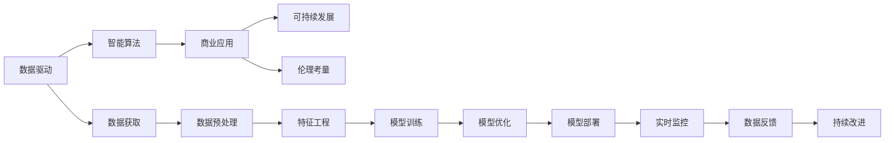
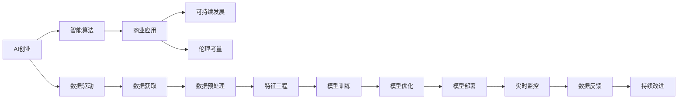

                 

# AI驱动的创业模式：机遇与挑战

> 关键词：AI创业、数据驱动、智能算法、商业应用、可持续发展、伦理考量

## 1. 背景介绍

### 1.1 问题由来
近年来，人工智能（AI）技术的迅猛发展推动了各行各业的数字化转型，催生了许多以AI为核心的创业公司。这些公司凭借其先进的技术和商业模式，在短时间内获得了巨大成功，成为AI应用领域的标杆。然而，在AI创业浪潮中，也存在着诸多挑战和风险，如何把握机遇，规避风险，成为每个创业者都必须面对的问题。

### 1.2 问题核心关键点
AI驱动的创业模式涉及到的核心关键点包括：

- 数据驱动：AI技术的核心在于数据，如何获取高质量的数据，建立有效的数据管道，是创业成功的关键。
- 智能算法：选择合适的算法模型，并对其进行优化和训练，以适应具体的业务场景。
- 商业应用：如何将AI技术成功应用到实际业务中，创造出实际价值。
- 可持续发展：如何保证AI系统的长期稳定运行和持续改进。
- 伦理考量：AI技术的应用需要考虑伦理和社会影响，确保系统的公平性和透明度。

这些关键点之间的逻辑关系可以通过以下Mermaid流程图来展示：



这个流程图展示了一个完整的AI创业流程：

1. 从数据获取开始，经过数据预处理、特征工程，进入模型训练和优化环节。
2. 训练好的模型经过部署和实时监控，接受数据反馈进行持续改进。
3. 整个过程中，还需要考虑商业应用、可持续发展以及伦理考量。

## 2. 核心概念与联系

### 2.1 核心概念概述

为更好地理解AI驱动的创业模式，本节将介绍几个密切相关的核心概念：

- AI创业：基于人工智能技术的企业创业模式，通过技术创新驱动企业增长。
- 数据驱动：利用大数据技术进行企业决策和业务优化，以数据为中心的企业发展方式。
- 智能算法：用于数据处理和分析的算法，如机器学习、深度学习等。
- 商业应用：将AI技术应用于具体业务场景，创造经济价值。
- 可持续发展：企业长期稳定发展，注重环境保护和社会责任。
- 伦理考量：考虑AI技术的伦理影响，确保技术应用的正当性和公平性。

这些核心概念之间的逻辑关系可以通过以下Mermaid流程图来展示：



这个流程图展示了AI创业模式的核心流程：

1. AI创业从数据驱动开始，经过智能算法的应用，进入商业应用环节。
2. 在商业应用过程中，需要考虑可持续发展及伦理考量。
3. 数据驱动、智能算法、商业应用、可持续发展、伦理考量等概念之间相互关联，共同构成AI创业的核心逻辑。

## 3. 核心算法原理 & 具体操作步骤
### 3.1 算法原理概述

AI驱动的创业模式，本质上是一个数据驱动的智能算法应用过程。其核心思想是：

1. **数据驱动决策**：通过收集和分析大规模的数据，发现其中的规律和趋势，支持企业决策和业务优化。
2. **智能算法应用**：选择合适的算法模型，利用数据训练模型，预测未来趋势，优化业务流程。
3. **商业应用落地**：将训练好的模型应用到具体的业务场景中，实现商业价值的创造。

形式化地，假设企业初始数据集为 $D=\{x_i,y_i\}_{i=1}^N$，其中 $x_i$ 为输入特征，$y_i$ 为输出标签。企业的目标是找到最优的模型 $M_{\theta}$，使得其预测能力最大化，即：

$$
\hat{\theta} = \mathop{\arg\min}_{\theta} \mathcal{L}(M_{\theta},D)
$$

其中 $\mathcal{L}$ 为损失函数，用于衡量模型预测输出与真实标签之间的差异。常见的损失函数包括均方误差、交叉熵等。

### 3.2 算法步骤详解

AI驱动的创业模式一般包括以下几个关键步骤：

**Step 1: 数据准备与预处理**

- 收集相关领域的业务数据，包括历史交易记录、客户反馈、市场趋势等。
- 对数据进行清洗和预处理，去除噪声和冗余，确保数据质量。
- 进行特征工程，提取有意义的特征，如客户年龄、购买频率、地区等。

**Step 2: 选择合适的算法模型**

- 根据业务需求和数据特点，选择合适的算法模型，如回归模型、分类模型、聚类模型等。
- 对于图像、文本等非结构化数据，可考虑使用深度学习模型，如卷积神经网络（CNN）、循环神经网络（RNN）、Transformer等。
- 对于结构化数据，可考虑使用传统的统计学方法，如线性回归、决策树、随机森林等。

**Step 3: 模型训练与优化**

- 利用收集的数据，将数据集划分为训练集和验证集，进行模型训练。
- 使用梯度下降等优化算法，最小化损失函数，优化模型参数 $\theta$。
- 在训练过程中，可通过早停法、正则化等技术，防止过拟合。

**Step 4: 模型部署与监控**

- 将训练好的模型部署到生产环境，实时处理业务数据。
- 通过实时监控系统，采集模型性能指标，如准确率、召回率、F1分数等，进行持续评估。
- 定期更新模型参数，使用新数据进行再训练，保持模型的预测能力。

**Step 5: 商业应用与反馈**

- 将训练好的模型应用到具体的业务场景中，如客户推荐、库存管理、风险控制等。
- 收集用户反馈，评估模型效果，根据反馈进行模型优化。
- 不断迭代改进，实现业务持续优化和升级。

### 3.3 算法优缺点

AI驱动的创业模式具有以下优点：

- 数据驱动：通过数据分析发现业务规律，支持企业决策和业务优化。
- 智能算法：利用先进算法模型进行预测和优化，提升业务效率和准确性。
- 商业应用：将AI技术成功应用到具体业务场景，创造经济价值。
- 持续改进：通过实时监控和数据反馈，持续优化模型，保持业务竞争力。

同时，该模式也存在一定的局限性：

- 数据依赖：高质量数据的获取和处理是创业成功的关键，数据不足或质量不高可能导致决策失误。
- 算法复杂：选择合适的算法模型并对其进行优化训练，需要一定的技术储备和资源投入。
- 应用难度：将AI技术应用到实际业务中，需要进行详细的业务分析和系统集成，存在一定的技术挑战。
- 伦理风险：AI技术的应用可能涉及隐私、公平性等问题，需要考虑伦理和社会影响。

### 3.4 算法应用领域

AI驱动的创业模式在多个领域得到了广泛应用，例如：

- 金融科技：利用机器学习进行风险控制、欺诈检测、信用评估等。
- 零售电商：通过推荐系统、库存管理等提升用户体验和销售效率。
- 医疗健康：利用深度学习进行疾病诊断、影像分析、个性化治疗等。
- 智能制造：通过物联网、大数据分析优化生产流程、提升产品质量。
- 智慧城市：利用AI技术进行交通管理、环境监测、智能安防等。

## 4. 数学模型和公式 & 详细讲解 & 举例说明
### 4.1 数学模型构建

假设企业数据集为 $D=\{x_i,y_i\}_{i=1}^N$，其中 $x_i$ 为输入特征，$y_i$ 为输出标签。

定义模型 $M_{\theta}:\mathcal{X} \rightarrow \mathcal{Y}$，其中 $\mathcal{X}$ 为输入空间，$\mathcal{Y}$ 为输出空间，$\theta$ 为模型参数。

定义模型在数据样本 $(x,y)$ 上的损失函数为 $\ell(M_{\theta}(x),y)$，则在数据集 $D$ 上的经验风险为：

$$
\mathcal{L}(\theta) = \frac{1}{N} \sum_{i=1}^N \ell(M_{\theta}(x_i),y_i)
$$

企业目标是找到最优参数 $\theta$，使得模型预测输出与真实标签之间的差异最小化：

$$
\hat{\theta} = \mathop{\arg\min}_{\theta} \mathcal{L}(\theta)
$$

在实践中，我们通常使用基于梯度的优化算法（如SGD、Adam等）来近似求解上述最优化问题。设 $\eta$ 为学习率，$\lambda$ 为正则化系数，则参数的更新公式为：

$$
\theta \leftarrow \theta - \eta \nabla_{\theta}\mathcal{L}(\theta) - \eta\lambda\theta
$$

其中 $\nabla_{\theta}\mathcal{L}(\theta)$ 为损失函数对参数 $\theta$ 的梯度，可通过反向传播算法高效计算。

### 4.2 公式推导过程

以回归任务为例，推导最小二乘法的损失函数及其梯度的计算公式。

假设模型 $M_{\theta}$ 在输入 $x$ 上的输出为 $\hat{y}=M_{\theta}(x) \in \mathbb{R}$，表示样本预测值。真实标签 $y \in \mathbb{R}$。

则最小二乘法损失函数定义为：

$$
\ell(M_{\theta}(x),y) = \frac{1}{2}(y - \hat{y})^2
$$

将其代入经验风险公式，得：

$$
\mathcal{L}(\theta) = \frac{1}{N} \sum_{i=1}^N (y_i - \hat{y}_i)^2
$$

根据链式法则，损失函数对参数 $\theta_k$ 的梯度为：

$$
\frac{\partial \mathcal{L}(\theta)}{\partial \theta_k} = \sum_{i=1}^N (y_i - \hat{y}_i)\frac{\partial \hat{y}_i}{\partial \theta_k}
$$

其中 $\frac{\partial \hat{y}_i}{\partial \theta_k}$ 可进一步递归展开，利用自动微分技术完成计算。

在得到损失函数的梯度后，即可带入参数更新公式，完成模型的迭代优化。重复上述过程直至收敛，最终得到适应业务需求的最优模型参数 $\theta^*$。

### 4.3 案例分析与讲解

假设某电商公司希望通过AI技术提升用户购买转化率。公司收集了大量的用户行为数据，包括浏览记录、购买历史、推荐点击等。通过数据预处理和特征工程，提取了用户年龄、浏览时间、购买频率等特征。

公司选择了基于深度学习的推荐系统模型，利用用户行为数据进行训练。训练过程中，通过交叉验证和正则化技术，防止过拟合。训练好的模型部署到生产环境，实时处理用户请求，提供个性化推荐。

公司定期收集用户反馈，评估推荐系统的效果。通过A/B测试，比较不同模型的推荐结果，选择性能最优的模型进行迭代优化。经过不断改进，推荐系统的购买转化率提升了15%，为用户带来了显著的商业价值。

## 5. 项目实践：代码实例和详细解释说明
### 5.1 开发环境搭建

在进行AI驱动的创业模式实践前，我们需要准备好开发环境。以下是使用Python进行TensorFlow开发的环境配置流程：

1. 安装Anaconda：从官网下载并安装Anaconda，用于创建独立的Python环境。

2. 创建并激活虚拟环境：
```bash
conda create -n tf-env python=3.8 
conda activate tf-env
```

3. 安装TensorFlow：根据CUDA版本，从官网获取对应的安装命令。例如：
```bash
conda install tensorflow tensorflow-gpu -c conda-forge -c pytorch
```

4. 安装Pandas、NumPy等工具包：
```bash
pip install pandas numpy scikit-learn matplotlib tensorflow
```

完成上述步骤后，即可在`tf-env`环境中开始创业模式的实践。

### 5.2 源代码详细实现

下面我们以金融风险控制为例，给出使用TensorFlow进行机器学习模型的PyTorch代码实现。

首先，定义模型和优化器：

```python
import tensorflow as tf
from tensorflow.keras import layers

# 定义模型
model = tf.keras.Sequential([
    layers.Dense(64, activation='relu', input_shape=[10]),
    layers.Dense(64, activation='relu'),
    layers.Dense(1)
])

# 定义优化器
optimizer = tf.keras.optimizers.Adam(learning_rate=0.001)
```

接着，定义训练和评估函数：

```python
# 定义训练函数
def train(model, train_data, epochs=10, batch_size=32):
    model.compile(optimizer=optimizer, loss='mse')
    history = model.fit(train_data, epochs=epochs, batch_size=batch_size, validation_split=0.2)
    return history

# 定义评估函数
def evaluate(model, test_data):
    model.compile(optimizer=optimizer, loss='mse')
    test_loss = model.evaluate(test_data)
    return test_loss
```

最后，启动训练流程并在测试集上评估：

```python
# 加载训练和测试数据
train_data = ...
test_data = ...

# 训练模型
history = train(model, train_data)

# 在测试集上评估
test_loss = evaluate(model, test_data)

# 打印评估结果
print(f'Test loss: {test_loss:.4f}')
```

以上就是使用TensorFlow进行金融风险控制机器学习模型开发的完整代码实现。可以看到，TensorFlow提供了简单易用的高级API，可以方便地构建、训练和评估深度学习模型。

### 5.3 代码解读与分析

让我们再详细解读一下关键代码的实现细节：

**Sequential模型定义**：
- 通过`tf.keras.Sequential`创建序列模型，可方便地定义多层神经网络。
- `Dense`层表示全连接层，`activation='relu'`表示使用ReLU激活函数。
- `input_shape=[10]`表示输入特征维度为10。

**优化器定义**：
- 使用`tf.keras.optimizers.Adam`定义Adam优化器，设置学习率0.001。

**训练函数实现**：
- `model.compile`用于编译模型，指定优化器和损失函数。
- `history = model.fit(train_data, epochs=epochs, batch_size=batch_size, validation_split=0.2)`：通过`fit`函数进行模型训练，设置训练轮数、批次大小及验证集比例。
- `return history`返回训练过程中保存的历史记录。

**评估函数实现**：
- `model.compile(optimizer=optimizer, loss='mse')`重新编译模型，指定优化器和损失函数。
- `test_loss = model.evaluate(test_data)`通过`evaluate`函数计算测试集上的损失值。

**训练流程**：
- `train_data = ...`加载训练数据。
- `train(model, train_data)`调用训练函数，返回训练历史。
- `evaluate(model, test_data)`调用评估函数，计算测试集上的损失值。
- `print(f'Test loss: {test_loss:.4f}')`打印测试集上的损失值。

可以看到，TensorFlow的高级API使得模型构建和训练过程非常简洁高效。开发者可以更多地专注于模型设计和业务优化，而无需过多关注底层细节。

## 6. 实际应用场景

### 6.1 智能客服系统

AI驱动的智能客服系统，通过机器学习和自然语言处理技术，能够自动处理大量的客户咨询，提升客户服务体验和满意度。

具体而言，公司可以收集历史客服对话记录，将其标注为常见问题和最佳答复，作为监督数据。利用TensorFlow等深度学习框架，对预训练的语言模型进行微调，使其能够自动理解客户咨询，匹配最合适的答复。对于新问题，系统可以接入检索系统实时搜索相关内容，动态生成最佳答复。

### 6.2 医疗健康

AI驱动的医疗健康系统，通过深度学习和计算机视觉技术，能够辅助医生进行疾病诊断、影像分析等。

例如，某公司收集了大量的医学影像数据，包括X光片、CT、MRI等。通过数据预处理和特征提取，构建卷积神经网络模型进行训练。训练好的模型可以自动分析影像，辅助医生识别病变区域，提高诊断效率和准确性。

### 6.3 智能制造

AI驱动的智能制造系统，通过物联网和数据分析技术，能够优化生产流程，提升产品质量和生产效率。

例如，某公司利用传感器收集生产设备的数据，包括温度、压力、振动等。通过时间序列分析，构建预测模型，预测设备故障，及时进行维护，避免生产中断。同时，利用图像识别技术，对生产线的图像进行自动检测，确保生产过程的稳定性。

### 6.4 未来应用展望

随着AI技术的不断进步，AI驱动的创业模式将拓展到更多领域，带来更多的创新和变革。

在智慧城市治理中，AI技术可以用于交通管理、环境监测、智能安防等，提高城市管理的自动化和智能化水平。

在教育领域，AI技术可以用于个性化学习、智能辅导、知识推荐等，提升教育质量和效率。

在农业领域，AI技术可以用于农作物监测、病虫害识别、智能灌溉等，提高农业生产效率和产量。

总之，AI驱动的创业模式将在各个行业中带来颠覆性的变革，为传统行业数字化转型提供新的动力。未来，随着算力、数据、模型等条件的不断优化，AI技术将深入渗透到更多的领域，为人类社会的可持续发展做出更大的贡献。

## 7. 工具和资源推荐
### 7.1 学习资源推荐

为了帮助开发者系统掌握AI驱动创业模式的技术基础和实践技巧，这里推荐一些优质的学习资源：

1. Coursera《机器学习》课程：斯坦福大学开设的知名课程，涵盖机器学习基本概念和常用算法，适合初学者学习。

2. TensorFlow官方文档：TensorFlow的官方文档，详细介绍了TensorFlow的使用方法和最佳实践，是学习和使用TensorFlow的重要资料。

3. Kaggle：数据科学竞赛平台，提供大量真实数据集和竞赛题目，帮助开发者练习和验证AI模型。

4. PyTorch官方文档：PyTorch的官方文档，介绍了PyTorch的使用方法、API接口和最佳实践，是学习和使用PyTorch的重要资料。

5. AI创业指南：由知名AI创业专家撰写，介绍了AI创业的基本流程和关键点，适合创业者参考。

通过对这些资源的学习实践，相信你一定能够快速掌握AI驱动创业模式的核心技术，并用于解决实际的业务问题。

### 7.2 开发工具推荐

高效的开发离不开优秀的工具支持。以下是几款用于AI驱动创业模式开发的常用工具：

1. Jupyter Notebook：交互式编程环境，支持Python、R等语言，方便代码调试和实时展示。

2. GitHub：代码托管平台，支持版本控制和协作开发，便于团队管理。

3. TensorFlow和PyTorch：深度学习框架，支持大规模深度学习模型的构建和训练。

4. Scikit-learn：数据科学库，支持常用的机器学习算法和数据处理功能。

5. Keras：高级API，简化深度学习模型的构建和训练过程。

6. Google Colab：免费的云端Jupyter Notebook环境，支持GPU加速，方便开发者快速实验和分享。

合理利用这些工具，可以显著提升AI驱动创业模式的开发效率，加快创新迭代的步伐。

### 7.3 相关论文推荐

AI驱动创业模式的研究始于学界的持续研究。以下是几篇奠基性的相关论文，推荐阅读：

1. Deep Learning for Healthcare：综述了深度学习在医疗领域的应用，包括图像分析、自然语言处理等。

2. Machine Learning for Customer Service：探讨了机器学习在智能客服中的应用，包括语音识别、情感分析等。

3. AI in Smart Manufacturing：介绍了AI技术在智能制造中的应用，包括设备监测、流程优化等。

4. AI for Sustainable Development：讨论了AI技术在可持续发展中的作用，包括能源管理、环境监测等。

5. Ethical Considerations in AI：探讨了AI技术的伦理问题，包括隐私保护、公平性等。

这些论文代表了大语言模型微调技术的发展脉络。通过学习这些前沿成果，可以帮助研究者把握学科前进方向，激发更多的创新灵感。

## 8. 总结：未来发展趋势与挑战

### 8.1 总结

本文对AI驱动的创业模式进行了全面系统的介绍。首先阐述了AI驱动创业模式的核心概念和关键点，包括数据驱动、智能算法、商业应用、可持续发展、伦理考量等。然后，从原理到实践，详细讲解了AI驱动创业模式的核心算法，包括数据预处理、模型训练、模型优化等步骤，给出了具体实例。最后，探讨了AI驱动创业模式在多个领域的应用前景，并推荐了相关的学习资源、开发工具和相关论文。

通过本文的系统梳理，可以看到，AI驱动创业模式已经深刻改变了企业的业务流程和运营模式，带来巨大的商业价值。同时，该模式在数据获取、算法选择、应用落地等方面也面临诸多挑战。未来，如何在数据、算法、工程、伦理等方面不断优化，是大规模AI驱动创业模式成功落地的关键。

### 8.2 未来发展趋势

展望未来，AI驱动的创业模式将呈现以下几个发展趋势：

1. 数据获取智能化：通过物联网、传感器等技术，实时采集业务数据，提升数据获取的准确性和效率。
2. 算法模型多样化：引入更多先进的算法模型，如深度强化学习、元学习等，提升模型的预测能力和泛化能力。
3. 应用场景全面化：将AI技术应用到更多领域，如医疗、教育、农业等，拓展AI技术的商业价值。
4. 伦理应用普适化：在AI应用过程中，考虑伦理和社会影响，确保技术应用的正当性和公平性。
5. 持续优化迭代：通过实时监控和数据反馈，持续优化模型，保持业务的竞争力和可持续发展能力。

以上趋势凸显了AI驱动创业模式的广阔前景。这些方向的探索发展，必将进一步提升AI技术的业务应用效果，为经济社会发展注入新的动力。

### 8.3 面临的挑战

尽管AI驱动创业模式已经取得了瞩目成就，但在迈向更加智能化、普适化应用的过程中，它仍面临着诸多挑战：

1. 数据质量瓶颈：高质量数据的获取和处理是创业成功的关键，数据不足或质量不高可能导致决策失误。如何确保数据的完整性和准确性，是大规模AI驱动创业模式必须解决的问题。
2. 算法复杂度高：选择合适的算法模型并对其进行优化训练，需要一定的技术储备和资源投入。如何在算力、数据规模、业务场景等多方面进行平衡，是AI驱动创业模式面临的重要挑战。
3. 应用落地难度大：将AI技术应用到实际业务中，需要进行详细的业务分析和系统集成，存在一定的技术挑战。如何在不同行业和领域实现大规模应用，是大规模AI驱动创业模式需要不断探索的方向。
4. 伦理问题复杂：AI技术的应用可能涉及隐私、公平性等问题，需要考虑伦理和社会影响。如何在技术应用过程中，保证数据隐私和公平性，是大规模AI驱动创业模式需要解决的重要问题。

### 8.4 研究展望

面对AI驱动创业模式所面临的种种挑战，未来的研究需要在以下几个方面寻求新的突破：

1. 数据获取和处理：研究更高效的数据采集和处理技术，提升数据的质量和实时性。

2. 算法模型优化：开发更加参数高效和计算高效的模型，在固定大部分预训练参数的情况下，只更新极少量的任务相关参数。

3. 应用场景拓展：研究如何更好地将AI技术应用到更多领域，提升各行业的智能化水平。

4. 伦理和社会影响：研究如何在AI技术应用过程中，考虑伦理和社会影响，确保技术应用的正当性和公平性。

5. 系统集成和优化：研究如何将AI技术更好地与现有业务系统集成，进行持续优化和迭代，实现业务的可持续发展。

这些研究方向的探索，必将引领AI驱动创业模式向更高的台阶迈进，为经济社会发展提供更强大的技术支持。

## 9. 附录：常见问题与解答

**Q1：AI驱动的创业模式是否可以适用于所有行业？**

A: AI驱动的创业模式适用于大多数行业，特别是对数据和算法需求较高的领域。但需要注意的是，不同行业对数据的质量、种类和处理方式要求不同，需要进行针对性的优化。

**Q2：AI驱动创业模式中如何确保数据的质量和隐私？**

A: 数据质量是AI驱动创业模式成功的关键，需要在数据采集、存储、处理等环节进行严格控制。具体措施包括：

1. 数据清洗：去除数据中的噪声和异常值，确保数据的准确性。
2. 数据标注：对数据进行标注，确保标注的准确性和一致性。
3. 数据保护：采用加密、去标识化等技术，保护数据隐私。
4. 数据访问控制：限制数据的访问权限，确保数据安全。

**Q3：AI驱动创业模式中如何选择合适的算法模型？**

A: 选择合适的算法模型需要综合考虑数据特点、业务需求和计算资源。具体选择过程包括：

1. 数据预分析：对数据进行初步分析，了解数据的特点和分布。
2. 算法对比：选择多种算法模型进行对比试验，评估每种模型的优缺点。
3. 模型优化：对选定的模型进行优化，提高模型的预测能力和泛化能力。

**Q4：AI驱动创业模式中如何应对算力瓶颈？**

A: 算力瓶颈是AI驱动创业模式面临的重要挑战。为了应对算力瓶颈，可以采取以下措施：

1. 硬件优化：使用GPU、TPU等高性能计算资源，提升计算效率。
2. 模型压缩：采用模型压缩技术，如剪枝、量化、蒸馏等，减小模型规模，提高推理速度。
3. 分布式计算：采用分布式计算技术，将任务分散到多个节点上进行并行计算，提升计算能力。

**Q5：AI驱动创业模式中如何确保伦理和社会影响？**

A: 伦理和社会影响是AI驱动创业模式必须考虑的重要问题。为了确保伦理和社会影响，可以采取以下措施：

1. 伦理审查：在技术应用前进行伦理审查，评估技术的社会影响。
2. 数据透明：公开数据采集和处理过程，确保数据透明和可追溯。
3. 公平性设计：在算法模型设计中，引入公平性约束，确保模型输出的公正性。
4. 用户参与：通过用户反馈和参与，及时发现和纠正问题，确保技术的公正性和透明度。

综上所述，AI驱动的创业模式通过数据驱动和智能算法，能够极大地提升企业的业务效率和竞争优势。但同时，也面临着数据质量、算法选择、伦理应用等诸多挑战。唯有通过不断优化和改进，才能充分发挥AI技术的潜力，推动企业和社会持续向前发展。

---

作者：禅与计算机程序设计艺术 / Zen and the Art of Computer Programming

