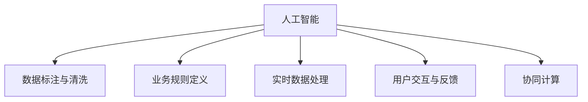

                 

## 1. 背景介绍

### 1.1 问题由来
近年来，随着计算能力的飞速提升和数据量的爆炸式增长，人工智能(AI)技术在商业领域的应用日益广泛。从自动驾驶、机器人到智能客服、个性化推荐，AI技术已经渗透到企业运营的方方面面。而基于"人类计算"的AI驱动创新，成为了企业数字化转型升级的重要工具。

"人类计算"这一概念，指的是通过大规模人工数据标注、规则设计等方式，将人类的知识和智慧编码为AI系统所能理解和执行的指令，从而实现智能决策和自动化操作。这一过程是AI与人类智慧深度融合的重要体现，也是AI驱动商业创新的核心手段。

### 1.2 问题核心关键点
"人类计算"的商业应用，主要集中在以下几个方面：

1. **数据标注与清洗**：AI模型的训练需要大量的标注数据，而人类标注人员可以通过精确定义规则、校验数据质量，为模型提供高质量的数据源。
2. **业务规则定义**：通过人工规则设计，指导AI模型在特定业务场景中的行为，提升决策的合理性和准确性。
3. **实时数据处理**：在数据量巨大、实时性要求高的场景下，人类计算可以提供灵活的算法设计和实时计算能力，帮助企业快速响应市场变化。
4. **用户交互与反馈**：通过与用户的直接互动，收集用户的反馈和行为数据，实时调整AI模型策略，提升用户体验和满意度。

这些核心关键点共同构成了"人类计算"在商业应用中的主要工作流程，使得AI技术能够更紧密地结合业务需求，实现商业价值的最大化。

### 1.3 问题研究意义
研究"人类计算"在商业应用中的策略和实施方法，对于提升企业的数据治理能力、业务决策智能化水平、用户体验和效率等方面具有重要意义：

1. **数据治理能力的提升**：通过高质量的标注和清洗，企业可以获得更加准确、全面的数据洞察，提升数据治理水平。
2. **业务决策智能化**：结合人工规则和AI模型，可以实现更为精细、高效的业务决策，减少人为错误和偏差。
3. **用户体验优化**：通过实时数据处理和用户反馈，AI系统可以更快速、准确地响应用户需求，提升用户满意度和忠诚度。
4. **效率提升**：在处理大规模数据和实时任务时，"人类计算"能够提供灵活的计算资源和算法设计，显著提升企业运营效率。
5. **创新加速**：将"人类计算"与AI技术深度结合，可以加速新产品、新服务的开发和迭代，提升市场竞争力。

因此，"人类计算"在商业应用中的研究，将为企业的数字化转型提供重要的技术支持和方法论指导。

## 2. 核心概念与联系

### 2.1 核心概念概述

为了更好地理解"人类计算"在商业中的应用，本节将介绍几个密切相关的核心概念：

- **人工智能(AI)**：通过机器学习和深度学习等技术，使计算机具备人类智能的推理、学习、判断等能力。
- **数据标注与清洗**：通过人工标注和数据清洗，为AI模型提供高质量的数据输入，提升模型训练效果。
- **业务规则定义**：通过人工设计规则，指导AI模型在特定业务场景中的行为，提升决策的合理性和准确性。
- **实时数据处理**：在数据量巨大、实时性要求高的场景下，通过人工算法设计和计算资源，实现高效的数据处理。
- **用户交互与反馈**：通过与用户的直接互动，收集用户反馈，实时调整AI模型策略，提升用户体验。
- **协同计算**：结合人工计算与AI计算，共同完成复杂的任务，提升整体效率和效果。

这些核心概念之间的逻辑关系可以通过以下Mermaid流程图来展示：



这个流程图展示了几大核心概念及其之间的关系：

1. AI系统通过高质量的数据输入和业务规则，进行模型训练和推理。
2. 数据标注和清洗为模型训练提供数据源。
3. 业务规则定义指导模型行为，提升决策合理性。
4. 实时数据处理在数据量巨大、实时性要求高的场景下提供支持。
5. 用户交互和反馈帮助模型实时调整策略，提升用户体验。
6. 协同计算结合人工计算和AI计算，共同完成复杂任务。

这些概念共同构成了"人类计算"在商业应用的框架，使得AI技术能够更好地融入业务流程，实现智能化和自动化。

## 3. 核心算法原理 & 具体操作步骤
### 3.1 算法原理概述

"人类计算"在商业应用的算法原理，主要涉及以下几个方面：

1. **数据标注与清洗**：通过人工标注和清洗，为AI模型提供高质量的数据源，提升模型训练效果。
2. **业务规则定义**：通过人工设计规则，指导AI模型在特定业务场景中的行为，提升决策的合理性和准确性。
3. **实时数据处理**：在数据量巨大、实时性要求高的场景下，通过人工算法设计和计算资源，实现高效的数据处理。
4. **用户交互与反馈**：通过与用户的直接互动，收集用户反馈，实时调整AI模型策略，提升用户体验。

这些算法的核心在于如何通过人工智慧和AI技术的结合，实现商业价值的最大化。

### 3.2 算法步骤详解

"人类计算"在商业应用的算法步骤，一般包括以下几个关键步骤：

**Step 1: 数据准备**
- 收集并整理企业业务相关的数据，如客户交易数据、产品使用数据、用户行为数据等。
- 对数据进行初步清洗和去重，去除无效和噪声数据。
- 标注数据，例如为图像标注边界框、为文本标注实体类型等。

**Step 2: 模型训练**
- 选择适合的AI模型（如CNN、RNN、Transformer等），进行预训练。
- 利用标注数据对模型进行有监督微调，训练模型在特定任务上的性能。
- 进行模型评估，选择最优模型进行后续应用。

**Step 3: 规则定义**
- 根据业务需求，设计规则模板，例如用户行为分类规则、异常检测规则等。
- 利用人工专家经验，编写具体的规则代码，实现业务逻辑。
- 集成规则到AI系统中，指导AI模型的行为。

**Step 4: 实时数据处理**
- 在数据量巨大、实时性要求高的场景下，设计高效的算法和计算流程。
- 使用分布式计算框架，如Spark、Flink等，实现大规模数据的实时处理。
- 根据业务需求，优化算法设计，提升数据处理效率。

**Step 5: 用户交互与反馈**
- 设计用户界面(UI)和用户体验(UX)，实现用户与AI系统的互动。
- 收集用户反馈，例如用户评价、投诉、建议等。
- 根据用户反馈，实时调整AI模型策略，提升用户体验。

**Step 6: 模型迭代**
- 定期收集新的数据和用户反馈，进行模型再训练和规则更新。
- 结合最新的数据和业务需求，优化模型和规则，提升系统性能。

### 3.3 算法优缺点

"人类计算"在商业应用中的算法，具有以下优点：

1. **决策合理性**：通过人工规则指导AI模型，提升决策的合理性和准确性。
2. **数据质量高**：人工标注和清洗能够提供高质量的数据，提升模型训练效果。
3. **实时响应**：人工规则和实时数据处理能力，能够快速响应市场变化和用户需求。
4. **用户体验优化**：通过用户交互和反馈，实时调整AI策略，提升用户体验和满意度。

同时，这些算法也存在一些局限性：

1. **成本高**：人工标注和规则设计需要大量人力和时间投入，成本较高。
2. **依赖人工**：依赖人工智慧，难以快速应对变化多端的市场和业务需求。
3. **模型鲁棒性**：人工规则和数据标注可能存在偏差，影响模型鲁棒性。
4. **可扩展性**：人工规则设计较为繁琐，难以扩展到大规模复杂场景。

尽管存在这些局限性，但"人类计算"在商业应用中的算法，依然通过其高效性和灵活性，实现了广泛的应用和显著的价值提升。

### 3.4 算法应用领域

"人类计算"在商业应用中，广泛应用于以下几个领域：

- **金融风控**：通过用户行为分析和异常检测规则，实时识别欺诈和风险行为。
- **电商平台**：利用用户行为分析和推荐规则，实现个性化推荐和营销策略优化。
- **医疗健康**：结合医生经验和人机协同计算，实现精准诊断和个性化治疗方案。
- **制造业**：通过设备数据和规则定义，实现设备状态监测和故障预测。
- **智能客服**：通过用户交互和反馈，实时调整AI策略，提升客服质量和用户满意度。

这些应用领域展示了"人类计算"在商业中的广泛价值和重要地位。通过将人类智慧与AI技术深度结合，"人类计算"在各个行业领域中取得了显著的商业应用效果。

## 4. 数学模型和公式 & 详细讲解  
### 4.1 数学模型构建

为更好地理解"人类计算"在商业应用中的算法原理，本节将使用数学语言对算法过程进行更加严格的刻画。

设企业业务数据为 $\mathcal{D}=\{x_1,x_2,...,x_n\}$，其中 $x_i$ 表示第 $i$ 个数据样本，$x_i$ 为多维向量，表示企业业务的各项特征。

**Step 1: 数据准备**
数据预处理和清洗过程可表示为：

$$
D^{\prime}=\{\hat{x}_1,\hat{x}_2,...,\hat{x}_n\}
$$

其中 $\hat{x}_i$ 为清洗和标注后的数据样本。

**Step 2: 模型训练**
选择训练模型 $M_{\theta}$，利用标注数据 $D^{\prime}$ 进行训练：

$$
\theta^{\prime}=\mathop{\arg\min}_{\theta}\mathcal{L}(M_{\theta},D^{\prime})
$$

其中 $\mathcal{L}$ 为模型损失函数，如交叉熵损失、均方误差损失等。

**Step 3: 规则定义**
人工设计规则模板，例如用户行为分类规则 $R^{\prime}$，表示为：

$$
R^{\prime}=\{r_1,r_2,...,r_m\}
$$

其中 $r_j$ 为规则编号，$j \in [1,m]$。

**Step 4: 实时数据处理**
实时数据处理流程可表示为：

$$
\mathcal{D}_{realtime}=\{\hat{x}^{\prime}_t\}_{t=1}^{T}
$$

其中 $\hat{x}^{\prime}_t$ 为第 $t$ 个实时数据样本。

**Step 5: 用户交互与反馈**
用户反馈过程可表示为：

$$
F=\{\hat{f}_1,\hat{f}_2,...,\hat{f}_m\}
$$

其中 $\hat{f}_j$ 为第 $j$ 个用户反馈，$j \in [1,m]$。

**Step 6: 模型迭代**
模型迭代过程可表示为：

$$
\theta^{\prime\prime}=\theta^{\prime}-\Delta\theta^{\prime}
$$

其中 $\Delta\theta^{\prime}$ 为模型参数更新量。

### 4.2 公式推导过程

以下我们以金融风控为例，推导基于"人类计算"的异常检测模型构建过程。

假设企业交易数据为 $\{x_1,x_2,...,x_n\}$，其中 $x_i$ 表示第 $i$ 笔交易的特征向量。

**Step 1: 数据准备**
通过人工标注，得到标注数据集 $D^{\prime}=\{\hat{x}_1,\hat{x}_2,...,\hat{x}_n\}$，其中 $\hat{x}_i$ 为标注后的数据样本。

**Step 2: 模型训练**
选择训练模型 $M_{\theta}$，利用标注数据 $D^{\prime}$ 进行训练：

$$
\theta^{\prime}=\mathop{\arg\min}_{\theta}\mathcal{L}(M_{\theta},D^{\prime})
$$

其中 $\mathcal{L}$ 为模型损失函数，如交叉熵损失、均方误差损失等。

**Step 3: 规则定义**
设计异常检测规则模板 $R^{\prime}$，例如：

$$
R^{\prime}=\{r_1,r_2,...,r_m\}
$$

其中 $r_j$ 为规则编号，$j \in [1,m]$。

**Step 4: 实时数据处理**
实时数据处理流程可表示为：

$$
\mathcal{D}_{realtime}=\{\hat{x}^{\prime}_t\}_{t=1}^{T}
$$

其中 $\hat{x}^{\prime}_t$ 为第 $t$ 个实时数据样本。

**Step 5: 用户交互与反馈**
用户反馈过程可表示为：

$$
F=\{\hat{f}_1,\hat{f}_2,...,\hat{f}_m\}
$$

其中 $\hat{f}_j$ 为第 $j$ 个用户反馈，$j \in [1,m]$。

**Step 6: 模型迭代**
模型迭代过程可表示为：

$$
\theta^{\prime\prime}=\theta^{\prime}-\Delta\theta^{\prime}
$$

其中 $\Delta\theta^{\prime}$ 为模型参数更新量。

在得到模型参数更新量 $\Delta\theta^{\prime}$ 后，即可带入模型参数更新公式，完成模型的迭代优化。重复上述过程直至收敛，最终得到适应业务需求的最优模型参数 $\theta^{\prime\prime}$。

## 5. 项目实践：代码实例和详细解释说明
### 5.1 开发环境搭建

在进行"人类计算"项目实践前，我们需要准备好开发环境。以下是使用Python进行PyTorch开发的环境配置流程：

1. 安装Anaconda：从官网下载并安装Anaconda，用于创建独立的Python环境。

2. 创建并激活虚拟环境：
```bash
conda create -n pytorch-env python=3.8 
conda activate pytorch-env
```

3. 安装PyTorch：根据CUDA版本，从官网获取对应的安装命令。例如：
```bash
conda install pytorch torchvision torchaudio cudatoolkit=11.1 -c pytorch -c conda-forge
```

4. 安装Transformers库：
```bash
pip install transformers
```

5. 安装各类工具包：
```bash
pip install numpy pandas scikit-learn matplotlib tqdm jupyter notebook ipython
```

完成上述步骤后，即可在`pytorch-env`环境中开始"人类计算"实践。

### 5.2 源代码详细实现

这里我们以金融风控为例，给出使用Transformers库对BERT模型进行异常检测的PyTorch代码实现。

首先，定义异常检测数据处理函数：

```python
from transformers import BertTokenizer
from torch.utils.data import Dataset
import torch

class AnomalyDetectionDataset(Dataset):
    def __init__(self, texts, labels, tokenizer, max_len=128):
        self.texts = texts
        self.labels = labels
        self.tokenizer = tokenizer
        self.max_len = max_len
        
    def __len__(self):
        return len(self.texts)
    
    def __getitem__(self, item):
        text = self.texts[item]
        label = self.labels[item]
        
        encoding = self.tokenizer(text, return_tensors='pt', max_length=self.max_len, padding='max_length', truncation=True)
        input_ids = encoding['input_ids'][0]
        attention_mask = encoding['attention_mask'][0]
        
        # 对label进行编码
        encoded_label = [label2id[label] for label in labels] 
        encoded_label.extend([label2id['normal']] * (self.max_len - len(encoded_label)))
        labels = torch.tensor(encoded_label, dtype=torch.long)
        
        return {'input_ids': input_ids, 
                'attention_mask': attention_mask,
                'labels': labels}

# 标签与id的映射
label2id = {'normal': 0, 'anomalous': 1}
id2label = {v: k for k, v in label2id.items()}

# 创建dataset
tokenizer = BertTokenizer.from_pretrained('bert-base-cased')

train_dataset = AnomalyDetectionDataset(train_texts, train_labels, tokenizer)
dev_dataset = AnomalyDetectionDataset(dev_texts, dev_labels, tokenizer)
test_dataset = AnomalyDetectionDataset(test_texts, test_labels, tokenizer)
```

然后，定义模型和优化器：

```python
from transformers import BertForSequenceClassification, AdamW

model = BertForSequenceClassification.from_pretrained('bert-base-cased', num_labels=len(label2id))

optimizer = AdamW(model.parameters(), lr=2e-5)
```

接着，定义训练和评估函数：

```python
from torch.utils.data import DataLoader
from tqdm import tqdm
from sklearn.metrics import classification_report

device = torch.device('cuda') if torch.cuda.is_available() else torch.device('cpu')
model.to(device)

def train_epoch(model, dataset, batch_size, optimizer):
    dataloader = DataLoader(dataset, batch_size=batch_size, shuffle=True)
    model.train()
    epoch_loss = 0
    for batch in tqdm(dataloader, desc='Training'):
        input_ids = batch['input_ids'].to(device)
        attention_mask = batch['attention_mask'].to(device)
        labels = batch['labels'].to(device)
        model.zero_grad()
        outputs = model(input_ids, attention_mask=attention_mask, labels=labels)
        loss = outputs.loss
        epoch_loss += loss.item()
        loss.backward()
        optimizer.step()
    return epoch_loss / len(dataloader)

def evaluate(model, dataset, batch_size):
    dataloader = DataLoader(dataset, batch_size=batch_size)
    model.eval()
    preds, labels = [], []
    with torch.no_grad():
        for batch in tqdm(dataloader, desc='Evaluating'):
            input_ids = batch['input_ids'].to(device)
            attention_mask = batch['attention_mask'].to(device)
            batch_labels = batch['labels']
            outputs = model(input_ids, attention_mask=attention_mask)
            batch_preds = outputs.logits.argmax(dim=2).to('cpu').tolist()
            batch_labels = batch_labels.to('cpu').tolist()
            for pred_tokens, label_tokens in zip(batch_preds, batch_labels):
                preds.append(pred_tokens[:len(label_tokens)])
                labels.append(label_tokens)
                
    print(classification_report(labels, preds))
```

最后，启动训练流程并在测试集上评估：

```python
epochs = 5
batch_size = 16

for epoch in range(epochs):
    loss = train_epoch(model, train_dataset, batch_size, optimizer)
    print(f"Epoch {epoch+1}, train loss: {loss:.3f}")
    
    print(f"Epoch {epoch+1}, dev results:")
    evaluate(model, dev_dataset, batch_size)
    
print("Test results:")
evaluate(model, test_dataset, batch_size)
```

以上就是使用PyTorch对BERT进行异常检测任务的"人类计算"实践代码实现。可以看到，得益于Transformers库的强大封装，我们可以用相对简洁的代码完成BERT模型的加载和微调。

### 5.3 代码解读与分析

让我们再详细解读一下关键代码的实现细节：

**AnomalyDetectionDataset类**：
- `__init__`方法：初始化文本、标签、分词器等关键组件。
- `__len__`方法：返回数据集的样本数量。
- `__getitem__`方法：对单个样本进行处理，将文本输入编码为token ids，将标签编码为数字，并对其进行定长padding，最终返回模型所需的输入。

**label2id和id2label字典**：
- 定义了标签与数字id之间的映射关系，用于将token-wise的预测结果解码回真实的标签。

**训练和评估函数**：
- 使用PyTorch的DataLoader对数据集进行批次化加载，供模型训练和推理使用。
- 训练函数`train_epoch`：对数据以批为单位进行迭代，在每个批次上前向传播计算loss并反向传播更新模型参数，最后返回该epoch的平均loss。
- 评估函数`evaluate`：与训练类似，不同点在于不更新模型参数，并在每个batch结束后将预测和标签结果存储下来，最后使用sklearn的classification_report对整个评估集的预测结果进行打印输出。

**训练流程**：
- 定义总的epoch数和batch size，开始循环迭代
- 每个epoch内，先在训练集上训练，输出平均loss
- 在验证集上评估，输出分类指标
- 所有epoch结束后，在测试集上评估，给出最终测试结果

可以看到，PyTorch配合Transformers库使得BERT微调的代码实现变得简洁高效。开发者可以将更多精力放在数据处理、模型改进等高层逻辑上，而不必过多关注底层的实现细节。

当然，工业级的系统实现还需考虑更多因素，如模型的保存和部署、超参数的自动搜索、更灵活的任务适配层等。但核心的"人类计算"微调范式基本与此类似。

## 6. 实际应用场景
### 6.1 智能客服系统

"人类计算"在智能客服系统的应用中，能够显著提升客服效率和用户满意度。通过"人类计算"的辅助，智能客服系统能够更好地理解用户意图，快速响应客户咨询，并提供更符合用户需求的解决方案。

在技术实现上，可以收集客户与客服的对话记录，将问题与最佳答复构建成监督数据，在此基础上对预训练对话模型进行微调。微调后的对话模型能够自动理解用户意图，匹配最合适的答案模板进行回复。对于客户提出的新问题，还可以接入检索系统实时搜索相关内容，动态组织生成回答。如此构建的智能客服系统，能大幅提升客户咨询体验和问题解决效率。

### 6.2 金融风控

在金融领域，"人类计算"技术能够帮助银行和金融机构实现实时欺诈检测和风险管理。通过人工标注和规则设计，系统可以实时分析客户交易行为，快速识别异常交易和潜在的风险。例如，通过异常检测规则，系统可以识别异常交易模式，及时发出预警并采取措施，从而减少欺诈损失。

在实际应用中，银行和金融机构可以将客户交易数据作为模型输入，利用预训练模型进行训练，并在训练集上标注异常交易记录。训练好的模型可以实时处理新的交易数据，判断是否为异常交易。若判断为异常，系统可以自动触发告警，通知相关人员进行人工复核，以确保交易安全。

### 6.3 电商推荐系统

"人类计算"在电商推荐系统中，能够实现个性化推荐和用户行为分析。通过人工标注和规则设计，系统可以根据用户的历史行为数据和实时行为数据，进行精准的推荐和实时分析。例如，通过用户行为分类规则，系统可以将用户分为不同的行为类别，并根据行为类别进行个性化推荐。同时，通过实时数据处理，系统可以及时捕捉用户行为的动态变化，优化推荐策略，提升用户体验。

在实际应用中，电商企业可以将用户行为数据作为模型输入，利用预训练模型进行训练，并在训练集上标注行为数据。训练好的模型可以实时处理新的用户行为数据，并根据行为分类规则进行个性化推荐。同时，通过用户反馈和实时数据处理，系统可以不断优化推荐策略，提升推荐效果。

### 6.4 未来应用展望

随着"人类计算"技术的不断进步，未来将在更多领域得到应用，为传统行业带来变革性影响。

在智慧医疗领域，基于"人类计算"的医学图像分析、个性化治疗方案制定等应用，将提升医疗服务的智能化水平，辅助医生诊疗，加速新药开发进程。

在智能教育领域，"人类计算"可应用于作业批改、学情分析、知识推荐等方面，因材施教，促进教育公平，提高教学质量。

在智慧城市治理中，"人类计算"能够实现城市事件监测、舆情分析、应急指挥等环节，提高城市管理的自动化和智能化水平，构建更安全、高效的未来城市。

此外，在企业生产、社会治理、文娱传媒等众多领域，"人类计算"技术也将不断涌现，为经济社会发展注入新的动力。相信随着技术的日益成熟，"人类计算"方法将成为人工智能落地应用的重要范式，推动人工智能技术在各个领域的发展。

## 7. 工具和资源推荐
### 7.1 学习资源推荐

为了帮助开发者系统掌握"人类计算"的理论基础和实践技巧，这里推荐一些优质的学习资源：

1. 《Transformers from the Ground Up》系列博文：由Transformers库作者撰写，深入浅出地介绍了Transformer原理、BERT模型、微调技术等前沿话题。

2. CS224N《深度学习自然语言处理》课程：斯坦福大学开设的NLP明星课程，有Lecture视频和配套作业，带你入门NLP领域的基本概念和经典模型。

3. 《Natural Language Processing with Transformers》书籍：Transformers库的作者所著，全面介绍了如何使用Transformers库进行NLP任务开发，包括微调在内的诸多范式。

4. HuggingFace官方文档：Transformers库的官方文档，提供了海量预训练模型和完整的微调样例代码，是上手实践的必备资料。

5. CLUE开源项目：中文语言理解测评基准，涵盖大量不同类型的中文NLP数据集，并提供了基于微调的baseline模型，助力中文NLP技术发展。

通过对这些资源的学习实践，相信你一定能够快速掌握"人类计算"的精髓，并用于解决实际的NLP问题。
###  7.2 开发工具推荐

高效的开发离不开优秀的工具支持。以下是几款用于"人类计算"开发的常用工具：

1. PyTorch：基于Python的开源深度学习框架，灵活动态的计算图，适合快速迭代研究。大部分预训练语言模型都有PyTorch版本的实现。

2. TensorFlow：由Google主导开发的开源深度学习框架，生产部署方便，适合大规模工程应用。同样有丰富的预训练语言模型资源。

3. Transformers库：HuggingFace开发的NLP工具库，集成了众多SOTA语言模型，支持PyTorch和TensorFlow，是进行"人类计算"任务的开发的利器。

4. Weights & Biases：模型训练的实验跟踪工具，可以记录和可视化模型训练过程中的各项指标，方便对比和调优。与主流深度学习框架无缝集成。

5. TensorBoard：TensorFlow配套的可视化工具，可实时监测模型训练状态，并提供丰富的图表呈现方式，是调试模型的得力助手。

6. Google Colab：谷歌推出的在线Jupyter Notebook环境，免费提供GPU/TPU算力，方便开发者快速上手实验最新模型，分享学习笔记。

合理利用这些工具，可以显著提升"人类计算"任务的开发效率，加快创新迭代的步伐。

### 7.3 相关论文推荐

"人类计算"技术的发展源于学界的持续研究。以下是几篇奠基性的相关论文，推荐阅读：

1. Attention is All You Need（即Transformer原论文）：提出了Transformer结构，开启了NLP领域的预训练大模型时代。

2. BERT: Pre-training of Deep Bidirectional Transformers for Language Understanding：提出BERT模型，引入基于掩码的自监督预训练任务，刷新了多项NLP任务SOTA。

3. Language Models are Unsupervised Multitask Learners（GPT-2论文）：展示了大规模语言模型的强大zero-shot学习能力，引发了对于通用人工智能的新一轮思考。

4. Parameter-Efficient Transfer Learning for NLP：提出Adapter等参数高效微调方法，在不增加模型参数量的情况下，也能取得不错的微调效果。

5. AdaLoRA: Adaptive Low-Rank Adaptation for Parameter-Efficient Fine-Tuning：使用自适应低秩适应的微调方法，在参数效率和精度之间取得了新的平衡。

6. Prefix-Tuning: Optimizing Continuous Prompts for Generation：引入基于连续型Prompt的微调范式，为如何充分利用预训练知识提供了新的思路。

这些论文代表了大语言模型微调技术的发展脉络。通过学习这些前沿成果，可以帮助研究者把握学科前进方向，激发更多的创新灵感。

## 8. 总结：未来发展趋势与挑战

### 8.1 总结

本文对"人类计算"在商业应用中的策略和实施方法进行了全面系统的介绍。首先阐述了"人类计算"在商业应用中的核心关键点和研究意义，明确了其在提升数据治理能力、业务决策智能化水平、用户体验和效率等方面的重要价值。其次，从原理到实践，详细讲解了"人类计算"的算法过程，给出了"人类计算"任务开发的完整代码实例。同时，本文还广泛探讨了"人类计算"在金融风控、智能客服、电商推荐等多个行业领域的应用前景，展示了其在商业应用中的广泛价值和重要地位。

通过本文的系统梳理，可以看到，"人类计算"技术正在成为企业数字化转型中的重要工具，极大地提升了企业的数据治理能力、业务决策智能化水平、用户体验和效率。未来，随着技术的不断发展，"人类计算"将在更多领域得到应用，为传统行业带来变革性影响。

### 8.2 未来发展趋势

展望未来，"人类计算"技术将呈现以下几个发展趋势：

1. **深度融合**："人类计算"将与AI技术深度融合，实现更高水平的智能化和自动化。例如，结合人机协同计算，提升模型决策的合理性和准确性。

2. **实时处理**：在数据量巨大、实时性要求高的场景下，"人类计算"将提供更高效的实时数据处理能力，提升系统响应速度和用户体验。

3. **多模态融合**："人类计算"将结合文本、图像、视频、语音等多模态数据，实现更为全面、准确的商业洞察和决策支持。

4. **自动优化**："人类计算"将结合自动优化算法，如强化学习、超参数调优等，提升模型的自适应能力和鲁棒性。

5. **跨领域应用**："人类计算"将在更多领域得到应用，如金融风控、智能客服、医疗健康、电商推荐等，推动各行业的智能化转型升级。

6. **持续学习**："人类计算"将结合持续学习技术，不断优化模型和规则，提升系统的性能和适应能力。

以上趋势凸显了"人类计算"在商业应用中的广阔前景。这些方向的探索发展，必将进一步提升企业的数据治理能力、业务决策智能化水平、用户体验和效率，推动企业数字化转型向更深的层次发展。

### 8.3 面临的挑战

尽管"人类计算"技术已经取得了显著的商业应用效果，但在迈向更加智能化、普适化应用的过程中，仍面临诸多挑战：

1. **标注成本高**：人工标注和规则设计需要大量人力和时间投入，成本较高。如何降低标注成本，提高标注效率，仍是一个重要课题。

2. **依赖人工智慧**："人类计算"高度依赖人工智慧，难以快速应对变化多端的市场和业务需求。如何提升系统的自适应能力，减少人工干预，是未来的研究方向。

3. **模型鲁棒性**："人类计算"模型可能存在偏见和误差，影响系统鲁棒性。如何提高模型的泛化能力和鲁棒性，是重要的研究课题。

4. **可扩展性**：人工规则设计较为繁琐，难以扩展到大规模复杂场景。如何实现规则设计的自动化和系统化，是未来的研究方向。

5. **系统复杂性**："人类计算"系统往往包含多个子系统，如数据标注、模型训练、规则设计、用户交互等，系统复杂性较高。如何提升系统稳定性，降低系统维护成本，是重要的研究方向。

6. **伦理道德**："人类计算"模型可能学习到有偏见、有害的信息，对用户隐私和公平性构成威胁。如何保障数据隐私和系统公平性，是未来的研究方向。

尽管存在这些挑战，但"人类计算"技术在商业应用中的前景广阔，具有重要的研究价值和应用潜力。未来，随着技术的不断进步和研究的深入，相信"人类计算"将更好地融入商业系统，推动企业数字化转型向更深层次发展。

### 8.4 研究展望

未来，"人类计算"技术的研究方向可能包括以下几个方面：

1. **自动化标注**：研究如何利用人工智能辅助或替代人工标注，降低标注成本，提高标注效率。

2. **自适应规则**：研究如何利用人工智能自动生成和优化业务规则，提升系统的自适应能力和鲁棒性。

3. **跨模态融合**：研究如何结合多种模态数据，提升系统的全面性和准确性。

4. **跨领域应用**：研究如何将"人类计算"技术应用于更多领域，提升各行业的智能化水平。

5. **持续学习**：研究如何结合持续学习技术，提升系统的持续适应能力和性能优化能力。

6. **伦理道德**：研究如何在保障用户隐私和系统公平性的基础上，应用"人类计算"技术，构建可信赖的商业系统。

这些研究方向将引领"人类计算"技术迈向更高的台阶，为构建安全、可靠、可解释、可控的智能系统铺平道路。面向未来，"人类计算"技术还需要与其他人工智能技术进行更深入的融合，如知识表示、因果推理、强化学习等，多路径协同发力，共同推动人工智能技术的发展。只有勇于创新、敢于突破，才能不断拓展"人类计算"技术的边界，让智能技术更好地造福人类社会。

## 9. 附录：常见问题与解答

**Q1：如何降低"人类计算"中的标注成本？**

A: 降低"人类计算"中的标注成本，可以从以下几个方面进行尝试：

1. **自动化标注**：利用人工智能技术，如机器学习、深度学习等，辅助或替代人工标注。例如，使用预训练模型对文本进行初步分类，再由人工进行校验和修正。
2. **众包标注**：利用众包平台，将标注任务外包给普通用户或专业标注人员，降低人力成本。
3. **半监督学习**：结合少量标注数据和大量无标签数据，进行半监督学习，减少对标注数据的依赖。例如，使用自监督预训练技术，从大量无标签数据中提取结构化信息。
4. **多模态标注**：结合文本、图像、语音等多模态数据，进行联合标注，提高标注效率和准确性。

通过这些方法，可以显著降低"人类计算"中的标注成本，提高标注效率。

**Q2：如何提升"人类计算"中的规则设计能力？**

A: 提升"人类计算"中的规则设计能力，可以从以下几个方面进行尝试：

1. **自动规则生成**：利用人工智能技术，如机器学习、深度学习等，自动生成和优化业务规则。例如，使用预训练模型对用户行为进行分类，自动生成推荐规则。
2. **规则模板化**：将业务规则进行模板化，提高规则设计的复用性和可维护性。例如，将用户行为分类规则、异常检测规则等进行模板化设计，方便快速调整和优化。
3. **专家知识融合**：结合人工专家经验和AI技术，设计更全面、合理的业务规则。例如，利用专家知识库，指导预训练模型进行规则训练，提升规则设计的合理性和准确性。
4. **持续规则优化**：结合持续学习技术，不断优化业务规则，提高系统的自适应能力和鲁棒性。例如，根据用户反馈和实时数据，动态调整推荐规则和异常检测规则。

通过这些方法，可以显著提升"人类计算"中的规则设计能力，提高系统的自适应能力和鲁棒性。

**Q3：如何确保"人类计算"中的数据隐私和安全？**

A: 确保"人类计算"中的数据隐私和安全，可以从以下几个方面进行尝试：

1. **数据脱敏**：对敏感数据进行脱敏处理，保护用户隐私。例如，对用户个人信息进行去标识化处理，去除敏感信息。
2. **访问控制**：严格控制数据的访问权限，确保只有授权人员能够访问和使用数据。例如，使用基于角色的访问控制机制，限制数据访问范围。
3. **加密存储**：对敏感数据进行加密存储，保护数据安全。例如，使用AES等加密算法对数据进行加密存储。
4. **合规审查**：确保"人类计算"系统符合数据隐私和安全法律法规，防止数据泄露和滥用。例如，定期进行合规审查和风险评估，确保系统符合GDPR等法律法规。
5. **用户透明度**：向用户透明展示数据处理和使用情况，增强用户信任。例如，提供数据使用说明和隐私政策，让用户了解数据使用情况。

通过这些方法，可以显著提升"人类计算"中的数据隐私和安全保障能力，构建可信赖的商业系统。

**Q4：如何提升"人类计算"中的模型鲁棒性？**

A: 提升"人类计算"中的模型鲁棒性，可以从以下几个方面进行尝试：

1. **多源数据融合**：结合多源数据，提升模型的泛化能力和鲁棒性。例如，结合用户行为数据、交易数据、社交网络数据等，进行联合建模。
2. **对抗样本训练**：利用对抗样本训练，提升模型的鲁棒性和泛化能力。例如，使用对抗样本生成技术，生成并训练模型对抗样本，提升模型的鲁棒性。
3. **数据增强**：利用数据增强技术，提升模型的鲁棒性和泛化能力。例如，对数据进行旋转、缩放、噪声添加等处理，提升模型的泛化能力。
4. **模型集成**：结合多个模型，提升模型的鲁棒性和泛化能力。例如，使用模型集成技术，结合多个预训练模型进行联合推理。
5. **规则设计**：结合人工规则和AI技术，提升模型的鲁棒性和泛化能力。例如，利用专家知识库，指导预训练模型进行规则训练，提升模型的鲁棒性。

通过这些方法，可以显著提升"人类计算"中的模型鲁棒性，提高系统的稳定性和可靠性。

**Q5：如何提升"人类计算"中的系统效率？**

A: 提升"人类计算"中的系统效率，可以从以下几个方面进行尝试：

1. **分布式计算**：利用分布式计算技术，提升系统的处理能力和效率。例如，使用Spark、Flink等分布式计算框架，提升数据处理和模型训练效率。
2. **模型压缩**：对模型进行压缩和优化，提升模型的计算效率和内存占用。例如，使用模型剪枝、量化等技术，对模型进行压缩和优化。
3. **缓存机制**：利用缓存机制，提升系统的响应速度和效率。例如，使用Redis等缓存系统，缓存频繁访问的数据和结果，提升系统响应速度。
4. **算法优化**：优化算法设计，提升算法的计算效率和资源利用率。例如，使用优化算法，减少计算量和资源消耗，提升系统效率。

通过这些方法，可以显著提升"人类计算"中的系统效率，提高系统的响应速度和处理能力。

---

作者：禅与计算机程序设计艺术 / Zen and the Art of Computer Programming

