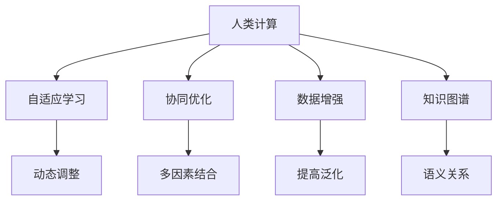

                 

# AI驱动的创新：人类计算在商业中的未来发展

> 关键词：AI驱动,人类计算,商业应用,大数据,算法优化,人工智能,自动化,业务创新

## 1. 背景介绍

### 1.1 问题由来
随着人工智能(AI)技术的飞速发展，人类计算在商业中的应用日益广泛。从自动化的生产线到智能的客户服务，从精准的市场分析到高效的数据管理，AI正深刻地改变着企业的运营模式和决策方式。然而，尽管AI带来了诸多便利，其在商业应用中的局限性也逐渐显现。传统AI算法往往依赖于大量标注数据和复杂的计算资源，难以在资源有限的情况下发挥出最佳效果。

### 1.2 问题核心关键点
人类计算作为一种新兴的AI范式，旨在充分利用人类智慧和计算资源，通过巧妙的设计和优化，实现高效、精准的商业应用。其核心思想在于将人类专家的知识和经验融入算法设计，结合机器学习和自动化技术，提升AI系统的性能和可解释性，从而更好地适应商业环境。

### 1.3 问题研究意义
人类计算在商业中的应用，具有重要的研究意义：

1. **提升决策质量**：通过引入人类智慧，优化算法设计，使得AI系统能够更好地理解复杂商业场景，提供更为精准的决策支持。
2. **降低成本**：减少对昂贵标注数据和计算资源的依赖，降低商业AI应用的成本门槛，使更多企业能够享受到AI带来的红利。
3. **增强可解释性**：结合人类的专业知识，提供更为透明、可解释的决策过程，提升AI系统的可信度和接受度。
4. **促进业务创新**：通过融入人类的创新思维，激发新的商业模式和应用场景，推动商业领域的变革和升级。

## 2. 核心概念与联系

### 2.1 核心概念概述

为更好地理解人类计算在商业中的应用，本节将介绍几个密切相关的核心概念：

- **人类计算**：一种将人类智慧和计算资源结合的AI范式，通过优化算法设计，使AI系统更好地适应商业环境，提升决策质量和业务效率。
- **自适应学习**：指AI系统能够根据环境和任务的变化，动态调整学习策略和模型参数，提升适应性和灵活性。
- **协同优化**：通过将多个因素（如人类专家、数据、算法）结合，实现最优的系统配置，提升整体性能。
- **数据增强**：通过增强数据的多样性和质量，提高AI模型的泛化能力和鲁棒性。
- **知识图谱**：一种结构化知识表示方式，用于捕捉实体之间的语义关系，辅助AI系统理解复杂商业场景。

这些核心概念之间的逻辑关系可以通过以下Mermaid流程图来展示：



这个流程图展示了你计人类计算的核心概念及其之间的关系：

1. 人类计算通过优化算法设计，使AI系统更好地适应商业环境。
2. 自适应学习帮助系统根据环境和任务变化，动态调整学习策略。
3. 协同优化结合多个因素，实现最优的系统配置。
4. 数据增强提高模型的泛化能力和鲁棒性。
5. 知识图谱辅助系统理解复杂商业场景。

这些概念共同构成了人类计算在商业中的应用框架，使其能够更好地服务于商业场景，提升企业的运营效率和决策水平。

## 3. 核心算法原理 & 具体操作步骤
### 3.1 算法原理概述

人类计算的核心算法原理，在于将人类专家的知识与机器学习算法结合，通过优化算法设计和策略，实现高效、精准的商业应用。其核心思想是通过自适应学习和协同优化，使AI系统能够动态调整和优化，适应不同商业场景的需求。

具体而言，人类计算主要包括以下几个关键步骤：

1. **数据预处理**：清洗和增强数据，提高数据质量和多样性。
2. **模型设计**：设计合适的算法和架构，融合人类知识和经验。
3. **自适应学习**：动态调整模型参数和学习策略，提升适应性和灵活性。
4. **协同优化**：结合多个因素（如人类专家、数据、算法），实现最优的系统配置。
5. **结果验证**：在实际应用中验证算法效果，不断迭代优化。

### 3.2 算法步骤详解

以下是人类计算在商业应用中的具体步骤详解：

**Step 1: 数据预处理**
- 清洗数据：去除噪声和异常值，保证数据质量。
- 数据增强：通过增强数据的多样性和质量，提高模型的泛化能力和鲁棒性。具体方法包括回译、数据生成、数据合成等。

**Step 2: 模型设计**
- 选择合适的算法和架构：根据任务特点，选择适合的机器学习算法和模型架构。如线性回归、决策树、神经网络等。
- 融合人类知识：结合人类专家的知识和经验，优化算法设计。如引入先验概率、规则约束等。

**Step 3: 自适应学习**
- 动态调整模型参数：根据环境和任务变化，动态调整模型参数和学习策略。如使用在线学习、增量学习等。
- 优化算法设计：通过调整学习率、正则化、激活函数等，优化算法性能。

**Step 4: 协同优化**
- 结合多个因素：结合人类专家、数据、算法等多方面因素，实现最优的系统配置。如通过专家评审、集成学习等方法。
- 自动化优化：使用自动化工具，如AutoML、自动化超参数优化等，优化模型配置和性能。

**Step 5: 结果验证**
- 在实际应用中验证算法效果：通过业务验证、A/B测试等方法，评估算法的实际效果。
- 不断迭代优化：根据验证结果，不断调整算法和模型，提升系统性能。

### 3.3 算法优缺点

人类计算在商业应用中的优缺点如下：

**优点：**

1. **提升决策质量**：结合人类专家的知识和经验，使AI系统能够更好地理解复杂商业场景，提供更为精准的决策支持。
2. **降低成本**：减少对昂贵标注数据和计算资源的依赖，降低商业AI应用的成本门槛，使更多企业能够享受到AI带来的红利。
3. **增强可解释性**：结合人类的专业知识，提供更为透明、可解释的决策过程，提升AI系统的可信度和接受度。
4. **促进业务创新**：通过融入人类的创新思维，激发新的商业模式和应用场景，推动商业领域的变革和升级。

**缺点：**

1. **依赖专家知识**：需要专家提供丰富的知识和经验，对专家的依赖度较高。
2. **算法设计复杂**：算法设计和优化需要高度专业的知识和技能，门槛较高。
3. **数据获取困难**：获取高质量标注数据需要较高的时间和成本投入。
4. **模型解释性差**：复杂算法模型难以解释其内部决策过程，难以满足某些行业对透明度的要求。

尽管存在这些局限性，但就目前而言，人类计算在商业应用中仍展现出显著的优势和潜力，成为推动商业智能发展的重要方向。

### 3.4 算法应用领域

人类计算在商业中的应用领域十分广泛，以下是几个典型应用场景：

**1. 客户服务自动化**
- 结合人类专家的知识，构建智能客户服务平台，提升客户体验。如智能客服系统、客户情感分析、智能推荐等。

**2. 供应链优化**
- 通过优化算法和自适应学习，提升供应链的效率和可靠性。如预测需求、库存管理、物流优化等。

**3. 市场营销分析**
- 利用人类计算技术，进行市场分析和预测，提升市场营销的精准度和效果。如客户细分、广告投放优化、品牌管理等。

**4. 财务风险管理**
- 结合人类专家的财务知识，构建风险评估和预测模型，提升金融机构的决策质量。如信用评分、欺诈检测、投资组合优化等。

**5. 医疗健康管理**
- 通过融合医疗专家的知识，构建智能健康管理系统，提升医疗服务的质量和效率。如疾病预测、健康监测、医疗资源分配等。

此外，人类计算技术还被应用于智能制造、智慧城市、能源管理等多个领域，为商业应用带来新的突破和机遇。

## 4. 数学模型和公式 & 详细讲解 & 举例说明

### 4.1 数学模型构建

为了更好地理解人类计算在商业中的应用，本节将使用数学语言对人类计算的核心模型进行描述。

假设我们有一个二分类问题，输入数据 $x \in \mathbb{R}^n$，标签 $y \in \{0,1\}$，我们的目标是通过学习模型 $f(x;\theta)$ 来预测标签 $y$。其中 $\theta$ 为模型参数，我们需要通过自适应学习和协同优化来不断优化这些参数。

定义损失函数 $\mathcal{L}(\theta)$ 来衡量模型的预测误差，则最优模型参数可以通过求解以下优化问题得到：

$$
\theta^* = \mathop{\arg\min}_{\theta} \mathcal{L}(\theta)
$$

常用的损失函数包括交叉熵损失、均方误差损失等。在实际应用中，我们通常使用梯度下降等优化算法来求解上述最优化问题。

### 4.2 公式推导过程

以线性回归为例，我们推导最优线性回归模型的参数。

假设输入数据 $x \in \mathbb{R}^n$，输出 $y \in \mathbb{R}$，线性回归模型为 $f(x;\theta) = \theta_0 + \theta_1x_1 + \cdots + \theta_nx_n$，其中 $\theta = [\theta_0, \theta_1, \cdots, \theta_n]^T$。

目标是最小化损失函数 $\mathcal{L}(\theta) = \frac{1}{2N}\sum_{i=1}^N(y_i - f(x_i;\theta))^2$，其中 $N$ 为样本数。

对 $\mathcal{L}(\theta)$ 求导，得：

$$
\nabla_{\theta}\mathcal{L}(\theta) = [\frac{\partial\mathcal{L}(\theta)}{\partial\theta_0}, \frac{\partial\mathcal{L}(\theta)}{\partial\theta_1}, \cdots, \frac{\partial\mathcal{L}(\theta)}{\partial\theta_n}]^T
$$

将导数代入梯度下降公式：

$$
\theta \leftarrow \theta - \eta\nabla_{\theta}\mathcal{L}(\theta)
$$

其中 $\eta$ 为学习率。

通过上述过程，我们可以迭代更新模型参数，使得损失函数不断减小，从而得到最优的线性回归模型。

### 4.3 案例分析与讲解

假设我们有一家电商平台，想要预测用户的购买行为。我们可以通过以下步骤实现：

**Step 1: 数据预处理**
- 收集用户的历史购买记录和浏览行为数据。
- 清洗数据，去除噪声和异常值。
- 增强数据，如通过回译、数据生成等方法，丰富数据多样性。

**Step 2: 模型设计**
- 选择合适的算法：线性回归。
- 融合人类知识：引入先验概率和规则约束，优化算法设计。

**Step 3: 自适应学习**
- 动态调整模型参数：使用在线学习、增量学习等方法，适应数据变化。
- 优化算法设计：调整学习率、正则化等参数，优化模型性能。

**Step 4: 协同优化**
- 结合多个因素：结合人类专家、数据、算法等多方面因素，实现最优的系统配置。
- 自动化优化：使用自动化工具，如AutoML、自动化超参数优化等，优化模型配置和性能。

**Step 5: 结果验证**
- 在实际应用中验证算法效果：通过A/B测试等方法，评估算法的实际效果。
- 不断迭代优化：根据验证结果，不断调整算法和模型，提升系统性能。

通过以上步骤，我们可以构建一个高效、精准的用户购买行为预测模型，帮助电商平台提升销售额和客户满意度。

## 5. 项目实践：代码实例和详细解释说明

### 5.1 开发环境搭建

在进行人类计算实践前，我们需要准备好开发环境。以下是使用Python进行TensorFlow开发的环境配置流程：

1. 安装Anaconda：从官网下载并安装Anaconda，用于创建独立的Python环境。

2. 创建并激活虚拟环境：
```bash
conda create -n tf-env python=3.8 
conda activate tf-env
```

3. 安装TensorFlow：根据CUDA版本，从官网获取对应的安装命令。例如：
```bash
conda install tensorflow=2.8.0 -c tf
```

4. 安装各类工具包：
```bash
pip install numpy pandas scikit-learn matplotlib tqdm jupyter notebook ipython
```

完成上述步骤后，即可在`tf-env`环境中开始人类计算实践。

### 5.2 源代码详细实现

这里我们以预测用户购买行为为例，给出使用TensorFlow进行人类计算的Python代码实现。

首先，定义数据处理函数：

```python
import tensorflow as tf
import numpy as np

def load_data():
    # 加载数据
    data = np.loadtxt('data.csv', delimiter=',')
    features = data[:, :-1]
    labels = data[:, -1]
    return features, labels

# 加载数据
features, labels = load_data()

# 划分训练集和测试集
train_features = features[:int(0.8*len(features))]
train_labels = labels[:int(0.8*len(labels))]
test_features = features[int(0.8*len(features)):]
test_labels = labels[int(0.8*len(labels)):]

# 归一化处理
mean = np.mean(train_features, axis=0)
std = np.std(train_features, axis=0)
train_features = (train_features - mean) / std
test_features = (test_features - mean) / std

# 数据增强
train_features = tf.keras.preprocessing.sequence.pad_sequences(train_features, padding='post')
test_features = tf.keras.preprocessing.sequence.pad_sequences(test_features, padding='post')
```

然后，定义模型和优化器：

```python
# 定义模型
model = tf.keras.Sequential([
    tf.keras.layers.Dense(10, activation='relu', input_shape=(10,)),
    tf.keras.layers.Dense(1, activation='sigmoid')
])

# 定义优化器
optimizer = tf.keras.optimizers.Adam(lr=0.01)
```

接着，定义训练和评估函数：

```python
# 定义训练函数
def train_model(model, features, labels, epochs):
    model.compile(optimizer=optimizer, loss='binary_crossentropy', metrics=['accuracy'])
    history = model.fit(features, labels, epochs=epochs, batch_size=32, validation_split=0.2)
    return history

# 定义评估函数
def evaluate_model(model, features, labels):
    loss, accuracy = model.evaluate(features, labels)
    return loss, accuracy
```

最后，启动训练流程并在测试集上评估：

```python
# 训练模型
history = train_model(model, train_features, train_labels, epochs=10)

# 评估模型
loss, accuracy = evaluate_model(model, test_features, test_labels)
print(f'Test loss: {loss:.4f}, Test accuracy: {accuracy:.4f}')
```

以上就是使用TensorFlow进行人类计算实践的完整代码实现。可以看到，TensorFlow提供了丰富的工具和组件，使得人类计算模型构建和训练变得简洁高效。

### 5.3 代码解读与分析

让我们再详细解读一下关键代码的实现细节：

**数据处理函数load_data**：
- 加载数据：使用Numpy加载CSV格式的数据集。
- 数据划分：将数据划分为训练集和测试集。
- 归一化处理：对特征进行归一化，使模型更容易训练。
- 数据增强：使用`tf.keras.preprocessing.sequence.pad_sequences`函数进行序列填充，保证输入数据的统一长度。

**模型定义**：
- 使用TensorFlow的Sequential模型，构建线性回归模型。
- 选择适当的激活函数和输出层，根据任务特点进行模型设计。

**训练函数train_model**：
- 使用`model.compile`定义优化器、损失函数和评估指标。
- 使用`model.fit`进行模型训练，设置训练轮数和批量大小。
- 返回训练过程中的历史数据，供后续分析和可视化。

**评估函数evaluate_model**：
- 使用`model.evaluate`在测试集上评估模型性能。
- 返回模型的损失和准确率，供后续分析使用。

**训练流程**：
- 定义总的训练轮数，调用训练函数训练模型。
- 在测试集上评估模型性能，输出最终结果。

可以看到，TensorFlow提供了便捷的API和组件，使得人类计算模型的构建和训练变得非常直观和高效。通过合理利用这些工具，我们可以快速迭代优化模型，提升其性能。

当然，在实际应用中，还需要进一步考虑模型的验证和优化、超参数调优、自动化学习等更多因素。但核心的人类计算范式基本与此类似。

## 6. 实际应用场景
### 6.1 智能客服系统

基于人类计算的智能客服系统，通过结合人类专家的知识，构建智能客服平台，提升客户体验。例如，可以将专家知识编码为规则和模板，集成到智能客服系统中，帮助客服人员快速响应客户咨询。

在技术实现上，可以收集企业内部的历史客服对话记录，将问题和最佳答复构建成监督数据，在此基础上对模型进行训练。通过不断优化算法和数据，使得模型能够自动理解用户意图，匹配最合适的答案模板进行回复。对于客户提出的新问题，还可以接入检索系统实时搜索相关内容，动态组织生成回答。

### 6.2 供应链优化

人类计算在供应链优化中的应用，通过优化算法和自适应学习，提升供应链的效率和可靠性。例如，通过结合专家知识，构建供应链需求预测模型，实时监控库存和需求变化，动态调整采购和生产计划，减少库存积压和缺货风险。

在技术实现上，可以收集供应链历史数据，定义需求预测模型，结合专家知识和规则约束，使用人类计算技术进行模型训练和优化。通过不断迭代优化模型，使得供应链管理系统能够更加灵活、高效地应对市场变化。

### 6.3 市场营销分析

人类计算在市场营销分析中的应用，通过结合专家知识和数据，进行市场分析和预测，提升市场营销的精准度和效果。例如，可以收集客户的历史行为数据，结合专家知识和市场趋势，构建客户细分模型，实现精准的市场细分和客户画像。

在技术实现上，可以收集客户的历史行为数据，结合专家知识和市场趋势，构建客户细分模型，使用人类计算技术进行模型训练和优化。通过不断迭代优化模型，使得市场营销系统能够更加精准、有效地提升客户满意度和销售业绩。

### 6.4 未来应用展望

随着人类计算技术的发展，其在商业应用中的前景将更加广阔。未来，人类计算将会在以下几个方面得到更广泛的应用：

1. **智能制造**：通过结合专家知识和自动化技术，实现智能生产线的优化和自动化。如通过预测设备故障、优化生产计划等，提升制造效率和质量。

2. **智慧城市**：通过优化算法和自适应学习，提升城市管理的智能化水平。如交通流量预测、能源管理、环境保护等。

3. **金融科技**：通过结合专家知识和数据，进行风险评估和预测。如信用评分、欺诈检测、投资组合优化等。

4. **医疗健康**：通过融合专家知识和数据，构建智能健康管理系统。如疾病预测、健康监测、医疗资源分配等。

此外，人类计算技术还被应用于智能物流、智能农业、智能能源等多个领域，为商业应用带来新的突破和机遇。

## 7. 工具和资源推荐
### 7.1 学习资源推荐

为了帮助开发者系统掌握人类计算的理论基础和实践技巧，这里推荐一些优质的学习资源：

1. **《深度学习》(Deep Learning)**：Ian Goodfellow所著的经典教材，全面介绍了深度学习的理论基础和实践技巧，是深度学习领域的必读之作。

2. **Coursera《深度学习专项课程》**：由斯坦福大学Andrew Ng主讲的深度学习专项课程，涵盖深度学习的理论和实践，适合初学者和进阶者。

3. **Google AI Blog**：谷歌AI团队官方博客，定期发布深度学习领域的最新研究和实践经验，是了解前沿动态的好去处。

4. **ArXiv**：深度学习领域的预印本库，提供最新、最前沿的科研论文，涵盖多个研究方向。

5. **Kaggle**：数据科学竞赛平台，汇集了大量的数据集和竞赛任务，适合实践和提升算法设计能力。

通过对这些资源的学习实践，相信你一定能够快速掌握人类计算的精髓，并用于解决实际的商业问题。

### 7.2 开发工具推荐

高效的开发离不开优秀的工具支持。以下是几款用于人类计算开发的常用工具：

1. TensorFlow：由谷歌开源的深度学习框架，提供了丰富的工具和组件，适合各种规模的深度学习项目。

2. PyTorch：由Facebook开源的深度学习框架，灵活高效，适合学术研究和工程应用。

3. Scikit-learn：基于Python的机器学习库，提供了丰富的算法和组件，适合各类数据处理和模型构建任务。

4. AutoML：自动化机器学习工具，可以自动搜索最优模型和参数配置，提高模型构建效率。

5. DataRobot：自动化机器学习平台，提供数据准备、模型构建、部署和监控一站式解决方案。

合理利用这些工具，可以显著提升人类计算模型的开发效率，加快创新迭代的步伐。

### 7.3 相关论文推荐

人类计算技术的发展源于学界的持续研究。以下是几篇奠基性的相关论文，推荐阅读：

1. **《深度学习》(Deep Learning)**：Ian Goodfellow、Yoshua Bengio、Aaron Courville所著的经典教材，全面介绍了深度学习的理论基础和实践技巧。

2. **《Adaptive Computation of Functions by Linking Symbols》**：Yann LeCun、Geoffrey Hinton、Yoshua Bengio所著的神经网络先驱性论文，奠定了深度学习的基础。

3. **《Distributed Deep Learning with TensorFlow》**：Google团队发表的TensorFlow论文，介绍了TensorFlow的架构和应用。

4. **《AlphaGo Zero》**：DeepMind团队发表的AlphaGo Zero论文，展示了通过人类计算技术，机器能够在零样本情况下学习和超越人类专家。

这些论文代表了大规模机器学习和人类计算的发展脉络。通过学习这些前沿成果，可以帮助研究者把握学科前进方向，激发更多的创新灵感。

## 8. 总结：未来发展趋势与挑战

### 8.1 总结

本文对人类计算在商业中的应用进行了全面系统的介绍。首先阐述了人类计算的研究背景和意义，明确了其在商业智能中的独特价值。其次，从原理到实践，详细讲解了人类计算的核心步骤和关键技术，给出了实践应用的完整代码实现。同时，本文还广泛探讨了人类计算技术在智能客服、供应链优化、市场营销等多个领域的应用前景，展示了其广阔的应用潜力。此外，本文精选了人类计算技术的各类学习资源，力求为读者提供全方位的技术指引。

通过本文的系统梳理，可以看到，人类计算在商业中的应用正逐步成为商业智能的重要范式，通过结合人类专家的知识和经验，优化算法设计和策略，提升AI系统的性能和可解释性，推动商业领域的变革和升级。未来，伴随人类计算技术的发展，其将更加广泛地应用于各个行业，为商业应用带来新的突破和机遇。

### 8.2 未来发展趋势

展望未来，人类计算技术将呈现以下几个发展趋势：

1. **自适应学习增强**：通过进一步优化自适应学习算法，使AI系统能够更好地适应环境和任务的变化，提升系统的灵活性和泛化能力。

2. **协同优化扩展**：结合更多因素，如人类专家、数据、算法等，实现更加全面、优化的系统配置。自动化工具如AutoML、自动化超参数优化等也将得到更广泛应用。

3. **数据增强创新**：通过引入更多数据增强方法，如数据生成、数据回译等，提升模型的泛化能力和鲁棒性。

4. **知识图谱融合**：结合知识图谱和AI系统，提升系统对复杂商业场景的理解能力。

5. **多模态融合**：结合视觉、语音、文本等多模态信息，提升系统的感知和推理能力。

6. **联邦学习发展**：通过分布式计算和数据共享，提升系统的隐私保护和计算效率。

以上趋势凸显了人类计算技术的广阔前景。这些方向的探索发展，必将进一步提升AI系统的性能和可解释性，为商业应用带来新的突破和机遇。

### 8.3 面临的挑战

尽管人类计算技术已经取得了显著成就，但在迈向更加智能化、普适化应用的过程中，仍面临诸多挑战：

1. **数据获取困难**：获取高质量标注数据需要较高的时间和成本投入，尤其是在小样本数据情况下。

2. **算法设计复杂**：算法设计和优化需要高度专业的知识和技能，门槛较高。

3. **模型解释性差**：复杂算法模型难以解释其内部决策过程，难以满足某些行业对透明度的要求。

4. **资源消耗高**：大规模人类计算模型需要大量的计算资源，特别是在训练和推理阶段。

5. **隐私保护**：数据隐私和安全问题日益突出，需要在数据共享和模型应用中加以重视。

尽管存在这些挑战，但随着技术的不断进步和应用场景的拓展，人类计算技术必将逐步克服这些难题，成为商业智能领域的重要方向。

### 8.4 研究展望

面对人类计算技术面临的挑战，未来的研究需要在以下几个方面寻求新的突破：

1. **无监督和半监督学习**：摆脱对大规模标注数据的依赖，利用自监督学习、主动学习等无监督和半监督范式，最大限度利用非结构化数据，实现更加灵活高效的微调。

2. **参数高效优化**：开发更加参数高效的微调方法，在固定大部分预训练参数的同时，只更新极少量的任务相关参数。

3. **因果推断技术**：引入因果推断方法，增强系统建立稳定因果关系的能力，学习更加普适、鲁棒的语言表征。

4. **多模态融合**：结合视觉、语音、文本等多模态信息，提升系统的感知和推理能力。

5. **自动化超参数优化**：通过自动化工具，如AutoML、自动化超参数优化等，优化模型配置和性能。

6. **知识图谱和专家知识融合**：结合知识图谱和专家知识，提升系统对复杂商业场景的理解能力。

这些研究方向的探索，必将引领人类计算技术迈向更高的台阶，为商业应用带来新的突破和机遇。面向未来，人类计算技术还需要与其他人工智能技术进行更深入的融合，如知识表示、因果推理、强化学习等，多路径协同发力，共同推动商业智能系统的进步。只有勇于创新、敢于突破，才能不断拓展商业智能的边界，让AI技术更好地造福人类社会。

## 9. 附录：常见问题与解答

**Q1：人类计算是否适用于所有商业应用？**

A: 人类计算在大多数商业应用上都能取得不错的效果，特别是对于数据量较小的任务。但对于一些特定领域的任务，如医学、法律等，仅仅依靠通用语料预训练的模型可能难以很好地适应。此时需要在特定领域语料上进一步预训练，再进行微调，才能获得理想效果。此外，对于一些需要时效性、个性化很强的任务，如对话、推荐等，人类计算方法也需要针对性的改进优化。

**Q2：人类计算如何选择合适的学习率？**

A: 人类计算的学习率一般要比预训练时小1-2个数量级，如果使用过大的学习率，容易破坏预训练权重，导致过拟合。一般建议从0.001开始调参，逐步减小学习率，直至收敛。也可以使用warmup策略，在开始阶段使用较小的学习率，再逐渐过渡到预设值。需要注意的是，不同的优化器(如Adam、Adafactor等)以及不同的学习率调度策略，可能需要设置不同的学习率阈值。

**Q3：人类计算在落地部署时需要注意哪些问题？**

A: 将人类计算模型转化为实际应用，还需要考虑以下因素：
1. 模型裁剪：去除不必要的层和参数，减小模型尺寸，加快推理速度。
2. 量化加速：将浮点模型转为定点模型，压缩存储空间，提高计算效率。
3. 服务化封装：将模型封装为标准化服务接口，便于集成调用。
4. 弹性伸缩：根据请求流量动态调整资源配置，平衡服务质量和成本。
5. 监控告警：实时采集系统指标，设置异常告警阈值，确保服务稳定性。
6. 安全防护：采用访问鉴权、数据脱敏等措施，保障数据和模型安全。

人类计算模型微调为商业应用开启了广阔的想象空间，但如何将强大的性能转化为稳定、高效、安全的业务价值，还需要工程实践的不断打磨。唯有从数据、算法、工程、业务等多个维度协同发力，才能真正实现商业智能技术在垂直行业的规模化落地。总之，人类计算需要开发者根据具体任务，不断迭代和优化模型、数据和算法，方能得到理想的效果。

---

作者：禅与计算机程序设计艺术 / Zen and the Art of Computer Programming

