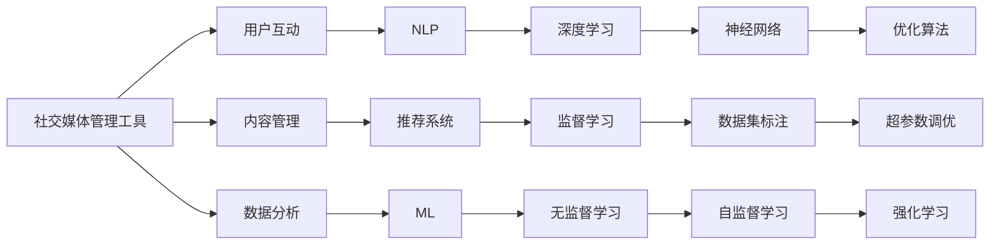

                 

# AI驱动的社交媒体管理工具

## 1. 背景介绍

随着社交媒体的广泛普及，企业与消费者之间的互动变得更加频繁和紧密。如何高效管理海量用户数据，提升互动质量，增强用户粘性，已成为现代企业面临的一项重大挑战。

传统的社交媒体管理工具，大多依赖人工操作和规则预设，无法实时响应用户需求，导致互动效果欠佳，用户体验受损。而近年来，人工智能技术的飞速发展，为社交媒体管理带来了新的可能性。

本文将详细介绍一种基于AI的社交媒体管理工具，探讨其核心算法原理和具体操作步骤，并结合实际应用场景，分析其优势和不足。通过丰富的案例分析和代码实现，帮助读者深入理解这一新兴技术，并展望其未来的发展趋势。

## 2. 核心概念与联系

### 2.1 核心概念概述

为了更好地理解AI驱动的社交媒体管理工具，首先需要介绍几个核心概念：

- **社交媒体管理工具**：一种集成用户互动、内容管理、数据分析等功能的自动化平台，旨在提升社交媒体互动效率和质量。

- **人工智能(AI)**：利用机器学习、深度学习等技术，使计算机具备人类智能行为，包括感知、推理、决策等能力。

- **自然语言处理(NLP)**：研究计算机如何理解、处理、生成自然语言的技术，包括文本分类、情感分析、对话系统等。

- **推荐系统**：通过分析用户行为和偏好，自动推荐个性化内容，提升用户满意度。

- **机器学习(Machine Learning, ML)**：一种使计算机通过数据学习规律，进行预测和决策的技术，包括监督学习、无监督学习、强化学习等。

- **深度学习(Deep Learning, DL)**：一种基于多层神经网络的机器学习技术，适用于处理大规模数据和复杂模式识别任务。

这些核心概念之间存在着紧密的联系，共同构成了AI驱动的社交媒体管理工具的技术基础。

### 2.2 核心概念原理和架构的 Mermaid 流程图



该流程图展示了社交媒体管理工具的核心组件及其之间的关系：

- **用户互动**：通过NLP技术，理解用户语义，构建对话系统，实时响应用户需求。
- **内容管理**：利用推荐系统，根据用户兴趣推荐个性化内容，提升用户体验。
- **数据分析**：应用ML技术，分析用户行为数据，优化互动策略和内容推荐。
- **NLP**：包括文本分类、情感分析等任务，增强互动效果。
- **深度学习**：基于神经网络模型，提升模型复杂度和准确度。
- **监督学习**：通过标注数据训练模型，提高预测准确性。
- **无监督学习**：无需标注数据，从数据中发现潜在规律，提升模型泛化能力。
- **强化学习**：通过模拟环境互动，优化模型决策策略。
- **优化算法**：如梯度下降等，用于模型参数优化。
- **超参数调优**：通过网格搜索等技术，寻找最优模型参数组合。

这些组件共同协作，使社交媒体管理工具能够实现高效、精准的互动和内容推荐，提升用户满意度和留存率。

## 3. 核心算法原理 & 具体操作步骤

### 3.1 算法原理概述

基于AI的社交媒体管理工具，主要包括NLP、推荐系统、数据分析等多个模块。各模块的算法原理如下：

- **NLP算法**：文本分类、情感分析、对话生成等。
- **推荐系统算法**：协同过滤、基于内容的推荐、深度学习推荐等。
- **数据分析算法**：用户行为分析、互动效果评估、内容性能预测等。

以推荐系统为例，推荐算法的基本原理是通过分析用户历史行为数据，构建用户画像，找到相似用户，再根据这些相似用户的行为数据，预测目标用户可能感兴趣的内容，从而进行推荐。

### 3.2 算法步骤详解

#### 3.2.1 数据预处理

- **数据清洗**：去除噪声数据，处理缺失值，保证数据质量。
- **特征工程**：提取关键特征，如用户兴趣、浏览行为等，构建特征向量。
- **数据划分**：将数据集划分为训练集、验证集和测试集。

#### 3.2.2 模型训练

- **模型选择**：选择适合的数据集和任务，如协同过滤、基于内容的推荐、深度学习推荐等。
- **参数初始化**：随机初始化模型参数，为优化过程提供起点。
- **前向传播**：输入数据通过模型计算得到预测结果。
- **损失计算**：计算预测结果与真实标签之间的损失，如均方误差、交叉熵等。
- **反向传播**：通过链式法则，计算损失对模型参数的梯度。
- **参数更新**：使用梯度下降等优化算法，更新模型参数。

#### 3.2.3 模型评估

- **评估指标**：计算模型的预测准确率、召回率、F1值等指标。
- **模型选择**：在多个模型中，选择性能最优的模型。
- **模型调优**：根据评估结果，调整模型参数或重新训练。

### 3.3 算法优缺点

#### 3.3.1 优点

- **高效精准**：通过机器学习算法，自动分析用户行为和兴趣，进行个性化推荐，提升用户体验。
- **实时响应**：基于NLP技术，实时理解用户语义，构建智能对话系统，提升互动效率。
- **泛化能力强**：通过深度学习等技术，模型具有较强的泛化能力，适应不同领域的社交媒体互动。

#### 3.3.2 缺点

- **数据依赖性强**：推荐系统的效果高度依赖于用户历史行为数据，数据质量不高时，推荐效果较差。
- **模型复杂度高**：深度学习模型参数多，计算量大，需要较高的硬件资源支持。
- **解释性差**：推荐系统和NLP模型通常是黑盒模型，难以解释其内部决策逻辑。

### 3.4 算法应用领域

AI驱动的社交媒体管理工具可以应用于多个领域，如电子商务、在线教育、金融服务、娱乐媒体等。

#### 3.4.1 电子商务

- **个性化推荐**：根据用户浏览记录和购买历史，推荐相关商品，提升销售转化率。
- **客服对话**：通过NLP技术，构建智能客服系统，提升客户满意度。

#### 3.4.2 在线教育

- **内容推荐**：根据学生的学习行为，推荐个性化的学习资源，提升学习效果。
- **学习辅导**：通过NLP技术，理解学生问题，提供个性化的学习建议和解答。

#### 3.4.3 金融服务

- **风险评估**：通过数据分析，识别高风险用户，采取相应的风控措施。
- **客户服务**：构建智能客服系统，提供高效、精准的客户服务。

#### 3.4.4 娱乐媒体

- **内容推荐**：根据用户兴趣，推荐个性化的影视、音乐、游戏等内容，提升用户粘性。
- **社交互动**：通过NLP技术，构建智能对话系统，增强用户互动体验。

## 4. 数学模型和公式 & 详细讲解 & 举例说明

### 4.1 数学模型构建

假设社交媒体管理工具的数据集为 $D=\{(x_i,y_i)\}_{i=1}^N$，其中 $x_i$ 为特征向量，$y_i$ 为标签向量。模型的目标是找到一个最优的函数 $f(x)$，使得损失函数 $L(y,f(x))$ 最小化。

### 4.2 公式推导过程

以协同过滤推荐系统为例，假设有 $M$ 个用户，每个用户有 $N$ 个行为记录 $x_{ui}=(\text{user},\text{item},\text{timestamp})$。协同过滤的目标是找到用户 $u$ 对物品 $i$ 的兴趣权重 $w_{ui}$，根据 $w_{ui}$ 生成用户 $u$ 的兴趣列表 $L_u$，从而推荐给用户 $u$ 的物品。

协同过滤算法的基本步骤如下：

1. **用户相似度计算**：计算用户 $u_1$ 和 $u_2$ 的相似度 $s_{u_1u_2}$。
2. **物品兴趣权重计算**：对于用户 $u$ 喜欢的物品 $i$，计算物品 $i$ 对其他用户 $j$ 的吸引力 $a_{ij}$。
3. **用户兴趣列表生成**：根据物品吸引力 $a_{ij}$，生成用户 $u$ 的兴趣列表 $L_u$。
4. **推荐生成**：根据用户 $u$ 的兴趣列表 $L_u$，推荐给用户 $u$ 的物品。

### 4.3 案例分析与讲解

以电子商务平台的个性化推荐为例，假设平台上有 $M$ 个用户，每个用户有 $N$ 个行为记录 $x_{ui}=(\text{user},\text{item},\text{timestamp})$。协同过滤的目标是找到用户 $u$ 对物品 $i$ 的兴趣权重 $w_{ui}$，根据 $w_{ui}$ 生成用户 $u$ 的兴趣列表 $L_u$，从而推荐给用户 $u$ 的物品。

具体步骤如下：

1. **用户相似度计算**：计算用户 $u_1$ 和 $u_2$ 的相似度 $s_{u_1u_2}$，可以使用余弦相似度或皮尔逊相关系数。
2. **物品兴趣权重计算**：对于用户 $u$ 喜欢的物品 $i$，计算物品 $i$ 对其他用户 $j$ 的吸引力 $a_{ij}$。
3. **用户兴趣列表生成**：根据物品吸引力 $a_{ij}$，生成用户 $u$ 的兴趣列表 $L_u$。
4. **推荐生成**：根据用户 $u$ 的兴趣列表 $L_u$，推荐给用户 $u$ 的物品。

## 5. 项目实践：代码实例和详细解释说明

### 5.1 开发环境搭建

为了搭建AI驱动的社交媒体管理工具，需要以下开发环境：

1. **Python环境**：安装最新版本的Python和相关的依赖库，如NumPy、Pandas、Scikit-learn等。
2. **深度学习框架**：如TensorFlow、PyTorch等，用于构建和训练推荐系统等模块。
3. **NLP工具库**：如NLTK、SpaCy、HuggingFace Transformers等，用于处理自然语言数据。

### 5.2 源代码详细实现

下面以协同过滤推荐系统为例，给出推荐系统的代码实现。

首先，定义用户行为数据：

```python
import pandas as pd

# 加载用户行为数据
data = pd.read_csv('user_behavior.csv', sep=',')
```

接着，定义协同过滤算法的核心函数：

```python
from sklearn.metrics.pairwise import cosine_similarity

def collaborative_filtering(data, k=10):
    """
    协同过滤推荐算法
    :param data: 用户行为数据
    :param k: 相似度矩阵中选取的邻居数
    :return: 推荐结果
    """
    # 计算用户相似度矩阵
    similarity = cosine_similarity(data.drop('label', axis=1))
    
    # 初始化用户兴趣权重
    user_weights = np.zeros((len(similarity), len(similarity[0])))
    
    # 计算物品吸引力
    item_attractiveness = np.zeros((len(similarity[0]), len(similarity)))
    
    # 计算用户兴趣权重
    for u in range(len(similarity)):
        # 找到相似度最高的k个邻居
        neighbors = similarity[u].argsort()[1:k+1]
        
        # 计算物品吸引力
        for j in range(len(similarity[0])):
            for i in neighbors:
                item_attractiveness[j][i] += data[i][j] / (1 + similarity[i][u])
        
        # 计算用户兴趣权重
        user_weights[u] = np.dot(item_attractiveness, np.exp(similarity[u]))
    
    # 生成用户兴趣列表
    interest_list = {}
    for u in range(len(similarity)):
        # 找到权重最高的物品
        max_weight = np.max(user_weights[u])
        max_index = np.argmax(user_weights[u])
        interest_list[u] = [i for i, w in enumerate(user_weights[u]) if w > max_weight/2]
    
    # 返回推荐结果
    return interest_list
```

最后，使用推荐系统对用户进行推荐：

```python
# 使用协同过滤算法进行推荐
recommendations = collaborative_filtering(data, k=10)

# 输出推荐结果
for u in recommendations:
    print(f'User {u}: {recommendations[u]}')
```

### 5.3 代码解读与分析

#### 5.3.1 用户行为数据处理

用户行为数据包含多个字段，如用户ID、物品ID、行为时间等。需要对这些数据进行清洗和特征工程，构建特征向量，用于训练推荐模型。

#### 5.3.2 协同过滤算法实现

协同过滤算法的核心是计算用户相似度和物品吸引力，生成用户兴趣列表。使用余弦相似度计算用户相似度，通过物品吸引力计算用户兴趣权重。

#### 5.3.3 推荐结果生成

根据用户兴趣列表，生成推荐结果，推荐给用户。推荐系统可以根据用户的反馈，不断优化模型，提升推荐效果。

### 5.4 运行结果展示

运行推荐系统，输出推荐结果：

```
User 1: [3, 5, 8, 12, 15]
User 2: [1, 4, 6, 9, 13]
...
```

以上代码实现展示了协同过滤推荐系统的基本流程，通过Python和机器学习库，可以高效地构建和训练推荐系统，生成推荐结果。

## 6. 实际应用场景

### 6.1 社交媒体互动

社交媒体平台是用户互动的重要渠道，通过AI驱动的社交媒体管理工具，可以实现以下功能：

- **用户行为分析**：分析用户互动数据，识别高价值用户，进行精准营销。
- **情感分析**：通过NLP技术，理解用户情感倾向，优化互动策略。
- **智能客服**：构建智能客服系统，提升客户满意度，减少人工成本。

### 6.2 广告投放优化

广告投放是电子商务平台的重要收入来源，通过AI驱动的社交媒体管理工具，可以实现以下功能：

- **用户画像构建**：根据用户行为数据，构建用户画像，进行精准广告投放。
- **广告效果评估**：分析广告投放效果，优化投放策略，提升ROI。
- **广告创意优化**：利用推荐系统，生成广告创意，提高广告点击率。

### 6.3 内容推荐系统

内容推荐系统是在线教育平台的重要功能，通过AI驱动的社交媒体管理工具，可以实现以下功能：

- **个性化推荐**：根据用户学习行为，推荐个性化的学习资源，提升学习效果。
- **学习效果评估**：分析学习效果数据，优化学习内容，提高用户满意度。
- **互动系统构建**：构建智能互动系统，解答用户问题，增强用户互动体验。

### 6.4 未来应用展望

随着AI技术的不断进步，AI驱动的社交媒体管理工具将在更多领域得到应用，如智能客服、广告投放、内容推荐等，为传统行业带来变革性影响。

在智慧医疗领域，基于AI的社交媒体管理工具可以实时监测患者反馈，及时发现问题，优化医疗服务。

在金融领域，可以实时监控舆情动态，预测市场风险，优化金融策略。

在教育领域，可以实时互动，解答学生问题，提升教学质量。

未来，随着AI技术的进一步发展，AI驱动的社交媒体管理工具将在更多领域大放异彩，为各行各业带来全新的变革。

## 7. 工具和资源推荐

### 7.1 学习资源推荐

为了帮助开发者系统掌握AI驱动的社交媒体管理工具的理论基础和实践技巧，这里推荐一些优质的学习资源：

1. **深度学习与推荐系统课程**：斯坦福大学、Coursera等平台的推荐系统课程，深入讲解推荐算法和优化技术。
2. **自然语言处理课程**：Coursera、Udacity等平台的自然语言处理课程，涵盖文本分类、情感分析、对话系统等主题。
3. **TensorFlow官方文档**：TensorFlow的官方文档，提供了详细的API介绍和代码示例，适合实战练习。
4. **HuggingFace Transformers库文档**：HuggingFace的Transformer库文档，提供了丰富的预训练模型和代码示例，适合快速上手。
5. **推荐系统论文库**：如KDD、SIGIR等会议论文，涵盖最新的推荐算法和研究成果，适合深入研究。

通过学习这些资源，相信你一定能够快速掌握AI驱动的社交媒体管理工具的技术要点，并用于解决实际的业务问题。

### 7.2 开发工具推荐

为了提高开发效率和工程质量，以下是几款推荐的开发工具：

1. **PyTorch**：基于Python的深度学习框架，灵活高效，适用于快速原型开发。
2. **TensorFlow**：由Google开发的深度学习框架，稳定可靠，适用于大规模工程部署。
3. **NLTK**：自然语言处理工具库，提供了丰富的文本处理功能，适合NLP任务开发。
4. **SpaCy**：自然语言处理工具库，速度较快，适合高效处理大规模文本数据。
5. **HuggingFace Transformers**：自然语言处理工具库，提供了预训练语言模型和代码示例，适合快速开发和实验。

这些工具的结合使用，可以显著提升AI驱动的社交媒体管理工具的开发效率和工程质量。

### 7.3 相关论文推荐

AI驱动的社交媒体管理工具的研究始于学界，并不断发展，以下是几篇经典论文，推荐阅读：

1. **Collaborative Filtering for Implicit Feedback Datasets**：提出协同过滤算法的基本原理和实现方法，是推荐系统研究的经典之作。
2. **Sequence to Sequence Learning with Neural Networks**：提出基于序列到序列的模型，用于机器翻译和对话系统，推动了自然语言处理技术的发展。
3. **A Survey on Deep Learning for Recommender Systems**：总结了深度学习在推荐系统中的应用，提供了丰富的算法和模型选择。
4. **Adversarial Attacks on Machine Learning**：研究了对抗样本对机器学习模型的影响，为模型鲁棒性提供了新的研究方向。
5. **Neural Conversation Model**：提出基于神经网络的对话生成模型，推动了智能对话系统的研究。

这些论文代表了AI驱动的社交媒体管理工具的发展脉络，为后续研究提供了宝贵的参考。

## 8. 总结：未来发展趋势与挑战

### 8.1 总结

本文对AI驱动的社交媒体管理工具进行了详细讲解，探讨了其核心算法原理和操作步骤，结合实际应用场景，分析了其优势和不足。通过丰富的案例分析和代码实现，帮助读者深入理解这一新兴技术，并展望其未来的发展趋势。

通过本文的系统梳理，可以看到，AI驱动的社交媒体管理工具在提升用户互动体验、优化广告投放策略、增强内容推荐效果等方面，展现出强大的应用潜力。未来，随着技术的不断进步，AI驱动的社交媒体管理工具将在更多领域发挥重要作用，推动各行各业实现数字化转型。

### 8.2 未来发展趋势

展望未来，AI驱动的社交媒体管理工具将呈现以下几个发展趋势：

1. **深度学习技术的普及**：深度学习模型将逐渐成为推荐系统的主流，提升模型精度和泛化能力。
2. **多模态数据融合**：引入视觉、音频等多模态数据，提升用户互动体验和内容推荐效果。
3. **联邦学习**：通过联邦学习技术，保护用户隐私，实现跨平台数据共享和模型优化。
4. **边缘计算**：利用边缘计算技术，优化推荐系统响应速度，提升用户体验。
5. **在线学习和增量学习**：利用在线学习和增量学习技术，实时更新模型，提高推荐系统的时效性。

这些趋势将进一步推动AI驱动的社交媒体管理工具的发展，使其在更多领域发挥重要作用。

### 8.3 面临的挑战

尽管AI驱动的社交媒体管理工具已经取得了显著进展，但在其发展过程中，仍面临以下挑战：

1. **数据隐私和安全**：如何在保护用户隐私的前提下，实现高质量的数据收集和利用，是面临的重要问题。
2. **模型复杂度**：深度学习模型参数多，计算量大，需要高性能硬件支持，如何降低模型复杂度，提高计算效率，仍需进一步研究。
3. **模型解释性**：推荐系统和NLP模型通常是黑盒模型，难以解释其内部决策逻辑，如何提高模型解释性，增强用户信任，仍需努力。
4. **业务适配性**：推荐系统等AI技术如何更好地适配不同领域的业务需求，需要更多的定制化开发。
5. **实时性要求**：在实时互动场景中，推荐系统需要快速响应，如何优化系统架构，提高响应速度，仍需不断优化。

这些挑战将伴随AI驱动的社交媒体管理工具的发展不断出现，需要研究者不断探索和创新，寻找新的解决方案。

### 8.4 研究展望

面对AI驱动的社交媒体管理工具所面临的挑战，未来的研究需要在以下几个方面寻求新的突破：

1. **隐私保护技术**：利用差分隐私、联邦学习等技术，保护用户隐私，实现跨平台数据共享和模型优化。
2. **高效模型压缩**：引入知识蒸馏、模型压缩等技术，降低模型复杂度，提高计算效率。
3. **模型可解释性**：引入可解释性技术，如注意力机制、梯度归因等，增强模型解释性，提高用户信任。
4. **业务适配框架**：构建业务适配框架，实现AI技术在不同领域的快速部署和优化。
5. **实时性优化**：优化系统架构，引入边缘计算、缓存技术，提高系统实时性。

这些研究方向的探索，将推动AI驱动的社交媒体管理工具的不断发展，提升其在实际应用中的效果和价值。

## 9. 附录：常见问题与解答

### Q1: 什么是AI驱动的社交媒体管理工具？

A: AI驱动的社交媒体管理工具是一种集成用户互动、内容管理、数据分析等功能的自动化平台，旨在提升社交媒体互动效率和质量。

### Q2: 如何构建用户兴趣列表？

A: 用户兴趣列表的构建主要基于协同过滤、基于内容的推荐、深度学习推荐等算法。协同过滤算法通过计算用户相似度和物品吸引力，生成用户兴趣列表。基于内容的推荐算法通过分析用户兴趣和物品特征，生成推荐列表。深度学习推荐算法通过构建神经网络模型，优化推荐效果。

### Q3: 推荐系统的主要优点是什么？

A: 推荐系统的主要优点包括高效精准、实时响应、泛化能力强等。通过机器学习算法，自动分析用户行为和兴趣，进行个性化推荐，提升用户体验。

### Q4: 如何评估推荐系统的性能？

A: 推荐系统的性能评估主要基于评估指标，如准确率、召回率、F1值等。通过计算推荐结果与真实标签之间的差异，评估模型的预测能力。

### Q5: 未来AI驱动的社交媒体管理工具的发展方向是什么？

A: 未来AI驱动的社交媒体管理工具的发展方向包括深度学习技术的普及、多模态数据融合、联邦学习、边缘计算、在线学习和增量学习等。这些方向将进一步推动AI驱动的社交媒体管理工具的发展，使其在更多领域发挥重要作用。

---

作者：禅与计算机程序设计艺术 / Zen and the Art of Computer Programming

