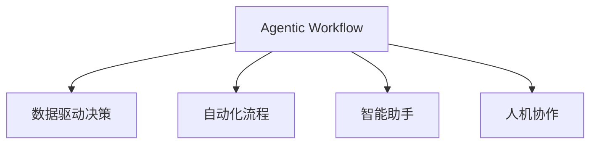

                 

# Agentic Workflow的适用人群探讨

> 关键词：Agentic Workflow, 决策支持系统, 工作流程自动化, 数据驱动, 智能助手, 人机协作

## 1. 背景介绍

在当今快速变化和高度复杂的工作环境中，企业和组织需要快速、高效地做出决策。传统的决策支持系统（DSS）和手动流程已经无法满足这些需求。然而，随着人工智能（AI）和机器学习（ML）技术的兴起，一种新型的决策支持方式——Agentic Workflow（简称AW）正在被越来越多的企业和组织采纳。

Agentic Workflow是一种结合了人工智能技术和自动化流程的系统，旨在通过智能分析和决策支持，大幅提升组织的工作效率和决策质量。它能够根据数据驱动的洞察，自动执行和优化工作流程，从而让决策者能够专注于更高价值的任务。

### 1.1 Agentic Workflow的优势

Agentic Workflow相较于传统的工作流程有以下几个显著优势：

- **数据驱动决策**：利用AI和ML技术对大量数据进行分析，提供深度洞察，帮助决策者做出更准确的判断。
- **自动化和优化**：自动执行日常任务，减少人工错误，提高工作效率。
- **智能推荐和建议**：根据历史数据和实时信息，智能推荐最优方案和路径。
- **人机协作**：将人的判断和AI的智能相结合，提升整体决策质量和响应速度。

## 2. 核心概念与联系

### 2.1 核心概念概述

为了更好地理解Agentic Workflow，我们需要首先介绍几个关键概念：

- **Agentic Workflow（Agentic Workflow）**：一种结合了人工智能技术和自动化流程的系统，旨在通过智能分析和决策支持，大幅提升组织的工作效率和决策质量。

- **数据驱动决策（Data-Driven Decision Making）**：指基于数据和分析结果进行决策的过程。

- **自动化流程（Automated Processes）**：通过软件和算法自动化执行的任务，减少人为错误和提高效率。

- **智能助手（Intelligent Assistants）**：能够执行特定任务，如智能推荐、信息检索等的AI系统。

- **人机协作（Human-Machine Collaboration）**：结合人类智能和机器智能，共同完成复杂任务的系统。

这些概念之间的逻辑关系可以通过以下Mermaid流程图来展示：



这个流程图展示了几大核心概念及其之间的关系：

1. Agentic Workflow通过数据驱动决策获取深度洞察，提供基于数据和分析的决策支持。
2. 它使用自动化流程减少人为错误，提高工作效率。
3. 智能助手帮助执行特定任务，如推荐、检索等。
4. 人机协作将人的判断和AI的智能相结合，共同完成复杂任务。

### 2.2 核心概念原理和架构

Agentic Workflow的核心原理是通过数据驱动的洞察，结合自动化和智能助手的功能，实现人机协作。其架构主要由以下几个部分组成：

1. **数据源**：包括内部数据（如销售记录、财务报表等）和外部数据（如市场趋势、社交媒体等），是Agentic Workflow分析的基础。

2. **数据分析引擎**：利用机器学习算法对数据进行分析和洞察，生成可操作的决策支持信息。

3. **自动化流程引擎**：根据决策支持信息，自动执行和优化工作流程，如自动化审批、自动数据处理等。

4. **智能助手**：提供基于规则的智能推荐、信息检索、任务执行等功能。

5. **人机协作界面**：提供决策者和执行者之间的沟通渠道，支持可视化的决策支持和操作界面。

这些模块通过API和集成技术紧密结合，形成一个高效、灵活的Agentic Workflow系统。

## 3. 核心算法原理 & 具体操作步骤

### 3.1 算法原理概述

Agentic Workflow的算法原理主要包括以下几个关键步骤：

1. **数据收集与预处理**：从不同的数据源收集数据，并进行清洗和预处理。

2. **数据分析与洞察**：利用机器学习算法对数据进行分析，生成可操作的洞察和决策支持信息。

3. **工作流程自动化**：根据决策支持信息，自动执行和优化工作流程。

4. **智能助手支持**：提供基于规则的智能推荐、信息检索、任务执行等功能，支持决策者进行更准确、更快速的决策。

5. **人机协作**：提供决策者和执行者之间的沟通渠道，支持可视化的决策支持和操作界面。

### 3.2 算法步骤详解

以下是Agentic Workflow的详细步骤：

1. **数据收集**：
   - 从内部系统（如CRM、ERP等）和外部系统（如社交媒体、市场数据等）收集数据。
   - 进行数据清洗和预处理，包括去重、填充缺失值、格式统一等。

2. **数据分析**：
   - 利用机器学习算法对数据进行分析，生成洞察和决策支持信息。
   - 常见的算法包括回归分析、分类、聚类等。

3. **自动化流程执行**：
   - 根据决策支持信息，自动执行和优化工作流程。
   - 如自动化审批流程、自动数据处理等。

4. **智能助手支持**：
   - 提供基于规则的智能推荐、信息检索、任务执行等功能，辅助决策者进行决策。
   - 例如，根据历史数据和实时信息，智能推荐最优方案。

5. **人机协作**：
   - 提供决策者和执行者之间的沟通渠道，支持可视化的决策支持和操作界面。
   - 例如，通过可视化仪表板展示关键指标和决策信息。

### 3.3 算法优缺点

Agentic Workflow具有以下优点：

1. **高效**：通过自动化流程和智能助手，大幅提高工作效率。
2. **精确**：基于数据驱动的洞察，提供深度分析支持。
3. **灵活**：可以根据业务需求灵活调整流程和决策支持策略。

但同时也存在一些缺点：

1. **成本高**：初期投资成本较高，需要购买软件和硬件。
2. **技术复杂**：需要专业技术人员进行开发和维护。
3. **数据质量依赖**：依赖高质量的数据输入，否则可能导致误导性决策。

### 3.4 算法应用领域

Agentic Workflow可以应用于多个领域，包括但不限于：

- **金融服务**：用于风险管理、欺诈检测、投资分析等。
- **零售**：用于销售预测、库存管理、客户分析等。
- **制造业**：用于生产计划、质量控制、供应链优化等。
- **医疗**：用于疾病诊断、治疗方案推荐、患者管理等。
- **人力资源**：用于招聘分析、员工绩效评估、人才管理等。

## 4. 数学模型和公式 & 详细讲解

### 4.1 数学模型构建

Agentic Workflow的核心数学模型主要包括以下几个部分：

1. **回归模型**：用于预测连续变量，如销售预测、客户行为分析等。
   - 数学公式：$y = \beta_0 + \beta_1 x_1 + \beta_2 x_2 + \ldots + \beta_n x_n + \epsilon$

2. **分类模型**：用于分类任务，如客户分类、故障检测等。
   - 数学公式：$P(y = 1|x) = \frac{e^{x \beta}}{1 + e^{x \beta}}$

3. **聚类模型**：用于数据聚类，如市场细分、客户群体分析等。
   - 数学公式：$K-means: \arg\min_{\mu_k, x_i} \sum_{k=1}^K \sum_{i=1}^n ||x_i - \mu_k||^2$

### 4.2 公式推导过程

1. **回归模型**：
   - 数据集为$(x_1, x_2, \ldots, x_n, y)$，其中$y$为连续变量。
   - 假设$y = \beta_0 + \beta_1 x_1 + \beta_2 x_2 + \ldots + \beta_n x_n + \epsilon$
   - 利用最小二乘法求解$\beta$，最小化$E[(y - f(x))^2]$，其中$f(x) = \beta_0 + \beta_1 x_1 + \beta_2 x_2 + \ldots + \beta_n x_n$。

2. **分类模型**：
   - 数据集为$(x_1, x_2, \ldots, x_n, y)$，其中$y \in \{1, 0\}$。
   - 假设$P(y = 1|x) = \frac{e^{x \beta}}{1 + e^{x \beta}}$
   - 利用对数损失函数$\ell(y, \hat{y}) = -y \log \hat{y} - (1-y) \log(1-\hat{y})$，最小化平均损失。

3. **聚类模型**：
   - 数据集为$(x_1, x_2, \ldots, x_n)$。
   - 假设$K-means$聚类算法将数据分为$K$个簇，$\mu_k$为簇中心。
   - 最小化$E[||x_i - \mu_k||^2]$。

### 4.3 案例分析与讲解

以金融服务中的风险管理为例，Agentic Workflow可以通过以下步骤实现：

1. **数据收集**：
   - 收集历史交易数据、客户信息、市场数据等。

2. **数据分析**：
   - 利用回归模型预测客户的违约概率。
   - 利用分类模型识别高风险客户。

3. **自动化流程执行**：
   - 根据高风险客户列表，自动触发风险控制流程。
   - 如增加审批门槛、限制交易金额等。

4. **智能助手支持**：
   - 提供基于规则的智能推荐，如增加交易限额、联系客户进行风险提示等。

5. **人机协作**：
   - 通过可视化仪表板展示风险水平和控制措施。
   - 提供人工干预机制，如风险管理团队可以手动调整策略。

## 5. 项目实践：代码实例和详细解释说明

### 5.1 开发环境搭建

要进行Agentic Workflow的开发，我们需要搭建Python开发环境，并配置好必要的库和工具。

1. **安装Python**：
   - 从官网下载并安装Python。
   - 建议安装Python 3.7或更高版本。

2. **配置虚拟环境**：
   - 创建虚拟环境，避免不同项目之间的依赖冲突。
   ```bash
   python -m venv env
   source env/bin/activate
   ```

3. **安装依赖库**：
   - 安装必要的依赖库，如numpy、pandas、scikit-learn、TensorFlow等。
   ```bash
   pip install numpy pandas scikit-learn tensorflow
   ```

### 5.2 源代码详细实现

以下是一个简单的Agentic Workflow实现示例，用于金融服务中的客户风险管理：

```python
import pandas as pd
from sklearn.linear_model import LinearRegression
from sklearn.ensemble import RandomForestClassifier
from sklearn.cluster import KMeans

# 数据加载
data = pd.read_csv('customer_data.csv')

# 数据清洗和预处理
# ...

# 数据转换和模型训练
# 假设y为违约标签
# 回归模型预测违约概率
X = data[['age', 'income', 'debt']]
y = data['default']
model = LinearRegression()
model.fit(X, y)

# 分类模型识别高风险客户
X = data[['age', 'income', 'debt']]
y = data['default']
model = RandomForestClassifier()
model.fit(X, y)

# 聚类模型对客户进行细分
X = data[['age', 'income', 'debt']]
model = KMeans(n_clusters=5)
model.fit(X)

# 自动化流程执行
# 假设y为违约标签
# 根据分类模型预测高风险客户，自动触发风险控制流程
high_risk_customers = model.predict(X)
control_actions = {'limit': 10000, 'contact': True}

# 智能助手支持
# 提供基于规则的智能推荐，如增加交易限额、联系客户进行风险提示等
recommendations = {'limit': control_actions['limit'], 'contact': control_actions['contact']}

# 人机协作
# 通过可视化仪表板展示风险水平和控制措施
visualization = pd.DataFrame({'risk': model.predict(X), 'actions': control_actions.values()})
visualization
```

### 5.3 代码解读与分析

在上述代码中，我们首先加载了客户数据，并对数据进行了清洗和预处理。接着，利用线性回归模型预测客户的违约概率，利用随机森林分类模型识别高风险客户，利用K-Means聚类模型对客户进行细分。最后，根据模型预测结果，自动触发风险控制流程，并提供智能助手和可视化仪表板的支持。

## 6. 实际应用场景

### 6.1 金融服务

在金融服务领域，Agentic Workflow可以用于风险管理、欺诈检测、投资分析等。通过数据驱动的洞察和自动化流程，Agentic Workflow能够大幅提高金融机构的运营效率和决策质量。

### 6.2 零售

在零售行业，Agentic Workflow可以用于销售预测、库存管理、客户分析等。通过智能推荐和优化流程，Agentic Workflow能够帮助零售企业提高销售效率和客户满意度。

### 6.3 制造业

在制造业领域，Agentic Workflow可以用于生产计划、质量控制、供应链优化等。通过数据驱动的洞察和自动化流程，Agentic Workflow能够提升制造企业的生产效率和运营质量。

### 6.4 医疗

在医疗行业，Agentic Workflow可以用于疾病诊断、治疗方案推荐、患者管理等。通过智能助手和可视化仪表板，Agentic Workflow能够帮助医疗机构提高诊断准确率和患者管理效率。

## 7. 工具和资源推荐

### 7.1 学习资源推荐

为了帮助开发者系统掌握Agentic Workflow的理论基础和实践技巧，这里推荐一些优质的学习资源：

1. **《机器学习实战》**：这本书详细介绍了机器学习算法和应用，是学习Agentic Workflow的基础。

2. **Coursera《机器学习》课程**：由斯坦福大学开设的机器学习课程，涵盖了机器学习的基本概念和算法，适合初学者学习。

3. **Kaggle数据科学竞赛**：通过参与数据科学竞赛，可以实践Agentic Workflow的理论，并与全球数据科学家交流经验。

### 7.2 开发工具推荐

为了高效开发Agentic Workflow，以下是几款常用的开发工具：

1. **Python**：作为Agentic Workflow开发的主要语言，Python提供了丰富的库和框架，方便数据处理和模型训练。

2. **Jupyter Notebook**：一个强大的交互式开发环境，支持Python代码的编写和运行，适合数据分析和模型调试。

3. **TensorFlow**：一个流行的开源机器学习框架，支持多种机器学习算法和模型训练，适合大规模数据处理。

4. **Tableau**：一个流行的数据可视化工具，支持将模型结果可视化展示，方便决策者理解和操作。

### 7.3 相关论文推荐

为了深入理解Agentic Workflow的理论和实践，以下是几篇重要的相关论文：

1. **《机器学习实战》**：该书详细介绍了机器学习算法和应用，是学习Agentic Workflow的基础。

2. **《深度学习》**：该书由Ian Goodfellow等人合著，详细介绍了深度学习算法和应用，适合进一步学习Agentic Workflow。

3. **《Agentic Workflow: A Survey》**：这篇综述文章总结了Agentic Workflow的研究进展和应用案例，适合了解Agentic Workflow的整体框架和应用。

## 8. 总结：未来发展趋势与挑战

### 8.1 研究成果总结

Agentic Workflow作为一种结合了人工智能和自动化流程的新型决策支持系统，已经在多个领域取得了显著的应用成果。它的数据驱动决策、自动化流程、智能助手支持和人机协作等功能，大大提升了企业的工作效率和决策质量。

### 8.2 未来发展趋势

Agentic Workflow的未来发展趋势包括：

1. **更加智能化**：通过引入更多智能算法和数据源，Agentic Workflow将变得更加智能化和精确。
2. **更加自动化**：自动化流程和智能助手功能将进一步提升，减少人为错误和提高效率。
3. **更加人机协作**：人机协作界面将更加友好和可视化，提高决策者和执行者的工作效率。

### 8.3 面临的挑战

尽管Agentic Workflow已经取得了显著成果，但在推广应用过程中仍面临一些挑战：

1. **数据质量问题**：依赖高质量的数据输入，数据清洗和预处理是关键。
2. **技术复杂性**：Agentic Workflow的开发和维护需要专业技术人员，存在技术门槛。
3. **成本问题**：初期投资成本较高，需要企业投入大量资源。

### 8.4 研究展望

未来，Agentic Workflow需要在以下几个方面进一步研究：

1. **自动化和智能化**：进一步优化自动化流程和智能算法，提升Agentic Workflow的智能化水平。
2. **数据融合与处理**：研究如何高效融合多源异构数据，提升数据质量和分析精度。
3. **人机协作**：研究如何提升人机协作界面的用户体验和智能化水平，提高决策效率。

总之，Agentic Workflow作为一种新型决策支持系统，其数据驱动决策、自动化流程、智能助手支持和人机协作等功能，将极大提升企业的工作效率和决策质量。未来，Agentic Workflow将在更多领域得到应用，为社会带来深远影响。

## 9. 附录：常见问题与解答

**Q1：Agentic Workflow和传统DSS（决策支持系统）的区别是什么？**

A: Agentic Workflow相较于传统DSS，具有以下几个显著区别：

1. **数据驱动决策**：Agentic Workflow利用AI和ML技术对大量数据进行分析，提供深度洞察，而传统DSS主要依赖专家知识和经验。
2. **自动化流程**：Agentic Workflow通过自动化流程减少人为错误，提高工作效率，而传统DSS需要人工进行数据处理和决策。
3. **智能助手支持**：Agentic Workflow提供基于规则的智能推荐和信息检索功能，辅助决策者进行决策，而传统DSS依赖人工分析和操作。
4. **人机协作**：Agentic Workflow提供决策者和执行者之间的沟通渠道，支持可视化的决策支持和操作界面，而传统DSS需要人工沟通和协作。

**Q2：Agentic Workflow的开发和维护有哪些难点？**

A: Agentic Workflow的开发和维护存在以下几个难点：

1. **数据质量问题**：依赖高质量的数据输入，数据清洗和预处理是关键。
2. **技术复杂性**：Agentic Workflow的开发和维护需要专业技术人员，存在技术门槛。
3. **成本问题**：初期投资成本较高，需要企业投入大量资源。
4. **系统集成**：Agentic Workflow需要与多个系统和数据源进行集成，系统集成难度较大。

**Q3：Agentic Workflow在实际应用中需要注意哪些问题？**

A: Agentic Workflow在实际应用中需要注意以下几个问题：

1. **数据隐私和安全**：确保数据隐私和安全，防止数据泄露和滥用。
2. **系统可靠性**：确保系统稳定可靠，避免系统故障和数据丢失。
3. **用户接受度**：提升用户对Agentic Workflow的接受度和使用意愿，进行用户培训和支持。

**Q4：Agentic Workflow在落地应用中如何评估效果？**

A: Agentic Workflow的落地应用效果可以通过以下几个方面进行评估：

1. **效率提升**：通过对比前后工作效率，评估Agentic Workflow对流程自动化和决策支持的效果。
2. **决策质量**：通过对比前后决策质量，评估Agentic Workflow对数据驱动决策和智能助手支持的效果。
3. **用户满意度**：通过用户反馈和满意度调查，评估Agentic Workflow对用户体验和操作界面的效果。

总之，Agentic Workflow作为一种新型决策支持系统，其数据驱动决策、自动化流程、智能助手支持和人机协作等功能，将极大提升企业的工作效率和决策质量。未来，Agentic Workflow将在更多领域得到应用，为社会带来深远影响。

---

作者：禅与计算机程序设计艺术 / Zen and the Art of Computer Programming

