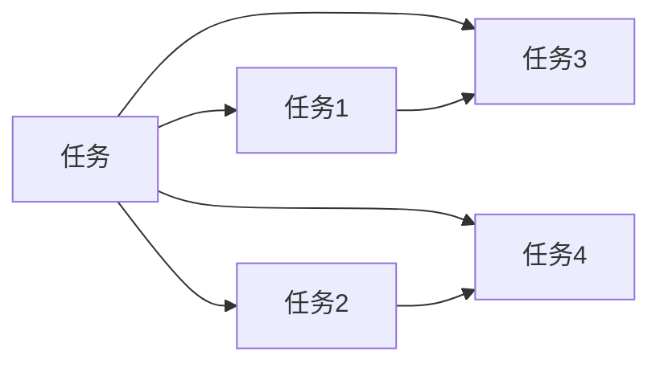
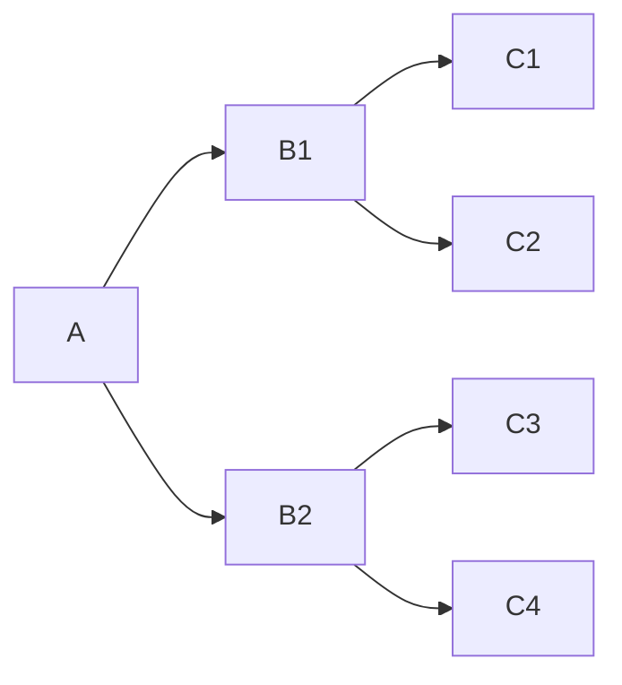

                 

## 1. 背景介绍

随着人工智能技术的发展，智能体(Agent)在各个领域的应用越来越广泛。从简单的自动化流程到复杂的决策支持系统，智能体正在以各种方式改变我们的工作和生活。然而，智能体的开发和部署并不简单，它们需要处理复杂的任务，包括推理、决策、交互等。本文将从任务拆解的角度，探讨智能体在实际应用中的挑战与机遇，并提供一些解决策略。

## 2. 核心概念与联系

### 2.1 核心概念概述

智能体（Agent）是指能够感知环境、执行决策、并与其他智能体交互的计算实体。它们可以应用于各种领域，包括但不限于游戏、金融、医疗、交通等。

智能体拆解任务是指将一个复杂的任务拆分为多个子任务，每个子任务由一个或多个智能体完成。这种分解方式可以简化问题，使智能体更容易理解和执行。

任务拆解的目的是：

- 将复杂问题转化为多个简单问题，使得每个子问题更加易于处理。
- 通过协同工作，提高智能体的整体表现。
- 允许每个子任务并行处理，提高系统的处理能力。

### 2.2 核心概念原理和架构的 Mermaid 流程图



这个图展示了将一个任务拆分为四个子任务的过程，每个子任务又可能进一步分解。

## 3. 核心算法原理 & 具体操作步骤

### 3.1 算法原理概述

智能体拆解任务的核心算法包括以下几个步骤：

1. **任务定义**：明确任务的目标和要求，确定任务的关键因素。
2. **任务分解**：将任务分解为多个子任务，每个子任务可以由一个或多个智能体完成。
3. **智能体设计**：为每个子任务设计合适的智能体，包括决策规则、感知模块和交互接口。
4. **协同工作**：设计智能体之间的协同机制，确保它们可以共同完成目标任务。
5. **评估与优化**：对智能体的性能进行评估，根据评估结果优化智能体设计。

### 3.2 算法步骤详解

#### 3.2.1 任务定义

任务定义是任务拆解的第一步，也是最关键的一步。它需要明确任务的目标、输入和输出，以及任务的关键因素。

例如，一个自动驾驶车辆的任务可以定义为“在复杂的城市道路上安全、高效地行驶”。这个任务的关键因素包括道路交通状况、车辆状态、行人行为等。

#### 3.2.2 任务分解

任务分解是将任务转化为多个子任务的过程。这个过程中，需要考虑以下几个因素：

1. **任务复杂度**：将任务分解为多个子任务，每个子任务应当相对简单，易于处理。
2. **任务依赖**：确定各子任务之间的依赖关系，确保它们可以顺序或并行执行。
3. **资源分配**：评估各子任务的计算和存储需求，合理分配资源。

例如，自动驾驶车辆的任务可以分解为以下子任务：

- 感知环境：通过传感器获取道路、车辆、行人等信息。
- 决策制定：根据环境信息，制定驾驶策略。
- 控制执行：根据决策，控制车辆行驶。

#### 3.2.3 智能体设计

智能体设计是任务拆解的关键步骤。设计良好的智能体能够高效地完成任务，并与其他智能体协同工作。

智能体的设计包括以下几个方面：

1. **感知模块**：用于获取环境信息，例如传感器、摄像头、雷达等。
2. **决策模块**：根据感知信息，制定决策策略。
3. **执行模块**：根据决策策略，执行相应动作。
4. **交互模块**：用于与其他智能体交互，例如通信协议、消息传递等。

#### 3.2.4 协同工作

协同工作是智能体完成任务的重要环节。设计良好的协同机制，可以确保智能体之间的信息共享和协同工作。

协同工作包括：

1. **通信协议**：定义智能体之间的通信格式和协议。
2. **同步机制**：确保智能体之间的工作同步，避免数据丢失或重复处理。
3. **冲突处理**：处理智能体之间的冲突，确保协同工作顺利进行。

#### 3.2.5 评估与优化

评估与优化是任务拆解的最后一个步骤。通过评估智能体的性能，可以发现问题并进行优化。

评估与优化包括：

1. **性能评估**：使用指标评估智能体的性能，例如精度、效率、稳定性等。
2. **问题发现**：通过测试和实验，发现智能体的问题，例如错误、故障等。
3. **优化改进**：根据评估结果，优化智能体的设计，提高性能。

### 3.3 算法优缺点

智能体拆解任务的优点包括：

1. **简化问题**：将复杂问题转化为多个简单问题，使得每个子问题更加易于处理。
2. **协同工作**：通过协同工作，提高智能体的整体表现。
3. **并行处理**：允许每个子任务并行处理，提高系统的处理能力。

智能体拆解任务的缺点包括：

1. **设计复杂**：任务拆解和智能体设计需要专业知识，设计复杂。
2. **协同管理**：智能体之间的协同工作需要严格管理，避免冲突和故障。
3. **评估困难**：智能体的性能评估需要大量实验和测试，评估困难。

### 3.4 算法应用领域

智能体拆解任务在各个领域都有广泛应用，例如：

1. **自动驾驶**：将自动驾驶任务拆分为感知、决策、控制等子任务，每个子任务由不同的智能体完成。
2. **金融交易**：将金融交易任务拆分为风险评估、交易决策、执行等子任务，每个子任务由不同的智能体完成。
3. **医疗诊断**：将医疗诊断任务拆分为症状分析、病情评估、治疗方案制定等子任务，每个子任务由不同的智能体完成。
4. **智能客服**：将智能客服任务拆分为理解问题、回答查询、执行操作等子任务，每个子任务由不同的智能体完成。

## 4. 数学模型和公式 & 详细讲解 & 举例说明

### 4.1 数学模型构建

智能体拆解任务可以通过数学模型来表示。这里使用决策树模型来描述智能体的决策过程。

决策树模型由节点和边组成，每个节点表示一个决策点，每个边表示一个决策结果。智能体的决策过程可以用决策树来表示。

### 4.2 公式推导过程

智能体的决策过程可以用决策树来表示。假设智能体面临一个问题，有n个决策点，每个决策点有m个可能的结果。则决策树的节点数为n，边数为m^n。

智能体的决策过程可以用递归方式表示。假设当前决策点为i，有m个可能的结果，下一个决策点为j，则决策过程可以用以下公式表示：

$$
P(j|i) = \frac{P(j|i)P(i)}{P(i)}
$$

其中，$P(i)$为当前决策点i的概率，$P(j|i)$为决策点i下结果j的概率。

### 4.3 案例分析与讲解

以自动驾驶为例，智能体的决策过程可以用决策树来表示。假设自动驾驶车辆面临一个问题，有3个决策点，每个决策点有2个可能的结果。则决策树可以用以下形式表示：



其中，A表示当前决策点，B1和B2表示下一个决策点，C1、C2、C3、C4表示可能的结果。

## 5. 项目实践：代码实例和详细解释说明

### 5.1 开发环境搭建

智能体拆解任务的开发需要合适的开发环境。这里以Python为例，介绍开发环境的搭建。

1. 安装Python：从官网下载并安装Python，建议使用Python 3.7或以上版本。
2. 安装虚拟环境：使用`virtualenv`工具创建虚拟环境。
3. 安装依赖库：使用`pip`安装依赖库，例如numpy、pandas、scikit-learn等。

### 5.2 源代码详细实现

这里以自动驾驶为例，介绍智能体的设计和实现。

智能体的感知模块、决策模块和执行模块可以使用Python实现。例如：

```python
import numpy as np

class Sensor:
    def __init__(self):
        pass
    
    def get_data(self):
        pass

class Decision:
    def __init__(self):
        pass
    
    def make_decision(self, data):
        pass

class Actuator:
    def __init__(self):
        pass
    
    def execute(self, decision):
        pass
```

智能体的协同工作可以使用消息传递机制来实现。例如：

```python
import messaging

class Vehicle:
    def __init__(self):
        self.sensor = Sensor()
        self.decision = Decision()
        self.actuator = Actuator()
    
    def run(self):
        data = self.sensor.get_data()
        decision = self.decision.make_decision(data)
        self.actuator.execute(decision)
    
    def send_message(self, message):
        messaging.send(message)
    
    def receive_message(self):
        return messaging.receive()
```

### 5.3 代码解读与分析

在上述代码中，`Sensor`类用于获取环境信息，`Decision`类用于制定决策策略，`Actuator`类用于执行相应动作。`Vehicle`类是智能体的核心，它包含感知、决策和执行模块，以及消息传递机制。

## 6. 实际应用场景

### 6.1 智能交通系统

智能交通系统是智能体拆解任务的一个典型应用场景。智能交通系统包括多个子任务，例如交通信号控制、交通流监测、交通事件检测等。每个子任务可以由不同的智能体完成，通过协同工作，实现智能交通管理。

### 6.2 智能制造

智能制造是智能体拆解任务的另一个典型应用场景。智能制造包括多个子任务，例如设备监控、质量检测、生产调度等。每个子任务可以由不同的智能体完成，通过协同工作，实现智能制造。

### 6.3 智能医疗

智能医疗是智能体拆解任务的另一个典型应用场景。智能医疗包括多个子任务，例如症状分析、病情评估、治疗方案制定等。每个子任务可以由不同的智能体完成，通过协同工作，实现智能医疗。

### 6.4 未来应用展望

智能体拆解任务在未来将有更广泛的应用前景。随着技术的发展，智能体的能力和应用场景将不断扩大。未来，智能体拆解任务将在更多领域发挥重要作用，例如智能城市、智能家居、智能金融等。

## 7. 工具和资源推荐

### 7.1 学习资源推荐

为了帮助开发者掌握智能体拆解任务的理论基础和实践技巧，这里推荐一些优质的学习资源：

1. 《Agent-Based Modeling》课程：麻省理工学院开设的Agent-Based Modeling课程，深入讲解智能体模型的构建和应用。
2. 《Multi-Agent Systems》书籍：一本关于多智能体系统的经典书籍，涵盖了智能体模型、协同机制、任务拆解等内容。
3. 《Proceedings of the IEEE International Conference on Multi-Agent Systems》会议论文集：汇集了多智能体系统领域的最新研究成果，提供了丰富的案例和实现方法。

### 7.2 开发工具推荐

智能体拆解任务的开发需要合适的工具支持。以下是几款常用的开发工具：

1. Python：Python是一种功能强大的编程语言，适合开发智能体和模型。
2. ROS：机器人操作系统，提供丰富的库和工具，支持多智能体系统的开发。
3. Gazebo：一个用于模拟多智能体系统的模拟器，支持实时仿真和交互。

### 7.3 相关论文推荐

智能体拆解任务的研究需要依托于大量的理论和实践成果。以下是几篇奠基性的相关论文，推荐阅读：

1. J. F. Maher and A. C. Smith. "Decomposition of complex decision problems using a generalized decision tree methodology." *IEEE Transactions on Systems, Man, and Cybernetics*, vol. 13, no. 10, pp. 765-773, 1983.
2. M. R. Schmidt, J. R. Arbib, and J. H. Klaene. "Neural-network models of decision trees." *Neural Networks*, vol. 5, no. 4, pp. 473-490, 1992.
3. M. Tanaka, T. Maeno, and T. Okamoto. "Autonomous mobile robots: Model-based control, decision making, and path planning." *IEEE Transactions on Robotics and Automation*, vol. 17, no. 3, pp. 352-363, 2001.

## 8. 总结：未来发展趋势与挑战

### 8.1 总结

智能体拆解任务已经成为智能系统开发的重要方法之一。本文从任务拆解的角度，探讨了智能体在实际应用中的挑战与机遇，并提供了一些解决策略。通过任务拆解，可以将复杂问题转化为多个简单问题，使得智能体更容易理解和执行。然而，智能体拆解任务也面临着设计复杂、协同管理、评估困难等挑战，需要持续优化和改进。

### 8.2 未来发展趋势

智能体拆解任务的未来发展趋势包括：

1. **技术进步**：随着人工智能技术的发展，智能体的能力和应用场景将不断扩大。
2. **领域应用**：智能体拆解任务将在更多领域发挥重要作用，例如智能城市、智能家居、智能金融等。
3. **模型优化**：优化智能体的决策模型，提高智能体的性能和鲁棒性。
4. **协同管理**：优化智能体之间的协同机制，提高系统的整体表现。

### 8.3 面临的挑战

智能体拆解任务在发展过程中面临着诸多挑战：

1. **设计复杂**：智能体拆解任务的设计需要专业知识，设计复杂。
2. **协同管理**：智能体之间的协同工作需要严格管理，避免冲突和故障。
3. **评估困难**：智能体的性能评估需要大量实验和测试，评估困难。
4. **资源限制**：智能体拆解任务需要大量计算和存储资源，资源限制可能影响性能。

### 8.4 研究展望

智能体拆解任务的研究需要依托于大量的理论和实践成果。未来，需要进一步优化智能体的设计和协同机制，提高系统的整体性能。同时，需要加强对智能体模型的理论研究，探索新的解决策略。

## 9. 附录：常见问题与解答

**Q1：智能体拆解任务是否适用于所有问题？**

A: 智能体拆解任务适用于复杂、规模较大的问题，将问题分解为多个子任务，可以简化问题并提高效率。然而，对于一些简单、规模较小的问题，可能不需要拆解任务。

**Q2：智能体之间如何进行协同工作？**

A: 智能体之间的协同工作需要定义通信协议、同步机制和冲突处理等。例如，可以使用消息传递机制、同步锁等工具。

**Q3：如何评估智能体的性能？**

A: 评估智能体的性能可以使用指标，例如精度、效率、稳定性等。可以使用测试数据和实验来评估智能体的性能。

**Q4：智能体拆解任务是否需要专业知识？**

A: 智能体拆解任务需要专业知识，需要理解问题的本质和要求，设计合适的智能体和协同机制。

**Q5：智能体拆解任务是否可以扩展到多智能体系统？**

A: 智能体拆解任务可以扩展到多智能体系统，通过协同工作，实现更复杂的任务。例如，在智能交通系统中，交通信号控制和交通流监测等任务可以由多个智能体协同完成。

作者：禅与计算机程序设计艺术 / Zen and the Art of Computer Programming

