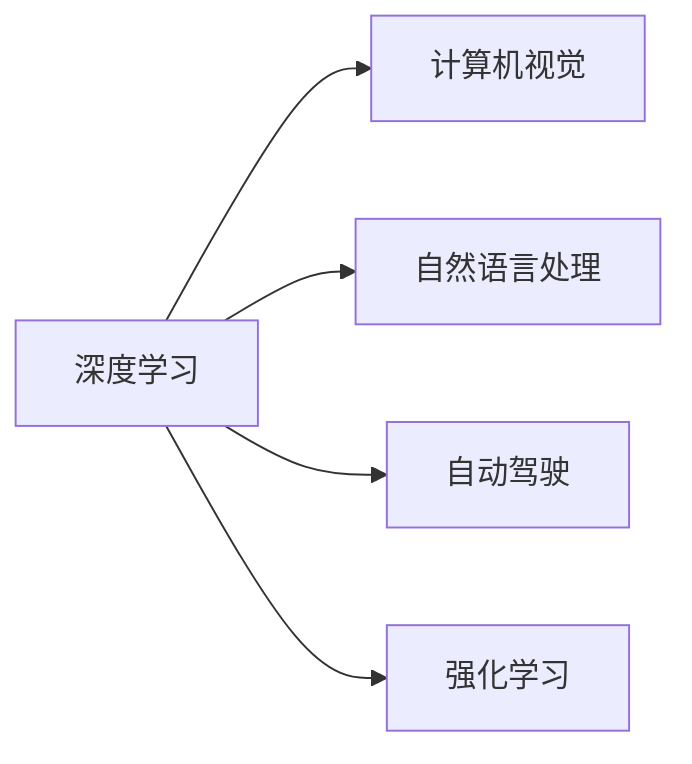

                 

# 安德烈·卡帕西的人工智能演讲精华

> 关键词：人工智能(AI)，机器学习(ML)，深度学习(Deep Learning)，深度神经网络(DNN)，计算机视觉(Computer Vision)，自然语言处理(Natural Language Processing)，自动驾驶(Autonomous Driving)，强化学习(Reinforcement Learning)，生成对抗网络(Generative Adversarial Networks, GANs)

## 1. 背景介绍

安德烈·卡帕西（Andrej Karpathy）是深度学习领域的杰出研究员，也是OpenAI的研究科学家。他的工作涉及机器学习和深度学习，尤其是在计算机视觉和自动驾驶等领域有着卓越的贡献。卡帕西的演讲内容通常涵盖多个前沿技术领域，为我们提供了一手的技术洞见。本文将梳理他在人工智能领域的关键观点和精彩论述。

### 1.1 演讲背景
卡帕西的演讲内容广泛且深入，涵盖从基础机器学习到高级深度学习算法的各个方面。他的演讲通常以实际应用案例为支撑，既有理论深度又有实践广度，为深度学习爱好者和从业者提供了宝贵的学习和借鉴资源。

### 1.2 重要观点概述
卡帕西的演讲强调了深度学习在实现自主驾驶、自然语言处理等前沿应用中的巨大潜力。他多次提到深度学习模型的优越性和挑战，呼吁从业者不断学习新知识，跟踪最新研究进展。

## 2. 核心概念与联系

### 2.1 核心概念概述

为深入理解卡帕西的演讲内容，我们首先梳理几个关键核心概念：

- **深度学习**：一种基于神经网络的机器学习方法，通过多层神经网络模拟人脑的思维方式，学习数据中的复杂模式。
- **计算机视觉**：使计算机能够像人类一样理解和处理图像、视频等视觉数据。
- **自动驾驶**：利用计算机视觉、深度学习等技术，使汽车、无人机等自主行驶，减少人为干预。
- **自然语言处理**：使计算机能够理解和生成自然语言，实现人机对话、文本分析等功能。
- **强化学习**：通过与环境的交互，学习最优决策策略，广泛应用于游戏、机器人等领域。

### 2.2 Mermaid流程图
以下是卡帕西演讲中涉及的核心概念之间的联系，通过Mermaid流程图展示：



这个图展示了深度学习如何在不同领域的应用，涵盖了计算机视觉、自然语言处理、自动驾驶和强化学习。

## 3. 核心算法原理 & 具体操作步骤
### 3.1 算法原理概述

卡帕西的演讲中，深度学习算法原理是始终贯穿的主题。深度学习算法通过多层次的神经网络结构，从原始数据中自动学习特征表示，实现复杂的模式识别和预测。

### 3.2 算法步骤详解
深度学习算法的典型步骤包括：
1. **数据准备**：收集和预处理数据，确保其符合模型训练的需求。
2. **模型构建**：设计深度神经网络结构，选择合适的损失函数和优化器。
3. **模型训练**：在训练集上迭代优化模型参数，最小化损失函数。
4. **模型评估**：在验证集和测试集上评估模型性能，选择最优模型。
5. **模型部署**：将训练好的模型应用于实际问题中，进行推理预测。

### 3.3 算法优缺点
深度学习算法在处理复杂模式识别和预测任务时表现卓越，但其也存在一些固有缺点：
- **数据依赖性高**：需要大量标注数据进行训练，标注成本高。
- **模型复杂度**：模型结构复杂，训练和推理计算量大。
- **过拟合风险**：易过拟合，特别是在数据量不足的情况下。
- **可解释性差**：黑盒模型，难以解释决策过程。

### 3.4 算法应用领域
深度学习算法在多个领域中取得了显著进展：
- **计算机视觉**：图像识别、物体检测、人脸识别等任务。
- **自然语言处理**：文本分类、机器翻译、情感分析等任务。
- **自动驾驶**：目标检测、语义分割、路径规划等任务。
- **强化学习**：游戏AI、机器人控制、推荐系统等任务。

## 4. 数学模型和公式 & 详细讲解 & 举例说明
### 4.1 数学模型构建

卡帕西在演讲中多次提到数学模型的构建是理解深度学习的基础。以下以卷积神经网络（CNN）为例，展示数学模型的构建过程。

### 4.2 公式推导过程
卷积神经网络的核心是卷积层和池化层。以下是卷积神经网络的数学表达：

$$
\begin{aligned}
H &= f\left(\sigma\left(W_{c} \cdot \sum_{i=1}^{h} \sum_{j=1}^{w} V_{i j} \cdot x_{i, j}\right)+b_{c}\right) \\
F &= f\left(\sigma\left(W_{f} \cdot \sum_{i=1}^{h} \sum_{j=1}^{w} V_{i j} \cdot H_{i, j}\right)+b_{f}\right)
\end{aligned}
$$

其中 $W$ 和 $V$ 分别是卷积核和池化核的权重矩阵，$f$ 是激活函数，$\sigma$ 是非线性函数，$x$ 是输入图像数据，$H$ 是卷积层的输出特征图，$F$ 是池化层的输出特征图。

### 4.3 案例分析与讲解
以图像分类任务为例，讲解卷积神经网络的工作原理。在图像分类任务中，卷积神经网络首先对图像进行卷积操作，提取特征，然后进行池化操作，减少特征图的尺寸。最后通过全连接层进行分类，输出预测结果。

## 5. 项目实践：代码实例和详细解释说明
### 5.1 开发环境搭建

为了实践深度学习算法，我们需要准备好开发环境。以下是基于Python和PyTorch的开发环境搭建步骤：

1. 安装Anaconda：从官网下载并安装Anaconda。
2. 创建虚拟环境：
   ```bash
   conda create -n pytorch-env python=3.8 
   conda activate pytorch-env
   ```
3. 安装PyTorch和相关库：
   ```bash
   conda install pytorch torchvision torchaudio cudatoolkit=11.1 -c pytorch -c conda-forge
   pip install torch torchvision torchtext
   ```

### 5.2 源代码详细实现

以下是一个基于卷积神经网络的图像分类代码示例：

```python
import torch
import torch.nn as nn
import torch.optim as optim

# 定义卷积神经网络模型
class Net(nn.Module):
    def __init__(self):
        super(Net, self).__init__()
        self.conv1 = nn.Conv2d(3, 6, 5)
        self.pool = nn.MaxPool2d(2, 2)
        self.conv2 = nn.Conv2d(6, 16, 5)
        self.fc1 = nn.Linear(16 * 5 * 5, 120)
        self.fc2 = nn.Linear(120, 84)
        self.fc3 = nn.Linear(84, 10)

    def forward(self, x):
        x = self.pool(torch.relu(self.conv1(x)))
        x = self.pool(torch.relu(self.conv2(x)))
        x = x.view(-1, 16 * 5 * 5)
        x = torch.relu(self.fc1(x))
        x = torch.relu(self.fc2(x))
        x = self.fc3(x)
        return x

# 加载数据集
train_set = ...
test_set = ...

# 定义模型和优化器
model = Net()
criterion = nn.CrossEntropyLoss()
optimizer = optim.SGD(model.parameters(), lr=0.001, momentum=0.9)

# 训练模型
for epoch in range(2):  # 多次迭代
    running_loss = 0.0
    for i, data in enumerate(train_loader, 0):
        inputs, labels = data
        optimizer.zero_grad()
        outputs = model(inputs)
        loss = criterion(outputs, labels)
        loss.backward()
        optimizer.step()
        running_loss += loss.item()
    print(f"Epoch {epoch+1}, loss: {running_loss/len(train_loader)}")

# 测试模型
correct = 0
total = 0
with torch.no_grad():
    for data in test_loader:
        images, labels = data
        outputs = model(images)
        _, predicted = torch.max(outputs.data, 1)
        total += labels.size(0)
        correct += (predicted == labels).sum().item()
print(f"Accuracy: {100 * correct / total}%")
```

### 5.3 代码解读与分析

上述代码中，我们首先定义了卷积神经网络模型，然后使用SGD优化器训练模型，并计算模型在测试集上的准确率。代码的核心在于模型的定义和训练过程。

## 6. 实际应用场景
### 6.1 计算机视觉
深度学习在计算机视觉中有着广泛应用，如图像分类、物体检测、人脸识别等任务。

### 6.2 自动驾驶
深度学习在自动驾驶领域中应用广泛，如图像分割、语义理解、路径规划等。

### 6.3 自然语言处理
深度学习在自然语言处理中也有着重要作用，如机器翻译、情感分析、文本生成等。

### 6.4 未来应用展望
深度学习技术在未来的应用前景广阔，尤其是在医疗、金融、教育等领域将有更多创新应用。

## 7. 工具和资源推荐
### 7.1 学习资源推荐

为了深入学习深度学习算法，以下是一些推荐的学习资源：

1. 《深度学习》课程：吴恩达教授在Coursera开设的深度学习课程，深入浅出地讲解深度学习的基本原理和应用。
2. 《Deep Learning with PyTorch》书籍：由Andrej Karpathy和Ian Goodfellow合著，详细介绍了如何使用PyTorch进行深度学习开发。
3. PyTorch官方文档：PyTorch的官方文档，提供了丰富的示例和API文档，适合快速上手实践。
4. 论文推荐：
   - Google论文：《Google's 20亿参数语言模型》
   - OpenAI论文：《OpenAI的GPT系列论文》

### 7.2 开发工具推荐

以下是一些常用的深度学习开发工具：

1. PyTorch：灵活的深度学习框架，支持动态图，适合研究和原型开发。
2. TensorFlow：广泛使用的深度学习框架，支持静态图和动态图，适合大规模生产部署。
3. Keras：简单易用的深度学习框架，适合快速原型开发和实验。
4. Jupyter Notebook：交互式的开发环境，支持代码编写和结果展示。
5. Google Colab：免费的GPU/TPU计算资源，支持代码编写和数据处理。

### 7.3 相关论文推荐

以下是一些深度学习领域的经典论文：

1. 《ImageNet classification with deep convolutional neural networks》
2. 《Very Deep Convolutional Networks for Large-Scale Image Recognition》
3. 《Attention is All You Need》
4. 《BERT: Pre-training of Deep Bidirectional Transformers for Language Understanding》

## 8. 总结：未来发展趋势与挑战
### 8.1 研究成果总结

安德烈·卡帕西在深度学习领域的研究成果丰富，涵盖了计算机视觉、自然语言处理、自动驾驶等多个前沿领域。他的研究推动了深度学习技术的不断进步，为实际应用带来了新的突破。

### 8.2 未来发展趋势

未来深度学习技术将面临以下发展趋势：

1. **自动化**：自动化模型设计、自动调参等技术将大大提高研发效率。
2. **多模态学习**：融合视觉、语音、文本等多种模态数据，实现更全面的智能应用。
3. **迁移学习**：通过预训练模型进行微调，提升模型在不同任务上的泛化能力。
4. **联邦学习**：分布式数据训练，保护数据隐私。

### 8.3 面临的挑战

深度学习技术在实际应用中仍面临以下挑战：

1. **数据隐私保护**：如何保护用户数据隐私，防止模型过拟合敏感信息。
2. **模型可解释性**：深度学习模型的黑盒性质，难以解释其内部决策过程。
3. **计算资源限制**：大规模模型的训练和推理需要大量计算资源。

### 8.4 研究展望

未来深度学习技术的研究方向包括：

1. **模型压缩**：减少模型参数量，提升推理效率。
2. **知识蒸馏**：将知识从预训练模型蒸馏到微调模型中，提升模型性能。
3. **自监督学习**：通过自监督学习任务，提升模型泛化能力。
4. **融合AI伦理**：将伦理道德约束纳入模型训练和应用中。

## 9. 附录：常见问题与解答

**Q1：深度学习算法如何避免过拟合？**

A: 深度学习算法可以通过以下方法避免过拟合：
- 数据增强：通过旋转、裁剪、添加噪声等方式扩充训练数据。
- 正则化：如L1/L2正则、Dropout等方法，限制模型复杂度。
- 早停法：在验证集上监测模型性能，提前停止训练，防止过拟合。
- 模型简化：减少模型参数量，避免复杂结构。

**Q2：如何评估深度学习模型的性能？**

A: 深度学习模型的性能评估通常包括准确率、召回率、F1值等指标。在实际应用中，还需要关注模型在实际数据上的表现，如时延、内存占用等。

**Q3：深度学习算法有哪些优势？**

A: 深度学习算法在处理复杂模式识别和预测任务时表现卓越，具有以下优势：
- 自适应能力：能自动学习数据中的复杂模式。
- 鲁棒性：在一定程度的噪声和扰动下，仍能保持较好的性能。
- 可解释性：虽然模型是黑盒的，但可以通过可视化技术，逐步理解模型决策过程。

**Q4：深度学习算法的局限性有哪些？**

A: 深度学习算法有以下局限性：
- 数据依赖性高：需要大量标注数据进行训练。
- 计算资源消耗大：模型结构复杂，训练和推理计算量大。
- 模型复杂度：难以解释模型内部决策过程。

**Q5：如何在实际应用中优化深度学习模型？**

A: 在实际应用中，优化深度学习模型可以从以下几个方面入手：
- 数据预处理：数据清洗、特征工程等，提高数据质量。
- 模型选择：选择合适的模型结构和参数。
- 调参优化：通过网格搜索、贝叶斯优化等方法，优化模型超参数。
- 模型集成：通过模型融合、投票等方法，提升模型性能。

---

作者：禅与计算机程序设计艺术 / Zen and the Art of Computer Programming

