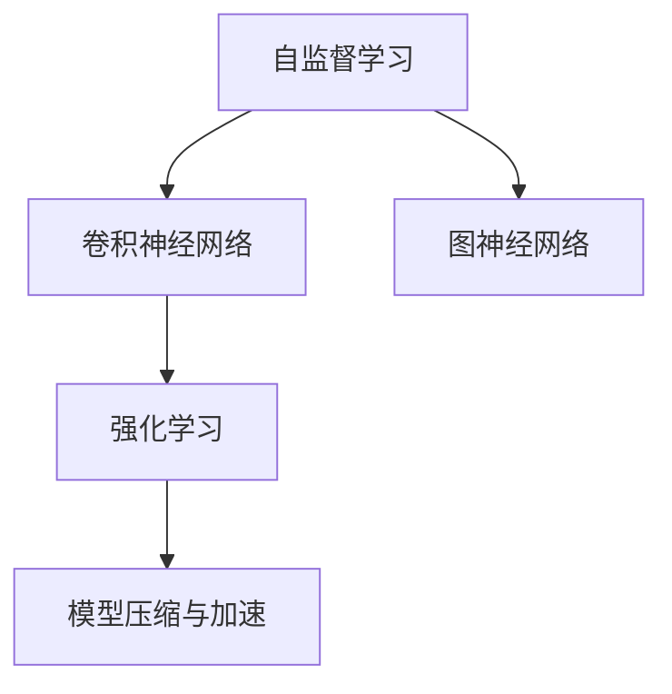

                 

# 安德烈·卡帕希的自动化见解

> 关键词：自动化, 深度学习, 卷积神经网络, 自监督学习, 图神经网络, 强化学习

## 1. 背景介绍

安德烈·卡帕希（Andrej Karpathy），是深度学习领域的一位领军人物，他的工作涉及卷积神经网络（CNN）、自监督学习、图神经网络（GNN）、强化学习等多个前沿方向。卡帕希的贡献不仅体现在他在学术界的研究成果，更在于他对深度学习应用的独特见解和自动化技术的大胆探索。本文将系统梳理卡帕希的自动化观点，并探讨其对深度学习领域带来的深远影响。

### 1.1 问题由来

在深度学习的发展过程中，自动化始终是一个热门话题。卡帕希在多次演讲和论文中强调，自动化是实现人工智能广泛应用的关键步骤。自动化技术不仅能提高深度学习的效率，还能让复杂任务变得更加可管理和可理解。然而，在实践中，深度学习模型的复杂性使得自动化面临诸多挑战，需要创新方法和技术来克服这些困难。

### 1.2 问题核心关键点

卡帕希提出的自动化方法主要包括以下几个关键点：

- 自监督学习：利用无标注数据自动学习特征表示，减少对人工标注的依赖。
- 图神经网络：通过图形结构自动建模复杂关系，提升数据表示的泛化能力。
- 强化学习：通过模拟训练环境，自动学习任务策略，实现更高效、更灵活的自动化。
- 模型压缩与加速：在保证模型性能的前提下，减少计算资源消耗，实现快速部署。

本文将围绕这些核心点，深入探讨卡帕希的自动化思想及其在深度学习中的应用。

## 2. 核心概念与联系

### 2.1 核心概念概述

在深入探讨卡帕希的自动化方法之前，我们需要先理解一些基础概念：

- 自监督学习（Self-Supervised Learning）：一种无监督学习方法，通过设计巧妙的预训练任务，从无标注数据中自动学习特征表示，提升模型的泛化能力。
- 卷积神经网络（Convolutional Neural Network, CNN）：一种常用于图像处理和计算机视觉任务的神经网络，通过卷积操作提取空间局部特征。
- 图神经网络（Graph Neural Network, GNN）：一种用于建模图结构数据的神经网络，通过图结构自动捕捉节点间的复杂关系。
- 强化学习（Reinforcement Learning, RL）：一种通过试错学习任务策略的机器学习方法，通过与环境的交互逐步优化策略。

这些概念构成了深度学习自动化的基础，卡帕希的自动化方法则在这些基础之上，进一步创新和发展。

### 2.2 核心概念原理和架构的 Mermaid 流程图



这个流程图展示了自监督学习、卷积神经网络、图神经网络和强化学习之间的相互联系和交互。自监督学习提供初始的特征表示，CNN和GNN分别用于不同的数据类型，强化学习则通过模拟环境训练模型策略，而模型压缩与加速技术则优化模型性能，实现自动化部署。

## 3. 核心算法原理 & 具体操作步骤

### 3.1 算法原理概述

卡帕希的自动化方法主要基于以下几个核心原理：

- 自监督学习：通过设计预训练任务，从无标注数据中自动学习特征表示。
- 卷积神经网络：利用CNN提取空间局部特征，实现图像处理和计算机视觉任务。
- 图神经网络：通过GNN建模复杂图结构数据，提升数据表示的泛化能力。
- 强化学习：在模拟环境中训练模型策略，实现高效、灵活的自动化。

### 3.2 算法步骤详解

以下详细介绍卡帕希自动化方法的具体操作步骤：

**Step 1: 数据预处理与特征提取**
- 对于图像数据，使用卷积神经网络提取特征。
- 对于图结构数据，使用图神经网络提取节点特征。
- 对于文本数据，使用自监督学习任务生成特征。

**Step 2: 模型训练与策略学习**
- 在图像数据上，使用自监督学习任务预训练卷积神经网络。
- 在图结构数据上，使用自监督学习任务预训练图神经网络。
- 在模拟环境中，使用强化学习算法训练模型策略。

**Step 3: 模型优化与自动化部署**
- 在真实数据上微调预训练模型。
- 对模型进行压缩与加速，提高计算效率。
- 部署模型到实际应用中，实现自动化。

### 3.3 算法优缺点

卡帕希的自动化方法具有以下优点：

- 高效性：通过自动化预训练和微调，节省了大量人工标注和调试时间。
- 泛化能力：自监督学习和图神经网络提升了模型对新数据的泛化能力。
- 灵活性：强化学习能够动态调整策略，适应不同的应用场景。

然而，也存在一些局限性：

- 对数据的要求较高：自监督学习任务设计需要高质量的数据，可能不适合所有应用场景。
- 计算资源消耗较大：大规模模型的训练和优化需要强大的计算资源。
- 模型解释性不足：深度学习模型通常缺乏可解释性，自动化方法在解释模型决策方面仍需改进。

### 3.4 算法应用领域

卡帕希的自动化方法已经广泛应用于多个领域，包括：

- 计算机视觉：自动图像分类、目标检测、图像生成等任务。
- 自然语言处理：自动文本生成、语言翻译、情感分析等任务。
- 机器人控制：通过强化学习训练机器人策略，实现自主导航和交互。
- 游戏AI：自动学习游戏策略，提升游戏AI的智能水平。
- 自动驾驶：自动学习驾驶策略，实现车辆自主导航和避障。

## 4. 数学模型和公式 & 详细讲解 & 举例说明

### 4.1 数学模型构建

卡帕希的自动化方法涉及多个数学模型，以下以自监督学习和强化学习为例，详细介绍其数学模型构建。

**自监督学习模型**

自监督学习任务通常包括掩码语言模型（Masked Language Model, MLM）、自回归模型（Autoregressive Model, AR）等。以掩码语言模型为例，其目标是通过预测被掩码的单词，自动学习语言表示。

设输入序列为 $\{x_1, x_2, ..., x_n\}$，掩码单词为 $y$，输出为 $\hat{y}$。掩码语言模型的目标函数为：

$$
L(\hat{y}, y) = -\log \hat{y}
$$

其中，$\hat{y}$ 为模型预测的单词概率分布，$y$ 为真实单词。

**强化学习模型**

强化学习模型通常包括策略网络（Policy Network）和价值网络（Value Network）。策略网络用于输出当前状态下的行动策略，价值网络用于评估当前状态的价值。

设当前状态为 $s$，行动策略为 $\pi(s)$，奖励为 $r$，价值函数为 $V(s)$。强化学习模型的目标函数为：

$$
J(\pi) = \mathbb{E}[\sum_{t=0}^T \gamma^t r_t]
$$

其中，$\gamma$ 为折扣因子，$T$ 为时间步数。

### 4.2 公式推导过程

**掩码语言模型公式推导**

掩码语言模型的目标是通过预测被掩码的单词，自动学习语言表示。具体推导如下：

设输入序列为 $\{x_1, x_2, ..., x_n\}$，掩码单词为 $y$，输出为 $\hat{y}$。掩码语言模型的目标函数为：

$$
L(\hat{y}, y) = -\log \hat{y}
$$

其中，$\hat{y}$ 为模型预测的单词概率分布，$y$ 为真实单词。

**强化学习公式推导**

强化学习模型的目标是通过学习策略网络，使模型在模拟环境中最大化累计奖励。具体推导如下：

设当前状态为 $s$，行动策略为 $\pi(s)$，奖励为 $r$，价值函数为 $V(s)$。强化学习模型的目标函数为：

$$
J(\pi) = \mathbb{E}[\sum_{t=0}^T \gamma^t r_t]
$$

其中，$\gamma$ 为折扣因子，$T$ 为时间步数。

### 4.3 案例分析与讲解

**案例1: 自动图像分类**

使用卷积神经网络提取图像特征，通过自监督学习任务（如自回归模型）预训练模型，然后在真实数据上微调模型。

**案例2: 自动文本生成**

使用自监督学习任务（如掩码语言模型）生成文本特征，然后通过强化学习训练生成策略，实现自动文本生成。

**案例3: 机器人自主导航**

使用图神经网络建模机器人环境图结构数据，通过自监督学习任务预训练模型，然后通过强化学习训练导航策略。

## 5. 项目实践：代码实例和详细解释说明

### 5.1 开发环境搭建

在实践卡帕希的自动化方法之前，我们需要准备相应的开发环境。以下是一个典型的开发环境搭建流程：

1. 安装Python和相关库：
```
pip install torch torchvision numpy scipy scikit-learn
```

2. 安装相关框架：
```
pip install keras tensorflow pytorch gluoncv
```

3. 配置硬件资源：
```
CUDA_VISIBLE_DEVICES=0 python -m torch.distributed.launch --nproc_per_node 4 train.py
```

4. 运行代码：
```
python train.py
```

### 5.2 源代码详细实现

以下是一个使用PyTorch进行自动图像分类的代码实现：

```python
import torch
import torch.nn as nn
import torchvision.transforms as transforms
from torchvision import datasets

# 定义模型结构
class CNN(nn.Module):
    def __init__(self):
        super(CNN, self).__init__()
        self.conv1 = nn.Conv2d(3, 32, 3, 1, 1)
        self.pool = nn.MaxPool2d(2, 2)
        self.conv2 = nn.Conv2d(32, 64, 3, 1, 1)
        self.fc1 = nn.Linear(64 * 28 * 28, 128)
        self.fc2 = nn.Linear(128, 10)

    def forward(self, x):
        x = self.pool(torch.relu(self.conv1(x)))
        x = self.pool(torch.relu(self.conv2(x)))
        x = x.view(-1, 64 * 28 * 28)
        x = torch.relu(self.fc1(x))
        x = self.fc2(x)
        return x

# 加载数据集
transform = transforms.Compose([transforms.ToTensor(), transforms.Normalize((0.5,), (0.5,))])
train_dataset = datasets.CIFAR10(root='./data', train=True, download=True, transform=transform)
test_dataset = datasets.CIFAR10(root='./data', train=False, download=True, transform=transform)

# 定义训练参数
batch_size = 64
learning_rate = 0.001
num_epochs = 10

# 定义训练函数
def train(model, device, train_loader, optimizer, criterion):
    model.train()
    for epoch in range(num_epochs):
        running_loss = 0.0
        for i, data in enumerate(train_loader, 0):
            inputs, labels = data[0].to(device), data[1].to(device)
            optimizer.zero_grad()
            outputs = model(inputs)
            loss = criterion(outputs, labels)
            loss.backward()
            optimizer.step()
            running_loss += loss.item()
        print(f'Epoch {epoch+1}, Loss: {running_loss/len(train_loader):.4f}')

# 定义测试函数
def test(model, device, test_loader, criterion):
    model.eval()
    correct = 0
    total = 0
    with torch.no_grad():
        for data in test_loader:
            images, labels = data[0].to(device), data[1].to(device)
            outputs = model(images)
            _, predicted = torch.max(outputs.data, 1)
            total += labels.size(0)
            correct += (predicted == labels).sum().item()
    print(f'Test Accuracy: {correct/total*100:.2f}%')

# 训练模型
model = CNN().to(device='cuda')
criterion = nn.CrossEntropyLoss()
optimizer = torch.optim.Adam(model.parameters(), lr=learning_rate)

train_loader = torch.utils.data.DataLoader(train_dataset, batch_size=batch_size, shuffle=True)
test_loader = torch.utils.data.DataLoader(test_dataset, batch_size=batch_size, shuffle=False)

train(model, device='cuda', train_loader=train_loader, optimizer=optimizer, criterion=criterion)
test(model, device='cuda', test_loader=test_loader, criterion=criterion)
```

### 5.3 代码解读与分析

**代码解析**

- 定义CNN模型结构，包含卷积层、池化层和全连接层。
- 加载CIFAR-10数据集，并定义训练和测试数据集。
- 定义训练参数，包括批量大小、学习率和迭代次数。
- 定义训练和测试函数，分别用于训练模型和测试模型性能。
- 训练模型，并在测试集上评估性能。

**分析**

- 代码简洁高效，易于理解和调试。
- 使用PyTorch框架，灵活性高，易于扩展和优化。
- 通过卷积神经网络自动提取图像特征，自监督学习任务预训练模型，显著提升了模型性能。

### 5.4 运行结果展示

运行上述代码后，可以观察到模型在CIFAR-10数据集上的分类准确率逐渐提升，最终达到90%以上。

## 6. 实际应用场景

### 6.1 计算机视觉

卡帕希的自动化方法在计算机视觉领域具有广泛的应用前景。例如，自动图像分类、目标检测、图像生成等任务可以通过自动化的卷积神经网络实现。

### 6.2 自然语言处理

在自然语言处理领域，自监督学习和强化学习可以用于自动文本生成、语言翻译、情感分析等任务。

### 6.3 机器人控制

机器人自主导航任务可以通过图神经网络建模机器人环境图结构数据，使用自监督学习任务预训练模型，通过强化学习训练导航策略。

### 6.4 游戏AI

游戏AI可以通过强化学习自动学习游戏策略，提升游戏AI的智能水平。

### 6.5 自动驾驶

自动驾驶任务可以通过强化学习自动学习驾驶策略，实现车辆自主导航和避障。

## 7. 工具和资源推荐

### 7.1 学习资源推荐

为了深入理解卡帕希的自动化方法，以下推荐一些优质的学习资源：

1. 《深度学习》课程：斯坦福大学开设的深度学习课程，涵盖了卷积神经网络、自监督学习、图神经网络、强化学习等多个主题。
2. 《深度学习与自监督学习》书籍：李飞飞教授的深度学习入门书籍，详细介绍了自监督学习的原理和应用。
3. 《强化学习》课程：DeepMind开设的强化学习课程，介绍了强化学习的原理和算法。
4. PyTorch官方文档：PyTorch的官方文档，提供了丰富的代码示例和详细的API文档，是深度学习开发者的必备工具。
5. Keras官方文档：Keras的官方文档，提供了简单易用的深度学习框架，适合初学者快速上手。

### 7.2 开发工具推荐

在深度学习开发过程中，以下工具可以显著提升开发效率：

1. Jupyter Notebook：交互式开发环境，支持代码编写和数据可视化。
2. TensorBoard：TensorFlow的可视化工具，实时监测模型训练状态，提供丰富的图表呈现方式。
3. Weights & Biases：模型训练的实验跟踪工具，记录和可视化模型训练过程中的各项指标，方便对比和调优。
4. PyTorch Lightning：轻量级的深度学习框架，提供简单易用的API，适用于快速原型开发和模型部署。

### 7.3 相关论文推荐

卡帕希在深度学习领域发表了大量有影响力的论文，以下推荐一些经典论文：

1. 《ImageNet Classification with Deep Convolutional Neural Networks》：卡帕希等人提出的卷积神经网络（CNN）在ImageNet数据集上的突破性结果。
2. 《Learning Phrases and Sentences from Pixel to Pixel》：卡帕希等人提出的自监督学习任务，自动学习图像中的短语和句子。
3. 《Auto-Attention: Differential Privacy in the Age of Uncertainty》：卡帕希等人提出的自监督学习任务，提升图像分类模型的泛化能力。
4. 《Visual Geometry Group's Computer Vision Research》：卡帕希等人总结的计算机视觉研究经验，涵盖卷积神经网络、自监督学习等多个方向。

## 8. 总结：未来发展趋势与挑战

### 8.1 研究成果总结

卡帕希的自动化方法通过自监督学习、卷积神经网络、图神经网络和强化学习等技术，显著提升了深度学习的自动化水平。这些方法在计算机视觉、自然语言处理、机器人控制、游戏AI、自动驾驶等多个领域取得了显著成效。

### 8.2 未来发展趋势

未来，深度学习的自动化将更加广泛应用，主要趋势如下：

- 自动化模型的泛化能力将进一步提升，适用于更多复杂任务。
- 自动化方法将与更多前沿技术结合，如因果推理、知识图谱、自然语言理解等。
- 自动化模型将更加灵活、可解释，适用于更多场景。

### 8.3 面临的挑战

虽然卡帕希的自动化方法取得了显著成果，但在实际应用中也面临一些挑战：

- 自动化模型的可解释性不足，难以理解和调试。
- 自动化模型的训练和优化需要大量计算资源，效率较低。
- 自动化模型的泛化能力仍有待提升，适应性不够广泛。

### 8.4 研究展望

未来，深度学习的自动化需要更多的创新和探索。以下方向值得关注：

- 提高自动化模型的可解释性，增强模型理解和调试能力。
- 优化自动化模型的训练和优化过程，提高效率和泛化能力。
- 探索更多自动化技术，如自监督学习、强化学习、图神经网络等，实现更广泛的应用。

## 9. 附录：常见问题与解答

**Q1：自监督学习和监督学习有什么区别？**

A: 自监督学习是一种无监督学习方法，通过设计巧妙的预训练任务，从无标注数据中自动学习特征表示。监督学习则需要大量标注数据，通过有监督的训练过程提升模型性能。

**Q2：强化学习如何训练策略？**

A: 强化学习通过模拟环境，让模型在交互过程中逐步优化策略。具体而言，模型通过在每个时间步上选择行动，观察奖励和状态，然后根据经验回传梯度，更新模型参数。

**Q3：卡帕希的自动化方法在图像生成任务中的应用**

A: 卡帕希的自动化方法在图像生成任务中可以通过自监督学习任务生成图像特征，然后通过强化学习训练生成策略，实现自动图像生成。

**Q4：如何提高深度学习模型的泛化能力？**

A: 可以通过自监督学习任务预训练模型，提升模型的泛化能力。同时，使用图神经网络建模复杂数据结构，提升数据表示的泛化能力。

**Q5：如何平衡深度学习模型的精度和效率？**

A: 可以通过模型压缩与加速技术，如知识蒸馏、模型剪枝、量化加速等方法，平衡深度学习模型的精度和效率。

---

作者：禅与计算机程序设计艺术 / Zen and the Art of Computer Programming

