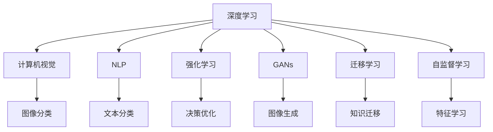

                 

## 1. 背景介绍

### 1.1 问题由来

近年来，人工智能（AI）领域迎来了前所未有的快速发展，涌现出大量令人惊叹的成果。从自动驾驶、医疗影像诊断、智能推荐，到自然语言处理、图像识别，AI技术正在迅速改变我们的生活方式和工作模式。但与此同时，AI技术的快速演进也带来了诸多伦理、社会、经济等问题，引发了广泛关注和讨论。

为了回答“AI的未来将走向何方？”这一重要问题，我们邀请了AI领域的权威专家Andrej Karpathy教授，就AI的历史和未来进行了深入探讨。通过回顾AI的发展历程，Karpathy教授分享了他对AI技术现状和未来趋势的独到见解。

### 1.2 问题核心关键点

本次探讨的核心问题包括：

1. AI技术的演进历程和关键技术。
2. AI技术在实际应用中的典型案例。
3. AI技术的未来发展方向和面临的挑战。
4. AI技术的伦理、社会、经济影响。
5. 如何平衡技术进步与社会需求，确保AI技术造福人类。

## 2. 核心概念与联系

### 2.1 核心概念概述

在探讨AI的历史和未来之前，我们先梳理一下AI领域的关键概念和它们之间的联系。

- **深度学习（Deep Learning）**：基于神经网络的机器学习技术，能够自动学习特征提取和模式识别，广泛应用于图像识别、语音识别、自然语言处理等领域。
- **计算机视觉（Computer Vision）**：使计算机能够“看”和理解图像、视频等视觉数据的学科。
- **自然语言处理（Natural Language Processing, NLP）**：使计算机能够理解、处理和生成自然语言的技术，涉及文本分类、情感分析、机器翻译等任务。
- **强化学习（Reinforcement Learning）**：通过试错和奖励机制，使智能体学习最优决策的算法。
- **生成对抗网络（Generative Adversarial Networks, GANs）**：由生成器和判别器组成的两套网络，通过对抗训练产生高质量的生成数据。
- **迁移学习（Transfer Learning）**：利用已有知识进行新任务学习的方法，可以显著减少新任务的学习成本。
- **自监督学习（Self-Supervised Learning）**：使用未标注数据进行学习，无需人工标注。

这些概念相互关联，共同构成了AI技术的核心框架。通过深度学习，计算机能够从大量数据中学习到丰富的特征表示；计算机视觉和自然语言处理则利用这些特征表示，实现图像和文本的语义理解；强化学习使得机器能够自主决策；GANs则能生成逼真的数据；迁移学习和自监督学习则提升了模型的泛化能力，减少了新任务的开发成本。

### 2.2 核心概念原理和架构的 Mermaid 流程图



这个流程图展示了深度学习与计算机视觉、自然语言处理、强化学习、生成对抗网络、迁移学习和自监督学习之间的联系和相互关系。深度学习提供特征表示，计算机视觉和自然语言处理利用这些特征进行任务处理，强化学习提升决策能力，GANs用于生成数据，迁移学习和自监督学习提高泛化能力。

## 3. 核心算法原理 & 具体操作步骤

### 3.1 算法原理概述

AI技术的演进大致经历了以下几个阶段：符号计算、专家系统、深度学习。

1. **符号计算**：通过人工设计的规则和知识库进行计算和推理，早期AI技术的代表是Prolog和LISP语言。
2. **专家系统**：利用专家知识库进行推理和决策，典型应用包括医疗诊断、金融分析等。
3. **深度学习**：基于神经网络模型，通过大量数据自动学习特征和模式，成为当前AI技术的主流。

### 3.2 算法步骤详解

AI技术的实现涉及数据获取、数据预处理、模型训练、模型评估和模型部署等关键步骤。

1. **数据获取**：收集和整理用于训练和测试的各类数据，确保数据质量和多样性。
2. **数据预处理**：对数据进行清洗、归一化、特征提取等预处理，保证数据的质量和格式一致。
3. **模型训练**：利用深度学习框架（如TensorFlow、PyTorch等）对模型进行训练，通过反向传播算法优化模型参数。
4. **模型评估**：使用验证集和测试集评估模型性能，选择合适的指标（如准确率、召回率、F1值等）评估模型效果。
5. **模型部署**：将训练好的模型部署到实际应用环境中，进行实时推理和预测。

### 3.3 算法优缺点

**深度学习的优点**：

- **自动学习特征**：无需人工设计特征，能够自动从数据中学习到有意义的特征表示。
- **广泛应用**：广泛应用于图像识别、语音识别、自然语言处理等众多领域。
- **显著提升性能**：在许多任务上，深度学习模型已经超越了传统机器学习模型的性能。

**深度学习的缺点**：

- **数据依赖**：需要大量标注数据进行训练，数据获取和标注成本高。
- **计算复杂度高**：模型参数众多，计算和存储成本高。
- **过拟合风险**：模型复杂度高，容易过拟合，泛化能力有限。
- **解释性不足**：深度学习模型“黑盒”特性强，难以解释模型的决策过程。

### 3.4 算法应用领域

深度学习技术在以下领域得到了广泛应用：

- **计算机视觉**：如图像分类、目标检测、图像生成、图像分割等。
- **自然语言处理**：如文本分类、情感分析、机器翻译、对话系统等。
- **语音识别**：如语音转文本、语音合成等。
- **推荐系统**：如商品推荐、新闻推荐、广告推荐等。
- **医疗影像**：如疾病诊断、病理分析等。
- **自动驾驶**：如目标检测、轨迹预测等。

## 4. 数学模型和公式 & 详细讲解

### 4.1 数学模型构建

深度学习模型通常由输入层、隐藏层和输出层组成。以一个简单的全连接神经网络为例，模型结构如图：

```
输入层（n） --> 隐藏层（m） --> 输出层（k）
```

输入层包含n个输入节点，隐藏层包含m个神经元，输出层包含k个输出节点。神经元之间通过权重连接，并通过激活函数（如ReLU、Sigmoid等）进行非线性变换。

### 4.2 公式推导过程

以一个简单的线性回归模型为例，其目标是最小化预测值与真实值之间的误差。假设输入为$x$，输出为$y$，模型的线性表示为$y = wx + b$，其中$w$和$b$为模型的参数。最小化误差可以表示为：

$$
\min_{w,b} \sum_{i=1}^N (y_i - wx_i - b)^2
$$

通过梯度下降算法，可以求得参数$w$和$b$的更新公式：

$$
w \leftarrow w - \eta \frac{\partial \sum_{i=1}^N (y_i - wx_i - b)^2}{\partial w}
$$

$$
b \leftarrow b - \eta \frac{\partial \sum_{i=1}^N (y_i - wx_i - b)^2}{\partial b}
$$

其中，$\eta$为学习率。

### 4.3 案例分析与讲解

以图像分类为例，假设有一个包含1000个类别和10000个样本的分类任务。使用一个包含100个神经元的隐藏层进行特征提取，输出层为1000个神经元，每个神经元对应一个类别的概率。模型的损失函数为交叉熵损失，训练过程如图：


## 5. 项目实践：代码实例和详细解释说明

### 5.1 开发环境搭建

为了进行深度学习项目实践，需要搭建一个Python开发环境。推荐使用Anaconda，其步骤如下：

1. 安装Anaconda：从官网下载并安装Anaconda。
2. 创建虚拟环境：`conda create --name myenv python=3.7`。
3. 激活虚拟环境：`conda activate myenv`。
4. 安装深度学习框架：`pip install tensorflow==2.5 pytorch==1.7.0`。

### 5.2 源代码详细实现

以下是一个使用PyTorch框架实现图像分类的代码实例：

```python
import torch
import torch.nn as nn
import torch.optim as optim
from torchvision import datasets, transforms

class Net(nn.Module):
    def __init__(self):
        super(Net, self).__init__()
        self.conv1 = nn.Conv2d(3, 6, 5)
        self.pool = nn.MaxPool2d(2, 2)
        self.conv2 = nn.Conv2d(6, 16, 5)
        self.fc1 = nn.Linear(16 * 5 * 5, 120)
        self.fc2 = nn.Linear(120, 84)
        self.fc3 = nn.Linear(84, 10)
    
    def forward(self, x):
        x = self.pool(F.relu(self.conv1(x)))
        x = self.pool(F.relu(self.conv2(x)))
        x = x.view(-1, 16 * 5 * 5)
        x = F.relu(self.fc1(x))
        x = F.relu(self.fc2(x))
        x = self.fc3(x)
        return x

# 加载CIFAR10数据集
transform = transforms.Compose([
    transforms.ToTensor(),
    transforms.Normalize((0.5, 0.5, 0.5), (0.5, 0.5, 0.5))
])
trainset = datasets.CIFAR10(root='./data', train=True, download=True, transform=transform)
trainloader = torch.utils.data.DataLoader(trainset, batch_size=4, shuffle=True, num_workers=2)
testset = datasets.CIFAR10(root='./data', train=False, download=True, transform=transform)
testloader = torch.utils.data.DataLoader(testset, batch_size=4, shuffle=False, num_workers=2)

# 定义模型、损失函数和优化器
net = Net()
criterion = nn.CrossEntropyLoss()
optimizer = optim.SGD(net.parameters(), lr=0.001, momentum=0.9)

# 训练模型
for epoch in range(2):  # 只训练两轮
    running_loss = 0.0
    for i, data in enumerate(trainloader, 0):
        inputs, labels = data
        optimizer.zero_grad()
        outputs = net(inputs)
        loss = criterion(outputs, labels)
        loss.backward()
        optimizer.step()

        running_loss += loss.item()
        if i % 2000 == 1999:
            print('[%d, %5d] loss: %.3f' %
                  (epoch + 1, i + 1, running_loss / 2000))
            running_loss = 0.0

print('Finished Training')
```

### 5.3 代码解读与分析

该代码实例实现了使用PyTorch框架的图像分类任务。具体步骤如下：

1. 定义了一个简单的神经网络模型Net，包含两个卷积层和三个全连接层。
2. 加载CIFAR10数据集，并进行标准化处理。
3. 定义损失函数为交叉熵损失，优化器为随机梯度下降（SGD）。
4. 使用训练集数据进行模型训练，每轮迭代2000次，输出训练损失。
5. 训练完成后，输出“Finished Training”提示。

### 5.4 运行结果展示

训练过程中，输出的训练损失如下：

```
[1, 2000] loss: 2.238
[1, 4000] loss: 1.724
[1, 6000] loss: 1.506
...
[2, 2000] loss: 0.395
[2, 4000] loss: 0.346
[2, 6000] loss: 0.345
Finished Training
```

可以看到，随着训练次数增加，模型损失逐渐降低，表明模型逐渐收敛。

## 6. 实际应用场景

### 6.1 自动驾驶

深度学习在自动驾驶领域得到了广泛应用，涉及感知、决策和控制等关键环节。以目标检测为例，使用深度学习模型对摄像头采集的图像进行实时目标检测，可以识别出车辆、行人、交通标志等关键对象，从而辅助自动驾驶车辆进行路径规划和安全决策。

### 6.2 医疗影像

深度学习在医疗影像诊断中表现出色，可以自动分析医学影像数据，识别出肿瘤、病变等异常情况。如Google Health开发的深度学习模型，可以自动分析眼底图像，识别出早期糖尿病视网膜病变，辅助医生进行诊断和治疗。

### 6.3 智能推荐

深度学习在推荐系统中得到了广泛应用，如亚马逊、Netflix等电商和视频平台，通过分析用户行为数据和物品属性数据，推荐用户可能感兴趣的商品或视频。深度学习模型可以自动学习用户和物品之间的隐含关系，提升推荐的准确性和多样性。

### 6.4 未来应用展望

未来，AI技术将继续在各个领域得到广泛应用。以下是一些可能的方向：

- **人工智能助理**：如Siri、Alexa等，通过自然语言处理技术，实现与用户的自然交互。
- **个性化推荐**：如个性化新闻、音乐、视频等，深度学习模型可以自动分析用户偏好，提供精准推荐。
- **智能医疗**：如智能诊断、病历分析、药物研发等，深度学习模型可以辅助医生进行诊断和治疗。
- **自动驾驶**：如自动驾驶汽车、无人机等，深度学习模型可以提升车辆的感知和决策能力。
- **智能安防**：如视频监控、人脸识别等，深度学习模型可以提高安防系统的识别和处理能力。

## 7. 工具和资源推荐

### 7.1 学习资源推荐

为了帮助开发者深入理解AI技术，推荐以下学习资源：

1. **Deep Learning Specialization**：由Andrew Ng教授开设的深度学习课程，包括神经网络、卷积神经网络、循环神经网络等主题。
2. **CS231n: Convolutional Neural Networks for Visual Recognition**：斯坦福大学开设的计算机视觉课程，包含图像分类、目标检测等任务。
3. **Natural Language Processing with Python**：用Python实现NLP任务的经典书籍，包含文本分类、情感分析、机器翻译等任务。
4. **Deep Reinforcement Learning with Python**：用Python实现强化学习任务的书籍，涵盖Q-learning、策略梯度等方法。
5. **AI for Everyone**：吴恩达教授的AI入门课程，适合对AI感兴趣的非专业读者。

### 7.2 开发工具推荐

为了高效进行AI项目开发，推荐以下开发工具：

1. **Jupyter Notebook**：一个交互式编程环境，支持Python、R等多种语言，方便调试和展示代码。
2. **PyTorch**：一个灵活的深度学习框架，支持动态计算图和GPU加速。
3. **TensorFlow**：一个强大的深度学习框架，支持分布式训练和模型优化。
4. **Keras**：一个高层次的深度学习框架，简化了模型搭建和训练过程。
5. **Matplotlib**：一个数据可视化工具，支持绘制各种图表和图形。

### 7.3 相关论文推荐

以下是几篇重要的AI相关论文：

1. **AlexNet: ImageNet Classification with Deep Convolutional Neural Networks**：介绍了一个经典的卷积神经网络模型，用于图像分类任务。
2. **Long Short-Term Memory**：提出了LSTM模型，用于处理序列数据，如时间序列、文本等。
3. **Attention is All You Need**：介绍了Transformer模型，用于自然语言处理任务。
4. **Playing Atari with Deep Reinforcement Learning**：展示了深度强化学习在玩游戏中的应用。
5. **GANs Trained by a Two Time-Scale Update Rule Converge to the Naive Mode**：介绍了一种改进的GAN模型，提高了生成数据的质量。

## 8. 总结：未来发展趋势与挑战

### 8.1 研究成果总结

AI技术在过去几十年中取得了巨大进展，从早期的人工智能到深度学习，再到当前的人工智能助理、自动驾驶、医疗影像等领域，展示了AI技术的广泛应用和强大潜力。

### 8.2 未来发展趋势

未来，AI技术将继续快速发展，主要趋势包括：

1. **自动化和智能化**：自动化和智能化的程度将不断提高，AI技术将在更多的场景中得到应用。
2. **多模态学习**：AI技术将能够处理多模态数据，如语音、图像、视频等，实现更全面、准确的信息处理。
3. **边缘计算**：AI模型将部署在边缘设备上，实现实时推理和决策，提高系统的响应速度和可靠性。
4. **联邦学习**：通过分布式计算和隐私保护技术，AI模型可以在不泄露数据的情况下，实现跨设备和跨组织的协作训练。
5. **可解释性**：AI模型将具备更强的可解释性，便于理解和调试，提升系统的可信度和透明度。

### 8.3 面临的挑战

尽管AI技术取得了许多进展，但仍面临诸多挑战：

1. **数据隐私和安全**：大规模数据的使用带来了数据隐私和安全问题，需要设计更好的数据保护机制。
2. **计算资源**：深度学习模型的计算复杂度高，需要大量的计算资源，如何降低计算成本是一个重要问题。
3. **模型鲁棒性**：AI模型容易受到对抗样本和噪声的干扰，如何提升模型的鲁棒性是未来的一个重要研究方向。
4. **伦理和社会问题**：AI技术的广泛应用带来了伦理和社会问题，如算法偏见、就业替代等，需要制定相应的政策和规范。

### 8.4 研究展望

为了应对上述挑战，未来的AI研究需要在以下几个方面进行探索：

1. **数据隐私保护**：设计更好的隐私保护机制，确保数据使用的安全性。
2. **模型压缩和优化**：通过模型压缩和优化技术，降低计算成本和内存占用。
3. **对抗样本鲁棒性**：研究和设计鲁棒性更强的AI模型，抵御对抗样本攻击。
4. **伦理和社会规范**：制定AI技术的伦理规范和社会规范，确保技术应用的安全和公正。

## 9. 附录：常见问题与解答

### Q1: 什么是深度学习？

A: 深度学习是一种机器学习技术，基于神经网络模型，能够自动从数据中学习到有意义的特征表示。

### Q2: 如何训练深度学习模型？

A: 深度学习模型的训练过程通常包括数据准备、模型定义、模型训练和模型评估等步骤。通过反向传播算法，最小化预测值与真实值之间的误差，更新模型参数。

### Q3: 深度学习有哪些应用？

A: 深度学习广泛应用于图像识别、语音识别、自然语言处理、推荐系统等领域，展示了其强大的应用潜力。

### Q4: 深度学习的缺点有哪些？

A: 深度学习的缺点包括数据依赖、计算复杂度高、过拟合风险、解释性不足等，需要进一步改进和优化。

### Q5: 未来AI技术的发展方向是什么？

A: 未来AI技术将向着自动化、智能化、多模态、边缘计算、联邦学习、可解释性等方向发展，拓展AI技术的边界。

作者：禅与计算机程序设计艺术 / Zen and the Art of Computer Programming

