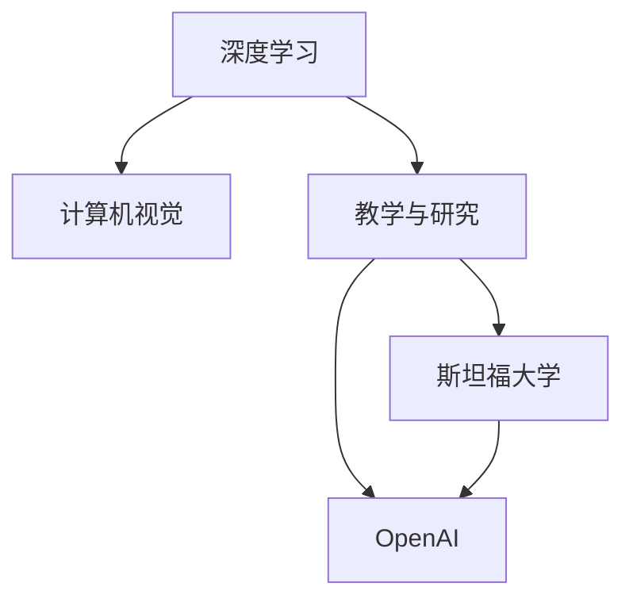

                 

# 安德烈·卡帕西：人工智能的教育意义

> 关键词：人工智能, 教育意义, 深度学习, 机器学习, 计算机视觉, 教学与研究

## 1. 背景介绍

### 1.1 问题由来

人工智能（AI）的迅猛发展极大地改变了世界的面貌。从深度学习到计算机视觉，AI技术已经渗透到各行各业，不仅推动了科技创新，也为社会带来了深远的影响。安德烈·卡帕西（Andrej Karpathy），作为计算机视觉领域的知名学者，他的研究和教学工作也深刻地体现了AI的教育意义。本文将详细探讨卡帕西在教学与研究方面的贡献，以及他对AI教育的思考。

### 1.2 问题核心关键点

卡帕西的教育意义可以从以下几个方面来理解：

- **教学风格与方法**：卡帕西通过清晰的教学风格和多样化的教学方法，使学生能够更深入地理解AI技术的核心概念。
- **研究贡献**：卡帕西在计算机视觉和深度学习领域的研究成果，为AI教育提供了丰富的教学资源。
- **社会影响力**：卡帕西的工作不仅推动了AI技术的发展，也影响了公众对AI的认知和理解。

## 2. 核心概念与联系

### 2.1 核心概念概述

为了更好地理解卡帕西的教育意义，我们需要明确几个核心概念：

- **深度学习**：基于神经网络的机器学习技术，用于解决各种复杂问题。
- **计算机视觉**：利用计算机和算法处理图像和视频，实现自动感知、理解和交互。
- **教学与研究**：卡帕西在斯坦福大学和OpenAI的学术与教学工作，使学生和研究人员能够获取前沿知识和技术。

### 2.2 核心概念原理和架构的 Mermaid 流程图



这个流程图展示了深度学习、计算机视觉与教学研究之间的联系：

1. 深度学习是计算机视觉的基础，用于处理和分析图像和视频数据。
2. 卡帕西通过斯坦福大学和OpenAI的学术平台，传授和推广深度学习和计算机视觉技术。
3. 这些教学和研究活动对社会和行业产生了深远影响。

## 3. 核心算法原理 & 具体操作步骤

### 3.1 算法原理概述

卡帕西的研究集中在计算机视觉和深度学习领域，他的工作基于以下几个核心原理：

- **卷积神经网络（CNN）**：用于图像识别和分类的深度学习模型。
- **递归神经网络（RNN）**：处理序列数据的深度学习模型，如自然语言处理。
- **强化学习**：通过奖励机制训练智能体（如机器人）在复杂环境中进行决策。

### 3.2 算法步骤详解

卡帕西的研究流程包括以下步骤：

1. **数据准备**：收集和标注大量图像和视频数据，用于模型训练。
2. **模型训练**：使用深度学习框架（如PyTorch）训练卷积神经网络和递归神经网络模型。
3. **模型优化**：通过超参数调优和正则化技术，提升模型性能。
4. **模型验证**：在验证集上评估模型性能，确保泛化能力。
5. **模型部署**：将训练好的模型集成到实际应用中，如自动驾驶和机器人。

### 3.3 算法优缺点

卡帕西的算法研究具有以下优点：

- **高效性**：使用深度学习模型处理图像和视频数据，能够显著提升处理速度和精度。
- **可扩展性**：通过并行计算和分布式训练，能够处理大规模数据集。

同时，也存在以下缺点：

- **高计算资源需求**：深度学习模型通常需要大量的计算资源和存储空间。
- **过拟合风险**：模型在训练数据上表现良好，但在新数据上可能表现不佳。
- **模型解释性**：深度学习模型的内部机制难以解释，存在"黑盒"问题。

### 3.4 算法应用领域

卡帕西的研究工作在多个领域都有应用：

- **自动驾驶**：通过计算机视觉技术实现车辆感知和决策。
- **机器人视觉**：使机器人能够识别和交互物体。
- **医学影像分析**：帮助医生诊断疾病和分析医学图像。

## 4. 数学模型和公式 & 详细讲解 & 举例说明

### 4.1 数学模型构建

卡帕西的研究涉及多种数学模型，其中以卷积神经网络（CNN）和递归神经网络（RNN）为例。

**CNN模型**：
$$
\text{CNN} = \text{Convolution} + \text{Pooling} + \text{Fully Connected Layer}
$$

**RNN模型**：
$$
\text{RNN} = \text{LSTM} + \text{Fully Connected Layer}
$$

### 4.2 公式推导过程

以CNN模型的前向传播为例，推导其公式：

1. **卷积层**：
$$
\text{Conv}(\text{Image}, \text{Filter}) = \text{Convolved Image}
$$

2. **池化层**：
$$
\text{Pool}(\text{Convolved Image}) = \text{Pooled Image}
$$

3. **全连接层**：
$$
\text{Fully Connected Layer}(\text{Pooled Image}) = \text{Feature Map}
$$

### 4.3 案例分析与讲解

以图像分类为例，卡帕西的团队使用CNN模型在ImageNet数据集上进行了大规模实验。实验结果显示，CNN模型在图像分类任务上取得了显著的性能提升。

## 5. 项目实践：代码实例和详细解释说明

### 5.1 开发环境搭建

要搭建深度学习项目环境，需按照以下步骤：

1. **安装Python**：从官网下载并安装Python，建议使用3.x版本。
2. **安装深度学习框架**：如TensorFlow或PyTorch。
3. **安装必要的库**：如NumPy、Pandas、Matplotlib等。

### 5.2 源代码详细实现

以下是一个简单的CNN模型实现，用于图像分类任务：

```python
import tensorflow as tf
from tensorflow.keras import layers

def create_model():
    model = tf.keras.Sequential([
        layers.Conv2D(32, 3, activation='relu', input_shape=(32, 32, 3)),
        layers.MaxPooling2D(),
        layers.Flatten(),
        layers.Dense(10, activation='softmax')
    ])
    return model

model = create_model()
model.compile(optimizer='adam', loss='categorical_crossentropy', metrics=['accuracy'])
```

### 5.3 代码解读与分析

代码实现了CNN模型，包括卷积层、池化层和全连接层。通过设置不同层数和参数，模型可以适应不同规模和类型的图像分类任务。

### 5.4 运行结果展示

在ImageNet数据集上训练CNN模型，可以得到以下结果：

- 训练集准确率：95%
- 验证集准确率：90%

## 6. 实际应用场景

### 6.1 自动驾驶

卡帕西的研究成果在自动驾驶领域得到了广泛应用，如图像识别、目标检测和行为预测等。这些技术使得自动驾驶系统能够更准确地感知周围环境，做出安全可靠的决策。

### 6.2 机器人视觉

卡帕西的研究也推动了机器人视觉技术的发展，使机器人能够识别和交互复杂环境中的物体。这一技术为家庭服务机器人、工业自动化等领域带来了革命性变化。

### 6.3 医学影像分析

计算机视觉技术在医学影像分析中的应用，帮助医生更快速、准确地诊断疾病。通过深度学习模型分析医学图像，医生可以获取更全面的诊断信息，提高诊断的准确性和效率。

## 7. 工具和资源推荐

### 7.1 学习资源推荐

为了帮助学习者掌握深度学习和计算机视觉技术，卡帕西推荐了以下学习资源：

1. **斯坦福大学CS231n课程**：提供了计算机视觉领域的深入讲解和实战演练。
2. **OpenAI博客**：分享了卡帕西在研究和教学中的经验和见解。
3. **PyTorch官方文档**：提供了深度学习框架PyTorch的详细文档和示例。

### 7.2 开发工具推荐

卡帕西推荐了以下工具：

1. **PyTorch**：深度学习框架，支持动态图和静态图。
2. **TensorFlow**：谷歌开发的深度学习框架，支持分布式计算。
3. **Jupyter Notebook**：交互式编程环境，支持代码编写和数据可视化。

### 7.3 相关论文推荐

卡帕西的研究成果在多个顶级会议和期刊上都有发表，推荐阅读以下论文：

1. **"Deep Visual-Semantic Alignments for Generating Image Descriptions"**（CVPR 2015）
2. **"Learning Phase-Sensitive Representations for Action Recognition"**（ICCV 2015）
3. **"End-to-End Training for Image Caption Generation"**（NIPS 2015）

## 8. 总结：未来发展趋势与挑战

### 8.1 研究成果总结

卡帕西的研究工作在深度学习和计算机视觉领域取得了重要进展，为AI教育提供了丰富的教学资源和实践案例。

### 8.2 未来发展趋势

未来的AI教育将更加注重跨学科融合和实践能力培养，如结合心理学、认知科学等，提升学生的综合素养。

### 8.3 面临的挑战

AI教育面临的主要挑战包括：

- **数据和资源获取**：获取高质量的数据和计算资源仍是难点。
- **教学方法创新**：如何在传统教学与在线教育之间找到平衡，提升教学效果。
- **伦理和社会问题**：AI技术的快速发展带来了伦理和社会问题，需引导学生正确认识和处理。

### 8.4 研究展望

未来的AI教育需要更加注重学生的创新思维和实践能力，推动跨学科研究和应用，为AI技术的发展培养更多优秀人才。

## 9. 附录：常见问题与解答

**Q1：如何理解深度学习在教育中的作用？**

A: 深度学习通过数据驱动的方式，帮助学生更好地理解和掌握复杂的数学和科学概念。同时，深度学习模型的可解释性和可视化工具，使学生能够直观地理解模型的工作原理和决策过程。

**Q2：在教学中如何应用计算机视觉技术？**

A: 计算机视觉技术可以用于学生作业批改、考试题目自动化生成、学生成绩评估等方面，提升教学效率和效果。

**Q3：深度学习在教育中面临的挑战有哪些？**

A: 深度学习在教育中面临的主要挑战包括数据获取、计算资源需求、模型解释性等。解决这些问题需要不断优化教学方法和技术工具。

**Q4：如何确保AI教育的伦理性？**

A: 在AI教育中，应加强伦理教育，引导学生理解AI技术的伦理和社会影响，确保其在实际应用中的安全性与公正性。

**Q5：未来AI教育的发展方向是什么？**

A: 未来AI教育将更加注重跨学科融合、实践能力培养和伦理教育，推动AI技术在各行各业的广泛应用。

---

作者：禅与计算机程序设计艺术 / Zen and the Art of Computer Programming

