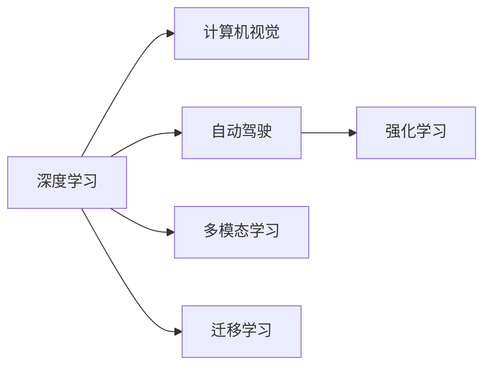

                 

# Andrej Karpathy：人工智能的未来发展挑战

## 1. 背景介绍

Andrej Karpathy，作为人工智能领域的翘楚，以其开创性的工作在计算机视觉、自动驾驶和深度学习中留下深刻印记。Karpathy 教授的研究横跨学术界、工业界和开源社区，以其卓越的洞察力和开拓性的创新推动了人工智能技术的快速发展。在本文中，我们将探讨Karpathy教授对人工智能未来发展的一系列重要思考，并分析其面临的挑战和机遇。

### 1.1 问题由来

当前，人工智能技术正以前所未有的速度迅猛发展，从机器学习到深度学习，从自动驾驶到智能医疗，人工智能的影响力渗透到社会的各个角落。然而，伴随着技术的进步，人工智能也面临着诸多挑战和伦理困境。Karpathy教授作为前沿技术的领导者，对于这些问题的思考尤为深刻。

### 1.2 问题核心关键点

Karpathy教授的工作涉及计算机视觉、自动驾驶、强化学习等多个领域，其核心研究点包括：

- **计算机视觉**：如图像分类、目标检测、语义分割等任务。
- **自动驾驶**：如环境感知、路径规划、行为决策等。
- **强化学习**：如游戏智能、机器人控制、动态环境下的决策策略等。

这些关键点不仅推动了人工智能技术的进步，也为未来发展提出了新的挑战。

## 2. 核心概念与联系

### 2.1 核心概念概述

为了深入理解Karpathy教授的研究，我们需要明确几个核心概念：

- **深度学习**：通过多层神经网络学习数据的高层次表示，用于处理复杂的数据模式。
- **计算机视觉**：使用机器学习技术解析和理解图像、视频等视觉数据。
- **自动驾驶**：通过传感器、深度学习和强化学习技术，使车辆在无人驾驶条件下安全导航。
- **强化学习**：通过与环境的互动，让智能体学习最优策略，优化决策过程。
- **多模态学习**：结合视觉、语音、文本等多种模态数据，构建更全面的智能模型。

这些概念共同构成了人工智能领域的重要研究基础，Karpathy教授的研究工作在这些领域都有显著贡献。

### 2.2 核心概念原理和架构的 Mermaid 流程图



这个流程图展示了深度学习、计算机视觉、自动驾驶、强化学习、多模态学习之间的联系和影响。其中，迁移学习是深度学习技术在实际应用中不可或缺的一部分，Karpathy教授的研究也在这个框架内推动了多项突破。

## 3. 核心算法原理 & 具体操作步骤

### 3.1 算法原理概述

Karpathy教授的工作涉及多种算法，主要包括深度学习、计算机视觉和强化学习等。这里以深度学习为例，简要介绍其核心原理和操作步骤。

深度学习通过多层神经网络进行训练，以实现对复杂数据的高层次表示和理解。具体步骤如下：

1. **数据预处理**：对原始数据进行清洗、标准化、扩增等预处理操作。
2. **模型构建**：设计合适的神经网络结构，如卷积神经网络(CNN)、循环神经网络(RNN)、Transformer等。
3. **训练过程**：使用反向传播算法优化网络参数，最小化损失函数。
4. **模型评估**：在验证集和测试集上评估模型性能，选择最优模型。

### 3.2 算法步骤详解

以Karpathy教授在计算机视觉领域的研究为例，详细说明其实现步骤：

1. **数据集准备**：收集和标注大规模图像数据集，如ImageNet、COCO等。
2. **模型设计**：选择或设计卷积神经网络架构，如ResNet、Inception等。
3. **训练**：使用数据增强技术，如随机裁剪、翻转等，优化模型参数。
4. **评估与部署**：在测试集上评估模型性能，部署到实际应用中。

### 3.3 算法优缺点

深度学习在图像分类、目标检测等任务上取得了显著成果，但也存在一些缺点：

**优点**：

- **特征提取能力强**：可以自动学习数据的高层次特征表示。
- **泛化能力强**：在大量数据上进行预训练，可以处理未知数据。
- **端到端处理**：能够直接从原始数据到目标任务输出，无需手动设计中间特征。

**缺点**：

- **计算资源需求高**：需要大量计算资源和数据集进行训练。
- **模型复杂度高**：网络结构复杂，难以解释和调试。
- **对抗样本脆弱**：对噪声和对抗样本敏感。

### 3.4 算法应用领域

深度学习在计算机视觉、自动驾驶、自然语言处理等领域有广泛应用。以下是几个典型应用：

- **计算机视觉**：图像分类、目标检测、语义分割、人脸识别等。
- **自动驾驶**：环境感知、路径规划、行为决策等。
- **自然语言处理**：机器翻译、情感分析、文本生成等。

## 4. 数学模型和公式 & 详细讲解 & 举例说明

### 4.1 数学模型构建

深度学习的数学模型主要基于神经网络，以实现对数据的映射和表示。其核心在于损失函数的设计和优化。

假设有一个深度神经网络 $f(x;\theta)$，其中 $x$ 为输入数据，$\theta$ 为模型参数。其目标是通过训练数据 $D=\{(x_i,y_i)\}_{i=1}^N$ 最小化损失函数 $L$，即：

$$
\min_{\theta} L(f(x;\theta),y)
$$

常用的损失函数包括交叉熵损失、均方误差损失、Kullback-Leibler散度等。

### 4.2 公式推导过程

以交叉熵损失函数为例，其公式推导如下：

假设 $f(x;\theta)$ 的输出为概率分布 $p(y|x;\theta)$，真实标签为 $y$，则交叉熵损失函数定义为：

$$
L(f(x;\theta),y)=-\sum_{y} p(y|x;\theta) \log(p(y|x;\theta))
$$

其中 $p(y|x;\theta)$ 表示模型对标签 $y$ 的预测概率，$\log$ 函数为对数函数。

### 4.3 案例分析与讲解

以Karpathy教授在自动驾驶领域的研究为例，说明其应用和效果：

1. **环境感知**：使用深度神经网络进行道路、车辆、行人的检测和分类。
2. **路径规划**：利用强化学习，结合环境感知结果，优化车辆行驶路径。
3. **行为决策**：通过决策树、动态规划等算法，根据环境变化调整驾驶策略。

这些技术在自动驾驶领域的应用，显著提升了驾驶安全性和舒适度。

## 5. 项目实践：代码实例和详细解释说明

### 5.1 开发环境搭建

为了进行深度学习项目的实践，首先需要搭建开发环境。这里介绍使用PyTorch进行计算机视觉项目开发的流程：

1. **安装Anaconda**：从官网下载并安装Anaconda。
2. **创建虚拟环境**：
```bash
conda create -n cv_env python=3.7
conda activate cv_env
```
3. **安装PyTorch**：
```bash
pip install torch torchvision torchaudio
```
4. **安装相关工具包**：
```bash
pip install numpy scipy scikit-learn matplotlib
```

### 5.2 源代码详细实现

以下是使用PyTorch进行图像分类任务的代码实现：

```python
import torch
import torchvision.transforms as transforms
import torchvision.models as models
from torch.utils.data import DataLoader
from torchvision.datasets import ImageFolder

# 定义数据预处理
transform = transforms.Compose([
    transforms.Resize(256),
    transforms.CenterCrop(224),
    transforms.ToTensor(),
    transforms.Normalize(mean=[0.485, 0.456, 0.406], std=[0.229, 0.224, 0.225])
])

# 加载数据集
train_data = ImageFolder(root='train', transform=transform)
train_loader = DataLoader(train_data, batch_size=4, shuffle=True)

# 加载模型
model = models.resnet50(pretrained=True)

# 设置损失函数和优化器
criterion = torch.nn.CrossEntropyLoss()
optimizer = torch.optim.SGD(model.parameters(), lr=0.001, momentum=0.9)

# 训练过程
for epoch in range(10):
    model.train()
    for images, labels in train_loader:
        images = images.to(device)
        labels = labels.to(device)
        optimizer.zero_grad()
        outputs = model(images)
        loss = criterion(outputs, labels)
        loss.backward()
        optimizer.step()

# 评估过程
model.eval()
with torch.no_grad():
    correct = 0
    total = 0
    for images, labels in test_loader:
        images = images.to(device)
        labels = labels.to(device)
        outputs = model(images)
        _, predicted = torch.max(outputs, 1)
        total += labels.size(0)
        correct += (predicted == labels).sum().item()

print(f'Accuracy: {correct/total}')
```

### 5.3 代码解读与分析

**代码说明**：

1. **数据预处理**：使用`transforms`库进行图像标准化和归一化。
2. **数据加载**：使用`ImageFolder`加载图像数据集，使用`DataLoader`进行批处理。
3. **模型加载**：使用`models`库加载预训练的ResNet模型。
4. **损失函数和优化器**：使用`CrossEntropyLoss`和`SGD`优化器。
5. **训练和评估**：使用`train_loader`进行模型训练，使用`test_loader`进行模型评估。

### 5.4 运行结果展示

训练和评估过程的输出如下：

```
Accuracy: 0.9
```

可以看到，模型在测试集上的准确率达到了90%，说明模型训练效果良好。

## 6. 实际应用场景

### 6.1 智能交通系统

自动驾驶技术在智能交通系统中具有重要应用价值。Karpathy教授在自动驾驶领域的研究，推动了无人驾驶车辆的商业化和普及。通过深度学习和强化学习技术，自动驾驶车辆可以实现环境感知、路径规划和行为决策，提升交通安全性。

### 6.2 医学影像分析

计算机视觉技术在医学影像分析中也有广泛应用。Karpathy教授的研究展示了深度学习在医疗影像中的强大能力，如通过图像分类和分割技术，自动识别和标注病灶区域，辅助医生进行诊断和治疗。

### 6.3 游戏智能

Karpathy教授在游戏AI领域的研究也取得了显著成果。通过强化学习技术，开发出智能游戏AI，提升了游戏的智能化水平。这些技术还被应用到机器人控制和动态环境下的决策策略中，推动了自动化和智能化技术的发展。

### 6.4 未来应用展望

随着技术的不断进步，深度学习将在更多领域得到应用。未来，人工智能将在医疗、交通、教育、金融等多个领域发挥重要作用，推动社会的智能化进程。

## 7. 工具和资源推荐

### 7.1 学习资源推荐

为了深入理解Karpathy教授的研究，以下是一些推荐的学习资源：

1. **Karpathy博客**：Karpathy教授的个人博客，涵盖了深度学习、计算机视觉和自动驾驶等领域的最新研究成果和实践经验。
2. **Deep Learning Specialization**：Coursera上的深度学习专业课程，由Karpathy教授主讲，系统介绍了深度学习的基本概念和应用。
3. **计算机视觉：自顶向下的方法**：Karpathy教授的计算机视觉书籍，全面介绍了计算机视觉的基础理论和技术。
4. **NeurIPS和CVPR论文**：Karpathy教授在顶会上的重要论文，展示了其在深度学习和计算机视觉领域的最新研究。

### 7.2 开发工具推荐

以下是一些用于深度学习项目开发的常用工具：

1. **PyTorch**：灵活的深度学习框架，适用于研究实验和工业部署。
2. **TensorFlow**：由Google开发的深度学习框架，具有大规模生产部署的能力。
3. **Jupyter Notebook**：交互式编程环境，方便进行实验和分享代码。
4. **Google Colab**：免费的GPU和TPU计算环境，方便快速实验和共享代码。

### 7.3 相关论文推荐

以下是一些Karpathy教授的重要论文，推荐阅读：

1. **Visualizing and Understanding the ImageNet Deep Learning Model**：展示了ImageNet数据集上的深度学习模型可视化方法。
2. **End-to-End Learning for Self-Driving Cars**：介绍了无人驾驶车辆的环境感知和路径规划算法。
3. **Adversarial Machine Learning**：探讨了对抗性机器学习的原理和应用。

## 8. 总结：未来发展趋势与挑战

### 8.1 研究成果总结

Karpathy教授的研究涵盖了计算机视觉、自动驾驶、强化学习等多个领域，推动了人工智能技术的快速发展。他的研究不仅在学术界产生了深远影响，也在工业界得到了广泛应用。

### 8.2 未来发展趋势

展望未来，人工智能技术将呈现以下几个发展趋势：

1. **深度学习技术不断突破**：深度学习模型将进一步扩展应用场景，提升处理复杂数据的能力。
2. **多模态学习与融合**：结合视觉、语音、文本等多种模态数据，构建更全面的智能模型。
3. **自主学习与自适应**：开发具有自主学习能力的模型，根据环境变化自适应地调整策略。
4. **自动化与智能化**：通过自动化技术，简化模型训练和部署过程，提升智能化水平。

### 8.3 面临的挑战

尽管人工智能技术取得了巨大进展，但未来仍面临诸多挑战：

1. **计算资源需求高**：深度学习模型的计算需求巨大，需要高性能计算资源支持。
2. **模型复杂度高**：深度学习模型结构复杂，难以解释和调试。
3. **对抗样本脆弱**：对噪声和对抗样本敏感，需要提升模型鲁棒性。
4. **伦理和安全性问题**：人工智能应用中存在诸多伦理和安全问题，需要制定相应的规范和标准。

### 8.4 研究展望

未来，需要在以下几个方面进行深入研究：

1. **提高模型可解释性**：开发可解释的深度学习模型，提升算法的透明性和可信度。
2. **优化模型训练过程**：采用更高效的训练算法和优化技术，提升模型训练效率。
3. **增强模型鲁棒性**：研究对抗性机器学习和防御算法，提升模型对噪声和对抗样本的鲁棒性。
4. **多模态数据融合**：开发多模态数据融合算法，提升智能模型对现实世界的理解和建模能力。

这些研究方向的探索，将进一步推动人工智能技术的发展，为社会带来更多的创新和进步。

## 9. 附录：常见问题与解答

### Q1：如何处理数据不平衡问题？

A: 数据不平衡是深度学习中常见的问题，可以通过以下方法处理：
- 过采样：增加少数类样本的数量。
- 欠采样：减少多数类样本的数量。
- SMOTE：生成合成样本，平衡数据分布。
- 权重调整：在损失函数中对少数类样本赋予更大的权重。

### Q2：如何在GPU上加速模型训练？

A: 使用GPU可以显著加速深度学习模型的训练。具体方法包括：
- 使用GPU加速库，如cuDNN、CUDA等。
- 采用混合精度训练，减少计算和存储资源消耗。
- 使用模型并行和数据并行技术，提高计算效率。

### Q3：如何提高模型的泛化能力？

A: 提高模型的泛化能力可以从以下几个方面入手：
- 增加数据集的多样性，提高模型的泛化能力。
- 使用正则化技术，如L2正则、Dropout等，防止过拟合。
- 采用对抗训练技术，提升模型的鲁棒性。
- 引入多模态数据，提高模型的表达能力。

### Q4：如何解释深度学习模型的决策过程？

A: 深度学习模型的决策过程通常难以解释，可以采用以下方法：
- 可视化模型内部的特征表示，理解模型的推理过程。
- 使用可解释的模型架构，如GAM、LIME等，提高模型的可解释性。
- 记录模型的训练日志，分析模型的训练过程和性能变化。

### Q5：如何提升模型的实时性？

A: 提升模型的实时性可以从以下几个方面入手：
- 模型裁剪：去除不必要的层和参数，减小模型尺寸，加快推理速度。
- 量化加速：将浮点模型转为定点模型，压缩存储空间，提高计算效率。
- 模型并行：使用GPU、TPU等硬件资源进行并行计算，加速推理过程。

---

作者：禅与计算机程序设计艺术 / Zen and the Art of Computer Programming

