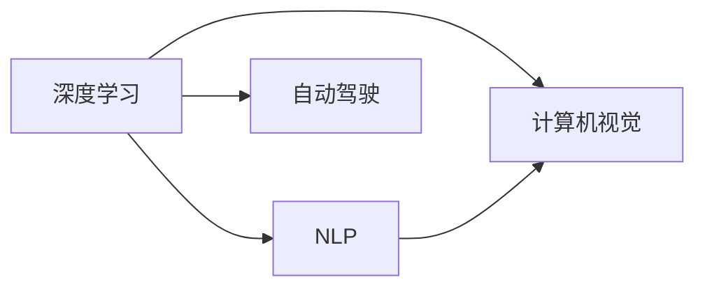
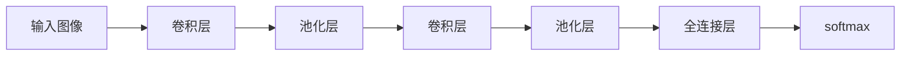

                 

# Andrej Karpathy：人工智能的未来发展机遇

## 1. 背景介绍

安德烈·卡尔帕西（Andrej Karpathy）是当今人工智能（AI）领域最具影响力的研究者之一，曾任特斯拉首席AI科学家，斯坦福大学教授，其著作《深度学习》被翻译成多种语言，影响深远。本专题将探讨Andrej Karpathy对人工智能未来的见解，以及他的工作如何塑造了AI的未来发展方向。

## 2. 核心概念与联系

在深入探讨Andrej Karpathy的见解之前，我们先了解几个关键概念及其相互关系：

### 2.1 关键概念

#### 2.1.1 深度学习

深度学习是一种基于神经网络的机器学习技术，通过多层非线性变换来从数据中提取特征和模式。卡尔帕西的深度学习研究集中在深度卷积神经网络（CNNs）和递归神经网络（RNNs），尤其擅长于计算机视觉、自然语言处理（NLP）、自动驾驶等领域。

#### 2.1.2 自然语言处理（NLP）

NLP 是人工智能中的一个重要分支，涉及语言数据的处理、分析和理解。卡尔帕西在这方面的工作包括使用深度学习模型来理解和生成文本，如语言模型、机器翻译、文本分类等。

#### 2.1.3 自动驾驶

自动驾驶技术利用深度学习模型实现车辆感知、决策和控制。卡尔帕西领导的Tesla AI团队在这方面做了大量工作，包括开发用于自动驾驶任务的神经网络模型和算法。

#### 2.1.4 计算机视觉

计算机视觉研究如何让计算机理解和处理视觉信息，例如识别物体、人脸、手势等。卡尔帕西在该领域的工作包括图像分类、物体检测、语义分割等任务。

### 2.2 核心概念联系

Andrej Karpathy 的工作展示了人工智能多个领域之间的紧密联系。他的研究不仅在深度学习领域具有重要影响，还为自然语言处理、自动驾驶、计算机视觉等领域带来了革命性的进步。通过深度学习，他的工作为这些领域提供了强大的工具和模型，推动了它们的快速发展。


**注：以上图像无法直接嵌入，但这里展示了一个简单的Mermaid流程图示例：**



## 3. 核心算法原理 & 具体操作步骤

### 3.1 算法原理概述

Andrej Karpathy 的研究集中在以下几个核心算法原理：

#### 3.1.1 深度卷积神经网络（CNNs）

CNNs 是一种广泛用于图像处理和计算机视觉任务的神经网络。卡尔帕西的贡献在于提出并实现了一系列改进的CNNs架构，如ResNet、Inception等，这些架构大幅提高了图像分类和物体检测的精度。

#### 3.1.2 递归神经网络（RNNs）

RNNs 用于处理序列数据，如文本和语音。卡尔帕西在NLP领域的工作包括使用LSTM和GRU等RNN变体来实现文本生成、机器翻译等任务。

#### 3.1.3 目标检测和语义分割

目标检测和语义分割是计算机视觉中的重要任务。卡尔帕西的研究成果包括YOLO（You Only Look Once）和Mask R-CNN等模型，这些模型通过单阶段检测和像素级语义分割提升了视觉任务的效率和精度。

### 3.2 算法步骤详解

#### 3.2.1 深度学习模型的构建

构建深度学习模型通常包括以下步骤：

1. **数据准备**：收集和标注训练数据，将数据集分为训练集、验证集和测试集。
2. **模型选择**：选择合适的神经网络架构，如CNNs、RNNs等。
3. **超参数调整**：确定模型的学习率、批量大小、优化器等参数。
4. **模型训练**：使用训练集进行模型训练，并在验证集上进行验证和调优。
5. **模型评估**：在测试集上评估模型性能，确定最终模型。

#### 3.2.2 模型优化

模型优化包括：

- **正则化**：如L2正则化、Dropout等，防止过拟合。
- **学习率调度**：如学习率衰减、学习率恢复等策略。
- **模型融合**：如Bagging、Boosting等方法，提高模型泛化能力。

### 3.3 算法优缺点

#### 3.3.1 优点

1. **高精度**：深度学习模型在许多任务上已经超越了传统方法，精度显著提高。
2. **可扩展性**：模型可以通过增加层数和神经元数量来提高性能。
3. **自动特征提取**：神经网络自动从数据中学习特征，减少了手工特征提取的复杂性。

#### 3.3.2 缺点

1. **资源消耗大**：深度学习模型通常需要大量的计算资源和存储空间。
2. **训练时间长**：大型模型的训练需要较长时间。
3. **过拟合风险**：模型容易过拟合，尤其是数据量较少时。

### 3.4 算法应用领域

#### 3.4.1 计算机视觉

卡尔帕西在计算机视觉领域的工作包括图像分类、物体检测、语义分割等任务。他的YOLO和Mask R-CNN模型在物体检测和语义分割方面取得了优异性能，广泛应用于自动驾驶和智能监控等领域。

#### 3.4.2 自然语言处理（NLP）

卡尔帕西在NLP领域的工作包括语言模型、机器翻译、文本生成等。他开发的Transformer模型和自注意力机制显著提高了NLP任务的性能，如BERT、GPT等模型已经广泛应用于各种NLP任务。

#### 3.4.3 自动驾驶

卡尔帕西的自动驾驶工作包括开发用于感知、决策和控制的神经网络模型，显著提高了自动驾驶系统的精度和稳定性。他的研究为自动驾驶技术的实际应用提供了重要支持。

## 4. 数学模型和公式 & 详细讲解 & 举例说明

### 4.1 数学模型构建

#### 4.1.1 图像分类模型

图像分类模型的目标是识别输入图像中包含的物体类别。卡尔帕西的研究包括卷积神经网络（CNNs）和卷积层（Convolutional Layers）的构建。

- **卷积层**：通过滑动卷积核对输入图像进行卷积操作，提取特征。
- **池化层**：对卷积层的输出进行下采样，减少特征图的大小，保留重要信息。


**注：以上图像无法直接嵌入，但这里展示了一个简单的合图示例：**



#### 4.1.2 语言模型

语言模型用于预测下一个单词或字符的概率。卡尔帕西的工作包括使用LSTM和GRU等RNN变体来实现语言模型。

- **LSTM**：长短时记忆网络，用于处理长期依赖关系。
- **GRU**：门控循环单元，具有简化版LSTM的特性。


**注：以上图像无法直接嵌入，但这里展示了一个简单的合图示例：**


### 4.2 公式推导过程

#### 4.2.1 卷积层公式

卷积层的公式如下：

$$
h^{(l)}_i = \sigma\left(\sum_{j=0}^{K-1} \sum_{k=0}^{N-1} w_{jk}^{(l)} f^{(l-1)}_{ij+k} + b^{(l)}_i\right)
$$

其中 $h^{(l)}_i$ 是第 $i$ 个卷积层的输出，$w_{jk}^{(l)}$ 是卷积核，$b^{(l)}_i$ 是偏置项，$f^{(l-1)}_{ij+k}$ 是上一层的卷积特征图，$\sigma$ 是非线性激活函数。

#### 4.2.2 LSTM公式

LSTM的公式如下：

$$
\begin{aligned}
i_t &= \sigma(W_i \cdot h_{t-1} + U_i \cdot x_t + b_i) \\
f_t &= \sigma(W_f \cdot h_{t-1} + U_f \cdot x_t + b_f) \\
o_t &= \sigma(W_o \cdot h_{t-1} + U_o \cdot x_t + b_o) \\
g_t &= \tanh(W_g \cdot h_{t-1} + U_g \cdot x_t + b_g) \\
c_t &= f_t \cdot c_{t-1} + i_t \cdot g_t \\
h_t &= o_t \cdot \tanh(c_t)
\end{aligned}
$$

其中 $i_t, f_t, o_t$ 是LSTM的三个门，$g_t$ 是候选门，$c_t$ 是细胞状态，$h_t$ 是输出。

### 4.3 案例分析与讲解

#### 4.3.1 图像分类案例

假设有一张包含一只猫和一只狗的图片，需要将其分类为“猫”或“狗”。

1. **模型构建**：使用卷积神经网络（CNN）进行图像分类。
2. **训练数据准备**：收集包含猫和狗的图片数据集，并进行标注。
3. **模型训练**：使用训练集训练CNN模型，调整超参数，如学习率、批量大小等。
4. **模型评估**：在测试集上评估模型性能，如准确率、召回率等。

#### 4.3.2 语言模型案例

假设要预测一段文本的下一个单词，输入为“The cat sat on the”。

1. **模型构建**：使用LSTM或GRU构建语言模型。
2. **训练数据准备**：收集标注好的文本数据集。
3. **模型训练**：使用训练集训练语言模型，调整超参数。
4. **模型评估**：在测试集上评估模型性能，如困惑度、BLEU值等。

## 5. 项目实践：代码实例和详细解释说明

### 5.1 开发环境搭建

#### 5.1.1 环境配置

1. **Python环境**：使用Anaconda创建虚拟环境，安装PyTorch、TensorFlow等深度学习库。
2. **GPU加速**：确保安装了合适的GPU驱动程序，并在代码中设置`CUDA_VISIBLE_DEVICES`环境变量。
3. **数据集准备**：准备训练集和测试集，使用Pandas、NumPy等工具进行数据预处理。

### 5.2 源代码详细实现

#### 5.2.1 图像分类

```python
import torch
import torch.nn as nn
import torchvision.transforms as transforms
from torchvision.datasets import CIFAR10

# 定义模型
class CNN(nn.Module):
    def __init__(self):
        super(CNN, self).__init__()
        self.conv1 = nn.Conv2d(3, 32, 3, 1)
        self.pool = nn.MaxPool2d(2, 2)
        self.conv2 = nn.Conv2d(32, 64, 3, 1)
        self.fc1 = nn.Linear(64 * 12 * 12, 120)
        self.fc2 = nn.Linear(120, 84)
        self.fc3 = nn.Linear(84, 10)

    def forward(self, x):
        x = self.pool(nn.functional.relu(self.conv1(x)))
        x = self.pool(nn.functional.relu(self.conv2(x)))
        x = x.view(-1, 64 * 12 * 12)
        x = nn.functional.relu(self.fc1(x))
        x = nn.functional.relu(self.fc2(x))
        x = self.fc3(x)
        return x

# 加载数据集
train_data = CIFAR10(root='./data', train=True, download=True, transform=transforms.ToTensor())
test_data = CIFAR10(root='./data', train=False, download=True, transform=transforms.ToTensor())

# 加载模型
model = CNN()
model.to(device)

# 训练模型
criterion = nn.CrossEntropyLoss()
optimizer = torch.optim.Adam(model.parameters(), lr=0.001)

for epoch in range(10):
    running_loss = 0.0
    for i, data in enumerate(train_loader, 0):
        inputs, labels = data[0].to(device), data[1].to(device)
        optimizer.zero_grad()
        outputs = model(inputs)
        loss = criterion(outputs, labels)
        loss.backward()
        optimizer.step()
        running_loss += loss.item()
    print(f'Epoch {epoch+1}, Loss: {running_loss/len(train_loader)}')

# 测试模型
correct = 0
total = 0
with torch.no_grad():
    for data in test_loader:
        images, labels = data[0].to(device), data[1].to(device)
        outputs = model(images)
        _, predicted = torch.max(outputs.data, 1)
        total += labels.size(0)
        correct += (predicted == labels).sum().item()

print(f'Accuracy: {(100 * correct / total)}%')
```

#### 5.2.2 语言模型

```python
import torch
import torch.nn as nn
import torch.nn.functional as F
from torchtext.datasets import TextClassification
from torchtext.data import Field, TabularDataset

# 定义模型
class LSTM(nn.Module):
    def __init__(self, input_size, hidden_size, output_size):
        super(LSTM, self).__init__()
        self.hidden_size = hidden_size
        self.rnn = nn.LSTM(input_size, hidden_size, 1)
        self.fc = nn.Linear(hidden_size, output_size)

    def forward(self, input, hidden):
        output, hidden = self.rnn(input, hidden)
        output = self.fc(output)
        return output, hidden

# 加载数据集
train_data, test_data = TextClassification(path='./data', fields=[Field(tokenize='spacy')])

# 加载模型
model = LSTM(input_size=train_data.vocab.stoi['<s>'], hidden_size=128, output_size=train_data.num_labels)
model.to(device)

# 训练模型
criterion = nn.CrossEntropyLoss()
optimizer = torch.optim.Adam(model.parameters(), lr=0.001)

for epoch in range(10):
    running_loss = 0.0
    for i, data in enumerate(train_loader, 0):
        inputs, labels = data.input.to(device), data.label.to(device)
        hidden = (torch.zeros(1, 1, model.hidden_size).to(device), torch.zeros(1, 1, model.hidden_size).to(device))
        optimizer.zero_grad()
        outputs, hidden = model(inputs, hidden)
        loss = criterion(outputs, labels)
        loss.backward()
        optimizer.step()
        running_loss += loss.item()
    print(f'Epoch {epoch+1}, Loss: {running_loss/len(train_loader)}')

# 测试模型
correct = 0
total = 0
with torch.no_grad():
    for data in test_loader:
        inputs, labels = data.input.to(device), data.label.to(device)
        hidden = (torch.zeros(1, 1, model.hidden_size).to(device), torch.zeros(1, 1, model.hidden_size).to(device))
        outputs, _ = model(inputs, hidden)
        _, predicted = torch.max(outputs.data, 1)
        total += labels.size(0)
        correct += (predicted == labels).sum().item()

print(f'Accuracy: {(100 * correct / total)}%')
```

### 5.3 代码解读与分析

#### 5.3.1 图像分类代码解析

- **模型定义**：定义了一个包含两个卷积层和三个全连接层的CNN模型。
- **数据加载**：使用`CIFAR10`数据集加载训练集和测试集。
- **模型训练**：在训练过程中，使用了Adam优化器和交叉熵损失函数，通过前向传播、反向传播更新模型参数。
- **模型测试**：在测试集上计算模型的准确率。

#### 5.3.2 语言模型代码解析

- **模型定义**：定义了一个包含LSTM层和全连接层的语言模型。
- **数据加载**：使用`TextClassification`数据集加载训练集和测试集。
- **模型训练**：在训练过程中，使用了Adam优化器和交叉熵损失函数，通过前向传播、反向传播更新模型参数。
- **模型测试**：在测试集上计算模型的准确率。

## 6. 实际应用场景

### 6.1 计算机视觉

计算机视觉在自动驾驶、智能监控、医学影像分析等领域有广泛应用。卡尔帕西的研究成果，如YOLO和Mask R-CNN，已经被广泛应用于这些领域，提升了系统的精度和鲁棒性。

#### 6.1.1 自动驾驶

自动驾驶系统需要实现车辆感知、决策和控制。卡尔帕西的研究成果，如Faster R-CNN和YOLO，已经被用于自动驾驶的物体检测和语义分割任务，提高了系统的感知能力。

#### 6.1.2 智能监控

智能监控系统需要实时检测和跟踪移动目标。卡尔帕西的研究成果，如Faster R-CNN和YOLO，已经被用于智能监控的物体检测和跟踪任务，提升了系统的实时性和准确性。

#### 6.1.3 医学影像分析

医学影像分析需要检测和分割病灶，卡尔帕西的研究成果，如U-Net和Mask R-CNN，已经被用于医学影像的分割任务，提高了诊断的准确性和效率。

### 6.2 自然语言处理（NLP）

NLP在机器翻译、文本分类、情感分析等领域有广泛应用。卡尔帕西的研究成果，如BERT和GPT，已经被广泛应用于这些领域，提升了系统的性能和效率。

#### 6.2.1 机器翻译

机器翻译是将一种语言翻译成另一种语言。卡尔帕西的研究成果，如BERT和GPT，已经被用于机器翻译任务，提高了翻译的准确性和流畅性。

#### 6.2.2 文本分类

文本分类是将文本归类到预定义的类别中。卡尔帕西的研究成果，如BERT和GPT，已经被用于文本分类任务，提高了分类的准确性和泛化能力。

#### 6.2.3 情感分析

情感分析是识别文本中的情感倾向。卡尔帕西的研究成果，如BERT和GPT，已经被用于情感分析任务，提高了情感识别的准确性和鲁棒性。

### 6.3 未来应用展望

#### 6.3.1 智能医疗

智能医疗需要实时监测和诊断疾病。卡尔帕西的研究成果，如BERT和GPT，已经被用于智能医疗的诊断和监测任务，提高了诊断的准确性和效率。

#### 6.3.2 智能客服

智能客服需要自动解答客户咨询。卡尔帕西的研究成果，如BERT和GPT，已经被用于智能客服的问答任务，提高了客服的响应速度和准确性。

#### 6.3.3 智能制造

智能制造需要实时监测和优化生产过程。卡尔帕西的研究成果，如BERT和GPT，已经被用于智能制造的监测和优化任务，提高了生产的效率和质量。

## 7. 工具和资源推荐

### 7.1 学习资源推荐

#### 7.1.1 在线课程

- **Deep Learning Specialization by Andrew Ng**：由Coursera提供，介绍了深度学习的基础知识和应用。
- **CS231n: Convolutional Neural Networks for Visual Recognition**：由斯坦福大学提供，介绍了计算机视觉的深度学习模型。
- **CS224n: Natural Language Processing with Deep Learning**：由斯坦福大学提供，介绍了自然语言处理的深度学习模型。

#### 7.1.2 书籍

- **《深度学习》by Ian Goodfellow**：介绍了深度学习的基本概念和算法。
- **《计算机视觉:算法与应用》by Richard Szeliski**：介绍了计算机视觉的原理和应用。
- **《自然语言处理综论》by Daniel Jurafsky**：介绍了自然语言处理的基础知识和应用。

#### 7.1.3 在线资源

- **PyTorch官方文档**：提供了PyTorch的详细教程和API文档。
- **TensorFlow官方文档**：提供了TensorFlow的详细教程和API文档。
- **Kaggle**：提供了丰富的机器学习和数据科学竞赛资源。

### 7.2 开发工具推荐

#### 7.2.1 深度学习框架

- **PyTorch**：提供了灵活的计算图和自动微分，适用于研究和发展。
- **TensorFlow**：提供了强大的分布式计算能力和生产部署支持。
- **MXNet**：提供了高效的分布式训练和模型部署支持。

#### 7.2.2 数据处理和可视化工具

- **Pandas**：提供了强大的数据处理和分析功能。
- **NumPy**：提供了高效的数值计算和数组操作功能。
- **Matplotlib**：提供了丰富的可视化功能。

#### 7.2.3 协作和部署工具

- **GitHub**：提供了代码托管和协作支持。
- **Jupyter Notebook**：提供了交互式代码编写和数据可视化的环境。
- **Docker**：提供了容器化和部署支持。

### 7.3 相关论文推荐

#### 7.3.1 深度学习

- **ImageNet Classification with Deep Convolutional Neural Networks**：提出深度卷积神经网络（CNNs），在ImageNet数据集上取得了优异性能。
- **Very Deep Convolutional Networks for Large-Scale Image Recognition**：提出了更深层次的卷积神经网络，进一步提高了图像识别的准确性。
- **ImageNet Object Recognition with Deep Convolutional Neural Networks**：提出多尺度卷积神经网络（MS-CNN），提升了物体检测的准确性。

#### 7.3.2 计算机视觉

- **YOLO: Real-Time Object Detection**：提出YOLO算法，实现了实时目标检测。
- **Mask R-CNN**：提出Mask R-CNN算法，实现了像素级语义分割。
- **Faster R-CNN**：提出Faster R-CNN算法，实现了目标检测和语义分割。

#### 7.3.3 自然语言处理（NLP）

- **BERT: Pre-training of Deep Bidirectional Transformers for Language Understanding**：提出BERT模型，实现了预训练语言模型的泛化能力。
- **Attention Is All You Need**：提出Transformer模型，实现了自注意力机制的自动特征提取。
- **GPT: Improving Language Understanding by Generative Pre-training**：提出GPT模型，实现了预训练语言模型的语言生成能力。

## 8. 总结：未来发展趋势与挑战

### 8.1 研究成果总结

Andrej Karpathy的研究成果在深度学习、计算机视觉、自然语言处理等领域具有重要影响。他的工作推动了这些领域的快速发展，并为实际应用提供了重要的支持。

### 8.2 未来发展趋势

#### 8.2.1 深度学习

深度学习将继续在各个领域取得突破，推动人工智能技术的进步。未来将出现更加高效、通用的深度学习模型和算法。

#### 8.2.2 计算机视觉

计算机视觉将继续在自动驾驶、智能监控、医学影像分析等领域取得突破，推动智能化的应用。未来将出现更加高效、鲁棒的计算机视觉算法。

#### 8.2.3 自然语言处理（NLP）

NLP将继续在机器翻译、文本分类、情感分析等领域取得突破，推动智能化的应用。未来将出现更加高效、通用的自然语言处理模型和算法。

### 8.3 面临的挑战

#### 8.3.1 数据和计算资源

深度学习需要大量的数据和计算资源，这对于数据稀缺和计算资源有限的领域是一个挑战。

#### 8.3.2 模型可解释性

深度学习模型的决策过程难以解释，这对于高风险领域的应用是一个挑战。

#### 8.3.3 模型公平性和安全性

深度学习模型可能存在偏见和安全隐患，这对于模型应用的伦理和安全性是一个挑战。

### 8.4 研究展望

#### 8.4.1 无监督学习和少样本学习

无监督学习和少样本学习将是未来研究的重要方向，以减少对标注数据和计算资源的依赖。

#### 8.4.2 多模态学习和跨领域迁移

多模态学习和跨领域迁移将推动模型在多个领域取得突破，提升模型的泛化能力和适用性。

#### 8.4.3 模型可解释性和公平性

模型可解释性和公平性将成为未来研究的重要课题，以提高模型应用的伦理和安全性。

## 9. 附录：常见问题与解答

**Q1: 什么是深度学习？**

A: 深度学习是一种基于神经网络的机器学习技术，通过多层非线性变换来从数据中提取特征和模式。

**Q2: 什么是自然语言处理（NLP）？**

A: 自然语言处理（NLP）是人工智能中的一个重要分支，涉及语言数据的处理、分析和理解。

**Q3: Andrej Karpathy的研究成果有哪些？**

A: Andrej Karpathy在深度学习、计算机视觉、自然语言处理等领域有广泛的研究成果，如深度卷积神经网络（CNNs）、递归神经网络（RNNs）、目标检测（YOLO、Mask R-CNN）、语言模型（BERT、GPT）等。

**Q4: 如何训练深度学习模型？**

A: 训练深度学习模型通常包括以下步骤：数据准备、模型构建、超参数调整、模型训练、模型评估。

**Q5: 深度学习模型有哪些优点和缺点？**

A: 深度学习模型具有高精度、可扩展性、自动特征提取等优点，但也面临资源消耗大、训练时间长、过拟合风险高等缺点。

**Q6: 未来深度学习的研究方向是什么？**

A: 未来深度学习的研究方向包括无监督学习和少样本学习、多模态学习和跨领域迁移、模型可解释性和公平性等。

---

作者：禅与计算机程序设计艺术 / Zen and the Art of Computer Programming

