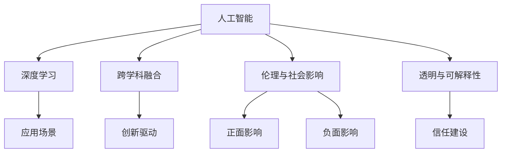

                 

## 1. 背景介绍

### 1.1 问题由来

安德烈·卡帕西（Andrej Karpathy）是人工智能领域的著名专家，以其在计算机视觉、深度学习和自动驾驶方面的贡献而闻名。作为一名科技界的领军人物，他的思想和观点备受业界瞩目。随着人工智能技术的飞速发展，关于人工智能的未来发展方向也引起了广泛讨论。本节将简要介绍卡帕西对人工智能未来发展的看法，探讨其对技术进步的见解。

### 1.2 问题核心关键点

卡帕西在多次演讲和文章中，表达了对于人工智能未来发展的多维度思考，主要集中在以下几个方面：
1. 人工智能应以解决实际问题为出发点，而非追求技术本身的完善。
2. 跨学科融合是推动人工智能发展的关键，不同领域的知识应协同推进。
3. 人工智能的未来应以伦理和社会影响为导向，注重技术带来的积极影响。
4. 技术创新需与公众沟通并建立信任，确保技术应用透明和可解释。

## 2. 核心概念与联系

### 2.1 核心概念概述

为更好地理解卡帕西的人工智能发展策略，本节将介绍几个核心概念：

- **人工智能**：通过模拟人类智能行为，使计算机具备自主学习、推理和决策能力的学科。
- **深度学习**：一种基于神经网络的机器学习技术，通过大量数据训练模型，实现复杂非线性模式的学习。
- **跨学科融合**：将不同学科的知识和工具结合起来，共同解决复杂问题，提升技术效果。
- **伦理与社会影响**：评估人工智能技术在社会中的正面与负面影响，确保技术应用负责任。
- **透明与可解释性**：使人工智能决策过程透明，便于理解和解释，增加公众信任。

这些核心概念之间的逻辑关系可以通过以下Mermaid流程图来展示：



这个流程图展示了一些核心概念之间的联系：

1. 人工智能通过深度学习进行自我提升，以应对复杂的实际问题。
2. 跨学科融合为深度学习提供了丰富的知识背景和创新思路。
3. 伦理和社会影响指导人工智能的发展方向，确保技术应用对社会产生积极影响。
4. 透明与可解释性使得人工智能更加透明，增强公众信任。

这些概念共同构成了卡帕西对人工智能未来发展的基本看法。

## 3. 核心算法原理 & 具体操作步骤

### 3.1 算法原理概述

卡帕西对人工智能未来发展的观点主要基于以下几个算法原理：

- **基于数据的学习**：人工智能的核心在于利用数据进行自我学习，模型通过数据不断优化自身的参数，提高预测能力。
- **跨学科知识的融合**：不同学科的知识和工具可以相互促进，共同推进人工智能技术的进步。
- **伦理与社会责任**：在人工智能技术的研发和应用过程中，应始终考虑伦理和社会影响，确保技术的积极作用。
- **透明与可解释性**：使得人工智能的决策过程透明，便于公众理解和信任。

### 3.2 算法步骤详解

卡帕西的人工智能发展策略包括以下几个关键步骤：

**Step 1: 跨学科知识融合**
- 收集和整理不同学科的知识和数据。
- 设计跨学科合作项目，共同解决实际问题。
- 建立开放平台，促进知识共享和交流。

**Step 2: 基于数据的学习**
- 收集和标注高质量的训练数据。
- 选择合适的深度学习模型，进行参数优化。
- 对模型进行评估和验证，确保预测准确性。

**Step 3: 伦理与社会影响评估**
- 识别和分析人工智能应用可能带来的正面与负面影响。
- 制定伦理规范和政策，确保技术应用的负责任。
- 建立反馈机制，持续优化人工智能系统的社会影响。

**Step 4: 透明与可解释性实现**
- 设计透明的算法架构，便于公众理解和监督。
- 提供可解释的模型输出，增加透明度和可信度。
- 建立透明的沟通渠道，与公众保持良好互动。

### 3.3 算法优缺点

基于卡帕西的算法原理和操作步骤，以下是其人工智能发展策略的优缺点分析：

**优点**：
1. **跨学科融合**：不同领域的知识相互补充，推动人工智能技术的全面发展。
2. **基于数据的学习**：通过数据驱动的模型训练，提升预测精度和应用效果。
3. **伦理与社会影响评估**：确保人工智能技术对社会产生积极影响，避免负面后果。
4. **透明与可解释性**：增加公众对技术的信任和接受度，促进技术推广和应用。

**缺点**：
1. **数据获取难度大**：高质量数据的收集和标注可能面临成本高、难度大的问题。
2. **模型复杂度高**：深度学习模型的参数量巨大，计算资源消耗大。
3. **伦理与社会问题复杂**：人工智能的伦理问题涉及多个方面，难以全面解决。
4. **技术透明度不足**：部分复杂模型的决策过程难以解释，增加公众疑虑。

尽管存在这些缺点，卡帕西的发展策略仍具有重要的指导意义。

### 3.4 算法应用领域

卡帕西的人工智能发展策略在多个领域得到了广泛应用，例如：

- **自动驾驶**：结合计算机视觉、深度学习和传感器数据，实现自动驾驶汽车。
- **医疗诊断**：利用深度学习模型分析医学影像和病历数据，提升诊断准确性。
- **自然语言处理**：通过跨学科知识融合，提升自然语言理解与生成能力。
- **机器人技术**：结合感知、认知和控制技术，开发智能机器人，辅助人类工作。

## 4. 数学模型和公式 & 详细讲解

### 4.1 数学模型构建

卡帕西的人工智能发展策略建立在多个数学模型的基础上。以自动驾驶技术为例，其核心数学模型包括以下几个方面：

- **动态模型**：描述车辆的运动状态和控制行为。
- **感知模型**：通过传感器数据，实现对环境的实时感知和理解。
- **决策模型**：基于感知和动态模型，进行路径规划和行为决策。

### 4.2 公式推导过程

以自动驾驶中的路径规划为例，其数学模型可以用以下公式表示：

$$
x_{t+1} = f(x_t,u_t)
$$

其中 $x_t$ 表示车辆在时间 $t$ 的状态，$u_t$ 表示时间 $t$ 的控制输入，$f$ 表示车辆的运动函数。

在实际应用中，可以通过机器学习算法，如强化学习、深度学习，对模型进行训练和优化。例如，在强化学习中，车辆通过环境感知，不断调整控制输入 $u_t$，以最大化未来奖励。

### 4.3 案例分析与讲解

在自动驾驶技术中，感知模型的准确性至关重要。通过结合摄像头、雷达和激光雷达等多种传感器数据，可以构建高精度的环境感知模型。例如，摄像头可以实现高分辨率的视觉感知，雷达可以实现长距离的高精度测量，激光雷达则可以实现三维空间的环境重建。通过数据融合技术，将这些传感器数据结合起来，可以大大提升环境感知的能力。

## 5. 项目实践：代码实例和详细解释说明

### 5.1 开发环境搭建

在实践中，自动驾驶技术需要依赖多个开源工具和库。以下是基本的开发环境搭建流程：

1. 安装Python：从官网下载并安装Python，确保版本稳定。
2. 安装依赖库：使用pip安装必要的依赖库，如numpy、pandas、scikit-learn等。
3. 搭建实验环境：在虚拟环境中搭建实验环境，如使用conda管理依赖。
4. 配置环境变量：确保必要的环境变量配置正确，如CUDA路径和PYTHONPATH。

### 5.2 源代码详细实现

以下是一个简单的自动驾驶路径规划算法的代码实现：

```python
import numpy as np

# 定义车辆的运动函数
def f(state, control):
    x, y, theta = state
    v = control
    yaw_rate = 0
    delta = 0
    dx = v * np.cos(theta) * dt
    dy = v * np.sin(theta) * dt
    dtheta = yaw_rate * dt
    x += dx
    y += dy
    theta += dtheta
    return x, y, theta

# 定义车辆的初始状态
x, y, theta = 0, 0, 0
v = 10

# 定义车辆控制函数
def control(state, goal):
    x, y, theta = state
    x_goal, y_goal = goal
    dx = x_goal - x
    dy = y_goal - y
    dist = np.sqrt(dx**2 + dy**2)
    if dist < 1:
        return 0, 0, 0
    else:
        dtheta = np.arctan2(dy, dx)
        return v, dtheta, 0

# 定义路径规划函数
def plan_path(start, goal, resolution):
    x, y = start
    x_goal, y_goal = goal
    x_plan, y_plan = [], []
    while True:
        x_plan.append(x)
        y_plan.append(y)
        x, y, theta = f(x, control((x, y, theta), (x_goal, y_goal)))
        if np.sqrt((x - x_goal)**2 + (y - y_goal)**2) < resolution:
            break
    return np.array(x_plan), np.array(y_plan)
```

### 5.3 代码解读与分析

在这个代码实现中，我们定义了车辆的运动函数和控制函数，用于描述车辆的运动状态和行为决策。路径规划函数通过不断调整控制输入，实现车辆的路径规划和导航。

代码的关键点包括：

- **运动函数**：通过控制输入 $u_t$ 计算车辆的状态变化 $x_{t+1}$。
- **控制函数**：根据当前状态和目标状态，计算控制输入 $u_t$。
- **路径规划**：通过不断调整控制输入，实现从起始状态到目标状态的路径规划。

## 6. 实际应用场景

### 6.1 智能驾驶系统

基于卡帕西的算法原理，智能驾驶系统可以实现自动驾驶、路径规划和行为决策等功能。通过结合计算机视觉、深度学习和传感器数据，智能驾驶系统可以实时感知环境，进行精准的路径规划和行为决策，提升驾驶安全和效率。

在实际应用中，智能驾驶系统需要处理复杂的场景，如交叉路口、障碍物、行人等。通过多传感器融合技术，智能驾驶系统可以构建高精度的环境感知模型，实现对环境的实时感知和理解。

### 6.2 医疗诊断系统

在医疗诊断领域，通过结合医学影像、病历数据和深度学习技术，可以实现精准的诊断和预测。利用跨学科知识融合，医疗诊断系统可以更好地理解和分析复杂疾病，提升诊断准确性。

在实际应用中，医疗诊断系统需要处理大量的医学数据，如CT、MRI、病历记录等。通过数据预处理和特征提取，深度学习模型可以从中学习到疾病的特征和模式，实现精准的诊断和预测。

### 6.3 自然语言处理系统

在自然语言处理领域，通过结合自然语言理解和生成技术，可以实现智能问答、机器翻译、情感分析等功能。利用跨学科知识融合，自然语言处理系统可以更好地理解和生成自然语言，提升交互体验。

在实际应用中，自然语言处理系统需要处理大规模的自然语言数据，如文本、语音等。通过数据预处理和特征提取，深度学习模型可以从中学习到语言特征和模式，实现智能问答和机器翻译。

## 7. 工具和资源推荐

### 7.1 学习资源推荐

为了帮助开发者系统掌握人工智能技术，这里推荐一些优质的学习资源：

1. **Deep Learning Specialization by Andrew Ng**：斯坦福大学提供的深度学习课程，涵盖深度学习的基本概念和实践。
2. **CS231n: Convolutional Neural Networks for Visual Recognition**：斯坦福大学提供的计算机视觉课程，讲解卷积神经网络的原理和应用。
3. **The Unreasonable Effectiveness of Recurrent Neural Networks**：Andrej Karpathy的文章，介绍了递归神经网络在自然语言处理中的应用。
4. **Deep Learning with PyTorch by Eli Stevens**：使用PyTorch进行深度学习的入门书籍，详细介绍了PyTorch的使用和深度学习算法。

### 7.2 开发工具推荐

高效的工具支持是开发人工智能项目的基础。以下是几款常用的开发工具：

1. **PyTorch**：基于Python的深度学习框架，提供灵活的动态计算图和高效的计算性能。
2. **TensorFlow**：由Google主导的深度学习框架，提供丰富的工具和资源，适合大规模工程应用。
3. **Jupyter Notebook**：交互式的笔记本环境，支持Python代码的编写和执行。
4. **Git**：版本控制系统，方便团队协作和代码管理。

### 7.3 相关论文推荐

人工智能技术的快速发展离不开学术界的不断探索。以下是几篇关键的论文，推荐阅读：

1. **ImageNet Classification with Deep Convolutional Neural Networks**：AlexNet论文，标志着深度学习在图像分类任务上的突破。
2. **Fine-Grained Recognition with Deep Convolutional Networks**：VGG论文，介绍了VGG网络的结构和性能。
3. **Learning Phrases and Sentences from Scratch**：LSTM论文，介绍了长短期记忆网络在自然语言处理中的应用。
4. **Attention is All You Need**：Transformer论文，介绍了Transformer网络在自然语言处理中的应用。

## 8. 总结：未来发展趋势与挑战

### 8.1 研究成果总结

卡帕西对人工智能未来发展的观点和策略，已经在多个领域得到了广泛应用和验证。通过跨学科知识融合、基于数据的学习、伦理与社会影响评估以及透明与可解释性实现，人工智能技术在自动驾驶、医疗诊断、自然语言处理等领域取得了显著的进步。

### 8.2 未来发展趋势

展望未来，人工智能技术将呈现以下几个发展趋势：

1. **跨学科融合深化**：不同学科的知识和工具将更加紧密地结合，推动人工智能技术的全面发展。
2. **数据驱动的创新**：大数据和深度学习技术的结合，将推动人工智能技术的创新和进步。
3. **伦理与社会责任加强**：人工智能技术的社会影响将受到更多关注，确保技术应用对社会产生积极影响。
4. **透明与可解释性提升**：增加人工智能系统的透明度和可解释性，增强公众信任和接受度。

### 8.3 面临的挑战

尽管人工智能技术已经取得了显著进展，但在迈向更加智能化、普适化应用的过程中，仍面临诸多挑战：

1. **数据获取难度大**：高质量数据的收集和标注可能面临成本高、难度大的问题。
2. **模型复杂度高**：深度学习模型的参数量巨大，计算资源消耗大。
3. **伦理与社会问题复杂**：人工智能的伦理问题涉及多个方面，难以全面解决。
4. **技术透明度不足**：部分复杂模型的决策过程难以解释，增加公众疑虑。

尽管存在这些挑战，未来的技术进步和创新仍将不断突破这些瓶颈。

### 8.4 研究展望

未来的人工智能研究需要在以下几个方面寻求新的突破：

1. **跨学科融合深化**：不同学科的知识和工具将更加紧密地结合，推动人工智能技术的全面发展。
2. **数据驱动的创新**：大数据和深度学习技术的结合，将推动人工智能技术的创新和进步。
3. **伦理与社会责任加强**：人工智能技术的社会影响将受到更多关注，确保技术应用对社会产生积极影响。
4. **透明与可解释性提升**：增加人工智能系统的透明度和可解释性，增强公众信任和接受度。

这些研究方向的探索，必将引领人工智能技术迈向更高的台阶，为构建安全、可靠、可解释、可控的智能系统铺平道路。

## 9. 附录：常见问题与解答

**Q1：如何处理数据不平衡问题？**

A: 在实际应用中，数据不平衡是一个常见的问题。可以通过以下方法进行处理：
1. 过采样：对少数类样本进行复制，增加其数量。
2. 欠采样：对多数类样本进行抽样，减少其数量。
3. SMOTE算法：通过生成合成样本来平衡数据。

**Q2：如何提升模型的泛化能力？**

A: 提升模型的泛化能力需要从多个方面进行优化：
1. 数据增强：通过数据扩充和增强，提高模型的鲁棒性和泛化能力。
2. 正则化：使用L2正则、Dropout等技术，避免过拟合。
3. 模型集成：通过模型集成，提高模型的泛化性能。

**Q3：如何提高模型的解释性？**

A: 提高模型的解释性可以通过以下方法实现：
1. 可视化：使用可视化工具，理解模型的内部结构和工作机制。
2. 可解释模型：使用可解释模型，如决策树、规则模型等，增加模型的透明度。
3. 模型解释：通过模型解释方法，如LIME、SHAP等，解释模型的决策过程。

**Q4：如何确保模型的公平性和可信度？**

A: 确保模型的公平性和可信度需要从多个方面进行考虑：
1. 数据预处理：确保训练数据的多样性和代表性。
2. 模型评估：使用公平性指标评估模型的性能。
3. 公开透明：公开模型的训练过程和参数，接受公众监督。

---

作者：禅与计算机程序设计艺术 / Zen and the Art of Computer Programming

