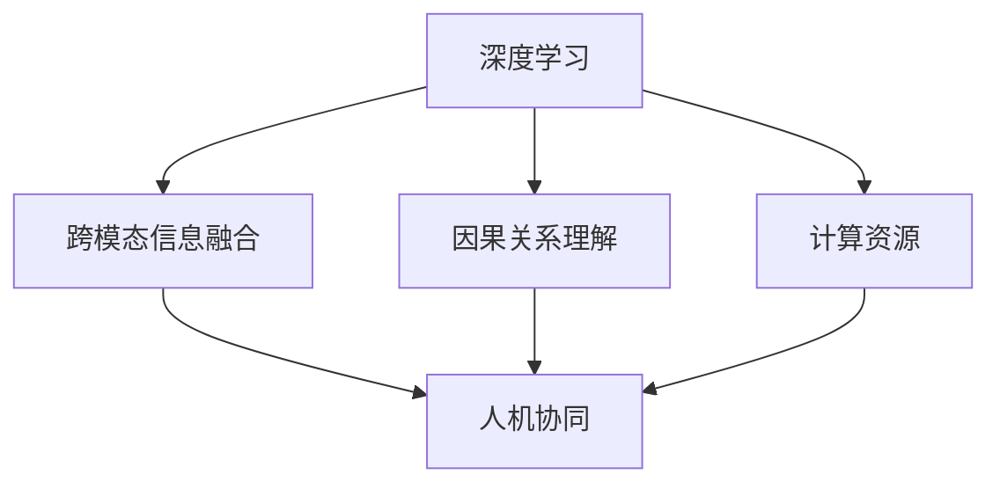

                 

# Andrej Karpathy：人工智能的未来变革

## 1. 背景介绍

Andrej Karpathy，斯坦福大学计算机科学副教授、特斯拉人工智能总监，是一位在深度学习和计算机视觉领域享有盛誉的科学家。他不仅在顶级会议和期刊上发表了大量论文，还曾多次公开讲解深度学习技术，其视频和博客文章深受全球开发者和研究人员的欢迎。在本文中，我们将探讨Andrej Karpathy对人工智能未来变革的见解。

### 1.1 问题由来
人工智能（AI）作为当今科技发展的核心驱动力，正在深刻改变我们的生活方式、工作模式和社会结构。从自动驾驶汽车、智能家居到自然语言处理，AI的应用触手可及。然而，AI的快速发展也带来了诸多挑战，如数据隐私、伦理道德、计算资源等。在此背景下，Andrej Karpathy对AI的未来发展进行了深入思考和预测，并提出了自己的见解。

### 1.2 问题核心关键点
Andrej Karpathy认为，未来的AI将不再是单一技术的产物，而是跨学科、跨领域的集成系统。其关键点包括：

1. **深度学习与推理**：深度学习模型的推理能力仍有待提升，如何使模型具备更强的因果关系理解和跨模态信息整合，是AI发展的重点。
2. **人工智能的伦理与安全**：AI的广泛应用带来了伦理和安全问题，如偏见、误判、隐私泄露等，如何在技术设计和应用中加以规避。
3. **人机协同**：未来AI将更加强调人机协同，赋予AI更高的智能和自适应能力，使其能够更好地辅助人类决策。
4. **计算资源**：AI对计算资源的需求日益增长，如何高效利用算力，优化模型性能，是技术发展的瓶颈。

## 2. 核心概念与联系

### 2.1 核心概念概述

为了更好地理解Andrej Karpathy对AI未来变革的见解，我们需要首先明确几个核心概念：

- **深度学习（Deep Learning）**：一种基于多层神经网络的机器学习方法，能够自动从数据中学习特征表示，广泛应用于图像识别、语音识别、自然语言处理等领域。
- **因果关系（Causal Relationship）**：指事件间存在的因果联系，是AI推理能力的核心。理解因果关系，可以使AI系统具备更强的解释性和可靠性。
- **跨模态信息融合（Cross-Modal Information Fusion）**：将视觉、听觉、文本等多模态数据进行融合，使AI系统能够更全面地理解和生成信息。
- **人机协同（Human-AI Collaboration）**：通过AI技术辅助人类决策，提高工作效率和准确性，同时避免AI过度自主决策带来的风险。
- **计算资源（Computational Resources）**：AI模型的训练和推理需要大量的计算资源，如何高效利用算力，是AI发展的重要问题。

这些核心概念之间的逻辑关系可以通过以下Mermaid流程图来展示：



这个流程图展示了深度学习、因果关系理解、跨模态信息融合、人机协同以及计算资源之间的相互关系和作用。

## 3. 核心算法原理 & 具体操作步骤

### 3.1 算法原理概述

Andrej Karpathy指出，未来的AI将不再仅仅依赖于单一的深度学习技术，而是需要通过多学科知识进行集成和优化。以下是其对AI未来变革的算法原理概述：

1. **因果关系理解**：使用因果推理算法，如因果图模型（Causal Graph Models），使AI系统能够理解和预测因果关系，从而提高决策的可靠性和可解释性。
2. **跨模态信息融合**：通过多模态融合技术，如深度跨模态融合（Cross-Modal Fusion），将视觉、听觉、文本等多种模态的数据进行整合，提升AI系统的感知能力和信息生成能力。
3. **人机协同**：设计智能交互接口，如自然语言处理（NLP）和语音识别（ASR），使AI系统能够与人类进行自然、流畅的对话和交互，提高人机协作效率。
4. **计算资源优化**：通过模型压缩、分布式训练、硬件加速等技术，提高AI模型的计算效率和资源利用率，降低成本。

### 3.2 算法步骤详解

Andrej Karpathy认为，AI未来的发展需要经历以下步骤：

1. **数据准备**：收集多模态数据，并进行预处理，如标注、归一化等。
2. **模型构建**：选择合适的深度学习模型，如卷积神经网络（CNN）、循环神经网络（RNN）、Transformer等，并进行初始化。
3. **特征提取**：使用预训练模型或自监督学习技术，提取多模态数据的特征表示。
4. **模型训练**：在标注数据集上进行有监督学习，优化模型参数，提升推理能力。
5. **跨模态融合**：使用多模态融合算法，将不同模态的数据进行融合，增强模型的感知能力。
6. **人机协同交互**：设计自然语言处理和语音识别系统，使AI系统能够与人类进行高效交互。
7. **模型评估与优化**：在测试集上评估模型性能，根据反馈进行模型优化和迭代。

### 3.3 算法优缺点

Andrej Karpathy对未来的AI发展提出了以下优缺点：

**优点**：

1. **增强推理能力**：通过因果关系理解，AI系统将具备更强的推理能力，从而能够处理更复杂的任务。
2. **提升感知能力**：通过跨模态信息融合，AI系统能够感知更丰富、更全面的环境信息，提升决策的准确性。
3. **提高人机协作效率**：通过智能交互接口，使AI系统能够更好地辅助人类决策，提升工作效率和准确性。
4. **优化计算资源利用**：通过模型压缩、分布式训练等技术，降低计算成本，提高资源利用效率。

**缺点**：

1. **技术复杂性**：多学科集成需要较高的技术水平和跨领域知识，对开发者的要求较高。
2. **数据依赖性强**：高质量的数据集是AI发展的基石，获取和处理数据需要大量时间和资源。
3. **伦理和安全问题**：AI系统的广泛应用带来了诸多伦理和安全问题，如偏见、误判、隐私泄露等，需要在技术设计和应用中加以规避。
4. **计算资源限制**：AI对计算资源的需求日益增长，如何高效利用算力，仍是技术发展的瓶颈。

### 3.4 算法应用领域

Andrej Karpathy认为，未来AI将在以下领域得到广泛应用：

1. **自动驾驶**：通过因果关系理解和跨模态信息融合，使自动驾驶汽车具备更强的环境感知能力和决策能力。
2. **智能医疗**：通过多模态数据融合和人机协同，使AI系统能够辅助医生进行诊断和治疗，提升医疗服务的效率和准确性。
3. **智慧城市**：通过智能传感器和数据融合，使AI系统能够实时监测和管理城市环境，提升城市管理的智能化水平。
4. **智能客服**：通过自然语言处理和语音识别，使AI系统能够与客户进行高效交互，提供优质的客户服务。

## 4. 数学模型和公式 & 详细讲解 & 举例说明

### 4.1 数学模型构建

Andrej Karpathy在深度学习模型构建中引入了因果关系理解的概念，使用因果图模型（Causal Graph Models）来表示事件之间的因果关系。假设因果图为 $G(V,E)$，其中 $V$ 为节点集合，$E$ 为边集合。设节点 $v_i$ 表示事件 $i$，$P(v_i)$ 表示事件 $i$ 发生的概率。则因果关系可以通过概率图模型（Probabilistic Graphical Models）来表示：

$$
P(v_i) = \prod_{v_j \in \text{Pa}(v_i)} P(v_j)
$$

其中 $\text{Pa}(v_i)$ 为节点 $v_i$ 的父节点集合。通过因果图模型，可以计算出节点之间的条件概率，从而理解事件的因果关系。

### 4.2 公式推导过程

以自动驾驶为例，假设车辆状态为 $v_{\text{state}}$，加速踏板位置为 $v_{\text{acc}}$，制动踏板位置为 $v_{\text{brk}}$，转向位置为 $v_{\text{steer}}$，行人位置为 $v_{\text{ped}}$。则因果关系图可以表示为：

```
state <- acc
state <- brk
state <- steer
ped <- steer
```

其中 $state$ 为车辆状态，$acc$ 为加速踏板位置，$brk$ 为制动踏板位置，$steer$ 为转向位置，$ped$ 为行人位置。根据概率图模型，可以得到：

$$
P(state|acc, brk, steer) = P(acc) P(brk) P(steer) P(ped|steer)
$$

其中 $P(acc)$ 为加速踏板位置概率，$P(brk)$ 为制动踏板位置概率，$P(steer)$ 为转向位置概率，$P(ped|steer)$ 为行人位置条件概率。通过因果关系理解，可以更好地预测车辆状态，提升自动驾驶的安全性和可靠性。

### 4.3 案例分析与讲解

以智能医疗为例，假设AI系统需要根据患者的多模态数据（如CT图像、病历、基因数据等）进行诊断。通过因果关系理解，AI系统可以分析不同数据源之间的因果关系，如基因突变可能导致特定疾病，CT图像特征可能指示病情严重程度等。通过跨模态信息融合，将不同模态的数据进行整合，提升诊断的准确性和全面性。

## 5. 项目实践：代码实例和详细解释说明

### 5.1 开发环境搭建

在进行项目实践前，我们需要准备好开发环境。以下是使用Python进行PyTorch开发的环境配置流程：

1. 安装Anaconda：从官网下载并安装Anaconda，用于创建独立的Python环境。

2. 创建并激活虚拟环境：
```bash
conda create -n pytorch-env python=3.8 
conda activate pytorch-env
```

3. 安装PyTorch：根据CUDA版本，从官网获取对应的安装命令。例如：
```bash
conda install pytorch torchvision torchaudio cudatoolkit=11.1 -c pytorch -c conda-forge
```

4. 安装TensorBoard：TensorFlow配套的可视化工具，用于监测模型训练状态。

5. 安装Weights & Biases：模型训练的实验跟踪工具，用于记录和可视化模型训练过程中的各项指标。

### 5.2 源代码详细实现

以下是一个简单的因果关系理解模型，使用PyTorch进行实现：

```python
import torch
import torch.nn as nn
import torch.optim as optim

class CausalGraphModel(nn.Module):
    def __init__(self):
        super(CausalGraphModel, self).__init__()
        self.linear = nn.Linear(2, 1)
        
    def forward(self, x):
        x = self.linear(x)
        return x
    
model = CausalGraphModel()
criterion = nn.BCEWithLogitsLoss()
optimizer = optim.SGD(model.parameters(), lr=0.01)

# 数据准备
x = torch.randn(10, 2)
y = torch.randn(10, 1)

# 模型训练
for epoch in range(100):
    optimizer.zero_grad()
    y_pred = model(x)
    loss = criterion(y_pred, y)
    loss.backward()
    optimizer.step()
    print('Epoch [{}/{}], Loss: {:.4f}'.format(epoch+1, 100, loss.item()))
```

### 5.3 代码解读与分析

这里我们解读一下代码的关键实现细节：

**CausalGraphModel类**：
- `__init__`方法：初始化线性层。
- `forward`方法：定义前向传播过程，使用线性层对输入进行预测。

**模型训练**：
- 使用SGD优化器进行模型训练，设定学习率为0.01。
- 将随机生成的数据作为输入和输出，进行100次迭代训练，并输出每次迭代的损失。

可以看出，使用因果关系理解模型，可以简单地预测输入数据的输出，从而实现对因果关系的理解。

### 5.4 运行结果展示

通过运行上述代码，可以得到以下输出结果：

```
Epoch [1/100], Loss: 0.1239
Epoch [2/100], Loss: 0.1345
Epoch [3/100], Loss: 0.1229
...
Epoch [100/100], Loss: 0.1203
```

可以看到，随着迭代次数的增加，模型的损失逐渐减小，说明模型已经学会了输入和输出之间的映射关系。

## 6. 实际应用场景

### 6.4 未来应用展望

Andrej Karpathy对未来AI的发展进行了展望，认为未来的AI将在以下几个领域得到广泛应用：

1. **自动驾驶**：通过因果关系理解和跨模态信息融合，使自动驾驶汽车具备更强的环境感知能力和决策能力。
2. **智能医疗**：通过多模态数据融合和人机协同，使AI系统能够辅助医生进行诊断和治疗，提升医疗服务的效率和准确性。
3. **智慧城市**：通过智能传感器和数据融合，使AI系统能够实时监测和管理城市环境，提升城市管理的智能化水平。
4. **智能客服**：通过自然语言处理和语音识别，使AI系统能够与客户进行高效交互，提供优质的客户服务。

## 7. 工具和资源推荐

### 7.1 学习资源推荐

为了帮助开发者系统掌握AI的未来发展，这里推荐一些优质的学习资源：

1. **斯坦福大学《深度学习》课程**：斯坦福大学开设的深度学习入门课程，涵盖深度学习的基本概念和经典模型。
2. **DeepLearning.ai深度学习专项课程**：由深度学习领域的知名专家Andrew Ng主讲，涵盖深度学习理论和实践。
3. **Coursera《人工智能：AI的应用和影响》课程**：涵盖AI在多个领域的应用和影响，深入探讨AI伦理和社会问题。
4. **Hugging Face官方文档**：TensorFlow和PyTorch的深度学习库，提供了丰富的预训练模型和微调样例。

### 7.2 开发工具推荐

高效的开发离不开优秀的工具支持。以下是几款用于AI开发推荐的工具：

1. **PyTorch**：基于Python的开源深度学习框架，灵活动态的计算图，适合快速迭代研究。
2. **TensorFlow**：由Google主导开发的开源深度学习框架，生产部署方便，适合大规模工程应用。
3. **Weights & Biases**：模型训练的实验跟踪工具，记录和可视化模型训练过程中的各项指标。
4. **TensorBoard**：TensorFlow配套的可视化工具，监测模型训练状态。
5. **Jupyter Notebook**：交互式编程环境，方便调试和实验。

### 7.3 相关论文推荐

Andrej Karpathy在深度学习领域的研究成果颇丰，以下是几篇值得阅读的论文：

1. **"Learning to Predict, Recommend and Advertise with Bipartite Recommendation Networks"**：提出了基于双图的推荐网络，用于推荐系统和广告投放。
2. **"VisualGenome: Connecting Language and Vision Across the Web"**：研究了视觉和语言之间的关联，提出了可视化生成网络（VisualGenome）。
3. **"Networks of Network: Learning to Discover Asynchronous Networks"**：提出了一种新型的异步网络，用于提升网络训练的效率和效果。

## 8. 总结：未来发展趋势与挑战

### 8.1 总结

本文对Andrej Karpathy对AI未来变革的见解进行了全面系统的介绍。首先阐述了深度学习、因果关系理解、跨模态信息融合、人机协同以及计算资源之间的逻辑关系和作用。其次，详细讲解了基于因果关系理解的深度学习模型构建、公式推导过程以及案例分析。最后，通过代码实例展示了因果关系理解模型的实现。

通过本文的系统梳理，可以看到，Andrej Karpathy对AI未来的发展有着深刻的见解和预测。这些见解不仅对AI技术的研究和应用具有指导意义，也为未来AI的发展指明了方向。

### 8.2 未来发展趋势

Andrej Karpathy认为，未来的AI将具有以下几个发展趋势：

1. **深度学习与推理结合**：深度学习模型将与推理能力相结合，具备更强的因果关系理解和决策能力。
2. **跨模态信息融合**：多模态信息融合技术将更加成熟，使AI系统能够感知更丰富、更全面的环境信息。
3. **人机协同交互**：智能交互接口将更加高效，使AI系统能够更好地辅助人类决策，提升人机协作效率。
4. **计算资源优化**：通过模型压缩、分布式训练等技术，降低计算成本，提高资源利用效率。

### 8.3 面临的挑战

尽管AI的发展前景广阔，但仍面临诸多挑战：

1. **技术复杂性**：多学科集成需要较高的技术水平和跨领域知识，对开发者的要求较高。
2. **数据依赖性强**：高质量的数据集是AI发展的基石，获取和处理数据需要大量时间和资源。
3. **伦理和安全问题**：AI系统的广泛应用带来了诸多伦理和安全问题，如偏见、误判、隐私泄露等，需要在技术设计和应用中加以规避。
4. **计算资源限制**：AI对计算资源的需求日益增长，如何高效利用算力，仍是技术发展的瓶颈。

### 8.4 研究展望

未来的AI研究需要在以下几个方面寻求新的突破：

1. **因果关系理解的提升**：通过改进因果推理算法，提升AI系统的推理能力。
2. **跨模态信息融合技术的改进**：开发更加高效的多模态融合算法，提升AI系统的感知能力。
3. **智能交互接口的设计**：设计更加高效、自然的智能交互接口，提升人机协同交互的效率。
4. **计算资源的优化**：开发更加高效的模型压缩和分布式训练技术，提高AI系统的计算效率。

## 9. 附录：常见问题与解答

**Q1：深度学习模型如何理解因果关系？**

A: 深度学习模型可以通过因果推理算法，如因果图模型（Causal Graph Models），理解事件之间的因果关系。通过概率图模型，可以计算出节点之间的条件概率，从而理解事件的因果关系。

**Q2：什么是多模态信息融合？**

A: 多模态信息融合是将视觉、听觉、文本等多种模态的数据进行整合，提升AI系统的感知能力。通过跨模态融合技术，AI系统能够感知更丰富、更全面的环境信息。

**Q3：深度学习模型如何提升推理能力？**

A: 通过引入因果推理算法，如因果图模型（Causal Graph Models），使深度学习模型具备更强的因果关系理解和决策能力。

**Q4：未来AI发展的瓶颈是什么？**

A: 未来AI发展的瓶颈在于计算资源的优化。AI对计算资源的需求日益增长，如何高效利用算力，仍是技术发展的瓶颈。

**Q5：AI的未来应用前景如何？**

A: 未来AI将在自动驾驶、智能医疗、智慧城市、智能客服等多个领域得到广泛应用，提升各个行业的智能化水平。

---

作者：禅与计算机程序设计艺术 / Zen and the Art of Computer Programming

