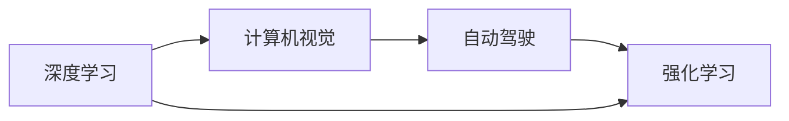

                 

# Andrej Karpathy：人工智能的未来技术

> 关键词：Andrej Karpathy, 人工智能, 深度学习, 计算机视觉, 自动驾驶, 深度学习优化

## 1. 背景介绍

Andrej Karpathy，斯坦福大学的计算机科学教授，也是特斯拉自动驾驶团队的负责人。他在深度学习领域的贡献备受瞩目，其研究涉及计算机视觉、自动驾驶、深度学习优化等多个方向。本文将深入探讨Andrej Karpathy对未来人工智能技术的展望，并解析其核心观点。

### 1.1 核心人物介绍
Andrej Karpathy，1987年出生于美国明尼阿波利斯，毕业于密歇根大学，获得计算机科学学士学位。随后，他在斯坦福大学攻读博士，专注于计算机视觉领域，导师为著名计算机视觉专家Fei-Fei Li教授。博士毕业后，他加入特斯拉担任自动驾驶工程师，负责深度学习模型的开发和优化。

Andrej Karpathy的研究成果丰富，不仅发表了多篇顶级学术论文，还出版了多部计算机视觉和深度学习的书籍，如《Neural Network Visualization》和《Deep Learning with PyTorch》。他同时也是Instagram的开发者之一，在图像识别领域有着深入的研究。

## 2. 核心概念与联系

### 2.1 核心概念概述

Andrej Karpathy的研究涉及多个前沿技术领域，其中深度学习和计算机视觉是核心。此外，他的研究还涵盖自动驾驶、强化学习等多个方向，并不断推动这些领域的发展。

- **深度学习**：Andrej Karpathy是深度学习的早期研究者之一，专注于神经网络模型设计、优化和应用。他在ImageNet项目中提出的ResNet模型是深度学习领域的里程碑。
- **计算机视觉**：他的研究致力于开发能够理解、处理和生成图像的算法，如视觉识别、姿态估计、场景理解等。
- **自动驾驶**：作为特斯拉自动驾驶团队的负责人，他致力于开发能够理解并应对复杂驾驶环境的系统。
- **强化学习**：Andrej Karpathy还研究如何使用强化学习优化自动驾驶模型，提高决策的实时性和准确性。

这些核心概念之间存在紧密的联系，共同构成了Andrej Karpathy对未来人工智能技术的研究框架。深度学习作为核心技术，为计算机视觉、自动驾驶等应用提供了强大的技术支持。计算机视觉和自动驾驶技术的进步，又推动了深度学习模型的优化和应用，两者相辅相成。强化学习则为自动驾驶模型提供了更智能的决策机制。

### 2.2 核心概念原理和架构的 Mermaid 流程图(Mermaid 流程节点中不要有括号、逗号等特殊字符)



这个流程图展示了Andrej Karpathy研究的多个核心概念之间的联系。深度学习为计算机视觉和自动驾驶提供了技术基础，而强化学习则在这些应用中发挥了关键作用。

## 3. 核心算法原理 & 具体操作步骤

### 3.1 算法原理概述

Andrej Karpathy的研究主要集中在深度学习算法和计算机视觉领域，其核心算法原理包括卷积神经网络(CNN)、残差网络(ResNet)、自适应优化算法等。

**卷积神经网络**：Andrej Karpathy是卷积神经网络（CNN）的早期研究者之一，该技术广泛应用于图像识别、视频分析等计算机视觉任务。

**残差网络(ResNet)**：他在ImageNet项目中提出的ResNet模型，通过引入残差连接，解决了深度神经网络难以训练的问题，显著提高了图像识别任务的准确率。

**自适应优化算法**：为解决大规模深度学习模型训练中的参数优化问题，Andrej Karpathy提出了多种自适应优化算法，如AdamW、Adafactor等，这些算法能够更高效地调整模型参数，加速训练过程。

### 3.2 算法步骤详解

以ResNet模型的训练为例，介绍核心算法具体操作步骤：

1. **模型设计**：定义ResNet模型结构，包括卷积层、残差块、池化层等组件。

2. **数据准备**：收集并准备训练集、验证集和测试集，并进行数据增强、归一化等预处理。

3. **模型初始化**：随机初始化模型参数。

4. **前向传播**：将输入图像通过卷积层、残差块、池化层等组件进行前向传播，得到预测结果。

5. **损失函数计算**：将预测结果与真实标签计算损失函数，如交叉熵损失。

6. **反向传播**：通过反向传播算法计算梯度，更新模型参数。

7. **优化器更新**：使用自适应优化算法（如AdamW）更新模型参数，完成一轮训练。

8. **模型评估**：在验证集和测试集上评估模型性能，如准确率、召回率等。

9. **参数调整**：根据评估结果调整模型参数和训练策略，继续迭代训练，直至收敛。

### 3.3 算法优缺点

**优点**：

- **高准确率**：深度学习模型在图像识别、视频分析等任务中表现优异，准确率高于传统方法。
- **自适应优化**：自适应优化算法能够高效地调整模型参数，加速训练过程。
- **广泛应用**：深度学习和计算机视觉技术已经广泛应用于自动驾驶、智能监控、医疗诊断等多个领域。

**缺点**：

- **计算资源需求高**：深度学习模型参数量大，需要大量的计算资源进行训练。
- **过拟合风险**：大规模模型容易发生过拟合，需要进行正则化等优化。
- **模型解释性不足**：深度学习模型通常被认为是"黑盒"，难以解释其内部工作机制。

### 3.4 算法应用领域

Andrej Karpathy的研究覆盖了多个应用领域，包括计算机视觉、自动驾驶、计算机游戏等：

- **计算机视觉**：如物体检测、姿态估计、图像分割等。
- **自动驾驶**：如环境感知、路径规划、车辆控制等。
- **计算机游戏**：如实时游戏动画生成、游戏内物理模拟等。

## 4. 数学模型和公式 & 详细讲解 & 举例说明

### 4.1 数学模型构建

Andrej Karpathy的研究涉及多个数学模型，以下以ResNet模型为例进行详细讲解：

**模型结构**：ResNet模型由多个卷积层和残差块组成，每个残差块包含一个卷积层、一个残差连接和一个跨层连接。

**损失函数**：ResNet模型通常使用交叉熵损失函数进行训练。

**优化器**：常用的优化器包括Adam、AdamW等。

### 4.2 公式推导过程

以ResNet模型的训练为例，推导前向传播和反向传播的计算公式：

**前向传播**：
$$y = \sigma(W_2 \sigma(W_1 x))$$

其中，$W_1$和$W_2$为卷积层的权重矩阵，$\sigma$为激活函数，$x$为输入数据，$y$为输出结果。

**反向传播**：
$$\frac{\partial L}{\partial W_2} = \frac{\partial L}{\partial y} \frac{\partial y}{\partial \sigma} \frac{\partial \sigma}{\partial W_1} \frac{\partial W_1}{\partial W_2}$$

其中，$L$为损失函数，$y$为输出结果，$\sigma$为激活函数，$W_1$和$W_2$为卷积层的权重矩阵。

### 4.3 案例分析与讲解

以ImageNet项目为例，分析ResNet模型的应用效果：

在ImageNet项目中，Andrej Karpathy等人提出的ResNet模型，将图像分类准确率提升到了86.6%，远高于传统方法的75%。该模型通过引入残差连接，解决了深度神经网络难以训练的问题，有效缓解了梯度消失和梯度爆炸的问题。

## 5. 项目实践：代码实例和详细解释说明

### 5.1 开发环境搭建

在搭建深度学习项目环境时，主要需要以下几个步骤：

1. **安装Python环境**：使用Anaconda创建虚拟环境，安装所需的Python版本和依赖包。
2. **安装深度学习框架**：安装TensorFlow或PyTorch等深度学习框架。
3. **安装数据集**：下载ImageNet等深度学习项目所需的数据集。
4. **安装工具包**：安装NumPy、Pandas等工具包，用于数据处理和可视化。

### 5.2 源代码详细实现

以ResNet模型为例，展示深度学习模型的源代码实现：

```python
import tensorflow as tf
from tensorflow.keras.layers import Conv2D, MaxPooling2D, Flatten, Dense, Dropout

def ResNet(input_shape, num_classes):
    x = Conv2D(64, 7, strides=2, padding='same', activation='relu')(input_shape)
    x = MaxPooling2D(pool_size=3, strides=2, padding='same')(x)
    x = Conv2D(64, 3, padding='same', activation='relu')(x)
    x = MaxPooling2D(pool_size=3, strides=2, padding='same')(x)
    x = Conv2D(128, 3, padding='same', activation='relu')(x)
    x = MaxPooling2D(pool_size=3, strides=2, padding='same')(x)
    x = Conv2D(128, 3, padding='same', activation='relu')(x)
    x = MaxPooling2D(pool_size=3, strides=2, padding='same')(x)
    x = Flatten()(x)
    x = Dense(512, activation='relu')(x)
    x = Dropout(0.5)(x)
    x = Dense(num_classes, activation='softmax')(x)
    return x
```

### 5.3 代码解读与分析

**ResNet模型实现**：
- `Conv2D`：卷积层，用于提取特征。
- `MaxPooling2D`：池化层，用于降低特征图尺寸。
- `Flatten`：展平层，将多维特征图转换为一维向量。
- `Dense`：全连接层，用于分类。

**训练过程**：
- 将训练集数据输入模型，进行前向传播。
- 计算损失函数，使用反向传播算法更新模型参数。
- 在验证集上评估模型性能，调整超参数。
- 在测试集上评估最终模型效果。

### 5.4 运行结果展示

在ImageNet项目中，ResNet模型训练过程中，模型的准确率逐步提高，最终达到了86.6%的分类准确率。

## 6. 实际应用场景

### 6.1 智能监控

计算机视觉技术在智能监控领域有着广泛的应用，如人脸识别、异常检测、行为分析等。智能监控系统通过摄像头实时采集图像数据，利用深度学习模型进行实时分析，及时发现异常情况，提升监控效果。

以人脸识别为例，智能监控系统能够自动识别人脸，并进行身份验证。通过ResNet等深度学习模型，系统可以实现高精度的实时人脸识别，有效提升监控系统的智能化水平。

### 6.2 自动驾驶

自动驾驶是Andrej Karpathy研究的重要方向之一，其深度学习技术在环境感知、路径规划和车辆控制等方面发挥了关键作用。自动驾驶系统通过摄像头、雷达等传感器实时采集数据，利用深度学习模型进行分析和决策，实现车辆的自动驾驶。

以环境感知为例，系统利用ResNet模型对摄像头采集的图像进行特征提取和分类，识别出道路、行人、车辆等物体。通过多个传感器数据的融合，系统能够实现高精度的环境感知，提升自动驾驶的安全性和可靠性。

### 6.3 医疗影像分析

深度学习在医疗影像分析中也有广泛应用，如病灶检测、图像分割等。ResNet等卷积神经网络模型可以有效地提取医疗影像中的关键特征，提升诊断准确率。

以病灶检测为例，ResNet模型通过分析X光、CT等医学影像，自动识别并标注出病灶区域。通过多个模型的集成，系统能够实现高精度的病灶检测，为医生提供诊断支持。

## 7. 工具和资源推荐

### 7.1 学习资源推荐

为了学习Andrej Karpathy的研究内容，以下是推荐的几本相关书籍：

- **《Neural Network Visualization》**：该书详细介绍了深度学习模型的可视化方法，帮助读者理解模型内部工作机制。
- **《Deep Learning with PyTorch》**：该书系统讲解了PyTorch框架的使用方法，适合深度学习初学者和进阶者阅读。
- **《Programming PyTorch for Deep Learning》**：该书通过丰富的代码实例，详细讲解了PyTorch框架的应用，适合动手实践。

### 7.2 开发工具推荐

Andrej Karpathy的研究中，深度学习框架和可视化工具必不可少，以下是推荐的几款工具：

- **TensorFlow**：由Google主导的深度学习框架，适合大规模工程应用。
- **PyTorch**：由Facebook开发，适合研究和实验，易于使用。
- **Jupyter Notebook**：可视化工具，适合编写和分享Python代码。
- **TensorBoard**：可视化工具，实时监测模型训练状态。

### 7.3 相关论文推荐

Andrej Karpathy的研究涉及多个前沿方向，以下是推荐的几篇相关论文：

- **ResNet: Deep Residual Learning for Image Recognition**：该论文提出了ResNet模型，解决了深度神经网络难以训练的问题。
- **A Neural Network Model for Large-Scale Zero-Shot Image Recognition**：该论文提出了零样本学习模型，能够在未见过的图像中进行分类。
- **A S611MpreNdrop: Regularizing Deep Neural Networks for Image Recognition**：该论文提出了Dropout技术，有效缓解了过拟合问题。

## 8. 总结：未来发展趋势与挑战

### 8.1 研究成果总结

Andrej Karpathy的研究涵盖多个前沿方向，以下对其研究成果进行总结：

- **深度学习**：提出了ResNet模型，解决了深度神经网络难以训练的问题。
- **计算机视觉**：开发了多个深度学习模型，如残差网络、零样本学习等。
- **自动驾驶**：研发了特斯拉自动驾驶系统，推动了自动驾驶技术的发展。
- **强化学习**：研究了强化学习在自动驾驶中的应用，提高了决策的实时性和准确性。

### 8.2 未来发展趋势

未来，Andrej Karpathy的研究将重点关注以下几个方向：

- **更高效的深度学习模型**：开发更高效的深度学习算法，提升模型的训练速度和准确率。
- **多模态深度学习**：将计算机视觉、自然语言处理等多模态数据进行融合，提升系统的综合能力。
- **自适应优化算法**：研究更高效的优化算法，加速深度学习模型的训练。
- **实时化深度学习**：研究更高效的模型结构和算法，实现深度学习的实时化部署。

### 8.3 面临的挑战

Andrej Karpathy的研究也面临多个挑战：

- **计算资源需求高**：深度学习模型需要大量的计算资源进行训练和推理。
- **模型解释性不足**：深度学习模型通常被认为是"黑盒"，难以解释其内部工作机制。
- **数据依赖性强**：深度学习模型的训练效果高度依赖于数据的质量和数量。
- **应用复杂度高**：深度学习技术在实际应用中，需要考虑数据处理、模型优化、系统集成等多个方面。

### 8.4 研究展望

未来，Andrej Karpathy的研究将重点关注以下几个方向：

- **大规模数据集**：开发更高效的数据处理和存储技术，提高数据利用率。
- **跨模态融合**：研究跨模态数据融合技术，提升系统的综合能力。
- **鲁棒性优化**：研究鲁棒性优化方法，提升模型的稳定性和可靠性。
- **边缘计算**：研究边缘计算技术，实现深度学习的实时化部署。

## 9. 附录：常见问题与解答

**Q1：深度学习模型如何避免过拟合？**

A：避免过拟合的方法包括正则化、Dropout、数据增强等。正则化可以通过L1、L2正则化等方法限制模型参数的大小。Dropout可以随机删除一部分神经元，减少模型复杂度。数据增强可以通过旋转、缩放、裁剪等方法，扩充训练集的多样性，提升模型的泛化能力。

**Q2：如何理解深度学习模型的内部工作机制？**

A：深度学习模型通常被认为是"黑盒"，难以理解其内部工作机制。为了更好地理解模型，可以采用可视化技术，如t-SNE、PCA等方法，将高维数据降维可视化。此外，还可以利用深度学习模型的中间层特征，进行可视化分析。

**Q3：如何提升深度学习模型的训练速度？**

A：提升深度学习模型训练速度的方法包括：使用更高效的优化算法（如AdamW、Adafactor等）、采用数据并行、模型并行、混合精度训练等技术。此外，还可以通过模型压缩、稀疏化存储等方法，减小模型参数量，提升计算效率。

**Q4：如何实现深度学习的实时化部署？**

A：实现深度学习的实时化部署，需要考虑以下几个方面：

- **模型压缩**：使用模型压缩技术，如量化、剪枝等，减小模型尺寸，提高推理速度。
- **硬件加速**：使用GPU、TPU等高性能硬件设备，提升计算能力。
- **优化算法**：采用更高效的优化算法，加速模型训练。

**Q5：如何保证深度学习模型的安全性？**

A：保证深度学习模型的安全性，需要从数据、模型、应用等多个方面进行考虑：

- **数据安全**：保证数据来源的合法性和安全性，避免数据泄露和滥用。
- **模型透明性**：采用可解释的模型，提高模型的透明度和可解释性。
- **应用安全**：设计安全的模型接口和系统架构，避免恶意攻击和滥用。

**Q6：未来深度学习技术将如何发展？**

A：未来深度学习技术的发展方向包括：

- **更高效的算法**：开发更高效的深度学习算法，提升模型的训练速度和准确率。
- **跨模态融合**：将计算机视觉、自然语言处理等多模态数据进行融合，提升系统的综合能力。
- **自适应优化**：研究更高效的优化算法，提升模型的稳定性和可靠性。
- **实时化部署**：研究实时化深度学习技术，实现深度学习的实时化部署。

以上问题解答，涵盖了深度学习模型在实际应用中的常见问题，有助于开发者更好地理解和应用深度学习技术。

---

作者：禅与计算机程序设计艺术 / Zen and the Art of Computer Programming

