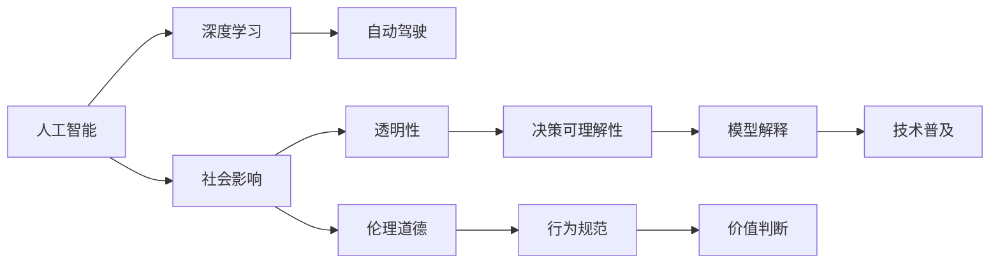

                 

# 安德烈·卡帕西：人工智能的社会影响

## 1. 背景介绍

安德烈·卡帕西（Andrej Karpathy）是深度学习领域的杰出代表之一，曾任特斯拉公司自动驾驶团队主管，斯坦福大学计算机科学教授。他的研究涵盖了计算机视觉、深度学习、自动驾驶等多个领域，尤其对人工智能的社会影响有深入见解。卡帕西不仅在科研领域贡献卓著，还积极参与社会公益和技术普及活动，致力于推动人工智能技术健康、安全、透明的发展。

本文将围绕安德烈·卡帕西在人工智能社会影响方面的思考，探讨其核心理念、实际应用以及未来展望，为读者提供一个全面、深入的了解其观点的窗口。

## 2. 核心概念与联系

### 2.1 核心概念概述

在探讨人工智能的社会影响之前，有必要先理解几个关键概念：

- **人工智能（AI）**：利用计算机算法、统计学方法以及大规模数据训练的模型，模拟人类智能行为的技术体系。

- **深度学习（DL）**：一种模拟人脑神经网络的机器学习技术，通过多层神经网络实现对复杂数据的有效处理和特征提取。

- **自动驾驶（AD）**：利用AI和DL技术，使车辆能够自主感知、决策并执行驾驶任务的交通方式。

- **社会影响**：AI技术应用带来的社会、经济、伦理等方面的变化和影响。

- **透明性、可解释性（Transparency, Explainability）**：确保AI模型的决策过程公开、可理解，避免"黑箱"操作。

- **伦理道德（Ethics, Morals）**：指导AI设计和应用过程中的行为规范和价值判断标准。

这些概念之间通过各种技术和社会机制相互联系，共同构成了人工智能的社会影响框架。

### 2.2 核心概念原理和架构的 Mermaid 流程图(Mermaid 流程节点中不要有括号、逗号等特殊字符)



此流程图展示了人工智能技术通过深度学习在自动驾驶等具体应用中，进一步引发社会影响，并通过透明性和伦理道德进行监督和规范的过程。

## 3. 核心算法原理 & 具体操作步骤

### 3.1 算法原理概述

安德烈·卡帕西在深度学习领域的研究中，特别强调了深度学习的计算能力以及对复杂模式识别和处理的能力。他的工作包括但不限于以下几个方面：

- **自动驾驶技术**：通过深度学习实现对道路环境、车辆状态的实时感知和决策，提高了驾驶的准确性和安全性。
- **计算机视觉**：利用深度学习算法，使机器能够识别、分类和理解图像和视频内容，广泛应用于医疗影像分析、安全监控等领域。
- **自然语言处理（NLP）**：通过深度学习模型，使机器能够理解、生成和处理人类语言，提升了人机交互的质量。

这些技术的发展不仅提升了AI系统的性能，也带来了更深远的社会影响。

### 3.2 算法步骤详解

深度学习模型的训练和应用通常包括以下步骤：

1. **数据收集和预处理**：收集大量的标注数据，并进行数据清洗和预处理，确保数据的质量和一致性。

2. **模型设计**：选择或设计合适的神经网络结构，如卷积神经网络（CNN）、递归神经网络（RNN）、Transformer等，以适应具体任务的需求。

3. **模型训练**：利用标注数据对模型进行训练，通过反向传播算法更新模型参数，优化模型性能。

4. **模型评估和测试**：在验证集和测试集上评估模型性能，确保模型在未见过的数据上也能有良好的表现。

5. **部署与应用**：将训练好的模型部署到实际应用场景中，进行实时处理和决策。

卡帕西强调，这些步骤必须与伦理和透明性的考量相结合，才能确保AI技术在实际应用中的安全性和公正性。

### 3.3 算法优缺点

深度学习算法在提升AI系统性能方面具有显著优势，但也存在一些潜在缺点：

- **优势**：
  - 强大的模式识别和处理能力，能够从大量数据中提取有用的特征。
  - 灵活性和适应性，可以应用于各种复杂场景。
  - 通过端到端的训练，减少了手动特征提取的繁琐和误差。

- **缺点**：
  - 模型复杂度较高，需要大量的计算资源和数据。
  - 模型的"黑箱"特性，难以解释其决策过程，可能导致信任危机。
  - 对标注数据依赖度高，训练数据质量会直接影响模型性能。

### 3.4 算法应用领域

安德烈·卡帕西的研究和应用涵盖了以下几个领域：

- **计算机视觉**：在医疗影像分析、视频监控、图像识别等领域，深度学习模型已广泛应用于各类视觉任务。

- **自动驾驶**：通过深度学习算法，使车辆能够自主感知、决策并执行驾驶任务，提高了驾驶安全性。

- **自然语言处理**：深度学习模型在机器翻译、情感分析、文本生成等NLP任务上取得了显著成果。

- **机器人控制**：利用深度学习技术，机器人可以更好地理解环境和任务，提升执行效率和准确性。

## 4. 数学模型和公式 & 详细讲解 & 举例说明（备注：数学公式请使用latex格式，latex嵌入文中独立段落使用 $$，段落内使用 $)
### 4.1 数学模型构建

深度学习模型的构建通常遵循以下步骤：

1. **输入层**：接收原始数据，如图片、文本等。
2. **隐藏层**：通过多层神经元对输入数据进行特征提取和抽象。
3. **输出层**：根据具体任务需求，输出预测结果或分类标签。

以图像分类任务为例，模型输入为图片像素，经过卷积层、池化层、全连接层等多层处理后，输出预测标签。

### 4.2 公式推导过程

以简单的全连接神经网络为例，公式推导如下：

$$
\text{Output} = \text{softmax}(\text{W} \times \text{Input} + \text{b})
$$

其中，W为权重矩阵，b为偏置向量，softmax函数用于将输出映射到概率分布上。

### 4.3 案例分析与讲解

以卡帕西在自动驾驶领域的研究为例，他的团队通过深度学习模型实现了对道路标志、车辆、行人的实时感知和决策。具体步骤包括：

1. **数据收集**：收集大量的道路交通数据，包括车辆、行人的位置和行为信息。
2. **模型训练**：利用标注数据训练深度学习模型，学习如何识别和分类道路元素。
3. **模型评估**：在验证集上评估模型性能，优化模型参数。
4. **部署应用**：将训练好的模型部署到自动驾驶车辆中，实时处理感知信息并决策。

通过这种方式，自动驾驶技术得以在真实环境中得到广泛应用，提升了交通安全性和驾驶体验。

## 5. 项目实践：代码实例和详细解释说明

### 5.1 开发环境搭建

要实现上述深度学习模型，需要以下开发环境：

1. **Python环境**：安装Python 3.x版本，推荐使用Anaconda进行环境管理。
2. **深度学习框架**：安装TensorFlow、PyTorch等深度学习框架，并确保与Python版本兼容。
3. **数据集和工具**：收集和准备数据集，使用Pillow、OpenCV等工具进行数据处理。

### 5.2 源代码详细实现

以下是一个简单的卷积神经网络（CNN）模型实现，用于图像分类任务：

```python
import tensorflow as tf

# 定义CNN模型
model = tf.keras.Sequential([
    tf.keras.layers.Conv2D(32, (3, 3), activation='relu', input_shape=(32, 32, 3)),
    tf.keras.layers.MaxPooling2D((2, 2)),
    tf.keras.layers.Flatten(),
    tf.keras.layers.Dense(10, activation='softmax')
])

# 编译模型
model.compile(optimizer='adam',
              loss='categorical_crossentropy',
              metrics=['accuracy'])

# 训练模型
model.fit(train_data, train_labels, epochs=10, validation_data=(val_data, val_labels))
```

### 5.3 代码解读与分析

上述代码展示了如何定义、编译和训练一个简单的CNN模型。具体步骤如下：

1. **模型定义**：使用`Sequential`模型，包含卷积层、池化层、扁平层和全连接层，输出为10个类别的概率分布。
2. **模型编译**：选择优化器和损失函数，并定义评价指标。
3. **模型训练**：在训练集上迭代训练，使用验证集评估模型性能。

### 5.4 运行结果展示

训练完成后，可以输出模型在测试集上的性能：

```python
test_loss, test_acc = model.evaluate(test_data, test_labels)
print(f"Test accuracy: {test_acc:.2f}%")
```

## 6. 实际应用场景

### 6.1 自动驾驶

安德烈·卡帕西在自动驾驶领域的研究和应用取得了显著成果。他的团队开发的自动驾驶算法已在特斯拉车辆中应用，提升了驾驶安全性和便利性。

在实际应用中，自动驾驶系统通过摄像头、雷达等传感器实时感知道路环境，结合深度学习模型进行决策。卡帕西强调，透明性和可解释性对于自动驾驶至关重要，只有让驾驶者和乘客理解模型的决策过程，才能提升对系统的信任度。

### 6.2 医疗影像分析

深度学习在医疗影像分析中的应用，如病变检测、手术辅助等，极大地提升了医疗效率和准确性。卡帕西的研究团队开发了多款深度学习模型，帮助医生从影像中快速、准确地识别病变区域。

在医疗影像分析中，透明性和伦理道德尤为重要。模型必须能够解释其决策依据，医生和患者才能信任其诊断结果。同时，模型的设计和应用必须符合伦理规范，确保数据隐私和安全。

### 6.3 机器人控制

通过深度学习技术，机器人可以更好地理解环境和任务，提升执行效率和准确性。卡帕西的研究团队开发了多款机器人控制算法，用于工业自动化和家庭服务等领域。

在机器人控制中，透明性和可解释性同样重要。机器人的决策过程必须公开透明，才能让人类信任其操作。同时，机器人的行为必须符合伦理规范，避免对人类造成伤害。

## 7. 工具和资源推荐

### 7.1 学习资源推荐

- **Coursera**：提供深度学习、计算机视觉等课程，由世界各地的顶尖学者教授。
- **Stanford CS231n**：斯坦福大学的计算机视觉课程，涵盖了深度学习在图像分类、目标检测等任务中的应用。
- **OpenAI Blog**：卡帕西本人撰写的博客，介绍了深度学习在自动驾驶、NLP等领域的最新研究成果。

### 7.2 开发工具推荐

- **TensorFlow**：由Google开发的深度学习框架，支持GPU加速，适合大规模模型训练。
- **PyTorch**：由Facebook开发的深度学习框架，易于使用，支持动态图和静态图两种模式。
- **Jupyter Notebook**：用于数据探索、模型训练和结果展示的交互式笔记本环境。

### 7.3 相关论文推荐

- **"Human-Driving with a Deep Neural Network"**：卡帕西在CVPR 2014上发表的论文，介绍了深度学习在自动驾驶中的应用。
- **"Deep Learning for Self-Driving Cars"**：特斯拉发布的技术论文，详细介绍了自动驾驶系统的实现和优化。
- **"Understanding Deep Learning"**：卡帕西撰写的深度学习入门书籍，适合初学者学习深度学习的基本概念和实践。

## 8. 总结：未来发展趋势与挑战

### 8.1 研究成果总结

安德烈·卡帕西的研究工作涵盖了深度学习在自动驾驶、计算机视觉、机器人控制等多个领域的应用。他的研究成果不仅提升了AI系统的性能，也引发了对AI社会影响的深入思考。

### 8.2 未来发展趋势

未来，深度学习技术将在更多领域得到应用，推动各行各业的数字化转型。同时，透明性和伦理道德将成为AI系统设计和应用的重要考量，确保技术的安全、公正和可控。

### 8.3 面临的挑战

尽管深度学习技术取得了显著成果，但也面临诸多挑战：

- **计算资源需求高**：深度学习模型的训练和推理需要大量计算资源，如何高效利用算力是重要研究方向。
- **模型可解释性不足**：深度学习模型的"黑箱"特性使得其决策过程难以解释，需要进一步研究和改进。
- **数据隐私和安全**：深度学习模型对数据的依赖高，如何保护数据隐私和安全是关键问题。

### 8.4 研究展望

未来，深度学习技术将进一步发展和完善，推动更多创新应用。同时，透明性和伦理道德的考量将贯穿整个研究和应用过程，确保技术的安全和公正。

## 9. 附录：常见问题与解答

**Q1: 深度学习算法为何需要大量的计算资源？**

A: 深度学习算法需要大量计算资源，主要原因包括：
- 模型复杂度高：深度学习模型包含大量参数，需要进行大量的矩阵运算。
- 反向传播计算量大：深度学习模型通常使用反向传播算法更新参数，计算复杂度较高。
- 训练数据量庞大：深度学习模型需要大量标注数据进行训练，数据存储和处理需要大量资源。

**Q2: 深度学习算法如何提升医疗影像分析的效率和准确性？**

A: 深度学习算法通过多层次的特征提取和分类，能够高效地处理和分析医疗影像数据。具体步骤包括：
- 数据收集和预处理：收集大量医疗影像数据，并进行预处理，去除噪声和干扰。
- 模型训练：使用标注数据训练深度学习模型，学习如何识别和分类病变区域。
- 模型评估：在验证集上评估模型性能，优化模型参数。
- 模型应用：将训练好的模型应用于实际医疗影像分析任务，提升诊断效率和准确性。

**Q3: 深度学习算法的透明性和可解释性为何重要？**

A: 深度学习算法的透明性和可解释性非常重要，原因包括：
- 提升信任度：透明性和可解释性能够使模型决策过程公开，增强用户和开发者对模型的信任。
- 辅助决策：透明性和可解释性能够帮助医生、工程师等专业人员理解模型决策依据，辅助决策。
- 避免误导：透明性和可解释性能够防止模型输出误导，避免对人类造成伤害。

**Q4: 深度学习算法如何处理数据隐私和安全问题？**

A: 深度学习算法处理数据隐私和安全问题，可以采取以下措施：
- 数据匿名化：在数据预处理阶段，去除个人标识信息，保护用户隐私。
- 数据加密：对敏感数据进行加密存储和传输，防止数据泄露。
- 访问控制：设置严格的访问权限，限制对数据的访问和使用。
- 数据监控：实时监控数据使用情况，及时发现和防范安全威胁。

通过上述措施，可以有效地保护数据隐私和安全，确保深度学习算法在实际应用中的可靠性和安全性。

