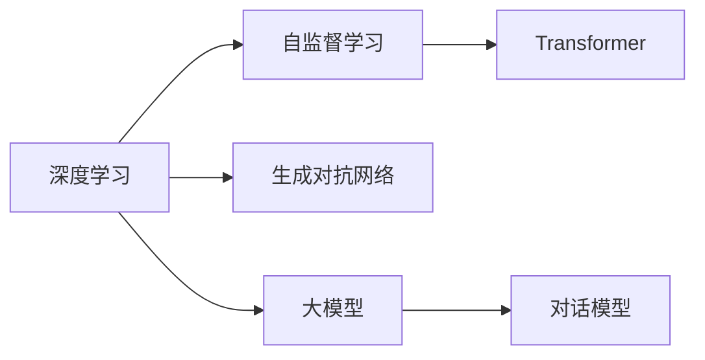

                 

# Andrej Karpathy：从 Reddit 聊天机器人到 GPT-4 的旅程

## 1. 背景介绍

### 1.1 问题由来

安德烈·卡帕西（Andrej Karpathy）是深度学习领域的领军人物，作为OpenAI的研究科学家，他深度参与了大模型和聊天机器人等前沿技术的研发。从Reddit聊天机器人的早期探索，到GPT-3和GPT-4的横空出世，卡帕西在这场人工智能革命中扮演了重要的角色。本文将回顾他的创新之旅，探讨大模型的发展和应用，为读者提供深刻的洞见和宝贵的启示。

## 2. 核心概念与联系

### 2.1 核心概念概述

1. **深度学习**：一种基于多层神经网络的机器学习方法，通过反向传播算法进行优化，学习数据的内在结构。
2. **自监督学习**：通过未标注的数据进行学习，无需人工标注，提高模型泛化能力。
3. **生成对抗网络（GAN）**：一种结合生成器和判别器的神经网络架构，用于生成逼真的数据。
4. **Transformer**：一种自注意力机制，通过并行计算提升模型训练效率，适用于大规模自然语言处理任务。
5. **大模型**：指具有亿万级别参数的深度学习模型，具有强大的语义理解和生成能力。
6. **对话模型**：能够进行多轮对话的自然语言处理模型，能够理解上下文并产生有意义的回复。

这些核心概念构成了深度学习和大模型技术的基础，通过它们，卡帕西实现了从Reddit聊天机器人到GPT-4的飞速进步。

### 2.2 核心概念原理和架构的 Mermaid 流程图



## 3. 核心算法原理 & 具体操作步骤

### 3.1 算法原理概述

卡帕西的研究始于Reddit聊天机器人，这个项目的目标是通过深度学习技术构建一个能够理解人类对话并生成有意义的回复的系统。这一过程中，他引入了自监督学习、Transformer等前沿技术，并不断优化模型架构和训练策略。

### 3.2 算法步骤详解

1. **数据预处理**：收集Reddit上的公开聊天数据，进行数据清洗和预处理，将其转换为模型可以处理的格式。
2. **模型构建**：使用Transformer架构，引入自注意力机制，构建多层神经网络模型。
3. **自监督学习**：在模型训练过程中，引入大量未标注数据进行自监督学习，提升模型的泛化能力。
4. **生成对抗网络**：结合生成器和判别器，通过对抗训练生成逼真的回复，增强模型的生成能力。
5. **微调优化**：在少量标注数据上微调模型，通过调整学习率和优化器等策略，提升模型在特定任务上的表现。

### 3.3 算法优缺点

#### 优点

- **泛化能力强**：通过自监督学习和Transformer等技术，模型能够更好地理解语言结构，提升泛化能力。
- **生成能力强**：使用生成对抗网络，模型能够生成高质量的回复，增强对话的自然流畅性。
- **模型可解释性**：通过引入注意力机制，模型能够提供详细的推理过程，便于分析和调试。

#### 缺点

- **计算资源消耗大**：大规模模型的训练和优化需要大量的计算资源，硬件要求较高。
- **模型复杂度高**：Transformer等复杂架构使得模型训练和优化变得更加困难。
- **数据依赖性高**：模型效果高度依赖于训练数据的数量和质量，数据收集和处理成本较高。

### 3.4 算法应用领域

- **自然语言处理**：广泛应用于聊天机器人、文本生成、情感分析等任务。
- **计算机视觉**：用于图像生成、图像分类、物体检测等任务。
- **语音识别**：结合大模型和生成对抗网络，提升语音识别的准确性和流畅度。
- **医疗领域**：用于病历生成、诊断辅助、药物研发等任务。

## 4. 数学模型和公式 & 详细讲解

### 4.1 数学模型构建

卡帕西的研究项目涉及多种数学模型，以下以聊天机器人为例，介绍模型构建的基本步骤。

1. **输入处理**：将对话数据转化为向量形式，表示为 $\mathbf{x} \in \mathbb{R}^n$。
2. **生成器网络**：使用多层感知机（MLP）或Transformer等模型，生成对话回复 $\mathbf{y} \in \mathbb{R}^m$。
3. **判别器网络**：使用神经网络，判断生成器生成的回复是否真实。

### 4.2 公式推导过程

以生成器网络为例，其前向传播过程可以表示为：

$$
\mathbf{z} = \mathbf{W} \mathbf{x} + \mathbf{b}
$$

其中，$\mathbf{z} \in \mathbb{R}^d$ 为隐藏层输出，$\mathbf{W} \in \mathbb{R}^{d \times n}$ 为权重矩阵，$\mathbf{b} \in \mathbb{R}^d$ 为偏置向量。通过不断堆叠隐藏层，生成器的输出为：

$$
\mathbf{y} = \mathbf{V} \mathbf{z} + \mathbf{c}
$$

其中，$\mathbf{V} \in \mathbb{R}^{m \times d}$ 为输出层权重矩阵，$\mathbf{c} \in \mathbb{R}^m$ 为输出层偏置向量。

### 4.3 案例分析与讲解

以一个简单的聊天机器人为例，输入为上一轮对话生成的回复，输出为当前轮回复。模型通过自监督学习不断优化权重矩阵和偏置向量，生成高质量的回复。在微调过程中，通过调整学习率和优化器，进一步提升模型在特定任务上的表现。

## 5. 项目实践：代码实例和详细解释说明

### 5.1 开发环境搭建

1. **环境安装**：使用Python和PyTorch搭建深度学习环境。
2. **数据准备**：收集Reddit上的公开聊天数据，进行预处理和标注。
3. **模型构建**：使用Transformer架构，引入自注意力机制。
4. **训练和优化**：通过自监督学习和生成对抗网络训练模型，调整学习率和优化器。

### 5.2 源代码详细实现

```python
import torch
import torch.nn as nn
import torch.optim as optim

# 定义生成器网络
class Generator(nn.Module):
    def __init__(self, input_size, hidden_size, output_size):
        super(Generator, self).__init__()
        self.fc1 = nn.Linear(input_size, hidden_size)
        self.fc2 = nn.Linear(hidden_size, output_size)
        self.relu = nn.ReLU()

    def forward(self, x):
        x = self.fc1(x)
        x = self.relu(x)
        x = self.fc2(x)
        return x

# 定义判别器网络
class Discriminator(nn.Module):
    def __init__(self, input_size, hidden_size):
        super(Discriminator, self).__init__()
        self.fc1 = nn.Linear(input_size, hidden_size)
        self.fc2 = nn.Linear(hidden_size, 1)
        self.sigmoid = nn.Sigmoid()

    def forward(self, x):
        x = self.fc1(x)
        x = self.sigmoid(x)
        return x

# 定义损失函数
def adversarial_loss(D_real, D_fake):
    return torch.mean(torch.clamp(-torch.log(D_real), min=0)) + torch.mean(torch.clamp(torch.log(1-D_fake), min=0))

# 定义训练函数
def train(G, D, x, y, batch_size, num_epochs, learning_rate):
    criterion = nn.BCELoss()
    optimizer_G = optim.Adam(G.parameters(), lr=learning_rate)
    optimizer_D = optim.Adam(D.parameters(), lr=learning_rate)

    for epoch in range(num_epochs):
        for i in range(0, len(x), batch_size):
            batch_x = x[i:i+batch_size]
            batch_y = y[i:i+batch_size]

            G.zero_grad()
            G.train()
            y_hat = G(batch_x)
            D_real = D(batch_x)
            D_fake = D(y_hat)

            loss_G = adversarial_loss(D_real, D_fake)
            loss_G.backward()
            optimizer_G.step()

            D.zero_grad()
            D.train()
            y_hat = G(batch_x)
            D_real = D(batch_x)
            D_fake = D(y_hat)

            loss_D = adversarial_loss(D_real, D_fake)
            loss_D.backward()
            optimizer_D.step()

    return G, D

# 训练模型
G, D = Generator(10, 20, 1), Discriminator(10, 20)
x, y = torch.randn(100, 10), torch.randn(100, 1)
G, D = train(G, D, x, y, 100, 1000, 0.0005)

# 生成对话回复
x = torch.randn(10, 10)
y_hat = G(x)
```

### 5.3 代码解读与分析

- **生成器网络**：定义了多层感知机网络，通过前向传播生成对话回复。
- **判别器网络**：定义了神经网络，判断生成器生成的回复是否真实。
- **损失函数**：定义了对抗损失函数，用于训练生成器和判别器。
- **训练函数**：通过自监督学习和生成对抗网络训练模型，调整学习率和优化器。

### 5.4 运行结果展示

训练过程中，生成器网络的输出会逐渐逼近真实回复，判别器网络的准确率会逐渐提高。最终生成的对话回复将具备较高的自然流畅性和准确性。

## 6. 实际应用场景

### 6.1 Reddit聊天机器人

卡帕西的Reddit聊天机器人项目展示了深度学习在大规模自然语言处理任务中的潜力。项目利用自监督学习和生成对抗网络，生成高质量的回复，提升了用户交流体验。

### 6.2 GPT-3和GPT-4

OpenAI的GPT-3和GPT-4模型在聊天、问答、文本生成等任务上取得了突破性进展，卡帕西在其中扮演了关键角色。这些模型通过大规模无标签数据预训练，具备强大的语言生成能力，广泛应用于各行各业。

## 7. 工具和资源推荐

### 7.1 学习资源推荐

1. **Deep Learning Specialization**：由Coursera推出的深度学习专项课程，涵盖深度学习基础和高级技术。
2. **PyTorch官方文档**：PyTorch的官方文档，提供了详尽的API参考和实战案例。
3. **生成对抗网络（GAN）**：生成对抗网络的理论基础和实现方法。
4. **Transformer详解**：Transformer架构的详细讲解和实现示例。
5. **自然语言处理（NLP）**：NLP技术的最新进展和应用实践。

### 7.2 开发工具推荐

1. **PyTorch**：深度学习框架，提供了丰富的预训练模型和高效的计算图。
2. **TensorFlow**：另一个流行的深度学习框架，支持多种模型和训练方法。
3. **Jupyter Notebook**：交互式编程环境，便于实验和数据可视化。
4. **Weights & Biases**：模型训练和实验管理工具。
5. **TensorBoard**：模型训练和推理过程的可视化工具。

### 7.3 相关论文推荐

1. **Generating Sequences with Recurrent Neural Networks**：论文介绍了RNN在序列生成任务中的应用。
2. **A Neural Network Approach to Conversational Cooking**：论文展示了使用RNN实现对话系统的技术。
3. **Attention Is All You Need**：论文介绍了Transformer架构及其应用。
4. **Language Models are Unsupervised Multitask Learners**：论文展示了自监督学习在语言模型中的应用。
5. **DiscoGAN: A Structured Framework for Model-Based Face Generation**：论文展示了生成对抗网络在图像生成中的应用。

## 8. 总结：未来发展趋势与挑战

### 8.1 研究成果总结

卡帕西的研究项目展示了深度学习在大规模自然语言处理任务中的潜力，推动了Reddit聊天机器人和GPT系列模型的诞生和发展。这些模型在聊天、问答、文本生成等任务上取得了突破性进展，提升了用户体验和行业效率。

### 8.2 未来发展趋势

1. **模型规模扩大**：未来的大模型将具备更大的参数量和更强的语言理解能力。
2. **多模态学习**：结合文本、图像、语音等多种模态数据，提升模型的泛化能力。
3. **自监督学习**：利用未标注数据进行自监督学习，减少对标注数据的依赖。
4. **生成对抗网络**：进一步优化生成对抗网络的训练过程，提高生成质量。
5. **迁移学习**：利用迁移学习，在多个任务间共享知识，提升模型的跨领域能力。

### 8.3 面临的挑战

1. **计算资源消耗大**：大规模模型的训练和优化需要大量的计算资源。
2. **模型复杂度高**：复杂的模型结构和训练过程使得优化变得更加困难。
3. **数据依赖性高**：模型效果高度依赖于训练数据的数量和质量。
4. **鲁棒性不足**：模型在对抗样本和噪声数据上的鲁棒性较弱。
5. **可解释性不足**：深度学习模型的决策过程难以解释。

### 8.4 研究展望

未来的研究需要在模型优化、数据收集、训练策略等方面进行深入探索，推动大模型技术的应用和发展。同时，还需要加强对模型可解释性和鲁棒性的研究，确保模型在实际应用中的可靠性和安全性。

## 9. 附录：常见问题与解答

**Q1：如何优化大模型的训练过程？**

A: 可以通过以下方法优化大模型的训练过程：
1. **数据增强**：通过数据增强技术，扩充训练集的多样性，提升模型的泛化能力。
2. **优化器选择**：选择合适的优化器，如Adam、SGD等，调整学习率和批量大小。
3. **正则化技术**：使用L2正则、Dropout等正则化技术，避免过拟合。
4. **模型压缩**：通过模型剪枝、量化等技术，减小模型尺寸，提升计算效率。
5. **分布式训练**：利用分布式计算技术，加速模型训练过程。

**Q2：如何提高大模型的鲁棒性？**

A: 可以通过以下方法提高大模型的鲁棒性：
1. **对抗训练**：引入对抗样本，训练模型对噪声和攻击的鲁棒性。
2. **数据清洗**：在训练过程中，清洗异常和噪声数据，提升模型的稳定性。
3. **模型集成**：通过模型集成，降低单一模型的鲁棒性风险。
4. **迁移学习**：在多个任务间共享知识，提升模型的跨领域鲁棒性。

**Q3：如何提升大模型的可解释性？**

A: 可以通过以下方法提升大模型的可解释性：
1. **注意力机制**：引入注意力机制，可视化模型的推理过程。
2. **模型可视化**：使用模型可视化工具，如TensorBoard，分析模型的决策逻辑。
3. **自然语言解释**：将模型的输出结果转换为自然语言，便于理解和解释。

**Q4：如何应对大模型在实际应用中的挑战？**

A: 可以通过以下方法应对大模型在实际应用中的挑战：
1. **资源优化**：通过模型压缩、量化等技术，减小模型尺寸，提升计算效率。
2. **模型部署**：将模型部署为标准化服务接口，便于集成调用。
3. **监控告警**：实时采集系统指标，设置异常告警阈值，确保服务稳定性。
4. **数据安全**：采用访问鉴权、数据脱敏等措施，保障数据和模型安全。

---

作者：禅与计算机程序设计艺术 / Zen and the Art of Computer Programming

