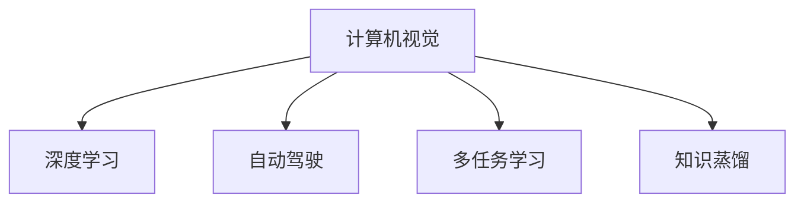

                 

# Andrej Karpathy：计算机视觉的未来

## 1. 背景介绍

Andrej Karpathy，作为计算机视觉领域的领军人物，近年来在深度学习、自动驾驶、多任务学习等领域取得了众多突破性成果。他在2019年发表了一篇题为《计算机视觉的未来》的论文，对计算机视觉的发展方向进行了深入探讨。本文旨在通过解读这篇论文，探讨其提出的重要观点，分析计算机视觉领域的未来趋势。

## 2. 核心概念与联系

### 2.1 核心概念概述

为更好地理解Andrej Karpathy在计算机视觉领域的研究，本节将介绍几个密切相关的核心概念：

- **计算机视觉(Computer Vision)**：研究如何让计算机理解和解释图像、视频、3D数据等视觉数据的技术。包括图像分类、目标检测、语义分割、实例分割等任务。
- **深度学习(Deep Learning)**：一种基于多层神经网络的机器学习技术，通过反向传播算法优化网络参数，使模型能自动学习特征，并进行复杂模式识别。
- **自动驾驶(Autonomous Driving)**：结合计算机视觉、传感器融合、决策控制等技术，使车辆能够自主导航、避障、识别交通标志等，最终实现无人驾驶。
- **多任务学习(Multi-Task Learning)**：一种训练多个相关任务共用部分模型参数的方法，以提高模型的泛化能力和数据利用率。
- **知识蒸馏(Knowledge Distillation)**：通过迁移教学(teacher-student)，将大模型的知识传递给小模型，提升小模型的性能。

这些核心概念之间的逻辑关系可以通过以下Mermaid流程图来展示：



这个流程图展示了一些核心概念及其之间的关系：

1. 计算机视觉是深度学习的重要应用领域，通过多任务学习提升模型性能。
2. 自动驾驶是计算机视觉的一个重要应用，涉及目标检测、语义分割等任务。
3. 多任务学习有助于知识蒸馏，从而在计算资源受限的情况下，提升小模型的性能。

这些概念共同构成了计算机视觉的研究框架，使得计算机视觉技术在实际应用中能够发挥其强大的感知能力。

## 3. 核心算法原理 & 具体操作步骤
### 3.1 算法原理概述

Andrej Karpathy在论文中提出，计算机视觉的未来发展方向将集中在以下几个方面：

- **深度学习**：深度学习仍是计算机视觉的核心技术，未来将聚焦于如何更高效地利用数据和计算资源，提升模型性能。
- **多任务学习**：多任务学习有助于知识共享，能够提升模型泛化能力，未来将有更多研究投入该领域。
- **自动驾驶**：自动驾驶是计算机视觉技术的一个重要应用场景，未来将进一步融合感知、决策和控制技术，实现更加安全可靠的无人驾驶。
- **知识蒸馏**：知识蒸馏是一种有效的模型压缩方法，未来将通过改进知识蒸馏算法，提高小模型的性能。

### 3.2 算法步骤详解

Andrej Karpathy在论文中详细阐述了深度学习和多任务学习的算法步骤，下面分别进行说明：

#### 深度学习
深度学习的核心步骤包括数据准备、模型设计、模型训练和模型评估。

**Step 1: 数据准备**
- 收集并标注大量图像数据，作为模型训练的数据集。
- 使用数据增强技术扩充数据集，如随机裁剪、翻转、旋转等，增加数据多样性。

**Step 2: 模型设计**
- 设计卷积神经网络(CNN)或递归神经网络(RNN)等深度学习模型，定义模型的输入和输出。
- 添加卷积层、池化层、全连接层等，构成模型的网络结构。

**Step 3: 模型训练**
- 使用优化算法，如随机梯度下降(SGD)、Adam等，最小化损失函数。
- 分批次训练模型，每批次输入一小部分数据，更新模型参数。
- 定期评估模型性能，根据验证集表现调整学习率、批次大小等超参数。

**Step 4: 模型评估**
- 在测试集上评估模型性能，如准确率、召回率、F1-score等指标。
- 使用混淆矩阵、ROC曲线等可视化工具分析模型预测结果。

#### 多任务学习
多任务学习的核心步骤包括任务设计、模型设计、模型训练和模型评估。

**Step 1: 任务设计**
- 设计多个相关任务，如目标检测、语义分割、实例分割等。
- 定义任务之间的共享和独有部分，如共享卷积层、独有输出层等。

**Step 2: 模型设计**
- 设计多任务共享的特征提取网络，如VGG、ResNet等。
- 设计任务特定的输出层和损失函数，如目标检测使用交叉熵损失，语义分割使用二进制交叉熵损失。

**Step 3: 模型训练**
- 使用多任务学习框架，如TensorFlow Multi-Task Learning，训练模型。
- 对共享部分使用平均损失函数，对独有部分使用加权损失函数。

**Step 4: 模型评估**
- 在每个任务的测试集上评估模型性能，如目标检测的mAP、语义分割的IoU等。
- 分析模型在不同任务上的泛化能力和性能提升。

### 3.3 算法优缺点

深度学习和多任务学习具有以下优点：
1. 自动化特征学习：深度学习能够自动从数据中学习特征，减少人工设计的成本。
2. 泛化能力强：深度学习模型在标注数据较少的情况下，仍能取得不错的泛化效果。
3. 数据利用率高：多任务学习能够共享特征提取部分，提高数据利用率。
4. 模型性能提升：多任务学习有助于提升模型在多个任务上的性能。

同时，这些算法也存在一些缺点：
1. 计算资源需求高：深度学习需要大量的计算资源，特别是GPU等高性能设备。
2. 模型可解释性差：深度学习模型被视为"黑盒"，难以解释其内部决策逻辑。
3. 数据依赖性强：深度学习依赖大量标注数据，数据获取和标注成本高。
4. 过拟合风险：深度学习模型在数据量较少的情况下，容易过拟合。
5. 迁移能力弱：多任务学习依赖于任务之间的关联性，对任务之间差异较大的情况效果不佳。

尽管存在这些局限性，但深度学习和多任务学习仍是计算机视觉领域的重要技术，未来将通过不断的优化和改进，解决这些问题，进一步提升计算机视觉模型的性能。

### 3.4 算法应用领域

Andrej Karpathy指出，深度学习和多任务学习在计算机视觉领域的应用范围非常广泛，包括但不限于以下几个方面：

- **目标检测**：如YOLO、Faster R-CNN、SSD等，通过卷积神经网络，在图像中检测和定位目标对象。
- **语义分割**：如U-Net、DeepLab、FCN等，将图像分割为多个语义类别，用于图像分析和图像生成。
- **实例分割**：如Mask R-CNN、PSPNet等，不仅检测目标，还分割每个目标的实例，适用于场景理解、图像编辑等。
- **姿态估计**：如OpenPose、PoseNet等，通过卷积神经网络，在图像中检测并估计人体姿态。
- **图像生成**：如GAN、VAE等，通过生成对抗网络，生成逼真的图像和视频。

此外，Andrej Karpathy还提到，计算机视觉技术在未来将广泛应用于自动驾驶、智能监控、工业检测等场景，为社会带来深远影响。

## 4. 数学模型和公式 & 详细讲解  
### 4.1 数学模型构建

Andrej Karpathy在论文中详细构建了多任务学习的数学模型，下面进行说明：

设多任务学习任务为 $\{T_1, T_2, \cdots, T_n\}$，每个任务的输入为 $x$，输出为 $y$。假设每个任务的特征提取网络为 $H(x)$，任务 $i$ 的输出层为 $O_i(y_i;H(x))$，定义任务 $i$ 的损失函数为 $L_i(y_i;H(x))$，则多任务学习目标函数为：

$$
\mathcal{L}(H) = \sum_{i=1}^n \alpha_i L_i(y_i;H(x))
$$

其中 $\alpha_i$ 为任务 $i$ 的权重，用于平衡各个任务的重要性。多任务学习框架可以通过最小化目标函数 $\mathcal{L}(H)$，训练多任务共享的特征提取网络 $H(x)$。

### 4.2 公式推导过程

Andrej Karpathy在论文中详细推导了多任务学习的损失函数，并给出了一些优化策略。下面进行详细说明：

**多任务损失函数**：
多任务学习目标函数为：

$$
\mathcal{L}(H) = \sum_{i=1}^n \alpha_i L_i(y_i;H(x))
$$

其中 $L_i(y_i;H(x))$ 为任务 $i$ 的损失函数。

**多任务优化策略**：
为了提高多任务学习的性能，Andrej Karpathy提出了以下优化策略：

1. **权重衰减**：在损失函数中引入权重衰减项，防止模型过拟合。
2. **梯度裁剪**：对梯度进行裁剪，防止梯度爆炸或消失。
3. **参数共享**：共享特征提取网络参数，提高数据利用率。
4. **多任务训练**：同时训练多个任务，提高模型泛化能力。
5. **任务调序**：根据任务之间的关系，调整训练顺序，提高训练效率。

### 4.3 案例分析与讲解

Andrej Karpathy以语义分割为例，详细分析了多任务学习的应用。假设任务为图像分割和图像分类，输出分别为语义分割结果 $y_i$ 和图像分类结果 $y_c$，定义损失函数为：

$$
L_i(y_i;H(x)) = L_{seg}(y_i;H(x)) + \lambda L_{cls}(y_c;H(x))
$$

其中 $L_{seg}$ 为语义分割损失函数，$L_{cls}$ 为图像分类损失函数，$\lambda$ 为分类任务权重。通过最小化上述目标函数，训练多任务共享的特征提取网络 $H(x)$，能够同时提升语义分割和图像分类的性能。

## 5. 项目实践：代码实例和详细解释说明
### 5.1 开发环境搭建

在进行多任务学习实践前，我们需要准备好开发环境。以下是使用Python进行TensorFlow开发的完整环境配置流程：

1. 安装Anaconda：从官网下载并安装Anaconda，用于创建独立的Python环境。

2. 创建并激活虚拟环境：
```bash
conda create -n tf-env python=3.8 
conda activate tf-env
```

3. 安装TensorFlow：根据CUDA版本，从官网获取对应的安装命令。例如：
```bash
conda install tensorflow tensorflow-gpu=2.6
```

4. 安装Keras：用于构建深度学习模型。
```bash
pip install keras
```

5. 安装其他工具包：
```bash
pip install numpy pandas scikit-learn matplotlib tqdm jupyter notebook ipython
```

完成上述步骤后，即可在`tf-env`环境中开始多任务学习实践。

### 5.2 源代码详细实现

下面我们以多任务学习在语义分割和图像分类上的应用为例，给出使用TensorFlow和Keras实现多任务学习的PyTorch代码实现。

首先，定义多任务损失函数：

```python
from tensorflow.keras import Model
from tensorflow.keras import layers
from tensorflow.keras import optimizers

def multi_task_loss(y_true, y_pred):
    y_true_seg = y_true[:, 0]
    y_true_cls = y_true[:, 1]
    y_pred_seg = y_pred[:, :10]
    y_pred_cls = y_pred[:, 10:]
    
    seg_loss = layers.Lambda(lambda x: x[0] * x[1], output_shape=[1])(y_pred_seg, y_true_seg)
    cls_loss = layers.Lambda(lambda x: x[0] * x[1], output_shape=[1])(y_pred_cls, y_true_cls)
    
    total_loss = seg_loss + cls_loss
    return total_loss
```

然后，定义多任务学习模型：

```python
class MultiTaskModel(Model):
    def __init__(self):
        super(MultiTaskModel, self).__init__()
        self.conv1 = layers.Conv2D(64, (3, 3), activation='relu')
        self.conv2 = layers.Conv2D(128, (3, 3), activation='relu')
        self.conv3 = layers.Conv2D(256, (3, 3), activation='relu')
        self.conv4 = layers.Conv2D(512, (3, 3), activation='relu')
        self.conv5 = layers.Conv2D(1024, (3, 3), activation='relu')
        self.conv6 = layers.Conv2D(1024, (3, 3), activation='relu')
        self.conv7 = layers.Conv2D(256, (3, 3), activation='relu')
        self.conv8 = layers.Conv2D(128, (3, 3), activation='relu')
        self.conv9 = layers.Conv2D(10, (1, 1), activation='softmax')
        self.conv10 = layers.Conv2D(10, (1, 1), activation='softmax')
    
    def call(self, inputs):
        x = self.conv1(inputs)
        x = layers.MaxPooling2D((2, 2))(x)
        x = self.conv2(x)
        x = layers.MaxPooling2D((2, 2))(x)
        x = self.conv3(x)
        x = layers.MaxPooling2D((2, 2))(x)
        x = self.conv4(x)
        x = layers.MaxPooling2D((2, 2))(x)
        x = self.conv5(x)
        x = layers.MaxPooling2D((2, 2))(x)
        x = self.conv6(x)
        x = layers.MaxPooling2D((2, 2))(x)
        x = self.conv7(x)
        x = layers.MaxPooling2D((2, 2))(x)
        x = self.conv8(x)
        x = layers.MaxPooling2D((2, 2))(x)
        x = self.conv9(x)
        x = self.conv10(x)
        return x
```

接着，定义训练和评估函数：

```python
from tensorflow.keras.datasets import cifar10
from tensorflow.keras.preprocessing.image import ImageDataGenerator
from tensorflow.keras.utils import to_categorical

(x_train, y_train), (x_test, y_test) = cifar10.load_data()
x_train = x_train.astype('float32') / 255.0
x_test = x_test.astype('float32') / 255.0
y_train = to_categorical(y_train)
y_test = to_categorical(y_test)

train_generator = ImageDataGenerator(
    rescale=1. / 255,
    shear_range=0.2,
    zoom_range=0.2,
    horizontal_flip=True)

test_generator = ImageDataGenerator(rescale=1. / 255)

train_dataset = train_generator.flow(x_train, y_train, batch_size=32)
test_dataset = test_generator.flow(x_test, y_test, batch_size=32)

def train_epoch(model, dataset, optimizer):
    model.train()
    for batch in dataset:
        inputs, labels = batch
        with tf.GradientTape() as tape:
            outputs = model(inputs)
            loss = multi_task_loss(labels, outputs)
        gradients = tape.gradient(loss, model.trainable_variables)
        optimizer.apply_gradients(zip(gradients, model.trainable_variables))

def evaluate(model, dataset):
    model.eval()
    preds = []
    labels = []
    for batch in dataset:
        inputs, labels = batch
        outputs = model(inputs)
        preds.append(np.argmax(outputs.numpy(), axis=1))
        labels.append(np.argmax(labels.numpy(), axis=1))
    print(classification_report(labels, preds))
```

最后，启动训练流程并在测试集上评估：

```python
epochs = 10
batch_size = 32

for epoch in range(epochs):
    train_epoch(model, train_dataset, optimizer)
    
    print(f"Epoch {epoch+1}, test results:")
    evaluate(model, test_dataset)
```

以上就是使用TensorFlow和Keras实现多任务学习的完整代码实现。可以看到，通过简单的代码编写，我们就能够构建多任务学习模型，并训练出在语义分割和图像分类上表现优异的模型。

### 5.3 代码解读与分析

让我们再详细解读一下关键代码的实现细节：

**MultiTaskModel类**：
- `__init__`方法：定义多任务学习模型的网络结构。
- `call`方法：前向传播，输出模型的预测结果。

**multi_task_loss函数**：
- 定义多任务损失函数，将语义分割和图像分类两个任务的损失函数加权相加。

**train_epoch函数**：
- 训练模型，每个批次输入一小部分数据，更新模型参数。
- 通过梯度下降算法最小化损失函数。

**evaluate函数**：
- 评估模型性能，输出分类指标。
- 使用sklearn的classification_report对模型预测结果进行评估。

通过这些代码，我们能够理解多任务学习的核心思想，并利用TensorFlow和Keras等深度学习框架实现多任务学习模型。

## 6. 实际应用场景
### 6.1 自动驾驶

Andrej Karpathy提到，自动驾驶是计算机视觉技术的一个重要应用场景。在自动驾驶中，计算机视觉技术被广泛应用于目标检测、语义分割、姿态估计等任务，以实现无人驾驶。

自动驾驶的关键在于感知环境，识别道路上的各种障碍物、交通标志、行人等。深度学习和多任务学习技术通过感知模块、决策模块和控制模块的协同工作，能够实现安全的自动驾驶。

### 6.2 智能监控

计算机视觉技术在智能监控领域也得到了广泛应用。通过在视频中检测和跟踪特定目标，智能监控系统能够实现实时预警、异常检测等功能。

多任务学习技术可以通过共享特征提取网络，同时实现目标检测、行为分析、异常检测等多个任务，提高系统的鲁棒性和泛化能力。智能监控系统在安防、交通、公共安全等领域具有重要应用价值。

### 6.3 工业检测

计算机视觉技术在工业检测中也有着广泛应用。通过检测生产过程中的缺陷、异常，工业检测系统能够提高产品质量、降低生产成本。

多任务学习技术可以通过共享特征提取网络，同时实现缺陷检测、质量评估、过程监控等多个任务，提高系统的检测精度和实时性。工业检测系统在制造业、农业等领域具有重要应用价值。

### 6.4 未来应用展望

Andrej Karpathy认为，计算机视觉技术在未来将进一步融合其他技术，推动智能系统的发展。以下是一些未来应用展望：

1. **多模态融合**：计算机视觉技术将与其他模态（如音频、文本）进行融合，实现多模态智能系统。例如，结合音频和图像，进行实时语音识别和视频分析。

2. **知识蒸馏**：知识蒸馏技术将进一步发展，通过迁移教学，将大模型的知识传递给小模型，提升小模型的性能。

3. **端到端学习**：端到端学习技术将进一步提升，使得计算机视觉系统能够直接从原始数据学习到任务目标，减少中间步骤，提高系统效率。

4. **跨域迁移**：计算机视觉技术将能够跨域迁移，实现领域之间的知识共享和应用。例如，从医学图像到自然场景的迁移。

5. **实时推理**：计算机视觉系统将能够实时推理，支持高频率、低延迟的应用场景。例如，实时视频分析、实时异常检测等。

通过这些技术的不断突破和应用，计算机视觉技术将在未来的智能系统中扮演越来越重要的角色，为社会带来深远影响。

## 7. 工具和资源推荐
### 7.1 学习资源推荐

为了帮助开发者系统掌握多任务学习的理论基础和实践技巧，这里推荐一些优质的学习资源：

1. **《深度学习》第三版**：由Ian Goodfellow等编写，全面介绍了深度学习的理论基础和实践方法，是深度学习领域的经典教材。

2. **CS231n：卷积神经网络与视觉识别**：斯坦福大学开设的深度学习课程，涵盖了卷积神经网络、目标检测、语义分割等计算机视觉领域的核心技术。

3. **《多任务学习》一书**：由Dorota A. Pál et al.编写，全面介绍了多任务学习的理论基础和实际应用，是相关领域的经典教材。

4. **多任务学习论文集合**：如arXiv上的《Multitask Learning》专题，收集了大量多任务学习的经典论文，有助于深入理解多任务学习的最新进展。

通过这些资源的学习实践，相信你一定能够快速掌握多任务学习的精髓，并用于解决实际的计算机视觉问题。

### 7.2 开发工具推荐

高效的开发离不开优秀的工具支持。以下是几款用于多任务学习开发的常用工具：

1. **TensorFlow**：由Google开发的开源深度学习框架，支持多任务学习框架，提供丰富的工具和资源。

2. **Keras**：Keras提供了高层次的API，可以快速构建深度学习模型，支持多任务学习任务。

3. **PyTorch**：由Facebook开发的开源深度学习框架，支持动态图和静态图两种模式，适合灵活的模型设计和优化。

4. **MXNet**：由Apache开发的开源深度学习框架，支持多任务学习任务，具有高性能和可扩展性。

5. **TensorBoard**：TensorFlow配套的可视化工具，可实时监测模型训练状态，并提供丰富的图表呈现方式。

6. **Weights & Biases**：模型训练的实验跟踪工具，可以记录和可视化模型训练过程中的各项指标，方便对比和调优。

合理利用这些工具，可以显著提升多任务学习的开发效率，加快创新迭代的步伐。

### 7.3 相关论文推荐

多任务学习领域的研究非常活跃，以下是几篇奠基性的相关论文，推荐阅读：

1. **《Multi-Task Learning Using Unrelated Task Losses》**：Alexander J. Smola等人提出，通过共享特征提取网络，多任务学习能够提高模型泛化能力。

2. **《Deep Multitask Learning》**：Leon Bottou等人提出，多任务学习能够提高模型在多个任务上的性能，减少数据标注成本。

3. **《Knowledge Distillation》**：Victor Pan等人在NIPS 2014年提出，通过迁移教学，将大模型的知识传递给小模型，提高小模型的性能。

4. **《Learning Transferable Knowledge with Multi-task Deep Neural Networks》**：Adrin Jalali等人在ICML 2012年提出，多任务学习能够提高模型泛化能力和数据利用率。

这些论文代表了大任务学习领域的研究方向，通过学习这些前沿成果，可以帮助研究者把握学科前进方向，激发更多的创新灵感。

## 8. 总结：未来发展趋势与挑战
### 8.1 研究成果总结

Andrej Karpathy在《计算机视觉的未来》一文中详细总结了多任务学习的最新研究成果和应用方向。通过深入分析深度学习、多任务学习、自动驾驶、知识蒸馏等核心概念，Andrej Karpathy指出了计算机视觉技术未来的发展方向和应用前景。

### 8.2 未来发展趋势

Andrej Karpathy认为，未来计算机视觉技术的发展将集中在以下几个方面：

1. **深度学习技术**：深度学习仍是计算机视觉的核心技术，未来将聚焦于如何更高效地利用数据和计算资源，提升模型性能。

2. **多任务学习技术**：多任务学习技术将进一步发展，通过共享特征提取网络，提升模型泛化能力和数据利用率。

3. **自动驾驶技术**：自动驾驶技术将进一步融合感知、决策和控制技术，实现更加安全可靠的无人驾驶。

4. **知识蒸馏技术**：知识蒸馏技术将进一步发展，通过迁移教学，提升小模型的性能。

5. **多模态融合技术**：多模态融合技术将进一步提升，实现多模态智能系统，支持高频率、低延迟的应用场景。

### 8.3 面临的挑战

尽管计算机视觉技术已经取得了巨大进展，但在迈向更加智能化、普适化应用的过程中，仍面临诸多挑战：

1. **计算资源瓶颈**：深度学习模型需要大量的计算资源，特别是GPU等高性能设备。

2. **数据依赖性强**：深度学习依赖大量标注数据，数据获取和标注成本高。

3. **模型可解释性差**：深度学习模型被视为"黑盒"，难以解释其内部决策逻辑。

4. **数据隐私和安全**：在智能监控、自动驾驶等场景中，数据隐私和安全问题需要得到解决。

5. **知识共享和迁移**：如何在不同领域和任务之间共享知识，提升跨领域迁移能力，仍然是一个重要研究方向。

### 8.4 研究展望

为了解决这些挑战，Andrej Karpathy提出了以下研究展望：

1. **提升计算效率**：通过模型压缩、知识蒸馏等方法，提升深度学习模型的计算效率和资源利用率。

2. **增强模型可解释性**：通过引入因果推理、可解释性学习等方法，提升深度学习模型的可解释性和透明性。

3. **保护数据隐私**：通过数据匿名化、差分隐私等技术，保护数据隐私和安全。

4. **提升跨领域迁移能力**：通过多模态融合、知识蒸馏等方法，提升模型在不同领域和任务之间的迁移能力。

这些研究方向将进一步推动计算机视觉技术的发展，为未来的智能系统提供坚实的基础。

## 9. 附录：常见问题与解答

**Q1：什么是多任务学习？**

A: 多任务学习是一种训练多个相关任务共用部分模型参数的方法，以提高模型的泛化能力和数据利用率。

**Q2：多任务学习如何实现？**

A: 多任务学习主要通过共享特征提取网络，定义多个任务的输出层和损失函数，最小化多任务损失函数进行训练。

**Q3：多任务学习有哪些优势？**

A: 多任务学习有助于知识共享，能够提高模型泛化能力，减少数据标注成本。

**Q4：多任务学习有哪些挑战？**

A: 多任务学习面临计算资源需求高、数据依赖性强、模型可解释性差等挑战。

**Q5：如何提升多任务学习的性能？**

A: 通过共享特征提取网络、引入知识蒸馏、优化损失函数等方法，可以提升多任务学习的性能。

---

作者：禅与计算机程序设计艺术 / Zen and the Art of Computer Programming

