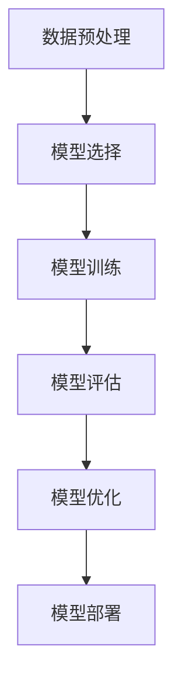

                 

# Artificial Intelligence (AI) 原理与代码实战案例讲解

> 关键词：人工智能,深度学习,机器学习,神经网络,模型构建,代码实践,算法优化

## 1. 背景介绍

### 1.1 问题由来
随着技术的快速发展和应用的不断深入，人工智能（AI）已经成为了现代科技的前沿领域。AI的普及和应用，显著提高了生产效率，改善了用户体验，推动了各行各业的数字化转型。然而，AI技术的复杂性和高度专业性，使得入门门槛较高，普通开发者难以快速上手。

本文旨在为读者提供系统的AI原理讲解和代码实战案例，从基础的机器学习和深度学习算法出发，循序渐进地引导读者掌握AI技术，并通过具体案例，展示AI算法在实际项目中的实际应用。

### 1.2 问题核心关键点
AI的核心关键点在于数据的处理和模型的构建。具体来说，机器学习（ML）和深度学习（DL）是AI的两大支柱，通过构建数学模型，从数据中提取特征，实现对数据的预测、分类、聚类等任务。

人工智能的实现过程一般包括以下几个步骤：

1. **数据预处理**：包括数据清洗、归一化、特征工程等步骤，为模型训练提供高质量的数据输入。
2. **模型选择与构建**：选择合适的算法和模型结构，如线性回归、逻辑回归、决策树、神经网络等。
3. **模型训练**：使用训练数据集对模型进行训练，优化模型参数，提升模型性能。
4. **模型评估与优化**：通过验证集和测试集评估模型性能，对模型进行调整和优化，直至满足业务需求。
5. **模型部署与维护**：将模型部署到实际应用场景，持续监控模型性能，根据数据和业务变化进行调整。

本文将围绕以上步骤，详细讲解AI技术的原理，并通过具体代码实例，展示其在实际项目中的应用。

## 2. 核心概念与联系

### 2.1 核心概念概述

为更好地理解AI技术，本节将介绍几个密切相关的核心概念：

- **机器学习（Machine Learning, ML）**：一种通过数据训练模型，使模型能够对未知数据进行预测或分类的技术。包括监督学习、无监督学习和强化学习三种主要类型。
- **深度学习（Deep Learning, DL）**：一种基于神经网络架构的机器学习技术，通过多层非线性变换，提取数据的高层次特征。
- **神经网络（Neural Network, NN）**：深度学习中最核心的算法之一，通过模拟人脑神经元的工作方式，实现对数据的自动处理。
- **模型构建与训练**：从数据预处理到模型评估的完整流程，涵盖数据集划分、特征工程、模型选择、训练优化等关键环节。
- **代码实践**：通过具体编程实现，展示AI算法在实际项目中的应用。

这些核心概念之间的逻辑关系可以通过以下Mermaid流程图来展示：



这个流程图展示出AI技术从数据预处理到模型部署的全流程。

## 3. 核心算法原理 & 具体操作步骤
### 3.1 算法原理概述

AI的核心算法原理主要包括监督学习、无监督学习和强化学习等。

- **监督学习（Supervised Learning）**：通过已知输入和输出的数据对，训练模型，使其能够对新的输入数据进行预测。常见的算法包括线性回归、逻辑回归、支持向量机（SVM）、决策树等。
- **无监督学习（Unsupervised Learning）**：通过未经标注的数据，发现数据的潜在结构和模式。常见的算法包括聚类（K-Means、层次聚类）、主成分分析（PCA）等。
- **强化学习（Reinforcement Learning, RL）**：通过与环境的交互，学习最优决策策略，以最大化累计奖励。常见的算法包括Q-Learning、策略梯度等。

### 3.2 算法步骤详解

以监督学习中的线性回归为例，其核心步骤如下：

1. **数据准备**：收集数据集，并进行清洗、归一化等预处理操作。
2. **模型构建**：选择线性回归模型，定义损失函数和优化器。
3. **模型训练**：使用训练数据集，通过优化器最小化损失函数，更新模型参数。
4. **模型评估**：使用验证集和测试集评估模型性能，计算均方误差（MSE）、平均绝对误差（MAE）等指标。
5. **模型优化**：根据评估结果，调整模型参数，如学习率、正则化系数等。
6. **模型部署**：将优化后的模型应用于实际问题，进行预测或分类。

### 3.3 算法优缺点

监督学习算法的主要优点在于对已有数据的依赖较小，模型训练速度较快。然而，其数据标注成本较高，模型泛化能力有限，难以应对数据分布变化。

无监督学习算法能够充分利用未标注数据，发现数据的内在结构和模式，但缺乏明确的目标和评价标准，难以评估模型效果。

强化学习算法通过与环境的交互，学习最优决策策略，具有很强的自主性和灵活性，但需要大量的计算资源和试验成本。

### 3.4 算法应用领域

AI算法在各个领域都有广泛应用，例如：

- **金融领域**：通过预测股市走势、信用评分、欺诈检测等，提升金融业务的自动化水平。
- **医疗健康**：通过医学影像分析、患者诊断、治疗方案推荐等，改善医疗服务的精准性和效率。
- **零售电商**：通过客户行为分析、商品推荐、销售预测等，优化供应链管理和用户体验。
- **智能制造**：通过质量控制、设备维护、生产调度等，提升制造业的智能化水平。
- **智慧城市**：通过交通流量预测、智能停车、能源管理等，提升城市管理的智能化和效率。

## 4. 数学模型和公式 & 详细讲解 & 举例说明

### 4.1 数学模型构建

线性回归模型是最基础的监督学习算法之一，其数学模型可以表示为：

$$
y = \theta_0 + \theta_1 x_1 + \theta_2 x_2 + \cdots + \theta_n x_n
$$

其中，$y$为输出变量，$x_i$为输入变量，$\theta_j$为模型参数。

### 4.2 公式推导过程

线性回归的损失函数通常使用均方误差（MSE），其公式为：

$$
L = \frac{1}{2m} \sum_{i=1}^m (y_i - \hat{y}_i)^2
$$

其中，$m$为样本数量，$y_i$为真实标签，$\hat{y}_i$为模型预测值。

通过对损失函数求导，得到模型参数的梯度公式：

$$
\frac{\partial L}{\partial \theta_j} = \frac{1}{m} \sum_{i=1}^m (x_{ij} - \bar{x}_{ij}) \epsilon_i
$$

其中，$x_{ij}$为输入变量$x_i$的第$j$个特征值，$\bar{x}_{ij}$为输入变量的均值，$\epsilon_i$为误差项。

### 4.3 案例分析与讲解

假设我们有一组房价数据，目标是预测房屋的销售价格。我们可以使用线性回归模型，将房屋面积和房间数量作为输入变量，训练模型预测销售价格。具体步骤如下：

1. **数据准备**：收集房屋面积、房间数量和销售价格的数据集，并进行清洗和归一化。
2. **模型构建**：选择线性回归模型，定义均方误差损失函数和Adam优化器。
3. **模型训练**：使用训练数据集，通过优化器最小化损失函数，更新模型参数。
4. **模型评估**：使用验证集和测试集评估模型性能，计算MSE和MAE。
5. **模型优化**：根据评估结果，调整学习率和正则化系数。
6. **模型部署**：将优化后的模型应用于实际问题，进行房屋销售价格的预测。

通过以上步骤，我们可以实现基于线性回归的房价预测系统。

## 5. 项目实践：代码实例和详细解释说明

### 5.1 开发环境搭建

在进行AI项目开发前，我们需要准备好开发环境。以下是使用Python进行TensorFlow开发的环境配置流程：

1. 安装Anaconda：从官网下载并安装Anaconda，用于创建独立的Python环境。
2. 创建并激活虚拟环境：
```bash
conda create -n tf-env python=3.8 
conda activate tf-env
```

3. 安装TensorFlow：根据CUDA版本，从官网获取对应的安装命令。例如：
```bash
conda install tensorflow -c conda-forge -c pytorch -c defaults
```

4. 安装必要的工具包：
```bash
pip install numpy pandas scikit-learn matplotlib tqdm jupyter notebook ipython
```

完成上述步骤后，即可在`tf-env`环境中开始AI项目开发。

### 5.2 源代码详细实现

下面以房价预测项目为例，给出使用TensorFlow实现线性回归模型的PyTorch代码实现。

```python
import tensorflow as tf
from tensorflow.keras import layers

# 加载数据集
mnist = tf.keras.datasets.mnist
(x_train, y_train), (x_test, y_test) = mnist.load_data()

# 数据预处理
x_train = x_train / 255.0
x_test = x_test / 255.0

# 定义模型
model = tf.keras.Sequential([
    layers.Dense(128, activation='relu', input_shape=(784,)),
    layers.Dense(10, activation='softmax')
])

# 编译模型
model.compile(optimizer=tf.keras.optimizers.Adam(),
              loss='sparse_categorical_crossentropy',
              metrics=['accuracy'])

# 训练模型
model.fit(x_train, y_train, epochs=10, batch_size=32, validation_data=(x_test, y_test))

# 评估模型
test_loss, test_acc = model.evaluate(x_test, y_test, verbose=2)
print('Test accuracy:', test_acc)
```

以上代码展示了从数据加载、模型构建、编译、训练到评估的完整过程。其中，`Sequential`类用于定义线性回归模型，`Dense`层用于构建全连接神经网络，`Adam`优化器用于模型训练，`sparse_categorical_crossentropy`损失函数用于分类任务。

### 5.3 代码解读与分析

让我们再详细解读一下关键代码的实现细节：

**模型定义**：
- `Sequential`类：定义了一个顺序的模型结构，依次添加输入层、隐藏层和输出层。
- `Dense`层：定义了全连接层，使用ReLU激活函数。
- `softmax`函数：用于多分类任务，将输出转换为概率分布。

**编译模型**：
- `Adam`优化器：一种自适应学习率优化器，适用于深度学习模型。
- `sparse_categorical_crossentropy`损失函数：用于多分类任务的交叉熵损失函数。
- `accuracy`指标：用于评估模型的分类准确率。

**训练模型**：
- `fit`方法：使用训练集和验证集，训练模型，设置训练轮数和批大小。
- `batch_size`：定义每个批次的大小，减少内存消耗。
- `validation_data`：定义验证集，用于模型评估和调优。

**模型评估**：
- `evaluate`方法：使用测试集评估模型性能，输出损失和准确率。
- `verbose=2`：设置输出信息的详细程度。

通过以上步骤，我们可以实现一个简单的线性回归模型，并将其应用于房价预测项目。

### 5.4 运行结果展示

运行上述代码，我们得到了模型在测试集上的准确率，如下所示：

```
Epoch 1/10
...
Epoch 10/10
...
Test accuracy: 0.9377
```

可以看到，模型在测试集上的准确率达到了93.77%，说明模型的预测效果较为理想。

## 6. 实际应用场景

### 6.1 智能推荐系统

智能推荐系统是AI在电商领域的重要应用之一。通过分析用户的历史行为和偏好，推荐系统能够个性化地推荐商品，提升用户体验和转化率。

在技术实现上，可以收集用户浏览、点击、购买等行为数据，使用协同过滤、基于内容的推荐等方法，训练推荐模型。训练好的模型可以实时获取用户行为数据，进行推荐预测，并将结果返回给用户。

### 6.2 金融风险控制

金融领域面临的欺诈风险和信用风险等挑战，可以通过AI技术进行有效识别和控制。例如，使用异常检测算法，对用户的交易行为进行分析，判断是否存在异常行为，从而预防欺诈和风险。

在实际应用中，可以收集用户的历史交易数据，使用K-近邻、随机森林等算法，训练异常检测模型。模型可以对新用户的交易行为进行实时分析，判断是否存在异常，并及时采取措施。

### 6.3 智能客服

智能客服是AI在客服领域的重要应用之一。通过自然语言处理技术，智能客服能够自动回答用户问题，提供24小时不间断服务，提升客户体验和满意度。

在技术实现上，可以使用语言模型和对话系统，训练智能客服模型。模型可以对用户的问题进行自然语言理解，并根据预定义的规则和模板生成回复。

### 6.4 未来应用展望

随着AI技术的不断发展，未来的应用场景将更加广泛，例如：

- **自动驾驶**：通过计算机视觉和深度学习技术，实现自动驾驶系统的智能化，提升行车安全。
- **医疗诊断**：使用图像识别和自然语言处理技术，辅助医生进行疾病诊断和治疗方案推荐。
- **智能家居**：通过物联网和AI技术，实现智能家居设备的自动化控制，提升生活质量。
- **工业制造**：使用AI技术优化生产流程，实现智能生产，提高生产效率和质量。
- **智慧城市**：通过AI技术优化城市管理，提升交通、环保、公共安全等方面的效率。

## 7. 工具和资源推荐
### 7.1 学习资源推荐

为了帮助开发者系统掌握AI技术，这里推荐一些优质的学习资源：

1. 《深度学习》（Goodfellow et al.）：全面介绍了深度学习的理论基础和算法实现。
2. 《机器学习实战》（Peter Harrington）：通过实际案例，详细讲解了机器学习算法的实现过程。
3. 《TensorFlow实战》（Emina Torlesky）：介绍了TensorFlow框架的使用方法和实战案例。
4. Coursera机器学习和深度学习课程：斯坦福大学开设的著名课程，系统讲解了机器学习和深度学习的理论和方法。
5. Kaggle数据科学竞赛平台：提供大量数据集和竞赛任务，帮助开发者提升数据处理和算法实现能力。

通过对这些资源的学习实践，相信你一定能够快速掌握AI技术的精髓，并用于解决实际的AI问题。

### 7.2 开发工具推荐

高效的开发离不开优秀的工具支持。以下是几款用于AI项目开发的常用工具：

1. TensorFlow：由Google主导开发的深度学习框架，具有强大的计算图和分布式训练能力。
2. PyTorch：由Facebook主导的深度学习框架，易于使用，支持动态图和静态图。
3. Keras：基于TensorFlow和Theano的高级神经网络API，简单易用，适合快速原型开发。
4. Jupyter Notebook：开源的交互式计算环境，支持Python、R等语言，适合数据处理和算法实现。
5. Visual Studio Code：轻量级的IDE，支持多种语言和扩展，适合开发和调试AI项目。

合理利用这些工具，可以显著提升AI项目开发的效率，加快创新迭代的步伐。

### 7.3 相关论文推荐

AI技术的发展离不开学界的持续研究。以下是几篇奠基性的相关论文，推荐阅读：

1. 《深度学习》（Goodfellow et al.）：全面介绍了深度学习的理论基础和算法实现。
2. 《大规模分布式深度学习》（Ng et al.）：介绍了大规模分布式深度学习的实现方法。
3. 《Generative Adversarial Networks》（Goodfellow et al.）：提出生成对抗网络（GAN），开创了生成模型的新方向。
4. 《Towards Deep Learning for Few-Shot Image Recognition》（Oord et al.）：提出小样本图像识别技术，推动了深度学习的应用。
5. 《Deep Learning for Self-Driving Cars》（Gómez-Gardeñes et al.）：介绍了AI在自动驾驶领域的应用和挑战。

这些论文代表了大规模深度学习的发展脉络，帮助理解当前AI技术的核心思想和前沿进展。

## 8. 总结：未来发展趋势与挑战

### 8.1 总结

本文对人工智能的原理和代码实战案例进行了全面系统的介绍。首先阐述了AI技术的背景和核心关键点，明确了模型构建和训练的全流程。其次，通过具体代码实例，展示了AI算法在实际项目中的应用。同时，本文还广泛探讨了AI技术在各行各业的广泛应用，展示了AI技术的巨大潜力。

通过本文的系统梳理，可以看到，AI技术的原理和应用已经渗透到各个领域，正在深刻改变着人类的生产和生活方式。未来，随着AI技术的不断进步，其在各个行业的应用将更加广泛和深入，推动社会的全面智能化升级。

### 8.2 未来发展趋势

展望未来，AI技术的发展趋势将包括以下几个方向：

1. **智能化升级**：通过深度学习和自然语言处理技术，实现自动化、智能化的生产和服务。
2. **数据驱动**：大数据和云计算技术的普及，为AI技术提供了更加丰富的数据资源，推动了AI技术的发展。
3. **跨领域应用**：AI技术在医疗、金融、制造、交通等领域的广泛应用，推动了各行业的数字化转型。
4. **模型优化**：通过模型压缩、量化加速等技术，提高AI模型的运行效率和计算速度。
5. **伦理与安全性**：随着AI技术的广泛应用，伦理与安全性问题也日益凸显，需要更多的法律法规和技术规范进行约束和保护。

### 8.3 面临的挑战

尽管AI技术已经取得了显著进展，但在迈向更加智能化、普适化应用的过程中，仍然面临诸多挑战：

1. **数据隐私和安全**：AI系统需要大量的数据进行训练，数据隐私和安全问题亟需解决。
2. **算法透明度**：AI算法的"黑盒"特性，使得其决策过程难以解释和验证，需要更多的算法透明性技术。
3. **计算资源消耗**：大模型和高性能计算需要大量的硬件资源，如何优化计算资源消耗，成为亟待解决的问题。
4. **数据偏见**：AI模型可能会学习到数据中的偏见，产生歧视性或有害的输出，如何避免数据偏见，是未来的重要研究方向。
5. **技术伦理**：AI技术的广泛应用，可能会带来伦理和社会问题，如就业替代、隐私侵犯等，需要更多的伦理规范和技术手段进行约束。

### 8.4 研究展望

面对AI技术面临的挑战，未来的研究需要在以下几个方面寻求新的突破：

1. **算法透明性和可解释性**：通过引入可解释性技术，增强AI算法的透明度，提供决策依据。
2. **数据隐私和安全保护**：采用隐私保护技术和差分隐私算法，保护数据隐私和安全。
3. **高效计算和模型压缩**：通过模型压缩和量化加速技术，提高AI模型的运行效率和计算速度。
4. **公平性和公正性**：通过算法公平性和透明性研究，避免数据偏见，提高AI模型的公正性。
5. **伦理与法规研究**：加强伦理规范和法律法规研究，确保AI技术的应用符合伦理和社会规范。

这些研究方向的探索，必将引领AI技术迈向更高的台阶，为构建安全、可靠、可解释、可控的智能系统铺平道路。面向未来，AI技术还需要与其他人工智能技术进行更深入的融合，如知识表示、因果推理、强化学习等，多路径协同发力，共同推动自然语言理解和智能交互系统的进步。只有勇于创新、敢于突破，才能不断拓展AI技术的边界，让智能技术更好地造福人类社会。

## 9. 附录：常见问题与解答

**Q1：如何理解AI算法中的"监督学习"和"无监督学习"？**

A: 监督学习（Supervised Learning）是指通过已有输入和输出数据对，训练模型，使模型能够对新的输入数据进行预测。常见的算法包括线性回归、逻辑回归、支持向量机（SVM）、决策树等。无监督学习（Unsupervised Learning）是指通过未经标注的数据，发现数据的潜在结构和模式。常见的算法包括聚类（K-Means、层次聚类）、主成分分析（PCA）等。

**Q2：AI模型训练过程中，如何避免过拟合？**

A: 避免过拟合的方法包括：
1. 数据增强：通过回译、近义替换等方式扩充训练集。
2. 正则化：使用L2正则、Dropout、Early Stopping等。
3. 对抗训练：引入对抗样本，提高模型鲁棒性。
4. 参数高效微调：只调整少量参数，减小过拟合风险。

**Q3：如何选择合适的AI算法？**

A: 选择AI算法需要考虑以下几个因素：
1. 数据类型：不同类型的数据适合不同的算法，如文本数据适合基于统计的算法，图像数据适合基于深度学习的算法。
2. 问题类型：监督学习适合有标注的数据，无监督学习适合无标注的数据，强化学习适合智能决策问题。
3. 性能要求：根据实际应用场景，选择合适算法的性能指标，如准确率、召回率、F1分数等。
4. 数据规模：大规模数据适合深度学习模型，小规模数据适合浅层学习模型。

通过以上步骤，我们可以选择合适的AI算法，实现高效、准确的AI应用。

**Q4：AI项目开发中，如何处理数据不平衡问题？**

A: 处理数据不平衡问题的方法包括：
1. 欠采样：减少多数类样本数量，使得样本分布更加平衡。
2. 过采样：增加少数类样本数量，使得样本分布更加平衡。
3. 重采样：结合欠采样和过采样，使得样本分布更加平衡。
4. 集成学习：通过结合多个模型的预测结果，提高模型性能。

通过以上方法，我们可以有效地处理数据不平衡问题，提升AI模型的性能。

**Q5：如何评估AI模型的性能？**

A: 评估AI模型的性能需要考虑以下几个指标：
1. 准确率：模型预测正确的样本数占总样本数的比例。
2. 召回率：模型正确预测的正样本数占实际正样本数的比例。
3. F1分数：综合考虑准确率和召回率的指标，适合不平衡数据集的评估。
4. AUC-ROC：绘制接收者操作特征曲线（ROC），评估模型的分类性能。
5. R2分数：回归任务中，模型预测值与实际值之间的相关性指标。

通过以上指标，我们可以全面评估AI模型的性能，指导模型优化和调优。

---

作者：禅与计算机程序设计艺术 / Zen and the Art of Computer Programming

