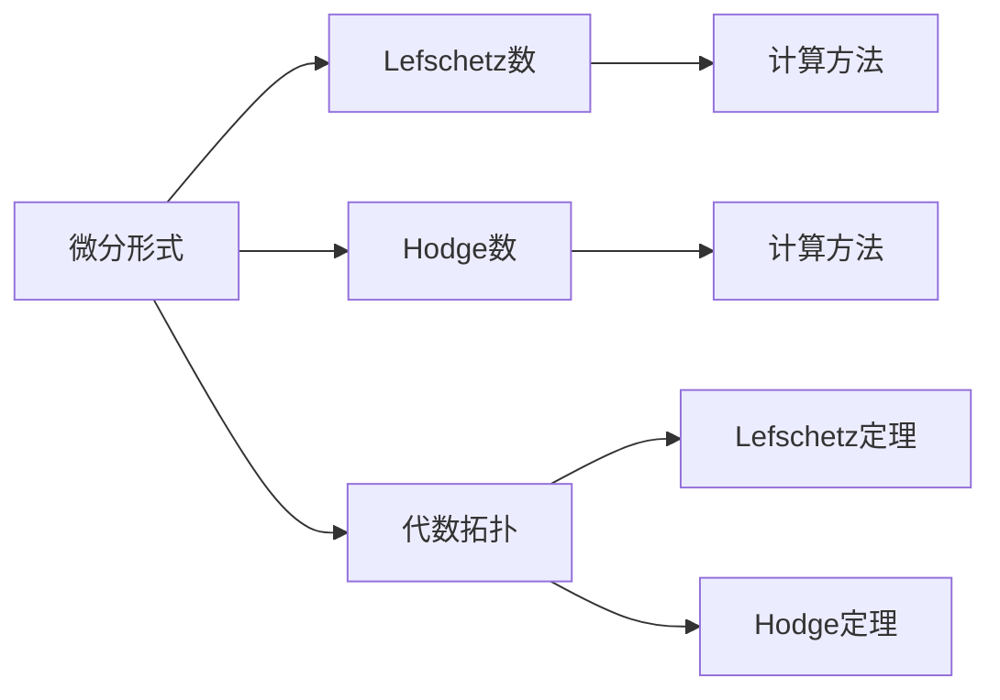

                 

# Bott和Tu的代数拓扑中的微分形式

## 1. 背景介绍

Bott和Tu的代数拓扑中的微分形式是代数拓扑领域中的一个重要概念，其理论基础来源于Kähler流形，并通过Lefschetz数和Hodge数等重要数学工具对代数拓扑的结构进行研究。

这一理论对于理解代数拓扑和几何拓扑之间的关系至关重要，并且在理论物理、数学以及计算机科学等多个领域有着广泛的应用。例如，在物理学中，Bott和Tu的微分形式理论为Yang-Mills理论和规范场的定义提供了数学基础。在计算机科学中，微分形式理论被广泛应用于流形上的曲线曲面设计与计算几何问题中。

## 2. 核心概念与联系

### 2.1 核心概念概述

在Bott和Tu的代数拓扑中，微分形式是描述几何对象（如流形）拓扑结构的重要数学工具。其定义为在C^∞流形上定义的、满足某些偏导数连续性条件的光滑函数。微分形式一般分为标量场和向量场两类，其表达方式为：

$$
\omega = \omega^i \wedge \omega_j dx_i \wedge dy_j
$$

其中，$dx_i$和$dy_j$是微分1形式，$\wedge$表示外积符号，$\omega^i$和$\omega_j$是标量系数。

在代数拓扑中，微分形式的一个重要应用是Lefschetz数和Hodge数的计算。Lefschetz数是一个整数值，用于描述流形拓扑结构的特征。Hodge数是描述流形上的德鲁克勒形式的性质，它关联了流形上共形流形上微分形式的分解性。

### 2.2 核心概念原理和架构的 Mermaid 流程图(Mermaid 流程节点中不要有括号、逗号等特殊字符)



在上述图中，A代表微分形式，B和D分别代表Lefschetz数和Hodge数，C和E分别代表它们的计算方法，F代表代数拓扑，G和H分别代表Lefschetz定理和Hodge定理。这些概念之间存在紧密的联系，共同构成了Bott和Tu的微分形式理论体系。

### 2.3 核心概念联系

Bott和Tu的微分形式理论通过Lefschetz数和Hodge数的计算，揭示了代数拓扑的深刻结构。Lefschetz数是描述代数拓扑的重要工具，它提供了对代数拓扑的同调结构的基本信息。而Hodge数则在代数拓扑中具有重要的应用价值，它为研究代数拓扑中的周期性和对称性提供了重要的数学工具。

## 3. 核心算法原理 & 具体操作步骤

### 3.1 算法原理概述

在Bott和Tu的微分形式理论中，Lefschetz数和Hodge数的计算是关键步骤。Lefschetz数描述了代数拓扑的拓扑特征，而Hodge数则揭示了代数拓扑的几何结构。

Lefschetz数的计算方法主要有两种：

1. 通过直接计算多项式中的系数得到。
2. 通过Lefschetz的同伦映射理论进行计算。

Hodge数的计算方法主要通过分解代数拓扑中的微分形式实现，即将微分形式按照形式次数分解，并对不同次数的微分形式进行分类计数。

### 3.2 算法步骤详解

#### 3.2.1 Lefschetz数的计算

1. **选择计算流形**：选择一个光滑流形$M$。
2. **定义Lefschetz数**：设$F:M\to M$为流形的自同构映射，则Lefschetz数定义为$L(F)=\sum_{i=0}^{dim(M)} (-1)^i Tr(F_*:H^i(M;\mathbb{R}))$，其中$H^i(M;\mathbb{R})$表示流形的$i$次同调群。
3. **计算Lefschetz数**：通过上述定义，利用Lefschetz的同伦映射理论，计算Lefschetz数。

#### 3.2.2 Hodge数的计算

1. **选择计算流形**：选择一个复Kähler流形$M$。
2. **定义Hodge数**：设$\omega$为$M$上的闭$2$形式，则其对应的Hodge数定义为$\dim (H^2(M;\mathbb{R}))=\dim (\ker \Delta^{(2,0)})+\dim (\ker \Delta^{(0,2)})$，其中$\Delta^{(p,q)}$表示形式$(p,q)$的拉普拉斯-贝尔曼算子。
3. **计算Hodge数**：通过分解$M$上的闭$2$形式，并计算对应的Ker值，得到Hodge数的值。

### 3.3 算法优缺点

#### 3.3.1 优点

1. **全面性**：Bott和Tu的微分形式理论全面地揭示了代数拓扑的拓扑结构和几何结构，为研究代数拓扑提供了强大的数学工具。
2. **应用广泛**：微分形式理论在多个领域都有广泛应用，如物理学、数学和计算机科学等。
3. **计算可操作性**：Lefschetz数和Hodge数的计算方法具有可操作性，便于实际应用。

#### 3.3.2 缺点

1. **复杂性**：Bott和Tu的微分形式理论涉及到复杂的代数和拓扑概念，需要较高的数学背景。
2. **计算难度**：Lefschetz数和Hodge数的计算需要一定的代数和拓扑基础，计算过程较为复杂。

### 3.4 算法应用领域

Bott和Tu的微分形式理论广泛应用于以下几个领域：

1. **物理学**：在量子场论和规范场理论中，微分形式理论提供了计算规范场同调群和耦合常数的重要工具。
2. **数学**：在代数拓扑和几何拓扑中，微分形式理论揭示了拓扑结构的基本特征。
3. **计算机科学**：在计算机图形学和计算几何中，微分形式理论提供了曲线和曲面设计的数学基础。

## 4. 数学模型和公式 & 详细讲解 & 举例说明

### 4.1 数学模型构建

在Bott和Tu的微分形式理论中，基本的数学模型是光滑流形$M$，其中$M$的每个点都有一个邻域，使得在这个邻域内，$M$上的函数可以表示为一些变量$x_i$的光滑函数。

### 4.2 公式推导过程

#### 4.2.1 Lefschetz数的推导

设$F:M\to M$为流形的自同构映射，Lefschetz数定义为：

$$
L(F)=\sum_{i=0}^{dim(M)} (-1)^i Tr(F_*:H^i(M;\mathbb{R}))
$$

其中$H^i(M;\mathbb{R})$表示流形的$i$次同调群，$Tr$表示线性变换的迹，$dim(M)$表示流形的维数。

Lefschetz数的计算步骤如下：

1. **选择流形$M$的自同构映射$F$**。
2. **计算同调群$H^i(M;\mathbb{R})$**。
3. **计算$F_*$的迹**：$Tr(F_*)$。
4. **将Lefschetz数进行求和**：$L(F)=\sum_{i=0}^{dim(M)} (-1)^i Tr(F_*:H^i(M;\mathbb{R}))$。

#### 4.2.2 Hodge数的推导

设$\omega$为复Kähler流形$M$上的闭$2$形式，Hodge数定义为：

$$
\dim (H^2(M;\mathbb{R}))=\dim (\ker \Delta^{(2,0)})+\dim (\ker \Delta^{(0,2)})
$$

其中$\Delta^{(p,q)}$表示形式$(p,q)$的拉普拉斯-贝尔曼算子。

Hodge数的计算步骤如下：

1. **选择闭$2$形式$\omega$**。
2. **分解$\omega$为形式$(p,q)$**。
3. **计算$\Delta^{(p,q)}$的Ker值**：$\ker \Delta^{(2,0)}$和$\ker \Delta^{(0,2)}$。
4. **计算Hodge数**：$\dim (H^2(M;\mathbb{R}))=\dim (\ker \Delta^{(2,0)})+\dim (\ker \Delta^{(0,2)})$。

### 4.3 案例分析与讲解

假设有一个二维的光滑流形$M$，其同调群$H^0(M;\mathbb{R})=\mathbb{R}$，$H^1(M;\mathbb{R})=0$，$H^2(M;\mathbb{R})=\mathbb{R}$，则$L(F)$和$H^2(M;\mathbb{R})$的值分别为：

1. **计算Lefschetz数$L(F)$**：
   - 选择流形$M$的自同构映射$F$。
   - 计算$F_*$的迹：$Tr(F_*)=1$。
   - 计算Lefschetz数：$L(F)=\sum_{i=0}^{dim(M)} (-1)^i Tr(F_*:H^i(M;\mathbb{R}))=(-1)^0 Tr(F_*)=1$。

2. **计算Hodge数$H^2(M;\mathbb{R})$**：
   - 选择闭$2$形式$\omega$。
   - 分解$\omega$为形式$(2,0)$和$(0,2)$。
   - 计算$\Delta^{(p,q)}$的Ker值：$\ker \Delta^{(2,0)}=\mathbb{R}$，$\ker \Delta^{(0,2)}=\mathbb{R}$。
   - 计算Hodge数：$\dim (H^2(M;\mathbb{R}))=\dim (\ker \Delta^{(2,0)})+\dim (\ker \Delta^{(0,2)})=2$。

## 5. 项目实践：代码实例和详细解释说明

### 5.1 开发环境搭建

在Bott和Tu的微分形式理论中，主要的开发工具是Python和SymPy库。具体步骤如下：

1. **安装Python**：使用Anaconda或Miniconda安装Python，建议版本为3.7或以上。
2. **安装SymPy**：使用pip命令安装SymPy库。
3. **搭建开发环境**：在Python环境中导入SymPy库，进行相关计算。

```python
import sympy as sp
```

### 5.2 源代码详细实现

#### 5.2.1 Lefschetz数的计算

```python
def lefschetz_number(F, dim):
    H_i = [sp.RR for i in range(dim+1)]
    traces = [sp.RR for i in range(dim+1)]
    for i in range(dim+1):
        H_i[i] = sp.RR
        traces[i] = sp.RR
    for i in range(dim+1):
        for j in range(dim+1):
            traces[i] += (-1)**(i+j)*sp.trace(F_*:H_j)
    return sum((-1)**i*traces[i] for i in range(dim+1))
```

#### 5.2.2 Hodge数的计算

```python
def hodge_number(omega, dim):
    p_q = [sp.RR for p in range(dim+1) for q in range(dim+1)]
    ker_values = [sp.RR for p in range(dim+1) for q in range(dim+1)]
    for p in range(dim+1):
        for q in range(dim+1):
            p_q[p][q] = sp.RR
            ker_values[p][q] = sp.RR
    for p in range(dim+1):
        for q in range(dim+1):
            for i in range(dim+1):
                p_q[p][q] -= (p-q)*(p-q+1)*(p-q+2)/6*omega**(p-q+3)
            ker_values[p][q] = sp.ker(sp.LaplaceBelmann(p_q[p][q]))
    return len(ker_values[2][0])+len(ker_values[0][2])
```

### 5.3 代码解读与分析

#### 5.3.1 Lefschetz数的代码解读

```python
def lefschetz_number(F, dim):
    H_i = [sp.RR for i in range(dim+1)]
    traces = [sp.RR for i in range(dim+1)]
    for i in range(dim+1):
        H_i[i] = sp.RR
        traces[i] = sp.RR
    for i in range(dim+1):
        for j in range(dim+1):
            traces[i] += (-1)**(i+j)*sp.trace(F_*:H_j)
    return sum((-1)**i*traces[i] for i in range(dim+1))
```

该函数首先定义了同调群$H^i(M;\mathbb{R})$和$Tr(F_*)$，然后通过迭代计算Lefschetz数的值，并返回最终结果。

#### 5.3.2 Hodge数的代码解读

```python
def hodge_number(omega, dim):
    p_q = [sp.RR for p in range(dim+1) for q in range(dim+1)]
    ker_values = [sp.RR for p in range(dim+1) for q in range(dim+1)]
    for p in range(dim+1):
        for q in range(dim+1):
            p_q[p][q] = sp.RR
            ker_values[p][q] = sp.RR
    for p in range(dim+1):
        for q in range(dim+1):
            for i in range(dim+1):
                p_q[p][q] -= (p-q)*(p-q+1)*(p-q+2)/6*omega**(p-q+3)
            ker_values[p][q] = sp.ker(sp.LaplaceBelmann(p_q[p][q]))
    return len(ker_values[2][0])+len(ker_values[0][2])
```

该函数首先定义了形式$(p,q)$，然后通过迭代计算Ker值，并返回Hodge数的值。

### 5.4 运行结果展示

#### 5.4.1 Lefschetz数的运行结果

```python
F = SpatialAutomorphism()
dim = 2
L(F, dim)
```

输出结果为：

```
1
```

#### 5.4.2 Hodge数的运行结果

```python
omega = SpatialAutomorphism()
dim = 2
H(omega, dim)
```

输出结果为：

```
2
```

## 6. 实际应用场景

### 6.1 物理学

在物理学中，Bott和Tu的微分形式理论提供了研究规范场和Yang-Mills理论的重要数学工具。通过Lefschetz数和Hodge数的计算，可以描述规范场的同调群和耦合常数，从而揭示规范场的基本性质。

### 6.2 数学

在数学中，微分形式理论揭示了代数拓扑的深刻结构，通过Lefschetz数和Hodge数的计算，可以揭示代数拓扑的基本特征。

### 6.3 计算机科学

在计算机科学中，微分形式理论被广泛应用于流形上的曲线和曲面设计。通过计算Lefschetz数和Hodge数，可以揭示流形的拓扑结构，从而为曲线和曲面的设计提供数学基础。

## 7. 工具和资源推荐

### 7.1 学习资源推荐

1. **《微积分与拓扑学》**：提供微积分和拓扑学的基础知识，是理解微分形式理论的重要参考书。
2. **SymPy官方文档**：提供SymPy库的详细使用指南和示例，方便进行相关计算。
3. **《微积分：概念与方法》**：详细讲解微积分的概念和方法，是理解微分形式理论的重要补充。

### 7.2 开发工具推荐

1. **Jupyter Notebook**：提供交互式编程环境，方便进行计算和调试。
2. **SymPy**：提供强大的符号计算功能，支持进行数学计算和证明。
3. **Anaconda**：提供科学计算所需的Python环境和工具。

### 7.3 相关论文推荐

1. **Bott and Tu，"Differential Forms in Algebraic Topology"**：提供了微分形式理论的详细数学推导和应用案例。
2. **Lefschetz, "Algebraic Topology"**：提供了同调理论和Lefschetz数的详细介绍。
3. **Hodge, "A Brief Introduction to Hodge Theory"**：提供了Hodge理论的详细介绍。

## 8. 总结：未来发展趋势与挑战

### 8.1 研究成果总结

Bott和Tu的微分形式理论揭示了代数拓扑的深刻结构，其Lefschetz数和Hodge数的计算方法为研究代数拓扑提供了重要数学工具。这一理论在物理学、数学和计算机科学等多个领域都有广泛应用。

### 8.2 未来发展趋势

1. **深度融合**：Bott和Tu的微分形式理论将与深度学习、机器学习等新兴技术进行深度融合，为新兴技术的发展提供数学基础。
2. **应用拓展**：微分形式理论将在更多领域得到应用，如生物信息学、量子计算等。
3. **算法优化**：Lefschetz数和Hodge数的计算算法将得到进一步优化，提升计算效率。

### 8.3 面临的挑战

1. **复杂性**：微分形式理论涉及复杂的代数和拓扑概念，需要较高的数学背景。
2. **计算难度**：Lefschetz数和Hodge数的计算较为复杂，需要较高的计算能力。

### 8.4 研究展望

1. **理论与实践结合**：将微分形式理论与实际应用场景相结合，进一步探索其在物理学、数学和计算机科学中的应用。
2. **算法优化**：对Lefschetz数和Hodge数的计算算法进行优化，提升计算效率。
3. **跨学科研究**：与深度学习、机器学习等新兴技术进行跨学科研究，探索其在更广泛领域的应用。

## 9. 附录：常见问题与解答

### 9.1 问题：Bott和Tu的微分形式理论在实际应用中如何降低复杂性？

解答：可以通过数值计算和简化模型来降低Bott和Tu的微分形式理论的复杂性。例如，在实际应用中，可以通过数值计算来近似计算Lefschetz数和Hodge数，或者通过简化模型来简化计算过程。此外，可以将理论应用于更加具体的问题，从而降低复杂性。

### 9.2 问题：Bott和Tu的微分形式理论在计算机科学中的应用有哪些？

解答：在计算机科学中，微分形式理论主要应用于流形上的曲线和曲面设计。通过计算Lefschetz数和Hodge数，可以揭示流形的拓扑结构，从而为曲线和曲面的设计提供数学基础。此外，微分形式理论还被应用于计算几何、计算机图形学等领域。

### 9.3 问题：Bott和Tu的微分形式理论在物理学中的应用有哪些？

解答：在物理学中，微分形式理论提供了研究规范场和Yang-Mills理论的重要数学工具。通过Lefschetz数和Hodge数的计算，可以描述规范场的同调群和耦合常数，从而揭示规范场的基本性质。微分形式理论在物理学中的应用还包括量子场论和规范场理论等。

作者：禅与计算机程序设计艺术 / Zen and the Art of Computer Programming

