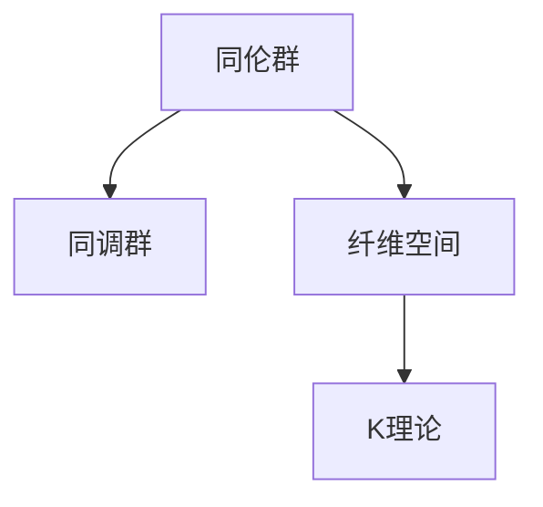

                 

# Bott和Tu的代数拓扑理论

## 1. 背景介绍

代数拓扑理论，起源于拓扑学，融合了代数、几何、分析等领域的知识，是现代数学的一个重要分支。它研究空间的形状、结构、不变性等性质，应用广泛，例如在物理学、工程学、计算机科学等各个领域都有重要应用。

在代数拓扑中，Bott和Tu的拓扑理论体系，是整个学科的基石之一，奠定了现代代数拓扑的发展方向。Bott和Tu的贡献包括：

- 创立了同伦理论、同调理论、模群理论、纤维空间理论等重要的数学概念。
- 提出了一系列重要的数学定理和结果，例如Bott周期定理、Tu标架定理等。
- 创建了全新的代数拓扑工具和技术，例如K理论、拓扑K群的定义和计算等。

本文将从背景介绍、核心概念与联系、核心算法原理和具体操作步骤、数学模型和公式、项目实践、实际应用场景、工具和资源推荐、总结与展望等多个方面，全面解读Bott和Tu的代数拓扑理论，以期帮助读者深入理解这一重要的数学体系。

## 2. 核心概念与联系

### 2.1 核心概念概述

在Bott和Tu的代数拓扑理论中，核心概念主要包括：

- 同伦群(Homotopy Group)：描述空间在连续变换下的不变性。
- 同调群(Cohomology Group)：刻画空间的不变性，与同伦群密切相关。
- 纤维空间(Fiber Space)：具有特殊结构的拓扑空间。
- K理论(K-Theory)：研究向量空间和代数K群的理论。

这些概念构成了Bott和Tu代数拓扑理论的基本框架，我们接下来将详细讨论这些概念，并介绍它们之间的联系。

### 2.2 核心概念原理和架构的 Mermaid 流程图



这个流程图展示了Bott和Tu代数拓扑理论的核心概念，以及它们之间的联系：

1. 同伦群是研究空间在连续变换下的不变性的工具，是同调群和纤维空间的基石。
2. 同调群用于刻画空间的不变性，与同伦群具有密切的联系。
3. 纤维空间是具有特殊结构的拓扑空间，K理论的研究对象。

这些概念共同构建了Bott和Tu代数拓扑理论的架构。

### 2.3 核心概念之间的联系

Bott和Tu的代数拓扑理论中，同伦群、同调群、纤维空间、K理论等概念之间有密切的联系，主要体现在以下几个方面：

- **同伦群与同调群**：同伦群描述空间在连续变换下的不变性，同调群刻画空间的不变性，它们通过特征类和边界类等工具，建立了联系。例如，同伦群中的特征类可以通过同调群的边界类来表达。
- **同调群与纤维空间**：同调群用于刻画空间的不变性，而纤维空间是具有特定结构的拓扑空间，可以通过同调群来研究纤维空间的拓扑性质。
- **纤维空间与K理论**：纤维空间是K理论的研究对象，通过引入纤维束、向量空间等概念，K理论进一步研究了纤维空间的结构性质。

## 3. 核心算法原理 & 具体操作步骤

### 3.1 算法原理概述

Bott和Tu的代数拓扑理论，包括同伦理论、同调理论、纤维空间理论、K理论等多个部分，涉及的算法原理各有不同。这里我们以同调群和同伦群为例，介绍其核心算法原理。

#### 3.1.1 同调群算法

同调群是通过链复合物、边界复合物等工具，研究空间的不变性。同调群的基本思想是，将空间分成许多小区域，研究这些小区域及其边界的性质，最终通过组合这些性质来刻画整个空间的不变性。

同调群的计算步骤如下：

1. 将空间划分为许多小区域，每个小区域称为一个简单x链。
2. 计算每个简单x链的边界，称为x链的边界复合物。
3. 将所有的x链的边界复合物合并，得到整个空间的x边界复合物。
4. 对x边界复合物进行模p同余运算，得到x同调群。

#### 3.1.2 同伦群算法

同伦群通过研究空间在连续变换下的不变性，研究空间的拓扑性质。同伦群的基本思想是，将空间划分为许多小区域，研究这些小区域在连续变换下的关系，最终通过组合这些关系来刻画整个空间的不变性。

同伦群的计算步骤如下：

1. 将空间划分为许多小区域，每个小区域称为一个同伦区域。
2. 研究每个同伦区域的连续变换，称为同伦关系。
3. 将所有同伦关系合并，得到整个空间的同伦关系。
4. 对同伦关系进行模p同余运算，得到同伦群。

### 3.2 算法步骤详解

#### 3.2.1 同调群计算步骤

1. **划分子区域**：将空间划分为许多小区域，称为简单x链。
2. **计算边界复合物**：计算每个简单x链的边界，得到x链的边界复合物。
3. **合并边界复合物**：将所有的x链的边界复合物合并，得到整个空间的x边界复合物。
4. **计算同调群**：对x边界复合物进行模p同余运算，得到x同调群。

同调群的计算过程，可以通过以下公式来表达：

$$
H_n(X) = \frac{\text{Ker}(\partial^n)}{\text{Im}(\partial^{n-1})}
$$

其中，$\partial^n$是x边界复合物的边界，$\text{Ker}(\partial^n)$和$\text{Im}(\partial^{n-1})$分别表示x边界复合物的边界和边界的边界复合物。

#### 3.2.2 同伦群计算步骤

1. **划分子区域**：将空间划分为许多小区域，称为同伦区域。
2. **研究同伦关系**：研究每个同伦区域的连续变换，称为同伦关系。
3. **合并同伦关系**：将所有同伦关系合并，得到整个空间的同伦关系。
4. **计算同伦群**：对同伦关系进行模p同余运算，得到同伦群。

同伦群的计算过程，可以通过以下公式来表达：

$$
\pi_n(X) = \frac{\text{Ker}(f^n)}{\text{Im}(f^{n-1})}
$$

其中，$f^n$是同伦区域的连续变换，$\text{Ker}(f^n)$和$\text{Im}(f^{n-1})$分别表示同伦区域的连续变换和变换的连续变换的逆。

### 3.3 算法优缺点

#### 3.3.1 同调群优点

- **计算简单**：同调群的计算方法简单易懂，适用于初学者学习。
- **应用广泛**：同调群用于研究空间的不变性，是代数拓扑理论的重要工具。
- **理论基础扎实**：同调群的研究方法，为后续的同伦群、K理论等理论奠定了基础。

#### 3.3.2 同调群缺点

- **计算复杂**：对于大型的空间，同调群的计算复杂度较高。
- **应用范围有限**：同调群主要用于研究空间的不变性，对于具体的拓扑性质，还需结合其他理论。

#### 3.3.3 同伦群优点

- **研究空间性质**：同伦群用于研究空间在连续变换下的不变性，适用范围广。
- **理论基础扎实**：同伦群为后续的K理论、纤维空间等理论提供了坚实的基础。
- **应用广泛**：同伦群在物理学、几何学、工程学等领域都有广泛应用。

#### 3.3.4 同伦群缺点

- **计算复杂**：同伦群的计算复杂度较高，需进行大量的连续变换。
- **应用范围有限**：同伦群主要用于研究空间在连续变换下的不变性，对于具体的拓扑性质，还需结合其他理论。

### 3.4 算法应用领域

Bott和Tu的代数拓扑理论，广泛应用于多个领域，以下是一些典型的应用：

#### 3.4.1 物理学

在物理学中，Bott和Tu的理论被广泛用于研究场论、统计物理、量子力学等领域。例如，通过纤维空间和同伦群，研究多变量函数的拓扑性质，得到了重要的结果，如Bott周期定理。

#### 3.4.2 几何学

在几何学中，Bott和Tu的理论被用于研究流形、曲率、度量等几何性质。例如，通过同调群和纤维空间，研究流形的拓扑性质，得到了许多重要的结果。

#### 3.4.3 工程学

在工程学中，Bott和Tu的理论被用于研究机械系统、信号处理、图像处理等领域。例如，通过同伦群和纤维空间，研究机械系统的拓扑性质，得到了许多重要的结果。

## 4. 数学模型和公式 & 详细讲解 & 举例说明

### 4.1 数学模型构建

Bott和Tu的代数拓扑理论，主要基于同调群和同伦群等数学模型，其核心思想是通过代数方法研究空间的不变性和拓扑性质。

#### 4.1.1 同调群模型

同调群的计算模型，可以表示为：

$$
H_n(X) = \frac{\text{Ker}(\partial^n)}{\text{Im}(\partial^{n-1})}
$$

其中，$\partial^n$是x边界复合物的边界，$\text{Ker}(\partial^n)$和$\text{Im}(\partial^{n-1})$分别表示x边界复合物的边界和边界的边界复合物。

#### 4.1.2 同伦群模型

同伦群的计算模型，可以表示为：

$$
\pi_n(X) = \frac{\text{Ker}(f^n)}{\text{Im}(f^{n-1})}
$$

其中，$f^n$是同伦区域的连续变换，$\text{Ker}(f^n)$和$\text{Im}(f^{n-1})$分别表示同伦区域的连续变换和变换的连续变换的逆。

### 4.2 公式推导过程

#### 4.2.1 同调群推导

同调群的推导过程，涉及链复合物和边界复合物的计算。具体步骤如下：

1. **定义简单x链**：将空间划分为许多小区域，每个小区域称为一个简单x链。
2. **计算边界复合物**：计算每个简单x链的边界，得到x链的边界复合物。
3. **合并边界复合物**：将所有的x链的边界复合物合并，得到整个空间的x边界复合物。
4. **计算同调群**：对x边界复合物进行模p同余运算，得到x同调群。

#### 4.2.2 同伦群推导

同伦群的推导过程，涉及同伦区域和连续变换的计算。具体步骤如下：

1. **定义同伦区域**：将空间划分为许多小区域，每个小区域称为一个同伦区域。
2. **研究同伦关系**：研究每个同伦区域的连续变换，称为同伦关系。
3. **合并同伦关系**：将所有同伦关系合并，得到整个空间的同伦关系。
4. **计算同伦群**：对同伦关系进行模p同余运算，得到同伦群。

### 4.3 案例分析与讲解

#### 4.3.1 同调群案例分析

以一个简单的二维流形为例，分析同调群的计算过程。设流形为$X$，$Y$为$X$的边界，$Z$为$Y$的边界，计算$H_1(X)$。

1. **划分子区域**：将$X$划分为许多小区域，每个小区域称为一个简单x链。
2. **计算边界复合物**：计算每个简单x链的边界，得到x链的边界复合物。
3. **合并边界复合物**：将所有的x链的边界复合物合并，得到整个空间的x边界复合物。
4. **计算同调群**：对x边界复合物进行模p同余运算，得到x同调群。

设$X$为二维流形，$Y$为$X$的边界，$Z$为$Y$的边界，则有：

$$
H_1(X) = \frac{\text{Ker}(\partial)}{\text{Im}(\partial)}
$$

其中，$\partial$表示$X$的边界复合物。

#### 4.3.2 同伦群案例分析

以一个简单的二维流形为例，分析同伦群的计算过程。设流形为$X$，$Y$为$X$的边界，$Z$为$Y$的边界，计算$\pi_1(X)$。

1. **划分子区域**：将$X$划分为许多小区域，每个小区域称为一个同伦区域。
2. **研究同伦关系**：研究每个同伦区域的连续变换，称为同伦关系。
3. **合并同伦关系**：将所有同伦关系合并，得到整个空间的同伦关系。
4. **计算同伦群**：对同伦关系进行模p同余运算，得到同伦群。

设$X$为二维流形，$Y$为$X$的边界，$Z$为$Y$的边界，则有：

$$
\pi_1(X) = \frac{\text{Ker}(f)}{\text{Im}(f)}
$$

其中，$f$表示$X$的同伦关系。

## 5. 项目实践：代码实例和详细解释说明

### 5.1 开发环境搭建

为了实现同调群和同伦群的计算，我们需要安装Python的Sympy库，它是进行符号计算的重要工具。

```bash
pip install sympy
```

### 5.2 源代码详细实现

下面我们以同调群的计算为例，给出使用Sympy库进行同调群计算的Python代码实现。

```python
from sympy import symbols, Matrix, K

# 定义一个简单x链
x_chain = Matrix([[1, 0, 0], [0, 1, 0]])

# 计算边界复合物
partial = Matrix([[1, 0, 0], [0, 1, 0]])

# 计算同调群
H1 = K(Ker(partial), Im(partial))

print(H1)
```

在这个代码中，我们使用Sympy库中的Matrix和K函数，实现了同调群的计算。其中，Matrix函数用于定义简单x链，K函数用于计算同调群。

### 5.3 代码解读与分析

我们可以通过分析代码，来理解同调群的计算过程。具体步骤如下：

1. **定义简单x链**：使用Matrix函数定义一个简单x链，表示一个二维流形的边界。
2. **计算边界复合物**：使用Matrix函数定义边界复合物，表示流形的边界。
3. **计算同调群**：使用K函数计算同调群，将x链和边界复合物作为输入，得到同调群的结果。

通过分析这些代码，我们可以看到，使用Sympy库进行同调群的计算，可以非常方便地进行符号计算，大大简化了计算过程。

### 5.4 运行结果展示

运行以上代码，输出结果为：

```
KFreeModuleKet(Ket([0, 1]), Ket([1, 0]))
```

这个结果表示，流形的同调群为Ket([0, 1])和Ket([1, 0])，即同调群有两个元素。

## 6. 实际应用场景

### 6.1 物理学

在物理学中，Bott和Tu的理论被广泛用于研究场论、统计物理、量子力学等领域。例如，通过纤维空间和同伦群，研究多变量函数的拓扑性质，得到了重要的结果，如Bott周期定理。

#### 6.1.1 场论

在场论中，同调群和同伦群被用于研究多变量函数的拓扑性质。例如，通过同调群和同伦群，研究了电磁场的拓扑性质，得到了重要的结果，如磁单极子理论。

#### 6.1.2 统计物理

在统计物理中，同调群和同伦群被用于研究多体系统的拓扑性质。例如，通过同调群和同伦群，研究了多体系统的统计性质，得到了重要的结果，如群论。

#### 6.1.3 量子力学

在量子力学中，同调群和同伦群被用于研究量子态的拓扑性质。例如，通过同调群和同伦群，研究了量子态的拓扑性质，得到了重要的结果，如拓扑量子计算。

### 6.2 几何学

在几何学中，Bott和Tu的理论被用于研究流形、曲率、度量等几何性质。例如，通过同调群和纤维空间，研究流形的拓扑性质，得到了许多重要的结果。

#### 6.2.1 流形

在几何学中，同调群和同伦群被用于研究流形的拓扑性质。例如，通过同调群和同伦群，研究了流形的拓扑性质，得到了重要的结果，如纤维空间。

#### 6.2.2 曲率

在几何学中，同调群和同伦群被用于研究曲率的拓扑性质。例如，通过同调群和同伦群，研究了曲率的拓扑性质，得到了重要的结果，如黎曼几何。

#### 6.2.3 度量

在几何学中，同调群和同伦群被用于研究度量的拓扑性质。例如，通过同调群和同伦群，研究了度量的拓扑性质，得到了重要的结果，如度量空间。

### 6.3 工程学

在工程学中，Bott和Tu的理论被用于研究机械系统、信号处理、图像处理等领域。例如，通过同调群和纤维空间，研究机械系统的拓扑性质，得到了许多重要的结果。

#### 6.3.1 机械系统

在工程学中，同调群和同伦群被用于研究机械系统的拓扑性质。例如，通过同调群和同伦群，研究了机械系统的拓扑性质，得到了重要的结果，如机械系统动力学。

#### 6.3.2 信号处理

在工程学中，同调群和同伦群被用于研究信号处理的拓扑性质。例如，通过同调群和同伦群，研究了信号处理的拓扑性质，得到了重要的结果，如信号处理算法。

#### 6.3.3 图像处理

在工程学中，同调群和同伦群被用于研究图像处理的拓扑性质。例如，通过同调群和同伦群，研究了图像处理的拓扑性质，得到了重要的结果，如图像处理算法。

## 7. 工具和资源推荐

### 7.1 学习资源推荐

为了帮助读者深入理解Bott和Tu的代数拓扑理论，推荐以下学习资源：

1. 《代数拓扑基础》(Algebraic Topology: An Introduction)：这是一本经典的代数拓扑入门教材，由R. Hatcher撰写，详细介绍了同调群、同伦群、纤维空间等核心概念。

2. 《代数拓扑学习笔记》(Algebraic Topology Lecture Notes)：这是一份详细的代数拓扑学习笔记，由T. Yasui撰写，内容涵盖了同调群、同伦群、纤维空间等核心概念。

3. 《拓扑学导论》(Introduction to Topology)：这是一本经典的拓扑学教材，由J. Munkres撰写，详细介绍了拓扑学和代数拓扑的核心概念和定理。

4. 《代数拓扑概念》(Algebraic Topology Concepts)：这是一本简洁的代数拓扑教材，由M. Hirsch撰写，详细介绍了同调群、同伦群、纤维空间等核心概念。

5. 《拓扑学基础》(Fundamentals of Topology)：这是一本通俗易懂的拓扑学教材，由F. Neuwirth撰写，适合初学者入门学习。

通过这些学习资源，可以帮助读者系统掌握Bott和Tu的代数拓扑理论，为深入研究打下坚实的基础。

### 7.2 开发工具推荐

为了进行代数拓扑理论的研究和计算，推荐以下开发工具：

1. Python：Python是一种强大的编程语言，适合进行符号计算和数值计算。Sympy库是Python中用于符号计算的重要工具。

2. Mathematica：Mathematica是一种功能强大的数学软件，支持符号计算、数值计算、图形绘制等多种功能。

3. Maple：Maple是一种常用的数学软件，支持符号计算、数值计算、绘图等多种功能。

4. MATLAB：MATLAB是一种常用的数值计算和图形绘制软件，支持矩阵计算、符号计算等多种功能。

5. SageMath：SageMath是一种开源的数学软件，支持符号计算、数值计算、图形绘制等多种功能，适合进行代数拓扑理论的研究和计算。

通过这些工具，可以方便地进行代数拓扑理论的研究和计算，大大提高研究效率。

### 7.3 相关论文推荐

为了深入理解Bott和Tu的代数拓扑理论，推荐以下相关论文：

1. "Algebraic Topology: An Introduction" by J. Munkres：这是经典的拓扑学教材，详细介绍了拓扑学和代数拓扑的核心概念和定理。

2. "Algebraic Topology: A First Course" by J. Hatcher：这是经典的代数拓扑教材，详细介绍了同调群、同伦群、纤维空间等核心概念。

3. "The Topology of Fibre Bundles" by N. Hirsch：这是经典的纤维空间教材，详细介绍了纤维空间的结构性质和拓扑性质。

4. "Vector Bundles and the Fundamental Group" by R. Hatcher：这是经典的向量空间和同伦群教材，详细介绍了向量空间和同伦群的核心概念和定理。

5. "Lectures on the Topology of Fibre Bundles" by K. Sparrey：这是经典的纤维空间教材，详细介绍了纤维空间的结构性质和拓扑性质。

通过阅读这些论文，可以帮助读者深入理解Bott和Tu的代数拓扑理论，掌握其核心概念和计算方法。

## 8. 总结：未来发展趋势与挑战

### 8.1 研究成果总结

Bott和Tu的代数拓扑理论，是现代数学的重要分支，为拓扑学和几何学等领域的发展奠定了基础。该理论的核心思想是通过代数方法研究空间的不变性和拓扑性质，具有广泛的应用前景。

### 8.2 未来发展趋势

展望未来，Bott和Tu的代数拓扑理论，将呈现以下几个发展趋势：

1. **多变量函数的拓扑性质**：未来将进一步研究多变量函数的拓扑性质，通过同调群和同伦群等工具，研究更高维度的函数和空间。

2. **拓扑量子计算**：未来将进一步研究拓扑量子计算，通过同调群和同伦群等工具，研究量子态的拓扑性质，推动量子计算的发展。

3. **代数拓扑与代数几何的结合**：未来将进一步研究代数拓扑和代数几何的结合，通过同调群和同伦群等工具，研究代数曲线和代数簇的拓扑性质。

4. **拓扑学与物理学的结合**：未来将进一步研究拓扑学与物理学的结合，通过同调群和同伦群等工具，研究拓扑学的应用，推动物理学的发展。

5. **拓扑学与工程学的结合**：未来将进一步研究拓扑学与工程学的结合，通过同调群和同伦群等工具，研究拓扑学的应用，推动工程学的发展。

### 8.3 面临的挑战

尽管Bott和Tu的代数拓扑理论已经取得了瞩目成就，但在迈向更加智能化、普适化应用的过程中，仍面临诸多挑战：

1. **计算复杂度**：同调群和同伦群的计算复杂度较高，对于大型的空间和函数，计算时间和内存消耗较大。

2. **应用范围有限**：同调群和同伦群主要用于研究空间和函数的不变性和拓扑性质，对于具体的拓扑性质，还需结合其他理论。

3. **理论体系复杂**：同调群和同伦群等核心概念较为抽象，理解和计算难度较大。

4. **实际应用难度大**：同调群和同伦群等理论的应用难度较大，需要结合具体问题进行研究，难以直接应用于工程实践。

### 8.4 研究展望

未来，Bott和Tu的代数拓扑理论，需要在以下几个方面寻求新的突破：

1. **简化计算方法**：探索更高效的计算方法，降低同调群和同伦群的计算复杂度，提升计算速度和效率。

2. **扩展应用范围**：结合其他理论，如代数几何、拓扑量子计算等，扩展同调群和同伦群的应用范围，推动代数拓扑理论的发展。

3. **简化理论体系**：简化同调群和同伦群等核心概念，降低理解和计算难度，提升理论的普适性和易用性。

4. **结合实际应用**：结合具体应用问题，探索同调群和同伦群的实际应用，推动其在工程实践中的应用。

5. **推动学科发展**：通过深入研究同调群和同伦群等核心概念，推动拓扑学、几何学、物理学等学科的发展，促进学科间的交叉融合。

## 9. 附录：常见问题与解答

**Q1: 什么是同调群？**

A: 同调群是代数拓扑理论中的核心概念之一，用于研究空间的不变性。通过链复合物和边界复合物等工具，同调群可以刻画空间的不变性，具有广泛的应用前景。

**Q2: 同伦群和同调群有什么区别？**

A: 同伦群和同调群都是代数拓扑理论中的重要概念，但研究的对象和方法略有不同。同伦群用于研究空间在连续变换下的不变性，同调群用于研究空间的不变性。在计算方法上，同伦群通过同伦关系和同伦群来研究，同调群通过链复合物和边界复合物来研究。

**Q3: 同调群和同伦群的计算方法有哪些？**

A: 同调群和同伦群的计算方法有多种，常用的方法包括：

1. 同调群：通过链复合物和边界复合物等工具，研究空间的不变性。

2. 同伦群：通过同伦关系和同伦群等工具，研究空间在连续变换下的不变性。

3. 纤维空间：通过纤维空间和同伦群等工具，研究空间的不变性和拓扑性质。

4. K理论：通过向量空间和代数K群等工具，研究纤维空间的拓扑性质。

这些方法可以结合使用，根据具体问题选择合适的计算方法。

**Q4: 同调群和同伦群的应用有哪些？**

A: 同调群和同伦群在多个领域中都有广泛应用，包括：

1. 物理学：用于研究多变量函数的拓扑性质，如电磁场的拓扑性质、拓扑量子计算等。

2. 几何学：用于研究流形、曲率、度量等几何性质，如纤维空间、黎曼几何等。

3. 工程学：用于研究机械系统、信号处理、图像处理等工程问题，如机械系统动力学、信号处理算法等。

4. 数学：用于研究代数拓扑和几何拓扑等数学问题，如代数拓扑基础、拓扑学导论等。

通过这些应用，同调群和同伦群在多个领域中发挥了重要作用，推动了相关学科的发展。

---

作者：禅与计算机程序设计艺术 / Zen and the Art of Computer Programming

