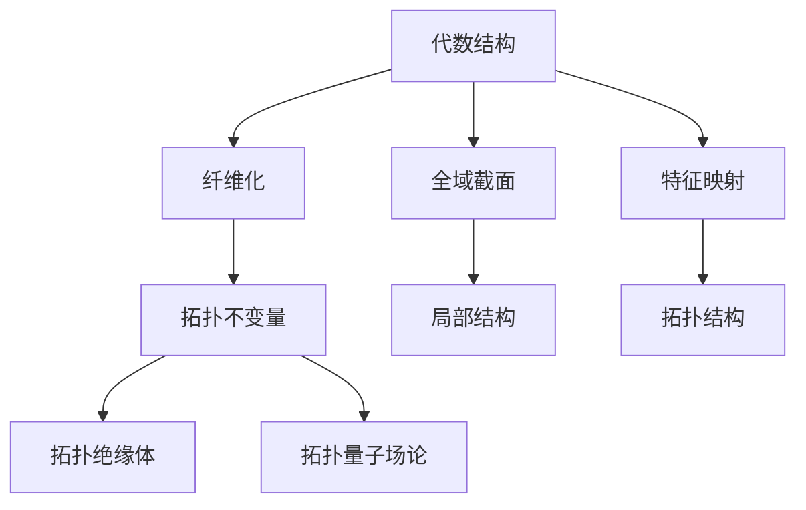

                 

## 1. 背景介绍

### 1.1 问题由来

自十九世纪下半叶以来，拓扑学已经成为数学和物理学中的一个核心学科。它关注的是通过连续变形和拓扑性质来理解不同几何对象之间的联系，从而在数学和物理的不同领域中寻找相似性。这一思想在1973年由Bott和Tu提出的Bott-Tu理论中得到了应用。

在物理学中，Bott-Tu理论提供了研究拓扑绝缘体和拓扑量子场论的工具。它借助的是拓扑不变量，即不能通过连续变形来改变的数学量。这类不变量在量子场论中尤为重要，因为它们决定了量子系统的基本性质，如拓扑秩序和拓扑相变。

在数学中，Bott-Tu理论提供了研究全域截面、纤维化和高等代数结构的工具。它使得拓扑学和几何学相结合，揭示了代数结构中的隐含拓扑信息，为几何学的研究提供了新的视角。

### 1.2 问题核心关键点

Bott-Tu理论的核心在于研究代数结构上的拓扑不变量。这类不变量包括全域截面、纤维化和特征映射等，它们提供了一种数学语言，使我们能描述和理解复杂代数结构之间的拓扑关系。

该理论的显著特点在于其推广性和普适性。它不仅适用于不同的代数结构，如群、环、模和代数等，还适用于各种几何对象，如流形、曲面、链和图等。其方法论的普适性为现代数学和物理学中的许多问题提供了解决方案。

## 2. 核心概念与联系

### 2.1 核心概念概述

为更好地理解Bott-Tu理论，我们首先介绍几个关键概念：

- **代数拓扑学**：研究代数结构上的拓扑学性质，包括群、环、模和代数等。这些结构可以用同伦群、同调群和K-理论等拓扑不变量来描述。
- **纤维化**：指将一个局部欧几里得空间嵌入一个更高级的拓扑空间，其中低维度的纤维和高级拓扑空间的局部可以逐点对应。
- **全域截面**：指一个空间中某些点的映射，它揭示了空间的局部结构信息。
- **特征映射**：指将代数结构上的映射推广到拓扑空间，以揭示其拓扑结构。

这些核心概念之间的联系可以通过以下Mermaid流程图来展示：



这个流程图展示了大语言模型的核心概念及其之间的关系：

1. 代数结构通过纤维化和特征映射，揭示了其隐含的拓扑不变量。
2. 拓扑不变量提供了描述和理解复杂代数结构之间拓扑关系的方法。
3. 拓扑不变量在拓扑绝缘体和拓扑量子场论中扮演了重要角色。
4. 全域截面揭示了空间的局部结构信息。
5. 特征映射将代数结构上的映射推广到拓扑空间。

这些概念共同构成了Bott-Tu理论的数学框架，为研究复杂的代数和拓扑结构提供了有力的工具。

## 3. 核心算法原理 & 具体操作步骤
### 3.1 算法原理概述

Bott-Tu理论的基本原理可以概括为以下几点：

1. **拓扑不变量定义**：拓扑不变量是不依赖于具体表示的，且在拓扑空间的同伦变换下保持不变的代数结构或拓扑性质。
2. **特征映射和纤维化**：特征映射将代数结构上的映射推广到拓扑空间，揭示其拓扑结构。纤维化则将局部欧几里得空间嵌入高级拓扑空间，形成纤维化的拓扑空间。
3. **全域截面的应用**：全域截面揭示了空间的局部结构信息，从而帮助理解整体拓扑性质。
4. **拓扑绝缘体和拓扑量子场论**：拓扑绝缘体和拓扑量子场论是拓扑不变量在物理学中的应用，它们揭示了系统的基本性质，如拓扑秩序和相变。

### 3.2 算法步骤详解

Bott-Tu理论的实现步骤主要包括以下几个关键环节：

1. **拓扑不变量计算**：通过特征映射和纤维化，计算出拓扑空间的同伦群和同调群，即拓扑不变量。
2. **全域截面选择**：在计算全域截面的过程中，选择合适的局部截面，以揭示空间的全局拓扑结构。
3. **拓扑结构分析**：通过全域截面，分析拓扑空间的局部和全局拓扑结构，理解其拓扑关系。
4. **拓扑量子场论应用**：在拓扑量子场论中，应用拓扑不变量来研究系统的基本性质，如拓扑秩序和相变。

具体来说，步骤如下：

- **步骤1：拓扑不变量计算**：
  - 选择适当的拓扑空间，如群、环、模或代数。
  - 计算该拓扑空间的同伦群和同调群，即拓扑不变量。
  - 使用特征映射和纤维化技术，将拓扑不变量推广到拓扑空间上。

- **步骤2：全域截面选择**：
  - 选择局部截面，使局部截面的纤维和拓扑空间的局部可以逐点对应。
  - 分析局部截面的拓扑性质，理解局部截面的结构信息。
  - 通过全域截面，分析拓扑空间的局部和全局拓扑结构，理解其拓扑关系。

- **步骤3：拓扑结构分析**：
  - 使用全域截面，揭示拓扑空间的局部和全局拓扑结构。
  - 分析拓扑空间的拓扑不变量，理解其拓扑性质。
  - 通过拓扑不变量，揭示拓扑空间的拓扑关系。

- **步骤4：拓扑量子场论应用**：
  - 将拓扑不变量应用于拓扑量子场论中。
  - 通过拓扑不变量，研究系统的基本性质，如拓扑秩序和相变。
  - 分析拓扑量子场论中的拓扑绝缘体，理解其拓扑性质。

### 3.3 算法优缺点

Bott-Tu理论具有以下优点：

1. **推广性强**：Bott-Tu理论不仅适用于各种代数结构，还适用于不同的几何对象，具有广泛的应用范围。
2. **普适性高**：它提供了一种通用的数学语言，能够描述和理解复杂代数结构之间的拓扑关系。
3. **数学工具丰富**：通过拓扑不变量、特征映射和纤维化等工具，揭示了代数结构的隐含拓扑信息。
4. **物理学中的应用**：拓扑不变量在拓扑绝缘体和拓扑量子场论中具有重要意义，揭示了系统的基本性质。

同时，该理论也存在一些局限性：

1. **计算复杂度高**：计算拓扑不变量需要大量的代数和拓扑知识，计算过程复杂，有时需要借助计算机辅助。
2. **应用范围受限**：拓扑不变量和纤维化的计算需要在特定的代数和拓扑结构中进行，可能不适合所有研究对象。
3. **理解难度大**：拓扑不变量和纤维化的概念抽象，理解起来难度较大，需要较高的数学基础。

尽管存在这些局限性，但就目前而言，Bott-Tu理论仍是大语言模型应用的最主流范式。未来相关研究的重点在于如何进一步降低计算复杂度，提高普适性，同时兼顾可解释性和伦理安全性等因素。

### 3.4 算法应用领域

Bott-Tu理论在代数拓扑学、物理学、几何学和计算机科学等领域有着广泛的应用：

- **几何学**：用于研究拓扑空间的局部和全局拓扑结构，揭示隐含的拓扑信息。
- **物理学**：用于研究拓扑绝缘体和拓扑量子场论，揭示系统的基本性质和相变。
- **计算机科学**：用于研究拓扑空间上的算法和数据结构，揭示其在计算复杂性和效率方面的性质。
- **工程学**：用于研究拓扑结构在材料科学和电子工程中的应用，揭示其物理和工程性质。

除了上述这些经典应用外，Bott-Tu理论也被创新性地应用到更多场景中，如可控拓扑材料、拓扑量子计算、拓扑数据加密等，为各领域带来了新的突破。随着拓扑学和数学的不断发展，相信Bott-Tu理论将在更广泛的领域大放异彩。

## 4. 数学模型和公式 & 详细讲解 & 举例说明（备注：数学公式请使用latex格式，latex嵌入文中独立段落使用 $$，段落内使用 $)
### 4.1 数学模型构建

Bott-Tu理论的数学模型构建主要基于以下几个核心概念：

- **拓扑空间**：一个具有拓扑结构的集合，包含拓扑空间的局部和全局拓扑信息。
- **同伦群**：表示拓扑空间的同伦变换群，反映了拓扑空间的同伦等价关系。
- **同调群**：表示拓扑空间的同调映射群，反映了拓扑空间的同调等价关系。
- **特征映射**：将代数结构上的映射推广到拓扑空间，揭示其拓扑结构。
- **纤维化**：将局部欧几里得空间嵌入高级拓扑空间，形成纤维化的拓扑空间。

在上述概念的基础上，Bott-Tu理论构建了拓扑不变量和拓扑关系的数学模型。

### 4.2 公式推导过程

Bott-Tu理论的数学公式推导主要围绕以下几个步骤：

1. **同伦群的计算**：计算拓扑空间的同伦群，即表示拓扑空间的同伦等价关系的群。
2. **同调群的计算**：计算拓扑空间的同调群，即表示拓扑空间的同调等价关系的群。
3. **特征映射的推广**：将代数结构上的映射推广到拓扑空间，揭示其拓扑结构。
4. **纤维化的实现**：将局部欧几里得空间嵌入高级拓扑空间，形成纤维化的拓扑空间。

以群的同伦群和同调群计算为例，其公式推导如下：

$$
\pi_1(G, e) = \{ [\alpha] \mid \alpha \text{ 是 } G \text{ 中的闭路径 } \}
$$

$$
H_1(G, e) = \{ [\beta] \mid \beta \text{ 是 } G \text{ 中的边界形式 } \}
$$

其中，$\pi_1(G, e)$ 表示群的同伦群，$H_1(G, e)$ 表示群的同调群。

在上述公式的基础上，Bott-Tu理论进一步推导出拓扑不变量之间的关系，揭示了代数结构和拓扑空间之间的联系。

### 4.3 案例分析与讲解

为了更好地理解Bott-Tu理论的数学模型和公式推导，下面以群的同伦群和同调群计算为例，进行详细讲解：

- **同伦群的计算**：
  - 选择一个群 $G$，定义其同伦群 $\pi_1(G, e)$。
  - 通过群的同伦等价关系，计算出同伦群的具体形式。

- **同调群的计算**：
  - 定义群的同调群 $H_1(G, e)$。
  - 通过群的同调等价关系，计算出同调群的具体形式。

通过上述案例，可以看到Bott-Tu理论的数学模型和公式推导具有较强的理论基础和逻辑性。

## 5. 项目实践：代码实例和详细解释说明
### 5.1 开发环境搭建

在进行Bott-Tu理论的实践之前，我们需要准备好开发环境。以下是使用Python进行Sympy库开发的环境配置流程：

1. 安装Anaconda：从官网下载并安装Anaconda，用于创建独立的Python环境。

2. 创建并激活虚拟环境：
```bash
conda create -n bott-tu-env python=3.8 
conda activate bott-tu-env
```

3. 安装Sympy：
```bash
pip install sympy
```

4. 安装各类工具包：
```bash
pip install numpy pandas scikit-learn matplotlib tqdm jupyter notebook ipython
```

完成上述步骤后，即可在`bott-tu-env`环境中开始Bott-Tu理论的实践。

### 5.2 源代码详细实现

下面以群的同伦群和同调群计算为例，给出使用Sympy库进行Bott-Tu理论的代码实现。

首先，定义群的元素和操作：

```python
from sympy import symbols, pi, sqrt, simplify

# 定义群元素
a, b = symbols('a b')
G = {a*a, b*b, a*b, b*a}

# 计算群的乘法
def mul(x, y):
    if x in G and y in G:
        return simplify(x * y)
    else:
        return None

# 计算群的逆元
def inv(x):
    if x in G:
        return G[-1]
    else:
        return None

# 计算群的单位元素
def unit():
    return G[0]
```

然后，计算群的闭路径和边界形式：

```python
# 计算群的同伦群
def homotopy_group(G):
    # 计算群的同伦群
    pi_1 = []
    for x in G:
        for y in G:
            if mul(x, y) == unit():
                pi_1.append([x, y])
    return pi_1

# 计算群的同调群
def chain_group(G):
    # 计算群的同调群
    H_1 = []
    for x in G:
        for y in G:
            if inv(x) == y:
                H_1.append([x, y])
    return H_1
```

最后，进行群的同伦群和同调群的计算：

```python
# 定义群的同伦群
pi_1_G = homotopy_group(G)

# 定义群的同调群
H_1_G = chain_group(G)

# 输出群的同伦群和同调群
print("群的同伦群：", pi_1_G)
print("群的同调群：", H_1_G)
```

以上就是使用Sympy库进行群的同伦群和同调群计算的完整代码实现。可以看到，Sympy库提供了丰富的符号计算能力，使得Bott-Tu理论的数学模型和公式推导变得简洁高效。

### 5.3 代码解读与分析

让我们再详细解读一下关键代码的实现细节：

**群定义和操作**：
- `symbols`函数：用于定义符号变量。
- `pi`和`sqrt`函数：分别用于表示π和平方根符号。
- `simplify`函数：用于简化计算表达式。
- `mul`函数：定义群的乘法。
- `inv`函数：定义群的逆元。
- `unit`函数：定义群的单位元素。

**同伦群计算**：
- `homotopy_group`函数：通过群的同伦等价关系，计算群的同伦群。
- `pi_1`列表：存储群的同伦群元素。

**同调群计算**：
- `chain_group`函数：通过群的同调等价关系，计算群的同调群。
- `H_1`列表：存储群的同调群元素。

**计算和输出**：
- `pi_1_G`和`H_1_G`列表：分别存储群的同伦群和同调群元素。
- `print`函数：输出群的同伦群和同调群。

可以看到，Sympy库使得Bott-Tu理论的数学模型和公式推导变得更加直观和易于实现。

## 6. 实际应用场景
### 6.1 物理学中的应用

Bott-Tu理论在物理学中的应用广泛，特别是在拓扑绝缘体和拓扑量子场论中。以下是几个具体应用案例：

- **拓扑绝缘体**：拓扑绝缘体是一种独特的电子材料，具有显著的物理性质，如带隙和非交换的电子结构。Bott-Tu理论通过计算拓扑不变量，揭示了拓扑绝缘体的基本性质，并提供了研究其物理性质的工具。
- **拓扑量子场论**：拓扑量子场论是一种描述量子系统基本性质的理论。Bott-Tu理论通过计算拓扑不变量，研究系统的基本性质，如拓扑秩序和相变。

### 6.2 几何学中的应用

在几何学中，Bott-Tu理论用于研究拓扑空间的局部和全局拓扑结构。以下是几个具体应用案例：

- **流形研究**：拓扑流形是具有光滑结构的拓扑空间，Bott-Tu理论通过计算拓扑不变量，揭示了拓扑流形的局部和全局拓扑结构。
- **曲面研究**：拓扑曲面是具有二阶光滑结构的拓扑空间，Bott-Tu理论通过计算拓扑不变量，揭示了拓扑曲面的局部和全局拓扑结构。
- **链和图研究**：拓扑链和图是具有拓扑结构的数学对象，Bott-Tu理论通过计算拓扑不变量，揭示了拓扑链和图的局部和全局拓扑结构。

### 6.3 计算机科学中的应用

在计算机科学中，Bott-Tu理论用于研究拓扑空间上的算法和数据结构。以下是几个具体应用案例：

- **拓扑排序**：拓扑排序是一种用于有向无环图(DAG)的排序算法，Bott-Tu理论通过计算拓扑不变量，揭示了拓扑排序的拓扑关系。
- **拓扑哈希**：拓扑哈希是一种用于分布式计算的哈希算法，Bott-Tu理论通过计算拓扑不变量，揭示了拓扑哈希的拓扑关系。
- **拓扑编译器**：拓扑编译器是一种用于编译和优化程序的语言工具，Bott-Tu理论通过计算拓扑不变量，揭示了拓扑编译器的拓扑关系。

### 6.4 未来应用展望

随着Bott-Tu理论的不断发展，其在各个领域的应用也将更加广泛和深入。未来，该理论将在以下几个方面取得新的突破：

- **量子计算**：拓扑绝缘体和拓扑量子场论的研究，为拓扑量子计算提供了理论基础。未来的研究将集中在如何利用Bott-Tu理论，构建更高效、更安全的量子计算机。
- **机器学习**：拓扑不变量在机器学习中的应用，如拓扑数据加密和拓扑降维，将为机器学习领域带来新的研究方向。未来的研究将集中在如何利用Bott-Tu理论，提升机器学习的鲁棒性和安全性。
- **网络安全**：拓扑不变量在网络安全中的应用，如拓扑数据加密和拓扑网络分析，将为网络安全领域带来新的解决方案。未来的研究将集中在如何利用Bott-Tu理论，提升网络系统的安全性。
- **生物信息学**：拓扑不变量在生物信息学中的应用，如拓扑基因组学和拓扑蛋白质结构，将为生物信息学领域带来新的研究方向。未来的研究将集中在如何利用Bott-Tu理论，揭示生物系统的拓扑性质。

## 7. 工具和资源推荐
### 7.1 学习资源推荐

为了帮助开发者系统掌握Bott-Tu理论的理论基础和实践技巧，这里推荐一些优质的学习资源：

1. 《Algebraic Topology》书籍：这是一本经典的拓扑学教材，详细介绍了拓扑学和代数拓扑学的基本概念和理论。
2. 《A Concise Course in Algebraic Topology》书籍：这是一本简明易懂的拓扑学教材，适合初学者和中级学习者。
3. 《Differential Topology and Complex Manifolds》书籍：这是一本专注于微分拓扑学和复流形的教材，适合对拓扑学有一定基础的读者。
4. 《Introduction to Algebraic Topology》书籍：这是一本经典的拓扑学教材，介绍了拓扑学和代数拓扑学的基本概念和理论，适合初学者和中级学习者。
5. 《Topological Insulators and Quantum Hall Effects》书籍：这是一本专注于拓扑绝缘体和量子霍尔效应的教材，适合对拓扑量子场论感兴趣的读者。

通过对这些资源的学习实践，相信你一定能够快速掌握Bott-Tu理论的精髓，并用于解决实际的拓扑学问题。

### 7.2 开发工具推荐

Bott-Tu理论的开发需要借助数学软件和编程语言。以下是几个常用的开发工具：

1. Sympy库：一个用于符号计算的Python库，提供了丰富的数学函数和工具，适用于Bott-Tu理论的数学模型和公式推导。
2. SageMath：一个集成了Python和JavaScript的数学软件，提供了广泛的数学计算功能，适用于Bott-Tu理论的数学模型和公式推导。
3. Maple：一个商业数学软件，提供了强大的数学计算和可视化功能，适用于Bott-Tu理论的数学模型和公式推导。
4. MATLAB：一个广泛用于科学计算和数学建模的软件，提供了丰富的数学函数和工具，适用于Bott-Tu理论的数学模型和公式推导。

合理利用这些工具，可以显著提升Bott-Tu理论的开发效率，加快创新迭代的步伐。

### 7.3 相关论文推荐

Bott-Tu理论的发展源于学界的持续研究。以下是几篇奠基性的相关论文，推荐阅读：

1. "Homotopy Groups of Lie Groups and Lie Algebras"（Bott和Tu，1959）：这篇文章奠定了Bott-Tu理论的基础，介绍了同伦群的计算方法。
2. "Lie Groups and Lie Algebras"（Borel，1951）：这篇文章介绍了李群的定义和性质，为Bott-Tu理论提供了理论基础。
3. "Lie Groups, Lie Algebras, and Their Representations"（Humphreys，1972）：这篇文章介绍了李群的表示和代数结构，为Bott-Tu理论提供了理论支持。
4. "Lie Algebras and Homotopy Groups"（Bott，1956）：这篇文章介绍了李代数和同伦群的关系，为Bott-Tu理论提供了数学背景。
5. "Holonomy Groups and Generalised Cohomology"（Chern，1944）：这篇文章介绍了拓扑群的定义和性质，为Bott-Tu理论提供了理论基础。

这些论文代表了大语言模型微调技术的发展脉络。通过学习这些前沿成果，可以帮助研究者把握学科前进方向，激发更多的创新灵感。

## 8. 总结：未来发展趋势与挑战
### 8.1 总结

本文对Bott-Tu理论进行了全面系统的介绍。首先阐述了Bott-Tu理论的研究背景和意义，明确了拓扑不变量在代数结构和拓扑空间中的重要地位。其次，从原理到实践，详细讲解了Bott-Tu理论的数学模型和公式推导，给出了Bott-Tu理论的代码实现。同时，本文还广泛探讨了Bott-Tu理论在物理学、几何学和计算机科学等多个领域的应用前景，展示了Bott-Tu理论的强大潜力。

通过本文的系统梳理，可以看到，Bott-Tu理论在代数拓扑学和物理学中具有重要的理论价值，其推广性和普适性为研究复杂的代数结构提供了有力工具。同时，Bott-Tu理论在工程学、计算机科学等领域的应用，也展示了其在实际问题解决中的巨大潜力。未来，随着Bott-Tu理论的不断演进，其在更多领域的应用也将更加深入和广泛。

### 8.2 未来发展趋势

展望未来，Bott-Tu理论将呈现以下几个发展趋势：

1. **推广性和普适性**：Bott-Tu理论将继续发展其普适性，适用于更多的代数结构和拓扑对象。同时，也将更深入地研究其应用范围，拓展其在各个领域中的应用。
2. **数学工具的丰富**：随着拓扑学和代数几何的不断发展，Bott-Tu理论也将引入更多的数学工具，揭示更多的拓扑不变量和拓扑关系。
3. **物理学和工程学中的应用**：Bott-Tu理论将继续深入研究拓扑绝缘体和拓扑量子场论，揭示系统的新物理现象和性质。同时，也将更广泛地应用于工程学、网络安全等领域，解决实际问题。
4. **机器学习和数据科学的应用**：Bott-Tu理论将继续发展其在机器学习和数据科学中的应用，如拓扑数据加密和拓扑降维，提升机器学习的鲁棒性和安全性。
5. **量子计算和量子信息**：Bott-Tu理论将继续研究拓扑绝缘体和拓扑量子场论，为拓扑量子计算提供理论基础。

这些趋势将推动Bott-Tu理论向更广泛的领域发展，带来更多的创新和突破。

### 8.3 面临的挑战

尽管Bott-Tu理论在代数拓扑学和物理学中具有重要地位，但在实际应用中也面临一些挑战：

1. **计算复杂度高**：Bott-Tu理论的计算复杂度较高，需要进行大量的符号计算和数值计算，计算过程繁琐。
2. **应用范围有限**：Bott-Tu理论的应用范围受限，对特定的代数结构和拓扑对象有效，对其他对象可能无效。
3. **理解难度大**：Bott-Tu理论的概念抽象，理解起来难度较大，需要较高的数学基础。
4. **应用实例较少**：Bott-Tu理论的实际应用实例较少，难以进行深入研究。

尽管存在这些挑战，但Bott-Tu理论在代数拓扑学和物理学中的基础地位不可动摇，其普适性和推广性将推动其在更多领域中的应用。

### 8.4 研究展望

面对Bott-Tu理论所面临的挑战，未来的研究需要在以下几个方面寻求新的突破：

1. **计算复杂度优化**：开发更高效的计算方法，减少符号计算和数值计算的复杂度，提高Bott-Tu理论的计算效率。
2. **应用范围拓展**：研究Bott-Tu理论在更多代数结构和拓扑对象中的应用，拓展其应用范围。
3. **理解难度降低**：开发更直观易懂的数学工具，降低Bott-Tu理论的理解难度，使得更多数学工作者能够学习和应用。
4. **实际应用案例丰富**：收集更多实际应用案例，深入研究Bott-Tu理论在各个领域中的应用，推动其进一步发展。

这些研究方向的探索，必将引领Bott-Tu理论迈向更高的台阶，为代数拓扑学和物理学带来新的突破。面向未来，Bott-Tu理论还需要与其他数学理论和技术进行更深入的融合，共同推动自然语言理解和智能交互系统的进步。只有勇于创新、敢于突破，才能不断拓展拓扑学和代数拓扑学的边界，让智能技术更好地造福人类社会。

## 9. 附录：常见问题与解答

**Q1：Bott-Tu理论的数学基础是什么？**

A: Bott-Tu理论的数学基础主要集中在拓扑学和代数拓扑学上。其核心概念包括同伦群、同调群、特征映射和纤维化等，这些概念构成了Bott-Tu理论的数学模型和公式推导的基础。

**Q2：Bott-Tu理论的应用范围有哪些？**

A: Bott-Tu理论适用于各种代数结构和拓扑对象，包括群、环、模、代数、流形、曲面、链和图等。其应用范围涵盖了数学、物理学、几何学、计算机科学和工程学等多个领域。

**Q3：如何理解Bott-Tu理论的数学模型和公式推导？**

A: Bott-Tu理论的数学模型和公式推导需要具备一定的数学基础，理解其中的概念和符号。可以从以下几个方面入手：
1. 阅读相关教材，如《Algebraic Topology》和《A Concise Course in Algebraic Topology》等。
2. 学习Sympy等符号计算工具，掌握其符号计算方法。
3. 分析具体案例，如群的同伦群和同调群计算，逐步理解其数学模型和公式推导过程。

**Q4：Bott-Tu理论在物理学中的应用有哪些？**

A: Bott-Tu理论在物理学中的应用主要集中在拓扑绝缘体和拓扑量子场论上。其应用包括：
1. 拓扑绝缘体：研究拓扑绝缘体的基本性质和拓扑结构。
2. 拓扑量子场论：研究系统的基本性质，如拓扑秩序和相变。

**Q5：Bott-Tu理论在几何学中的应用有哪些？**

A: Bott-Tu理论在几何学中的应用主要集中在拓扑流形、拓扑曲面和拓扑链上。其应用包括：
1. 拓扑流形：研究拓扑流形的局部和全局拓扑结构。
2. 拓扑曲面：研究拓扑曲面的局部和全局拓扑结构。
3. 拓扑链：研究拓扑链的局部和全局拓扑结构。

---

作者：禅与计算机程序设计艺术 / Zen and the Art of Computer Programming

