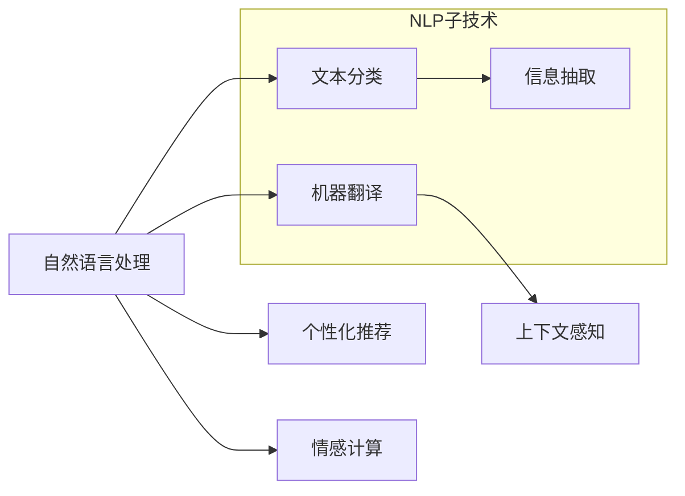

                 

# CUI如何彻底改变数字产品的详细交互方式

## 1. 背景介绍

### 1.1 问题由来

随着人工智能和计算用户界面(CUI, Computer User Interface)技术的不断进步，数字产品的交互方式正在经历一场深刻变革。传统的用户界面，以鼠标、键盘为代表，用户需要通过复杂的操作流程，才能与计算机进行信息交换。而在现代CUI中，自然语言理解和自然语言生成技术（Natural Language Understanding and Generation, NLU & NLG）的引入，使得用户能够以更自然、更直观的方式与计算机互动。

这种变革带来了诸多优势。首先，用户可以更高效地获取和处理信息，减少了学习和记忆操作流程的负担。其次，自然语言输入输出能够跨越语言和文化障碍，使得产品在全球范围内更具普适性。最后，交互的自然化不仅提升了用户体验，也为开发者的任务分配和信息检索带来了便利。

### 1.2 问题核心关键点

CUI彻底改变数字产品交互方式的核心关键点包括以下几点：

- **自然语言理解(NLU)**：使计算机能够理解和解析用户的自然语言输入，从而执行相应操作。
- **自然语言生成(NLG)**：使计算机能够以自然语言形式向用户输出信息，增强交互的自然性。
- **多模态交互**：结合图像、音频等多种模态信息，提升交互的多样性和直观性。
- **上下文感知**：通过语境理解和记忆，提供更加连贯和个性化的交互体验。
- **个性化推荐**：根据用户历史行为和偏好，提供定制化的信息和内容推荐。
- **情感计算**：通过情感识别和回应，增强产品的情感智能，提升用户体验。

这些关键技术共同构成了CUI的核心，使其能够真正实现人机交互的自然化。

### 1.3 问题研究意义

CUI技术在提升用户体验、推动人机交互自然化方面具有重要意义：

1. **提升效率**：自然语言交互能够显著减少用户的操作步骤，提升信息获取的效率。
2. **普适性增强**：多语言支持使得产品更易于被全球用户接受和使用。
3. **降低学习成本**：直观的交互方式降低了用户的学习成本，尤其适合非技术用户。
4. **增强情感交流**：通过情感计算和自然语言生成，产品能够更好地理解用户情感，提供更加人性化的服务。
5. **个性化定制**：基于用户行为的个性化推荐，能够提供更符合用户期望的内容和服务。

总之，CUI技术的应用，不仅提升了数字产品的交互体验，也拓展了其应用边界，为各行各业带来了新的机遇。

## 2. 核心概念与联系

### 2.1 核心概念概述

为更好地理解CUI技术如何改变数字产品交互方式，本节将介绍几个关键概念及其相互之间的联系：

- **自然语言处理(NLP, Natural Language Processing)**：涉及语言模型、文本分类、信息抽取、机器翻译等多个子领域，旨在使计算机能够理解和处理自然语言。
- **语音识别(ASR, Automatic Speech Recognition)**：将语音信号转换为文本，是语音交互的重要基础。
- **语音合成(TTS, Text-to-Speech Synthesis)**：将文本转换为语音输出，是语音交互的必备技术。
- **多模态交互**：结合图像、音频等多种输入输出方式，提升交互的自然性和直观性。
- **上下文感知**：利用对话历史、用户状态等信息，提供更加连贯和个性化的交互体验。
- **个性化推荐**：基于用户历史行为和偏好，提供定制化的信息和内容推荐。
- **情感计算**：通过情感识别和回应，增强产品的情感智能，提升用户体验。

这些概念共同构成了CUI技术的核心，使其能够实现更加自然、高效的交互方式。

### 2.2 核心概念原理和架构的 Mermaid 流程图



这个流程图展示了CUI技术中各子技术之间的联系和相互作用：

1. **自然语言处理(NLP)**：作为CUI的基础，涉及文本分类、信息抽取和机器翻译等多个子技术，用于解析和理解用户输入。
2. **语音识别(ASR)**：将用户的语音输入转换为文本，与自然语言处理协同工作，完成交互的第一步。
3. **语音合成(TTS)**：将计算机的输出以语音形式呈现给用户，增强交互的自然性。
4. **多模态交互**：结合图像、音频等多种输入输出方式，提升交互的多样性和直观性。
5. **上下文感知**：通过对话历史、用户状态等信息，提供更加连贯和个性化的交互体验。
6. **个性化推荐**：基于用户历史行为和偏好，提供定制化的信息和内容推荐。
7. **情感计算**：通过情感识别和回应，增强产品的情感智能，提升用户体验。

这些技术共同构成了CUI的核心，使得数字产品能够以更自然、更高效的方式与用户互动。

## 3. 核心算法原理 & 具体操作步骤

### 3.1 算法原理概述

CUI技术中的核心算法原理主要包括自然语言处理、语音识别、语音合成和上下文感知等多个方面。以下是对这些核心算法的简要介绍：

- **自然语言处理(NLP)**：采用深度学习模型，如循环神经网络(RNN)、长短时记忆网络(LSTM)、Transformer等，对自然语言进行理解和生成。常见的NLP任务包括文本分类、命名实体识别、情感分析等。
- **语音识别(ASR)**：基于深度神经网络模型，如卷积神经网络(CNN)、循环神经网络(RNN)、Transformer等，将语音信号转换为文本。
- **语音合成(TTS)**：同样基于深度学习模型，如循环神经网络(RNN)、变分自编码器(VAE)、Transformer等，将文本转换为语音信号。
- **上下文感知**：通过序列到序列模型(S2S, Sequence-to-Sequence)、记忆网络(Memory Network)等，捕捉和利用上下文信息，提供更加连贯和个性化的交互体验。

### 3.2 算法步骤详解

以下是CUI技术中关键算法的详细步骤：

#### 3.2.1 自然语言处理(NLP)

**Step 1: 数据准备**
- 收集大量标注数据，包括文本、标签等。
- 对数据进行预处理，包括分词、去除停用词、标注实体等。

**Step 2: 模型选择与训练**
- 选择适合的深度学习模型，如BERT、GPT等。
- 使用标注数据对模型进行训练，通过反向传播更新模型参数。
- 定期在验证集上评估模型性能，调整训练参数，防止过拟合。

**Step 3: 模型应用**
- 将训练好的模型部署到实际应用中。
- 对于新的输入，使用模型进行预测，得到对应的文本或标签。

#### 3.2.2 语音识别(ASR)

**Step 1: 数据准备**
- 收集大量的语音-文本对齐数据。
- 对数据进行预处理，包括音频剪辑、降噪、标准化等。

**Step 2: 模型选择与训练**
- 选择适合的深度学习模型，如卷积神经网络(CNN)、循环神经网络(RNN)、Transformer等。
- 使用标注数据对模型进行训练，通过反向传播更新模型参数。
- 定期在验证集上评估模型性能，调整训练参数，防止过拟合。

**Step 3: 模型应用**
- 将训练好的模型部署到实际应用中。
- 对于新的音频输入，使用模型进行识别，得到对应的文本。

#### 3.2.3 语音合成(TTS)

**Step 1: 数据准备**
- 收集大量的文本-语音对齐数据。
- 对数据进行预处理，包括文本标准化、分段等。

**Step 2: 模型选择与训练**
- 选择适合的深度学习模型，如卷积神经网络(CNN)、循环神经网络(RNN)、Transformer等。
- 使用标注数据对模型进行训练，通过反向传播更新模型参数。
- 定期在验证集上评估模型性能，调整训练参数，防止过拟合。

**Step 3: 模型应用**
- 将训练好的模型部署到实际应用中。
- 对于新的文本输入，使用模型进行合成，得到对应的语音信号。

#### 3.2.4 上下文感知

**Step 1: 数据准备**
- 收集用户交互历史和上下文信息。
- 对数据进行标注，包括对话历史、用户状态等。

**Step 2: 模型选择与训练**
- 选择适合的序列到序列模型(S2S)、记忆网络(Memory Network)等。
- 使用标注数据对模型进行训练，通过反向传播更新模型参数。
- 定期在验证集上评估模型性能，调整训练参数，防止过拟合。

**Step 3: 模型应用**
- 将训练好的模型部署到实际应用中。
- 对于新的输入，使用模型进行预测，得到对应的上下文信息和输出。

### 3.3 算法优缺点

#### 3.3.1 自然语言处理(NLP)

**优点**
- **高效**：深度学习模型能够高效地处理大规模自然语言数据，适用于多种NLP任务。
- **泛化能力强**：通过大量的标注数据训练，模型能够在多种任务上取得优异的性能。
- **可解释性**：模型结构和输出具有较好的可解释性，便于开发者理解和使用。

**缺点**
- **数据需求高**：高质量的标注数据是模型训练的前提，数据获取和标注成本较高。
- **模型复杂**：深度学习模型参数量大，训练和推理速度较慢。
- **泛化能力有限**：对于特定领域的语言模型，可能需要额外的预训练或微调。

#### 3.3.2 语音识别(ASR)

**优点**
- **准确率较高**：通过深度神经网络模型，语音识别的准确率可以达到较高水平。
- **多语言支持**：模型可支持多语言识别，提高产品的普适性。
- **实时性**：语音信号处理速度快，可以实现实时语音识别。

**缺点**
- **噪声敏感**：语音信号容易受到环境噪声干扰，影响识别效果。
- **发音差异**：不同用户的语音发音差异较大，模型泛化能力有限。

#### 3.3.3 语音合成(TTS)

**优点**
- **自然流畅**：生成的语音自然流畅，能够较好地模拟人类语音。
- **多语言支持**：模型可支持多语言合成，提高产品的普适性。
- **可定制化**：通过调整模型参数，可以实现多种语音风格和语调。

**缺点**
- **发音不自然**：生成的语音可能存在发音不准确的问题。
- **多语言支持不均衡**：不同语言的发音差异较大，模型在特定语言上的表现可能不佳。

#### 3.3.4 上下文感知

**优点**
- **连贯性**：能够捕捉和利用上下文信息，提供连贯的交互体验。
- **个性化**：通过对话历史和用户状态，提供个性化的交互体验。
- **灵活性**：适用于多种交互场景，提高产品的灵活性。

**缺点**
- **模型复杂**：序列到序列模型和记忆网络参数量大，训练和推理速度较慢。
- **上下文理解难度大**：上下文信息复杂，模型需要具备较强的理解能力。

### 3.4 算法应用领域

CUI技术已经广泛应用于众多领域，以下是几个典型应用场景：

- **智能助手**：如Siri、Alexa、Google Assistant等，通过自然语言交互，为用户提供信息查询、任务管理、娱乐服务等功能。
- **智能客服**：通过自然语言理解，自动处理用户咨询，提供快速准确的响应和服务。
- **智能家居**：通过语音交互，实现家电控制、场景设置、智能提醒等功能，提升家居生活的便捷性和舒适度。
- **智能驾驶**：通过语音交互和视觉识别，辅助驾驶员完成导航、语音控制等功能，提高驾驶安全性。
- **医疗健康**：通过语音交互和情感计算，提供医疗咨询、健康监测、心理疏导等服务，提升医疗服务的普适性。
- **教育培训**：通过自然语言交互，提供智能辅导、作业批改、课程推荐等功能，提升教育效果和学生体验。

## 4. 数学模型和公式 & 详细讲解 & 举例说明

### 4.1 数学模型构建

在CUI技术中，数学模型主要应用于自然语言处理和语音识别两个方面。以下是这两个领域的数学模型构建。

#### 4.1.1 自然语言处理(NLP)

在自然语言处理中，常用的数学模型包括循环神经网络(RNN)、长短时记忆网络(LSTM)、Transformer等。以Transformer模型为例，其数学模型构建如下：

**Transformer编码器**
$$
\mathbf{X} = \mathbf{X} + \mathbf{M} \left( \mathbf{Q} \cdot \mathbf{K}^{T} \right)
$$

**Transformer解码器**
$$
\mathbf{Y} = \mathbf{Y} + \mathbf{M} \left( \mathbf{Q} \cdot \mathbf{K}^{T} \right)
$$

其中，$\mathbf{X}$和$\mathbf{Y}$分别表示编码器和解码器的输入和输出，$\mathbf{M}$表示多头注意力机制，$\mathbf{Q}$和$\mathbf{K}$分别表示查询和键向量。

#### 4.1.2 语音识别(ASR)

在语音识别中，常用的数学模型包括卷积神经网络(CNN)、循环神经网络(RNN)、Transformer等。以卷积神经网络模型为例，其数学模型构建如下：

**卷积层**
$$
\mathbf{H} = \mathbf{W} * \mathbf{X} + \mathbf{b}
$$

**池化层**
$$
\mathbf{P} = \max\limits_{i,j} \mathbf{H}_{i,j}
$$

其中，$\mathbf{X}$表示输入的语音信号，$\mathbf{H}$表示卷积层的输出，$\mathbf{W}$表示卷积核，$\mathbf{b}$表示偏置项，$\mathbf{P}$表示池化层的输出。

### 4.2 公式推导过程

#### 4.2.1 自然语言处理(NLP)

以Transformer模型为例，其公式推导过程如下：

**编码器自注意力机制**
$$
\mathbf{Q} = \mathbf{W}^Q \cdot \mathbf{X} + \mathbf{b}^Q
$$
$$
\mathbf{K} = \mathbf{W}^K \cdot \mathbf{X} + \mathbf{b}^K
$$
$$
\mathbf{V} = \mathbf{W}^V \cdot \mathbf{X} + \mathbf{b}^V
$$
$$
\mathbf{A} = \mathbf{Q} \cdot \mathbf{K}^{T}
$$
$$
\mathbf{C} = \mathbf{A} \cdot \mathbf{V}
$$
$$
\mathbf{O} = \mathbf{X} + \mathbf{C}
$$

其中，$\mathbf{Q}$、$\mathbf{K}$和$\mathbf{V}$分别为查询、键和值向量，$\mathbf{A}$为注意力权重，$\mathbf{C}$为注意力权重与值向量的乘积，$\mathbf{O}$为编码器输出。

**解码器自注意力机制**
$$
\mathbf{Q} = \mathbf{W}^Q \cdot \mathbf{X} + \mathbf{b}^Q
$$
$$
\mathbf{K} = \mathbf{W}^K \cdot \mathbf{X} + \mathbf{b}^K
$$
$$
\mathbf{V} = \mathbf{W}^V \cdot \mathbf{X} + \mathbf{b}^V
$$
$$
\mathbf{A} = \mathbf{Q} \cdot \mathbf{K}^{T}
$$
$$
\mathbf{C} = \mathbf{A} \cdot \mathbf{V}
$$
$$
\mathbf{O} = \mathbf{X} + \mathbf{C}
$$

其中，$\mathbf{Q}$、$\mathbf{K}$和$\mathbf{V}$分别为查询、键和值向量，$\mathbf{A}$为注意力权重，$\mathbf{C}$为注意力权重与值向量的乘积，$\mathbf{O}$为解码器输出。

#### 4.2.2 语音识别(ASR)

以卷积神经网络模型为例，其公式推导过程如下：

**卷积层**
$$
\mathbf{H} = \mathbf{W} * \mathbf{X} + \mathbf{b}
$$

**池化层**
$$
\mathbf{P} = \max\limits_{i,j} \mathbf{H}_{i,j}
$$

其中，$\mathbf{X}$表示输入的语音信号，$\mathbf{H}$表示卷积层的输出，$\mathbf{W}$表示卷积核，$\mathbf{b}$表示偏置项，$\mathbf{P}$表示池化层的输出。

### 4.3 案例分析与讲解

#### 4.3.1 自然语言处理(NLP)

以BERT模型为例，其案例分析如下：

**案例背景**
某电商平台需要处理用户评论，以分析用户满意度。

**解决思路**
1. 收集大量用户评论，包括正面和负面评论。
2. 对数据进行预处理，包括分词、去除停用词、标注实体等。
3. 使用BERT模型进行文本分类，将评论分为正面、负面和中性三类。
4. 在验证集上评估模型性能，调整训练参数，防止过拟合。
5. 将训练好的模型部署到实际应用中，对于新的评论，使用模型进行分类，得到对应的满意度评分。

**模型训练**
$$
\min_{\theta} \frac{1}{N} \sum_{i=1}^N \ell(\hat{y}_i, y_i)
$$

其中，$\hat{y}_i$表示模型预测的分类结果，$y_i$表示真实标签，$\ell$表示损失函数。

#### 4.3.2 语音识别(ASR)

以Google的Speech-to-Text模型为例，其案例分析如下：

**案例背景**
某智能语音助手需要能够准确识别用户的语音指令，以便执行相应的任务。

**解决思路**
1. 收集大量的语音-文本对齐数据，包括不同口音、不同环境噪声的数据。
2. 对数据进行预处理，包括音频剪辑、降噪、标准化等。
3. 使用卷积神经网络模型进行语音识别，将语音信号转换为文本。
4. 在验证集上评估模型性能，调整训练参数，防止过拟合。
5. 将训练好的模型部署到实际应用中，对于新的语音输入，使用模型进行识别，得到对应的文本。

**模型训练**
$$
\min_{\theta} \frac{1}{N} \sum_{i=1}^N \ell(\hat{x}_i, x_i)
$$

其中，$\hat{x}_i$表示模型预测的文本结果，$x_i$表示真实标签，$\ell$表示损失函数。

## 5. 项目实践：代码实例和详细解释说明

### 5.1 开发环境搭建

在CUI项目实践中，需要搭建一个支持深度学习框架的环境。以下是使用Python和TensorFlow搭建开发环境的详细步骤：

1. 安装Anaconda：从官网下载并安装Anaconda，用于创建独立的Python环境。

2. 创建并激活虚拟环境：
```bash
conda create -n tf-env python=3.8
conda activate tf-env
```

3. 安装TensorFlow：根据CUDA版本，从官网获取对应的安装命令。例如：
```bash
conda install tensorflow=2.7-cu111-cudnn8_1=8.1
```

4. 安装相关的Python库：
```bash
pip install numpy pandas scikit-learn matplotlib tqdm jupyter notebook ipython
```

完成上述步骤后，即可在`tf-env`环境中开始CUI项目开发。

### 5.2 源代码详细实现

以下是使用TensorFlow和Keras实现自然语言处理和语音识别的代码实现。

#### 5.2.1 自然语言处理(NLP)

```python
from tensorflow.keras.models import Model
from tensorflow.keras.layers import Input, Embedding, LSTM, Dense

# 定义模型结构
input_text = Input(shape=(None,), dtype='int32')
embedding = Embedding(input_dim=vocab_size, output_dim=embedding_dim)(input_text)
lstm = LSTM(units=hidden_units)(embedding)
output = Dense(units=num_classes, activation='softmax')(lstm)

# 定义模型
model = Model(inputs=input_text, outputs=output)

# 编译模型
model.compile(loss='categorical_crossentropy', optimizer='adam', metrics=['accuracy'])

# 训练模型
model.fit(train_data, train_labels, epochs=num_epochs, batch_size=batch_size, validation_data=(val_data, val_labels))
```

#### 5.2.2 语音识别(ASR)

```python
from tensorflow.keras.models import Model
from tensorflow.keras.layers import Input, Conv2D, MaxPooling2D, Flatten, Dense

# 定义模型结构
input_audio = Input(shape=(None, None, num_channels))
conv1 = Conv2D(filters=64, kernel_size=(3, 3), activation='relu')(input_audio)
pool1 = MaxPooling2D(pool_size=(2, 2))(conv1)
conv2 = Conv2D(filters=128, kernel_size=(3, 3), activation='relu')(pool1)
pool2 = MaxPooling2D(pool_size=(2, 2))(conv2)
flatten = Flatten()(pool2)
dense1 = Dense(units=128, activation='relu')(flatten)
dense2 = Dense(units=num_classes, activation='softmax')(dense1)

# 定义模型
model = Model(inputs=input_audio, outputs=dense2)

# 编译模型
model.compile(loss='categorical_crossentropy', optimizer='adam', metrics=['accuracy'])

# 训练模型
model.fit(train_data, train_labels, epochs=num_epochs, batch_size=batch_size, validation_data=(val_data, val_labels))
```

### 5.3 代码解读与分析

#### 5.3.1 自然语言处理(NLP)

在代码中，我们使用Keras框架搭建了一个简单的LSTM模型，用于文本分类任务。以下是关键代码的解读：

- `Embedding`层：将输入的整数序列转换为密集向量表示。
- `LSTM`层：处理序列数据，捕捉序列中的长期依赖关系。
- `Dense`层：将LSTM的输出映射为类别概率分布。
- `Model`类：定义模型结构，指定输入和输出。
- `compile`方法：配置模型的损失函数、优化器和评估指标。
- `fit`方法：训练模型，指定训练数据、标签、批次大小、训练轮数等参数。

#### 5.3.2 语音识别(ASR)

在代码中，我们使用Keras框架搭建了一个简单的卷积神经网络模型，用于语音识别任务。以下是关键代码的解读：

- `Conv2D`层：卷积层，提取局部特征。
- `MaxPooling2D`层：池化层，降低特征维度。
- `Flatten`层：将特征图展开为向量。
- `Dense`层：全连接层，进行分类。
- `Model`类：定义模型结构，指定输入和输出。
- `compile`方法：配置模型的损失函数、优化器和评估指标。
- `fit`方法：训练模型，指定训练数据、标签、批次大小、训练轮数等参数。

### 5.4 运行结果展示

#### 5.4.1 自然语言处理(NLP)

在训练结束后，我们可以使用以下代码对模型进行评估：

```python
# 评估模型
loss, accuracy = model.evaluate(test_data, test_labels)
print(f'Test loss: {loss:.4f}')
print(f'Test accuracy: {accuracy:.4f}')
```

#### 5.4.2 语音识别(ASR)

在训练结束后，我们可以使用以下代码对模型进行评估：

```python
# 评估模型
loss, accuracy = model.evaluate(test_data, test_labels)
print(f'Test loss: {loss:.4f}')
print(f'Test accuracy: {accuracy:.4f}')
```

## 6. 实际应用场景

### 6.1 智能助手

智能助手是最典型的CUI应用场景之一。用户可以通过自然语言与智能助手进行交互，获取信息、执行任务、进行娱乐等。以下是智能助手的实际应用场景：

- **信息查询**：用户可以通过语音或文本输入，查询天气、新闻、股票等信息。
- **任务管理**：用户可以通过自然语言与智能助手进行日程安排、提醒设置等任务管理。
- **娱乐服务**：用户可以通过自然语言与智能助手进行音乐播放、电影推荐等娱乐服务。

### 6.2 智能客服

智能客服通过自然语言理解技术，能够自动处理用户咨询，提供快速准确的响应和服务。以下是智能客服的实际应用场景：

- **客户咨询**：用户可以通过语音或文本输入，咨询各种问题，智能客服能够自动理解并解答。
- **自动转接**：智能客服能够根据用户问题，自动将用户转接到人工客服或特定部门。
- **情感分析**：通过情感识别技术，智能客服能够识别用户情绪，进行适当回应。

### 6.3 智能家居

智能家居通过自然语言交互技术，能够实现家电控制、场景设置、智能提醒等功能，提升家居生活的便捷性和舒适度。以下是智能家居的实际应用场景：

- **家电控制**：用户可以通过语音或文本指令，控制智能音箱、灯光、窗帘等家电设备。
- **场景设置**：用户可以通过自然语言与智能家居系统进行场景设置，如晚归模式、离家模式等。
- **智能提醒**：用户可以通过自然语言与智能家居系统进行提醒设置，如闹钟、定时器等。

### 6.4 智能驾驶

智能驾驶通过自然语言交互和视觉识别技术，能够辅助驾驶员完成导航、语音控制等功能，提高驾驶安全性。以下是智能驾驶的实际应用场景：

- **导航**：用户可以通过自然语言与智能驾驶系统进行导航设置，如目的地、路线等。
- **语音控制**：用户可以通过语音指令，控制音乐播放、空调调节等。
- **异常预警**：智能驾驶系统能够识别和处理用户的不安全驾驶行为，如疲劳驾驶、分心驾驶等。

### 6.5 医疗健康

医疗健康通过自然语言交互和情感计算技术，能够提供医疗咨询、健康监测、心理疏导等服务，提升医疗服务的普适性。以下是医疗健康的实际应用场景：

- **医疗咨询**：用户可以通过语音或文本输入，咨询健康问题，智能系统能够提供初步诊断和建议。
- **健康监测**：智能系统能够通过语音或文本输入，监测用户的健康状况，如心率、血压等。
- **心理疏导**：智能系统能够通过情感识别技术，识别用户的情绪状态，进行适当的心理疏导和建议。

### 6.6 教育培训

教育培训通过自然语言交互和个性化推荐技术，能够提供智能辅导、作业批改、课程推荐等功能，提升教育效果和学生体验。以下是教育培训的实际应用场景：

- **智能辅导**：学生可以通过自然语言与智能教育系统进行问题咨询，系统能够提供详细解答。
- **作业批改**：智能系统能够自动批改学生作业，提供详细反馈和建议。
- **课程推荐**：智能系统能够根据学生的学习情况，推荐适合的课程和资料。

## 7. 工具和资源推荐

### 7.1 学习资源推荐

为了帮助开发者系统掌握CUI技术，以下是几个优质的学习资源：

1. 《深度学习实战》系列书籍：介绍了深度学习框架和算法的实际应用，适合初学者入门。
2. 《自然语言处理综论》：涵盖NLP领域的多个子领域，适合进阶学习。
3. 《Speech and Language Processing》：NLP领域的经典教材，详细介绍了NLP和ASR的相关理论。
4. 《Python深度学习》：使用Python实现深度学习算法的经典教程。
5. 《TensorFlow官方文档》：详细介绍了TensorFlow框架的使用方法和实践案例。

### 7.2 开发工具推荐

CUI技术的开发离不开优秀的工具支持。以下是几款常用的开发工具：

1. Python：作为CUI开发的主流语言，Python具备丰富的库和框架，如TensorFlow、Keras等。
2. TensorFlow：基于深度学习框架，支持多种模型训练和推理。
3. Keras：基于TensorFlow的高层API，易于上手和使用。
4. PyTorch：基于Python的深度学习框架，灵活高效，适合研究型应用。
5. OpenCV：支持图像处理和计算机视觉任务，结合自然语言处理技术，能够实现更加丰富的CUI应用。

### 7.3 相关论文推荐

CUI技术的发展源于学界的持续研究。以下是几篇奠基性的相关论文，推荐阅读：

1. Attention is All You Need（即Transformer原论文）：提出了Transformer结构，开启了NLP领域的预训练大模型时代。
2. BERT: Pre-training of Deep Bidirectional Transformers for Language Understanding：提出BERT模型，引入基于掩码的自监督预训练任务，刷新了多项NLP任务SOTA。
3. T5: Exploring the Limits of Transfer Learning with a Unified Text-to-Text Transformer：提出T5模型，融合了多种预训练任务，实现了跨任务迁移学习。
4. Sequence to Sequence Learning with Neural Networks：提出Seq2Seq模型，为NLP任务提供了高效的解决方案。
5. Deep Residual Learning for Image Recognition：提出ResNet模型，支持更深的网络结构，适用于图像处理任务。

这些论文代表了CUI技术的发展脉络。通过学习这些前沿成果，可以帮助研究者把握学科前进方向，激发更多的创新灵感。

## 8. 总结：未来发展趋势与挑战

### 8.1 总结

本文对CUI技术进行了全面系统的介绍。首先阐述了CUI技术的研究背景和意义，明确了自然语言处理、语音识别、多模态交互等多个关键技术在CUI中的应用。其次，从原理到实践，详细讲解了CUI技术的数学模型和代码实现，提供了实际应用案例。同时，本文还探讨了CUI技术在智能助手、智能客服、智能家居、智能驾驶等多个领域的应用前景。

通过本文的系统梳理，可以看到，CUI技术正在引领数字产品交互方式的变革，显著提升了用户体验和产品的普适性。未来，CUI技术将继续在各个领域深化应用，带来更多创新和变革。

### 8.2 未来发展趋势

展望未来，CUI技术将呈现以下几个发展趋势：

1. **多模态融合**：结合图像、音频、视频等多模态信息，提升交互的自然性和直观性。
2. **上下文感知增强**：通过对话历史和用户状态，提供更加连贯和个性化的交互体验。
3. **个性化推荐优化**：基于用户历史行为和偏好，提供更加精准和多样化的推荐内容。
4. **情感计算扩展**：通过情感识别和回应，增强产品的情感智能，提升用户体验。
5. **跨语言支持提升**：支持更多语言的自然语言处理和语音识别，提高产品的普适性。
6. **自动化应用普及**：将CUI技术应用于更多场景，如智能客服、智能家居、智能驾驶等。

### 8.3 面临的挑战

尽管CUI技术已经取得了显著进展，但在迈向更加智能化、普适化应用的过程中，仍面临诸多挑战：

1. **数据需求高**：高质量的标注数据是模型训练的前提，数据获取和标注成本较高。
2. **模型复杂度高**：深度学习模型参数量大，训练和推理速度较慢。
3. **多语言支持不均衡**：不同语言的发音差异较大，模型在特定语言上的表现可能不佳。
4. **上下文理解难度大**：上下文信息复杂，模型需要具备较强的理解能力。
5. **情感识别准确率低**：情感识别技术仍需提升，以更好地理解用户情绪。
6. **隐私保护问题**：自然语言处理和语音识别涉及用户隐私，需要采取有效措施进行保护。

### 8.4 研究展望

面对CUI技术所面临的挑战，未来的研究需要在以下几个方面寻求新的突破：

1. **无监督和半监督学习**：探索无监督和半监督学习技术，降低对标注数据的依赖，提高模型泛化能力。
2. **参数高效模型**：开发更加参数高效的模型，如Transformer-XL、MemNN等，减少计算资源消耗。
3. **上下文增强**：结合记忆网络、注意力机制等技术，增强模型的上下文理解能力。
4. **情感计算提升**：引入情感计算和社交网络分析等技术，提升情感识别的准确性和细粒度。
5. **多语言支持**：结合迁移学习、跨语言模型等技术，支持更多语言的自然语言处理和语音识别。
6. **隐私保护**：采取差分隐私、联邦学习等技术，保护用户隐私和数据安全。

这些研究方向的探索，必将引领CUI技术迈向更高的台阶，为构建安全、可靠、可解释、可控的智能系统铺平道路。面向未来，CUI技术还需要与其他人工智能技术进行更深入的融合，如知识表示、因果推理、强化学习等，多路径协同发力，共同推动自然语言理解和智能交互系统的进步。只有勇于创新、敢于突破，才能不断拓展CUI技术的边界，让智能技术更好地造福人类社会。

## 9. 附录：常见问题与解答

### 9.1 问题1：CUI技术如何实现多语言支持？

**回答**：CUI技术的多语言支持主要通过以下几种方式实现：

1. **多语言预训练**：使用多语言的语料库进行预训练，使得模型能够处理多种语言的输入和输出。
2. **迁移学习**：将单语言预训练的模型迁移到其他语言，通过微调或冻结部分参数的方式，适应新的语言环境。
3. **多语言融合**：结合多种语言的模型，使用多任务学习或序列到序列模型，实现多语言的自然语言处理和语音识别。

### 9.2 问题2：CUI技术如何实现上下文感知？

**回答**：CUI技术的上下文感知主要通过以下几种方式实现：

1. **记忆网络(Memory Network)**：使用记忆网络结构，存储和检索上下文信息，提供连贯的交互体验。
2. **注意力机制(Attention Mechanism)**：通过注意力机制，捕捉和利用对话历史和用户状态，提升模型的上下文理解能力。
3. **序列到序列模型(Seq2Seq)**：使用序列到序列模型，将上下文信息映射为模型输出，提供连贯的交互体验。

### 9.3 问题3：CUI技术如何实现个性化推荐？

**回答**：CUI技术的个性化推荐主要通过以下几种方式实现：

1. **协同过滤**：根据用户历史行为，推荐相似用户喜欢的内容，提升推荐准确性。
2. **内容推荐**：根据用户历史行为，推荐用户可能感兴趣的内容，提升推荐多样性。
3. **深度学习模型**：使用深度学习模型，如协同过滤、内容推荐、混合模型等，提供个性化推荐服务。

### 9.4 问题4：CUI技术如何实现实时性？

**回答**：CUI技术的实时性主要通过以下几种方式实现：

1. **模型优化**：使用参数高效的模型，减少计算资源消耗，提高推理速度。
2. **异步计算**：使用异步计算技术，如数据流计算、分布式计算等，提升计算效率。
3. **硬件加速**：使用GPU、TPU等高性能硬件，加速模型的训练和推理。

### 9.5 问题5：CUI技术如何实现隐私保护？

**回答**：CUI技术的隐私保护主要通过以下几种方式实现：

1. **差分隐私**：通过添加噪声，保护用户隐私，防止模型泄露敏感信息。
2. **联邦学习**：将模型训练分布到多个设备上，减少数据泄露风险。
3. **数据加密**：使用数据加密技术，保护用户数据在传输和存储过程中的安全性。

通过这些技术手段，可以有效保护用户隐私和数据安全，提升CUI技术的应用可信度。

---

作者：禅与计算机程序设计艺术 / Zen and the Art of Computer Programming

