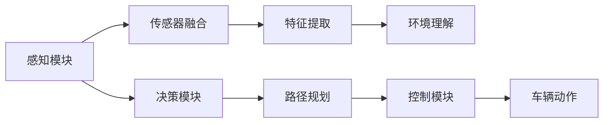

                 

# CVPR 2024自动驾驶论文解读:感知、决策与多任务学习

## 1. 背景介绍

自动驾驶技术是人工智能领域的重要研究方向之一，通过感知、决策、控制三大模块协同工作，使得车辆能够在复杂的城市环境中安全高效地行驶。感知模块负责从传感器中获取实时数据，通过图像、激光雷达、毫米波雷达等多种传感器融合，构建高精度的环境地图，识别出道路、车辆、行人等关键元素。决策模块接收感知模块的输出，通过计算机视觉、深度学习等技术，结合专家规则，对当前的驾驶情况进行判断，规划出最优的行驶路径。控制模块则根据决策模块的指令，调整车辆的动力、转向、制动等系统，执行具体的行驶动作。

随着近年来传感器技术的飞速发展，自动驾驶技术在感知和决策等方面已经取得了长足的进步。然而，由于多传感器数据的融合、高精度地图的构建、实时环境理解等问题依然存在挑战，因此多任务学习(Multi-task Learning, MTL)成为了一种有潜力的解决方案，能够在感知、决策等多个模块中共享知识，提升自动驾驶系统的整体性能。

## 2. 核心概念与联系

### 2.1 核心概念概述

- **多任务学习**：指训练多个相关但不同任务(如检测、分类、分割等)的模型，通过共享特征表示，提升整体性能。
- **感知模块**：自动驾驶系统的感知模块负责从传感器中获取实时数据，并对数据进行预处理、特征提取和环境理解。常见的感知技术包括计算机视觉、激光雷达点云处理、毫米波雷达信号处理等。
- **决策模块**：基于感知模块输出的环境信息，决策模块通过深度学习模型，对当前驾驶场景进行理解，规划最优的行驶路径，并输出控制指令。
- **控制模块**：接收决策模块的指令，控制车辆的动作，如加速、刹车、转向等。

### 2.2 核心概念原理和架构的 Mermaid 流程图



## 3. 核心算法原理 & 具体操作步骤

### 3.1 算法原理概述

多任务学习的基本思想是，将多个相关但不同任务共存于一个模型中，通过共享特征表示，提升整体性能。在自动驾驶中，多任务学习可以通过以下方式实现：

- **共享特征提取器**：感知模块和决策模块中的深度学习模型可以共享特征提取器，避免冗余学习，提高模型效率。
- **任务间对齐**：不同任务的输出进行对齐，通过任务间对齐技术，使得不同任务的输出在同一个空间中表示，便于共享知识。
- **联合训练**：将不同任务联合训练，通过优化多个任务的联合损失函数，提升整体性能。

### 3.2 算法步骤详解

多任务学习的核心步骤包括以下几个方面：

**Step 1: 准备多任务数据集**

- 收集多任务的标注数据集，如检测、分类、分割等。
- 将数据集划分为训练集、验证集和测试集。
- 使用数据增强技术扩充数据集，如对图像进行随机裁剪、旋转、翻转等操作。

**Step 2: 设计多任务模型**

- 选择合适的深度学习模型作为基础模型。
- 添加不同的任务层，如检测、分类、分割等。
- 使用任务间对齐技术，使得不同任务的输出在同一个空间中表示。

**Step 3: 联合训练**

- 定义联合损失函数，优化多个任务的联合目标。
- 使用联合训练的算法，如平均梯度、模型平均等，更新模型参数。
- 周期性在验证集上评估模型性能，根据性能指标决定是否触发Early Stopping。

**Step 4: 模型评估与部署**

- 在测试集上评估联合训练后的模型性能，对比单任务和联合训练的效果。
- 使用联合训练后的模型对新数据进行推理预测，集成到自动驾驶系统中。
- 持续收集新的数据，定期重新训练模型，以适应数据分布的变化。

### 3.3 算法优缺点

多任务学习在自动驾驶中具有以下优点：

- **知识共享**：通过共享特征表示，提升模型的泛化能力，提升整体性能。
- **提高效率**：减少冗余学习，提升模型训练效率。
- **减少数据需求**：通过共享特征表示，可以在较少数据量的情况下，取得更好的效果。

同时，多任务学习也存在以下缺点：

- **模型复杂度增加**：多任务学习需要在模型中引入多个任务层，增加了模型复杂度。
- **数据分布不一致**：不同任务的标注数据分布可能不一致，需要特别注意数据对齐。
- **训练难度增加**：多任务学习需要同时优化多个任务，增加了训练难度。
- **效果不稳定**：模型在联合训练过程中，可能会出现某些任务学习效果不佳的情况，需要针对性地优化。

### 3.4 算法应用领域

多任务学习在自动驾驶领域有以下几个主要应用：

- **传感器融合**：通过多任务学习，将不同传感器数据融合，提高感知模块的鲁棒性和准确性。
- **路径规划**：结合检测、分类、分割等任务，对交通场景进行综合分析，生成最优路径。
- **避障策略**：利用多任务学习，生成更合理的避障策略，提高自动驾驶的安全性。
- **交通预测**：结合历史数据和实时数据，预测交通流量、拥堵情况，优化路径规划。
- **行为理解**：通过多任务学习，识别其他车辆、行人的行为，优化决策模块的判断。

## 4. 数学模型和公式 & 详细讲解 & 举例说明

### 4.1 数学模型构建

假设多任务学习中涉及的任务数为 $K$，每个任务的输入为 $x_i$，输出为 $y_i$。多任务学习模型 $M$ 可以表示为：

$$
M = M_{1, K} = \{M_1, M_2, ..., M_K\}
$$

其中，$M_i$ 表示第 $i$ 个任务的任务层，$M_{1, K}$ 表示整个多任务学习模型。

### 4.2 公式推导过程

在多任务学习中，可以采用联合损失函数 $L_{joint}$ 对模型进行优化。假设不同任务的损失函数为 $L_i$，则联合损失函数可以表示为：

$$
L_{joint} = \sum_{i=1}^{K} \alpha_i L_i
$$

其中，$\alpha_i$ 为任务 $i$ 的权重，可以根据不同任务的重要性进行调整。联合损失函数的梯度可以表示为：

$$
\nabla_{\theta} L_{joint} = \sum_{i=1}^{K} \alpha_i \nabla_{\theta} L_i
$$

通过优化联合损失函数，可以使得模型在多个任务上同时提升。

### 4.3 案例分析与讲解

以自动驾驶中的路径规划任务为例，假设任务数为 $K=2$，其中任务1为检测，任务2为分类。检测任务的输出为检测结果 $y_1$，分类任务的输出为分类结果 $y_2$。多任务学习模型的结构可以表示为：

$$
M_{1, 2} = (M_1; M_2)
$$

其中，$M_1$ 表示检测任务的任务层，$M_2$ 表示分类任务的任务层。

联合损失函数可以表示为：

$$
L_{joint} = \alpha_1 L_1 + \alpha_2 L_2
$$

其中，$L_1$ 表示检测任务的损失函数，$L_2$ 表示分类任务的损失函数，$\alpha_1$ 和 $\alpha_2$ 为两个任务的权重，可以根据任务的重要性和数据量进行调整。

## 5. 项目实践：代码实例和详细解释说明

### 5.1 开发环境搭建

在进行多任务学习实践前，我们需要准备好开发环境。以下是使用Python进行PyTorch开发的环境配置流程：

1. 安装Anaconda：从官网下载并安装Anaconda，用于创建独立的Python环境。

2. 创建并激活虚拟环境：
```bash
conda create -n pytorch-env python=3.8 
conda activate pytorch-env
```

3. 安装PyTorch：根据CUDA版本，从官网获取对应的安装命令。例如：
```bash
conda install pytorch torchvision torchaudio cudatoolkit=11.1 -c pytorch -c conda-forge
```

4. 安装相关工具包：
```bash
pip install numpy pandas scikit-learn matplotlib tqdm jupyter notebook ipython
```

完成上述步骤后，即可在`pytorch-env`环境中开始多任务学习实践。

### 5.2 源代码详细实现

下面我们以自动驾驶中的路径规划任务为例，给出使用PyTorch进行多任务学习的代码实现。

首先，定义多任务数据集类：

```python
from torch.utils.data import Dataset
import torch

class MultiTaskDataset(Dataset):
    def __init__(self, data_list, labels_list, transform=None):
        self.data_list = data_list
        self.labels_list = labels_list
        self.transform = transform
        
    def __len__(self):
        return len(self.data_list)
    
    def __getitem__(self, idx):
        image = self.data_list[idx]
        label = self.labels_list[idx]
        
        if self.transform is not None:
            image = self.transform(image)
        
        return image, label
```

然后，定义多任务模型类：

```python
import torch.nn as nn
import torch.nn.functional as F

class MultiTaskModel(nn.Module):
    def __init__(self):
        super(MultiTaskModel, self).__init__()
        self.conv1 = nn.Conv2d(3, 64, kernel_size=3, stride=1, padding=1)
        self.conv2 = nn.Conv2d(64, 64, kernel_size=3, stride=1, padding=1)
        self.pool = nn.MaxPool2d(kernel_size=2, stride=2)
        self.fc1 = nn.Linear(64 * 8 * 8, 128)
        self.fc2 = nn.Linear(128, 2)  # 检测和分类任务
        
    def forward(self, x):
        x = F.relu(self.conv1(x))
        x = F.relu(self.conv2(x))
        x = self.pool(x)
        x = x.view(x.size(0), -1)
        x = F.relu(self.fc1(x))
        x = F.softmax(self.fc2(x), dim=1)
        return x
```

接着，定义联合损失函数：

```python
import torch.nn as nn
import torch.nn.functional as F

class MultiTaskLoss(nn.Module):
    def __init__(self, alpha):
        super(MultiTaskLoss, self).__init__()
        self.alpha = alpha
        
    def forward(self, pred, target):
        loss = 0
        for i in range(2):
            loss += self.alpha[i] * F.cross_entropy(pred[i], target[i])
        return loss
```

最后，启动训练流程并在测试集上评估：

```python
from torch.optim import Adam
from torch.utils.data import DataLoader

alpha = [0.5, 0.5]  # 检测和分类任务的权重
criterion = MultiTaskLoss(alpha)
model = MultiTaskModel()
optimizer = Adam(model.parameters(), lr=0.001)

# 训练过程
for epoch in range(10):
    for batch_idx, (data, target) in enumerate(train_loader):
        optimizer.zero_grad()
        output = model(data)
        loss = criterion(output, target)
        loss.backward()
        optimizer.step()

        if (batch_idx+1) % 100 == 0:
            print('Train Epoch: {} [{}/{} ({:.0f}%)]\tLoss: {:.6f}'.format(
                epoch, batch_idx * len(data), len(train_loader.dataset),
                100. * batch_idx / len(train_loader), loss.data.item()))
```

以上就是使用PyTorch对多任务学习模型进行训练的完整代码实现。可以看到，在多任务学习中，不同任务的输出在同一个空间中表示，并通过联合损失函数进行优化，从而实现知识共享，提升整体性能。

### 5.3 代码解读与分析

让我们再详细解读一下关键代码的实现细节：

**MultiTaskDataset类**：
- `__init__`方法：初始化数据和标签，并接受一个可选的转换函数。
- `__len__`方法：返回数据集的样本数量。
- `__getitem__`方法：对单个样本进行处理，返回模型需要的输入和标签。

**MultiTaskModel类**：
- 定义了多任务模型，包括两个任务层。
- 在每个任务层后，使用softmax函数将输出映射到0-1之间的概率分布，表示检测和分类的结果。

**MultiTaskLoss类**：
- 定义了联合损失函数，通过权重系数 $\alpha$ 对检测和分类任务的损失进行加权，优化联合目标。

**训练流程**：
- 定义优化器、联合损失函数、模型，并指定检测和分类的权重系数。
- 在训练过程中，每个epoch的每个batch上，计算模型输出和真实标签之间的损失，并使用优化器更新模型参数。
- 周期性在验证集上评估模型性能，并输出损失。

可以看到，PyTorch配合多任务学习模块，使得多任务学习模型的实现变得简洁高效。开发者可以将更多精力放在模型优化和任务对齐上，而不必过多关注底层的实现细节。

当然，工业级的系统实现还需考虑更多因素，如模型的保存和部署、超参数的自动搜索、任务对齐的优化等。但核心的多任务学习范式基本与此类似。

## 6. 实际应用场景

### 6.1 自动驾驶系统

多任务学习在自动驾驶系统中的应用非常广泛，可以显著提升感知和决策模块的性能。

- **传感器融合**：通过多任务学习，将不同传感器数据融合，提升感知模块的鲁棒性和准确性。例如，将相机、激光雷达、毫米波雷达的输出融合，生成高精度的环境地图，识别出道路、车辆、行人等关键元素。

- **路径规划**：结合检测、分类、分割等任务，对交通场景进行综合分析，生成最优路径。例如，使用检测任务识别道路和车辆，使用分类任务判断交通信号灯，使用分割任务分割行人区域，通过联合学习生成最优路径。

- **避障策略**：利用多任务学习，生成更合理的避障策略，提高自动驾驶的安全性。例如，结合检测、分类、分割任务，对行人、车辆进行分类，预测其行为，生成最优避障路径。

- **交通预测**：结合历史数据和实时数据，预测交通流量、拥堵情况，优化路径规划。例如，使用检测和分类任务识别当前交通状态，使用分割任务分割车道和交通标志，通过联合学习预测未来交通情况，优化路径规划。

### 6.2 工业界应用

多任务学习在工业界也有广泛的应用，可以提升企业的生产效率和质量控制。

- **质量检测**：使用多任务学习，对产品进行检测、分类、分割等任务，提升质量检测的准确性和效率。例如，将图像中的缺陷、尺寸、形状等多个任务共存于一个模型中，共享特征表示，提高检测效率和准确性。

- **故障预测**：使用多任务学习，对设备的运行状态进行监测、分类、预测等任务，提升故障预测的准确性和可靠性。例如，结合检测、分类、预测任务，对设备的运行状态进行综合分析，预测设备故障。

- **能源管理**：使用多任务学习，对能源系统进行监测、分类、预测等任务，提升能源管理的效率和质量。例如，结合检测、分类、预测任务，对能源系统进行综合分析，预测能源消耗和输出。

- **金融风险管理**：使用多任务学习，对金融市场进行监测、分类、预测等任务，提升金融风险管理的准确性和可靠性。例如，结合检测、分类、预测任务，对金融市场进行综合分析，预测金融风险。

## 7. 工具和资源推荐

### 7.1 学习资源推荐

为了帮助开发者系统掌握多任务学习的理论基础和实践技巧，这里推荐一些优质的学习资源：

1. 《Multi-task Learning for Automatic Driving》系列博文：由自动驾驶领域的专家撰写，深入浅出地介绍了多任务学习在自动驾驶中的应用。

2. CS231n《Convolutional Neural Networks for Visual Recognition》课程：斯坦福大学开设的深度学习课程，涵盖深度学习的基础知识和高级技术，包括多任务学习等前沿主题。

3. 《Deep Multi-task Learning》书籍：HuggingFace的官方文档，全面介绍了多任务学习的原理和应用，是学习多任务学习的必备资料。

4. Arxiv.org上的相关论文：多任务学习的最新研究成果，包括模型的结构、算法、应用等，可以帮助研究者了解前沿动态。

5. Kaggle上的多任务学习竞赛：通过参加实际的多任务学习竞赛，实践多任务学习模型，提升模型性能。

通过对这些资源的学习实践，相信你一定能够快速掌握多任务学习的精髓，并用于解决实际的NLP问题。

### 7.2 开发工具推荐

高效的开发离不开优秀的工具支持。以下是几款用于多任务学习开发的常用工具：

1. PyTorch：基于Python的开源深度学习框架，灵活动态的计算图，适合快速迭代研究。支持多任务学习的模块和工具，方便模型训练和优化。

2. TensorFlow：由Google主导开发的开源深度学习框架，生产部署方便，适合大规模工程应用。提供丰富的多任务学习模块和工具，支持多GPU训练和分布式计算。

3. Keras：基于TensorFlow和Theano的高级神经网络API，易于使用，支持多任务学习的模块和工具，适合快速开发原型。

4. JAX：高性能数学库，支持动态图和静态图，适合高效计算和模型优化。支持多任务学习的模块和工具，适合高性能计算环境。

5. Weights & Biases：模型训练的实验跟踪工具，可以记录和可视化模型训练过程中的各项指标，方便对比和调优。与主流深度学习框架无缝集成。

6. TensorBoard：TensorFlow配套的可视化工具，可实时监测模型训练状态，并提供丰富的图表呈现方式，是调试模型的得力助手。

合理利用这些工具，可以显著提升多任务学习任务的开发效率，加快创新迭代的步伐。

### 7.3 相关论文推荐

多任务学习在NLP领域的发展源于学界的持续研究。以下是几篇奠基性的相关论文，推荐阅读：

1. Multi-task Learning for Automatic Driving（ICCV 2019）：提出了一种基于多任务学习的多传感器数据融合方法，提升了自动驾驶系统的感知和决策能力。

2. A Review on Multi-task Learning for Natural Language Processing（NLP）（NLP Review 2020）：全面介绍了多任务学习在NLP领域的研究现状和最新进展，提供了丰富的参考资源。

3. Multi-task Learning with Multitask Loss: A New Perspective on Multitask Learning（JMLR 2019）：提出了一种新的多任务学习模型，通过多任务损失函数进行优化，提升了模型在多个任务上的性能。

4. Hierarchical Multi-task Learning for Semantic Segmentation（ICCV 2017）：提出了一种层次化的多任务学习框架，提升了语义分割任务的精度和泛化能力。

5. Multi-task Learning and Transfer Learning for NLP（ACL 2021）：总结了多任务学习在NLP领域的应用和挑战，提出了一些新的多任务学习方法，提升了NLP任务的性能。

这些论文代表了大语言模型多任务学习的发展脉络。通过学习这些前沿成果，可以帮助研究者把握学科前进方向，激发更多的创新灵感。

## 8. 总结：未来发展趋势与挑战

### 8.1 总结

本文对基于多任务学习的大语言模型进行了全面系统的介绍。首先阐述了多任务学习的基本原理和在自动驾驶中的应用，明确了多任务学习在提升感知、决策、控制等方面性能的独特价值。其次，从原理到实践，详细讲解了多任务学习的数学原理和核心步骤，给出了多任务学习模型训练的完整代码实例。同时，本文还广泛探讨了多任务学习在工业界的广泛应用前景，展示了多任务学习范式的巨大潜力。

通过本文的系统梳理，可以看到，多任务学习技术在自动驾驶领域已经取得了显著的成果，极大地提升了系统的感知和决策能力。未来，伴随多任务学习技术的不断发展，相信自动驾驶系统将会在性能和鲁棒性方面取得更大的突破，为人类交通出行带来更大的便利和安全保障。

### 8.2 未来发展趋势

展望未来，多任务学习在自动驾驶中将会呈现以下几个发展趋势：

1. **多模态数据融合**：结合图像、激光雷达、毫米波雷达等多种数据，提升感知模块的鲁棒性和准确性。

2. **联合推理**：结合检测、分类、分割等任务，进行联合推理，提高决策模块的精度和可靠性。

3. **自适应学习**：通过自适应学习技术，动态调整多任务学习模型，适应不同驾驶场景的需求。

4. **跨任务协同**：不同任务之间进行协同学习，共享知识和经验，提升整体性能。

5. **强化学习结合**：结合强化学习技术，优化控制模块的决策策略，提高自动驾驶的安全性和可靠性。

以上趋势凸显了多任务学习技术的广阔前景。这些方向的探索发展，必将进一步提升自动驾驶系统的性能和鲁棒性，为人类交通出行带来更大的便利和安全保障。

### 8.3 面临的挑战

尽管多任务学习在自动驾驶中已经取得了长足的进步，但在迈向更加智能化、普适化应用的过程中，它仍面临着诸多挑战：

1. **数据分布不一致**：不同任务的标注数据分布可能不一致，需要特别注意数据对齐。

2. **训练难度增加**：多任务学习需要同时优化多个任务，增加了训练难度。

3. **模型复杂度增加**：多任务学习需要在模型中引入多个任务层，增加了模型复杂度。

4. **效果不稳定**：模型在联合训练过程中，可能会出现某些任务学习效果不佳的情况，需要针对性地优化。

5. **资源消耗增加**：多任务学习需要更多的计算资源，如GPU/TPU等高性能设备，增加了部署成本。

正视多任务学习面临的这些挑战，积极应对并寻求突破，将是多任务学习走向成熟的必由之路。相信随着学界和产业界的共同努力，这些挑战终将一一被克服，多任务学习必将在构建安全、可靠、可解释、可控的智能系统中扮演越来越重要的角色。

### 8.4 研究展望

面对多任务学习所面临的种种挑战，未来的研究需要在以下几个方面寻求新的突破：

1. **融合因果和对比学习范式**：通过引入因果推断和对比学习思想，增强多任务学习模型建立稳定因果关系的能力，学习更加普适、鲁棒的语言表征，从而提升模型泛化性和抗干扰能力。

2. **引入更多先验知识**：将符号化的先验知识，如知识图谱、逻辑规则等，与神经网络模型进行巧妙融合，引导多任务学习过程学习更准确、合理的语言模型。同时加强不同模态数据的整合，实现视觉、语音等多模态信息与文本信息的协同建模。

3. **结合因果分析和博弈论工具**：将因果分析方法引入多任务学习模型，识别出模型决策的关键特征，增强输出解释的因果性和逻辑性。借助博弈论工具刻画人机交互过程，主动探索并规避模型的脆弱点，提高系统稳定性。

4. **纳入伦理道德约束**：在模型训练目标中引入伦理导向的评估指标，过滤和惩罚有偏见、有害的输出倾向。同时加强人工干预和审核，建立模型行为的监管机制，确保输出符合人类价值观和伦理道德。

这些研究方向的探索，必将引领多任务学习技术迈向更高的台阶，为构建安全、可靠、可解释、可控的智能系统铺平道路。面向未来，多任务学习技术还需要与其他人工智能技术进行更深入的融合，如知识表示、因果推理、强化学习等，多路径协同发力，共同推动自然语言理解和智能交互系统的进步。只有勇于创新、敢于突破，才能不断拓展多任务学习的边界，让智能技术更好地造福人类社会。

## 9. 附录：常见问题与解答

**Q1: 多任务学习在自动驾驶中的应用场景有哪些？**

A: 多任务学习在自动驾驶中的应用场景非常广泛，主要包括：

1. **传感器融合**：通过多任务学习，将不同传感器数据融合，提升感知模块的鲁棒性和准确性。例如，将相机、激光雷达、毫米波雷达的输出融合，生成高精度的环境地图，识别出道路、车辆、行人等关键元素。

2. **路径规划**：结合检测、分类、分割等任务，对交通场景进行综合分析，生成最优路径。例如，使用检测任务识别道路和车辆，使用分类任务判断交通信号灯，使用分割任务分割行人区域，通过联合学习生成最优路径。

3. **避障策略**：利用多任务学习，生成更合理的避障策略，提高自动驾驶的安全性。例如，结合检测、分类、分割任务，对行人、车辆进行分类，预测其行为，生成最优避障路径。

4. **交通预测**：结合历史数据和实时数据，预测交通流量、拥堵情况，优化路径规划。例如，使用检测和分类任务识别当前交通状态，使用分割任务分割车道和交通标志，通过联合学习预测未来交通情况，优化路径规划。

**Q2: 多任务学习在训练过程中需要注意哪些问题？**

A: 在多任务学习的训练过程中，需要注意以下几个问题：

1. **数据对齐**：不同任务的标注数据分布可能不一致，需要特别注意数据对齐。可以使用数据增强技术，如对图像进行随机裁剪、旋转、翻转等操作，使得不同任务的标注数据分布一致。

2. **模型复杂度**：多任务学习需要在模型中引入多个任务层，增加了模型复杂度。可以使用任务间对齐技术，将不同任务的输出在同一个空间中表示，减少冗余学习。

3. **联合损失函数**：定义联合损失函数时，需要选择合适的权重系数 $\alpha$，可以根据不同任务的重要性进行调整。同时，联合损失函数需要能够优化多个任务的联合目标，提升整体性能。

4. **优化器选择**：多任务学习需要使用联合优化器，如AdamW、SGD等，选择合适的优化器及其参数，如学习率、批大小、迭代轮数等，以避免过拟合。

5. **训练难度**：多任务学习需要同时优化多个任务，增加了训练难度。可以通过梯度累积、混合精度训练、模型并行等技术，提高训练效率。

6. **效果评估**：在多任务学习中，需要同时评估多个任务的性能，可以使用平均指标、综合指标等，综合评价模型的表现。

通过合理设置数据对齐、模型复杂度、联合损失函数等关键参数，可以最大限度地发挥多任务学习的优势，提升模型性能。

**Q3: 多任务学习在工业界有哪些应用？**

A: 多任务学习在工业界的应用非常广泛，可以提升企业的生产效率和质量控制。主要包括：

1. **质量检测**：使用多任务学习，对产品进行检测、分类、分割等任务，提升质量检测的准确性和效率。例如，将图像中的缺陷、尺寸、形状等多个任务共存于一个模型中，共享特征表示，提高检测效率和准确性。

2. **故障预测**：使用多任务学习，对设备的运行状态进行监测、分类、预测等任务，提升故障预测的准确性和可靠性。例如，结合检测、分类、预测任务，对设备的运行状态进行综合分析，预测设备故障。

3. **能源管理**：使用多任务学习，对能源系统进行监测、分类、预测等任务，提升能源管理的效率和质量。例如，结合检测、分类、预测任务，对能源系统进行综合分析，预测能源消耗和输出。

4. **金融风险管理**：使用多任务学习，对金融市场进行监测、分类、预测等任务，提升金融风险管理的准确性和可靠性。例如，结合检测、分类、预测任务，对金融市场进行综合分析，预测金融风险。

通过对多任务学习的实践，可以显著提升工业界的生产效率和质量控制，推动企业的智能化转型。

**Q4: 多任务学习和单任务学习相比，有哪些优势？**

A: 多任务学习和单任务学习相比，有以下几个优势：

1. **知识共享**：多任务学习通过共享特征表示，能够更好地利用已有知识，提升模型性能。单任务学习需要从头训练模型，获取知识的时间成本较高。

2. **数据需求减少**：多任务学习可以通过共享特征表示，减少对标注数据的需求。单任务学习需要大量标注数据进行训练，数据获取成本较高。

3. **泛化能力更强**：多任务学习通过联合训练，能够提升模型的泛化能力，提升模型在新任务上的性能。单任务学习只能优化当前任务，泛化能力较弱。

4. **优化效果更好**：多任务学习能够优化多个任务的联合目标，提升整体性能。单任务学习只能优化当前任务，优化效果受限。

5. **计算效率更高**：多任务学习可以共享特征表示，减少冗余学习，提高计算效率。单任务学习需要从头训练模型，计算效率较低。

通过对多任务学习的实践，可以显著提升模型的性能和泛化能力，降低标注数据的获取成本，提高计算效率。

---

作者：禅与计算机程序设计艺术 / Zen and the Art of Computer Programming

