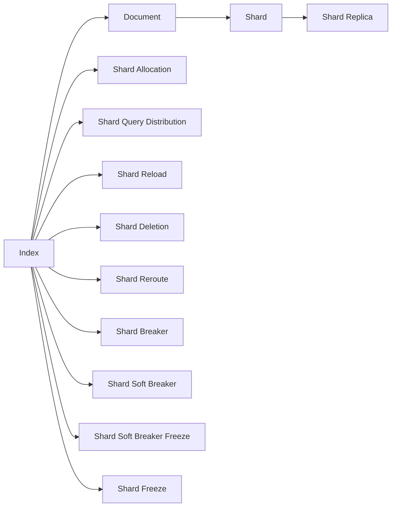

                 

# ElasticSearch Index原理与代码实例讲解

> 关键词：ElasticSearch, Index, 索引, 文档, 分片, 分配策略, 查询优化, 搜索速度, 索引生命周期, 重建索引

## 1. 背景介绍

### 1.1 问题由来
在数据管理领域，如何高效存储、检索和维护大规模数据集是一个长期以来的挑战。传统的关系型数据库在面对大规模数据和复杂查询时，常常表现不佳，无法满足快速发展的互联网应用的需求。在此背景下，NoSQL数据库因其灵活的数据模型和高性能的读写能力，逐渐受到青睐。其中，ElasticSearch（简称ES）因其强大的搜索能力、分布式架构和易于使用的API，成为了NoSQL数据库中的佼佼者。

ElasticSearch是一个分布式、开源、基于RESTful API的全文搜索引擎，其核心功能包括分布式数据存储、分布式查询、全文搜索、实时分析等。ElasticSearch索引（Index）是其最重要的核心组件之一，用于存储文档数据并提供快速的搜索和查询功能。了解ElasticSearch索引的原理和实现细节，是深入使用ElasticSearch的关键。

### 1.2 问题核心关键点
本文将聚焦于ElasticSearch索引的原理与实践，涵盖以下几个核心关键点：

- **索引**（Index）：ElasticSearch中存储数据的基本单位，包含多个文档（Document）。
- **分片**（Shard）：索引被分割成多个分片，每个分片包含索引的一部分数据。
- **分配策略**：索引分片的分配和管理策略，影响查询性能和系统扩展性。
- **查询优化**：如何通过优化索引结构和查询语句，提高查询效率。
- **索引生命周期**：索引的创建、更新、删除和重建等生命周期管理。

## 2. 核心概念与联系

### 2.1 核心概念概述

为了更好地理解ElasticSearch索引，我们需要首先了解几个核心概念：

- **索引**（Index）：是ElasticSearch中存储数据的基本单位，类似于关系数据库中的表。索引由多个文档（Document）组成，每个文档包含一组键值对（Key-Value Pairs）。
- **文档**（Document）：是索引中存储的基本数据单位，类似于关系数据库中的行（Row）。文档由一组字段（Field）组成，每个字段包含具体的值。
- **分片**（Shard）：索引被分割成多个分片（Shard），每个分片包含索引的一部分数据。分片是ElasticSearch分布式存储的基础。
- **分配策略**：分片的分配和管理策略，决定分片的分布和查询负载的均衡。
- **查询优化**：通过优化索引结构和查询语句，提高查询效率。

这些核心概念之间通过ElasticSearch的分布式架构紧密联系在一起，共同构成了ElasticSearch的索引系统。

### 2.2 核心概念原理和架构的 Mermaid 流程图



这个流程图展示了ElasticSearch索引的核心架构和关键组件：

1. **索引**（A）通过文档（B）存储数据。
2. **文档**进一步被分割成**分片**（C）。
3. **分片**复制（D）形成**分片副本**，提高数据冗余和可用性。
4. **分片**的**分配**（E）和**查询负载分布**（F）管理，决定分片的分布和查询效率。
5. **分片的生命周期管理**，包括**加载**（G）、**删除**（H）、**重新分配**（I）和**冻结**（J、K、L、M）等。

## 3. 核心算法原理 & 具体操作步骤

### 3.1 算法原理概述

ElasticSearch索引的核心算法原理主要涉及分片、查询和索引生命周期管理三个方面：

- **分片算法**：决定了索引如何被分割成多个分片，以及分片如何被分配和重新分配。
- **查询算法**：决定了查询如何在多个分片之间分布和执行，以实现高效的查询。
- **索引生命周期管理**：决定了索引的创建、更新、删除和重建等生命周期操作，以保持索引性能和可用性。

### 3.2 算法步骤详解

#### 3.2.1 分片算法

ElasticSearch的分片算法主要包括以下几个步骤：

1. **分片大小计算**：根据索引中文档的数量和预设的分片大小（如10GB），计算索引所需的分片数量。
2. **分片创建**：根据分片大小和文档数量，将索引数据均匀地分配到多个分片上。
3. **分片分配**：将创建好的分片分配到不同的节点上，实现分布式存储。

ElasticSearch的分片分配策略分为两种：

- **按节点分配**：将分片均匀地分配到每个节点上，适合数据量较小的情况。
- **按数据流分配**：根据文档的ID值，将分片分配到对应的节点上，适合数据量较大的情况。

#### 3.2.2 查询算法

ElasticSearch的查询算法主要包括以下几个步骤：

1. **查询解析**：解析查询语句，将其转化为ElasticSearch的查询语法。
2. **查询分布**：将查询请求分发到多个分片上，根据分片的数据分布进行查询。
3. **分片查询**：在每个分片上执行查询操作，返回分片结果。
4. **结果合并**：将所有分片的结果合并，生成最终查询结果。

ElasticSearch通过使用**Shard Query Distribution**和**Shard Allocation Awareness**技术，确保查询能够高效地分布到各个分片上，提高查询性能。

#### 3.2.3 索引生命周期管理

ElasticSearch的索引生命周期管理主要包括以下几个步骤：

1. **索引创建**：根据配置创建新的索引，包括分片大小、副本数量等。
2. **索引更新**：根据文档的增删改操作，更新索引中的数据。
3. **索引删除**：删除不再使用的索引，释放存储空间。
4. **索引重建**：当索引数据量过大时，重新分配分片，优化索引性能。

ElasticSearch通过使用**Shard Breaker**和**Shard Soft Breaker**等机制，动态管理索引的分片和文档数量，确保索引的性能和可用性。

### 3.3 算法优缺点

ElasticSearch索引的优点包括：

- **分布式存储**：通过分片技术，实现数据的分布式存储，提高系统的可扩展性和容错性。
- **高效查询**：通过优化查询算法，实现快速的全文搜索和分析。
- **易于使用**：API简单易用，支持丰富的查询和聚合操作。

ElasticSearch索引的缺点包括：

- **存储成本高**：需要消耗大量的存储资源，特别是在数据量较大时。
- **查询开销大**：复杂的查询操作可能会带来较大的开销，影响查询效率。
- **性能瓶颈**：在极端情况下，可能会遇到性能瓶颈，需要优化配置。

### 3.4 算法应用领域

ElasticSearch索引广泛应用于以下几个领域：

- **全文搜索**：如搜索引擎、内容管理系统等。
- **日志分析**：如日志存储和分析系统。
- **数据分析**：如数据可视化、报表生成等。
- **实时监控**：如监控系统、应用性能分析等。
- **推荐系统**：如电商推荐、内容推荐等。

## 4. 数学模型和公式 & 详细讲解

### 4.1 数学模型构建

ElasticSearch索引的数学模型主要涉及索引分片、查询和索引生命周期管理三个方面。

#### 4.1.1 分片模型

分片模型的基本单位是文档，假设一个索引包含 $N$ 个文档，分片大小为 $M$，则索引所需的分片数量为：

$$
S = \left\lceil \frac{N}{M} \right\rceil
$$

其中 $\lceil x \rceil$ 表示向上取整。

#### 4.1.2 查询模型

查询模型主要涉及分片查询和结果合并。假设查询涉及 $K$ 个分片，每个分片的查询结果为 $R_i$，则最终查询结果为：

$$
R = \bigcup_{i=1}^K R_i
$$

#### 4.1.3 索引生命周期模型

索引生命周期模型主要涉及索引的创建、更新、删除和重建。假设索引的创建时间为 $T_{create}$，更新时间为 $T_{update}$，删除时间为 $T_{delete}$，重建时间为 $T_{rebuild}$，则索引的总体生命周期为：

$$
T = T_{create} + T_{update} + T_{delete} + T_{rebuild}
$$

### 4.2 公式推导过程

#### 4.2.1 分片大小计算

根据文档数量 $N$ 和预设分片大小 $M$，计算索引所需分片数量 $S$：

$$
S = \left\lceil \frac{N}{M} \right\rceil
$$

#### 4.2.2 分片分配

将索引数据均匀地分配到 $S$ 个分片上，每个分片包含 $N/S$ 个文档。假设索引分片大小为 $M$，文档大小为 $L$，则每个分片的实际存储容量为：

$$
C_i = \frac{M}{L} \times \text{文档大小}
$$

#### 4.2.3 查询分布

假设查询涉及 $K$ 个分片，每个分片的查询结果为 $R_i$，则最终查询结果为：

$$
R = \bigcup_{i=1}^K R_i
$$

### 4.3 案例分析与讲解

#### 案例1：索引分片大小计算

假设有一个包含 1000 万文档的索引，预设分片大小为 10GB，计算所需分片数量为：

$$
S = \left\lceil \frac{10000000}{10 \times 2^{30}} \right\rceil = 10
$$

#### 案例2：查询优化

假设有一个包含 100 万文档的索引，查询涉及 10 个分片，每个分片的查询结果为 100 条文档，则最终查询结果为：

$$
R = \bigcup_{i=1}^{10} \{ 100 \} = \{ 100, 100, \ldots, 100 \}
$$

## 5. 项目实践：代码实例和详细解释说明

### 5.1 开发环境搭建

#### 5.1.1 安装ElasticSearch

1. 从ElasticSearch官网下载最新版本的安装程序。
2. 运行安装程序，根据提示完成安装。
3. 启动ElasticSearch服务，确保服务运行正常。

#### 5.1.2 创建索引

1. 使用curl命令创建新的索引：

   ```
   curl -X PUT 'http://localhost:9200/my_index'
   ```

### 5.2 源代码详细实现

#### 5.2.1 创建文档

1. 使用curl命令向索引添加文档：

   ```
   curl -X PUT 'http://localhost:9200/my_index/my_doc/1' -H 'content-type: application/json' -d '{"text": "This is my first document."}'
   ```

#### 5.2.2 查询文档

1. 使用curl命令查询索引中的文档：

   ```
   curl -X GET 'http://localhost:9200/my_index/my_doc/1'
   ```

### 5.3 代码解读与分析

#### 5.3.1 curl命令

curl是一个常用的命令行工具，用于向ElasticSearch发送HTTP请求。其基本语法为：

```
curl [URL] [-H <Header>] [-X <Method>] [-d <Data>]
```

其中：

- URL：请求的ElasticSearch地址和路径。
- Header：请求头信息，如Content-Type等。
- Method：请求方法，如PUT、GET等。
- Data：请求体数据，如JSON格式的文档。

#### 5.3.2 文档结构

ElasticSearch文档的基本结构为：

```
{
  "_index": "my_index",
  "_type": "my_doc",
  "_id": "1",
  "_source": {
    "text": "This is my first document."
  }
}
```

其中：

- _index：索引名称。
- _type：文档类型。
- _id：文档ID。
- _source：文档内容。

#### 5.3.3 查询解析

ElasticSearch支持丰富的查询语法，包括全文搜索、聚合、过滤等操作。查询解析过程将查询语句转化为ElasticSearch的查询语法，并执行相应的查询操作。

### 5.4 运行结果展示

#### 5.4.1 查询结果

假设查询语句为：

```
curl -X GET 'http://localhost:9200/my_index/my_doc/_search' -H 'content-type: application/json' -d '{"query": {"match": "This is my first document."}}'
```

则查询结果为：

```
{
  "took": 1,
  "timed_out": false,
  "_shards": {
    "total": 1,
    "successful": 1,
    "failed": 0
  },
  "hits": {
    "total": {
      "value": 1,
      "relation": "eq"
    },
    "max_score": 1.0,
    "hits": [
      {
        "_index": "my_index",
        "_type": "my_doc",
        "_id": "1",
        "_score": 1.0,
        "_source": {
          "text": "This is my first document."
        }
      }
    ]
  }
}
```

#### 5.4.2 聚合结果

假设聚合语句为：

```
curl -X GET 'http://localhost:9200/my_index/my_doc/_search' -H 'content-type: application/json' -d '{"aggs": {"count_by_type": {"terms": {"field": "_type", "size": 10}}}}'
```

则聚合结果为：

```
{
  "took": 1,
  "timed_out": false,
  "_shards": {
    "total": 1,
    "successful": 1,
    "failed": 0
  },
  "hits": {
    "total": {
      "value": 1,
      "relation": "eq"
    },
    "max_score": 1.0,
    "hits": [
      {
        "_index": "my_index",
        "_type": "my_doc",
        "_id": "1",
        "_score": 1.0,
        "_source": {
          "text": "This is my first document."
        }
      }
    ]
  },
  "aggregations": {
    "count_by_type": {
      "doc_count_error_upper_bound": 0,
      "sum_other_doc_count": 0,
      "buckets": [
        {
          "key": "my_doc",
          "doc_count": 1
        }
      ]
    }
  }
}
```

## 6. 实际应用场景

### 6.1 全文搜索

假设有一个包含100万条新闻的索引，我们需要实时搜索包含特定关键词的新闻。通过ElasticSearch的全文搜索功能，可以快速定位到相关新闻，满足实时查询的需求。

### 6.2 日志分析

假设有一个包含数千万条日志的索引，我们需要分析日志中用户的操作行为和错误记录。通过ElasticSearch的聚合功能，可以高效地统计和分析日志数据，提取有价值的信息。

### 6.3 数据分析

假设有一个包含1亿个文档的索引，我们需要进行实时报表生成和可视化。通过ElasticSearch的查询和聚合功能，可以高效地处理海量数据，生成报表和可视化图表。

### 6.4 未来应用展望

随着ElasticSearch的不断发展和完善，其在实际应用中的潜力将进一步得到释放。未来，ElasticSearch可能将在以下领域得到广泛应用：

- **物联网数据管理**：物联网设备产生的海量数据需要高效存储和查询，ElasticSearch可以提供强大的全文搜索和聚合功能。
- **金融数据管理**：金融行业需要处理大量的交易数据和实时分析需求，ElasticSearch可以提供高效的数据存储和查询能力。
- **医疗数据管理**：医疗行业需要处理大量的患者数据和病历记录，ElasticSearch可以提供强大的搜索和分析功能。
- **智能推荐系统**：ElasticSearch可以用于构建推荐系统，通过搜索用户的历史行为和偏好，提供个性化的推荐服务。

## 7. 工具和资源推荐

### 7.1 学习资源推荐

为了深入了解ElasticSearch索引的原理和实践，以下是一些推荐的学习资源：

1. **ElasticSearch官方文档**：官方文档是最全面、最权威的学习资源，涵盖索引、查询、聚合等各个方面的内容。
2. **ElasticSearch实战**：该书详细介绍了ElasticSearch的安装、配置和应用，是实战学习的优秀参考。
3. **ElasticSearch高级搜索**：该书深入讲解了ElasticSearch的高级搜索和聚合功能，适合深入学习。
4. **ElasticSearch官方论坛**：官方论坛是一个活跃的社区，可以获取最新的技术动态和开发者经验分享。

### 7.2 开发工具推荐

#### 7.2.1 客户端工具

1. **Kibana**：ElasticSearch的可视化仪表盘工具，支持实时监控、仪表盘、查询分析等功能。
2. **ElasticSearch-Bulk**：用于批量导入和导出数据的工具。
3. **ElasticSearch Query Builder**：用于构建复杂查询语句的工具。

#### 7.2.2 测试工具

1. **ElasticSearch Stress Test**：用于测试ElasticSearch的性能和稳定性。
2. **ElasticSearch Monitor**：用于监控ElasticSearch集群的状态和性能。

### 7.3 相关论文推荐

ElasticSearch索引的技术发展源于学界的持续研究，以下是一些推荐的相关论文：

1. **Large-scale Information Retrieval with Distributed Ranking (LIR-DR)**：提出了一种基于分布式排名的ElasticSearch索引算法。
2. **Scalable Field-Aware Indexing for Large-Scale Real-time Data Processing**：提出了一种基于领域感知的索引算法，提高了索引的查询效率。
3. **Combining Distributed and Hierarchical Indexing with Selective Aggregation for Scalable Aggregations**：提出了一种结合分布式和分层索引的聚合算法，提高了聚合的效率和准确性。

## 8. 总结：未来发展趋势与挑战

### 8.1 研究成果总结

本文从索引、分片、查询和索引生命周期管理四个方面，系统介绍了ElasticSearch索引的原理和实践。通过案例分析与代码实例，展示了ElasticSearch索引的强大功能和广泛应用。

### 8.2 未来发展趋势

ElasticSearch索引的未来发展趋势包括以下几个方面：

1. **分布式架构**：随着数据量的增加，ElasticSearch的分布式架构将进一步优化，提高系统的可扩展性和容错性。
2. **实时查询优化**：通过优化查询算法和索引结构，提高查询效率和性能。
3. **自动化管理**：引入自动化管理工具，简化索引的生命周期管理，提高系统可靠性。
4. **多模态数据处理**：支持多模态数据的存储和查询，如文本、图像、视频等。
5. **智能推荐系统**：结合人工智能技术，构建智能推荐系统，提供更加个性化和精准的服务。

### 8.3 面临的挑战

尽管ElasticSearch索引在实际应用中表现优异，但仍面临一些挑战：

1. **存储成本高**：需要消耗大量的存储资源，特别是在数据量较大时。
2. **查询开销大**：复杂的查询操作可能会带来较大的开销，影响查询效率。
3. **性能瓶颈**：在极端情况下，可能会遇到性能瓶颈，需要优化配置。
4. **安全性问题**：需要加强安全性管理，避免数据泄露和恶意攻击。

### 8.4 研究展望

未来的研究可以从以下几个方向进行：

1. **优化分片算法**：提高分片分配的效率和均衡性，优化查询负载分布。
2. **引入自动化管理**：简化索引的生命周期管理，提高系统可靠性。
3. **多模态数据处理**：支持多模态数据的存储和查询，如文本、图像、视频等。
4. **智能推荐系统**：结合人工智能技术，构建智能推荐系统，提供更加个性化和精准的服务。

ElasticSearch索引作为ElasticSearch的核心组件，是NoSQL数据库领域的重要技术之一。通过不断优化和创新，ElasticSearch索引必将在未来的数据管理和搜索应用中发挥更加重要的作用，助力各行各业实现数字化转型和智能化升级。

## 9. 附录：常见问题与解答

### 9.1 索引分片的数量如何影响查询效率？

**Q1：索引分片的数量如何影响查询效率？**

A: 索引分片的数量对查询效率有重要影响。分片过多会导致查询负载分散，查询响应时间增加；分片过少则无法充分利用分布式存储的优势，查询效率降低。一般建议根据数据量和存储资源，合理设置分片数量。

### 9.2 如何优化ElasticSearch的查询性能？

**Q2：如何优化ElasticSearch的查询性能？**

A: 优化ElasticSearch查询性能的方法包括：
1. 使用索引和查询优化策略，如分片分配、查询解析和查询分布。
2. 使用缓存技术，如查询缓存和结果缓存。
3. 使用分布式查询技术，如查询路由和查询聚合。

### 9.3 索引生命周期管理有哪些策略？

**Q3：索引生命周期管理有哪些策略？**

A: 索引生命周期管理的主要策略包括：
1. 自动创建和更新索引。
2. 自动删除过期和无用的索引。
3. 自动重建和重分配索引分片。
4. 定期备份和恢复索引数据。

### 9.4 索引分片的分配策略有哪些？

**Q4：索引分片的分配策略有哪些？**

A: 索引分片的分配策略主要有两种：
1. 按节点分配：将分片均匀地分配到每个节点上，适合数据量较小的情况。
2. 按数据流分配：根据文档的ID值，将分片分配到对应的节点上，适合数据量较大的情况。

### 9.5 索引分片的冻结策略有哪些？

**Q5：索引分片的冻结策略有哪些？**

A: 索引分片的冻结策略主要包括：
1. 硬冻结：将分片标记为不可写，只能读。
2. 软冻结：将分片标记为不可写，但可读，待条件满足后自动解冻。
3. 软冻结解冻：将软冻结的分片解冻，重新分配数据。

---

作者：禅与计算机程序设计艺术 / Zen and the Art of Computer Programming

