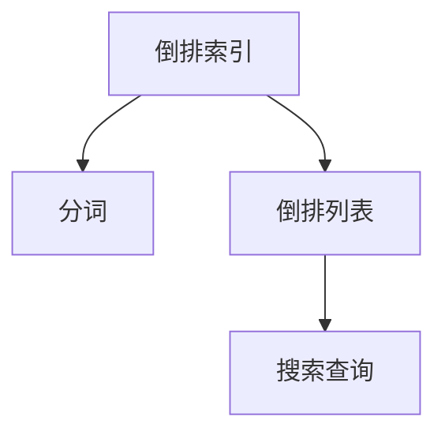

                 

# ElasticSearch倒排索引原理与代码实例讲解

> 关键词：ElasticSearch, 倒排索引, 核心概念, 核心算法, 代码实例

## 1. 背景介绍

### 1.1 问题由来
随着数据量的爆炸性增长，传统关系型数据库难以有效存储和检索大量非结构化数据。搜索引擎如ElasticSearch、Solr等，以其高效的索引、搜索能力，逐步成为处理大规模数据的关键工具。ElasticSearch是一款基于Lucene的分布式搜索引擎，以其灵活、易用的API和强大的搜索能力，成为构建高可用、高可扩展搜索引擎的首选。

### 1.2 问题核心关键点
ElasticSearch的核心创新点在于其倒排索引(Inverted Index)数据结构。倒排索引通过将文档内容倒排(即：单词-文档映射)存储，使得基于单词的搜索可以高效进行。倒排索引是ElasticSearch处理大数据量搜索的关键技术，理解倒排索引原理和实现方式，是深入ElasticSearch的核心。

## 2. 核心概念与联系

### 2.1 核心概念概述

为更好地理解ElasticSearch的倒排索引原理，本节将介绍几个密切相关的核心概念：

- 倒排索引(Inverted Index)：一种将文档内容倒排存储的数据结构，以单词-文档映射关系为索引，快速定位包含某个单词的文档。倒排索引是搜索引擎的核心，ElasticSearch基于倒排索引实现高效的文档检索。
- 分词(Tokenization)：将文本分割成单词或词组的过程。ElasticSearch内置的Analyzers根据不同语言特点，自动进行分词。
- 倒排列表(Inverted List)：倒排索引的核心部分，存储每个单词出现的文档列表。倒排列表支持快速查询包含指定单词的文档。
- 搜索查询(Seek)：通过倒排索引快速定位包含指定单词的文档，并进行文本匹配。ElasticSearch提供灵活的查询API，支持复杂搜索场景。

这些核心概念之间的逻辑关系可以通过以下Mermaid流程图来展示：



这个流程图展示了大规模文本处理的基本流程：先对文本进行分词，再构建倒排索引，最后通过倒排索引实现快速搜索。

## 3. 核心算法原理 & 具体操作步骤
### 3.1 算法原理概述

ElasticSearch的倒排索引算法核心是构建单词-文档映射关系，即倒排列表。其主要步骤包括分词、构建倒排列表、以及基于倒排列表的快速搜索。

### 3.2 算法步骤详解

**Step 1: 分词处理**
- 在ElasticSearch中，分词处理是构建倒排索引的第一步。ElasticSearch内置了多种分词器(Analyzers)，如Standard Analyzer、Whitespace Analyzer等，可以根据不同需求选择分词方式。
- 对于英文文本，通常使用Standard Analyzer进行分词。Standard Analyzer会自动将文本中的标点、数字等特殊字符去除，并转换为小写，最后生成单词列表。

**Step 2: 构建倒排列表**
- 倒排列表是倒排索引的核心数据结构，用于记录每个单词出现的文档列表。倒排列表的构建分为两个步骤：
  1. 遍历所有文档，将文档内容进行分词处理。
  2. 对于每个单词，记录其在文档中出现的次数和位置，构建倒排列表。
- 倒排列表通常以Map-List的形式存储，即Map表示单词，List表示包含该单词的文档列表。

**Step 3: 搜索查询**
- 基于倒排列表，ElasticSearch可以快速定位包含指定单词的文档，并进行文本匹配。ElasticSearch提供了灵活的查询API，支持复杂的布尔查询、范围查询、文本匹配查询等。
- 查询过程中，ElasticSearch通过倒排列表定位包含指定单词的文档，并从文档中提取匹配结果。ElasticSearch的查询优化技术如shard query、term vector等，进一步提升了搜索效率。

### 3.3 算法优缺点

ElasticSearch倒排索引算法具有以下优点：
1. 高效存储和检索：倒排索引能够高效存储和检索大规模文本数据，支持快速定位和文本匹配。
2. 高可扩展性：ElasticSearch支持分布式部署，通过多个节点扩展搜索能力。
3. 灵活查询API：ElasticSearch提供了灵活的查询API，支持复杂查询和聚合操作。
4. 实时更新：ElasticSearch支持实时更新索引，确保数据新鲜性。

同时，该算法也存在一些缺点：
1. 内存消耗大：倒排索引需要存储大量的倒排列表，对内存需求较高。
2. 复杂度较高：构建和维护倒排索引的复杂度较高，需要大量计算资源。
3. 并发写入困难：倒排索引的写入和更新操作复杂，容易导致并发写入冲突。
4. 内存碎片化：倒排列表中的List部分可能出现内存碎片化，影响查询效率。

### 3.4 算法应用领域

ElasticSearch倒排索引算法在搜索引擎、大数据分析、文本挖掘等领域得到了广泛应用：

- 搜索引擎：ElasticSearch广泛用于构建各类搜索引擎，支持实时搜索和复杂查询。
- 大数据分析：ElasticSearch支持在大量数据中快速进行检索和分析，用于数据挖掘、趋势分析等场景。
- 文本挖掘：ElasticSearch可以用于构建文本分类、情感分析等NLP应用，提升文本处理能力。
- 日志分析：ElasticSearch可以处理海量日志数据，进行日志监控、异常检测等操作。

ElasticSearch的倒排索引技术，已经成为搜索引擎和分布式系统领域的重要基石，引领了大数据搜索和文本处理的潮流。

## 4. 数学模型和公式 & 详细讲解 & 举例说明

### 4.1 数学模型构建

ElasticSearch倒排索引的数学模型相对简单。假设有一个包含$N$个文档的集合$D$，每个文档由$M$个单词组成。对于单词$w$，它在文档$d$中出现的次数为$tf_{d,w}$，ElasticSearch将单词$w$与包含它的所有文档$d$进行映射，即构建倒排列表。

倒排列表的形式为：
$$
\text{Inverted List}[w] = \{(d_1, tf_{d_1,w}), (d_2, tf_{d_2,w}), \ldots, (d_N, tf_{d_N,w})\}
$$
其中，$(d_i, tf_{d_i,w})$表示文档$d_i$中单词$w$出现的次数。

### 4.2 公式推导过程

以一个简单的文本数据集为例，展示倒排索引的构建过程。假设文本数据集如下：

```
Doc1: The quick brown fox jumps over the lazy dog
Doc2: The quick brown fox
Doc3: The lazy dog
Doc4: The lazy dog jumps over the quick brown fox
```

首先，使用Standard Analyzer对文本进行分词处理，得到以下单词列表：

```
Doc1: [The, quick, brown, fox, jumps, over, the, lazy, dog]
Doc2: [The, quick, brown, fox]
Doc3: [The, lazy, dog]
Doc4: [The, lazy, dog, jumps, over, the, quick, brown, fox]
```

然后，构建倒排列表。对于单词"The"，其在各个文档中的出现次数和位置如下：

```
The: [(1, 1), (2, 1), (3, 1), (4, 1)]
```

其余单词的倒排列表构建类似。

### 4.3 案例分析与讲解

以查询"quick brown fox"为例，展示ElasticSearch的查询过程：

1. 首先，ElasticSearch通过倒排索引定位包含单词"quick"的文档列表：[(1, 1), (2, 1), (4, 1)]。
2. 然后，ElasticSearch对文档列表进行文本匹配，找到包含"quick"和"brown"和"fox"的文档列表，即[(1, 1), (2, 1), (4, 1)]。
3. 最后，ElasticSearch返回匹配结果，文档中包含"quick"和"brown"和"fox"的文本段落。

ElasticSearch的倒排索引技术，使得复杂的搜索和匹配操作变得高效和灵活。

## 5. 项目实践：代码实例和详细解释说明
### 5.1 开发环境搭建

在进行ElasticSearch倒排索引项目实践前，我们需要准备好开发环境。以下是使用Python进行ElasticSearch开发的常见环境配置流程：

1. 安装ElasticSearch：从官网下载并安装ElasticSearch。
2. 安装ElasticSearch-PyClient：安装ElasticSearch官方提供的Python客户端库。
3. 启动ElasticSearch：启动ElasticSearch服务，并确保其运行稳定。

### 5.2 源代码详细实现

下面以构建倒排索引和执行查询为例，展示ElasticSearch的Python代码实现。

首先，创建一个文本数据集，并使用Python中的ElasticSearch-PyClient将数据存入ElasticSearch：

```python
from elasticsearch import Elasticsearch

es = Elasticsearch([{'host': 'localhost', 'port': 9200}])

data = [
    {"title": "The quick brown fox jumps over the lazy dog", "content": "The quick brown fox jumps over the lazy dog"},
    {"title": "The lazy dog", "content": "The lazy dog jumps over the quick brown fox"},
    {"title": "The lazy dog", "content": "The lazy dog"},
    {"title": "The quick brown fox", "content": "The quick brown fox"}
]

for doc in data:
    es.index(index="test_index", doc_type="doc", body=doc)
```

然后，构建倒排索引并查询文本：

```python
from elasticsearch_dsl import Search

s = Search(using=es)
s = s.query("match", title="quick brown fox")
results = s.execute()

for result in results:
    print(result)
```

在上面的代码中，首先使用`elasticsearch`库连接到ElasticSearch，然后创建文档数据，并将其存入ElasticSearch。接着，通过`elasticsearch_dsl`库构建倒排索引，并执行查询操作。查询时，使用`match`查询类型，指定需要查询的文本内容，返回包含该文本的文档。

### 5.3 代码解读与分析

让我们再详细解读一下关键代码的实现细节：

**创建ElasticSearch连接和索引**：
- 使用`elasticsearch`库创建ElasticSearch连接，指定主机和端口号。
- 使用`elasticsearch_dsl`库创建ElasticSearch索引，指定索引名和文档类型。

**数据存储**：
- 将文本数据封装成JSON格式，并使用`index`方法将文档存入ElasticSearch。

**查询操作**：
- 使用`elasticsearch_dsl`库构建查询对象，指定查询类型和查询内容。
- 执行查询操作，并遍历查询结果，输出匹配到的文档。

通过上述代码，可以清楚地看到ElasticSearch的倒排索引和查询过程。实际应用中，可以使用更复杂的查询API，如`bool`查询、`range`查询、`term`查询等，实现更灵活的搜索场景。

### 5.4 运行结果展示

在执行上述代码后，可以通过ElasticSearch的Web UI查看倒排索引和查询结果。Web UI中会显示创建的索引、查询结果等相关信息。

## 6. 实际应用场景
### 6.1 搜索引擎

ElasticSearch的倒排索引技术，是构建高效搜索引擎的核心。搜索引擎需要处理海量文本数据，通过倒排索引实现快速定位和文本匹配，提升搜索体验和效率。

ElasticSearch被广泛应用于各类搜索引擎，如电商搜索、社交媒体搜索、学术搜索引擎等，为大规模数据提供高效搜索能力。

### 6.2 大数据分析

在大数据分析领域，ElasticSearch支持在大量数据中快速进行检索和分析，用于数据挖掘、趋势分析等场景。

ElasticSearch的倒排索引技术，能够高效存储和检索大规模数据，支持复杂的查询和聚合操作。在金融、医疗、政府等行业，ElasticSearch被广泛用于大数据分析，提升数据处理能力。

### 6.3 文本挖掘

在文本挖掘领域，ElasticSearch可以用于构建文本分类、情感分析等NLP应用，提升文本处理能力。

ElasticSearch的倒排索引技术，能够高效存储和检索文本数据，支持复杂的查询和分析操作。在信息检索、自然语言处理等场景，ElasticSearch被广泛用于文本挖掘。

### 6.4 日志分析

在日志分析领域，ElasticSearch支持处理海量日志数据，进行日志监控、异常检测等操作。

ElasticSearch的倒排索引技术，能够高效存储和检索日志数据，支持复杂的查询和分析操作。在监控系统、运维系统等领域，ElasticSearch被广泛用于日志分析。

## 7. 工具和资源推荐
### 7.1 学习资源推荐

为了帮助开发者系统掌握ElasticSearch的倒排索引技术，这里推荐一些优质的学习资源：

1. ElasticSearch官方文档：ElasticSearch的官方文档详细介绍了倒排索引的原理、API、查询优化等内容，是学习ElasticSearch的最佳资源。
2. ElasticSearch在中国：介绍ElasticSearch在中国的应用和实践，包含大量实际案例和经验分享。
3. 《ElasticSearch权威指南》：该书系统讲解了ElasticSearch的基本概念、核心技术、实战案例等内容，适合初学者和高级开发者阅读。
4. ElasticSearch实战教程：通过实际项目案例，手把手教你如何构建高效ElasticSearch搜索系统。
5. ElasticSearch的数据科学与机器学习应用：探索ElasticSearch在数据科学和机器学习领域的应用，提升数据分析能力。

通过对这些资源的学习实践，相信你一定能够快速掌握ElasticSearch的倒排索引技术，并用于解决实际的搜索问题。

### 7.2 开发工具推荐

ElasticSearch的开发和部署需要多种工具支持，以下是几款常用的开发工具：

1. Kibana：ElasticSearch的官方数据可视化工具，可以实时展示ElasticSearch索引和查询结果。
2. Logstash：ElasticSearch的数据流处理工具，支持数据采集、过滤、转换等操作。
3. X-Pack：ElasticSearch的扩展模块，提供日志分析、监控报警、审计等功能，提升系统可靠性。
4. curl：命令行工具，支持简单快速地进行ElasticSearch查询和数据操作。
5. BeagleBone Black：支持ElasticSearch的硬件设备，方便搭建小型测试环境。

合理利用这些工具，可以显著提升ElasticSearch的开发效率，加快系统迭代的速度。

### 7.3 相关论文推荐

ElasticSearch倒排索引技术的发展源于学界的持续研究。以下是几篇奠基性的相关论文，推荐阅读：

1. "ElasticSearch: A Real-Time Distributed Search System"：ElasticSearch的原创论文，介绍了ElasticSearch的基本原理和架构。
2. "Distributed Real-Time Document Store: Apache Solr in Action"：介绍Solr的核心技术，对ElasticSearch有一定借鉴意义。
3. "A Distributed Reliable, Scalable Lucene Search Server"：介绍Lucene的基础技术，是ElasticSearch的重要参考。
4. "Large-Scale Information Retrieval in Distributed Evolving Environments"：介绍大规模分布式搜索技术，为ElasticSearch的扩展提供了理论支持。
5. "Elastic Search Solutions for the Masses"：介绍ElasticSearch的最新发展，展望未来技术方向。

这些论文代表了大规模分布式搜索技术的发展脉络。通过学习这些前沿成果，可以帮助研究者把握学科前进方向，激发更多的创新灵感。

## 8. 总结：未来发展趋势与挑战
### 8.1 总结

本文对ElasticSearch的倒排索引技术进行了全面系统的介绍。首先阐述了倒排索引在ElasticSearch中的核心地位，明确了倒排索引在构建高效搜索引擎中的独特价值。其次，从原理到实践，详细讲解了ElasticSearch倒排索引的构建过程，并给出了具体的代码实例。通过深入剖析ElasticSearch的倒排索引算法，展现了其高效存储和检索大规模数据的能力。

通过本文的系统梳理，可以看到，ElasticSearch的倒排索引技术已经成为搜索引擎的核心，广泛应用于各类大数据处理场景。理解倒排索引原理和实现方式，是掌握ElasticSearch的关键。未来，随着ElasticSearch的持续发展和优化，倒排索引技术必将发挥更加重要的作用，引领搜索引擎领域的创新。

### 8.2 未来发展趋势

展望未来，ElasticSearch倒排索引技术将呈现以下几个发展趋势：

1. 高可扩展性：ElasticSearch的倒排索引支持分布式部署，未来将通过更多的分布式优化，进一步提升系统的可扩展性和容错性。
2. 实时性提升：ElasticSearch将进一步提升索引和查询的实时性，支持毫秒级的响应时间，提升用户体验。
3. 多语言支持：ElasticSearch将支持更多语言的分词和索引，扩展全球市场。
4. 查询优化技术：ElasticSearch将继续提升查询优化技术，支持更复杂的查询类型和聚合操作。
5. 内存优化：ElasticSearch将优化倒排列表的存储和查询，减少内存消耗，提升查询效率。

这些趋势将进一步提升ElasticSearch的搜索能力和应用范围，为大数据处理提供更强大的工具支持。

### 8.3 面临的挑战

尽管ElasticSearch倒排索引技术已经取得了显著成就，但在迈向更加智能化、普适化应用的过程中，仍面临诸多挑战：

1. 高并发写入困难：倒排索引的写入和更新操作复杂，容易导致并发写入冲突。如何优化写入策略，提高写入效率，是亟待解决的问题。
2. 数据分布不均：ElasticSearch在分布式环境下，数据分布不均可能导致查询不均衡。如何优化数据分片策略，提升查询均衡性，是未来的一个重要研究方向。
3. 内存消耗大：倒排索引需要存储大量的倒排列表，对内存需求较高。如何优化倒排列表存储，减少内存消耗，是提升系统性能的关键。
4. 查询性能瓶颈：在处理大规模数据时，ElasticSearch的查询性能可能成为瓶颈。如何优化查询算法，提升查询效率，是未来研究的重要方向。
5. 安全性和隐私保护：ElasticSearch的数据存储和查询可能涉及敏感信息，如何保证数据安全和隐私保护，是未来需要考虑的重要问题。

这些挑战需要通过持续的优化和改进，才能使ElasticSearch倒排索引技术迈向更高的台阶。

### 8.4 研究展望

面对ElasticSearch倒排索引所面临的种种挑战，未来的研究需要在以下几个方面寻求新的突破：

1. 分布式优化：通过优化数据分片策略，提升ElasticSearch的分布式性能和容错能力。
2. 查询优化技术：引入更多的查询优化算法，支持更复杂的查询类型和聚合操作。
3. 内存优化：开发更高效的倒排列表存储和查询算法，减少内存消耗。
4. 并发写入优化：优化ElasticSearch的并发写入策略，提升写入效率和系统性能。
5. 安全性提升：引入更多的安全机制，如数据加密、访问控制等，确保数据安全。
6. 隐私保护技术：开发隐私保护技术，如差分隐私、联邦学习等，保护用户隐私。

这些研究方向的探索，必将引领ElasticSearch倒排索引技术迈向更高的台阶，为构建安全、可靠、高效的系统提供技术保障。

## 9. 附录：常见问题与解答

**Q1：ElasticSearch的倒排索引和传统索引有什么不同？**

A: ElasticSearch的倒排索引和传统索引的本质区别在于其数据结构。倒排索引是一种将文档内容倒排存储的数据结构，以单词-文档映射关系为索引，快速定位包含某个单词的文档。而传统索引通常以文档-单词映射关系存储，需要遍历整个文档才能找到包含某个单词的内容。

**Q2：如何优化ElasticSearch的倒排列表存储？**

A: 优化倒排列表存储的方法包括：
1. 压缩倒排列表：使用压缩算法对倒排列表进行压缩，减少存储空间。
2. 稀疏化倒排列表：只存储出现过的单词，减少未出现单词的占用空间。
3. 异步更新倒排列表：将倒排列表的更新操作异步进行，减少对实时查询的影响。

**Q3：ElasticSearch的倒排索引是如何实现高效查询的？**

A: ElasticSearch的倒排索引通过将文档内容倒排存储，快速定位包含某个单词的文档。查询时，ElasticSearch根据单词在倒排列表中的位置，快速定位包含该单词的文档，并进行文本匹配，返回匹配结果。ElasticSearch的查询优化技术如shard query、term vector等，进一步提升了查询效率。

**Q4：ElasticSearch的倒排索引在分布式环境下如何工作？**

A: 在分布式环境下，ElasticSearch将倒排索引进行分片，并分布存储到各个节点上。查询时，ElasticSearch通过Shard分配机制，将查询请求路由到相应的分片节点，并并行处理查询请求，最终合并结果返回给客户端。

**Q5：ElasticSearch的倒排索引支持哪些查询类型？**

A: ElasticSearch的倒排索引支持多种查询类型，包括：
1. 布尔查询：使用AND、OR、NOT等逻辑操作符进行复杂查询。
2. 文本匹配查询：使用match查询类型，根据单词出现位置进行文本匹配。
3. 范围查询：根据数值范围进行查询，支持数值比较操作。
4. 聚合查询：使用聚合函数对数据进行统计和分析。

通过这些查询类型，ElasticSearch能够支持复杂的查询需求，提升搜索效率和体验。

---

作者：禅与计算机程序设计艺术 / Zen and the Art of Computer Programming

