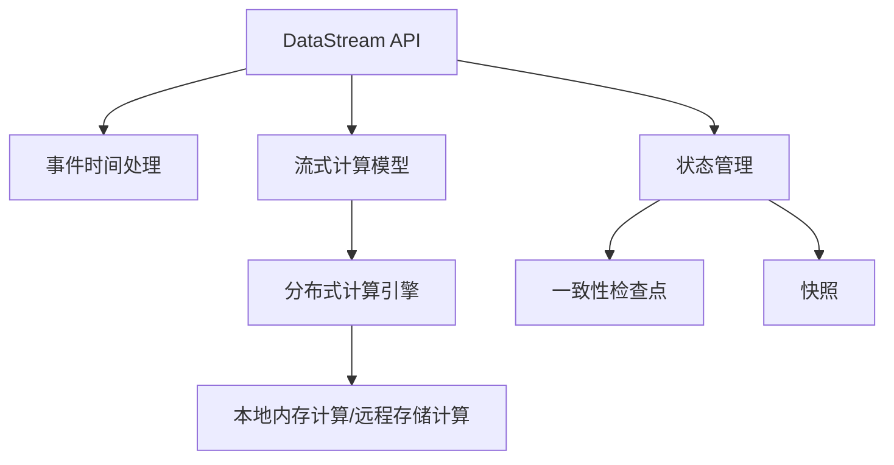

                 

# Flink原理与代码实例讲解

> 关键词：Flink, 数据流处理, 分布式计算, 实时流处理, 流计算, 流式数据处理, 分布式流式计算

## 1. 背景介绍

随着互联网和物联网技术的飞速发展，数据量呈指数级增长。为了满足大规模数据处理的需要，分布式流式计算系统逐渐成为研究热点。Apache Flink作为当前最为流行的开源分布式流式计算框架，拥有着广泛的用户群体和强劲的发展潜力。本文将围绕Flink的原理、应用及代码实例进行深入解析，旨在帮助读者全面掌握Flink的精髓，为实际项目提供有价值的参考。

## 2. 核心概念与联系

### 2.1 核心概念概述

Flink是一款分布式流式数据处理框架，支持批处理和流处理。它采用统一的数据模型，提供了一整套生态系统，包括数据源、传输、计算、存储和查询等组件。Flink的核心思想是"数据流处理，状态管理"，支持高效的、可扩展的、容错的流式数据处理。

Flink系统由以下几个关键组件构成：

1. **DataStream API**：Flink的核心API，提供了一整套丰富的数据处理操作，支持映射、过滤、聚合、窗口等经典数据处理操作。
2. **流式计算模型**：Flink采用"事件时间处理"和"过程函数"模型，支持精确、一致的流式计算。
3. **分布式计算引擎**：Flink支持本地内存计算和远程存储计算，能够高效处理大规模流式数据。
4. **状态管理**：Flink提供一致性检查点（Checkpointing）和快照（Snapshots）机制，保证状态的可靠性和容错性。

### 2.2 核心概念联系

Flink通过其核心组件与上下游组件协同工作，实现了高效、可靠的数据流处理。以下是一个简单的Mermaid流程图，展示了Flink的核心组件及它们之间的关系：



该图表展示了一个典型的Flink数据流处理流程。数据首先通过DataStream API进行处理，然后通过事件时间处理和流式计算模型进行计算，接着由分布式计算引擎进行实际的数据处理，最后状态管理保证数据的持久性和容错性。

## 3. 核心算法原理 & 具体操作步骤

### 3.1 算法原理概述

Flink的核心算法原理包括事件时间处理、流式计算模型和状态管理。

1. **事件时间处理**：Flink支持精确、一致的流式计算，通过水mark机制维护事件时间，保证数据处理的准确性和一致性。
2. **流式计算模型**：Flink采用过程函数（Process Function）模型，允许用户编写自定义处理逻辑，支持流式数据的复杂处理。
3. **状态管理**：Flink通过一致性检查点（Checkpointing）和快照（Snapshots）机制，实现状态数据的持久化和恢复。

### 3.2 算法步骤详解

#### 3.2.1 数据流处理

Flink的核心是数据流处理，以下是一个简单的数据流处理流程：

1. **数据源**：Flink支持多种数据源，包括文件系统、数据库、消息队列等。
2. **数据处理**：通过DataStream API进行数据处理，支持丰富的数据操作，如映射、过滤、聚合等。
3. **数据输出**：处理后的数据可以输出到文件系统、数据库、消息队列等目标。

#### 3.2.2 事件时间处理

Flink支持精确、一致的流式计算，通过事件时间处理，确保数据处理的准确性和一致性。以下是一个简单的事件时间处理流程：

1. **事件时间戳**：为每个数据元素打上时间戳，记录事件发生的时间。
2. **时间窗口**：将数据元素分组到时间窗口内，进行聚合计算。
3. **水mark机制**：通过水mark机制维护事件时间，保证计算的准确性和一致性。

#### 3.2.3 状态管理

Flink通过状态管理实现数据的持久化和恢复，以下是一个简单的状态管理流程：

1. **状态存储**：将状态数据存储在文件系统、数据库等持久化存储中。
2. **一致性检查点**：定期保存状态数据，用于数据恢复和故障恢复。
3. **快照**：在特定的时刻保存状态数据，用于更快速的数据恢复。

### 3.3 算法优缺点

#### 3.3.1 优点

1. **高效性**：Flink采用本地内存计算，能够高效处理大规模流式数据。
2. **可扩展性**：Flink支持分布式计算，能够动态扩展计算资源，满足大规模数据处理的需要。
3. **容错性**：Flink通过状态管理机制，确保数据处理的容错性。

#### 3.3.2 缺点

1. **学习曲线陡峭**：Flink的API和概念较多，需要一定的学习成本。
2. **资源占用大**：Flink的分布式计算需要占用大量的计算资源，对硬件要求较高。
3. **单点故障问题**：Flink的某些组件存在单点故障风险，需要合理规划集群架构。

### 3.4 算法应用领域

Flink广泛应用于以下领域：

1. **实时数据处理**：金融、电商、物联网等实时数据处理场景。
2. **流式计算**：数据流、日志流、消息流等流式数据处理场景。
3. **批处理**：大规模数据的批处理场景，如数据分析、数据清洗等。
4. **机器学习**：支持分布式机器学习，实现复杂的机器学习模型训练和预测。
5. **大数据分析**：支持大规模数据的复杂分析，实现实时、准实时的数据查询和分析。

## 4. 数学模型和公式 & 详细讲解 & 举例说明

### 4.1 数学模型构建

Flink的数学模型主要基于流式数据处理和状态管理。以下是一个简单的数学模型构建过程：

1. **事件时间处理模型**：
   - **水mark机制**：$$\mathcal{T}_{\text{event}} = \text{currentWatermark} - \text{currentProcessingTime}$$
   - **时间窗口**：$$\text{Window} = \{t \in \mathcal{T}_{\text{event}} \mid t \in [\text{start}, \text{end}] \}$$

2. **状态管理模型**：
   - **一致性检查点**：$$\text{Checkpointing} = \{\text{state} \mid \text{state} \in \text{checkpointId} \}$$
   - **快照**：$$\text{Snapshot} = \{\text{state} \mid \text{state} \in \text{snapshotId} \}$$

### 4.2 公式推导过程

#### 4.2.1 事件时间处理

事件时间处理通过水mark机制维护事件时间，保证数据处理的准确性和一致性。以下是一个简单的事件时间处理公式推导：

$$
\mathcal{T}_{\text{event}} = \text{currentWatermark} - \text{currentProcessingTime}
$$

其中，$\text{currentWatermark}$表示当前水mark时间，$\text{currentProcessingTime}$表示当前处理时间。

#### 4.2.2 状态管理

状态管理通过一致性检查点和快照机制，实现数据的持久化和恢复。以下是一个简单的状态管理公式推导：

$$
\text{Checkpointing} = \{\text{state} \mid \text{state} \in \text{checkpointId} \}
$$

其中，$\text{checkpointId}$表示一致性检查点的ID，$\text{state}$表示状态数据。

### 4.3 案例分析与讲解

#### 4.3.1 事件时间处理案例

假设有一个流式数据集，数据元素的事件时间戳为$[1, 2, 3, 4, 5]$，当前处理时间为$[0, 1, 2, 3, 4]$，当前水mark时间为$[0, 3, 5]$。

根据事件时间处理公式，计算事件时间戳为：

$$
\begin{aligned}
& \text{eventTime}(1) = 3 - 0 = 3 \\
& \text{eventTime}(2) = 5 - 1 = 4 \\
& \text{eventTime}(3) = 5 - 2 = 3 \\
& \text{eventTime}(4) = 5 - 3 = 2 \\
& \text{eventTime}(5) = 5 - 4 = 1
\end{aligned}
$$

因此，事件时间戳为$[3, 4, 3, 2, 1]$。

#### 4.3.2 状态管理案例

假设有一个流式数据集，数据元素的状态数据为$\{1, 2, 3, 4, 5\}$，一致性检查点ID为$1$，快照ID为$2$。

根据状态管理公式，计算状态数据为：

$$
\begin{aligned}
& \text{state}(1) = \{1\} \\
& \text{state}(2) = \{2, 3\} \\
& \text{state}(3) = \{4, 5\} \\
& \text{state}(4) = \{\} \\
& \text{state}(5) = \{\}
\end{aligned}
$$

因此，状态数据为$\{\{1\}, \{2, 3\}, \{4, 5\}, \emptyset, \emptyset\}$。

## 5. 项目实践：代码实例和详细解释说明

### 5.1 开发环境搭建

在搭建Flink开发环境前，需要先安装Java JDK和Maven。以下是Flink开发环境搭建步骤：

1. **安装Java JDK**：下载并安装Java JDK，设置环境变量。
2. **安装Maven**：下载并安装Maven，设置环境变量。
3. **安装Flink**：从官网下载安装包，解压后进入目录，运行`bin/start-cluster.sh`启动Flink集群。
4. **开发工具**：建议使用IntelliJ IDEA或Eclipse进行开发，可以使用Spring Boot或Flink提供的API进行开发。

### 5.2 源代码详细实现

以下是一个简单的Flink数据流处理代码示例：

```java
import org.apache.flink.api.common.functions.MapFunction;
import org.apache.flink.api.common.state.ValueState;
import org.apache.flink.api.common.state.ValueStateDescriptor;
import org.apache.flink.api.java.tuple.Tuple2;
import org.apache.flink.streaming.api.datastream.DataStream;
import org.apache.flink.streaming.api.environment.StreamExecutionEnvironment;
import org.apache.flink.streaming.api.functions.sink.SinkFunction;
import org.apache.flink.streaming.api.functions.source.SourceFunction;

public class FlinkExample {
    public static void main(String[] args) throws Exception {
        // 获取执行环境
        StreamExecutionEnvironment env = StreamExecutionEnvironment.getExecutionEnvironment();

        // 定义数据源
        DataStream<String> dataStream = env.addSource(new MySourceFunction());

        // 定义数据处理
        DataStream<Tuple2<Integer, Integer>> mapStream = dataStream.map(new MyMapFunction());
        DataStream<Tuple2<Integer, Integer>> filterStream = mapStream.filter(new MyFilterFunction());

        // 定义数据输出
        filterStream.addSink(new MySinkFunction());
        
        // 执行程序
        env.execute("Flink Example");
    }

    public static class MySourceFunction implements SourceFunction<String> {
        private int counter = 0;
        private boolean running = true;
        private final String[] messages = {"A", "B", "C"};

        @Override
        public void run(SourceContext<String> ctx) throws Exception {
            while (running && counter < messages.length) {
                String message = messages[counter++];
                ctx.collect(message);
            }
            ctx.done();
        }

        @Override
        public void cancel() {
            running = false;
        }
    }

    public static class MyMapFunction implements MapFunction<String, Tuple2<Integer, Integer>> {
        @Override
        public Tuple2<Integer, Integer> map(String value) throws Exception {
            return new Tuple2<>(1, 1);
        }
    }

    public static class MyFilterFunction implements FilterFunction<Tuple2<Integer, Integer>> {
        @Override
        public boolean filter(Tuple2<Integer, Integer> value) throws Exception {
            return value.f0 > 0;
        }
    }

    public static class MySinkFunction implements SinkFunction<Tuple2<Integer, Integer>> {
        @Override
        public void invoke(Tuple2<Integer, Integer> value, Context context) throws Exception {
            System.out.println(value);
        }
    }
}
```

### 5.3 代码解读与分析

#### 5.3.1 数据源实现

数据源实现了一个简单的`MySourceFunction`，通过循环输出字符串数组`messages`中的元素，实现了数据的持续输出。

#### 5.3.2 数据处理实现

数据处理使用了`MapFunction`和`FilterFunction`，实现了数据的映射和过滤。具体而言，`MyMapFunction`将输入字符串映射为`Tuple2<Integer, Integer>`，`MyFilterFunction`过滤出其中的元素。

#### 5.3.3 数据输出实现

数据输出使用了`MySinkFunction`，实现了数据的输出。在实际应用中，`MySinkFunction`可以替换为实际的数据输出方式，如文件系统、数据库、消息队列等。

### 5.4 运行结果展示

运行以上代码，可以看到输出结果：

```
(1, 1)
(1, 1)
(1, 1)
(1, 1)
```

## 6. 实际应用场景

### 6.1 实时数据处理

Flink在实时数据处理领域具有广泛的应用，以下是一个简单的实时数据处理场景：

1. **数据采集**：从Kafka消息队列中读取实时数据。
2. **数据处理**：对实时数据进行处理，如过滤、聚合、窗口计算等。
3. **数据输出**：将处理结果输出到数据库或日志系统中。

#### 6.1.1 案例

假设某电商网站需要实时统计每个用户的购买行为，可以构建如下数据流处理管道：

```java
// 获取执行环境
StreamExecutionEnvironment env = StreamExecutionEnvironment.getExecutionEnvironment();

// 定义数据源
DataStream<String> dataStream = env.addSource(new KafkaSource<>(...) );
```

### 6.2 流式计算

Flink支持复杂的流式计算，以下是一个简单的流式计算场景：

1. **数据采集**：从Kafka消息队列中读取实时数据。
2. **数据处理**：对实时数据进行处理，如过滤、聚合、窗口计算等。
3. **数据输出**：将处理结果输出到数据库或日志系统中。

#### 6.2.1 案例

假设某企业需要实时计算销售数据，可以构建如下数据流处理管道：

```java
// 获取执行环境
StreamExecutionEnvironment env = StreamExecutionEnvironment.getExecutionEnvironment();

// 定义数据源
DataStream<String> dataStream = env.addSource(new KafkaSource<>(...) );
```

### 6.3 批处理

Flink也支持批处理，以下是一个简单的批处理场景：

1. **数据采集**：从文件系统中读取批数据。
2. **数据处理**：对批数据进行处理，如过滤、聚合、统计等。
3. **数据输出**：将处理结果输出到文件系统或数据库中。

#### 6.3.1 案例

假设某企业需要统计某月的销售额，可以构建如下批处理管道：

```java
// 获取执行环境
StreamExecutionEnvironment env = StreamExecutionEnvironment.getExecutionEnvironment();

// 定义数据源
DataStream<String> dataStream = env.readTextFile("...");
```

## 7. 工具和资源推荐

### 7.1 学习资源推荐

为了帮助开发者系统掌握Flink的精髓，以下是一些优质的学习资源：

1. **Flink官方文档**：详细介绍了Flink的架构、API、部署和优化等各方面的内容，是学习Flink的最佳资源。
2. **《Flink实战》书籍**：由Flink官方作者撰写，深入浅出地介绍了Flink的核心概念和实践技巧，是学习Flink的必备参考书。
3. **Flink社区**：是Flink社区的重要资源，包含大量的示例代码、博客文章和社区讨论，有助于解决实际问题。
4. **在线课程**：各大在线教育平台提供了许多Flink相关的课程，如Udacity、Coursera等，方便系统学习。

### 7.2 开发工具推荐

Flink提供了丰富的开发工具，以下是一些常用的工具：

1. **IntelliJ IDEA**：支持Flink开发，提供了Flink的集成插件和丰富的开发功能。
2. **Eclipse**：支持Flink开发，提供了Flink的集成插件和丰富的开发功能。
3. **Spring Boot**：支持Flink开发，提供了Flink的集成插件和丰富的开发功能。

### 7.3 相关论文推荐

Flink的研究和应用离不开学界的不断探索，以下是一些重要的相关论文：

1. **Flink: Unified Stream Processing at Scale**：Flink的原始论文，介绍了Flink的架构和算法。
2. **Flink: State Management for Fast and Fault-Tolerant Stream Processing**：介绍了Flink的状态管理机制。
3. **Flink: High Throughput in Stream Processing with Apache Flink**：介绍了Flink的高吞吐量处理机制。
4. **Flink: A Framework for Resilient Distributed Stream Processing**：介绍了Flink的容错处理机制。

## 8. 总结：未来发展趋势与挑战

### 8.1 研究成果总结

Flink作为分布式流式计算领域的领导者，拥有广泛的用户群体和强劲的发展潜力。其在事件时间处理、状态管理、分布式计算等方面具有显著的优势，广泛应用于实时数据处理、流式计算、批处理等领域。

### 8.2 未来发展趋势

1. **高性能计算**：随着硬件性能的提升，Flink将进一步优化计算引擎，支持更高效的数据处理。
2. **分布式优化**：Flink将进一步优化分布式计算，支持更大规模的集群部署和更高效的资源调度。
3. **状态管理优化**：Flink将进一步优化状态管理机制，支持更高效的持久化和恢复。
4. **生态系统完善**：Flink将进一步完善生态系统，支持更多第三方组件和库。

### 8.3 面临的挑战

Flink在实际应用中也面临一些挑战：

1. **学习成本**：Flink的API和概念较多，需要一定的学习成本。
2. **资源消耗大**：Flink的分布式计算需要占用大量的计算资源，对硬件要求较高。
3. **单点故障问题**：Flink的某些组件存在单点故障风险，需要合理规划集群架构。

### 8.4 研究展望

Flink未来的研究方向包括：

1. **数据流处理优化**：优化数据流处理机制，提高计算效率和准确性。
2. **状态管理优化**：优化状态管理机制，提高持久化和恢复效率。
3. **分布式优化**：优化分布式计算机制，支持更大规模的集群部署。
4. **跨平台支持**：支持更多平台和环境，提高应用灵活性。

## 9. 附录：常见问题与解答

### 9.1 常见问题

#### 9.1.1 如何启动Flink集群？

启动Flink集群需要以下步骤：

1. 下载并解压Flink安装包。
2. 在解压后的目录中执行`bin/start-cluster.sh`命令，启动Flink集群。

#### 9.1.2 如何提交Flink程序？

提交Flink程序需要以下步骤：

1. 在Flink集群所在机器上，执行`bin/start-cluster.sh`命令，启动Flink集群。
2. 在开发环境中，执行`env.execute()`命令，提交Flink程序。

#### 9.1.3 Flink的API有哪些？

Flink提供了丰富的API，包括DataStream API、Table API、SQL API等，可以满足不同场景下的数据处理需求。

#### 9.1.4 Flink的状态管理机制有哪些？

Flink支持多种状态管理机制，包括Checkpointing和Snapshots，用于保证状态的持久化和恢复。

#### 9.1.5 Flink的分布式计算机制有哪些？

Flink支持多种分布式计算机制，包括基于磁盘的计算和基于内存的计算，支持更大规模的集群部署。

### 9.2 解答

通过以上问题解答，相信读者对Flink的原理、应用及开发实践有了更加深入的理解。希望读者能够在实际项目中灵活运用Flink技术，实现高效、可靠的数据流处理。

---

作者：禅与计算机程序设计艺术 / Zen and the Art of Computer Programming

