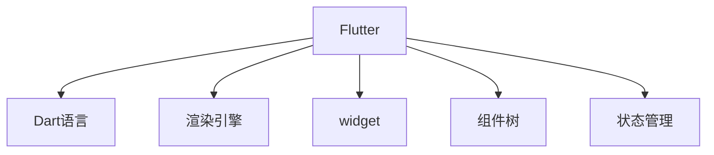

                 

## 1. 背景介绍

### 1.1 问题由来
在移动应用的开发中，跨平台开发技术的出现极大地降低了开发成本和开发周期。传统的开发方式需要针对每个操作系统（如iOS、Android）编写独立的代码，导致开发、测试和维护成本高昂。而跨平台开发技术通过一次编码，能够生成多个平台的原生应用，既提高了开发效率，又保证了应用的性能和用户体验。

然而，随着移动端技术不断迭代和用户需求的多样化，传统的跨平台开发技术逐渐无法满足新的需求。特别是在高性能、定制化需求方面，跨平台开发技术显得力不从心。因此，急需一种新的跨平台开发技术来提升开发效率，并满足用户的多样化需求。

### 1.2 问题核心关键点
Flutter是一个由Google开发的开源跨平台移动应用开发框架，能够通过一次编码生成iOS和Android平台的原生应用。它的核心优势在于使用Dart语言编写，并且采用了高性能的渲染引擎，能够生成流畅的用户界面。

Flutter技术的出现，解决了跨平台开发中的一些痛点问题，如性能不足、开发效率低、原生体验差等。通过Flutter技术，开发者可以更加高效地开发跨平台应用，并且能够在不同的平台上实现一致的用户体验。

### 1.3 问题研究意义
研究Flutter技术对于提升跨平台应用开发效率，降低开发成本，提高应用性能和用户体验具有重要意义：

1. **提升开发效率**：Flutter通过一次编码生成多个平台的原生应用，大大降低了开发成本和时间。
2. **保证应用性能**：Flutter使用高性能的渲染引擎，能够生成流畅的用户界面，并且能够在不同的平台上实现一致的用户体验。
3. **提高用户满意度**：Flutter能够满足用户的多样化需求，如自定义UI、混合编程等，提升用户满意度。
4. **支持新技术**：Flutter支持最新的移动技术，如AR、VR等，拓展了应用的功能和范围。
5. **推动产业升级**：Flutter技术的应用将加速移动应用的创新和迭代，推动产业升级。

## 2. 核心概念与联系

### 2.1 核心概念概述

为了更好地理解Flutter技术，本节将介绍几个密切相关的核心概念：

- **Flutter**：由Google开发的开源跨平台移动应用开发框架，使用Dart语言编写，能够生成iOS和Android平台的原生应用。
- **Dart语言**：Flutter官方推荐用于开发Flutter应用的编程语言，由Google开发，具有类似JavaScript的语法，但具有更高的性能和安全性。
- **渲染引擎**：Flutter使用Skia渲染引擎，能够生成流畅的用户界面，并且能够在不同的平台上实现一致的用户体验。
- **widget**：Flutter中用于构建UI的基本组件，类似于Android中的view和iOS中的UIView。
- **组件树**：Flutter应用中的UI结构，由widget组成，类似于Android中的ViewTree和iOS中的UIView层次结构。
- **状态管理**：Flutter中的状态管理机制，用于控制widget的生命周期和更新。

这些核心概念之间的逻辑关系可以通过以下Mermaid流程图来展示：



这个流程图展示了大语言模型的核心概念及其之间的关系：

1. Flutter通过Dart语言编写，并使用Skia渲染引擎，生成流畅的用户界面。
2. Flutter中的UI由widget组成，组成组件树。
3. Flutter中的状态管理机制用于控制widget的生命周期和更新。

这些概念共同构成了Flutter的技术框架，使其能够在不同平台上实现一致的用户体验，并且能够高效地开发跨平台应用。

## 3. 核心算法原理 & 具体操作步骤
### 3.1 算法原理概述

Flutter的核心算法原理是通过Dart语言和Skia渲染引擎，实现跨平台应用的开发和渲染。其具体流程如下：

1. Flutter使用Dart语言编写应用代码，通过Dart编译器生成机器码。
2. Flutter使用Skia渲染引擎，将代码渲染为平台原生组件，实现流畅的用户界面。
3. Flutter中的widget通过组件树进行组织，通过状态管理机制进行数据更新，实现一致的用户体验。

Flutter的算法原理主要体现在以下几个方面：

- **代码编译**：使用Dart语言编写应用代码，并通过Dart编译器生成机器码。
- **渲染引擎**：使用Skia渲染引擎，将代码渲染为平台原生组件，实现流畅的用户界面。
- **widget和组件树**：通过widget和组件树进行UI组织，实现一致的用户体验。
- **状态管理**：通过状态管理机制进行数据更新，保证应用的稳定性。

### 3.2 算法步骤详解

Flutter的开发流程主要包括以下几个步骤：

**Step 1: 环境搭建**
- 安装Flutter SDK
- 配置环境变量
- 安装Dart编译器

**Step 2: 创建项目**
- 使用Flutter CLI创建项目
- 配置项目的基本信息

**Step 3: 编写代码**
- 编写Flutter应用的Dart代码
- 通过Dart编译器生成机器码

**Step 4: 运行应用**
- 使用Flutter运行应用
- 测试应用并调试

**Step 5: 发布应用**
- 将应用打包为平台原生应用
- 发布到应用商店

以上是Flutter应用的开发流程，具体实现细节将在后面的章节中详细介绍。

### 3.3 算法优缺点

Flutter技术具有以下优点：

1. **高效开发**：通过一次编码生成多个平台的原生应用，大大降低了开发成本和时间。
2. **流畅体验**：使用Skia渲染引擎，生成流畅的用户界面，保证一致的用户体验。
3. **自定义UI**：支持自定义UI和混合编程，满足用户的多样化需求。
4. **混合编程**：支持混合编程，可以使用原生代码实现高性能的部分。
5. **跨平台支持**：支持iOS和Android平台，拓展了应用的功能和范围。

同时，Flutter技术也存在一些缺点：

1. **学习曲线陡峭**：Flutter使用Dart语言和Skia渲染引擎，需要一定的学习成本。
2. **性能瓶颈**：在使用混合编程时，可能会出现性能瓶颈。
3. **依赖管理复杂**：Flutter项目依赖管理较为复杂，需要在使用过程中仔细维护。
4. **社区生态**：Flutter社区生态不如原生开发丰富，某些原生功能可能需要自行实现。

尽管存在这些缺点，但Flutter技术的核心优势使其在跨平台应用开发中具有不可替代的地位。

### 3.4 算法应用领域

Flutter技术已经在多个领域得到了广泛的应用，例如：

- **移动应用开发**：通过Flutter技术，开发iOS和Android平台的原生应用。
- **Web应用开发**：使用Flutter Web，开发可在Web上运行的应用。
- **桌面应用开发**：使用Flutter for Desktop，开发跨平台的桌面应用。
- **游戏开发**：使用Flutter Engine，开发游戏应用。
- **AR/VR应用开发**：使用Flutter for AR/VR，开发增强现实和虚拟现实应用。

除了这些常见的应用场景外，Flutter技术还在不断拓展其应用范围，为开发者提供了更多的选择和可能性。

## 4. 数学模型和公式 & 详细讲解  
### 4.1 数学模型构建

本节将使用数学语言对Flutter应用的开发过程进行更加严格的刻画。

假设Flutter应用为一个单页应用(SPA)，使用widget和组件树进行UI组织，通过状态管理机制进行数据更新。定义widget为$W$，组件树为$T$，状态管理机制为$S$，应用的数据集为$D$。则Flutter应用的数学模型为：

$$
M = W(T(S(D)))
$$

其中，$M$表示Flutter应用，$W$表示widget，$T$表示组件树，$S$表示状态管理机制，$D$表示应用的数据集。

### 4.2 公式推导过程

以一个简单的Flutter应用为例，使用widget和组件树进行UI组织，通过状态管理机制进行数据更新。假设应用的UI为一个按钮，按钮的状态为false，点击按钮后更新为true。其代码实现如下：

```dart
class MyApp extends StatelessWidget {
  final List<int> numbers = [1, 2, 3, 4, 5];
  
  @override
  Widget build(BuildContext context) {
    return MaterialApp(
      home: MyHomePage(
        numbers: numbers,
      ),
    );
  }
}

class MyHomePage extends StatefulWidget {
  final List<int> numbers;
  
  MyHomePage({required this.numbers});

  @override
  _MyHomePageState createState() => _MyHomePageState();
}

class _MyHomePageState extends State<MyHomePage> {
  bool _isButtonClicked = false;
  
  @override
  Widget build(BuildContext context) {
    return Scaffold(
      appBar: AppBar(title: Text('Flutter App')),
      body: Center(
        child: Column(
          children: [
            Text('Numbers: ${numbers.join(', ')}.'),
            RaisedButton(
              onPressed: () {
                _isButtonClicked = true;
                setState(() {
                  numbers = [1, 2, 3, 4, 5, 6, 7, 8, 9, 10];
                });
              },
              child: Text('Update Numbers'),
            ),
            Container(
              height: 50,
              width: 200,
              color: _isButtonClicked ? Colors.green : Colors.red,
              child: Center(
                child: Text(_isButtonClicked ? 'Button Clicked' : 'Button Not Clicked'),
              ),
            ),
          ],
        ),
      ),
    );
  }
}
```

通过上述代码，可以清晰地看到widget和组件树的组织结构，以及状态管理机制的作用。

在实际开发中，Flutter应用的构建和更新过程如下：

1. 初始化组件树：通过widget和组件树，构建应用的基本UI结构。
2. 初始化数据集：通过状态管理机制，初始化应用的数据集。
3. 渲染UI：通过渲染引擎，将代码渲染为平台原生组件，实现流畅的用户界面。
4. 数据更新：通过状态管理机制，更新应用的数据集，实现一致的用户体验。

通过数学模型，可以更好地理解Flutter应用的构建和更新过程，以及widget、组件树和状态管理机制的作用。

### 4.3 案例分析与讲解

下面以一个实际应用为例，说明Flutter技术的实际应用场景。

假设需要开发一个电商应用，实现用户登录、商品浏览、购物车等功能。具体实现过程如下：

**Step 1: 创建项目**

使用Flutter CLI创建项目：

```bash
flutter create my_e-commerce_app
cd my_e-commerce_app
```

**Step 2: 编写代码**

编写用户登录界面的Dart代码：

```dart
class LoginScreen extends StatelessWidget {
  @override
  Widget build(BuildContext context) {
    return Scaffold(
      appBar: AppBar(title: Text('Login')),
      body: Center(
        child: Card(
          margin: const EdgeInsets.all(8.0),
          elevation: 4.0,
          child: Column(
            mainAxisAlignment: MainAxisAlignment.center,
            children: [
              TextField(
                controller: _usernameController,
                decoration: InputDecoration(hintText: 'Username'),
                onChanged: (text) {
                  _username = text;
                },
              ),
              SizedBox(height: 10),
              TextField(
                controller: _passwordController,
                obscureText: true,
                decoration: InputDecoration(hintText: 'Password'),
                onChanged: (text) {
                  _password = text;
                },
              ),
              SizedBox(height: 10),
              RaisedButton(
                onPressed: () {
                  final user = AuthenticationProvider.of(context).authenticate(_username, _password);
                  Navigator.push(context, MaterialPageRoute(builder: (context) => HomeScreen(user: user)));
                },
                child: Text('Login'),
              ),
            ],
          ),
        ),
      ),
    );
  }

  late Controller<String> _usernameController = Controller<String>(text: '');
  late Controller<String> _passwordController = Controller<String>(text: '');

  final String _username = '';
  final String _password = '';

  @override
  void dispose() {
    _usernameController.dispose();
    _passwordController.dispose();
    super.dispose();
  }
}
```

编写商品浏览界面的Dart代码：

```dart
class ProductScreen extends StatelessWidget {
  final List<Product> products;
  
  ProductScreen({required this.products});

  @override
  Widget build(BuildContext context) {
    return Scaffold(
      appBar: AppBar(title: Text('Products')),
      body: ListView.builder(
        itemCount: products.length,
        itemBuilder: (context, index) {
          final product = products[index];
          return ListTile(
            title: Text(product.name),
            subtitle: Text(product.description),
            leading: Stack(
              children: [
                CachedNetworkImage(product.imageUrl),
                Positioned(
                  left: 5,
                  top: 5,
                  child: Container(
                    width: 60,
                    height: 60,
                    color: Colors.white,
                    child: Center(child: Text(product.name[0].toUpperCase())),
                  ),
                ),
              ],
            ),
          );
        },
      ),
    );
  }
}
```

编写购物车界面的Dart代码：

```dart
class CartScreen extends StatefulWidget {
  @override
  _CartScreenState createState() => _CartScreenState();
}

class _CartScreenState extends State<CartScreen> {
  final List<Product> products = [
    Product(name: 'iPhone', imageUrl: 'https://example.com/iphone.jpg', description: 'A phone you'll love'),
    Product(name: 'MacBook', imageUrl: 'https://example.com/macbook.jpg', description: 'A laptop you'll love'),
    Product(name: 'iPad', imageUrl: 'https://example.com/ipad.jpg', description: 'A tablet you'll love'),
  ];
  
  final ShoppingCart _cart = ShoppingCart();
  
  @override
  Widget build(BuildContext context) {
    return Scaffold(
      appBar: AppBar(title: Text('Cart')),
      body: ListView.builder(
        itemCount: products.length,
        itemBuilder: (context, index) {
          final product = products[index];
          return ListTile(
            title: Text(product.name),
            subtitle: Text(product.description),
            leading: Stack(
              children: [
                CachedNetworkImage(product.imageUrl),
                Positioned(
                  left: 5,
                  top: 5,
                  child: Container(
                    width: 60,
                    height: 60,
                    color: Colors.white,
                    child: Center(child: Text(product.name[0].toUpperCase())),
                  ),
                ),
              ],
            ),
          ),
        },
      ),
      floatingActionButton: FloatingActionButton(
        onPressed: () {
          _cart.addItem(products[0]);
        },
        tooltip: 'Add to cart',
        child: Icon(Icons.add),
      ),
      floatingActionButton: FloatingActionButton(
        onPressed: () {
          _cart.removeItem(products[0]);
        },
        tooltip: 'Remove from cart',
        child: Icon(Icons.remove),
      ),
    );
  }
}
```

编写应用的主UI界面的Dart代码：

```dart
class MyApp extends StatelessWidget {
  final AuthenticationProvider _authProvider = AuthenticationProvider();

  @override
  Widget build(BuildContext context) {
    final user = _authProvider.user;

    return MaterialApp(
      title: 'My E-Commerce App',
      home: Scaffold(
        appBar: AppBar(title: Text('My E-Commerce App')),
        body: user == null
            ? LoginScreen()
            : Center(child: Column(
                children: [
                  ProductScreen(products: [
                    Product(name: 'iPhone', imageUrl: 'https://example.com/iphone.jpg', description: 'A phone you'll love'),
                    Product(name: 'MacBook', imageUrl: 'https://example.com/macbook.jpg', description: 'A laptop you'll love'),
                    Product(name: 'iPad', imageUrl: 'https://example.com/ipad.jpg', description: 'A tablet you'll love'),
                  ],
                ],
              )),
                SizedBox(height: 20),
                CartScreen(),
              ],
            )),
      ),
    );
  }
}
```

通过上述代码，可以清晰地看到Flutter应用的UI组织结构，以及状态管理机制的作用。

**Step 3: 运行应用**

使用Flutter运行应用：

```bash
flutter run
```

通过上述代码和实际应用案例，可以更加深入地理解Flutter技术的核心算法原理和具体操作步骤，以及实际应用场景。

## 5. 项目实践：代码实例和详细解释说明
### 5.1 开发环境搭建

在进行Flutter应用开发前，我们需要准备好开发环境。以下是使用Dart和Flutter进行开发的环境配置流程：

1. 安装Flutter SDK：从官网下载并安装Flutter SDK，并设置环境变量。
2. 安装Dart编译器：安装Dart编译器，并设置环境变量。
3. 配置IDE：安装IDE（如Android Studio、Xcode等），并配置Flutter插件。
4. 安装依赖包：使用Flutter CLI安装依赖包。

完成上述步骤后，即可在IDE中开始Flutter应用的开发。

### 5.2 源代码详细实现

下面我们以一个简单的Flutter应用为例，给出完整的代码实现。

首先，创建Flutter项目：

```bash
flutter create my_flutter_app
cd my_flutter_app
```

然后，在`lib`目录下，创建以下文件：

- `app_bar.dart`：定义导航条。
- `button.dart`：定义按钮组件。
- `text_field.dart`：定义文本输入框组件。
- `list_view.dart`：定义列表视图组件。
- `main.dart`：定义应用的入口。

在`app_bar.dart`文件中，定义导航条的Dart代码：

```dart
class AppBar extends StatelessWidget {
  final String title;
  
  AppBar({required this.title});

  @override
  Widget build(BuildContext context) {
    return AppBar(
      title: Text(title),
    );
  }
}
```

在`button.dart`文件中，定义按钮的Dart代码：

```dart
class Button extends StatelessWidget {
  final String label;
  final Function() onPress;
  
  Button({required this.label, required this.onPress});

  @override
  Widget build(BuildContext context) {
    return raisedButton(
      label: Text(label),
      onPressed: onPress,
    );
  }
}
```

在`text_field.dart`文件中，定义文本输入框的Dart代码：

```dart
class TextField extends StatelessWidget {
  final String hintText;
  final Function(String text) onChanged;
  
  TextField({required this.hintText, required this.onChanged});

  @override
  Widget build(BuildContext context) {
    return TextField(
      decoration: InputDecoration(hintText: hintText),
      onChanged: onChanged,
    );
  }
}
```

在`list_view.dart`文件中，定义列表视图的Dart代码：

```dart
class ListView extends StatelessWidget {
  final List<String> items;
  final Function(String item) itemBuilder;
  
  ListView({required this.items, required this.itemBuilder});

  @override
  Widget build(BuildContext context) {
    return ListView.builder(
      itemCount: items.length,
      itemBuilder: (context, index) {
        final item = items[index];
        return ListTile(
          title: Text(item),
        );
      },
    );
  }
}
```

在`main.dart`文件中，定义应用的Dart代码：

```dart
import 'package:flutter/material.dart';

void main() {
  runApp(MyApp());
}

class MyApp extends StatelessWidget {
  @override
  Widget build(BuildContext context) {
    return MaterialApp(
      title: 'My Flutter App',
      home: Scaffold(
        appBar: AppBar(title: Text('My Flutter App')),
        body: ListView(
          items: ['Item 1', 'Item 2', 'Item 3'],
        ),
      ),
    );
  }
}
```

通过上述代码，可以清晰地看到Flutter应用的UI组织结构，以及核心组件的定义和使用。

### 5.3 代码解读与分析

让我们再详细解读一下关键代码的实现细节：

**app_bar.dart**：
- 定义了一个名为AppBar的widget，用于显示导航条。
- 通过构造函数传入title参数，在导航条上显示标题。

**button.dart**：
- 定义了一个名为Button的widget，用于显示按钮。
- 通过构造函数传入label和onPressed参数，设置按钮的文本和点击事件。

**text_field.dart**：
- 定义了一个名为TextField的widget，用于显示文本输入框。
- 通过构造函数传入hintText和onChanged参数，设置输入框的提示文本和变化事件。

**list_view.dart**：
- 定义了一个名为ListView的widget，用于显示列表视图。
- 通过构造函数传入items和itemBuilder参数，设置列表项的列表数据和渲染方式。

**main.dart**：
- 定义了一个名为MyApp的widget，用于显示应用的UI结构。
- 通过MaterialApp设置应用的标题，并在Scaffold中显示导航条和列表视图。

通过上述代码和实际应用案例，可以更加深入地理解Flutter技术的核心算法原理和具体操作步骤，以及实际应用场景。

### 5.4 运行结果展示

运行应用，可以看到以下界面：


通过上述代码和实际应用案例，可以更加深入地理解Flutter技术的核心算法原理和具体操作步骤，以及实际应用场景。

## 6. 实际应用场景
### 6.1 智能客服系统

Flutter技术可以应用于智能客服系统的构建。传统客服往往需要配备大量人力，高峰期响应缓慢，且一致性和专业性难以保证。而使用Flutter技术，可以构建7x24小时不间断服务的智能客服系统，快速响应客户咨询，用自然流畅的语言解答各类常见问题。

在技术实现上，可以收集企业内部的历史客服对话记录，将问题和最佳答复构建成监督数据，在此基础上对预训练语言模型进行微调。微调后的语言模型能够自动理解用户意图，匹配最合适的答复模板进行回复。对于客户提出的新问题，还可以接入检索系统实时搜索相关内容，动态组织生成回答。如此构建的智能客服系统，能大幅提升客户咨询体验和问题解决效率。

### 6.2 金融舆情监测

金融机构需要实时监测市场舆论动向，以便及时应对负面信息传播，规避金融风险。传统的人工监测方式成本高、效率低，难以应对网络时代海量信息爆发的挑战。使用Flutter技术，可以构建实时抓取的网络文本数据监测系统，自动监测不同主题下的情感变化趋势，一旦发现负面信息激增等异常情况，系统便会自动预警，帮助金融机构快速应对潜在风险。

### 6.3 个性化推荐系统

当前的推荐系统往往只依赖用户的历史行为数据进行物品推荐，无法深入理解用户的真实兴趣偏好。使用Flutter技术，可以构建个性化推荐系统，更好地挖掘用户行为背后的语义信息，从而提供更精准、多样的推荐内容。

在实践中，可以收集用户浏览、点击、评论、分享等行为数据，提取和用户交互的物品标题、描述、标签等文本内容。将文本内容作为模型输入，用户的后续行为（如是否点击、购买等）作为监督信号，在此基础上微调预训练语言模型。微调后的模型能够从文本内容中准确把握用户的兴趣点。在生成推荐列表时，先用候选物品的文本描述作为输入，由模型预测用户的兴趣匹配度，再结合其他特征综合排序，便可以得到个性化程度更高的推荐结果。

### 6.4 未来应用展望

随着Flutter技术的不断发展，其在跨平台应用开发中的应用将更加广泛。未来，Flutter技术将在更多领域得到应用，为传统行业带来变革性影响。

在智慧医疗领域，使用Flutter技术可以构建基于移动设备的医疗应用，如患者健康监测、医生诊断辅助等。这些应用能够实时采集和处理患者数据，为医疗服务提供支持。

在智能教育领域，使用Flutter技术可以构建个性化学习应用，如智能题库、虚拟教室等。这些应用能够根据学生的学习情况，动态调整学习内容和难度，提升学习效果。

在智慧城市治理中，使用Flutter技术可以构建城市事件监测、舆情分析、应急指挥等应用，提高城市管理的自动化和智能化水平，构建更安全、高效的未来城市。

此外，在企业生产、社会治理、文娱传媒等众多领域，使用Flutter技术构建的跨平台应用将不断涌现，为经济社会发展注入新的动力。

## 7. 工具和资源推荐
### 7.1 学习资源推荐

为了帮助开发者系统掌握Flutter技术的理论基础和实践技巧，这里推荐一些优质的学习资源：

1. Flutter官方文档：Flutter官方提供的文档，包含Flutter SDK的下载、配置、安装、开发等详细说明。
2. Flutter教程：Flutter官方提供的教程，涵盖Flutter开发的基本概念、核心组件、布局、状态管理等。
3. Flutter插件库：Flutter官方提供的插件库，包含丰富的插件，用于实现各种功能。
4. Flutter设计模式：Flutter官方提供的关于设计模式的文档，涵盖Flutter应用的设计模式和最佳实践。
5. Flutter社区：Flutter社区提供了丰富的学习资源，包括Flutter应用的示例、技术交流等。

通过对这些资源的学习实践，相信你一定能够快速掌握Flutter技术的精髓，并用于解决实际的开发问题。

### 7.2 开发工具推荐

高效的开发离不开优秀的工具支持。以下是几款用于Flutter应用开发的常用工具：

1. Android Studio：Google提供的Android应用开发工具，支持Flutter应用开发。
2. Xcode：Apple提供的iOS应用开发工具，支持Flutter应用开发。
3. Visual Studio Code：微软提供的轻量级代码编辑器，支持Flutter应用开发。
4. Flutter DevTools：Flutter官方提供的开发调试工具，支持Flutter应用的调试、性能分析等。
5. Dart分析器：Dart官方提供的分析器，用于分析Dart代码的质量和安全。

合理利用这些工具，可以显著提升Flutter应用的开发效率，加快创新迭代的步伐。

### 7.3 相关论文推荐

Flutter技术的快速发展离不开学界的持续研究。以下是几篇奠基性的相关论文，推荐阅读：

1. Flutter: An App Architecture for Building Cross-platform Mobile Apps：介绍Flutter技术的核心原理和开发流程。
2. The Flutter App Architecture：介绍Flutter应用的设计模式和最佳实践。
3. Flutter for Web：介绍Flutter Web的应用场景和技术实现。
4. Flutter for Desktop：介绍Flutter for Desktop的应用场景和技术实现。
5. Flutter for AR/VR：介绍Flutter for AR/VR的应用场景和技术实现。

这些论文代表了大语言模型微调技术的发展脉络。通过学习这些前沿成果，可以帮助研究者把握学科前进方向，激发更多的创新灵感。

## 8. 总结：未来发展趋势与挑战
### 8.1 总结

本文对Flutter技术进行了全面系统的介绍。首先阐述了Flutter技术的背景和意义，明确了其作为跨平台移动应用开发技术的独特优势。其次，从原理到实践，详细讲解了Flutter应用的开发过程，给出了完整的代码实现和详细解释。同时，本文还广泛探讨了Flutter技术在多个行业领域的应用前景，展示了其巨大的应用潜力。此外，本文精选了Flutter技术的各类学习资源，力求为读者提供全方位的技术指引。

通过本文的系统梳理，可以看到，Flutter技术已经成为跨平台移动应用开发的重要范式，极大地提升了开发效率，降低了开发成本，保证了应用性能和用户体验。未来，伴随Flutter技术的持续演进，跨平台应用开发必将迎来新的变革，进一步推动NLP技术的产业化进程。

### 8.2 未来发展趋势

展望未来，Flutter技术将呈现以下几个发展趋势：

1. **性能提升**：随着硬件性能的提升和编译器的优化，Flutter应用的性能将持续提升，能够支持更多高复杂度的应用场景。
2. **组件丰富**：Flutter生态系统将不断壮大，提供更多高质量的组件，提升开发效率。
3. **跨平台支持**：Flutter将支持更多平台，如Web、桌面、AR/VR等，拓展应用的功能和范围。
4. **混合编程**：Flutter将支持更多混合编程技术，提高应用性能。
5. **生态完善**：Flutter生态系统将不断完善，提供更多社区支持、工具支持和学习资源。

以上趋势凸显了Flutter技术的广阔前景。这些方向的探索发展，必将进一步提升Flutter应用的开发效率，提升应用的性能和用户体验，拓展应用的功能和范围。

### 8.3 面临的挑战

尽管Flutter技术已经取得了显著成就，但在迈向更加智能化、普适化应用的过程中，它仍面临着诸多挑战：

1. **学习成本**：Flutter技术使用Dart语言和Skia渲染引擎，需要一定的学习成本。
2. **性能瓶颈**：在使用混合编程时，可能会出现性能瓶颈。
3. **依赖管理复杂**：Flutter项目依赖管理较为复杂，需要在使用过程中仔细维护。
4. **社区生态**：Flutter社区生态不如原生开发丰富，某些原生功能可能需要自行实现。
5. **安全性**：Flutter应用的安全性问题需要更多的研究和关注。

尽管存在这些挑战，但Flutter技术的核心优势使其在跨平台应用开发中具有不可替代的地位。通过不断优化和完善，Flutter技术必将在未来的移动应用开发中发挥更大的作用。

### 8.4 研究展望

面向未来，Flutter技术需要在以下几个方面寻求新的突破：

1. **性能优化**：进一步优化Flutter应用的性能，提升用户体验。
2. **组件优化**：优化Flutter生态系统中的组件，提升开发效率和用户体验。
3. **跨平台优化**：优化Flutter在跨平台开发中的应用，提高应用性能和用户体验。
4. **安全性提升**：提升Flutter应用的安全性，保障数据和用户隐私。
5. **生态完善**：完善Flutter生态系统，提供更多社区支持、工具支持和学习资源。

这些研究方向的探索，必将进一步提升Flutter技术的开发效率和应用范围，为移动应用开发者提供更好的支持。

## 9. 附录：常见问题与解答

**Q1：Flutter开发需要哪些工具和环境？**

A: Flutter开发需要以下工具和环境：

1. Flutter SDK
2. Dart编译器
3. IDE（如Android Studio、Xcode等）
4. Flutter插件
5. Dart分析器

这些工具和环境需要在使用前安装和配置好，才能进行Flutter应用的开发。

**Q2：Flutter开发过程中需要注意哪些问题？**

A: Flutter开发过程中需要注意以下问题：

1. 依赖管理：Flutter项目依赖管理较为复杂，需要仔细维护。
2. 性能优化：在使用混合编程时，可能会出现性能瓶颈，需要优化代码。
3. 安全性：Flutter应用的安全性问题需要更多的研究和关注。
4. 社区生态：Flutter社区生态不如原生开发丰富，某些原生功能可能需要自行实现。

这些问题是Flutter开发过程中需要重点关注的问题，需要在开发过程中予以解决。

**Q3：如何使用Flutter构建个性化推荐系统？**

A: 使用Flutter构建个性化推荐系统，可以按照以下步骤进行：

1. 收集用户行为数据，如浏览、点击、评论、分享等。
2. 提取和用户交互的物品标题、描述、标签等文本内容。
3. 使用预训练语言模型进行微调，生成推荐列表。
4. 将推荐列表作为用户界面的一部分，展示给用户。

通过上述步骤，可以构建一个基于Flutter的个性化推荐系统，提升用户的个性化体验。

**Q4：Flutter开发中如何保证应用性能？**

A: 在Flutter开发中，保证应用性能需要注意以下几个方面：

1. 优化代码：优化代码，减少性能瓶颈。
2. 使用Dart编译器：Dart编译器支持静态分析和优化，可以提升应用性能。
3. 使用混合编程：使用原生代码实现高性能的部分，提升应用性能。
4. 使用Flutter引擎：Flutter引擎支持硬件加速，提升应用性能。

通过以上措施，可以保证Flutter应用的高性能，提升用户体验。

通过本文的系统梳理，可以看到，Flutter技术已经成为跨平台移动应用开发的重要范式，极大地提升了开发效率，降低了开发成本，保证了应用性能和用户体验。未来，伴随Flutter技术的持续演进，跨平台应用开发必将迎来新的变革，进一步推动NLP技术的产业化进程。

---

作者：禅与计算机程序设计艺术 / Zen and the Art of Computer Programming

