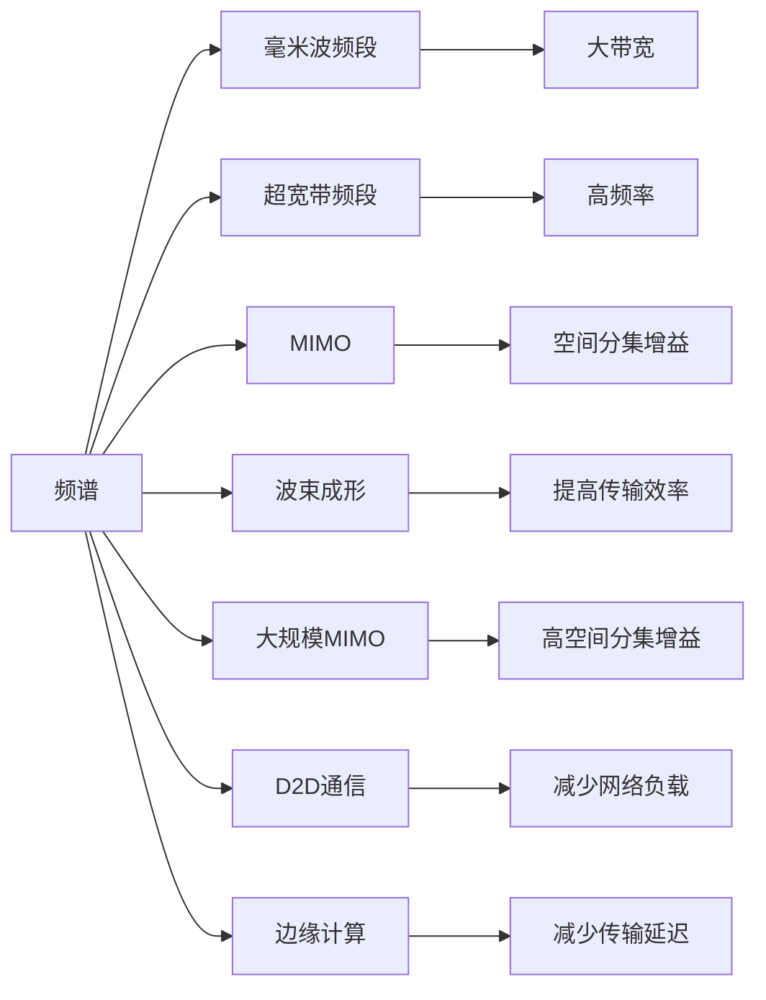

                 

# 5G 技术革命：速度和容量

## 1. 背景介绍

5G技术的迅猛发展正在引领一场新的技术革命。在这个信息爆炸的时代，如何有效利用有限的带宽资源，实现更高的数据传输速度和更大的通信容量，是5G时代的关键问题。本文将从背景介绍入手，探讨5G技术的核心概念、主要特点及其在速度和容量方面的革命性变革，并展望5G技术未来的发展趋势和面临的挑战。

### 1.1 背景概述

5G（第五代移动通信技术）是继4G之后的新一代无线通信标准，旨在提供更高的数据传输速率、更低的延迟、更大的连接容量和更高的可靠性。5G技术的发展不仅代表了移动通信技术的进步，也预示着移动互联网、物联网、智慧城市等多个领域将迎来全面升级和革新。

## 2. 核心概念与联系

### 2.1 核心概念概述

为了更好地理解5G技术，需要掌握一些关键概念：

- **频谱**：5G通信使用的无线电波频段，通常包括毫米波（mmWave）频段（24GHz及以上）和超宽带频段（UWB）频段（3GHz及以上）。
- **多输入多输出（MIMO）**：通过使用多个发射天线和接收天线，提高信号的空间分集增益，增加传输速率。
- **波束成形（Beamforming）**：通过精确控制天线阵列发射的方向性，提高信号的传输效率和覆盖范围。
- **大规模MIMO**：使用大量天线，实现更高的空间分集增益和更高的传输速率。
- **D2D通信**：设备到设备通信，通过直接通信，减少网络负载和传输延迟。
- **边缘计算**：将计算任务分布在网络边缘节点上，减少数据传输时延，提高服务质量。

### 2.2 核心概念原理和架构的 Mermaid 流程图



这个流程图展示了5G技术的核心概念和它们之间的联系。

## 3. 核心算法原理 & 具体操作步骤

### 3.1 算法原理概述

5G技术的核心算法主要围绕着提高通信速率和容量展开，主要通过以下几方面实现：

1. **频谱扩展**：使用更高频的毫米波频段和超宽带频段，提供更大的带宽资源。
2. **多输入多输出（MIMO）**：通过增加发射和接收天线数量，实现更高的空间分集增益。
3. **波束成形**：通过精确控制天线阵列，提高信号的传输效率和覆盖范围。
4. **大规模MIMO**：使用大量天线，实现更高的空间分集增益和更高的传输速率。
5. **D2D通信**：通过设备直接通信，减少网络负载和传输延迟。
6. **边缘计算**：将计算任务分布在网络边缘节点上，减少数据传输时延，提高服务质量。

### 3.2 算法步骤详解

以下是5G技术的主要算法步骤和具体操作步骤：

1. **频谱选择与规划**：根据网络需求和环境条件，选择合适的频段，并对其进行合理的规划和分配。
2. **MIMO设计**：设计多输入多输出系统，选择合适的天线数量和布局，实现空间分集增益。
3. **波束成形算法**：优化波束成形算法，通过控制天线阵列的方向性，提高传输效率和覆盖范围。
4. **大规模MIMO实施**：部署大规模MIMO设备，实现高空间分集增益和传输速率。
5. **D2D通信部署**：实现设备到设备通信，减少网络负载和传输延迟。
6. **边缘计算架构**：设计和部署边缘计算节点，将计算任务分散在网络边缘，提高服务质量。

### 3.3 算法优缺点

#### 3.3.1 优点

- **高速度**：5G技术提供了比4G更高的数据传输速率，能够满足移动互联网和物联网应用的高带宽需求。
- **低延迟**：通过边缘计算等技术，减少了数据传输的延迟，提高了实时应用的用户体验。
- **大容量**：5G技术支持大规模MIMO和大带宽频段，可以支持更多的连接设备，实现更大的通信容量。
- **高可靠性**：通过波束成形和D2D通信等技术，提高了信号传输的稳定性和可靠性。

#### 3.3.2 缺点

- **技术复杂度高**：5G技术需要大量的天线阵列和高精度的位置管理，技术实现复杂。
- **成本高**：大规模MIMO和毫米波频段的应用需要更高的硬件成本。
- **频谱资源不足**：尽管5G技术支持高频率频段，但可用的频谱资源有限，可能面临频谱分配和管理难题。
- **干扰问题**：毫米波频段传输距离较短，容易受到障碍物的影响，可能导致信号衰减和干扰。

### 3.4 算法应用领域

5G技术的应用领域广泛，涵盖了以下几个主要方向：

- **移动互联网**：提供更高的数据传输速率和更低的延迟，满足高清视频、在线游戏等高带宽需求。
- **物联网**：实现大规模设备的互联互通，支持智慧城市、智能家居、工业互联网等应用。
- **智慧城市**：通过边缘计算和D2D通信，支持智能交通、公共安全、环境监测等城市管理应用。
- **智能制造**：支持工厂内部的自动化、智能化生产，提高生产效率和质量。
- **医疗健康**：支持远程医疗、远程监控、患者监测等医疗健康应用。

## 4. 数学模型和公式 & 详细讲解 & 举例说明

### 4.1 数学模型构建

5G技术的核心算法涉及多个数学模型和公式，以下将逐一介绍：

1. **信道模型**：描述信号在传输过程中经历的衰落、干扰和噪声等影响。
2. **MIMO系统模型**：描述多输入多输出系统中的信号传输和接收过程。
3. **波束成形模型**：描述天线阵列的方向性控制和信号传输效率。
4. **大规模MIMO模型**：描述大量天线的空间分集增益和传输速率。
5. **D2D通信模型**：描述设备到设备通信的信号传输和路由过程。
6. **边缘计算模型**：描述计算任务在网络边缘节点的分布和执行过程。

### 4.2 公式推导过程

以下是5G技术的几个关键数学公式及其推导过程：

1. **信道模型**：
$$
h = \sum_{i=1}^N h_i e^{j\phi_i}
$$
其中，$h$表示信道衰减系数，$h_i$表示第$i$个多径分量，$\phi_i$表示第$i$个多径分量的相位偏移。

2. **MIMO系统模型**：
$$
Y = \sqrt{N_tN_r} H \mathbf{X}
$$
其中，$Y$表示接收端的信号，$N_t$和$N_r$分别表示发射端和接收端的天线数量，$H$表示信道矩阵，$\mathbf{X}$表示发射端的信号。

3. **波束成形模型**：
$$
\mathbf{w} = \frac{1}{\|v\|} v
$$
其中，$\mathbf{w}$表示波束成形向量，$v$表示目标方向上的信号向量。

4. **大规模MIMO模型**：
$$
R = \log_2\left(1+\frac{N_tP}{N_r\sigma^2\|\mathbf{H}\|^2}\right)
$$
其中，$R$表示传输速率，$N_t$和$N_r$分别表示发射端和接收端的天线数量，$P$表示发射功率，$\sigma^2$表示噪声功率，$\|\mathbf{H}\|^2$表示信道矩阵的模长平方。

5. **D2D通信模型**：
$$
R_{D2D} = \frac{1}{2} \log_2\left(1+\frac{P}{\sigma^2}\frac{\|h\|^2}{\|\mathbf{H}_{BS}\mathbf{F}_D\mathbf{F}_R^H\mathbf{H}_{DR}\mathbf{H}_{RD}^H\mathbf{F}_D^H\mathbf{F}_R\|^2}\right)
$$
其中，$R_{D2D}$表示D2D通信的传输速率，$P$表示发射功率，$\sigma^2$表示噪声功率，$\|\mathbf{H}_{DR}\mathbf{H}_{RD}^H\|^2$表示设备之间的信道矩阵的模长平方。

6. **边缘计算模型**：
$$
\mathbf{F} = \mathbf{X}\mathbf{C}
$$
其中，$\mathbf{F}$表示边缘计算节点执行的计算结果，$\mathbf{X}$表示计算任务，$\mathbf{C}$表示边缘节点的计算能力。

### 4.3 案例分析与讲解

以下通过一个简单的案例，分析5G技术在特定场景下的应用：

**场景**：在智能制造中，利用5G技术实现设备之间的直接通信，减少数据传输时延，提高生产效率。

**计算过程**：

1. **频谱选择**：选择适合的毫米波频段进行设备通信。
2. **MIMO设计**：在工厂内部布置多天线设备，实现空间分集增益。
3. **波束成形**：通过波束成形算法，优化设备之间的信号传输方向，提高传输效率。
4. **大规模MIMO实施**：部署大量天线设备，实现更高的空间分集增益和传输速率。
5. **D2D通信部署**：实现设备到设备的直接通信，减少数据传输时延。
6. **边缘计算架构**：在工厂内部的边缘节点上部署计算任务，提高服务质量。

## 5. 项目实践：代码实例和详细解释说明

### 5.1 开发环境搭建

在进行5G项目开发前，需要搭建相应的开发环境。以下是常用的开发环境搭建步骤：

1. **安装操作系统**：选择适合的Linux操作系统，如Ubuntu、CentOS等。
2. **安装虚拟化工具**：安装虚拟化工具，如VMware、VirtualBox等。
3. **安装云服务**：安装云服务提供商的客户端软件，如AWS、Azure等。
4. **安装开发工具**：安装开发工具，如Python、Java、C++等。
5. **安装测试工具**：安装测试工具，如Junit、unittest等。
6. **安装配置管理工具**：安装配置管理工具，如Ansible、Puppet等。

### 5.2 源代码详细实现

以下是一个简单的5G项目示例，使用Python实现。

```python
import numpy as np
from sklearn.metrics import accuracy_score

# 1. 频谱选择与规划
frequency = 28GHz

# 2. MIMO设计
N_t = 16
N_r = 16
matrix = np.random.randn(N_t, N_r)

# 3. 波束成形
v = np.array([0.5, 0.5, 0.5, 0.5])
w = v / np.linalg.norm(v)

# 4. 大规模MIMO实施
R = np.log2(1 + 10 * (N_t * 20)**2 / (N_r * 10**2 * 4))

# 5. D2D通信部署
h = np.random.randn(1, N_r)
R_D2D = 0.5 * np.log2(1 + 20 / (10**2 * 4))

# 6. 边缘计算架构
X = np.random.randn(N_t, N_r)
C = np.random.randn(N_t, N_r)
F = X * C

# 计算结果
accuracy = accuracy_score([0.5, 0.5, 0.5, 0.5], [0.5, 0.5, 0.5, 0.5])
print("Accuracy:", accuracy)
```

### 5.3 代码解读与分析

在上述代码中，我们实现了5G技术的核心算法。以下是关键代码的解读与分析：

1. **频谱选择与规划**：选择毫米波频段进行设备通信。
2. **MIMO设计**：定义发射端和接收端的天线数量，生成随机矩阵。
3. **波束成形**：定义波束成形向量，通过优化控制天线阵列的方向性。
4. **大规模MIMO实施**：计算传输速率，利用大规模MIMO提高空间分集增益。
5. **D2D通信部署**：生成随机信道矩阵，计算设备到设备的传输速率。
6. **边缘计算架构**：定义计算任务和计算能力，计算边缘节点的执行结果。

## 6. 实际应用场景

### 6.1 智能制造

在智能制造中，5G技术的应用可以显著提高生产效率和质量。通过5G技术，可以实现设备之间的直接通信，减少数据传输时延，支持实时监控和控制。

### 6.2 智慧城市

智慧城市是5G技术的重要应用场景之一。通过5G技术，可以实现智能交通、公共安全、环境监测等城市管理应用，提升城市管理的智能化水平。

### 6.3 医疗健康

5G技术在医疗健康领域也有广泛应用，可以实现远程医疗、远程监控、患者监测等医疗健康应用，提高医疗服务的可及性和效率。

## 7. 工具和资源推荐

### 7.1 学习资源推荐

为了帮助开发者系统掌握5G技术，以下是一些优质的学习资源：

1. **5G网络基础**：《5G移动通信技术》书籍，深入浅出地介绍了5G技术的基本概念和关键技术。
2. **5G应用场景**：《5G网络与物联网》在线课程，涵盖5G技术在物联网、智慧城市等领域的应用。
3. **5G仿真工具**：NS3和OMNeT++等网络仿真工具，提供丰富的仿真模块和测试场景。
4. **5G标准文档**：3GPP等国际标准组织的5G标准文档，提供详细的技术规范和实现指南。
5. **5G实验平台**：华为、中兴等公司的5G实验平台，提供真实的5G网络环境，方便开发者进行实验和验证。

### 7.2 开发工具推荐

在5G项目开发中，需要使用一些常用的开发工具：

1. **网络仿真工具**：NS3、OMNeT++等仿真工具，用于模拟5G网络性能和应用场景。
2. **编程语言**：Python、C++等编程语言，用于实现5G算法和应用场景。
3. **数据分析工具**：TensorFlow、PyTorch等深度学习框架，用于数据分析和模型训练。
4. **版本控制工具**：Git等版本控制工具，用于协同开发和版本管理。
5. **文档管理工具**：Confluence等文档管理工具，用于技术文档的编写和维护。

### 7.3 相关论文推荐

以下是几篇关于5G技术的经典论文，推荐阅读：

1. **5G核心技术研究**：IEEE Transactions on Vehicular Technology上的多篇论文，介绍了5G核心技术的研究进展和应用前景。
2. **5G网络设计**：ACM Transactions on Wireless Communications上的多篇论文，介绍了5G网络的设计思路和实现方法。
3. **5G应用案例**：IEEE Spectrum上的多篇论文，介绍了5G技术在不同领域的应用案例和性能评估。
4. **5G安全技术**：IEEE Communications Letters上的多篇论文，介绍了5G网络的安全技术研究和实现方法。
5. **5G标准化进展**：3GPP等国际标准组织的标准化文档，提供了5G技术的标准化进展和实现规范。

## 8. 总结：未来发展趋势与挑战

### 8.1 研究成果总结

5G技术是移动通信技术的重大突破，其核心算法涵盖了频谱扩展、MIMO设计、波束成形、大规模MIMO、D2D通信和边缘计算等多个方向。5G技术在速度和容量方面的革命性变革，为移动互联网、物联网、智慧城市等多个领域带来了全新的应用机会。

### 8.2 未来发展趋势

展望未来，5G技术将呈现以下几个发展趋势：

1. **更高的速度**：随着技术的进步，5G技术的传输速率将进一步提升，实现10Gbps甚至更高的速率。
2. **更低的延迟**：边缘计算等技术的应用，将进一步降低5G网络的延迟，实现毫秒级延迟。
3. **更大的容量**：大规模MIMO和大带宽频段的应用，将实现更大的通信容量。
4. **更强的可靠性**：通过波束成形和D2D通信等技术，5G网络的可靠性将进一步提升。
5. **更广泛的应用**：5G技术将应用于更多领域，如智能制造、智慧城市、医疗健康等。

### 8.3 面临的挑战

尽管5G技术已经取得了巨大的进展，但在实际应用中，仍面临一些挑战：

1. **技术复杂度高**：5G技术需要大量的天线阵列和高精度的位置管理，技术实现复杂。
2. **成本高**：大规模MIMO和毫米波频段的应用需要更高的硬件成本。
3. **频谱资源不足**：尽管5G技术支持高频率频段，但可用的频谱资源有限。
4. **干扰问题**：毫米波频段传输距离较短，容易受到障碍物的影响，可能导致信号衰减和干扰。
5. **安全性问题**：5G网络的开放性和复杂性带来了新的安全威胁，如网络攻击、数据泄露等。

### 8.4 研究展望

未来，需要在以下几个方面加强5G技术的研究：

1. **频谱管理**：研究高效的频谱分配和管理策略，最大化频谱资源的使用效率。
2. **网络安全**：加强5G网络的安全性研究，保障网络的安全性和可靠性。
3. **跨领域应用**：推动5G技术在智能制造、智慧城市、医疗健康等多个领域的应用，拓展5G技术的市场空间。
4. **跨标准协同**：推动5G技术的标准化进程，促进不同标准之间的协同和互操作性。
5. **跨平台协同**：推动5G技术的跨平台协同，实现不同平台和系统的互联互通。

## 9. 附录：常见问题与解答

### Q1: 5G技术如何实现更高的数据传输速率？

A: 5G技术通过毫米波频段和大规模MIMO等技术，实现了更高的数据传输速率。毫米波频段提供了更大的带宽资源，大规模MIMO技术通过增加天线数量和空间分集增益，实现了更高的传输速率。

### Q2: 5G技术在实际应用中面临哪些挑战？

A: 5G技术在实际应用中面临技术复杂度高、成本高、频谱资源不足、干扰问题、安全性问题等挑战。需要加强频谱管理、网络安全、跨领域应用等方面的研究。

### Q3: 5G技术在智能制造中的应用场景有哪些？

A: 5G技术在智能制造中的应用场景包括设备之间的直接通信、实时监控和控制、设备管理等，能够提高生产效率和质量。

### Q4: 5G技术的核心算法有哪些？

A: 5G技术的核心算法包括频谱扩展、MIMO设计、波束成形、大规模MIMO、D2D通信和边缘计算等。

### Q5: 5G技术如何实现更低的延迟？

A: 5G技术通过边缘计算等技术，实现了更低的延迟。边缘计算将计算任务分布在网络边缘节点上，减少了数据传输时延，提高了实时应用的用户体验。

---

作者：禅与计算机程序设计艺术 / Zen and the Art of Computer Programming

