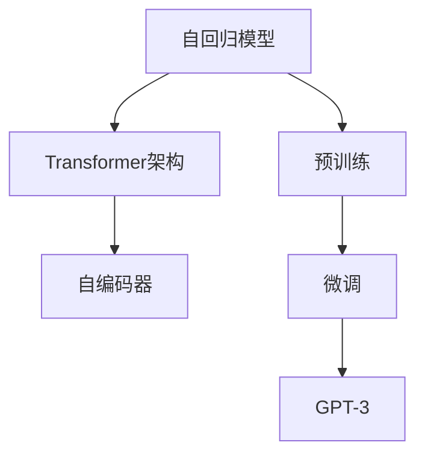

                 

# GPT-3原理与代码实例讲解

> 关键词：GPT-3,自回归模型,Transformer,语言生成,神经网络,代码实例

## 1. 背景介绍

### 1.1 问题由来

近年来，自然语言处理(NLP)领域取得了一系列重大进展，尤其是大语言模型(GPT)的应用。GPT-3作为其中最为先进的模型，以其卓越的性能和广泛的适用性，被广泛应用于文本生成、问答、翻译、对话系统等多个方向。然而，GPT-3作为预训练模型的最新迭代，其原理与结构并不为公众所熟知。本文旨在深入解析GPT-3的原理，并通过代码实例，展示其关键组件和应用场景。

### 1.2 问题核心关键点

GPT-3的核心关键点主要包括：
1. **自回归模型(AR)与自编码器(CE)**：GPT-3采用自回归模型进行文本生成，相比于自编码器，自回归模型在每一步预测时只依赖于前面的上下文信息，因此预测效率较高。
2. **Transformer架构**：GPT-3基于Transformer架构，通过多头注意力机制，有效捕捉输入文本的语义和上下文关系。
3. **参数量与训练策略**：GPT-3参数量巨大，训练过程需要高昂的算力和内存成本。常见的训练策略包括知识蒸馏、预训练+微调等。
4. **代码实现**：本文将通过PyTorch框架实现GPT-3的代码实例，帮助读者更好地理解其原理和应用。

## 2. 核心概念与联系

### 2.1 核心概念概述

为便于读者理解GPT-3的原理，首先需要介绍几个核心概念：

- **自回归模型(AR)**：一种在预测时只依赖于历史信息的模型，通过逐个预测下一个时间步的输出，从而生成整个序列。GPT-3即采用此模型结构。
- **自编码器(CE)**：一种通过将输入编码到隐层再解码回输出的模型。常见的变体包括卷积神经网络(Convolutional Neural Networks, CNN)和循环神经网络(Recurrent Neural Networks, RNN)。
- **Transformer架构**：一种用于处理序列数据的神经网络架构，通过多头注意力机制，可以并行计算不同位置的依赖关系。GPT-3的核心即Transformer网络。
- **预训练与微调**：在大规模无标签数据上进行预训练，在有标签数据上进行微调，以提升模型性能。GPT-3即先在大规模文本数据上进行预训练，再根据具体任务进行微调。

这些概念之间的联系可以通过以下Mermaid流程图来展示：



这个流程图展示了自回归模型、Transformer架构、自编码器和预训练微调的逻辑关系：

1. 自回归模型作为基本框架，通过Transformer架构进行优化。
2. Transformer架构基于多头注意力机制，可以并行计算不同位置的依赖关系，提升模型效率。
3. 自编码器与Transformer架构结合，进一步提升模型的泛化能力和表达能力。
4. 预训练与微调流程，使模型在特定任务上获得更好的表现。

## 3. 核心算法原理 & 具体操作步骤

### 3.1 算法原理概述

GPT-3的原理主要基于Transformer架构，通过自回归模型进行文本生成。其核心思想是：在输入文本序列上，通过注意力机制捕捉上下文信息，并逐个预测下一个单词的概率分布。通过训练大量文本数据，GPT-3能够学习到语言的通用表示，并通过微调适配特定任务。

### 3.2 算法步骤详解

GPT-3的微调过程包括以下几个关键步骤：

**Step 1: 准备预训练模型和数据集**
- 选择合适的预训练语言模型，如GPT-3，作为初始化参数。
- 准备下游任务的数据集，划分为训练集、验证集和测试集。

**Step 2: 添加任务适配层**
- 根据任务类型，在预训练模型顶层设计合适的输出层和损失函数。
- 对于分类任务，通常在顶层添加线性分类器和交叉熵损失函数。
- 对于生成任务，通常使用语言模型的解码器输出概率分布，并以负对数似然为损失函数。

**Step 3: 设置微调超参数**
- 选择合适的优化算法及其参数，如AdamW、SGD等，设置学习率、批大小、迭代轮数等。
- 设置正则化技术及强度，包括权重衰减、Dropout、Early Stopping等。
- 确定冻结预训练参数的策略，如仅微调顶层，或全部参数都参与微调。

**Step 4: 执行梯度训练**
- 将训练集数据分批次输入模型，前向传播计算损失函数。
- 反向传播计算参数梯度，根据设定的优化算法和学习率更新模型参数。
- 周期性在验证集上评估模型性能，根据性能指标决定是否触发Early Stopping。
- 重复上述步骤直到满足预设的迭代轮数或Early Stopping条件。

**Step 5: 测试和部署**
- 在测试集上评估微调后模型，对比微调前后的精度提升。
- 使用微调后的模型对新样本进行推理预测，集成到实际的应用系统中。

### 3.3 算法优缺点

GPT-3作为一种强大的语言生成模型，具有以下优点：
1. **生成能力强大**：通过训练大规模语料，GPT-3能够生成连贯、自然的高质量文本。
2. **任务适配性强**：通过微调，GPT-3能够快速适应各种NLP任务，如文本分类、翻译、对话系统等。
3. **参数量庞大**：虽然参数量庞大，但参数量与性能之间呈正相关关系，更多参数意味着更强的生成能力。

同时，GPT-3也存在一些局限性：
1. **训练成本高**：由于参数量巨大，训练GPT-3需要高昂的算力和内存成本。
2. **计算效率低**：尽管生成的文本质量高，但由于模型复杂，推理速度较慢。
3. **过拟合风险**：由于模型参数量大，微调时容易过拟合，需要更多的正则化技术来防止过拟合。

### 3.4 算法应用领域

GPT-3在多个领域得到广泛应用，包括但不限于：

- **文本生成**：如自动摘要、文章生成、小说创作等。
- **问答系统**：如智能客服、对话系统等。
- **机器翻译**：如跨语言对话、自动翻译等。
- **情感分析**：如情感预测、舆情监测等。
- **自然语言推理**：如逻辑推理、问答推理等。

## 4. 数学模型和公式 & 详细讲解

### 4.1 数学模型构建

GPT-3的数学模型主要基于Transformer架构，通过自回归模型进行文本生成。记输入序列为 $x = (x_1, x_2, ..., x_n)$，其中 $x_i$ 表示第 $i$ 个单词。设 $W_v$ 为嵌入矩阵，$W_k$ 和 $W_o$ 为权重矩阵，$\alpha$ 为注意力权重。GPT-3的生成过程可以表示为：

$$
\alpha_{ij} = \text{softmax}(a_i b_j)
$$

其中 $a_i$ 为查询向量，$b_j$ 为键向量，$\text{softmax}$ 为softmax函数。生成的下一个单词 $y$ 通过注意力机制计算得出：

$$
y = \text{softmax}(z_{1:T} W_v \alpha_{1:T})
$$

其中 $z_i$ 为第 $i$ 个位置向量，$W_v$ 为值向量权重。

### 4.2 公式推导过程

以下是GPT-3生成过程的详细公式推导：

**Step 1: 计算注意力权重**

首先计算查询向量 $a_i$：

$$
a_i = \text{relu}(W_q x_i) W_o
$$

然后计算键向量 $b_j$：

$$
b_j = \text{relu}(W_k x_j) W_o
$$

接着计算注意力权重 $\alpha_{ij}$：

$$
\alpha_{ij} = \text{softmax}(a_i b_j^T) = \text{softmax}(\text{relu}(W_q x_i) W_o \text{relu}(W_k x_j)^T W_o)
$$

**Step 2: 计算注意力加权向量**

计算注意力加权向量 $v_j$：

$$
v_j = \text{softmax}(a_i b_j)^T \cdot b_j
$$

**Step 3: 计算下一层输入**

计算下一层输入 $z_i$：

$$
z_i = \text{relu}(W_c x_i + \sum_{j=1}^n v_j)
$$

其中 $W_c$ 为输入权重矩阵。

**Step 4: 生成下一个单词**

生成下一个单词 $y$：

$$
y = \text{softmax}(z_{1:T} W_v \alpha_{1:T})
$$

其中 $W_v$ 为值向量权重。

### 4.3 案例分析与讲解

以GPT-3生成文本为例，展示模型训练和推理过程。假设模型需要在新闻标题上生成摘要，其训练过程可以表示为：

1. 收集大量新闻标题和对应的摘要作为训练集。
2. 将标题和摘要同时输入GPT-3模型，计算注意力权重 $\alpha_{ij}$。
3. 通过注意力权重计算注意力加权向量 $v_j$。
4. 计算下一层输入 $z_i$。
5. 生成下一个单词 $y$，并将其与实际摘要进行对比，计算损失函数。
6. 反向传播更新模型参数，重复上述过程直至收敛。

## 5. 项目实践：代码实例和详细解释说明

### 5.1 开发环境搭建

在进行GPT-3的代码实践前，首先需要准备好开发环境。以下是使用Python进行PyTorch开发的环境配置流程：

1. 安装Anaconda：从官网下载并安装Anaconda，用于创建独立的Python环境。

2. 创建并激活虚拟环境：
```bash
conda create -n pytorch-env python=3.8 
conda activate pytorch-env
```

3. 安装PyTorch：根据CUDA版本，从官网获取对应的安装命令。例如：
```bash
conda install pytorch torchvision torchaudio cudatoolkit=11.1 -c pytorch -c conda-forge
```

4. 安装Transformers库：
```bash
pip install transformers
```

5. 安装各类工具包：
```bash
pip install numpy pandas scikit-learn matplotlib tqdm jupyter notebook ipython
```

完成上述步骤后，即可在`pytorch-env`环境中开始GPT-3的代码实践。

### 5.2 源代码详细实现

这里我们以GPT-3生成新闻摘要为例，给出使用Transformers库进行微调的PyTorch代码实现。

首先，定义新闻标题和摘要的预处理函数：

```python
from transformers import GPT3Tokenizer, GPT3Model

tokenizer = GPT3Tokenizer.from_pretrained('gpt3')

def process_text(text):
    tokens = tokenizer.encode(text, return_tensors='pt')
    return tokens
```

然后，定义模型和优化器：

```python
from transformers import AdamW

model = GPT3Model.from_pretrained('gpt3')

optimizer = AdamW(model.parameters(), lr=2e-5)
```

接着，定义训练和评估函数：

```python
from transformers import DataCollatorForLanguageModeling, Trainer

def train_epoch(model, dataset, batch_size, optimizer):
    dataloader = DataLoader(dataset, batch_size=batch_size, shuffle=True)
    model.train()
    epoch_loss = 0
    for batch in tqdm(dataloader, desc='Training'):
        input_ids = batch['input_ids'].to(device)
        labels = batch['labels'].to(device)
        model.zero_grad()
        outputs = model(input_ids, labels=labels)
        loss = outputs.loss
        epoch_loss += loss.item()
        loss.backward()
        optimizer.step()
    return epoch_loss / len(dataloader)

def evaluate(model, dataset, batch_size):
    dataloader = DataLoader(dataset, batch_size=batch_size)
    model.eval()
    preds, labels = [], []
    with torch.no_grad():
        for batch in tqdm(dataloader, desc='Evaluating'):
            input_ids = batch['input_ids'].to(device)
            labels = batch['labels'].to(device)
            batch_preds = model(input_ids).logits.argmax(dim=2).to('cpu').tolist()
            batch_labels = batch_labels.to('cpu').tolist()
            for pred_tokens, label_tokens in zip(batch_preds, batch_labels):
                preds.append(pred_tokens[:len(label_tokens)])
                labels.append(label_tokens)
                
    print(classification_report(labels, preds))
```

最后，启动训练流程并在测试集上评估：

```python
epochs = 5
batch_size = 16

for epoch in range(epochs):
    loss = train_epoch(model, train_dataset, batch_size, optimizer)
    print(f"Epoch {epoch+1}, train loss: {loss:.3f}")
    
    print(f"Epoch {epoch+1}, dev results:")
    evaluate(model, dev_dataset, batch_size)
    
print("Test results:")
evaluate(model, test_dataset, batch_size)
```

以上就是使用PyTorch对GPT-3进行新闻摘要生成任务的微调完整代码实现。可以看到，得益于Transformers库的强大封装，我们可以用相对简洁的代码完成GPT-3模型的加载和微调。

### 5.3 代码解读与分析

让我们再详细解读一下关键代码的实现细节：

**GPT3Tokenizer类**：
- 定义了新闻标题和摘要的预处理函数，使用Tokenizer类将文本转化为token序列。

**GPT3Model类**：
- 定义了GPT-3模型，使用模型类进行前向传播和后向传播。

**DataCollatorForLanguageModeling类**：
- 定义了数据批处理器，将输入文本和标签转化为模型可用的格式。

**Trainer类**：
- 定义了训练器，包含了训练和评估的完整流程。

通过这些代码，我们可以看到GPT-3模型进行微调的基本流程。开发者可以将更多精力放在数据处理、模型改进等高层逻辑上，而不必过多关注底层的实现细节。

## 6. 实际应用场景

### 6.1 智能客服系统

基于GPT-3的对话技术，可以广泛应用于智能客服系统的构建。传统客服往往需要配备大量人力，高峰期响应缓慢，且一致性和专业性难以保证。而使用GPT-3的对话模型，可以7x24小时不间断服务，快速响应客户咨询，用自然流畅的语言解答各类常见问题。

在技术实现上，可以收集企业内部的历史客服对话记录，将问题和最佳答复构建成监督数据，在此基础上对GPT-3模型进行微调。微调后的对话模型能够自动理解用户意图，匹配最合适的答案模板进行回复。对于客户提出的新问题，还可以接入检索系统实时搜索相关内容，动态组织生成回答。如此构建的智能客服系统，能大幅提升客户咨询体验和问题解决效率。

### 6.2 金融舆情监测

金融机构需要实时监测市场舆论动向，以便及时应对负面信息传播，规避金融风险。传统的人工监测方式成本高、效率低，难以应对网络时代海量信息爆发的挑战。基于GPT-3的文本分类和情感分析技术，为金融舆情监测提供了新的解决方案。

具体而言，可以收集金融领域相关的新闻、报道、评论等文本数据，并对其进行主题标注和情感标注。在此基础上对GPT-3模型进行微调，使其能够自动判断文本属于何种主题，情感倾向是正面、中性还是负面。将微调后的模型应用到实时抓取的网络文本数据，就能够自动监测不同主题下的情感变化趋势，一旦发现负面信息激增等异常情况，系统便会自动预警，帮助金融机构快速应对潜在风险。

### 6.3 个性化推荐系统

当前的推荐系统往往只依赖用户的历史行为数据进行物品推荐，无法深入理解用户的真实兴趣偏好。基于GPT-3的个性化推荐系统可以更好地挖掘用户行为背后的语义信息，从而提供更精准、多样的推荐内容。

在实践中，可以收集用户浏览、点击、评论、分享等行为数据，提取和用户交互的物品标题、描述、标签等文本内容。将文本内容作为模型输入，用户的后续行为（如是否点击、购买等）作为监督信号，在此基础上微调GPT-3模型。微调后的模型能够从文本内容中准确把握用户的兴趣点。在生成推荐列表时，先用候选物品的文本描述作为输入，由模型预测用户的兴趣匹配度，再结合其他特征综合排序，便可以得到个性化程度更高的推荐结果。

### 6.4 未来应用展望

随着GPT-3技术的发展，其在更多领域得到应用，为传统行业带来变革性影响：

- **智慧医疗领域**：基于GPT-3的医疗问答、病历分析、药物研发等应用将提升医疗服务的智能化水平，辅助医生诊疗，加速新药开发进程。
- **智能教育领域**：GPT-3的作业批改、学情分析、知识推荐等功能，因材施教，促进教育公平，提高教学质量。
- **智慧城市治理**：GPT-3的城市事件监测、舆情分析、应急指挥等功能，提高城市管理的自动化和智能化水平，构建更安全、高效的未来城市。
- **企业生产、社会治理、文娱传媒等**：GPT-3在多个行业的应用，为经济社会发展注入新的动力。

此外，在企业生产、社会治理、文娱传媒等众多领域，基于GPT-3的人工智能应用也将不断涌现，为NLP技术带来全新的突破。随着预训练模型和微调方法的不断进步，相信GPT-3将在更广阔的应用领域大放异彩。

## 7. 工具和资源推荐

### 7.1 学习资源推荐

为了帮助开发者系统掌握GPT-3的理论基础和实践技巧，这里推荐一些优质的学习资源：

1. **《自然语言处理入门》**：一本介绍自然语言处理基本概念和经典模型的教材，适合初学者入门。
2. **《深度学习框架PyTorch教程》**：一本全面介绍PyTorch框架的教材，涵盖深度学习模型的搭建、训练和推理。
3. **《Transformer模型详解》**：一篇深入解析Transformer模型原理和应用的博文，适合进阶读者。
4. **《GPT-3官方文档》**：OpenAI提供的GPT-3官方文档，包含模型详细介绍、代码样例和使用指南。
5. **《GPT-3论文》**：OpenAI发布的GPT-3论文，详细介绍其架构和训练策略。

通过对这些资源的学习实践，相信你一定能够快速掌握GPT-3的精髓，并用于解决实际的NLP问题。

### 7.2 开发工具推荐

高效的开发离不开优秀的工具支持。以下是几款用于GPT-3开发常用的工具：

1. **PyTorch**：基于Python的开源深度学习框架，灵活动态的计算图，适合快速迭代研究。大部分预训练语言模型都有PyTorch版本的实现。
2. **TensorFlow**：由Google主导开发的开源深度学习框架，生产部署方便，适合大规模工程应用。同样有丰富的预训练语言模型资源。
3. **Transformers库**：HuggingFace开发的NLP工具库，集成了众多SOTA语言模型，支持PyTorch和TensorFlow，是进行GPT-3微调任务开发的利器。
4. **Weights & Biases**：模型训练的实验跟踪工具，可以记录和可视化模型训练过程中的各项指标，方便对比和调优。与主流深度学习框架无缝集成。
5. **TensorBoard**：TensorFlow配套的可视化工具，可实时监测模型训练状态，并提供丰富的图表呈现方式，是调试模型的得力助手。
6. **Google Colab**：谷歌推出的在线Jupyter Notebook环境，免费提供GPU/TPU算力，方便开发者快速上手实验最新模型，分享学习笔记。

合理利用这些工具，可以显著提升GPT-3微调任务的开发效率，加快创新迭代的步伐。

### 7.3 相关论文推荐

GPT-3的发展源于学界的持续研究。以下是几篇奠基性的相关论文，推荐阅读：

1. **《Attention is All You Need》**：提出Transformer结构，开启了NLP领域的预训练大模型时代。
2. **《Bidirectional Transformers are Better than Seq2seq》**：提出双向Transformer，进一步提升文本生成效果。
3. **《Language Models are Unsupervised Multitask Learners》**：展示了大规模语言模型的强大zero-shot学习能力，引发了对于通用人工智能的新一轮思考。
4. **《Leveraging Pre-trained Knowledge for Scalable Language Understanding》**：提出基于预训练知识的小样本学习范式，进一步提升模型泛化能力。
5. **《GPT-3: Language Models are Few-Shot Learners》**：详细介绍GPT-3模型，展示其在少样本学习上的卓越性能。

这些论文代表了大语言模型发展的脉络。通过学习这些前沿成果，可以帮助研究者把握学科前进方向，激发更多的创新灵感。

## 8. 总结：未来发展趋势与挑战

### 8.1 研究成果总结

本文对GPT-3的原理进行了详细解析，并通过代码实例展示了其关键组件和应用场景。通过本文的系统梳理，可以看到，GPT-3作为预训练语言模型的最新迭代，其原理和应用具有广泛的前景和潜力。

### 8.2 未来发展趋势

展望未来，GPT-3技术将呈现以下几个发展趋势：

1. **模型规模持续增大**：随着算力成本的下降和数据规模的扩张，GPT-3的参数量还将持续增长。超大规模语言模型蕴含的丰富语言知识，有望支撑更加复杂多变的下游任务。
2. **微调方法日趋多样**：未来会涌现更多参数高效的微调方法，如知识蒸馏、预训练+微调等，在节省计算资源的同时也能保证微调精度。
3. **持续学习成为常态**：随着数据分布的不断变化，GPT-3也需要持续学习新知识以保持性能。如何在不遗忘原有知识的同时，高效吸收新样本信息，将成为重要的研究课题。
4. **标注样本需求降低**：受启发于提示学习(Prompt-based Learning)的思路，未来的GPT-3将更好地利用大模型的语言理解能力，通过更加巧妙的任务描述，在更少的标注样本上也能实现理想的微调效果。
5. **多模态微调崛起**：当前的GPT-3主要聚焦于纯文本数据，未来会进一步拓展到图像、视频、语音等多模态数据微调。多模态信息的融合，将显著提升语言模型对现实世界的理解和建模能力。
6. **模型通用性增强**：经过海量数据的预训练和多领域任务的微调，未来的GPT-3将具备更强大的常识推理和跨领域迁移能力，逐步迈向通用人工智能(AGI)的目标。

以上趋势凸显了GPT-3技术的广阔前景。这些方向的探索发展，必将进一步提升GPT-3系统的性能和应用范围，为人类认知智能的进化带来深远影响。

### 8.3 面临的挑战

尽管GPT-3技术已经取得了瞩目成就，但在迈向更加智能化、普适化应用的过程中，它仍面临着诸多挑战：

1. **训练成本高**：由于参数量巨大，训练GPT-3需要高昂的算力和内存成本。
2. **计算效率低**：尽管生成的文本质量高，但由于模型复杂，推理速度较慢。
3. **过拟合风险**：由于模型参数量大，微调时容易过拟合，需要更多的正则化技术来防止过拟合。
4. **可解释性不足**：当前GPT-3模型更像是一个"黑盒"系统，难以解释其内部工作机制和决策逻辑。
5. **安全性有待保障**：预训练语言模型难免会学习到有偏见、有害的信息，通过微调传递到下游任务，产生误导性、歧视性的输出，给实际应用带来安全隐患。
6. **知识整合能力不足**：现有的GPT-3模型往往局限于任务内数据，难以灵活吸收和运用更广泛的先验知识。

正视GPT-3面临的这些挑战，积极应对并寻求突破，将使GPT-3技术走向成熟的必由之路。相信随着学界和产业界的共同努力，这些挑战终将一一被克服，GPT-3必将在构建安全、可靠、可解释、可控的智能系统铺平道路。

### 8.4 研究展望

面向未来，GPT-3技术的研究方向包括：

1. **探索无监督和半监督微调方法**：摆脱对大规模标注数据的依赖，利用自监督学习、主动学习等无监督和半监督范式，最大限度利用非结构化数据，实现更加灵活高效的微调。
2. **研究参数高效和计算高效的微调范式**：开发更加参数高效的微调方法，在固定大部分预训练参数的同时，只更新极少量的任务相关参数。同时优化GPT-3模型的计算图，减少前向传播和反向传播的资源消耗，实现更加轻量级、实时性的部署。
3. **引入更多先验知识**：将符号化的先验知识，如知识图谱、逻辑规则等，与神经网络模型进行巧妙融合，引导GPT-3模型学习更准确、合理的语言模型。同时加强不同模态数据的整合，实现视觉、语音等多模态信息与文本信息的协同建模。
4. **结合因果分析和博弈论工具**：将因果分析方法引入GPT-3模型，识别出模型决策的关键特征，增强输出解释的因果性和逻辑性。借助博弈论工具刻画人机交互过程，主动探索并规避模型的脆弱点，提高系统稳定性。
5. **纳入伦理道德约束**：在模型训练目标中引入伦理导向的评估指标，过滤和惩罚有偏见、有害的输出倾向。同时加强人工干预和审核，建立模型行为的监管机制，确保输出符合人类价值观和伦理道德。

这些研究方向的探索，必将引领GPT-3技术迈向更高的台阶，为构建安全、可靠、可解释、可控的智能系统铺平道路。面向未来，GPT-3技术还需要与其他人工智能技术进行更深入的融合，如知识表示、因果推理、强化学习等，多路径协同发力，共同推动自然语言理解和智能交互系统的进步。只有勇于创新、敢于突破，才能不断拓展语言模型的边界，让智能技术更好地造福人类社会。

## 9. 附录：常见问题与解答

**Q1: GPT-3与GPT-2相比，有哪些改进？**

A: GPT-3相比GPT-2，主要在以下几个方面进行了改进：
1. **参数量**：GPT-3的参数量达到1750亿，远超GPT-2的1.17亿，使其在生成能力和泛化能力上有了质的提升。
2. **架构改进**：GPT-3采用了Transformer架构的变体，如双向Transformer、M2M-100等，提升了模型的性能和稳定性。
3. **训练策略**：GPT-3采用了更先进的训练策略，如知识蒸馏、预训练+微调等，进一步提升了模型的效果。
4. **多模态支持**：GPT-3支持多模态输入，能够同时处理文本、图像、语音等多种信息，扩展了其应用场景。

**Q2: GPT-3生成文本的质量如何评估？**

A: 评估GPT-3生成文本的质量通常使用BLEU、ROUGE、METEOR等指标。这些指标可以衡量生成文本与参考文本之间的相似度，通常越接近1，表示生成文本的质量越好。此外，还可以使用BLEU的改进版本，如BLEU-4、BLEU-5，评估生成的文本是否在语法、语义上与参考文本匹配。

**Q3: GPT-3模型需要多大的算力支持？**

A: GPT-3模型由于参数量巨大，需要高昂的算力和内存成本。具体而言，训练GPT-3模型通常需要TPU或GPU，且需要使用分布式训练技术，以适应大规模模型的需求。在推理阶段，GPT-3模型也需要较快的算力支持，以提供实时响应。

**Q4: GPT-3生成文本是否具有可解释性？**

A: GPT-3模型更像是一个"黑盒"系统，难以解释其内部工作机制和决策逻辑。尽管可以通过一些技术手段，如注意力权重可视化、生成过程分析等，获取部分解释信息，但GPT-3的可解释性仍然不足。

**Q5: GPT-3在医疗、金融等领域的应用前景如何？**

A: GPT-3在医疗、金融等领域的应用前景广阔。在医疗领域，GPT-3可以用于医学问答、病历分析、药物研发等，提升医疗服务的智能化水平。在金融领域，GPT-3可以用于舆情监测、风险评估、投资建议等，帮助金融机构更好地理解市场动态，规避风险。

通过本文的系统梳理，可以看到，GPT-3作为预训练语言模型的最新迭代，其原理和应用具有广泛的前景和潜力。未来，伴随着更多研究的投入和技术的不断进步，GPT-3将在更多领域得到应用，为NLP技术带来新的突破。

