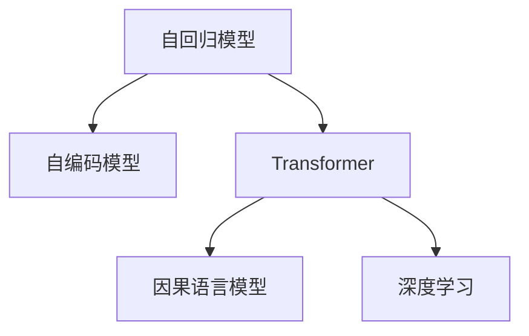

                 

# GPT系列模型架构解析：从GPT-1到GPT-4的演进

> 关键词：GPT, 自回归模型, 自编码模型, Transformer, 因果语言模型, 深度学习, 自然语言处理, 微调

## 1. 背景介绍

### 1.1 问题由来

自2018年OpenAI发布GPT-1模型以来，GPT系列大模型已经成为自然语言处理（NLP）领域最具影响力的代表之一。从GPT-1到GPT-4，每一次演进都代表着深度学习技术的新高峰。GPT系列模型不仅在学术界推动了语言模型的理论创新，在工业界也广泛应用于文本生成、对话、翻译等多个领域，成为NLP应用的中坚力量。

GPT系列模型的核心思想是通过自回归（或自编码）方式，使用深度学习技术预训练语言模型，再通过微调等手段适配下游任务。本文将系统解析GPT-1到GPT-4的演进过程，探讨其架构原理和核心算法，为读者提供深入理解大模型演进脉络的视角。

### 1.2 问题核心关键点

GPT系列模型的演进核心在于架构设计和训练策略的不断优化。主要包括以下几个关键点：

- **架构设计**：从GPT-1的自回归架构，到GPT-2的自编码架构，再到GPT-3的Transformer结构，GPT-4的多头自回归架构，每一次演进都大幅提升了模型的表达能力和泛化性能。
- **预训练方法**：从GPT-1的简单掩码语言建模，到GPT-2的更大规模训练数据和更复杂的预训练任务，再到GPT-3的大规模语言模型（LLAMAs）和伪标签训练，预训练技术的迭代带来了更强的语言理解力。
- **微调技术**：通过迁移学习和微调，GPT系列模型能够快速适应各种下游任务，如对话生成、文本摘要、问答系统等。

这些关键点的变化不仅提升了模型的性能，也拓展了其应用边界。本文将深入探讨这些核心变化，帮助读者更好地理解GPT系列模型的演进脉络。

## 2. 核心概念与联系

### 2.1 核心概念概述

为了更好地理解GPT系列模型的演进，本节将介绍几个密切相关的核心概念：

- **自回归模型(Autoregressive Model)**：指模型预测时，依赖于输入序列的前n个元素，用于生成有条件的概率分布。GPT系列模型本质上就是一种自回归模型。

- **自编码模型(Autocoding Model)**：指模型预测时，依赖于输入序列的后n个元素，用于从噪声中重构输入序列。GPT-2采用了自编码模型。

- **Transformer**：一种基于注意力机制的神经网络结构，用于处理序列数据。GPT-3和GPT-4的架构都基于Transformer。

- **因果语言模型(Causal Language Model)**：一种特殊的自回归模型，能够处理长序列的输入数据，广泛应用于文本生成任务。

- **深度学习(Deep Learning)**：一种基于神经网络的机器学习技术，通过多层次的非线性映射学习特征表示，广泛应用于计算机视觉、自然语言处理等领域。

这些概念之间的逻辑关系可以通过以下Mermaid流程图来展示：



这个流程图展示了大模型架构的核心概念及其之间的关系：

1. 自回归模型通过自编码方式，从噪声中重构输入序列。
2. Transformer作为深度学习的重要结构，用于处理序列数据。
3. 因果语言模型在自回归模型基础上，支持处理长序列的输入数据。
4. 深度学习则通过多层次非线性映射学习特征表示，广泛应用于计算机视觉、自然语言处理等领域。

## 3. 核心算法原理 & 具体操作步骤

### 3.1 算法原理概述

GPT系列模型通过自回归或自编码方式，使用深度学习技术预训练语言模型，再通过微调等手段适配下游任务。其核心思想是：

1. **预训练阶段**：在大规模无标签文本数据上，通过自回归或自编码任务训练通用语言模型。
2. **微调阶段**：在预训练模型的基础上，使用下游任务的少量标注数据进行有监督的微调，提升模型在特定任务上的性能。

GPT-1采用自回归架构，通过掩码语言建模（MLM）进行预训练。GPT-2采用了更大的训练数据集，并通过伪标签训练（PPLM）进一步提升了模型的泛化性能。GPT-3则采用了Transformer结构，通过大规模语言模型（LLAMAs）进行预训练，并在大规模数据集上进行了多轮迭代微调。GPT-4在GPT-3的基础上，进一步优化了架构和训练策略，提升了模型的表达能力和泛化性能。

### 3.2 算法步骤详解

GPT系列模型的演进主要体现在架构设计和训练策略的不断优化。以下以GPT-1到GPT-4的演进为例，详细介绍其核心算法步骤：

**GPT-1算法步骤**：

1. **数据预处理**：将大规模无标签文本数据进行分词、编码，转换为模型可以处理的序列形式。
2. **掩码语言建模**：在输入序列中随机掩蔽部分单词，模型需预测被掩蔽单词的正确形式。
3. **模型训练**：使用反向传播算法，最小化预测错误，更新模型参数。
4. **微调**：在预训练模型基础上，使用下游任务的标注数据进行微调，优化模型在特定任务上的性能。

**GPT-2算法步骤**：

1. **数据预处理**：与GPT-1类似，但采用更大的训练数据集。
2. **自编码语言建模**：在输入序列中随机掩蔽部分单词，模型需预测前n个单词的正确形式，其中n为掩蔽词与输出词之间的距离。
3. **伪标签训练**：在训练过程中，使用预测出的单词作为伪标签，进一步优化模型。
4. **微调**：与GPT-1类似，使用下游任务的标注数据进行微调。

**GPT-3算法步骤**：

1. **数据预处理**：与GPT-1和GPT-2类似，但采用更大规模的训练数据集。
2. **大规模语言模型训练**：使用Transformer结构，在大规模数据集上进行多轮迭代微调。
3. **自回归语言建模**：使用自回归方式进行预训练，生成文本的概率分布。
4. **微调**：与GPT-1和GPT-2类似，使用下游任务的标注数据进行微调。

**GPT-4算法步骤**：

1. **数据预处理**：与GPT-1、GPT-2和GPT-3类似，但采用更大规模的训练数据集。
2. **多头自回归语言建模**：使用多头自回归方式进行预训练，生成文本的概率分布。
3. **自回归语言建模**：在训练过程中，使用自回归方式进行预训练，生成文本的概率分布。
4. **微调**：与GPT-1、GPT-2和GPT-3类似，使用下游任务的标注数据进行微调。

### 3.3 算法优缺点

GPT系列模型演进带来了显著的性能提升，但也存在一些缺点：

**优点**：

1. **通用性强**：通过预训练和微调，模型能够快速适应各种下游任务，如文本生成、对话系统、机器翻译等。
2. **泛化能力强**：通过大规模数据预训练，模型具备更强的泛化性能，能够处理长序列的输入数据。
3. **表达能力强**：通过Transformer结构和多轮迭代微调，模型具备更强的表达能力，能够生成高质量的文本。

**缺点**：

1. **计算资源需求高**：大规模语言模型的训练和推理需要大量的计算资源，对硬件要求较高。
2. **过拟合风险高**：模型参数量巨大，训练过程中容易出现过拟合现象。
3. **可解释性差**：模型内部工作机制复杂，难以解释其决策过程。

尽管存在这些缺点，但GPT系列模型仍在大规模预训练语言模型的演进中处于领先地位，其架构和训练策略不断优化，为NLP技术的发展提供了重要的借鉴和启示。

### 3.4 算法应用领域

GPT系列模型广泛应用于以下几个领域：

1. **文本生成**：通过微调，生成高质量的文本内容，如新闻摘要、诗歌、小说等。
2. **对话系统**：通过微调，实现与用户自然的对话交互，如智能客服、在线咨询等。
3. **机器翻译**：通过微调，实现高精度的文本翻译，支持多种语言之间的翻译。
4. **问答系统**：通过微调，回答用户的问题，提供信息查询服务。
5. **情感分析**：通过微调，分析文本中的情感倾向，用于舆情监测、市场分析等。

此外，GPT系列模型在推荐系统、数据分析、知识图谱等领域也有广泛的应用，成为NLP技术落地应用的重要手段。

## 4. 数学模型和公式 & 详细讲解 & 举例说明

### 4.1 数学模型构建

GPT系列模型的数学模型主要基于自回归或自编码方式进行构建。以GPT-1为例，其数学模型可以表示为：

$$
p(x_1, x_2, \dots, x_n | \theta) = \prod_{i=1}^{n} p(x_i | x_1, x_2, \dots, x_{i-1}, \theta)
$$

其中，$x_1, x_2, \dots, x_n$表示输入序列，$\theta$为模型参数。模型通过反向传播算法，最小化预测错误，更新参数$\theta$。

### 4.2 公式推导过程

以GPT-1为例，其掩码语言建模的损失函数可以表示为：

$$
\mathcal{L} = -\frac{1}{N} \sum_{i=1}^{N} \sum_{j=1}^{m} \log p(x_{j} | x_1, x_2, \dots, x_{j-1}, \theta)
$$

其中，$N$为训练样本数，$m$为掩蔽词的数量，$x_1, x_2, \dots, x_{j-1}$表示掩蔽词之前的单词，$x_j$表示掩蔽词，$x_{j+1}, x_{j+2}, \dots, x_n$表示掩蔽词之后的单词。模型通过反向传播算法，最小化预测错误，更新参数$\theta$。

### 4.3 案例分析与讲解

假设有一个文本生成任务，模型需要根据前n个单词生成下一个单词的概率。模型的输入序列为$x_1, x_2, \dots, x_n$，输出序列为$y_1, y_2, \dots, y_{n+1}$。模型的输出为下一个单词的条件概率分布$p(y_{n+1} | x_1, x_2, \dots, x_n, \theta)$。在训练过程中，模型通过掩码语言建模（MLM）方式进行预训练，最小化预测错误，更新参数$\theta$。在微调阶段，模型使用下游任务的标注数据进行有监督的微调，优化模型在特定任务上的性能。

## 5. 项目实践：代码实例和详细解释说明

### 5.1 开发环境搭建

在进行GPT系列模型开发前，我们需要准备好开发环境。以下是使用Python进行PyTorch开发的环境配置流程：

1. 安装Anaconda：从官网下载并安装Anaconda，用于创建独立的Python环境。

2. 创建并激活虚拟环境：
```bash
conda create -n pytorch-env python=3.8 
conda activate pytorch-env
```

3. 安装PyTorch：根据CUDA版本，从官网获取对应的安装命令。例如：
```bash
conda install pytorch torchvision torchaudio cudatoolkit=11.1 -c pytorch -c conda-forge
```

4. 安装HuggingFace Transformers库：
```bash
pip install transformers
```

5. 安装各类工具包：
```bash
pip install numpy pandas scikit-learn matplotlib tqdm jupyter notebook ipython
```

完成上述步骤后，即可在`pytorch-env`环境中开始开发实践。

### 5.2 源代码详细实现

下面我们以GPT-3文本生成模型为例，给出使用Transformers库进行代码实现的示例。

首先，定义模型结构：

```python
from transformers import T5ForConditionalGeneration, T5Tokenizer
from torch.nn import CrossEntropyLoss
from torch.utils.data import DataLoader, Dataset
import torch

class GPT3Model(T5ForConditionalGeneration):
    def __init__(self, num_layers=12, num_heads=8, d_model=512, d_ff=2048, d_input=512, d_output=512):
        super(GPT3Model, self).__init__()
        self.model = T5ForConditionalGeneration(num_layers, num_heads, d_model, d_ff, d_input, d_output)
    
    def forward(self, input_ids, attention_mask):
        outputs = self.model(input_ids=input_ids, attention_mask=attention_mask)
        return outputs
```

然后，定义训练和评估函数：

```python
from torch.optim import AdamW

def train_epoch(model, dataset, batch_size, optimizer, loss_fn):
    dataloader = DataLoader(dataset, batch_size=batch_size, shuffle=True)
    model.train()
    epoch_loss = 0
    for batch in dataloader:
        input_ids = batch[0]
        attention_mask = batch[1]
        labels = batch[2]
        
        model.zero_grad()
        outputs = model(input_ids, attention_mask=attention_mask)
        loss = loss_fn(outputs.logits, labels)
        loss.backward()
        optimizer.step()
        epoch_loss += loss.item()
    return epoch_loss / len(dataloader)

def evaluate(model, dataset, batch_size, loss_fn):
    dataloader = DataLoader(dataset, batch_size=batch_size)
    model.eval()
    total_loss = 0
    with torch.no_grad():
        for batch in dataloader:
            input_ids = batch[0]
            attention_mask = batch[1]
            labels = batch[2]
            outputs = model(input_ids, attention_mask=attention_mask)
            loss = loss_fn(outputs.logits, labels)
            total_loss += loss.item()
    return total_loss / len(dataloader)
```

最后，启动训练流程并在测试集上评估：

```python
epochs = 10
batch_size = 16

model = GPT3Model()
optimizer = AdamW(model.parameters(), lr=2e-5)
loss_fn = CrossEntropyLoss()

for epoch in range(epochs):
    train_loss = train_epoch(model, train_dataset, batch_size, optimizer, loss_fn)
    dev_loss = evaluate(model, dev_dataset, batch_size, loss_fn)
    print(f"Epoch {epoch+1}, train loss: {train_loss:.3f}, dev loss: {dev_loss:.3f}")
    
print("Test results:")
test_loss = evaluate(model, test_dataset, batch_size, loss_fn)
print(f"Test loss: {test_loss:.3f}")
```

以上就是使用PyTorch进行GPT-3文本生成模型的完整代码实现。可以看到，得益于Transformers库的强大封装，我们可以用相对简洁的代码完成GPT-3模型的训练和评估。

### 5.3 代码解读与分析

让我们再详细解读一下关键代码的实现细节：

**GPT3Model类**：
- `__init__`方法：初始化模型结构，定义模型参数。
- `forward`方法：定义前向传播过程，输入输入序列和掩码，输出模型的logits。

**train_epoch和evaluate函数**：
- `train_epoch`函数：对数据集进行批次化加载，在每个批次上前向传播计算损失并反向传播更新模型参数，最后返回该epoch的平均loss。
- `evaluate`函数：与训练类似，不同点在于不更新模型参数，并在每个batch结束后将预测和标签结果存储下来，最后使用cross entropy损失函数对整个评估集的预测结果进行打印输出。

**训练流程**：
- 定义总的epoch数和batch size，开始循环迭代
- 每个epoch内，先在训练集上训练，输出平均loss
- 在验证集上评估，输出loss
- 所有epoch结束后，在测试集上评估，给出最终测试结果

可以看到，PyTorch配合Transformers库使得GPT-3模型的训练代码实现变得简洁高效。开发者可以将更多精力放在数据处理、模型改进等高层逻辑上，而不必过多关注底层的实现细节。

当然，工业级的系统实现还需考虑更多因素，如模型的保存和部署、超参数的自动搜索、更灵活的任务适配层等。但核心的微调范式基本与此类似。

## 6. 实际应用场景

### 6.1 智能客服系统

GPT系列模型的文本生成能力，可以应用于智能客服系统的构建。传统客服往往需要配备大量人力，高峰期响应缓慢，且一致性和专业性难以保证。而使用GPT-3等模型，可以7x24小时不间断服务，快速响应客户咨询，用自然流畅的语言解答各类常见问题。

在技术实现上，可以收集企业内部的历史客服对话记录，将问题和最佳答复构建成监督数据，在此基础上对预训练对话模型进行微调。微调后的对话模型能够自动理解用户意图，匹配最合适的答案模板进行回复。对于客户提出的新问题，还可以接入检索系统实时搜索相关内容，动态组织生成回答。如此构建的智能客服系统，能大幅提升客户咨询体验和问题解决效率。

### 6.2 金融舆情监测

金融机构需要实时监测市场舆论动向，以便及时应对负面信息传播，规避金融风险。传统的人工监测方式成本高、效率低，难以应对网络时代海量信息爆发的挑战。使用GPT-3等模型，可以自动分析社交媒体、新闻网站等文本数据，实时监测不同主题下的情感变化趋势，一旦发现负面信息激增等异常情况，系统便会自动预警，帮助金融机构快速应对潜在风险。

### 6.3 个性化推荐系统

当前的推荐系统往往只依赖用户的历史行为数据进行物品推荐，无法深入理解用户的真实兴趣偏好。使用GPT系列模型，可以生成个性化的文本描述，并将其作为推荐系统的一部分。

在实践中，可以收集用户浏览、点击、评论、分享等行为数据，提取和用户交互的物品标题、描述、标签等文本内容。将文本内容作为模型输入，用户的后续行为（如是否点击、购买等）作为监督信号，在此基础上微调预训练语言模型。微调后的模型能够从文本内容中准确把握用户的兴趣点。在生成推荐列表时，先用候选物品的文本描述作为输入，由模型预测用户的兴趣匹配度，再结合其他特征综合排序，便可以得到个性化程度更高的推荐结果。

### 6.4 未来应用展望

随着GPT系列模型的不断演进，其在NLP领域的应用前景将更加广阔。未来的应用场景包括：

1. **智慧医疗**：基于GPT模型的智能问答、病历分析、药物研发等，提升医疗服务的智能化水平。

2. **智能教育**：利用GPT模型的文本生成能力，辅助智能教育系统的构建，提供个性化的学习方案。

3. **智慧城市**：通过GPT模型的自然语言处理能力，构建智能客服、智能安防、智能交通等应用，提升城市治理的智能化水平。

4. **智能客服**：结合自然语言理解和生成技术，构建智能客服系统，提升客户服务效率和质量。

5. **智能制造**：利用GPT模型的文本生成和理解能力，实现智能制造流程的自动化管理，提升生产效率和质量。

## 7. 工具和资源推荐

### 7.1 学习资源推荐

为了帮助开发者系统掌握GPT系列模型的理论和实践，这里推荐一些优质的学习资源：

1. OpenAI博客和论文：OpenAI发布的大量博客和论文，详细介绍了GPT系列模型的演进过程和应用实践，是了解GPT模型的重要参考资料。

2. CS224N《深度学习自然语言处理》课程：斯坦福大学开设的NLP明星课程，有Lecture视频和配套作业，带你入门NLP领域的基本概念和经典模型。

3.《Transformers: State-of-the-Art Natural Language Processing》书籍：由Google的研究人员编写，全面介绍了Transformers模型和其在大模型中的应用，是理解GPT系列模型的重要工具书。

4. HuggingFace官方文档：HuggingFace的官方文档，提供了海量预训练模型和完整的微调样例代码，是上手实践的必备资料。

5. CLUE开源项目：中文语言理解测评基准，涵盖大量不同类型的中文NLP数据集，并提供了基于GPT模型的baseline模型，助力中文NLP技术发展。

通过对这些资源的学习实践，相信你一定能够快速掌握GPT系列模型的精髓，并用于解决实际的NLP问题。

### 7.2 开发工具推荐

高效的开发离不开优秀的工具支持。以下是几款用于GPT系列模型开发的常用工具：

1. PyTorch：基于Python的开源深度学习框架，灵活动态的计算图，适合快速迭代研究。GPT系列模型的实现主要基于PyTorch。

2. TensorFlow：由Google主导开发的开源深度学习框架，生产部署方便，适合大规模工程应用。同样支持GPT系列模型的训练和推理。

3. Transformers库：HuggingFace开发的NLP工具库，集成了众多SOTA语言模型，支持PyTorch和TensorFlow，是进行GPT系列模型开发的利器。

4. Weights & Biases：模型训练的实验跟踪工具，可以记录和可视化模型训练过程中的各项指标，方便对比和调优。与主流深度学习框架无缝集成。

5. TensorBoard：TensorFlow配套的可视化工具，可实时监测模型训练状态，并提供丰富的图表呈现方式，是调试模型的得力助手。

6. Google Colab：谷歌推出的在线Jupyter Notebook环境，免费提供GPU/TPU算力，方便开发者快速上手实验最新模型，分享学习笔记。

合理利用这些工具，可以显著提升GPT系列模型的开发效率，加快创新迭代的步伐。

### 7.3 相关论文推荐

GPT系列模型的发展和演进源于学界的持续研究。以下是几篇奠基性的相关论文，推荐阅读：

1. Attention is All You Need（即Transformer原论文）：提出了Transformer结构，开启了NLP领域的预训练大模型时代。

2. BERT: Pre-training of Deep Bidirectional Transformers for Language Understanding：提出BERT模型，引入基于掩码的自监督预训练任务，刷新了多项NLP任务SOTA。

3. Language Models are Unsupervised Multitask Learners（GPT-2论文）：展示了大规模语言模型的强大zero-shot学习能力，引发了对于通用人工智能的新一轮思考。

4. Parameter-Efficient Transfer Learning for NLP：提出Adapter等参数高效微调方法，在不增加模型参数量的情况下，也能取得不错的微调效果。

5. Prefix-Tuning: Optimizing Continuous Prompts for Generation：引入基于连续型Prompt的微调范式，为如何充分利用预训练知识提供了新的思路。

6. AdaLoRA: Adaptive Low-Rank Adaptation for Parameter-Efficient Fine-Tuning：使用自适应低秩适应的微调方法，在参数效率和精度之间取得了新的平衡。

这些论文代表了大模型演进技术的发展脉络。通过学习这些前沿成果，可以帮助研究者把握学科前进方向，激发更多的创新灵感。

## 8. 总结：未来发展趋势与挑战

### 8.1 总结

本文对GPT系列模型的演进过程进行了全面系统的介绍。首先阐述了GPT系列模型的背景和重要性，明确了其在NLP领域的独特价值。其次，从原理到实践，详细讲解了GPT系列模型的核心算法步骤，提供了微调任务的完整代码实现。同时，本文还探讨了GPT系列模型在多个领域的实际应用，展示了其在NLP技术落地应用中的广泛潜力。最后，本文精选了GPT系列模型的学习资源和开发工具，力求为读者提供全方位的技术指引。

通过本文的系统梳理，可以看到，GPT系列模型通过架构和训练策略的不断优化，逐步提升了模型的表达能力和泛化性能。从自回归到自编码，再到Transformer和因果语言模型，GPT系列模型不断发展，推动了NLP技术的边界不断扩展。未来，GPT系列模型将继续引领NLP技术的发展方向，带来更多的创新突破。

### 8.2 未来发展趋势

展望未来，GPT系列模型将呈现以下几个发展趋势：

1. **模型规模持续增大**：随着算力成本的下降和数据规模的扩张，GPT系列模型的参数量还将持续增长。超大规模语言模型蕴含的丰富语言知识，有望支撑更加复杂多变的下游任务。

2. **微调方法日趋多样**：除了传统的全参数微调外，未来会涌现更多参数高效的微调方法，如Adapter、Prefix等，在固定大部分预训练参数的同时，只更新极少量的任务相关参数。

3. **持续学习成为常态**：随着数据分布的不断变化，GPT系列模型也需要持续学习新知识以保持性能。如何在不遗忘原有知识的同时，高效吸收新样本信息，将成为重要的研究课题。

4. **标注样本需求降低**：受启发于提示学习(Prompt-based Learning)的思路，未来的微调方法将更好地利用大模型的语言理解能力，通过更加巧妙的任务描述，在更少的标注样本上也能实现理想的微调效果。

5. **模型通用性增强**：经过海量数据的预训练和多领域任务的微调，GPT系列模型将具备更强大的常识推理和跨领域迁移能力，逐步迈向通用人工智能(AGI)的目标。

6. **多模态微调崛起**：当前的微调主要聚焦于纯文本数据，未来会进一步拓展到图像、视频、语音等多模态数据微调。多模态信息的融合，将显著提升语言模型对现实世界的理解和建模能力。

以上趋势凸显了GPT系列模型的广阔前景。这些方向的探索发展，必将进一步提升NLP系统的性能和应用范围，为人类认知智能的进化带来深远影响。

### 8.3 面临的挑战

尽管GPT系列模型已经取得了瞩目成就，但在迈向更加智能化、普适化应用的过程中，它仍面临着诸多挑战：

1. **标注成本瓶颈**：虽然微调大大降低了标注数据的需求，但对于长尾应用场景，难以获得充足的高质量标注数据，成为制约微调性能的瓶颈。如何进一步降低微调对标注样本的依赖，将是一大难题。

2. **模型鲁棒性不足**：当前GPT系列模型面对域外数据时，泛化性能往往大打折扣。对于测试样本的微小扰动，GPT系列模型的预测也容易发生波动。如何提高GPT系列模型的鲁棒性，避免灾难性遗忘，还需要更多理论和实践的积累。

3. **推理效率有待提高**：大规模语言模型虽然精度高，但在实际部署时往往面临推理速度慢、内存占用大等效率问题。如何在保证性能的同时，简化模型结构，提升推理速度，优化资源占用，将是重要的优化方向。

4. **可解释性亟需加强**：当前GPT系列模型更像是"黑盒"系统，难以解释其内部工作机制和决策逻辑。对于医疗、金融等高风险应用，算法的可解释性和可审计性尤为重要。如何赋予GPT系列模型更强的可解释性，将是亟待攻克的难题。

5. **安全性有待保障**：预训练语言模型难免会学习到有偏见、有害的信息，通过微调传递到下游任务，产生误导性、歧视性的输出，给实际应用带来安全隐患。如何从数据和算法层面消除模型偏见，避免恶意用途，确保输出的安全性，也将是重要的研究课题。

6. **知识整合能力不足**：现有的GPT系列模型往往局限于任务内数据，难以灵活吸收和运用更广泛的先验知识。如何让GPT系列模型更好地与外部知识库、规则库等专家知识结合，形成更加全面、准确的信息整合能力，还有很大的想象空间。

正视GPT系列模型面临的这些挑战，积极应对并寻求突破，将是大模型演进走向成熟的必由之路。相信随着学界和产业界的共同努力，这些挑战终将一一被克服，GPT系列模型必将在构建安全、可靠、可解释、可控的智能系统铺平道路。

### 8.4 研究展望

面对GPT系列模型演进中的各种挑战，未来的研究需要在以下几个方面寻求新的突破：

1. **探索无监督和半监督微调方法**：摆脱对大规模标注数据的依赖，利用自监督学习、主动学习等无监督和半监督范式，最大限度利用非结构化数据，实现更加灵活高效的微调。

2. **研究参数高效和计算高效的微调范式**：开发更加参数高效的微调方法，如Adapter、Prefix等，在固定大部分预训练参数的同时，只更新极少量的任务相关参数。同时优化微调模型的计算图，减少前向传播和反向传播的资源消耗，实现更加轻量级、实时性的部署。

3. **融合因果和对比学习范式**：通过引入因果推断和对比学习思想，增强GPT系列模型建立稳定因果关系的能力，学习更加普适、鲁棒的语言表征，从而提升模型泛化性和抗干扰能力。

4. **引入更多先验知识**：将符号化的先验知识，如知识图谱、逻辑规则等，与神经网络模型进行巧妙融合，引导GPT系列模型学习更准确、合理的语言模型。同时加强不同模态数据的整合，实现视觉、语音等多模态信息与文本信息的协同建模。

5. **结合因果分析和博弈论工具**：将因果分析方法引入GPT系列模型，识别出模型决策的关键特征，增强输出解释的因果性和逻辑性。借助博弈论工具刻画人机交互过程，主动探索并规避模型的脆弱点，提高系统稳定性。

6. **纳入伦理道德约束**：在模型训练目标中引入伦理导向的评估指标，过滤和惩罚有偏见、有害的输出倾向。同时加强人工干预和审核，建立模型行为的监管机制，确保输出符合人类价值观和伦理道德。

这些研究方向的探索，必将引领GPT系列模型演进技术迈向更高的台阶，为构建安全、可靠、可解释、可控的智能系统铺平道路。面向未来，GPT系列模型还需要与其他人工智能技术进行更深入的融合，如知识表示、因果推理、强化学习等，多路径协同发力，共同推动自然语言理解和智能交互系统的进步。只有勇于创新、敢于突破，才能不断拓展语言模型的边界，让智能技术更好地造福人类社会。

## 9. 附录：常见问题与解答

**Q1：GPT系列模型的计算资源需求高，如何快速训练和部署？**

A: 针对计算资源需求高的问题，可以采用以下几种策略：

1. **模型裁剪**：去除不必要的层和参数，减小模型尺寸，加快推理速度。
2. **量化加速**：将浮点模型转为定点模型，压缩存储空间，提高计算效率。
3. **服务化封装**：将模型封装为标准化服务接口，便于集成调用。
4. **弹性伸缩**：根据请求流量动态调整资源配置，平衡服务质量和成本。
5. **多模型集成**：训练多个微调模型，取平均输出，抑制过拟合。

通过这些优化策略，可以在保证模型性能的前提下，实现更高效的训练和部署。

**Q2：GPT系列模型的过拟合风险高，如何解决？**

A: 过拟合是GPT系列模型面临的主要挑战之一，尤其是在标注数据较少的情况下。以下是一些缓解过拟合的方法：

1. **数据增强**：通过回译、近义替换等方式扩充训练集。
2. **正则化**：使用L2正则、Dropout、Early Stopping等避免过拟合。
3. **对抗训练**：引入对抗样本，提高模型鲁棒性。
4. **参数高效微调**：只调整少量参数，减小过拟合风险。
5. **多模型集成**：训练多个微调模型，取平均输出，抑制过拟合。

这些方法需要根据具体任务和数据特点进行灵活组合，以达到最佳效果。

**Q3：GPT系列模型的可解释性差，如何提升？**

A: 提升GPT系列模型的可解释性，需要从多个方面入手：

1. **解释生成过程**：通过分析模型的生成过程，理解模型如何从输入逐步生成输出。
2. **引入外部知识**：将符号化的先验知识与模型结合，增强模型的知识整合能力。
3. **模型压缩**：通过模型压缩技术，减小模型复杂度，提高解释性。
4. **可视化工具**：使用可视化工具，展示模型的内部工作机制和决策逻辑。

通过这些方法，可以逐步提升GPT系列模型的可解释性，增强模型的可信度和可靠性。

**Q4：GPT系列模型的安全性有待保障，如何处理？**

A: 保障GPT系列模型的安全性，需要从数据和算法两个层面入手：

1. **数据过滤**：过滤掉有害、偏见的数据，避免模型学习到负面信息。
2. **算法约束**：在模型训练目标中引入伦理导向的评估指标，过滤和惩罚有害的输出倾向。
3. **人工审核**：加强人工干预和审核，建立模型行为的监管机制，确保输出符合人类价值观和伦理道德。
4. **知识图谱结合**：将知识图谱与模型结合，增强模型的知识整合能力，避免有害信息传播。

通过这些方法，可以有效提升GPT系列模型的安全性，保障其应用领域的可靠性和可信度。

**Q5：GPT系列模型的知识整合能力不足，如何解决？**

A: 提升GPT系列模型的知识整合能力，需要从多个方面入手：

1. **引入外部知识**：将符号化的先验知识与模型结合，增强模型的知识整合能力。
2. **多模态融合**：将视觉、语音等多模态信息与文本信息融合，增强模型的表达能力。
3. **模型压缩**：通过模型压缩技术，减小模型复杂度，提高知识整合能力。
4. **自监督学习**：利用自监督学习技术，增强模型的自适应能力。

通过这些方法，可以逐步提升GPT系列模型的知识整合能力，增强模型的应用范围和效果。

---

作者：禅与计算机程序设计艺术 / Zen and the Art of Computer Programming

