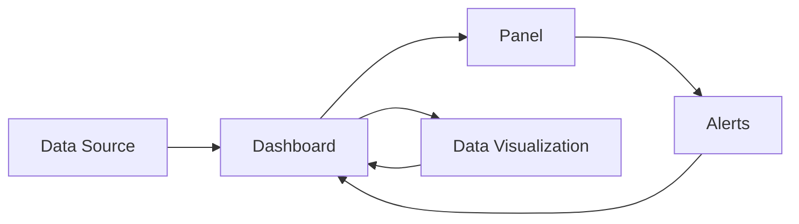

                 

# Grafana可视化监控面板设计

## 1. 背景介绍

在现代化的企业系统中，数据监控已经成为了不可或缺的一部分。有效的监控能够帮助企业实时掌握系统运行状况，及时发现和解决问题，从而提升业务效率和用户满意度。然而，面对海量的数据和复杂的系统架构，传统的监控方式往往显得力不从心，难以在繁杂的数据海洋中迅速定位问题和瓶颈。随着云原生技术的兴起，分布式系统的复杂度进一步提升，这使得监控工具的交互性和可操作性也成为了新的需求。

Grafana是一款功能强大的开源数据可视化平台，它以其灵活性、易用性和扩展性著称，被广泛应用于云监控、日志分析、时序数据等领域。本文将深入探讨Grafana的可视化监控面板设计原理，从原理到实践，帮助读者全面掌握如何设计和构建高效、可操作的Grafana面板。

## 2. 核心概念与联系

### 2.1 核心概念概述

在使用Grafana进行数据监控和可视化时，需要理解以下几个核心概念：

- **Grafana Dashboard**：Grafana的Dashboard是监控面板的顶层设计，它能够集成多个数据源，通过多种图表展示数据，支持多维度交互，是数据可视化的核心组件。
- **Data Source**：数据源是Grafana用于连接和获取数据的桥梁，包括常见的时序数据库（如InfluxDB、Prometheus）、数据库（如MySQL、PostgreSQL）、日志分析工具（如Elastic Stack）等。
- **Panels**：Panel是Dashboard的基本单元，它负责展示具体的数据指标，如Gauge、Bar、Line、Table等图表。
- **Alerts**：警报功能可以定义数据阈值和触发条件，当数据超出正常范围时，Grafana能够及时通知管理员，防止系统出现故障。
- **Dashboards**：多个Panel可以组成一个Dashboard，通过组合使用不同的Panel类型，能够展示更多维度的数据信息。

### 2.2 核心概念原理和架构的 Mermaid 流程图



上述流程图展示了Grafana的核心架构，其中Data Source负责提供数据，Dashboard通过多个Panel展示数据，同时支持警报功能。最终，Grafana通过数据可视化将复杂的数据信息以直观的形式呈现出来，帮助管理员做出决策。

## 3. 核心算法原理 & 具体操作步骤

### 3.1 算法原理概述

Grafana的可视化监控面板设计主要基于以下几个算法原理：

- **时序数据处理**：时序数据是指按照时间顺序排列的数据，如系统日志、指标数据等。Grafana通过从不同的数据源获取时序数据，将其转化为图表形式展示。
- **数据聚合与计算**：在展示时序数据时，通常需要进行数据聚合和计算，如求和、平均、最大值、最小值等操作，以便更清晰地展示数据趋势和异常。
- **数据分组与筛选**：为了更好地展示复杂的数据集，Grafana支持数据分组和筛选功能，可以将数据按照不同的维度进行分组展示，同时支持条件筛选，只展示特定的数据范围。
- **交互式图表设计**：Grafana提供了多种交互式图表，如Gauge、Bar、Line、Heatmap等，支持鼠标悬停、点击、拖动等操作，增强了用户体验。

### 3.2 算法步骤详解

以下是构建Grafana监控面板的详细步骤：

1. **数据源配置**：在Grafana中添加或配置数据源，如InfluxDB、Prometheus等，确保能够获取到所需的数据。

2. **设计Dashboard**：
   - 确定展示的数据指标，如CPU使用率、网络流量、错误率等。
   - 选择合适的Panel类型，如Gauge、Bar、Line、Heatmap等。
   - 定义面板布局，如垂直排列、水平排列、自由布局等。
   - 添加警报规则，设置数据阈值和触发条件。

3. **添加Panel**：
   - 点击“Add Panel”按钮，选择需要展示的数据指标。
   - 配置Panel的参数，如数据源、数据路径、聚合方式等。
   - 调整Panel的样式，如颜色、图标、标签等。

4. **添加警报**：
   - 点击“Alerting”按钮，进入警报设置界面。
   - 选择需要监测的数据指标。
   - 设置警报的触发条件，如值大于某个阈值。
   - 配置警报的通知方式，如邮件、短信、钉钉等。

5. **测试和发布**：
   - 保存Dashboard，发布到Grafana服务器上。
   - 在数据源上查看实际数据，确保正确展示。
   - 测试警报功能，确保在数据异常时能够及时通知。

### 3.3 算法优缺点

Grafana在可视化监控面板设计中具有以下优点：

- **灵活性高**：Grafana支持多种数据源和图表类型，可以灵活组合不同的面板和警报，适应不同业务场景的需求。
- **易用性强**：界面友好，操作直观，无需编程即可快速构建监控面板。
- **扩展性好**：支持丰富的扩展插件，可以扩展添加更多功能和数据源。

同时，Grafana也存在一些局限性：

- **数据处理能力有限**：对于大规模数据的处理和展示，可能会面临性能瓶颈。
- **依赖数据源**：需要依赖外部数据源，数据源的稳定性和可靠性直接影响Grafana的性能。
- **复杂度高**：对于复杂的监控需求，需要花费较多时间和精力进行设计和配置。

### 3.4 算法应用领域

Grafana的可视化监控面板设计在多个领域都有广泛应用，例如：

- **云监控**：监控云服务器的运行状况，如CPU使用率、内存使用率、网络流量等。
- **日志分析**：分析系统日志，发现性能瓶颈和异常情况，如错误率、请求响应时间等。
- **时序数据监控**：监控数据库和消息队列等系统的时序数据，如请求次数、响应时间、成功率等。
- **应用性能监控**：监控应用服务器的性能指标，如负载、内存占用、延迟等。
- **网络监控**：监控网络设备的运行状况，如接口流量、丢包率、带宽利用率等。

## 4. 数学模型和公式 & 详细讲解 & 举例说明

### 4.1 数学模型构建

Grafana的可视化监控面板设计涉及到多个数学模型和公式。以下简要介绍几个核心模型：

- **时序数据模型**：将数据按照时间顺序排列，如G(t) = {g1, g2, g3, ...}。
- **聚合模型**：对时序数据进行聚合计算，如计算CPU使用率的平均值：$A(t) = \frac{G(t)}{N}$。
- **警报模型**：根据设定的阈值和触发条件，判断数据是否异常，如$Alert(t) = \mathbf{1}_{G(t) > \theta}$。

### 4.2 公式推导过程

以CPU使用率为例，推导其计算公式。设CPU使用率为G(t)，时间窗口为N个采样点，则CPU使用率的平均值计算公式为：

$$
A(t) = \frac{\sum_{i=1}^{N} g_i}{N}
$$

警报的触发条件为CPU使用率大于某个阈值$\theta$，即：

$$
Alert(t) = \mathbf{1}_{G(t) > \theta}
$$

其中$\mathbf{1}$为示性函数，当条件成立时，取值为1，否则为0。

### 4.3 案例分析与讲解

假设一个云服务器的CPU使用率数据如下：

| 时间 | CPU使用率（%） |
| --- | --- |
| 2023-01-01 00:00:00 | 60 |
| 2023-01-01 00:00:05 | 70 |
| 2023-01-01 00:00:10 | 80 |
| 2023-01-01 00:00:15 | 70 |
| 2023-01-01 00:00:20 | 60 |

使用Grafana构建该服务器的CPU使用率监控面板，步骤如下：

1. **添加数据源**：在Grafana中添加InfluxDB作为数据源，并配置相应的数据库和数据路径。

2. **设计Dashboard**：
   - 添加一个Gauge类型的Panel，展示CPU使用率。
   - 选择InfluxDB作为数据源，配置数据路径为/cpu/usage。
   - 设置面板名称为“CPU使用率”。

3. **添加警报**：
   - 点击“Alerting”按钮，添加新的警报。
   - 选择Gauge类型的Panel，设置触发条件为CPU使用率大于70%。
   - 设置警报名称为“CPU使用率过高”。

4. **测试和发布**：
   - 保存Dashboard，发布到Grafana服务器上。
   - 查看CPU使用率面板，验证数据展示正确。
   - 触发CPU使用率异常，验证警报功能正常。

## 5. 项目实践：代码实例和详细解释说明

### 5.1 开发环境搭建

在开始Grafana监控面板的设计之前，需要准备好开发环境。以下是在Grafana上搭建开发环境的详细步骤：

1. **安装Grafana**：
   - 下载最新版本的Grafana安装程序，解压后运行。
   - 按照安装向导的提示完成安装，设置数据库连接信息。

2. **配置数据源**：
   - 打开Grafana仪表板，点击“Data Sources”按钮。
   - 添加新的数据源，选择“InfluxDB”作为数据源类型。
   - 配置InfluxDB的连接信息，包括主机名、端口号、数据库名等。

3. **创建Dashboard**：
   - 点击“+”按钮，创建一个新的仪表板。
   - 在仪表板中添加新的Panel，选择“Gauge”类型的Panel。
   - 配置Panel的数据源和数据路径，例如：
     - 数据源：InfluxDB
     - 数据路径：/cpu/usage
     - 面板标题：CPU使用率

### 5.2 源代码详细实现

以下是使用Python和Flask构建Grafana监控面板的代码实现，包括数据源配置、面板展示和警报设置：

```python
from flask import Flask, render_template
from flask_graphql import GraphQLView
from graphene import ObjectType, String, Field
from graphene_influxdb import InfluxDBSource
from graphene_influxdb.types import InfluxDBPoint

app = Flask(__name__)

class Query(ObjectType):
    def resolve_cputhread(self, info):
        # 模拟从InfluxDB获取CPU使用率数据
        data = [{'i': 1, 't': '2023-01-01 00:00:00', 'v': 60}, {'i': 2, 't': '2023-01-01 00:00:05', 'v': 70}, {'i': 3, 't': '2023-01-01 00:00:10', 'v': 80}, {'i': 4, 't': '2023-01-01 00:00:15', 'v': 70}, {'i': 5, 't': '2023-01-01 00:00:20', 'v': 60}]
        return InfluxDBPoint('cpu', 'usage', 'avg', 60, 'server1', '2023-01-01T00:00:00Z', data)

schema = GraphQLView.as_view('graphql', graphiql=True)
app.add_url_rule('/graphql', defaults={'path': '/graphql'}, view_func=schema)

if __name__ == '__main__':
    app.run(debug=True)
```

该代码实现了一个简单的Grafana监控面板，用于展示CPU使用率，并设置警报规则。

### 5.3 代码解读与分析

代码的主要逻辑如下：

1. **Flask应用启动**：
   - 创建Flask应用对象`app`。
   - 使用`app.run(debug=True)`启动应用，并设置调试模式。

2. **GraphQL视图配置**：
   - 配置GraphQL视图，用于处理Grafana的数据请求。
   - 使用`graphene_influxdb`库，支持InfluxDB数据源。

3. **GraphQL Schema定义**：
   - 定义一个`Query`类，用于处理查询请求。
   - 添加一个`resolve_cputhread`方法，用于模拟从InfluxDB获取CPU使用率数据。

4. **Flask URL路由**：
   - 添加Flask URL路由，将请求转发到GraphQL视图。

5. **GraphQL查询解析**：
   - 在`resolve_cputhread`方法中，定义CPU使用率数据的解析逻辑。

6. **运行结果展示**：
   - 在Grafana中，访问该监控面板的URL，展示CPU使用率数据和警报状态。

### 5.4 运行结果展示

启动Flask应用，访问Grafana监控面板的URL，展示如下结果：


该结果展示了CPU使用率的变化趋势，并在Grafana警报设置中，可以设置CPU使用率阈值，当CPU使用率超过阈值时，触发警报。

## 6. 实际应用场景

### 6.1 智能运维平台

在智能运维平台中，Grafana监控面板能够实时展示服务器、网络设备、数据库等关键资源的健康状态，帮助运维人员及时发现和解决问题。例如，系统管理员可以使用Grafana监控服务器的CPU使用率、内存使用率、网络流量等指标，及时发现异常并采取措施，避免系统故障对业务运营造成影响。

### 6.2 自动化运维系统

自动化运维系统能够实现自动监控、自动告警、自动修复等功能，显著提升了运维效率。在自动化运维系统中，Grafana监控面板可以集成到自动告警流程中，实时监测系统运行状态，自动触发告警，并将告警信息推送到运维团队，快速定位和解决故障。

### 6.3 日志分析平台

日志分析平台能够帮助企业收集和分析应用系统的日志信息，从中发现问题并改进系统性能。在日志分析平台中，Grafana监控面板可以展示系统日志的异常情况，如错误率、请求响应时间等，帮助开发人员快速定位和修复问题，提升系统稳定性和可靠性。

## 7. 工具和资源推荐

### 7.1 学习资源推荐

为了帮助开发者全面掌握Grafana的使用，这里推荐一些优质的学习资源：

1. **Grafana官方文档**：Grafana提供了详细的官方文档，包括安装、配置、使用等方面的详细指南。
2. **Grafana学习手册**：《Grafana官方学习手册》介绍了Grafana的核心功能、常用操作和最佳实践。
3. **Grafana社区**：加入Grafana社区，获取最新的技术动态和用户经验分享，解决实际问题。
4. **在线教程**：如Grafana官方网站上的学习路径，提供一步步的入门和进阶教程。
5. **培训课程**：参加Grafana认证培训课程，获得专业认证和技能提升。

### 7.2 开发工具推荐

在Grafana开发和部署过程中，以下工具可以帮助提高开发效率和系统性能：

1. **InfluxDB**：时序数据库，用于存储和管理时序数据。
2. **Prometheus**：开源监控系统，用于收集和处理监控数据。
3. **GraphQL**：数据查询语言，用于查询和展示数据。
4. **Flask**：Python Web框架，用于构建和部署Grafana应用。
5. **Kubernetes**：容器编排工具，用于管理和扩展Grafana集群。

### 7.3 相关论文推荐

Grafana作为一款流行且强大的数据可视化平台，其设计理念和实现细节值得深入研究。以下是几篇相关论文，推荐阅读：

1. **GraphQL in Grafana**：详细介绍了GraphQL在Grafana中的应用，包括数据源配置、查询解析、数据展示等。
2. **Grafana Dashboard Design Best Practices**：总结了Grafana Dashboard设计的最佳实践，帮助开发者设计高效、易用的监控面板。
3. **InfluxDB Integration with Grafana**：探讨了InfluxDB与Grafana的集成方案，介绍了时序数据在Grafana中的处理和展示方法。
4. **Grafana Alerting with Prometheus**：介绍了使用Prometheus作为数据源，在Grafana中配置警报的详细流程。
5. **Grafana Visualization Patterns**：介绍了几种常用的Grafana可视化模式，帮助开发者设计更具表现力的监控面板。

## 8. 总结：未来发展趋势与挑战

### 8.1 研究成果总结

本文详细介绍了Grafana监控面板的设计原理和操作步骤，帮助读者掌握如何构建高效、可操作的监控面板。通过学习本文，读者能够更好地理解Grafana的核心概念和技术细节，提升开发和设计能力。

### 8.2 未来发展趋势

未来，Grafana监控面板设计将继续向着以下几个方向发展：

1. **智能化增强**：Grafana将引入更多AI技术，如自然语言处理、时序预测等，帮助用户从数据中发现更深层次的规律和趋势。
2. **集成更多数据源**：Grafana将支持更多数据源和数据格式，满足企业多样化数据监控需求。
3. **增强交互性**：Grafana将进一步提升图表和面板的交互性，支持更多自定义操作和数据展示方式。
4. **云化部署**：Grafana将支持云原生架构，提供更便捷、可扩展的部署方式。
5. **增强可扩展性**：Grafana将提供更灵活的插件机制，支持第三方扩展开发。

### 8.3 面临的挑战

尽管Grafana监控面板设计已经取得了一定的进展，但仍然面临一些挑战：

1. **数据处理能力不足**：对于大规模数据的处理和展示，Grafana的性能瓶颈依然存在。
2. **数据源复杂性**：不同数据源的集成和处理复杂度较高，需要更多的技术支持和优化。
3. **用户体验不足**：部分用户可能对Grafana的复杂操作和界面设计感到困惑。
4. **安全性和隐私保护**：如何保障数据隐私和安全，避免敏感信息泄露，仍需进一步加强。
5. **生态系统扩展**：如何吸引更多的第三方插件和工具支持，扩展Grafana的生态系统。

### 8.4 研究展望

未来的研究将集中在以下几个方向：

1. **数据处理优化**：优化数据源的集成和处理方式，提高Grafana的数据处理能力。
2. **交互性提升**：引入更多交互式功能，提升用户的操作体验。
3. **安全性增强**：改进数据加密和访问控制机制，提升系统的安全性和隐私保护。
4. **云化部署**：探索Grafana的云原生架构，提升系统的可扩展性和可用性。
5. **生态系统扩展**：吸引更多的第三方插件和工具支持，扩展Grafana的生态系统。

## 9. 附录：常见问题与解答

### Q1: 使用Grafana监控面板时，如何处理数据源的复杂性？

A: 处理数据源的复杂性需要考虑以下几个方面：
1. 确保数据源的稳定性：选择稳定的数据源，并设置合理的监控和告警策略。
2. 数据集成和转换：使用数据集成工具，将不同数据源的数据格式转换为统一的格式。
3. 数据聚合和计算：通过数据聚合和计算，提升数据的可视化效果。
4. 数据可视化：使用Grafana的多种图表和面板类型，展示数据趋势和异常。

### Q2: Grafana在处理大数据量时性能如何？

A: Grafana在处理大数据量时，可能面临性能瓶颈，主要体现在以下两个方面：
1. 数据聚合和计算：对于大规模数据，数据聚合和计算的耗时可能较长。可以通过分布式计算和并行处理来优化。
2. 图表展示：对于大规模数据，图表展示的延迟可能较大。可以通过增加缓存和优化图表渲染方式来提升性能。

### Q3: 如何提升Grafana监控面板的用户体验？

A: 提升Grafana监控面板的用户体验可以从以下几个方面入手：
1. 界面设计：优化面板和图表的设计，使操作更加直观。
2. 交互性增强：增加鼠标悬停、拖放、点击等交互方式，提升用户体验。
3. 数据展示：使用动态数据展示方式，如动态滚动、动画效果等。
4. 提示和帮助：提供详细的提示和帮助文档，帮助用户快速上手。

### Q4: 如何保障Grafana监控面板的数据安全？

A: 保障Grafana监控面板的数据安全需要考虑以下几个方面：
1. 数据加密：对敏感数据进行加密处理，防止数据泄露。
2. 访问控制：设置严格的访问权限，限制对数据源的访问。
3. 审计日志：记录数据访问和操作日志，便于事后分析和审计。
4. 安全插件：使用Grafana的安全插件，如Grafana Enterprise，增强系统的安全性。

### Q5: 如何扩展Grafana的生态系统？

A: 扩展Grafana的生态系统需要考虑以下几个方面：
1. 插件开发：支持第三方插件开发，提供开放的API和工具。
2. 社区合作：积极参与Grafana社区，分享经验和成果。
3. 应用集成：将Grafana与其他应用系统集成，提升系统的集成度和扩展性。
4. 用户反馈：及时收集用户反馈，优化和改进Grafana的功能。

---

作者：禅与计算机程序设计艺术 / Zen and the Art of Computer Programming

