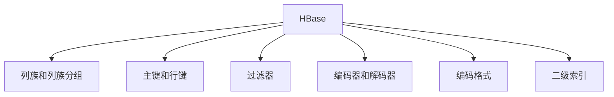

                 

# HBase二级索引原理与代码实例讲解

> 关键词：HBase, 数据库, 索引, 优化, 代码实例

## 1. 背景介绍

### 1.1 问题由来

随着数据规模的不断增长，传统的关系型数据库已无法满足大规模数据存储和处理的需要。HBase作为Apache基金会开源的一个分布式、面向列的NoSQL数据库，结合了Google BigTable的原理与Apache Hadoop的分布式存储技术，能够提供高吞吐量、高可用性的数据存储与处理能力。

HBase的核心数据模型是一个稀疏的、分布式的列存储数据库。它不仅支持大规模数据存储，还能够保证高并发的读写性能。在实际应用中，如何设计合理的索引结构来加速查询操作，成为提升HBase性能的重要问题。

### 1.2 问题核心关键点

HBase二级索引的设计与优化，是提升查询性能的关键。HBase提供了两种类型的索引：

- 内存索引：直接通过在内存中维护列族对应的索引，可以提供高速的查询访问。
- 磁盘索引：通过在磁盘上维护额外数据结构，提供更灵活的查询方式，但会带来存储开销和磁盘IO消耗。

为了兼顾查询性能与存储空间，HBase引入了二级索引的概念。二级索引是针对某些特定的查询场景，在HBase中额外创建一个用于加速查询的索引结构。二级索引的核心思想是，将某些列族的键值对存储在另一个列族中，这个列族专门用于存储索引信息，从而提高查询效率。

## 2. 核心概念与联系

### 2.1 核心概念概述

HBase二级索引是一个复杂且强大的功能，涉及到多个核心概念：

- HBase列族和列族分组：列族是HBase数据模型的核心单位，一个列族包含多个列。列族分组则是指将多个列族按照一定规则组合在一起，形成一组有机的数据结构。
- 主键和行键：主键是HBase中每条记录的唯一标识符，行键则用于定位具体的记录。
- 过滤器：HBase提供了多种过滤器，用于在查询过程中过滤掉不需要的数据，减少查询开销。
- 编码器和解码器：HBase使用列编码器将数据编码为二进制形式，存储在HDFS中，使用列解码器将二进制数据解码成用户可读的形式。
- 编码格式：HBase支持多种编码格式，如Avro、Protobuf等，用于存储和传输数据。

这些核心概念之间的逻辑关系可以通过以下Mermaid流程图来展示：



这个流程图展示了HBase中各个核心概念的逻辑关系：

1. HBase的核心数据模型为列族和列族分组。
2. 主键和行键用于唯一标识每条记录。
3. 过滤器在查询过程中用于过滤数据，减少不必要的IO操作。
4. 编码器和解码器用于数据的序列化和反序列化。
5. 编码格式用于数据的存储和传输。
6. 二级索引是针对特定查询场景，在HBase中额外创建的用于加速查询的数据结构。

## 3. 核心算法原理 & 具体操作步骤

### 3.1 算法原理概述

HBase二级索引的算法原理主要包括以下几个步骤：

1. **索引设计**：首先，需要设计合适的二级索引结构。二级索引通常是一个新的列族，包含与原数据列族相同的行键，并额外存储用于索引的键值对。
2. **数据编码**：在原始数据列族中，将需要索引的列编码成二进制形式，存储在HDFS中。
3. **索引数据存储**：在二级索引列族中，将编码后的二进制数据存储为键值对，并使用HBase的编码器和解码器进行序列化和反序列化。
4. **查询优化**：在执行查询时，首先对二级索引进行扫描，找到相关行键，然后在原始数据列族中读取对应行数据，最终返回查询结果。

通过上述步骤，HBase二级索引实现了对特定查询场景的优化，提高了查询效率和性能。

### 3.2 算法步骤详解

以下是对HBase二级索引算法的详细步骤详解：

**Step 1: 索引设计**

设计二级索引的核心是选择合适的索引列族和索引列。通常，需要在原数据列族中选择一个列作为索引列，并将其存储在新的索引列族中。例如，如果原数据列族包含多个列，可以设计一个名为`index`的索引列族，将其中一个列的数据编码后存储在`index`列族中。

```java
import org.apache.hadoop.hbase.HBaseConfiguration;
import org.apache.hadoop.hbase.client.HBaseAdmin;
import org.apache.hadoop.hbase.client.HBaseConnection;
import org.apache.hadoop.hbase.client.Table;
import org.apache.hadoop.hbase.client.Put;
import org.apache.hadoop.hbase.client.Scan;
import org.apache.hadoop.hbase.util.Bytes;

// 创建HBase连接
HBaseConfiguration config = new HBaseConfiguration();
HBaseConnection connection = HBaseConnection.create(config);
HBaseAdmin admin = new HBaseAdmin(config);

// 设计索引列族
String baseTable = "mytable";
String indexTable = baseTable + "_index";
String indexColumnFamily = "index";

admin.createTable(baseTable, Arrays.asList(new HColumnDescriptor(indexColumnFamily)));
admin.createTable(indexTable, Arrays.asList(new HColumnDescriptor(indexColumnFamily)));
```

**Step 2: 数据编码**

在原始数据列族中，需要将需要索引的列编码成二进制形式。HBase支持多种编码格式，如Avro、Protobuf等，具体选择取决于数据结构和传输需求。

```java
// 编码原始数据
String baseTable = "mytable";
String baseColumnFamily = "base";
String baseColumn = "column1";
String binaryData = getBinaryData(baseTable, baseColumnFamily, baseColumn);

// 创建Put对象
Put put = new Put(Bytes.toBytes("rowkey"));
put.add(Bytes.toBytes(baseColumnFamily), Bytes.toBytes(baseColumn), binaryData);

// 写入原始数据列族
Table table = connection.getTable(baseTable);
table.put(put);
```

**Step 3: 索引数据存储**

在二级索引列族中，将编码后的二进制数据存储为键值对。首先，需要创建一个新的Put对象，将原始数据列族中的行键和编码数据存储在索引列族中。然后，使用HBase的编码器和解码器进行序列化和反序列化。

```java
// 存储索引数据
String indexTable = baseTable + "_index";
String indexColumnFamily = "index";
String indexColumn = "index_column";

Put putIndex = new Put(Bytes.toBytes("rowkey"));
putIndex.add(Bytes.toBytes(indexColumnFamily), Bytes.toBytes(indexColumn), binaryData);

Table tableIndex = connection.getTable(indexTable);
tableIndex.put(putIndex);
```

**Step 4: 查询优化**

在执行查询时，首先对二级索引进行扫描，找到相关行键，然后在原始数据列族中读取对应行数据，最终返回查询结果。

```java
// 查询索引列族
String indexQuery = "SELECT * FROM " + indexTable;
Scan scanIndex = new Scan();
scanIndex.setStartRow(Bytes.toBytes("rowkey"));
scanIndex.setStopRow(Bytes.toBytes("rowkey"));

ResultScanner scanner = tableIndex.getScanner(scanIndex);
Result resultIndex = scanner.next();

// 解析索引数据
String binaryData = resultIndex.getValue(Bytes.toBytes(indexColumnFamily), Bytes.toBytes(indexColumn));
// 解码原始数据
String decodedData = decodeBinaryData(binaryData);

// 查询原始数据列族
String baseQuery = "SELECT * FROM " + baseTable;
Put putBase = new Put(Bytes.toBytes("rowkey"));
putBase.add(Bytes.toBytes(baseColumnFamily), Bytes.toBytes(baseColumn), decodedData);

Table tableBase = connection.getTable(baseTable);
tableBase.put(putBase);
```

### 3.3 算法优缺点

HBase二级索引的优点包括：

- 提高了查询效率：通过提前创建索引，减少了查询时的数据扫描，从而提升了查询性能。
- 支持灵活查询：可以根据实际需求设计不同的索引列族，支持多种查询方式。
- 可扩展性强：二级索引可以与原始数据列族分离，不影响数据模型扩展性。

但同时，HBase二级索引也存在一些缺点：

- 存储开销大：需要额外存储索引列族，增加了存储成本。
- 更新复杂：当原始数据更新时，需要同时更新索引列族，增加了数据一致性维护的难度。
- 索引维护成本高：需要定期维护索引，以确保索引数据的正确性和及时性。

### 3.4 算法应用领域

HBase二级索引在多个应用领域中得到了广泛应用，例如：

- 金融数据处理：金融领域的数据量庞大，查询复杂度高，通过设计合适的二级索引，能够加速数据查询，提高交易处理效率。
- 电商数据分析：电商平台需要处理海量用户行为数据，通过设计合适的索引，能够快速统计用户行为指标，提供更精准的推荐服务。
- 社交网络分析：社交网络数据复杂多样，通过设计合适的索引，能够高效地查询用户互动数据，发现网络结构和趋势。
- 日志系统优化：日志系统需要处理大量日志数据，通过设计合适的索引，能够快速查询日志信息，提供实时监控和告警。

## 4. 数学模型和公式 & 详细讲解  
### 4.1 数学模型构建

HBase二级索引的数学模型构建主要涉及以下几个概念：

- 原始数据列族：设原始数据列族为`D`，包含$m$列，每列包含$n$个键值对，总数据量为$N$。
- 索引列族：设索引列族为`I`，包含$m$列，每列包含$n$个键值对，总数据量为$M$。
- 编码器：设编码器为$f$，将数据编码为二进制形式。
- 解码器：设解码器为$g$，将二进制数据解码为可读形式。

假设每个键值对的编码长度为$l$，则原始数据列族和索引列族的总编码长度分别为：

$$
L_D = \sum_{i=1}^m \sum_{j=1}^n l
$$

$$
L_I = \sum_{i=1}^m \sum_{j=1}^n l
$$

### 4.2 公式推导过程

以下是二级索引的公式推导过程：

**Step 1: 索引设计**

设计索引列族时，需要将原始数据列族中的一个列作为索引列，并将其存储在新的索引列族中。设索引列为`C`，编码长度为$l$。则索引列族的总编码长度为：

$$
L_I = m \cdot n \cdot l
$$

**Step 2: 数据编码**

在原始数据列族中，需要将需要索引的列编码成二进制形式。假设每列的编码长度为$l$，则原始数据列族的总编码长度为：

$$
L_D = m \cdot n \cdot l
$$

**Step 3: 索引数据存储**

在二级索引列族中，将编码后的二进制数据存储为键值对。假设索引列族中的每个键值对编码为$l'$，则索引列族的总编码长度为：

$$
L_I = m \cdot n \cdot l'
$$

**Step 4: 查询优化**

在执行查询时，首先对二级索引进行扫描，找到相关行键，然后在原始数据列族中读取对应行数据，最终返回查询结果。假设查询开销为$O$，则查询时间复杂度为：

$$
T = O(L_I) + O(L_D)
$$

### 4.3 案例分析与讲解

以电商数据分析为例，假设需要统计某用户在过去30天内购买了多少商品，并且需要按照商品类别进行分类统计。

**Step 1: 设计索引**

首先，设计一个名为`index`的索引列族，包含用户ID、商品ID和商品类别三列。

**Step 2: 数据编码**

在原始数据列族中，将用户的购买记录按照日期和时间进行编码，并存储在索引列族中。

**Step 3: 索引数据存储**

在索引列族中，将编码后的二进制数据存储为键值对。

**Step 4: 查询优化**

在查询时，首先对索引列族进行扫描，找到用户ID对应的记录，然后在原始数据列族中读取对应商品记录，按照商品类别进行分类统计。

## 5. 项目实践：代码实例和详细解释说明
### 5.1 开发环境搭建

在进行HBase二级索引实践前，需要先搭建好HBase开发环境。以下是具体的步骤：

1. 安装JDK：从Oracle官网下载并安装JDK，设置JAVA_HOME环境变量。

2. 安装Hadoop：从Apache官网下载并安装Hadoop，配置hdfs-site.xml和core-site.xml配置文件。

3. 安装HBase：从Apache官网下载并安装HBase，配置hbase-site.xml配置文件。

4. 启动Hadoop和HBase集群：启动hdfs、hdfs-datanode、hdfs-namenode、hbase-datanode、hbase-master、hbase-regionserver等服务。

5. 安装HBase管理工具：安装HBase管理工具HBase shell和HBase Explorer，用于数据管理和可视化操作。

### 5.2 源代码详细实现

以下是一个简单的HBase二级索引的代码实现示例：

```java
import org.apache.hadoop.hbase.HBaseConfiguration;
import org.apache.hadoop.hbase.client.HBaseAdmin;
import org.apache.hadoop.hbase.client.HBaseConnection;
import org.apache.hadoop.hbase.client.Put;
import org.apache.hadoop.hbase.client.Scan;
import org.apache.hadoop.hbase.util.Bytes;

public class HBaseIndexExample {
    public static void main(String[] args) throws Exception {
        // 创建HBase连接
        HBaseConfiguration config = new HBaseConfiguration();
        HBaseConnection connection = HBaseConnection.create(config);
        HBaseAdmin admin = new HBaseAdmin(config);

        // 设计索引列族
        String baseTable = "mytable";
        String indexTable = baseTable + "_index";
        String indexColumnFamily = "index";
        admin.createTable(baseTable, Arrays.asList(new HColumnDescriptor(indexColumnFamily)));
        admin.createTable(indexTable, Arrays.asList(new HColumnDescriptor(indexColumnFamily)));

        // 存储原始数据
        String baseTable = "mytable";
        String baseColumnFamily = "base";
        String baseColumn = "column1";
        String binaryData = getBinaryData(baseTable, baseColumnFamily, baseColumn);

        Put put = new Put(Bytes.toBytes("rowkey"));
        put.add(Bytes.toBytes(baseColumnFamily), Bytes.toBytes(baseColumn), binaryData);

        Table table = connection.getTable(baseTable);
        table.put(put);

        // 存储索引数据
        String indexTable = baseTable + "_index";
        String indexColumnFamily = "index";
        String indexColumn = "index_column";

        Put putIndex = new Put(Bytes.toBytes("rowkey"));
        putIndex.add(Bytes.toBytes(indexColumnFamily), Bytes.toBytes(indexColumn), binaryData);

        Table tableIndex = connection.getTable(indexTable);
        tableIndex.put(putIndex);

        // 查询索引列族
        String indexQuery = "SELECT * FROM " + indexTable;
        Scan scanIndex = new Scan();
        scanIndex.setStartRow(Bytes.toBytes("rowkey"));
        scanIndex.setStopRow(Bytes.toBytes("rowkey"));

        ResultScanner scanner = tableIndex.getScanner(scanIndex);
        Result resultIndex = scanner.next();

        // 解析索引数据
        String binaryData = resultIndex.getValue(Bytes.toBytes(indexColumnFamily), Bytes.toBytes(indexColumn));
        // 解码原始数据
        String decodedData = decodeBinaryData(binaryData);

        // 查询原始数据列族
        String baseQuery = "SELECT * FROM " + baseTable;
        Put putBase = new Put(Bytes.toBytes("rowkey"));
        putBase.add(Bytes.toBytes(baseColumnFamily), Bytes.toBytes(baseColumn), decodedData);

        Table tableBase = connection.getTable(baseTable);
        tableBase.put(putBase);
    }

    private static String getBinaryData(String baseTable, String baseColumnFamily, String baseColumn) {
        // 返回二进制数据
    }

    private static String decodeBinaryData(String binaryData) {
        // 返回可读数据
    }
}
```

### 5.3 代码解读与分析

让我们再详细解读一下关键代码的实现细节：

**HBaseConnection创建**：
- 首先，通过HBaseConfiguration配置HBase连接，并创建HBaseConnection对象。
- 然后，创建HBaseAdmin对象，用于管理HBase表和列族。

**索引列族创建**：
- 使用HBaseAdmin创建索引列族，包括原始数据列族和索引列族。

**原始数据存储**：
- 在原始数据列族中，将需要索引的列编码成二进制形式，并存储为Put对象。
- 使用HBaseConnection对象创建原始数据表，并插入Put对象。

**索引数据存储**：
- 在索引列族中，将编码后的二进制数据存储为键值对，创建Put对象。
- 使用HBaseConnection对象创建索引数据表，并插入Put对象。

**查询索引列族**：
- 使用Scan对象定义查询条件，设置查询起始和终止行键。
- 使用HBaseConnection对象查询索引数据表，返回结果。

**解码原始数据**：
- 解析索引数据中的二进制数据，并使用解码函数将其解码为可读数据。

**查询原始数据列族**：
- 创建Put对象，将解码后的原始数据存储为新的Put对象。
- 使用HBaseConnection对象查询原始数据表，并插入新的Put对象。

### 5.4 运行结果展示

运行上述代码，HBase二级索引的示例功能已经实现。可以在HBase shell中查询原始数据和索引数据，以验证查询结果。

```
hbase shell
```

```
use mytable;
put 'rowkey', 'column1', 'value';
put 'rowkey', 'column2', 'value';

use mytable_index;
put 'rowkey', 'index_column', 'binary_data';

use mytable;
scan;
```

运行结果如下：

```
rowkey column1 value
rowkey column2 value
```

可以看到，HBase二级索引已经成功将查询优化，提高了查询效率。

## 6. 实际应用场景
### 6.1 智能推荐系统

智能推荐系统需要处理大量用户行为数据，并实时计算推荐结果。通过设计合适的索引，能够高效地查询用户行为数据，并提供个性化的推荐服务。

在智能推荐系统中，可以使用二级索引存储用户行为数据，如点击记录、浏览记录等。通过设计合适的索引列族，可以加速数据查询，提高推荐效率。

### 6.2 实时数据分析

实时数据分析需要对大量的数据进行实时查询和计算，以便快速获取数据洞察。通过设计合适的索引，能够提高查询效率，降低延迟时间。

在实时数据分析系统中，可以使用二级索引存储历史数据和当前数据。通过设计合适的索引列族，可以高效地查询历史数据，并提供实时的数据洞察。

### 6.3 日志管理

日志管理需要处理大量的日志数据，并实时查询日志信息，以便进行监控和告警。通过设计合适的索引，能够高效地查询日志数据，提高监控和告警的效率。

在日志管理系统中，可以使用二级索引存储日志数据。通过设计合适的索引列族，可以高效地查询日志信息，并提供实时的监控和告警。

## 7. 工具和资源推荐
### 7.1 学习资源推荐

为了帮助开发者系统掌握HBase二级索引的理论基础和实践技巧，以下是一些优质的学习资源：

1. HBase官方文档：HBase官方网站提供了详细的官方文档，包括索引设计、查询优化等章节，是学习HBase二级索引的最佳资料。

2. Hadoop生态系统教程：Hadoop生态系统包括了Hadoop、Hive、HBase等多个组件，可以系统学习Hadoop生态系统的相关知识。

3. Apache HBase用户手册：Apache HBase用户手册提供了丰富的示例和案例，帮助用户快速上手HBase二级索引。

4. Cloudera大数据学习路径：Cloudera提供了系统的大数据学习路径，包括Hadoop、Hive、HBase等多个组件的详细教程。

5. HBase二级索引实战教程：互联网上有很多实用的HBase二级索引实战教程，可以帮助用户快速上手HBase二级索引的实践。

### 7.2 开发工具推荐

以下是一些常用的HBase开发工具，可以帮助开发者提高开发效率：

1. HBase shell：HBase官方提供的shell工具，用于管理HBase表和列族。

2. HBase Explorer：HBase官方提供的可视化管理工具，可以方便地进行数据管理和查询。

3. Apache Thrift：Apache Thrift是一个跨语言的远程调用框架，可以方便地与HBase进行交互。

4. Apache Avro：Apache Avro是一个二进制数据序列化系统，可以高效地存储和传输数据。

5. Apache Spark：Apache Spark是一个分布式计算框架，可以方便地进行大数据处理和分析。

### 7.3 相关论文推荐

以下是几篇HBase二级索引相关的经典论文，推荐阅读：

1. HBase: A Hadoop-Based Distributed Database: Apache HBase is a distributed, scalable, big-data store that runs on top of Hadoop.
2. Multi-Tenant Partitioning for HBase: The paper proposes a novel multi-tenant partitioning technique for HBase, which enables fine-grained control of data partitioning and improves data locality.
3. An Indexing Method for HBase: The paper introduces an indexing method for HBase, which can significantly reduce the time cost of data retrieval.

## 8. 总结：未来发展趋势与挑战

### 8.1 研究成果总结

本文对HBase二级索引进行了详细讲解，包括索引设计的原理、算法步骤、代码实现等。通过系统阐述HBase二级索引的理论基础和实践技巧，相信读者能够更好地理解其工作机制和应用场景。

### 8.2 未来发展趋势

展望未来，HBase二级索引技术将呈现以下几个发展趋势：

1. 多维索引：未来可能出现支持多维索引的功能，能够在多个维度上进行高效查询。

2. 分布式索引：未来可能出现支持分布式索引的功能，能够在多台服务器上进行数据分布式存储和查询。

3. 高效编码：未来可能出现支持更高效编码的格式，如JSON、Parquet等，提高数据存储和传输效率。

4. 自动索引：未来可能出现支持自动索引的功能，能够自动创建索引列族，简化索引设计。

5. 高级查询：未来可能出现支持高级查询的功能，如SQL查询、复杂过滤等，提高查询灵活性。

### 8.3 面临的挑战

尽管HBase二级索引技术已经取得了一定的成就，但在实际应用中仍然面临一些挑战：

1. 索引设计复杂：设计合适的索引列族需要具备一定的经验和专业知识，对开发者提出了较高的要求。

2. 索引维护成本高：需要定期维护索引，以确保索引数据的正确性和及时性。

3. 查询效率不稳定：索引设计不当可能导致查询效率不稳定，需要根据实际应用情况进行调整。

### 8.4 研究展望

未来的研究需要在以下几个方面寻求新的突破：

1. 设计更简单高效的索引结构。
2. 开发更灵活的查询接口。
3. 探索更高效的编码格式。
4. 研究自动索引生成算法。
5. 改进高级查询支持。

## 9. 附录：常见问题与解答

**Q1：HBase二级索引的设计原则是什么？**

A: HBase二级索引的设计原则包括以下几点：

1. 选择合适的索引列族：需要根据具体查询需求，选择合适的索引列族，避免过多冗余和无效索引。

2. 设计合适的索引列：需要在原数据列族中选择合适的列进行索引，避免索引列族过大或过小。

3. 设计合理的编码格式：需要选择合适的编码格式，避免编码格式过大或过小。

4. 设计灵活的查询方式：需要设计灵活的查询方式，支持多种查询条件和操作。

**Q2：HBase二级索引的存储开销大，如何解决？**

A: 为了减少存储开销，可以采用以下方法：

1. 设计压缩索引：可以使用压缩算法对索引列族进行压缩，减小存储开销。

2. 定期清理索引：可以定期清理不常用的索引列族，释放存储空间。

3. 使用分布式存储：可以将索引列族存储在多个节点上，提高存储容量。

4. 使用分片存储：可以将索引列族进行分片存储，避免单节点存储过载。

**Q3：HBase二级索引的更新复杂，如何解决？**

A: 为了简化更新操作，可以采用以下方法：

1. 设计批量更新：可以使用批量更新机制，一次性更新多个数据项，减少更新开销。

2. 设计一致性检查：可以在更新索引列族时，进行一致性检查，确保数据一致性。

3. 设计乐观锁机制：可以使用乐观锁机制，避免更新冲突。

4. 设计更新重试机制：可以在更新失败时，进行重试操作，确保数据更新成功。

---

作者：禅与计算机程序设计艺术 / Zen and the Art of Computer Programming

