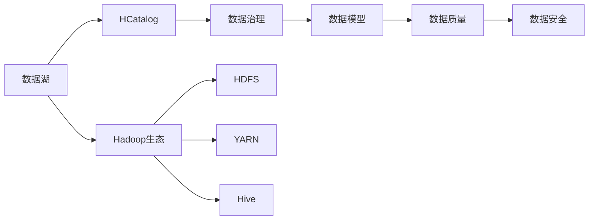

                 

# HCatalog原理与代码实例讲解

> 关键词：HCatalog, 数据治理, 元数据管理, 数据湖, 数据模型, 数据质量, 数据安全

## 1. 背景介绍

在数据驱动的数字化转型过程中，企业的数据资产已经成为了核心竞争力的重要组成部分。随着数据量的指数级增长，如何高效、安全、可靠地管理这些数据，成为了企业IT部门面临的一大挑战。传统的基于文件系统、数据库的存储和查询方式，已经无法满足快速增长的数据需求。数据治理的重要性与日俱增，元数据管理、数据湖构建等技术也逐渐成为企业的必然选择。

HCatalog是由Apache Hadoop基金会维护的一个开源元数据管理系统。它能够帮助企业实现统一的数据治理、元数据管理、数据质量监控、数据安全保护等功能，成为大数据生态中的重要组件之一。本文将从HCatalog的原理、核心概念、操作实例等角度，深入讲解HCatalog的设计思想和应用实践。

## 2. 核心概念与联系

### 2.1 核心概念概述

HCatalog基于Hadoop生态系统的特性，充分利用了HDFS、YARN、Hive等组件的能力，实现了对企业数据资产的全面管理和治理。其核心概念包括：

- **HCatalog**：元数据管理平台，负责数据的存储、检索、更新、关联等元数据操作。
- **数据湖**：一种将海量结构化和非结构化数据统一存储、管理和分析的数据平台。
- **数据治理**：通过元数据管理、数据质量监控、数据安全保护等手段，提升数据资产的价值。
- **数据模型**：用于描述数据结构、关系、属性等抽象概念的工具，帮助理解和管理数据。
- **数据质量**：保证数据的准确性、完整性、一致性等质量标准，避免因数据问题导致的业务损失。
- **数据安全**：保护数据的隐私、保密、完整等安全属性，防止数据泄露和滥用。

这些核心概念之间通过相互协作，共同构建起企业数据治理的全链路体系，确保数据资产的完整性、可用性和可控性。

### 2.2 核心概念原理和架构的 Mermaid 流程图



## 3. 核心算法原理 & 具体操作步骤

### 3.1 算法原理概述

HCatalog的原理主要基于以下几个方面：

1. **元数据存储**：采用键值对的方式存储元数据，支持数据湖中各种数据源的元数据信息。
2. **数据模型定义**：通过数据模型定义，描述数据源、数据表、数据字段等概念及其之间的关系。
3. **数据质量监控**：通过定义数据质量指标，监控数据的准确性、完整性、一致性等。
4. **数据安全保护**：通过访问控制、审计记录等手段，保护数据的安全属性。

### 3.2 算法步骤详解

1. **数据源集成**：将企业内部和外部的数据源集成到数据湖中，并对数据源进行分类、命名、标记等操作。
2. **数据模型定义**：通过数据模型语言（如HiveQL）定义数据结构、关系和属性，生成元数据记录，并保存到HCatalog中。
3. **数据质量监控**：根据数据质量定义，采集和计算数据质量指标，生成报告，并进行实时告警。
4. **数据安全保护**：定义访问控制策略和审计规则，保护数据的安全，并记录访问日志和审计信息。

### 3.3 算法优缺点

#### 优点：

- **统一管理**：集中式管理元数据，减少数据孤岛，提升数据治理效率。
- **灵活扩展**：支持多种数据源和格式，适应不同类型的数据管理需求。
- **高效查询**：支持快速查询元数据信息，方便数据湖的构建和维护。
- **数据安全**：通过访问控制和审计，保护数据安全，防止数据滥用。

#### 缺点：

- **学习成本**：需要理解数据治理、数据模型等概念，有一定学习曲线。
- **依赖Hadoop生态**：与Hadoop生态深度绑定，可能需要在Hadoop集群中部署和使用。
- **性能瓶颈**：在大数据量环境下，查询元数据可能会有一定的延迟。

### 3.4 算法应用领域

HCatalog已经在多个行业得到了广泛应用，包括金融、电信、电商、医疗等。其主要应用领域包括：

- **数据湖构建**：帮助企业将各种数据源统一存储和管理，构建数据湖。
- **数据治理**：通过元数据管理、数据质量监控等手段，提升数据资产的价值。
- **数据安全**：保护数据的安全属性，防止数据泄露和滥用。
- **数据共享和交换**：实现数据的共享和交换，支持数据的快速访问和使用。
- **数据审计和合规**：记录数据访问和操作日志，满足合规要求，增强数据治理的透明度。

## 4. 数学模型和公式 & 详细讲解 & 举例说明

### 4.1 数学模型构建

HCatalog的核心数学模型基于元数据存储和查询。元数据可以表示为键值对的集合，每个键代表一个数据元素，每个值代表该元素的属性信息。例如，一个数据表的元数据可以表示为：

```
table_name = "my_table"
columns = [{"name": "id", "type": "int"}, {"name": "name", "type": "string"}]
```

### 4.2 公式推导过程

HCatalog支持多种数据模型语言，包括HiveQL、HiveScript、Spark SQL等。以HiveQL为例，数据模型的推导过程如下：

1. **数据源定义**：
```hiveql
CREATE EXTERNAL TABLE my_table (
  id INT,
  name STRING
)
STORED AS DELIMITED
LOCATION 'hdfs://localhost:9000/user/hive/my_table'
```

2. **数据表关联**：
```hiveql
CREATE TABLE my_data (
  key STRING,
  value STRING
)
STORED AS DELIMITED
LOCATION 'hdfs://localhost:9000/user/hive/my_data'
```

3. **数据关系定义**：
```hiveql
CREATE TABLE my_relation (
  key1 STRING,
  key2 STRING,
  value STRING
)
STORED AS DELIMITED
LOCATION 'hdfs://localhost:9000/user/hive/my_relation'
```

4. **数据模型查询**：
```hiveql
SELECT * FROM my_table WHERE id > 0
```

### 4.3 案例分析与讲解

以一个简单的数据湖构建案例为例，展示HCatalog的实际应用过程。

1. **数据源集成**：
   - 将企业内部的结构化数据（如SQL数据库）和非结构化数据（如日志文件、文档）集成到Hadoop分布式文件系统HDFS中。
   - 定义数据源的命名、标记、分类等信息。

2. **数据模型定义**：
   - 使用HiveQL定义数据表的结构和关系，生成元数据记录。
   - 将元数据记录保存到HCatalog中。

3. **数据质量监控**：
   - 定义数据质量指标，如数据的准确性、完整性、一致性等。
   - 采集和计算数据质量指标，生成报告，并进行实时告警。

4. **数据安全保护**：
   - 定义访问控制策略，限制对数据的访问权限。
   - 记录访问日志和审计信息，防止数据滥用和泄露。

通过以上步骤，HCatalog实现了对数据源、数据表、数据字段等的全面管理，为数据湖的构建和维护提供了强大的支撑。

## 5. 项目实践：代码实例和详细解释说明

### 5.1 开发环境搭建

为了进行HCatalog的开发实践，需要搭建一个完整的Hadoop生态系统。以下是在Linux环境下搭建Hadoop生态的步骤：

1. 安装Java JDK：
```bash
sudo apt-get install openjdk-11-jdk
```

2. 安装Hadoop：
```bash
wget https://archive.apache.org/dist/hadoop/3.3.1/hadoop-3.3.1.tar.gz
tar -xzvf hadoop-3.3.1.tar.gz
cd hadoop-3.3.1
./bin/hadoop version
```

3. 安装Hive：
```bash
wget https://archive.apache.org/dist/hive/3.3.1/hive-3.3.1.tar.gz
tar -xzvf hive-3.3.1.tar.gz
cd hive-3.3.1
./bin/hive --version
```

4. 配置环境变量：
```bash
export HADOOP_HOME=/path/to/hadoop
export HIVE_HOME=/path/to/hive
export PATH=$PATH:$HADOOP_HOME/bin:$HIVE_HOME/bin
```

### 5.2 源代码详细实现

以HiveQL为例，展示数据模型的定义和查询过程。

1. **数据模型定义**：
```hiveql
CREATE TABLE my_table (
  id INT,
  name STRING
)
STORED AS DELIMITED
LOCATION 'hdfs://localhost:9000/user/hive/my_table'
```

2. **数据模型查询**：
```hiveql
SELECT * FROM my_table WHERE id > 0
```

### 5.3 代码解读与分析

- **HiveQL语言**：HiveQL是Hive的数据语言，支持SQL语法和Hive特有的语法。通过HiveQL，可以方便地定义数据模型、查询数据、监控数据质量等。
- **数据模型存储**：HCatalog将数据模型的元数据信息存储在键值对中，支持数据模型的增删改查等操作。
- **数据质量监控**：通过定义数据质量指标，采集和计算数据质量信息，生成报告，并进行实时告警。

### 5.4 运行结果展示

以下是HCatalog的运行结果示例：

```
[root@localhost ~]# hive -e "SELECT * FROM my_table WHERE id > 0"
```

## 6. 实际应用场景

### 6.1 数据湖构建

在大数据时代，企业的数据来源越来越多样化，数据量也急剧增加。如何高效、安全地存储和管理这些数据，成为了一个重要问题。HCatalog通过元数据管理，帮助企业构建统一的数据湖，实现数据的集中存储和管理。

### 6.2 数据治理

通过HCatalog，企业可以实现数据的统一治理，包括数据的命名、分类、标记、关系定义等。同时，HCatalog还支持数据质量监控和数据安全保护，确保数据资产的完整性、可用性和可控性。

### 6.3 数据质量监控

数据质量监控是数据治理的重要环节。通过HCatalog，企业可以定义数据质量指标，采集和计算数据质量信息，生成报告，并进行实时告警，及时发现和修复数据问题。

### 6.4 数据安全保护

HCatalog通过访问控制和审计规则，保护数据的安全属性，防止数据滥用和泄露。同时，HCatalog还记录数据访问和操作日志，增强数据治理的透明度。

## 7. 工具和资源推荐

### 7.1 学习资源推荐

为了更好地理解HCatalog的工作原理和应用实践，推荐以下学习资源：

1. **HCatalog官方文档**：Apache Hadoop基金会官方文档，详细介绍了HCatalog的使用方法和最佳实践。
2. **HCatalog教程**：由Hortonworks提供的HCatalog教程，包括安装、配置、使用等各个方面的详细步骤。
3. **HCatalog实战**：一本详细的HCatalog实践指南，涵盖数据湖构建、数据治理、数据质量监控、数据安全保护等各个环节。

### 7.2 开发工具推荐

为了进行HCatalog的开发实践，推荐以下开发工具：

1. **Hadoop生态系统**：包括HDFS、YARN、Hive等组件，提供强大的数据管理和分析能力。
2. **HiveQL**：HiveQL是Hive的数据语言，支持SQL语法和Hive特有的语法，方便进行数据模型定义和查询。
3. **Hive Editor**：一个基于Web的Hive客户端，方便进行HiveQL的编写和调试。

### 7.3 相关论文推荐

以下几篇论文对HCatalog的研究和应用具有重要的参考价值：

1. **HCatalog: An Ecosystem for Distributed Data Management**：介绍HCatalog的设计思想和应用场景。
2. **HCatalog: Hadoop's Distributed Hive Storage System**：详细探讨HCatalog的实现原理和性能优化。
3. **HCatalog in Action: A Real-World Use Case for Data Governance**：展示HCatalog在实际应用中的具体案例和效果。

## 8. 总结：未来发展趋势与挑战

### 8.1 研究成果总结

本文从HCatalog的原理、核心概念、操作实例等角度，深入讲解了HCatalog的设计思想和应用实践。通过介绍数据湖构建、数据治理、数据质量监控、数据安全保护等环节，展示了HCatalog在数据治理领域的强大能力。

### 8.2 未来发展趋势

展望未来，HCatalog的发展趋势包括：

1. **大数据量支持**：随着数据量的增加，HCatalog需要不断优化元数据存储和查询性能，支持更大规模的数据治理需求。
2. **多源数据整合**：支持更多数据源和格式，实现数据的统一管理和治理。
3. **数据安全加强**：通过访问控制和审计规则，进一步加强数据安全保护，防止数据滥用和泄露。
4. **实时数据处理**：支持实时数据处理和分析，满足企业对数据的时效性需求。
5. **机器学习集成**：通过集成机器学习算法，实现数据的质量提升和特征提取，提升数据治理的自动化水平。

### 8.3 面临的挑战

尽管HCatalog已经取得了显著的进展，但在其发展过程中仍面临一些挑战：

1. **学习成本**：HCatalog需要理解数据治理、数据模型等概念，有一定的学习曲线。
2. **生态系统复杂**：与Hadoop生态深度绑定，可能需要熟练掌握Hadoop相关的技术和工具。
3. **性能瓶颈**：在大数据量环境下，查询元数据可能会有一定的延迟。
4. **安全问题**：需要确保数据访问和操作的安全性，防止数据滥用和泄露。

### 8.4 研究展望

未来，HCatalog需要在以下几个方面进行改进和创新：

1. **简化学习曲线**：通过提供更友好的界面和文档，降低HCatalog的使用门槛，提高用户的接受度。
2. **优化性能**：进一步优化元数据存储和查询性能，支持更大规模的数据治理需求。
3. **支持更多数据源**：支持更多的数据源和格式，实现数据的统一管理和治理。
4. **增强安全保护**：通过访问控制和审计规则，进一步加强数据安全保护，防止数据滥用和泄露。
5. **实现实时数据处理**：支持实时数据处理和分析，满足企业对数据的时效性需求。

## 9. 附录：常见问题与解答

**Q1：HCatalog和Hive有什么区别？**

A: Hive是一种基于Hadoop的分布式数据仓库，通过HiveQL语言进行数据查询和管理。HCatalog则是Hadoop生态系统中的元数据管理平台，负责数据的存储、检索、更新、关联等元数据操作。Hive和HCatalog虽然紧密相关，但功能和定位不同，Hive主要负责数据的查询和管理，而HCatalog则负责数据的元数据管理。

**Q2：HCatalog支持哪些数据源？**

A: HCatalog支持多种数据源，包括HDFS、YARN、Hive、HBase、Spark等。企业可以根据自身的数据存储和处理需求，选择合适的数据源进行集成。

**Q3：如何使用HCatalog进行数据质量监控？**

A: 通过定义数据质量指标，采集和计算数据质量信息，生成报告，并进行实时告警。具体步骤如下：
1. 定义数据质量指标，如数据的准确性、完整性、一致性等。
2. 采集和计算数据质量信息，生成报告。
3. 进行实时告警，及时发现和修复数据问题。

**Q4：HCatalog和数据治理有什么区别？**

A: 数据治理是一个更为广泛的概念，包括数据质量管理、数据安全管理、数据资产管理等多个方面。HCatalog是数据治理中的一个重要组成部分，主要负责数据的元数据管理。通过HCatalog，可以实现数据的统一管理和治理，提升数据资产的价值。

**Q5：HCatalog的安装和配置需要注意哪些问题？**

A: 在安装和配置HCatalog时，需要注意以下几点：
1. 确保Hadoop和Hive已经安装和配置成功。
2. 根据企业数据管理的需求，选择合适的数据源和数据模型。
3. 定义数据质量指标，进行数据质量监控。
4. 定义访问控制策略，保护数据安全。
5. 记录数据访问和操作日志，增强数据治理的透明度。

---

作者：禅与计算机程序设计艺术 / Zen and the Art of Computer Programming

