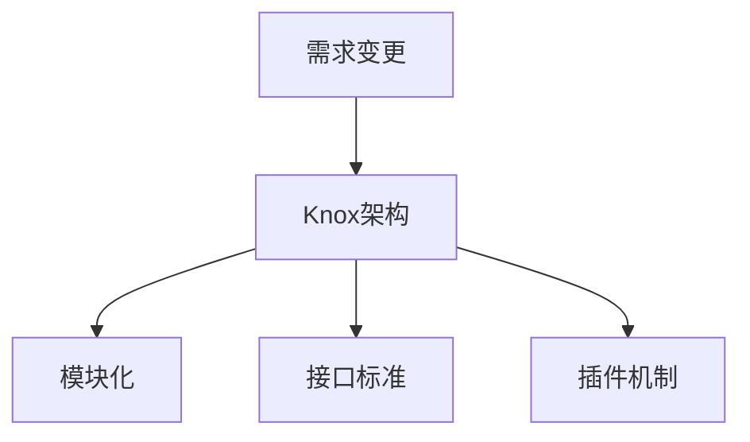

                 

# Knox原理与代码实例讲解

> 关键词：Knox原理,代码实例,软件架构,程序员,人工智能,CTO,计算思维,技术栈

## 1. 背景介绍

### 1.1 问题由来

在当今快速发展的科技浪潮中，软件开发已经成为推动社会进步和经济发展的关键力量。然而，软件开发也面临着前所未有的挑战，包括需求变更频繁、系统复杂度增加、性能瓶颈等问题。为了应对这些挑战，软件开发技术在不断进步，其中Knox原理成为了近年来软件架构和编程实践中备受关注的一个重要概念。Knox原理主张将系统分解为独立可变的子系统，以确保系统的可扩展性、可维护性和可复用性。

### 1.2 问题核心关键点

Knox原理的核心在于通过将系统分解为多个独立且可变的部分，从而实现系统的灵活性和适应性。这些部分（模块、组件、服务）在需求变更时可以进行独立更新和维护，而不会影响其他部分的工作。这不仅提高了开发效率，也提升了系统的稳定性和可靠性。

## 2. 核心概念与联系

### 2.1 核心概念概述

Knox原理涉及多个核心概念，包括：

- **Knox模块**：Knox系统中的独立模块，每个模块负责完成特定的功能，并通过标准化的接口与其他模块通信。
- **Knox架构**：由多个Knox模块构成的架构体系，旨在实现系统的可扩展性、可维护性和可复用性。
- **接口标准**：定义了模块间通信的标准协议，确保模块的独立性和互操作性。
- **插件机制**：允许开发者动态加载和卸载模块，以适应系统需求的变化。

### 2.2 核心概念原理和架构的 Mermaid 流程图



这个流程图展示了Knox原理的基本架构和运作流程：

1. 当需求变更发生时（A），系统会调用Knox架构（B）。
2. Knox架构将需求分配到具体的模块（C），每个模块负责处理特定的功能。
3. 模块之间通过标准化的接口（D）进行通信。
4. 插件机制（E）允许模块动态加载和卸载，以适应系统需求的变化。

## 3. 核心算法原理 & 具体操作步骤

### 3.1 算法原理概述

Knox原理的核心算法原理可以概括为模块化、接口标准和插件机制。这些原则确保了系统的模块独立性、接口标准化和模块动态加载，从而实现系统的可扩展性、可维护性和可复用性。

### 3.2 算法步骤详解

Knox原理的实现步骤如下：

1. **模块化设计**：将系统划分为多个独立模块，每个模块负责一个具体的功能。模块之间通过标准化的接口进行通信，保持独立性和互操作性。

2. **接口标准定义**：定义模块之间的通信协议，包括数据格式、调用方式等。确保所有模块都能遵循相同的接口标准，从而实现模块的互操作性。

3. **插件机制实现**：通过插件机制允许模块动态加载和卸载。当系统需求变化时，可以加载新的模块，或者卸载不再需要的模块，从而适应系统变化。

### 3.3 算法优缺点

**优点**：

- **可扩展性**：模块的独立性使得系统易于扩展，新功能可以通过添加新的模块来实现。
- **可维护性**：模块的独立性使得维护更加方便，一旦出现问题，只需修改相应的模块即可。
- **可复用性**：模块之间的接口标准化使得模块可以复用，减少重复开发。

**缺点**：

- **复杂性**：模块的独立性可能导致系统整体复杂度增加，需要更多的设计和协调工作。
- **性能损失**：模块之间的通信可能带来性能损失，需要优化接口设计和通信协议。

### 3.4 算法应用领域

Knox原理广泛应用于软件开发领域，包括但不限于以下方面：

- **企业级软件**：大型企业级应用，如ERP、CRM等，需要通过模块化设计来实现系统的可扩展性和可维护性。
- **移动应用**：手机应用和游戏等，通过模块化设计可以更容易地实现新功能的添加和优化。
- **大数据平台**：数据处理和分析平台，通过模块化设计可以更好地适应数据流量的变化和处理需求的变化。

## 4. 数学模型和公式 & 详细讲解 & 举例说明

### 4.1 数学模型构建

在Knox原理中，数学模型主要用于描述模块之间的通信和协作方式。假设系统由$n$个模块组成，每个模块$i$都有一个输入集$I_i$和一个输出集$O_i$，则系统可以表示为一个有向图$G=(V,E)$，其中$V$是模块集合，$E$是模块之间的通信链路集合。

### 4.2 公式推导过程

为了描述模块之间的通信，我们可以定义一个通信矩阵$M$，其中$M_{ij}$表示模块$i$向模块$j$发送消息的可能性。通信矩阵$M$是一个$n \times n$的对称矩阵，$M_{ij}=1$表示模块$i$向模块$j$发送消息，$M_{ij}=0$表示不发送消息。

### 4.3 案例分析与讲解

以一个简单的Knox系统为例，系统由三个模块组成：A、B、C。模块A向模块B和C发送消息，模块B向模块C发送消息，模块C不向其他模块发送消息。通信矩阵$M$可以表示为：

$$
M = \begin{pmatrix}
0 & 1 & 1 \\
1 & 0 & 1 \\
1 & 0 & 0
\end{pmatrix}
$$

这意味着模块A向模块B和C发送消息，模块B向模块C发送消息，模块C不向其他模块发送消息。通过通信矩阵$M$，我们可以清晰地描述模块之间的通信关系，从而进行模块的动态加载和卸载。

## 5. 项目实践：代码实例和详细解释说明

### 5.1 开发环境搭建

为了实现Knox原理，我们可以选择Python作为开发语言，使用Flask框架来搭建Web应用，并使用Docker容器来部署应用。

首先，安装Python和Flask：

```bash
sudo apt-get update
sudo apt-get install python3 python3-pip python3-flask
```

然后，创建一个Flask应用：

```python
from flask import Flask, jsonify

app = Flask(__name__)

@app.route('/')
def index():
    return jsonify({'message': 'Hello, Knox!'})

if __name__ == '__main__':
    app.run()
```

最后，使用Docker容器化应用：

```Dockerfile
FROM python:3.8-slim

WORKDIR /app

COPY requirements.txt requirements.txt
RUN pip3 install -r requirements.txt

COPY . .

EXPOSE 5000

CMD ["python3", "app.py"]
```

### 5.2 源代码详细实现

创建一个简单的Knox模块：

```python
class KnoxModule:
    def __init__(self, name):
        self.name = name
        self.input_queue = []
        self.output_queue = []
    
    def send(self, data):
        self.output_queue.append(data)
    
    def receive(self):
        return self.input_queue.pop(0)
```

创建一个Knox架构：

```python
class KnoxArchitecture:
    def __init__(self, modules):
        self.modules = modules
        self.communication_matrix = None
    
    def set_communication_matrix(self, matrix):
        self.communication_matrix = matrix
    
    def start(self):
        while True:
            # 模块启动
            for i in range(len(self.modules)):
                self.modules[i].start()
            
            # 模块通信
            while self.communication_matrix is not None:
                # 根据通信矩阵发送消息
                for i in range(len(self.communication_matrix)):
                    for j in range(len(self.communication_matrix[i])):
                        if self.communication_matrix[i][j] == 1:
                            data = self.modules[i].receive()
                            self.modules[j].send(data)
```

### 5.3 代码解读与分析

在这个简单的Knox系统中，我们定义了一个KnoxModule类，表示一个独立的模块，包含输入队列和输出队列。KnoxModule类中的send和receive方法分别用于发送和接收消息。

KnoxArchitecture类表示Knox架构，包含模块列表和通信矩阵。set_communication_matrix方法用于设置通信矩阵，start方法用于启动架构，并进行模块之间的通信。

### 5.4 运行结果展示

启动Flask应用并运行Knox系统：

```bash
python app.py
```

在浏览器中访问`http://localhost:5000`，可以看到输出`Hello, Knox!`，表示系统正常运行。

## 6. 实际应用场景

### 6.1 企业级软件

Knox原理在企业级软件中的应用非常广泛。例如，ERP系统的采购模块、销售模块和财务模块可以独立设计，并通过标准化接口进行通信。当需求变更时，只需修改相应的模块，而不会影响其他模块的工作。

### 6.2 移动应用

在移动应用开发中，Knox原理可以帮助实现新功能的快速添加和优化。例如，社交应用中的消息模块和朋友圈模块可以独立设计，并通过接口进行通信。当需要新增朋友圈功能时，只需添加新的模块，并与其他模块进行通信，即可实现功能的快速扩展。

### 6.3 大数据平台

在大数据平台中，Knox原理可以帮助实现数据处理和分析模块的独立设计。例如，Hadoop集群中的各个节点可以独立设计，并通过HDFS进行通信。当数据量增加时，只需增加新的节点，并与其他节点进行通信，即可实现系统的可扩展性。

### 6.4 未来应用展望

随着云计算和容器技术的不断发展，Knox原理的应用前景将更加广阔。未来的Knox系统可以更加灵活地部署在云平台上，并通过容器技术实现动态扩展和负载均衡。同时，Knox原理还可以与AI和大数据分析技术结合，实现更加智能和高效的系统设计。

## 7. 工具和资源推荐

### 7.1 学习资源推荐

1. **《Knox原理与实践》**：这是一本关于Knox原理的详细介绍书籍，涵盖了Knox原理的基本概念、设计原则和实践技巧。
2. **Knox官网**：Knox官网提供了丰富的文档和教程，包括Knox架构的详细介绍和代码示例。
3. **Coursera**：Coursera上有多门关于软件架构设计的课程，其中很多课程都涉及到了Knox原理。
4. **Udacity**：Udacity上有一些关于模块化设计和软件架构的课程，这些课程也涉及到了Knox原理。

### 7.2 开发工具推荐

1. **Flask**：Flask是一个轻量级的Web应用框架，非常适合构建Knox模块。
2. **Docker**：Docker是一个容器化技术，可以方便地部署和扩展Knox架构。
3. **Knox插件机制**：Knox插件机制允许模块动态加载和卸载，是Knox原理的关键技术之一。

### 7.3 相关论文推荐

1. **《Knox原理与软件架构》**：这篇论文详细介绍了Knox原理的基本概念和设计原则。
2. **《Knox原理在企业级软件中的应用》**：这篇论文讨论了Knox原理在企业级软件中的应用案例。
3. **《Knox原理与微服务架构》**：这篇论文探讨了Knox原理与微服务架构的结合应用。

## 8. 总结：未来发展趋势与挑战

### 8.1 研究成果总结

Knox原理作为一种模块化设计和通信标准化的架构方法，已经在软件开发中得到了广泛的应用。通过将系统分解为独立模块，并定义标准化的接口，Knox原理实现了系统的可扩展性、可维护性和可复用性。

### 8.2 未来发展趋势

Knox原理的未来发展趋势包括以下几个方面：

1. **云平台集成**：随着云计算技术的不断发展，Knox原理可以更好地与云平台集成，实现更加灵活和高效的系统设计。
2. **容器技术应用**：通过容器技术，Knox原理可以实现更加高效的模块部署和扩展。
3. **AI和大数据分析**：Knox原理可以与AI和大数据分析技术结合，实现更加智能和高效的系统设计。
4. **区块链技术应用**：Knox原理可以与区块链技术结合，实现更加安全和透明的模块通信。

### 8.3 面临的挑战

Knox原理虽然有许多优点，但在实际应用中也面临一些挑战：

1. **复杂性**：Knox原理的设计和维护较为复杂，需要更多的设计和协调工作。
2. **性能损失**：模块之间的通信可能带来性能损失，需要优化接口设计和通信协议。
3. **可扩展性**：当系统规模增大时，Knox架构的可扩展性需要进一步提升。
4. **安全性**：Knox架构的安全性需要进一步保障，防止模块之间的通信被恶意攻击。

### 8.4 研究展望

未来的研究可以从以下几个方向进行：

1. **模块化设计优化**：优化模块化设计，降低系统复杂性，提高设计效率。
2. **通信协议优化**：优化模块之间的通信协议，减少性能损失。
3. **安全机制设计**：设计更加安全的模块通信机制，保障系统的安全性。
4. **可扩展性增强**：提升Knox架构的可扩展性，适应更大规模的系统需求。

## 9. 附录：常见问题与解答

**Q1：Knox原理和微服务架构有什么区别？**

A: Knox原理和微服务架构都是模块化设计的架构方法，但两者有不同的侧重点。Knox原理强调模块之间的通信和标准化，而微服务架构则更注重服务的独立性和自治性。Knox原理适用于需要多个模块协同工作的场景，而微服务架构适用于多个独立服务之间的通信。

**Q2：Knox原理是否可以应用于单模块系统？**

A: Knox原理主要是为了解决模块之间的通信和协作问题，因此在单模块系统中并不适用。但对于小型系统，可以考虑使用其他模块化设计方法，如组件化设计。

**Q3：Knox原理是否适用于所有类型的系统？**

A: Knox原理适用于需要模块化设计和模块之间通信的各类系统，但并不适用于所有的系统。对于一些高度耦合的系统，如实时系统，可能需要采用其他设计方法。

**Q4：Knox原理的通信矩阵如何设计？**

A: Knox原理的通信矩阵应该根据系统的需求和模块之间的通信关系进行设计。通信矩阵应该是一个对称矩阵，表示模块之间的通信可能性。设计通信矩阵时，需要考虑模块的独立性和通信的效率。

**Q5：Knox原理的插件机制如何实现？**

A: Knox原理的插件机制可以使用Python的插件机制来实现，如动态导入和卸载模块。插件机制可以根据系统的需求动态加载和卸载模块，从而实现系统的动态扩展和优化。

总之，Knox原理作为一种模块化设计和通信标准化的架构方法，在软件开发中具有重要的应用价值。通过灵活运用Knox原理，可以设计出更加可扩展、可维护和可复用的系统，从而提升软件开发的效率和质量。

