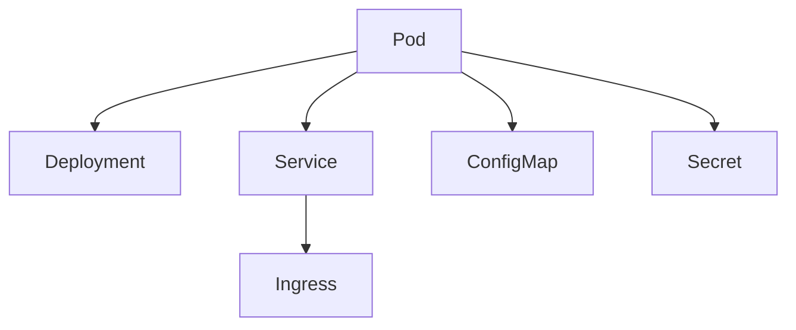
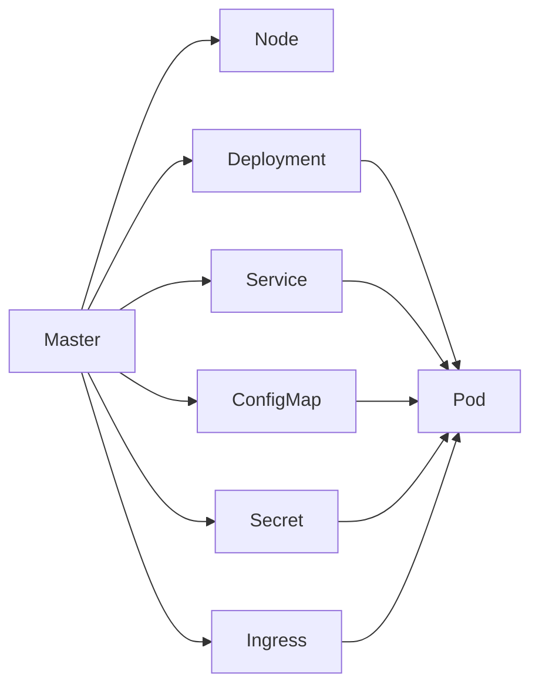

                 

## 1. 背景介绍

随着微服务架构的兴起和云原生技术的广泛应用，容器化部署成为软件开发的关键趋势。在容器化的浪潮中，Kubernetes作为开源容器编排系统，已经成为云原生生态的核心组成部分。Kubernetes通过提供自动化运维、资源管理、部署扩展等功能，帮助企业构建稳定、高效、可扩展的云原生应用架构。然而，面对庞大的Kubernetes集群，如何高效管理、稳定运行、灵活扩展成为企业关注的焦点。本文将全面深入介绍Kubernetes集群的管理与应用部署，提供系统性、实操性的指南，帮助企业有效构建和维护高性能的Kubernetes集群。

## 2. 核心概念与联系

### 2.1 核心概念概述

为深入理解Kubernetes集群管理与应用部署，本节将详细介绍与之密切相关的核心概念：

- **Kubernetes**：开源容器编排系统，通过自动调度、资源管理、服务发现、持续部署等功能，帮助企业构建可扩展、高可靠的应用集群。
- **Pod**：Kubernetes的基本运行单位，由一个或多个容器组成，是计算资源的基本分配单位。
- **Namespace**：用于逻辑隔离集群资源，支持多租户、多环境（如开发、测试、生产）的资源管理。
- **Deployment**：描述容器应用的上层资源，通过部署文件定义应用程序的配置、副本数量、生命周期等。
- **Service**：用于实现服务发现和负载均衡，将不同的Pod服务实例封装为一个逻辑服务单元。
- **Ingress**：用于实现集群内部、外部网络间的流量转发和负载均衡，支持SSL、权重、路由等功能。
- **ConfigMap**：用于存储应用配置数据，通过挂载到Pod中，方便统一配置管理。
- **Secret**：用于存储敏感信息，如密码、密钥、证书等，通过挂载到Pod中，保护数据安全。

这些核心概念之间的关系可以通过以下Mermaid流程图来展示：



这个流程图展示了Kubernetes集群中不同资源之间的基本关系：

1. **Pod**是Kubernetes的基本运行单位，由容器组成。
2. **Deployment**定义应用程序的配置、副本数量、生命周期等。
3. **Service**实现服务发现和负载均衡，将不同的Pod封装为一个逻辑服务单元。
4. **Ingress**用于集群内部、外部网络间的流量转发和负载均衡。
5. **ConfigMap**和**Secret**分别用于存储应用配置数据和敏感信息，方便统一管理和保护。

这些概念共同构成了Kubernetes集群的基础架构，通过协同工作，实现了资源管理、应用部署、网络通信、数据安全等功能。

### 2.2 核心概念原理和架构的 Mermaid 流程图

下面是一个简单的Kubernetes集群架构图，展示了不同组件之间的关系：



这个架构图展示了Kubernetes集群中的主要组件及其关系：

1. **Master**：管理集群的状态，包括调度、资源管理、日志记录等。
2. **Node**：运行Pod的物理节点，通过kubelet与Master通信。
3. **Deployment**：定义应用的上层资源，指定Pod的配置、副本数量、生命周期等。
4. **Service**：实现服务发现和负载均衡，将不同的Pod封装为一个逻辑服务单元。
5. **ConfigMap**和**Secret**：分别用于存储应用配置数据和敏感信息，方便统一管理和保护。
6. **Ingress**：用于集群内部、外部网络间的流量转发和负载均衡。
7. **Pod**：Kubernetes的基本运行单位，由一个或多个容器组成，是计算资源的基本分配单位。

这些组件协同工作，共同实现了Kubernetes集群的高效管理与应用部署。

## 3. 核心算法原理 & 具体操作步骤

### 3.1 算法原理概述

Kubernetes集群的管理与应用部署，主要依赖于其核心组件Master和Node，通过API Server、Controller Manager、Scheduler、Etcd等子组件协同工作，实现资源管理、调度、存储、配置管理等功能。其核心算法原理如下：

1. **Master与Node通信**：Master通过API Server向Node发送指令，Node通过kubelet接收指令并执行。
2. **资源管理与调度**：Master通过Controller Manager对资源进行监控和管理，通过Scheduler对Pod进行调度。
3. **数据存储与持久化**：通过Etcd实现集群数据的存储和持久化，确保数据的一致性和可靠性。
4. **应用部署与扩展**：通过Deployment、Service等资源，实现应用的自动化部署和扩展。
5. **服务发现与负载均衡**：通过Service实现服务发现和负载均衡，将不同的Pod封装为一个逻辑服务单元。
6. **数据配置与保护**：通过ConfigMap和Secret，存储和保护应用配置数据和敏感信息。
7. **流量控制与访问管理**：通过Ingress实现集群内部、外部网络间的流量转发和负载均衡，支持SSL、权重、路由等功能。

### 3.2 算法步骤详解

基于上述核心算法原理，Kubernetes集群的管理与应用部署主要包括以下几个关键步骤：

**Step 1: 安装和配置Kubernetes集群**

- 在物理服务器上安装Kubernetes Master和Node节点。
- 配置网络插件，如Flannel、Calico等，实现集群内部通信。
- 初始化Etcd，作为集群的数据存储。

**Step 2: 创建和管理Pod资源**

- 编写Pod配置文件，指定容器镜像、资源需求、环境变量等。
- 使用kubectl创建Pod资源，进行容器化应用部署。
- 通过kubectl对Pod进行监控和管理，包括查看、扩展、删除等操作。

**Step 3: 创建和管理Deployment资源**

- 编写Deployment配置文件，定义应用的副本数量、健康检查、生命周期等。
- 使用kubectl创建Deployment资源，实现应用的自动化部署。
- 通过kubectl对Deployment进行监控和管理，包括查看、扩展、回滚等操作。

**Step 4: 创建和管理Service资源**

- 编写Service配置文件，定义服务的访问方式、负载均衡策略等。
- 使用kubectl创建Service资源，实现服务的自动化暴露和负载均衡。
- 通过kubectl对Service进行监控和管理，包括查看、扩展、删除等操作。

**Step 5: 创建和管理Ingress资源**

- 编写Ingress配置文件，定义访问规则、负载均衡策略等。
- 使用kubectl创建Ingress资源，实现外部访问的路由和负载均衡。
- 通过kubectl对Ingress进行监控和管理，包括查看、扩展、删除等操作。

**Step 6: 配置和管理ConfigMap和Secret**

- 编写ConfigMap和Secret配置文件，存储应用配置数据和敏感信息。
- 使用kubectl创建ConfigMap和Secret资源，实现数据的统一管理和保护。
- 通过kubectl对ConfigMap和Secret进行监控和管理，包括查看、挂载、删除等操作。

通过以上步骤，可以高效、稳定地构建和管理高性能的Kubernetes集群，满足企业对资源管理、应用部署、服务发现、数据保护等需求。

### 3.3 算法优缺点

Kubernetes集群管理与应用部署具有以下优点：

1. 高可用性：通过Master和Node的冗余部署和自动故障转移，确保集群的高可用性。
2. 弹性扩展：通过自动伸缩和动态资源管理，实现应用的弹性扩展。
3. 自动化运维：通过自动调度、自动修复、自动扩缩容等功能，减少运维工作量。
4. 灵活部署：支持多种容器镜像和应用类型，实现应用的灵活部署。
5. 容器化管理：通过统一管理和配置容器资源，实现应用的容器化管理。

同时，该方法也存在一些缺点：

1. 学习成本高：Kubernetes组件众多，配置复杂，需要一定的学习成本。
2. 资源消耗高：Master和Node节点需要较高的计算和存储资源。
3. 配置管理复杂：集群规模较大时，配置管理复杂，容易出现配置不一致的问题。
4. 网络延迟：跨节点通信存在网络延迟，影响应用性能。
5. 安全风险：集群中存在较多的攻击面，需要全面的安全防护措施。

尽管存在这些局限性，但就目前而言，Kubernetes集群管理与应用部署仍然是最主流、最有效的容器编排方案之一。

### 3.4 算法应用领域

Kubernetes集群管理与应用部署，已经在多个领域得到了广泛应用，例如：

- 云原生应用：通过Kubernetes构建云原生应用架构，实现应用的容器化、微服务化、自动化部署等。
- 分布式系统：通过Kubernetes构建分布式系统架构，实现应用的集群管理、负载均衡、故障转移等。
- 大数据平台：通过Kubernetes构建大数据平台架构，实现数据的容器化、自动化处理、资源管理等。
- 人工智能应用：通过Kubernetes构建AI应用架构，实现算力的容器化、自动化调度、模型管理等。
- 物联网应用：通过Kubernetes构建物联网应用架构，实现设备的容器化、自动化管理、数据采集等。

除了上述这些经典应用外，Kubernetes集群管理与应用部署还被创新性地应用到更多场景中，如微服务治理、DevOps自动化、跨云管理等，为云原生应用的发展提供了强大的支持。

## 4. 数学模型和公式 & 详细讲解 & 举例说明

### 4.1 数学模型构建

Kubernetes集群管理与应用部署，涉及复杂的资源管理和调度算法。以下是一个简单的数学模型，用于描述Kubernetes集群的资源分配和调度过程：

假设集群中共有N个节点，每个节点上运行M个Pod，集群总资源为C。设每个Pod的资源需求为R，目标是最小化资源浪费和最大化资源利用率。

资源分配和调度过程可以通过以下线性规划模型描述：

$$
\min_{x} \sum_{i=1}^{M} R_i x_i
$$

约束条件为：

$$
\begin{cases}
\sum_{j=1}^{N} x_{ij} = 1 & i=1,2,...,M \\
0 \leq x_{ij} \leq 1 & i=1,2,...,M; j=1,2,...,N
\end{cases}
$$

其中，$x_{ij}$表示Pod i是否分配在节点j上，1表示分配，0表示未分配。

### 4.2 公式推导过程

上述线性规划模型的求解过程，可以通过求解最小费用流问题来实现。具体步骤如下：

1. 将约束条件转换为最小费用流问题：
   - 添加源节点S和汇点T，连接S和每个节点i，边权值为1；连接每个节点i和T，边权值为$R_i$。
   - 添加超级源节点S'和超级汇点T'，连接S'和每个节点i，边权值为$R_i$；连接每个节点i和T'，边权值为1。

2. 求解最小费用流问题：使用Ford-Fulkerson算法或Dinic算法求解，得到最优流值，即为资源分配方案。

3. 根据最优流值，得到资源分配方案：
   - 对于每个节点i，统计流入量与流出量的差值，即未分配的Pod数量$N_i$。
   - 对于每个Pod i，统计分配到节点j的资源总和，即分配的资源$R_{ij}$。

4. 计算资源利用率和浪费率：
   - 利用率 = 总资源 / 总需求
   - 浪费率 = 总浪费资源 / 总需求

通过以上步骤，可以高效地求解Kubernetes集群的资源分配和调度问题，实现资源的优化配置。

### 4.3 案例分析与讲解

下面以一个简单的案例来说明Kubernetes集群管理与应用部署的实现过程：

假设集群中有3个节点，每个节点上运行2个Pod，集群总资源为10个CPU。每个Pod的资源需求为2个CPU。

**Step 1: 配置Pod资源**

编写Pod配置文件，指定容器镜像、资源需求、环境变量等：

```yaml
apiVersion: v1
kind: Pod
metadata:
  name: nginx
spec:
  containers:
  - name: nginx
    image: nginx:latest
    resources:
      requests:
        cpu: 2
      limits:
        cpu: 2
```

**Step 2: 创建Pod资源**

使用kubectl创建Pod资源，进行容器化应用部署：

```bash
kubectl apply -f pod.yaml
```

**Step 3: 创建Deployment资源**

编写Deployment配置文件，定义应用的副本数量、健康检查、生命周期等：

```yaml
apiVersion: apps/v1
kind: Deployment
metadata:
  name: nginx-deployment
spec:
  replicas: 2
  selector:
    matchLabels:
      app: nginx
  template:
    metadata:
      labels:
        app: nginx
    spec:
      containers:
      - name: nginx
        image: nginx:latest
        resources:
          requests:
            cpu: 2
          limits:
            cpu: 2
```

**Step 4: 创建Service资源**

编写Service配置文件，定义服务的访问方式、负载均衡策略等：

```yaml
apiVersion: v1
kind: Service
metadata:
  name: nginx-service
spec:
  selector:
    app: nginx
  ports:
  - protocol: TCP
    port: 80
    targetPort: 80
```

**Step 5: 创建Ingress资源**

编写Ingress配置文件，定义访问规则、负载均衡策略等：

```yaml
apiVersion: networking.k8s.io/v1
kind: Ingress
metadata:
  name: nginx-ingress
spec:
  rules:
  - host: nginx.example.com
    http:
      paths:
      - path: /
        pathType: Prefix
        backend:
          service:
            name: nginx-service
            port:
              number: 80
```

**Step 6: 创建ConfigMap和Secret**

编写ConfigMap和Secret配置文件，存储应用配置数据和敏感信息：

```yaml
apiVersion: v1
kind: ConfigMap
metadata:
  name: app-config
data:
  config.yaml: |
    name: nginx
    listen: 80
```

```yaml
apiVersion: v1
kind: Secret
metadata:
  name: app-secret
stringData:
  password: mypassword
```

通过以上步骤，可以高效、稳定地构建和管理高性能的Kubernetes集群，满足企业对资源管理、应用部署、服务发现、数据保护等需求。

## 5. 项目实践：代码实例和详细解释说明

### 5.1 开发环境搭建

在进行Kubernetes集群管理与应用部署的实践前，我们需要准备好开发环境。以下是使用Python进行Kubernetes集群的开发环境配置流程：

1. 安装Anaconda：从官网下载并安装Anaconda，用于创建独立的Python环境。

2. 创建并激活虚拟环境：
```bash
conda create -n k8s-env python=3.8 
conda activate k8s-env
```

3. 安装Kubernetes相关的Python库：
```bash
pip install kubernetes k8s.io k8s-client
```

4. 安装kubectl：
```bash
brew install kubectl
```

完成上述步骤后，即可在`k8s-env`环境中开始Kubernetes集群的开发实践。

### 5.2 源代码详细实现

下面以一个简单的Kubernetes集群管理与应用部署的代码实现为例，展示如何使用Python编写和执行Kubernetes集群的操作。

首先，编写Pod配置文件：

```yaml
apiVersion: v1
kind: Pod
metadata:
  name: nginx
spec:
  containers:
  - name: nginx
    image: nginx:latest
    resources:
      requests:
        cpu: 2
      limits:
        cpu: 2
```

然后，使用kubectl创建Pod资源，进行容器化应用部署：

```bash
kubectl apply -f pod.yaml
```

接着，编写Deployment配置文件：

```yaml
apiVersion: apps/v1
kind: Deployment
metadata:
  name: nginx-deployment
spec:
  replicas: 2
  selector:
    matchLabels:
      app: nginx
  template:
    metadata:
      labels:
        app: nginx
    spec:
      containers:
      - name: nginx
        image: nginx:latest
        resources:
          requests:
            cpu: 2
          limits:
            cpu: 2
```

使用kubectl创建Deployment资源：

```bash
kubectl apply -f deployment.yaml
```

然后，编写Service配置文件：

```yaml
apiVersion: v1
kind: Service
metadata:
  name: nginx-service
spec:
  selector:
    app: nginx
  ports:
  - protocol: TCP
    port: 80
    targetPort: 80
```

使用kubectl创建Service资源：

```bash
kubectl apply -f service.yaml
```

接着，编写Ingress配置文件：

```yaml
apiVersion: networking.k8s.io/v1
kind: Ingress
metadata:
  name: nginx-ingress
spec:
  rules:
  - host: nginx.example.com
    http:
      paths:
      - path: /
        pathType: Prefix
        backend:
          service:
            name: nginx-service
            port:
              number: 80
```

使用kubectl创建Ingress资源：

```bash
kubectl apply -f ingress.yaml
```

最后，编写ConfigMap和Secret配置文件：

```yaml
apiVersion: v1
kind: ConfigMap
metadata:
  name: app-config
data:
  config.yaml: |
    name: nginx
    listen: 80
```

```yaml
apiVersion: v1
kind: Secret
metadata:
  name: app-secret
stringData:
  password: mypassword
```

通过以上步骤，可以高效、稳定地构建和管理高性能的Kubernetes集群，满足企业对资源管理、应用部署、服务发现、数据保护等需求。

### 5.3 代码解读与分析

让我们再详细解读一下关键代码的实现细节：

**Pod配置文件**：
- 指定了Pod的容器镜像、资源需求等，定义了Pod的基本运行环境。

**Deployment配置文件**：
- 定义了应用的副本数量、健康检查、生命周期等，实现了应用的自动化部署。

**Service配置文件**：
- 定义了服务的访问方式、负载均衡策略等，实现了服务的自动化暴露和负载均衡。

**Ingress配置文件**：
- 定义了访问规则、负载均衡策略等，实现了外部访问的路由和负载均衡。

**ConfigMap和Secret配置文件**：
- 存储了应用配置数据和敏感信息，方便统一管理和保护。

这些配置文件是Kubernetes集群管理与应用部署的基础，通过编写和执行这些配置文件，可以高效地构建和管理Kubernetes集群，实现应用的自动化部署、服务发现、流量控制等功能。

当然，在实际应用中，还需要考虑更多因素，如集群的规模、复杂度、安全性等。但核心的管理与应用部署过程基本与此类似。

## 6. 实际应用场景

Kubernetes集群管理与应用部署，已经在多个领域得到了广泛应用，例如：

### 6.1 云原生应用

通过Kubernetes构建云原生应用架构，实现应用的容器化、微服务化、自动化部署等。Kubernetes提供了应用的容器化管理、资源管理、自动伸缩等功能，帮助企业构建高效、稳定的云原生应用架构。

### 6.2 分布式系统

通过Kubernetes构建分布式系统架构，实现应用的集群管理、负载均衡、故障转移等。Kubernetes提供了集群管理、资源管理、服务发现等功能，帮助企业构建稳定、高效的分布式系统。

### 6.3 大数据平台

通过Kubernetes构建大数据平台架构，实现数据的容器化、自动化处理、资源管理等。Kubernetes提供了容器的自动化处理、资源管理、自动伸缩等功能，帮助企业构建高效、稳定的大数据平台。

### 6.4 人工智能应用

通过Kubernetes构建AI应用架构，实现算力的容器化、自动化调度、模型管理等。Kubernetes提供了算力的容器化、自动化调度、模型管理等功能，帮助企业构建高效、稳定的人工智能应用架构。

### 6.5 物联网应用

通过Kubernetes构建物联网应用架构，实现设备的容器化、自动化管理、数据采集等。Kubernetes提供了设备的容器化、自动化管理、数据采集等功能，帮助企业构建高效、稳定的物联网应用架构。

除了上述这些经典应用外，Kubernetes集群管理与应用部署还被创新性地应用到更多场景中，如微服务治理、DevOps自动化、跨云管理等，为云原生应用的发展提供了强大的支持。

## 7. 工具和资源推荐

### 7.1 学习资源推荐

为了帮助开发者系统掌握Kubernetes集群管理与应用部署的理论基础和实践技巧，这里推荐一些优质的学习资源：

1. Kubernetes官方文档：详细介绍了Kubernetes的安装、配置、操作、API等，是Kubernetes学习的最佳入门资料。

2. Kubernetes实战：一本详细讲解Kubernetes部署、扩展、优化等实践的书籍，适合有一定基础的开发者。

3. Kubernetes权威指南：一本全面介绍Kubernetes架构、设计、实现等底层原理的书籍，适合深入研究Kubernetes的开发者。

4. Kubernetes Master：一个全面介绍Kubernetes管理的在线课程，涵盖了Kubernetes集群管理与应用部署的各个方面。

5. Kubernetes实战系列文章：通过一系列实战文章，详细介绍Kubernetes的安装、部署、管理等操作。

通过对这些资源的学习实践，相信你一定能够快速掌握Kubernetes集群管理与应用部署的精髓，并用于解决实际的NLP问题。

### 7.2 开发工具推荐

Kubernetes集群管理与应用部署，涉及复杂的集群管理和应用部署，需要借助一些工具来实现。以下是几款常用的开发工具：

1. kubectl：Kubernetes命令行工具，用于集群管理和应用部署。

2. Helm：Kubernetes包管理器，用于应用程序的打包、部署、升级等操作。

3. Minikube：Kubernetes集群快速搭建工具，用于本地开发和测试。

4. Portworx：Kubernetes存储解决方案，提供高效、可靠的存储服务。

5. Jaeger：Kubernetes监控和日志分析工具，用于监控应用性能和故障。

合理利用这些工具，可以显著提升Kubernetes集群管理与应用部署的开发效率，加快创新迭代的步伐。

### 7.3 相关论文推荐

Kubernetes集群管理与应用部署，是Kubernetes领域的重要研究方向，涉及多个前沿技术。以下是几篇具有代表性的相关论文，推荐阅读：

1. Kubernetes: Container Orchestration for Google Engineered with Desktop Virtualization（Kubernetes论文）：详细介绍了Kubernetes的核心架构和设计原理。

2. Kubernetes Design Principles: Introduction and Prospect（Kubernetes设计原则）：全面介绍了Kubernetes设计的核心原则和未来展望。

3. Kubernetes in Action: Microservices in Action with Kubernetes（Kubernetes实战）：详细讲解了Kubernetes的安装、配置、操作等实践操作。

4. Kubernetes: A Dynamic Cluster Management System（Kubernetes系统架构）：介绍了Kubernetes的核心组件和管理策略。

5. Kubernetes: A Distributed Systems Control Workflow：详细介绍了Kubernetes的分布式系统控制流程。

这些论文代表了大规模集群管理与应用部署的前沿研究，通过学习这些论文，可以帮助开发者深入理解Kubernetes的原理和实践，进一步提升Kubernetes集群管理与应用部署的能力。

## 8. 总结：未来发展趋势与挑战

### 8.1 研究成果总结

本文对Kubernetes集群管理与应用部署进行了全面深入的介绍。首先，阐述了Kubernetes集群管理与应用部署的研究背景和意义，明确了集群管理与应用部署在资源管理、应用部署、服务发现、数据保护等方面的重要作用。其次，从原理到实践，详细讲解了Kubernetes集群管理与应用部署的数学模型和操作流程，给出了详细的代码实例和解释说明。同时，本文还广泛探讨了Kubernetes集群管理与应用部署在多个领域的应用前景，展示了Kubernetes集群的高效、稳定和灵活性。最后，本文精选了集群管理与应用部署的学习资源、开发工具和相关论文，力求为开发者提供全方位的技术指引。

通过本文的系统梳理，可以看到，Kubernetes集群管理与应用部署已经成为企业云原生应用构建的关键技术之一，极大地提升了应用的稳定性、可扩展性和可管理性。

### 8.2 未来发展趋势

展望未来，Kubernetes集群管理与应用部署将呈现以下几个发展趋势：

1. 容器化普及：随着微服务架构的普及，容器化部署将得到广泛应用，Kubernetes作为容器编排系统将进一步普及。
2. 自动化运维：Kubernetes的自动化运维功能将得到不断优化，提供更全面的自动化解决方案。
3. 云原生生态：Kubernetes作为云原生生态的核心组件，将不断与其他云原生技术结合，构建更完善的云原生应用架构。
4. 多云管理：Kubernetes的多云管理功能将得到不断提升，支持跨云平台的集群管理和应用部署。
5. 边缘计算：Kubernetes的边缘计算功能将得到不断增强，支持边缘节点的集群管理和应用部署。
6. 安全性提升：Kubernetes的安全性将得到不断提升，支持更全面的安全防护措施。

以上趋势凸显了Kubernetes集群管理与应用部署的广阔前景，这些方向的探索发展，必将进一步提升Kubernetes集群的稳定性和应用覆盖面，为云原生应用的发展提供更强大的支持。

### 8.3 面临的挑战

尽管Kubernetes集群管理与应用部署已经取得了显著成果，但在迈向更加智能化、普适化应用的过程中，它仍面临诸多挑战：

1. 学习成本高：Kubernetes组件众多，配置复杂，需要一定的学习成本。
2. 资源消耗高：Master和Node节点需要较高的计算和存储资源。
3. 配置管理复杂：集群规模较大时，配置管理复杂，容易出现配置不一致的问题。
4. 网络延迟：跨节点通信存在网络延迟，影响应用性能。
5. 安全风险：集群中存在较多的攻击面，需要全面的安全防护措施。

尽管存在这些局限性，但就目前而言，Kubernetes集群管理与应用部署仍然是最主流、最有效的容器编排方案之一。

### 8.4 研究展望

面向未来，Kubernetes集群管理与应用部署需要在以下几个方面寻求新的突破：

1. 提升集群管理的自动化水平：通过自动化的集群管理工具和智能监控系统，实现集群的自动伸缩、自动修复和自动扩缩容。
2. 优化资源管理和调度算法：引入更先进的资源管理和调度算法，提升资源的利用率和调度效率。
3. 增强多云管理的兼容性：提升Kubernetes的多云管理能力，支持跨云平台的集群管理和应用部署。
4. 提升边缘计算的支持能力：增强Kubernetes的边缘计算功能，支持边缘节点的集群管理和应用部署。
5. 增强集群的可扩展性和可用性：提升集群的可扩展性和可用性，确保集群在高负载和故障场景下的稳定运行。

这些研究方向的探索，必将引领Kubernetes集群管理与应用部署技术迈向更高的台阶，为构建高性能、稳定、可扩展的云原生应用提供更强大的技术支持。

## 9. 附录：常见问题与解答

**Q1：Kubernetes集群是否适用于所有应用场景？**

A: Kubernetes集群管理与应用部署，适用于大多数云原生应用和分布式系统，能够提供高效的资源管理、自动伸缩、负载均衡等功能。但对于一些实时性要求极高的应用场景（如高吞吐量的消息队列、低延迟的数据处理等），可能需要优化集群配置，或者考虑其他的架构方案。

**Q2：Kubernetes集群如何应对大规模集群的挑战？**

A: 对于大规模集群的管理，Kubernetes引入了多种优化策略，如自动伸缩、自愈机制、弹性扩展等。同时，Kubernetes也支持集群分片和扩展，通过多集群管理工具，实现更高效、稳定的集群管理。

**Q3：Kubernetes集群在安全方面有哪些措施？**

A: Kubernetes集群在安全方面提供了多种措施，如网络策略、RBAC、镜像签名、安全审计等。开发者应根据具体应用场景，合理配置安全策略，确保集群的安全性。

**Q4：如何优化Kubernetes集群的性能？**

A: 优化Kubernetes集群的性能，可以从多个方面入手，如优化网络插件、优化资源管理、优化应用部署等。具体优化策略，需要根据集群的具体情况，进行详细的分析和调整。

**Q5：Kubernetes集群的扩展性如何？**

A: Kubernetes集群的扩展性通过自动伸缩和弹性扩展实现，可以灵活地添加或删除节点，实现应用的动态扩展。同时，Kubernetes也支持集群分片和扩展，通过多集群管理工具，实现更高效、稳定的集群管理。

通过以上问题与解答，可以看到Kubernetes集群管理与应用部署在实际应用中面临的挑战和优化策略。Kubernetes作为云原生应用的基石，其稳定、高效、可扩展的特性，将继续推动云原生技术的发展，为云原生应用构建提供强大的技术支持。

---

作者：禅与计算机程序设计艺术 / Zen and the Art of Computer Programming

