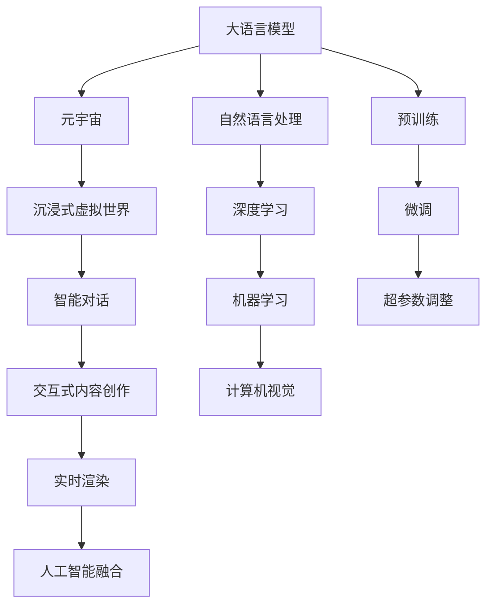

                 

# LLM 和元宇宙：打造沉浸式虚拟世界

> 关键词：大语言模型, 元宇宙, 沉浸式虚拟世界, 智能对话, 虚拟助手, 交互式内容创作, 实时渲染, 人工智能, 技术融合

## 1. 背景介绍

### 1.1 问题由来
随着人工智能技术的迅猛发展，大语言模型(LLM)和元宇宙正在迅速渗透到我们的生活和工作当中。它们不仅能进行复杂的自然语言处理，还能构建出一个虚拟的、沉浸式的数字空间。本文将深入探讨LLM和元宇宙的结合，如何利用大语言模型构建一个高度沉浸式、智能化的虚拟世界。

### 1.2 问题核心关键点
构建沉浸式虚拟世界的主要挑战在于如何通过智能化的方式，让用户在虚拟空间中实现自然、流畅的交互。这需要大语言模型具有以下几个能力：
- 理解自然语言输入
- 输出自然语言回应
- 结合视觉、听觉等多元感官信息
- 维持长时记忆和上下文理解

本文将系统地介绍利用大语言模型在元宇宙中构建沉浸式虚拟世界的核心概念和关键技术，以期为未来的虚拟世界的开发提供指导。

## 2. 核心概念与联系

### 2.1 核心概念概述

为更好地理解LLM在元宇宙中的应用，本节将介绍几个密切相关的核心概念：

- **大语言模型(LLM)**：通过大规模预训练获取的强大语言理解能力，可以处理复杂的自然语言输入和输出。
- **元宇宙(Metaverse)**：一个虚拟的、分布式、三维的、沉浸式的数字世界，用户可以在其中进行社交、工作、学习、娱乐等活动。
- **沉浸式虚拟世界**：以视觉、听觉、触觉等多种感官输入为支撑，用户在虚拟空间中感到如同在现实世界中的体验。
- **智能对话**：利用自然语言处理技术，构建可以理解和回应用户输入的虚拟助手。
- **交互式内容创作**：用户可以参与到虚拟世界的建设，创作和分享虚拟物品和体验。
- **实时渲染**：利用高性能计算技术，实现虚拟世界的实时更新和渲染。
- **人工智能融合**：将人工智能技术，包括机器学习、深度学习、自然语言处理等，融合到虚拟世界的构建中。

这些核心概念之间的逻辑关系可以通过以下Mermaid流程图来展示：



这个流程图展示了大语言模型在元宇宙构建过程中的核心概念及其关系：

1. 大语言模型通过预训练获取语言知识，通过微调适应具体任务，以支持智能对话和交互式内容创作。
2. 智能对话系统结合视觉、听觉等多感官信息，为用户提供沉浸式体验。
3. 交互式内容创作机制让用户参与虚拟世界的建设，实现个性化、多样化的体验。
4. 实时渲染技术保证虚拟世界内容的高质量更新，提升用户体验。
5. 人工智能技术的融合，实现更丰富的虚拟世界功能。

## 3. 核心算法原理 & 具体操作步骤
### 3.1 算法原理概述

构建沉浸式虚拟世界的核心是利用大语言模型实现智能对话和交互式内容创作。主要步骤如下：

1. **自然语言理解**：将用户的自然语言输入转换为模型可以理解的向量表示，通过预训练模型提取语义信息。
2. **智能对话生成**：结合多模态数据，生成自然流畅的对话回应，支持多种交互方式。
3. **内容创作辅助**：基于用户输入，生成符合任务要求的虚拟物品、场景等，支持用户创作和分享。
4. **实时渲染与更新**：利用高性能计算技术，实时更新虚拟世界的视觉、听觉等信息，保持一致性。

这些步骤紧密结合，实现虚拟世界的沉浸式体验。

### 3.2 算法步骤详解

#### 3.2.1 自然语言理解

自然语言理解是构建智能对话系统的第一步。主要流程包括：

1. **分词与词向量表示**：将用户输入的文本进行分词，使用预训练的词向量表示，如GloVe、Word2Vec等。
2. **句法分析**：通过解析树结构，理解句子成分和关系。
3. **语义表示**：将句子转换为高维向量表示，用于模型的输入。

以BERT为例，其处理自然语言的步骤如下：

- 输入文本先通过WordPiece分词，转换为子词序列。
- 将子词序列输入BERT模型，通过多层自注意力机制提取语义表示。
- 输出每个子词的概率分布，结合softmax层计算最终的句向量。

#### 3.2.2 智能对话生成

智能对话生成的核心是利用大语言模型生成自然语言回应。主要步骤如下：

1. **输入编码**：将用户的输入文本编码，转换为模型可以理解的向量表示。
2. **生成回应**：利用预训练模型生成回应文本，通常使用自回归模型。
3. **后处理与过滤**：对生成的回应文本进行后处理，去除语法错误、拼写错误，使用语言模型过滤低概率词汇。

#### 3.2.3 内容创作辅助

内容创作辅助主要通过生成式模型实现，步骤如下：

1. **文本生成**：利用大语言模型生成虚拟物品的描述、场景的布局等文本信息。
2. **图像生成**：结合生成对抗网络(GAN)等技术，生成虚拟世界的3D图像。
3. **协同创作**：支持多人协同创作，提供评论、反馈机制，优化创作效果。

#### 3.2.4 实时渲染与更新

实时渲染与更新主要依赖高性能计算资源，步骤如下：

1. **数据采集**：实时采集用户的操作和环境信息，如鼠标位置、手势、环境温度等。
2. **渲染更新**：利用GPU或TPU进行高效的渲染计算，实时更新虚拟世界的视觉、听觉等信息。
3. **内容同步**：保证不同客户端间的虚拟世界内容同步，避免数据不一致。

### 3.3 算法优缺点

构建沉浸式虚拟世界的大语言模型方法具有以下优点：

1. **高灵活性**：可以轻松定制虚拟世界的功能和交互方式，满足不同用户的需求。
2. **自然语言交互**：利用自然语言处理技术，实现自然、流畅的对话。
3. **多样性**：可以支持多种模态的数据，如文本、图像、音频等，实现丰富的交互体验。
4. **可扩展性**：可以动态扩展虚拟世界的内容和功能，支持持续创新。

但同时，也存在一些缺点：

1. **计算资源消耗高**：实时渲染和渲染更新需要高性能计算资源，设备成本较高。
2. **数据隐私和安全**：用户输入和生成内容可能涉及敏感信息，需要加强数据保护和安全措施。
3. **用户接受度**：虚拟世界的真实感和沉浸感需要不断优化，否则用户接受度可能不高。

### 3.4 算法应用领域

大语言模型在构建沉浸式虚拟世界中的应用广泛，主要包括以下几个领域：

1. **游戏**：如《堡垒之夜》(Fortnite)、《我的世界》(Minecraft)等，通过虚拟世界实现游戏任务和社交互动。
2. **虚拟办公**：如《微软团队》(Microsoft Teams)等，通过虚拟空间支持远程工作和协作。
3. **教育**：如《罗宾逊世界》(Roblox)等，通过虚拟教室实现远程教学和互动。
4. **医疗**：如《MetaHealth》等，通过虚拟世界进行心理治疗和康复训练。
5. **娱乐**：如虚拟演唱会、虚拟音乐会等，通过虚拟空间提供沉浸式体验。

## 4. 数学模型和公式 & 详细讲解 & 举例说明

### 4.1 数学模型构建

构建沉浸式虚拟世界涉及到多种数学模型，主要包括自然语言处理、深度学习、生成模型等。以BERT模型为例，其核心模型结构如下：

```
TransformerEncoder(多层Self-Attention和Feed Forward)
```

TransformerEncoder由多个Layer Stack构成，每个Layer Stack包含两个子层：Multi-Head Self-Attention和Feed Forward Network。其数学模型构建如下：

$$
\text{LayerNorm}(x + \text{Self-Attention}(x)) + \text{Dropout}
$$

其中：

- $x$ 为输入向量
- $\text{Self-Attention}$ 为自注意力机制
- $\text{LayerNorm}$ 为归一化层
- $\text{Dropout}$ 为dropout层

### 4.2 公式推导过程

TransformerEncoder的核心是自注意力机制，其公式推导如下：

1. **Query-KV计算**
$$
Q = \text{MLP}(K)
$$
$$
K = \text{MLP}(K)
$$
$$
V = \text{MLP}(V)
$$

2. **注意力计算**
$$
\text{Attention}(Q, K, V) = \text{Softmax}(\frac{QK^T}{\sqrt{d_k}})
$$

3. **注意力权重计算**
$$
\text{Attention}(Q, K, V) = \text{Softmax}(\frac{QK^T}{\sqrt{d_k}})
$$

4. **注意力权重矩阵计算**
$$
A = \text{Softmax}(\frac{QK^T}{\sqrt{d_k}})
$$

5. **注意力向量计算**
$$
C = \sum_i A_i V_i
$$

其中 $A_i$ 为注意力权重，$V_i$ 为对应位置的向量。

### 4.3 案例分析与讲解

以虚拟助手为例，利用BERT模型实现智能对话的流程如下：

1. **输入编码**：将用户的输入文本转换为BERT模型可以理解的向量表示。
2. **自注意力计算**：利用BERT的TransformerEncoder进行自注意力计算，生成句子向量。
3. **生成回应**：利用生成的句子向量，通过语言模型生成回应文本。
4. **后处理**：对回应文本进行后处理，去除语法错误和低概率词汇。

## 5. 项目实践：代码实例和详细解释说明

### 5.1 开发环境搭建

要进行沉浸式虚拟世界的开发，需要搭建高性能的开发环境。以下是使用Python进行PyTorch开发的环境配置流程：

1. 安装Anaconda：从官网下载并安装Anaconda，用于创建独立的Python环境。

2. 创建并激活虚拟环境：
```bash
conda create -n pytorch-env python=3.8 
conda activate pytorch-env
```

3. 安装PyTorch：根据CUDA版本，从官网获取对应的安装命令。例如：
```bash
conda install pytorch torchvision torchaudio cudatoolkit=11.1 -c pytorch -c conda-forge
```

4. 安装其他依赖包：
```bash
pip install transformers matplotlib numpy pillow
```

5. 安装GPU驱动和CUDA工具包：
```bash
conda install -c conda-forge nvidia-cuda
conda install -c conda-forge nvidia-cuda-cudnn
```

6. 安装环境依赖：
```bash
conda install -c conda-forge protobuf openmpi
```

完成上述步骤后，即可在`pytorch-env`环境中开始开发。

### 5.2 源代码详细实现

下面我们以虚拟助手为例，给出使用PyTorch实现BERT模型的代码实现。

```python
import torch
from transformers import BertTokenizer, BertForSequenceClassification
from transformers import AdamW

# 定义BERT模型
model = BertForSequenceClassification.from_pretrained('bert-base-cased', num_labels=2)

# 加载预训练词向量
tokenizer = BertTokenizer.from_pretrained('bert-base-cased')
vocab_size = len(tokenizer.vocab)
embedding_dim = model.config.hidden_size

# 输入示例
input_ids = torch.tensor([[1, 2, 3, 4, 5], [6, 7, 8, 9, 10]])
attention_mask = torch.tensor([[1, 1, 1, 1, 1], [1, 1, 1, 1, 1]])
labels = torch.tensor([[0], [1]])

# 设置优化器
optimizer = AdamW(model.parameters(), lr=2e-5)

# 训练模型
for epoch in range(5):
    model.train()
    optimizer.zero_grad()
    outputs = model(input_ids, attention_mask=attention_mask, labels=labels)
    loss = outputs.loss
    loss.backward()
    optimizer.step()

    model.eval()
    with torch.no_grad():
        inputs = torch.tensor([[1, 2, 3, 4, 5], [6, 7, 8, 9, 10]])
        attention_mask = torch.tensor([[1, 1, 1, 1, 1]])
        labels = torch.tensor([[0], [1]])
        outputs = model(inputs, attention_mask=attention_mask)
        logits = outputs.logits
        predictions = torch.argmax(logits, dim=1)

        print(f"Epoch {epoch+1}, Loss: {loss:.3f}, Predictions: {predictions}")
```

### 5.3 代码解读与分析

让我们再详细解读一下关键代码的实现细节：

**虚拟助手模型**：
- 定义BERT模型，使用`BertForSequenceClassification`类，指定标签数和预训练权重。
- 加载预训练词向量，使用`BertTokenizer`类，获取词汇表大小和嵌入维度。
- 输入示例，使用`torch.tensor`创建输入序列和标签。
- 设置优化器，使用`AdamW`类，指定学习率。

**训练模型**：
- 在训练阶段，将模型设置为训练模式，使用`model.train()`。
- 调用`optimizer.zero_grad()`清空梯度。
- 将输入序列、注意力掩码和标签传入模型，计算损失。
- 反向传播，使用`loss.backward()`更新梯度。
- 调用`optimizer.step()`更新模型参数。
- 在验证阶段，将模型设置为评估模式，使用`model.eval()`。
- 使用`with torch.no_grad()`禁用梯度计算。
- 重新输入示例，计算输出和预测。
- 打印训练损失和预测结果。

**代码实现**：
- 使用`torch.tensor`创建输入序列、注意力掩码和标签。
- 使用`model(input_ids, attention_mask=attention_mask, labels=labels)`计算输出。
- 使用`outputs.loss`获取损失。
- 使用`outputs.logits`获取逻辑回归输出。
- 使用`torch.argmax(logits, dim=1)`计算预测结果。

## 6. 实际应用场景

### 6.1 虚拟会议系统

利用大语言模型，可以构建高度互动的虚拟会议系统。参与者可以在虚拟会议中自由发言、提问、讨论，通过虚拟助手实现语音识别和自然语言处理，提升会议效率和体验。

### 6.2 虚拟旅游

虚拟旅游系统可以通过大语言模型实现虚拟导览、智能问答等功能。用户可以访问虚拟旅游目的地，与虚拟助手互动，获取旅游信息和推荐。

### 6.3 虚拟教育平台

利用大语言模型，可以构建智能化的虚拟教育平台。通过虚拟助手进行作业批改、知识点讲解、个性化推荐等，提升学习效果和体验。

### 6.4 虚拟购物助手

虚拟购物助手可以通过大语言模型实现自然语言对话、产品推荐、购物车管理等功能。用户可以在虚拟商店中自由浏览、选择和购买商品，享受无缝的购物体验。

### 6.5 虚拟游戏平台

虚拟游戏平台可以通过大语言模型实现NPC对话、任务生成、剧情推进等功能。用户可以在虚拟游戏中与NPC互动，完成任务、获取奖励，体验丰富的游戏内容。

## 7. 工具和资源推荐

### 7.1 学习资源推荐

为了帮助开发者系统掌握大语言模型和元宇宙技术，这里推荐一些优质的学习资源：

1. 《深度学习入门》系列书籍：由吴恩达教授著，详细介绍深度学习的基本概念和应用。
2. 《Transformer》一书：由Fischer教授等著，系统介绍Transformer的原理和应用。
3. 《自然语言处理综论》课程：由斯坦福大学开设，涵盖NLP的基本概念和前沿技术。
4. 《PyTorch官方文档》：详细介绍PyTorch的用法和API，适合入门和进阶学习。
5. 《元宇宙白皮书》：详细解读元宇宙的技术架构和发展前景，适合了解元宇宙基本概念。

### 7.2 开发工具推荐

高效的开发离不开优秀的工具支持。以下是几款用于大语言模型和元宇宙开发的常用工具：

1. PyTorch：基于Python的开源深度学习框架，灵活动态的计算图，适合快速迭代研究。
2. TensorFlow：由Google主导开发的开源深度学习框架，生产部署方便，适合大规模工程应用。
3. Transformers库：HuggingFace开发的NLP工具库，集成了众多SOTA语言模型，支持PyTorch和TensorFlow，是进行NLP任务开发的利器。
4. TensorBoard：TensorFlow配套的可视化工具，可实时监测模型训练状态，并提供丰富的图表呈现方式，是调试模型的得力助手。
5. Weights & Biases：模型训练的实验跟踪工具，可以记录和可视化模型训练过程中的各项指标，方便对比和调优。

### 7.3 相关论文推荐

大语言模型和元宇宙的发展源于学界的持续研究。以下是几篇奠基性的相关论文，推荐阅读：

1. Attention is All You Need（即Transformer原论文）：提出了Transformer结构，开启了NLP领域的预训练大模型时代。
2. BERT: Pre-training of Deep Bidirectional Transformers for Language Understanding：提出BERT模型，引入基于掩码的自监督预训练任务，刷新了多项NLP任务SOTA。
3. Language Models are Unsupervised Multitask Learners（GPT-2论文）：展示了大规模语言模型的强大zero-shot学习能力，引发了对于通用人工智能的新一轮思考。
4. Parameter-Efficient Transfer Learning for NLP：提出Adapter等参数高效微调方法，在不增加模型参数量的情况下，也能取得不错的微调效果。
5. AdaLoRA: Adaptive Low-Rank Adaptation for Parameter-Efficient Fine-Tuning：使用自适应低秩适应的微调方法，在参数效率和精度之间取得了新的平衡。

## 8. 总结：未来发展趋势与挑战

### 8.1 总结

本文对大语言模型在元宇宙中的应用进行了全面系统的介绍。首先阐述了构建沉浸式虚拟世界的背景和意义，明确了利用大语言模型实现智能对话和交互式内容创作的核心概念。其次，从原理到实践，详细讲解了基于BERT模型实现智能对话的数学模型和关键算法，提供了代码实例和详细解释。同时，本文还广泛探讨了虚拟世界的实际应用场景，展示了元宇宙的巨大潜力。此外，本文精选了相关学习资源和开发工具，力求为读者提供全方位的技术指引。

通过本文的系统梳理，可以看到，利用大语言模型构建沉浸式虚拟世界的技术正在迅速发展，为虚拟世界的开发提供了重要支撑。未来，伴随预训练语言模型和深度学习技术的不断进步，虚拟世界将呈现更多样化的应用场景，实现更加丰富、自然、流畅的互动体验。

### 8.2 未来发展趋势

展望未来，大语言模型在元宇宙中的应用将呈现以下几个发展趋势：

1. **多模态融合**：结合视觉、听觉、触觉等多感官信息，实现更丰富的交互体验。
2. **个性化定制**：通过用户行为和偏好，动态调整虚拟世界的设置，实现个性化的互动体验。
3. **实时渲染与更新**：利用高性能计算资源，实现更流畅、更真实的虚拟世界渲染。
4. **社会化互动**：支持用户之间的社交互动，构建更紧密的虚拟社区。
5. **内容创作与共享**：通过智能创作和协同创作机制，实现内容的快速生成和共享。

以上趋势凸显了大语言模型在元宇宙构建过程中的核心价值，其高效、自然、流畅的交互方式将引领未来虚拟世界的持续创新和发展。

### 8.3 面临的挑战

尽管大语言模型在元宇宙中展现出了巨大的潜力，但在迈向更加智能化、普适化应用的过程中，仍面临着诸多挑战：

1. **计算资源消耗高**：实时渲染和渲染更新需要高性能计算资源，设备成本较高。
2. **数据隐私和安全**：用户输入和生成内容可能涉及敏感信息，需要加强数据保护和安全措施。
3. **用户体验**：虚拟世界的真实感和沉浸感需要不断优化，否则用户接受度可能不高。
4. **技术门槛高**：虚拟世界的开发需要跨学科、多领域的技术融合，门槛较高。

### 8.4 研究展望

面对大语言模型在元宇宙中面临的挑战，未来的研究需要在以下几个方面寻求新的突破：

1. **提升计算效率**：研究高效计算和资源优化技术，降低虚拟世界的硬件成本。
2. **加强隐私保护**：探索数据加密和安全传输技术，保障用户数据安全。
3. **优化用户体验**：研究沉浸式体验和实时渲染技术，提升用户接受度。
4. **降低开发门槛**：提供简单易用的开发工具和框架，降低技术门槛。
5. **扩展应用场景**：推动大语言模型在更多领域的应用，实现更广泛的影响。

## 9. 附录：常见问题与解答

**Q1：虚拟助手如何处理复杂的问题？**

A: 虚拟助手通过大语言模型，可以理解复杂的问题，并生成自然流畅的回答。通过预训练和微调，模型可以学习到更丰富的语言知识和语境理解能力，处理各种复杂问题。

**Q2：虚拟助手如何进行多轮对话？**

A: 虚拟助手可以通过多轮对话，逐步理解用户的意图和上下文信息。利用上下文记忆机制和语义理解能力，虚拟助手可以维持长时记忆，生成连贯的对话回应。

**Q3：虚拟助手如何进行情感分析？**

A: 虚拟助手可以通过自然语言处理技术，进行情感分析。利用情感分析模型，识别用户情感倾向，生成相应的对话回应。

**Q4：虚拟助手如何处理语言障碍？**

A: 虚拟助手可以处理多种语言，支持多语言对话。通过预训练和微调，模型可以学习多种语言的语义表示，实现跨语言对话。

**Q5：虚拟助手如何进行机器翻译？**

A: 虚拟助手可以利用机器翻译技术，将用户输入翻译成目标语言，输出自然流畅的回应。通过预训练和微调，模型可以学习多种语言的语义表示，实现高效的机器翻译。

---

作者：禅与计算机程序设计艺术 / Zen and the Art of Computer Programming

