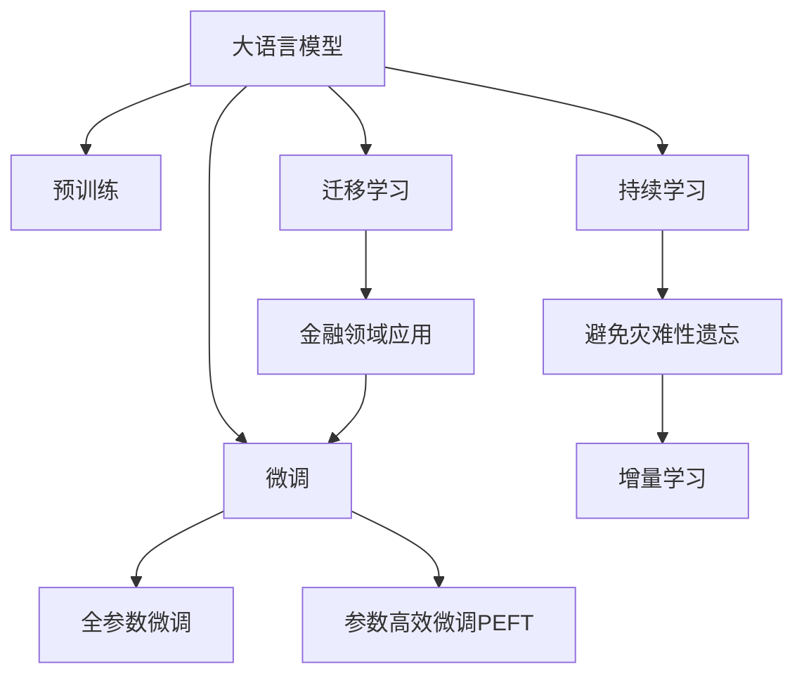

                 

# LLM与个人理财：AI财务顾问

## 1. 背景介绍

### 1.1 问题由来
在当今信息爆炸、金融产品日益多样化的时代，如何有效管理个人财务，成为了一个越来越复杂的问题。传统的财务管理方式如人工记账、手工规划等，不仅耗时费力，容易出错，而且难以适应快速变化的市场环境。

人工智能，特别是基于大语言模型（Large Language Models, LLMs）的AI财务顾问，为个人理财提供了新的可能。这种基于人工智能的财务顾问能够处理海量数据，自动化财务分析、预算制定和投资建议，帮助用户做出更科学、更合理的财务决策。

### 1.2 问题核心关键点
AI财务顾问的核心在于利用大语言模型强大的自然语言处理能力，从结构化和非结构化数据中提取关键信息，自动生成分析报告和财务规划，为用户提供个性化、动态化的财务管理服务。

主要关键点包括：
- **数据处理能力**：AI财务顾问需要从各种数据源（如银行账单、投资账户、社交媒体等）中提取、清洗和整合数据，为后续分析提供基础。
- **自然语言理解**：利用大语言模型理解自然语言，自动解析财务报告、新闻、文章等信息，提取关键财务数据。
- **财务分析**：通过统计分析和机器学习算法，对财务数据进行深入分析，生成财务报告和预测。
- **规划建议**：结合个人偏好和财务目标，生成个性化的财务规划建议，包括预算制定、投资组合优化、风险评估等。
- **用户交互**：与用户进行自然语言交互，获取需求，提供定制化的服务。

### 1.3 问题研究意义
研究基于大语言模型的AI财务顾问，对提升个人理财效率、降低财务风险、提高金融知识普及等方面具有重要意义：

1. **效率提升**：自动化财务处理大大减少了人工操作，提高财务管理效率，节省时间成本。
2. **风险控制**：通过精确的财务分析和大数据分析，提前识别风险点，制定风险应对策略。
3. **知识普及**：智能化的财务顾问能普及金融知识，提高公众对个人理财的认知和参与度。
4. **个性化服务**：基于用户个性化需求和偏好，提供定制化的财务规划和建议。
5. **长期发展**：通过持续学习和更新，AI财务顾问能够适应市场变化，提供长期稳定的财务管理服务。

## 2. 核心概念与联系

### 2.1 核心概念概述

为更好地理解基于大语言模型的AI财务顾问系统，本节将介绍几个关键概念及其相互联系：

- **大语言模型（LLM）**：以自回归或自编码模型为代表的预训练语言模型，如GPT、BERT等。通过在大量无标签文本数据上进行预训练，LLMs学习到丰富的语言知识和表示。
- **预训练（Pre-training）**：在大规模无标签文本数据上，通过自监督学习任务训练通用语言模型。预训练使得模型学习到语言的通用表示，为后续任务微调提供基础。
- **微调（Fine-tuning）**：在预训练模型的基础上，使用特定任务的少量标注数据进行有监督学习，优化模型在该任务上的性能。
- **迁移学习（Transfer Learning）**：将一个领域学习到的知识迁移到另一个相关领域的学习范式。在金融领域，预训练-微调过程即是一种迁移学习方式。
- **持续学习（Continual Learning）**：模型能够不断从新数据中学习，同时保持已学习的知识，避免灾难性遗忘。这对于保持AI财务顾问的时效性和适应性至关重要。

这些概念之间的逻辑关系可以通过以下Mermaid流程图来展示：



这个流程图展示了大语言模型的核心概念及其在AI财务顾问系统中的应用逻辑：

1. 大语言模型通过预训练获得基础能力。
2. 微调是对预训练模型进行任务特定的优化，可以为金融领域应用提供定制化服务。
3. 迁移学习是连接预训练模型与金融领域任务的桥梁，通过微调实现。
4. 持续学习使得模型能够不断适应新的市场变化和用户需求，保持服务的时效性。

## 3. 核心算法原理 & 具体操作步骤

### 3.1 算法原理概述

基于大语言模型的AI财务顾问系统，本质上是一个多任务学习过程。其核心思想是：利用大语言模型的预训练能力，从多种来源获取财务数据，通过微调优化模型在财务分析、预算制定和投资建议等方面的性能，从而为用户提供个性化的财务管理服务。

形式化地，假设预训练模型为 $M_{\theta}$，其中 $\theta$ 为预训练得到的模型参数。给定金融领域的各种任务 $T_1, T_2, ..., T_n$ 的标注数据集 $\{D_i\}_{i=1}^n$，微调的目标是找到新的模型参数 $\hat{\theta}$，使得：

$$
\hat{\theta}=\mathop{\arg\min}_{\theta} \sum_{i=1}^n \mathcal{L}_i(M_{\theta},D_i)
$$

其中 $\mathcal{L}_i$ 为针对任务 $T_i$ 设计的损失函数，用于衡量模型预测输出与真实标签之间的差异。常见的损失函数包括交叉熵损失、均方误差损失等。

通过梯度下降等优化算法，微调过程不断更新模型参数 $\theta$，最小化损失函数 $\mathcal{L}$，使得模型输出逼近真实标签。由于 $\theta$ 已经通过预训练获得了较好的初始化，因此即便在小规模数据集上进行调整，也能较快收敛到理想的模型参数 $\hat{\theta}$。

### 3.2 算法步骤详解

基于大语言模型的AI财务顾问系统一般包括以下几个关键步骤：

**Step 1: 数据预处理**
- 收集和整理金融领域的数据源，包括银行账单、投资账户、财务报表、新闻文章等。
- 对数据进行清洗和标准化，去除噪音和冗余，确保数据质量。
- 对结构化数据进行格式转换，提取关键财务指标，如收入、支出、资产、负债等。

**Step 2: 模型选择和初始化**
- 选择合适的预训练语言模型 $M_{\theta}$ 作为初始化参数，如 GPT、BERT 等。
- 根据财务任务的特点，设计合适的输出层和损失函数。例如，对于分类任务，通常使用交叉熵损失；对于生成任务，则使用语言模型的解码器输出概率分布。

**Step 3: 微调超参数设置**
- 选择合适的优化算法及其参数，如 AdamW、SGD 等，设置学习率、批大小、迭代轮数等。
- 设置正则化技术及强度，包括权重衰减、Dropout、Early Stopping 等。
- 确定冻结预训练参数的策略，如仅微调顶层，或全部参数都参与微调。

**Step 4: 执行梯度训练**
- 将训练集数据分批次输入模型，前向传播计算损失函数。
- 反向传播计算参数梯度，根据设定的优化算法和学习率更新模型参数。
- 周期性在验证集上评估模型性能，根据性能指标决定是否触发 Early Stopping。
- 重复上述步骤直到满足预设的迭代轮数或 Early Stopping 条件。

**Step 5: 测试和部署**
- 在测试集上评估微调后模型 $M_{\hat{\theta}}$ 的性能，对比微调前后的精度提升。
- 使用微调后的模型对新样本进行推理预测，集成到实际的应用系统中。
- 持续收集新的数据，定期重新微调模型，以适应数据分布的变化。

以上是基于大语言模型微调AI财务顾问系统的一般流程。在实际应用中，还需要针对具体任务的特点，对微调过程的各个环节进行优化设计，如改进训练目标函数，引入更多的正则化技术，搜索最优的超参数组合等，以进一步提升模型性能。

### 3.3 算法优缺点

基于大语言模型的AI财务顾问系统具有以下优点：
1. **高效自动化**：利用预训练模型的能力，快速自动化处理海量数据，减少人工操作。
2. **精准分析**：通过深度学习和自然语言理解技术，进行精细化的财务分析，识别潜在风险。
3. **个性化服务**：根据用户偏好和财务目标，提供定制化的财务规划建议。
4. **持续优化**：通过持续学习和微调，不断适应市场变化和用户需求。

同时，该系统也存在一定的局限性：
1. **依赖数据质量**：数据预处理和清洗工作繁琐，需要高质量的标注数据。
2. **模型复杂性**：大语言模型参数众多，计算资源需求大。
3. **风险控制**：模型的预测准确性受到训练数据和市场变化的影响，需要定期更新和验证。
4. **用户信任度**：用户对AI财务顾问的信任度需要逐渐建立，初期推广存在挑战。
5. **隐私保护**：在处理个人财务数据时，需要严格保护用户隐私，避免数据泄露。

尽管存在这些局限性，但就目前而言，基于大语言模型的AI财务顾问系统是金融科技领域的一大创新，极大地提高了财务管理的智能化水平。

### 3.4 算法应用领域

基于大语言模型的AI财务顾问系统，已经在以下多个金融领域得到了广泛应用：

- **个人预算管理**：通过收集用户的收入和支出数据，生成个性化的预算计划和建议。
- **投资组合优化**：利用历史市场数据，自动生成投资组合建议，优化资产配置。
- **信用风险评估**：分析用户的信用记录、财务报告等，预测信用风险等级，提供贷款申请建议。
- **理财规划咨询**：根据用户财务目标和偏好，提供定制化的理财规划建议，包括退休规划、税务优化等。
- **财务报告生成**：自动生成财务报表，提供财务分析和报告生成功能。

除了上述这些经典应用外，AI财务顾问系统还创新性地应用于金融市场监测、金融产品推荐、保险产品设计等领域，为金融科技的发展带来了新的机遇。

## 4. 数学模型和公式 & 详细讲解  
### 4.1 数学模型构建

本节将使用数学语言对基于大语言模型的AI财务顾问系统的数学原理进行更加严格的刻画。

记预训练语言模型为 $M_{\theta}$，其中 $\theta$ 为模型参数。假设金融领域的多种任务 $T_1, T_2, ..., T_n$ 的训练集分别为 $D_i=\{(x_i,y_i)\}_{i=1}^N, x_i \in \mathcal{X}, y_i \in \mathcal{Y}$。

定义模型 $M_{\theta}$ 在数据样本 $(x,y)$ 上的损失函数为 $\ell(M_{\theta}(x),y)$，则在数据集 $D_i$ 上的经验风险为：

$$
\mathcal{L}_i(\theta) = \frac{1}{N}\sum_{i=1}^N \ell(M_{\theta}(x_i),y_i)
$$

微调的优化目标是最小化所有任务的经验风险，即找到最优参数：

$$
\theta^* = \mathop{\arg\min}_{\theta} \sum_{i=1}^n \mathcal{L}_i(\theta)
$$

在实践中，我们通常使用基于梯度的优化算法（如SGD、Adam等）来近似求解上述最优化问题。设 $\eta$ 为学习率，$\lambda$ 为正则化系数，则参数的更新公式为：

$$
\theta \leftarrow \theta - \eta \nabla_{\theta}\mathcal{L}(\theta) - \eta\lambda\theta
$$

其中 $\nabla_{\theta}\mathcal{L}(\theta)$ 为损失函数对参数 $\theta$ 的梯度，可通过反向传播算法高效计算。

### 4.2 公式推导过程

以下我们以投资组合优化为例，推导最小方差投资组合的求解公式。

假设用户拥有 $n$ 种资产，其收益率为 $\mathbf{r} \in \mathbb{R}^n$，收益矩阵为 $\mathbf{R} \in \mathbb{R}^{n \times n}$，资产方差矩阵为 $\mathbf{V} \in \mathbb{R}^{n \times n}$。目标是找到一个最优的投资组合 $\mathbf{w} \in \mathbb{R}^n$，使得投资组合的方差最小。

建立损失函数：

$$
\ell(\mathbf{w}) = \frac{1}{2}\mathbf{w}^T \mathbf{V} \mathbf{w} - \mathbf{w}^T \mathbf{r}
$$

目标为最小化该损失函数，即求解以下优化问题：

$$
\mathbf{w}^* = \mathop{\arg\min}_{\mathbf{w}} \frac{1}{2}\mathbf{w}^T \mathbf{V} \mathbf{w} - \mathbf{w}^T \mathbf{r}
$$

通过求解二次规划问题，可以得出一个解析解：

$$
\mathbf{w}^* = \mathbf{V}^{-1}\mathbf{r}
$$

其中 $\mathbf{V}^{-1}$ 为 $\mathbf{V}$ 的逆矩阵。

在得到投资组合的解析解后，通过自然语言生成技术，可以生成简明扼要的投资组合建议，帮助用户优化资产配置。

## 5. 项目实践：代码实例和详细解释说明
### 5.1 开发环境搭建

在进行AI财务顾问系统开发前，我们需要准备好开发环境。以下是使用Python进行PyTorch开发的环境配置流程：

1. 安装Anaconda：从官网下载并安装Anaconda，用于创建独立的Python环境。

2. 创建并激活虚拟环境：
```bash
conda create -n pytorch-env python=3.8 
conda activate pytorch-env
```

3. 安装PyTorch：根据CUDA版本，从官网获取对应的安装命令。例如：
```bash
conda install pytorch torchvision torchaudio cudatoolkit=11.1 -c pytorch -c conda-forge
```

4. 安装Transformer库：
```bash
pip install transformers
```

5. 安装各类工具包：
```bash
pip install numpy pandas scikit-learn matplotlib tqdm jupyter notebook ipython
```

完成上述步骤后，即可在`pytorch-env`环境中开始AI财务顾问系统的开发。

### 5.2 源代码详细实现

这里我们以构建AI财务顾问系统为例，给出使用Transformers库进行大语言模型微调的PyTorch代码实现。

首先，定义模型的数据处理函数：

```python
from transformers import BertTokenizer
from torch.utils.data import Dataset
import torch

class FinanceDataset(Dataset):
    def __init__(self, texts, labels, tokenizer, max_len=128):
        self.texts = texts
        self.labels = labels
        self.tokenizer = tokenizer
        self.max_len = max_len
        
    def __len__(self):
        return len(self.texts)
    
    def __getitem__(self, item):
        text = self.texts[item]
        label = self.labels[item]
        
        encoding = self.tokenizer(text, return_tensors='pt', max_length=self.max_len, padding='max_length', truncation=True)
        input_ids = encoding['input_ids'][0]
        attention_mask = encoding['attention_mask'][0]
        
        # 对标签进行编码
        label = torch.tensor(label, dtype=torch.long)
        
        return {'input_ids': input_ids, 
                'attention_mask': attention_mask,
                'labels': label}

# 标签与id的映射
label2id = {'budget': 0, 'investment': 1, 'credit': 2, 'planning': 3, 'report': 4}

# 创建dataset
tokenizer = BertTokenizer.from_pretrained('bert-base-cased')

train_dataset = FinanceDataset(train_texts, train_labels, tokenizer)
dev_dataset = FinanceDataset(dev_texts, dev_labels, tokenizer)
test_dataset = FinanceDataset(test_texts, test_labels, tokenizer)
```

然后，定义模型和优化器：

```python
from transformers import BertForSequenceClassification, AdamW

model = BertForSequenceClassification.from_pretrained('bert-base-cased', num_labels=len(label2id))

optimizer = AdamW(model.parameters(), lr=2e-5)
```

接着，定义训练和评估函数：

```python
from torch.utils.data import DataLoader
from tqdm import tqdm
from sklearn.metrics import classification_report

device = torch.device('cuda') if torch.cuda.is_available() else torch.device('cpu')
model.to(device)

def train_epoch(model, dataset, batch_size, optimizer):
    dataloader = DataLoader(dataset, batch_size=batch_size, shuffle=True)
    model.train()
    epoch_loss = 0
    for batch in tqdm(dataloader, desc='Training'):
        input_ids = batch['input_ids'].to(device)
        attention_mask = batch['attention_mask'].to(device)
        labels = batch['labels'].to(device)
        model.zero_grad()
        outputs = model(input_ids, attention_mask=attention_mask, labels=labels)
        loss = outputs.loss
        epoch_loss += loss.item()
        loss.backward()
        optimizer.step()
    return epoch_loss / len(dataloader)

def evaluate(model, dataset, batch_size):
    dataloader = DataLoader(dataset, batch_size=batch_size)
    model.eval()
    preds, labels = [], []
    with torch.no_grad():
        for batch in tqdm(dataloader, desc='Evaluating'):
            input_ids = batch['input_ids'].to(device)
            attention_mask = batch['attention_mask'].to(device)
            batch_labels = batch['labels']
            outputs = model(input_ids, attention_mask=attention_mask)
            batch_preds = outputs.logits.argmax(dim=2).to('cpu').tolist()
            batch_labels = batch_labels.to('cpu').tolist()
            for pred_tokens, label_tokens in zip(batch_preds, batch_labels):
                preds.append(pred_tokens[:len(label_tokens)])
                labels.append(label_tokens)
                
    print(classification_report(labels, preds))
```

最后，启动训练流程并在测试集上评估：

```python
epochs = 5
batch_size = 16

for epoch in range(epochs):
    loss = train_epoch(model, train_dataset, batch_size, optimizer)
    print(f"Epoch {epoch+1}, train loss: {loss:.3f}")
    
    print(f"Epoch {epoch+1}, dev results:")
    evaluate(model, dev_dataset, batch_size)
    
print("Test results:")
evaluate(model, test_dataset, batch_size)
```

以上就是使用PyTorch对BERT进行AI财务顾问系统构建的完整代码实现。可以看到，得益于Transformers库的强大封装，我们可以用相对简洁的代码完成BERT模型的加载和微调。

### 5.3 代码解读与分析

让我们再详细解读一下关键代码的实现细节：

**FinanceDataset类**：
- `__init__`方法：初始化文本、标签、分词器等关键组件。
- `__len__`方法：返回数据集的样本数量。
- `__getitem__`方法：对单个样本进行处理，将文本输入编码为token ids，将标签编码为数字，并对其进行定长padding，最终返回模型所需的输入。

**label2id字典**：
- 定义了标签与数字id之间的映射关系，用于将输出结果解码为具体的标签。

**训练和评估函数**：
- 使用PyTorch的DataLoader对数据集进行批次化加载，供模型训练和推理使用。
- 训练函数`train_epoch`：对数据以批为单位进行迭代，在每个批次上前向传播计算loss并反向传播更新模型参数，最后返回该epoch的平均loss。
- 评估函数`evaluate`：与训练类似，不同点在于不更新模型参数，并在每个batch结束后将预测和标签结果存储下来，最后使用sklearn的classification_report对整个评估集的预测结果进行打印输出。

**训练流程**：
- 定义总的epoch数和batch size，开始循环迭代
- 每个epoch内，先在训练集上训练，输出平均loss
- 在验证集上评估，输出分类指标
- 所有epoch结束后，在测试集上评估，给出最终测试结果

可以看到，PyTorch配合Transformers库使得BERT微调的代码实现变得简洁高效。开发者可以将更多精力放在数据处理、模型改进等高层逻辑上，而不必过多关注底层的实现细节。

当然，工业级的系统实现还需考虑更多因素，如模型的保存和部署、超参数的自动搜索、更灵活的任务适配层等。但核心的微调范式基本与此类似。

## 6. 实际应用场景

### 6.1 智能投顾推荐系统

基于AI财务顾问系统的智能投顾推荐系统，可以为投资者提供个性化的投资建议。通过分析用户的投资偏好、风险承受能力、市场数据等，生成最优的投资组合，帮助用户实现财富增值。

在技术实现上，可以收集投资者的历史交易数据、资产配置偏好、市场数据等，构建监督数据集。在此基础上对预训练模型进行微调，使其能够理解投资者的需求，生成个性化的投资组合建议。系统可以根据用户反馈和市场变化，不断优化模型，提供更精准的推荐。

### 6.2 个人理财计划生成

AI财务顾问系统可以自动生成个性化的理财计划，帮助用户实现财务目标。通过分析用户的收入、支出、资产、负债等财务数据，结合用户的财务目标，自动生成预算、储蓄、投资等建议，帮助用户合理规划财务。

系统可以集成到个人财务管理应用中，用户只需简单填写财务信息，系统便能自动生成全面的理财计划，提供直观的财务分析报告。用户可以根据报告调整财务策略，逐步实现财务目标。

### 6.3 智能税务规划

AI财务顾问系统还可以应用于税务规划，帮助用户合理避税，最大化税务收益。通过分析用户的财务数据和税务政策，生成最优的税务筹划方案，帮助用户合法节税。

系统可以集成到财务软件或银行系统，自动读取用户的财务信息，结合最新的税务政策，提供个性化的税务规划建议。用户可以根据建议调整财务安排，实现税务优化。

### 6.4 未来应用展望

随着AI财务顾问系统的不断发展，其在金融科技领域的应用前景将更加广阔。

在智慧金融领域，AI财务顾问将助力智能投顾、智能投顾推荐系统、智能税务规划等场景，提升金融服务的智能化水平，降低金融风险，提高金融效率。

在智能家居领域，AI财务顾问可以结合智能家居系统，实时监测家庭财务状况，提供定制化的理财和投资建议，提升家庭财务管理水平。

在智慧城市治理中，AI财务顾问系统可以用于城市财务规划、公共预算管理等环节，提高城市管理的自动化和智能化水平，构建更安全、高效的未来城市。

此外，在企业财务、社会治理、文娱传媒等众多领域，基于AI财务顾问系统的智能财务服务也将不断涌现，为经济社会发展注入新的动力。相信随着技术的日益成熟，AI财务顾问必将在构建智能金融体系中扮演越来越重要的角色。

## 7. 工具和资源推荐
### 7.1 学习资源推荐

为了帮助开发者系统掌握大语言模型微调的理论基础和实践技巧，这里推荐一些优质的学习资源：

1. 《Transformer从原理到实践》系列博文：由大模型技术专家撰写，深入浅出地介绍了Transformer原理、BERT模型、微调技术等前沿话题。

2. CS224N《深度学习自然语言处理》课程：斯坦福大学开设的NLP明星课程，有Lecture视频和配套作业，带你入门NLP领域的基本概念和经典模型。

3. 《Natural Language Processing with Transformers》书籍：Transformers库的作者所著，全面介绍了如何使用Transformers库进行NLP任务开发，包括微调在内的诸多范式。

4. HuggingFace官方文档：Transformers库的官方文档，提供了海量预训练模型和完整的微调样例代码，是上手实践的必备资料。

5. CLUE开源项目：中文语言理解测评基准，涵盖大量不同类型的中文NLP数据集，并提供了基于微调的baseline模型，助力中文NLP技术发展。

通过对这些资源的学习实践，相信你一定能够快速掌握大语言模型微调的精髓，并用于解决实际的NLP问题。

### 7.2 开发工具推荐

高效的开发离不开优秀的工具支持。以下是几款用于大语言模型微调开发的常用工具：

1. PyTorch：基于Python的开源深度学习框架，灵活动态的计算图，适合快速迭代研究。大部分预训练语言模型都有PyTorch版本的实现。

2. TensorFlow：由Google主导开发的开源深度学习框架，生产部署方便，适合大规模工程应用。同样有丰富的预训练语言模型资源。

3. Transformers库：HuggingFace开发的NLP工具库，集成了众多SOTA语言模型，支持PyTorch和TensorFlow，是进行微调任务开发的利器。

4. Weights & Biases：模型训练的实验跟踪工具，可以记录和可视化模型训练过程中的各项指标，方便对比和调优。与主流深度学习框架无缝集成。

5. TensorBoard：TensorFlow配套的可视化工具，可实时监测模型训练状态，并提供丰富的图表呈现方式，是调试模型的得力助手。

6. Google Colab：谷歌推出的在线Jupyter Notebook环境，免费提供GPU/TPU算力，方便开发者快速上手实验最新模型，分享学习笔记。

合理利用这些工具，可以显著提升大语言模型微调任务的开发效率，加快创新迭代的步伐。

### 7.3 相关论文推荐

大语言模型和微调技术的发展源于学界的持续研究。以下是几篇奠基性的相关论文，推荐阅读：

1. Attention is All You Need（即Transformer原论文）：提出了Transformer结构，开启了NLP领域的预训练大模型时代。

2. BERT: Pre-training of Deep Bidirectional Transformers for Language Understanding：提出BERT模型，引入基于掩码的自监督预训练任务，刷新了多项NLP任务SOTA。

3. Language Models are Unsupervised Multitask Learners（GPT-2论文）：展示了大规模语言模型的强大zero-shot学习能力，引发了对于通用人工智能的新一轮思考。

4. Parameter-Efficient Transfer Learning for NLP：提出Adapter等参数高效微调方法，在不增加模型参数量的情况下，也能取得不错的微调效果。

5. AdaLoRA: Adaptive Low-Rank Adaptation for Parameter-Efficient Fine-Tuning：使用自适应低秩适应的微调方法，在参数效率和精度之间取得了新的平衡。

这些论文代表了大语言模型微调技术的发展脉络。通过学习这些前沿成果，可以帮助研究者把握学科前进方向，激发更多的创新灵感。

## 8. 总结：未来发展趋势与挑战

### 8.1 总结

本文对基于大语言模型的AI财务顾问系统进行了全面系统的介绍。首先阐述了AI财务顾问系统的研究背景和意义，明确了其在大数据、自然语言处理和金融科技领域的独特价值。其次，从原理到实践，详细讲解了系统的数学原理和关键步骤，给出了完整的代码实例。同时，本文还广泛探讨了AI财务顾问系统在智能投顾、理财计划、税务规划等多个金融领域的应用前景，展示了其广阔的应用潜力。最后，本文精选了系统的学习资源和开发工具，力求为开发者提供全方位的技术指引。

通过本文的系统梳理，可以看到，基于大语言模型的AI财务顾问系统正在成为金融科技领域的重要范式，极大地提高了财务管理的智能化水平。未来，伴随技术的不断演进，AI财务顾问系统将进一步拓展其应用范围，为金融科技带来更多创新价值。

### 8.2 未来发展趋势

展望未来，AI财务顾问系统的发展趋势将呈现以下几个方面：

1. **技术融合**：未来的AI财务顾问系统将更多地与其他人工智能技术融合，如知识图谱、因果推理、强化学习等，进一步提升财务分析的精准性和理财建议的个性化。

2. **跨模态融合**：结合图像、语音、视频等多模态数据，提高财务分析的全面性和深度。

3. **多任务学习**：将财务规划、投资组合优化、税务筹划等多任务模型进行联合训练，提高模型的泛化能力和适用性。

4. **知识图谱辅助**：引入知识图谱，增强模型的常识推理能力，提供更全面的财务知识背景。

5. **分布式计算**：利用分布式计算技术，处理海量金融数据，提升模型训练和推理效率。

6. **实时更新**：通过持续学习机制，实时更新模型，确保其能够适应市场变化和用户需求。

7. **增强安全性**：采用加密、隐私保护等技术，确保数据和模型安全，提高系统的可靠性。

以上趋势凸显了AI财务顾问系统的广阔前景。这些方向的探索发展，必将进一步提升系统的性能和应用范围，为金融科技领域带来新的机遇。

### 8.3 面临的挑战

尽管AI财务顾问系统已经取得了瞩目成就，但在迈向更加智能化、普适化应用的过程中，它仍面临着诸多挑战：

1. **数据隐私和安全**：在处理个人财务数据时，如何保护用户隐私，避免数据泄露，是系统面临的主要挑战。

2. **模型鲁棒性和可解释性**：模型的预测准确性和可解释性需要进一步提高，以确保用户对系统信任。

3. **市场变化和不确定性**：市场环境和用户需求的变化，要求系统能够持续学习和适应，避免模型过时。

4. **技术和资源成本**：大语言模型的训练和部署需要高昂的计算资源和时间成本，如何降低成本，提高效率，是系统推广面临的重要问题。

5. **用户接受度**：用户对AI财务顾问的接受度需要逐步提升，初期推广可能需要大量的教育和信任建立工作。

尽管存在这些挑战，但随着技术的不断进步和应用场景的拓展，AI财务顾问系统有望在金融科技领域大放异彩，为个人和企业提供更智能、更高效的财务管理服务。

### 8.4 研究展望

面对AI财务顾问系统所面临的挑战，未来的研究需要在以下几个方面寻求新的突破：

1. **隐私保护技术**：开发隐私保护算法和加密技术，确保用户财务数据的安全性。

2. **鲁棒性提升**：通过数据增强、对抗训练等方法，提高模型的鲁棒性和泛化能力。

3. **增强可解释性**：引入可解释性技术，如因果分析、对抗样本生成等，增强模型的透明度和可解释性。

4. **模型优化**：通过模型压缩、稀疏化存储等方法，优化模型参数和资源消耗，降低技术和资源成本。

5. **多任务学习**：开发多任务学习算法，提高模型在多个任务上的泛化能力和性能。

6. **知识图谱集成**：将知识图谱与模型结合，增强模型的常识推理能力。

7. **分布式计算**：开发分布式计算框架，提高模型训练和推理效率。

这些研究方向的探索，必将引领AI财务顾问系统走向更加成熟和可靠，为金融科技带来更多创新价值。面向未来，AI财务顾问系统需要从技术、伦理、隐私等多个维度进行全面优化，才能真正实现其应用潜力，为金融科技领域带来革命性的变革。

## 9. 附录：常见问题与解答

**Q1：AI财务顾问系统是否适用于所有用户？**

A: AI财务顾问系统主要适用于愿意接受和信任AI技术，并具备基本计算机操作能力的用户。对于一些特定用户群体，如老年人和低收入人群，可能存在操作困难和技术接受度问题，需要设计更加友好易用的界面和交互方式。

**Q2：AI财务顾问系统能否保证投资安全？**

A: AI财务顾问系统可以提供个性化的投资建议，但无法完全消除投资风险。用户的投资决策需要结合自身风险承受能力和市场情况综合考虑。AI财务顾问系统通过数据分析和模型预测，能够提供更科学的投资建议，但最终的投资决策仍由用户自己承担。

**Q3：AI财务顾问系统是否需要频繁更新？**

A: 是的，AI财务顾问系统需要不断学习新数据，以适应市场变化和用户需求。特别是金融市场波动较大时，系统的持续学习机制尤为重要。用户应定期更新系统数据，确保其提供的信息和建议是最新的。

**Q4：AI财务顾问系统是否存在偏见和歧视？**

A: 存在可能。AI财务顾问系统基于大量数据训练，数据中可能包含社会偏见和歧视，模型在学习过程中可能会放大这些偏见。为避免偏见和歧视，需要设计公平性评估指标，定期监控和调整模型。

**Q5：AI财务顾问系统是否会替代传统金融顾问？**

A: 不会。AI财务顾问系统是传统金融顾问的补充和辅助工具，而非替代。传统金融顾问能够提供更全面的人际交流和情感支持，AI财务顾问则通过数据驱动的方式，提供更精准、高效的财务管理服务。两者互补，共同提升金融服务的质量和覆盖面。

通过回答这些问题，可以看到AI财务顾问系统在实际应用中的潜在挑战和限制。解决这些问题，需要技术、伦理、社会等多方面的协同努力，才能充分发挥其潜力，为金融科技领域带来更多创新价值。

---

作者：禅与计算机程序设计艺术 / Zen and the Art of Computer Programming

