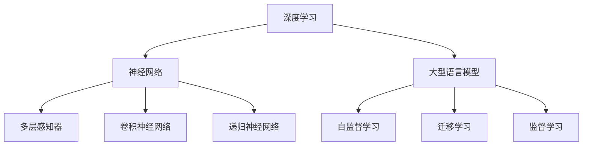

                 

# LLM与深度学习：异同点分析

> 关键词：大语言模型,深度学习,神经网络,神经网络与LLM比较

## 1. 背景介绍

### 1.1 问题由来
在人工智能领域，深度学习（Deep Learning, DL）和大型语言模型（Large Language Model, LLM）是两个重要且迅速发展的分支。它们在各自的领域中都取得了显著的成果。然而，随着深度学习技术的不断进步，LLM这一概念开始频繁出现，并引起了广泛的关注和讨论。本节将介绍深度学习与LLM的基本概念，探讨两者的联系与区别，为后续的深入分析奠定基础。

### 1.2 问题核心关键点
深度学习与LLM虽然有所不同，但它们都是基于神经网络构建的，并通过大规模数据集进行训练，以实现对复杂数据的高级处理和模式识别。它们在原理上有着密不可分的关系，而在应用上又各有侧重。理解两者之间的联系与区别，有助于我们更好地把握深度学习的未来发展方向，探索LLM的潜在应用。

### 1.3 问题研究意义
研究深度学习与LLM之间的异同点，不仅有助于我们深入理解两者的核心技术，还能为后续的实际应用提供指导。特别是在自然语言处理（Natural Language Processing, NLP）领域，LLM的引入可以大大提升模型的理解和生成能力，推动NLP技术向更加智能化的方向发展。

## 2. 核心概念与联系

### 2.1 核心概念概述

为了更好地理解深度学习与LLM，本节将介绍一些关键概念：

- **深度学习**：一种基于神经网络的机器学习方法，通过多层非线性变换来提取和学习数据的高级特征，适用于图像、语音、文本等多种类型的复杂数据处理。
- **神经网络**：深度学习的核心组成部分，由多层神经元（节点）和连接它们的边组成，通过反向传播算法训练神经网络，以最小化损失函数。
- **大型语言模型**：一种特殊类型的神经网络，用于处理和生成自然语言文本，通常具有数亿甚至数十亿的参数，能够在各种自然语言处理任务中取得卓越的性能。
- **自监督学习**：深度学习中的一种学习方法，通过设计未标记数据上的预训练任务，自动学习数据的特征表示。
- **迁移学习**：将在一个领域学到的知识迁移到另一个领域，以提高新任务的性能，LLM通常通过自监督预训练和下游任务的微调来实现迁移学习。
- **监督学习**：使用已标记的数据集训练模型，预测未知数据的标签，适用于各种分类和回归任务。

这些概念之间的逻辑关系可以通过以下Mermaid流程图来展示：



这个流程图展示了许多关键概念之间的关系：

1. 深度学习基于神经网络，包括多层感知器、卷积神经网络和递归神经网络等。
2. LLM是一种特定的神经网络，用于处理自然语言。
3. LLM通常通过自监督学习和迁移学习来训练，其中自监督学习用于预训练，迁移学习用于微调。
4. LLM最终通过监督学习进行下游任务的训练。

## 3. 核心算法原理 & 具体操作步骤
### 3.1 算法原理概述

深度学习和大型语言模型的核心算法原理都是基于神经网络的，但它们在具体实现和应用上有所不同。下面将详细阐述两者的算法原理。

### 3.2 算法步骤详解

#### 深度学习算法步骤

1. **数据准备**：收集和准备用于训练的数据集，包括图像、音频和文本等。
2. **模型构建**：设计并构建神经网络模型，通常包括输入层、隐藏层和输出层。
3. **参数初始化**：随机初始化模型中的权重和偏置。
4. **前向传播**：将输入数据通过模型进行正向传播，计算输出结果。
5. **损失计算**：计算模型输出与真实标签之间的差异，通常使用交叉熵损失等。
6. **反向传播**：通过反向传播算法计算梯度，并根据梯度调整模型参数。
7. **模型训练**：重复上述步骤，直到模型收敛或达到预设的训练轮数。

#### LLM算法步骤

1. **自监督预训练**：在大型无标注数据集上进行预训练，通过自监督任务（如掩码语言模型、下一句预测等）学习语言表示。
2. **下游任务微调**：在标注数据集上微调模型，通过特定任务的目标函数（如分类、生成等）进行训练，以适应特定任务需求。
3. **参数初始化**：与深度学习相同，随机初始化模型中的权重和偏置。
4. **前向传播**：将输入文本通过模型进行正向传播，计算输出结果。
5. **损失计算**：计算模型输出与真实标签之间的差异，通常使用交叉熵损失等。
6. **反向传播**：通过反向传播算法计算梯度，并根据梯度调整模型参数。
7. **模型训练**：重复上述步骤，直到模型收敛或达到预设的训练轮数。

### 3.3 算法优缺点

#### 深度学习的优点

1. **可处理复杂数据**：深度学习可以处理图像、音频、文本等多种类型的数据，适用于各种复杂问题的解决。
2. **高准确性**：在处理特定领域的数据时，深度学习通常能取得较高的准确性。
3. **自适应能力强**：深度学习模型可以通过调整参数和网络结构来适应不同的任务。

#### 深度学习的缺点

1. **数据需求量大**：深度学习模型需要大量的数据进行训练，否则容易出现过拟合。
2. **计算资源消耗大**：深度学习模型通常需要高性能的计算设备和大量的计算资源。
3. **解释性差**：深度学习模型通常被视为“黑盒”，难以解释其内部工作机制。

#### LLM的优点

1. **强大的语言处理能力**：LLM在理解和生成自然语言方面具有强大的能力，能够处理复杂的语言任务。
2. **泛化能力强**：LLM能够在大规模预训练数据上学习语言的通用表示，并在各种下游任务中取得良好效果。
3. **易用性强**：LLM通常具有较好的接口和文档，易于使用和集成到其他系统中。

#### LLM的缺点

1. **数据依赖性高**：LLM的性能很大程度上依赖于预训练数据的质量和数量，高质量的预训练数据是必要的。
2. **计算资源需求高**：尽管参数量相对较少，但训练和推理LLM需要大量的计算资源。
3. **可解释性不足**：尽管LLM在理解语言方面表现出色，但其内部工作机制仍不透明，难以解释其推理过程。

### 3.4 算法应用领域

深度学习和大型语言模型在多个领域都有广泛的应用：

- **深度学习**：广泛应用于计算机视觉（如图像分类、目标检测）、自然语言处理（如机器翻译、文本分类）、语音识别（如语音识别、语音合成）等。
- **大型语言模型**：主要应用于自然语言处理领域，如问答系统、文本生成、情感分析、对话系统等。

## 4. 数学模型和公式 & 详细讲解 & 举例说明

### 4.1 数学模型构建

#### 深度学习数学模型

深度学习模型通常由输入层、隐藏层和输出层组成。以卷积神经网络（Convolutional Neural Network, CNN）为例，其数学模型如下：

$$
y = W^l \sigma(z^l) + b^l
$$

其中，$z^l$ 为第 $l$ 层的输入，$\sigma$ 为激活函数，$W^l$ 和 $b^l$ 分别为第 $l$ 层的权重和偏置。

#### LLM数学模型

大型语言模型通常基于Transformer架构，其数学模型如下：

$$
y = M_{\theta}(x) = M_{\text{Attention}}(M_{\text{Encoder}}, M_{\text{Decoder}}, x, \mathcal{Y})
$$

其中，$M_{\text{Encoder}}$ 和 $M_{\text{Decoder}}$ 分别为编码器和解码器，$\theta$ 为模型参数，$x$ 为输入文本，$\mathcal{Y}$ 为输出标签。

### 4.2 公式推导过程

#### 深度学习公式推导

以多层感知器（Multilayer Perceptron, MLP）为例，推导其前向传播过程。假设输入向量 $x$ 为 $n$ 维，输出向量 $y$ 为 $m$ 维，中间层 $h$ 的维数为 $n_h$，则前向传播过程如下：

$$
z^{(1)} = W^{(1)}x + b^{(1)}
$$
$$
h^{(1)} = \sigma(z^{(1)})
$$
$$
z^{(2)} = W^{(2)}h^{(1)} + b^{(2)}
$$
$$
y = W^{(3)}h^{(2)} + b^{(3)}
$$

其中，$\sigma$ 为激活函数，$W$ 和 $b$ 分别为权重和偏置。

#### LLM公式推导

以BERT为例，推导其自监督预训练任务。BERT的自监督预训练任务包括掩码语言模型（Masked Language Model, MLM）和下一句预测（Next Sentence Prediction, NSP）。

掩码语言模型任务：

$$
\hat{y} = \text{softmax}(\text{MLP}(\text{Encoder}(\text{CLS}(x), x, y)))
$$

其中，$\hat{y}$ 为预测的掩码单词，$x$ 为输入文本，$y$ 为掩码位置，$\text{MLP}$ 为多层次感知器，$\text{Encoder}$ 为编码器。

下一句预测任务：

$$
\hat{y} = \text{softmax}(\text{MLP}(\text{Encoder}(\text{CLS}(x), x, y)))
$$

其中，$\hat{y}$ 为预测的下一句是否连续，$x$ 为输入文本，$y$ 为下一句文本，$\text{MLP}$ 为多层次感知器，$\text{Encoder}$ 为编码器。

### 4.3 案例分析与讲解

#### 案例一：图像分类

以卷积神经网络（CNN）为例，介绍深度学习在图像分类中的应用。假设输入图像为 $28\times28$ 的灰度图像，输出为 10 个类别的分类结果。则前向传播过程如下：

1. 输入层：将输入图像展平为 $28\times28=784$ 维的向量 $x$。
2. 隐藏层 1：通过卷积层和池化层进行特征提取。
3. 隐藏层 2：将提取的特征传递给全连接层，输出中间特征 $h^{(1)}$。
4. 输出层：通过全连接层和激活函数计算分类结果 $y$。

#### 案例二：自然语言生成

以大型语言模型为例，介绍LLM在自然语言生成中的应用。假设输入文本为“今天天气真好”，输出为“明天肯定下雨”。则前向传播过程如下：

1. 输入层：将输入文本转换为 token ids。
2. 编码器：通过Transformer编码器对输入文本进行编码，输出编码结果 $h^{(1)}$。
3. 解码器：通过Transformer解码器生成输出文本，输出结果 $y$。

## 5. 项目实践：代码实例和详细解释说明

### 5.1 开发环境搭建

在进行深度学习与LLM实践前，需要准备好开发环境。以下是使用Python进行TensorFlow和PyTorch开发的环境配置流程：

1. 安装Anaconda：从官网下载并安装Anaconda，用于创建独立的Python环境。

2. 创建并激活虚拟环境：
```bash
conda create -n dl-env python=3.8 
conda activate dl-env
```

3. 安装TensorFlow和PyTorch：根据CUDA版本，从官网获取对应的安装命令。例如：
```bash
conda install tensorflow=2.5 cudatoolkit=11.1 -c tf -c conda-forge
conda install pytorch torchvision torchaudio cudatoolkit=11.1 -c pytorch -c conda-forge
```

4. 安装各类工具包：
```bash
pip install numpy pandas scikit-learn matplotlib tqdm jupyter notebook ipython
```

完成上述步骤后，即可在`dl-env`环境中开始深度学习与LLM的实践。

### 5.2 源代码详细实现

下面我们以图像分类任务为例，给出使用TensorFlow进行深度学习的PyTorch代码实现。

首先，定义图像分类任务的模型：

```python
import tensorflow as tf
from tensorflow.keras import layers, models

model = models.Sequential([
    layers.Conv2D(32, (3, 3), activation='relu', input_shape=(28, 28, 1)),
    layers.MaxPooling2D((2, 2)),
    layers.Flatten(),
    layers.Dense(10, activation='softmax')
])
```

然后，定义数据集和训练函数：

```python
import numpy as np
from tensorflow.keras.datasets import mnist

(x_train, y_train), (x_test, y_test) = mnist.load_data()

x_train = x_train.reshape(-1, 28, 28, 1) / 255.0
x_test = x_test.reshape(-1, 28, 28, 1) / 255.0

def train_epoch(model, dataset, batch_size, optimizer):
    dataloader = tf.data.Dataset.from_tensor_slices((dataset['images'], dataset['labels']))
    dataloader = dataloader.batch(batch_size).shuffle(buffer_size=1024).map(map_fn=tf.image.decode_png).map(map_fn=tf.reshape)
    model.compile(optimizer=optimizer, loss='categorical_crossentropy', metrics=['accuracy'])
    model.fit(dataloader, epochs=10, validation_data=dataset['validation_data'])
```

接着，启动训练流程并在测试集上评估：

```python
epochs = 5
batch_size = 64

optimizer = tf.keras.optimizers.Adam(learning_rate=0.001)

train_epoch(model, (x_train, y_train), batch_size, optimizer)
print(model.evaluate(x_test, y_test))
```

以上就是使用TensorFlow进行图像分类的完整代码实现。可以看到，深度学习的模型定义和训练过程相对简单明了，可以通过一些常用的组件和函数快速构建模型。

### 5.3 代码解读与分析

让我们再详细解读一下关键代码的实现细节：

**模型定义**：
- `Sequential`类：用于定义顺序模型，将多个层堆叠起来。
- `Conv2D`层：卷积层，用于提取图像特征。
- `MaxPooling2D`层：池化层，用于降维。
- `Flatten`层：展平层，将多维特征展开为一维。
- `Dense`层：全连接层，输出分类结果。

**数据准备**：
- `mnist.load_data()`：加载MNIST数据集。
- `x_train = x_train.reshape(-1, 28, 28, 1) / 255.0`：将像素值归一化到 [0, 1] 之间。
- `x_test = x_test.reshape(-1, 28, 28, 1) / 255.0`：对测试集进行相同预处理。

**训练函数**：
- `tf.data.Dataset.from_tensor_slices`：将数据集转换为张量集，方便批量处理。
- `batch_size`：设置批大小。
- `shuffle(buffer_size=1024)`：对数据进行随机打乱。
- `map(map_fn=tf.image.decode_png)`：将图像数据解码为张量。
- `map(map_fn=tf.reshape)`：将数据重塑为模型需要的形状。
- `model.compile`：配置模型参数。
- `model.fit`：进行模型训练。
- `model.evaluate`：评估模型性能。

**训练流程**：
- `epochs`：定义训练轮数。
- `optimizer`：定义优化器。
- `train_epoch`：进行单轮训练。
- `print(model.evaluate(x_test, y_test))`：在测试集上评估模型性能。

可以看到，PyTorch和TensorFlow都提供了丰富的组件和函数，使得深度学习的模型定义和训练过程变得简单高效。

## 6. 实际应用场景

### 6.1 智能推荐系统

深度学习在推荐系统中的应用非常广泛。推荐系统通过分析用户的历史行为数据，推荐用户可能感兴趣的商品、视频、文章等内容。深度学习模型能够从数据中学习到用户的兴趣偏好，从而提高推荐系统的准确性和个性化程度。

### 6.2 自动驾驶

深度学习在自动驾驶领域也有重要应用。通过分析摄像头、雷达等传感器数据，深度学习模型能够识别道路上的障碍物、行人、车辆等，实现自动驾驶。深度学习模型能够处理大量的复杂数据，具有很强的泛化能力，适用于自动驾驶这种需要实时决策的任务。

### 6.3 医疗诊断

深度学习在医疗诊断中的应用也越来越广泛。通过分析医学影像、病历等数据，深度学习模型能够辅助医生进行疾病诊断和治疗方案的制定。深度学习模型能够从数据中学习到疾病的特征，提高诊断的准确性和效率。

### 6.4 未来应用展望

随着深度学习技术的不断进步，未来LLM在各个领域的应用将更加广泛。以下列举一些未来可能的应用场景：

1. **智慧城市**：深度学习在智慧城市中的应用包括智能交通管理、智能安防、智能环境监测等。通过深度学习，可以实现对城市交通、公共安全、环境污染等问题的智能化管理。
2. **金融科技**：深度学习在金融科技中的应用包括风险评估、欺诈检测、信用评分等。通过深度学习，可以更准确地评估金融风险，识别欺诈行为，提高信用评分系统的效果。
3. **农业**：深度学习在农业中的应用包括农作物识别、病虫害检测、精准农业等。通过深度学习，可以实现对农作物的自动分类、病虫害的智能识别、农业资源的精准管理。

## 7. 工具和资源推荐

### 7.1 学习资源推荐

为了帮助开发者系统掌握深度学习和LLM的理论基础和实践技巧，这里推荐一些优质的学习资源：

1. **《深度学习》课程**：斯坦福大学开设的深度学习课程，系统讲解深度学习的理论和实践。
2. **《大型语言模型》书籍**：深入介绍大型语言模型的原理和应用。
3. **HuggingFace官方文档**：提供丰富的预训练模型和微调样例代码，适合初学者上手。
4. **Kaggle竞赛平台**：提供大量深度学习竞赛，有助于实践和提升技能。

### 7.2 开发工具推荐

高效的开发离不开优秀的工具支持。以下是几款用于深度学习和LLM开发的常用工具：

1. **PyTorch**：基于Python的开源深度学习框架，灵活易用，支持动态计算图。
2. **TensorFlow**：由Google主导开发的开源深度学习框架，适用于大规模工程应用。
3. **Keras**：高层深度学习API，封装了TensorFlow和Theano，易于使用。
4. **JAX**：基于Python的高性能计算库，支持自动微分和分布式训练。
5. **HuggingFace Transformers**：提供丰富的预训练模型和微调工具。

### 7.3 相关论文推荐

深度学习和大型语言模型的发展离不开学术界的持续研究。以下是几篇奠基性的相关论文，推荐阅读：

1. **《深度学习》书籍**：Goodfellow等人所著，全面介绍了深度学习的理论和应用。
2. **《大型语言模型》论文**：OpenAI等机构发表的系列论文，推动了大型语言模型的发展。
3. **《自监督学习》论文**：Vaswani等人所著，介绍了自监督学习的理论和实践。
4. **《迁移学习》论文**：Tsung-Wei Huang等人所著，介绍了迁移学习的理论和应用。

## 8. 总结：未来发展趋势与挑战

### 8.1 总结

本文对深度学习与大型语言模型的异同点进行了全面系统的介绍。首先阐述了两者的基本概念和联系，明确了深度学习和LLM在原理和实现上的异同点。其次，从原理到实践，详细讲解了深度学习和LLM的算法原理和具体操作步骤，给出了深度学习和LLM的代码实例。同时，本文还广泛探讨了深度学习和LLM在多个领域的应用前景，展示了其在各个行业中的巨大潜力。

通过本文的系统梳理，可以看到，深度学习和大型语言模型在人工智能领域中都具有重要地位，它们各自的优势和局限性使其在不同应用场景中发挥着独特作用。在未来，深度学习和LLM将相互融合，共同推动人工智能技术的发展。

### 8.2 未来发展趋势

展望未来，深度学习和大型语言模型将呈现以下几个发展趋势：

1. **模型规模不断增大**：深度学习模型和大型语言模型都将朝着更大的规模发展，以容纳更多的数据和知识。
2. **数据需求不断降低**：未来的深度学习和LLM模型将更加注重自监督学习，减少对标注数据的需求。
3. **计算资源需求降低**：随着模型架构和算法的优化，深度学习和LLM的计算资源需求将逐渐降低。
4. **模型可解释性增强**：未来的深度学习和LLM模型将更加注重可解释性，使模型的工作机制更加透明。
5. **跨领域应用扩展**：深度学习和LLM将在更多的领域得到应用，如智慧城市、金融科技、医疗诊断等。

### 8.3 面临的挑战

尽管深度学习和大型语言模型已经取得了显著成果，但在未来发展中仍面临诸多挑战：

1. **数据质量和数量**：深度学习和LLM模型的性能很大程度上依赖于数据的质量和数量，如何获取高质量的数据是一个关键问题。
2. **计算资源消耗**：深度学习和LLM模型的计算资源需求仍然较高，如何优化模型的计算效率是一个重要研究方向。
3. **模型泛化能力**：深度学习和LLM模型在面对复杂和未知数据时，泛化能力仍需进一步提升。
4. **模型可解释性**：深度学习和LLM模型的内部工作机制不透明，如何提高模型的可解释性是一个重要研究方向。

### 8.4 研究展望

面对深度学习和大型语言模型所面临的挑战，未来的研究需要在以下几个方面寻求新的突破：

1. **数据获取和标注**：探索无监督和半监督学习方法，减少对标注数据的需求。
2. **模型压缩和优化**：开发更高效的模型压缩和优化方法，降低计算资源需求。
3. **跨领域知识整合**：探索跨领域知识的整合方法，提高模型的泛化能力。
4. **模型可解释性**：研究可解释性模型和解释性技术，提高模型的可解释性。

## 9. 附录：常见问题与解答

**Q1：深度学习与大型语言模型有何异同？**

A: 深度学习和大型语言模型都是基于神经网络的，但深度学习通常用于处理图像、语音、视频等数据，而大型语言模型主要用于处理文本数据。深度学习模型通常用于分类、回归等任务，而大型语言模型主要用于自然语言处理任务，如语言建模、翻译、问答等。

**Q2：深度学习和大型语言模型在实际应用中有何优势？**

A: 深度学习在处理复杂数据和实现高级模式识别方面具有优势，适用于计算机视觉、自然语言处理等领域。大型语言模型在理解和生成自然语言方面具有优势，适用于自然语言处理任务，如问答、翻译、情感分析等。

**Q3：深度学习和大型语言模型的计算资源需求高吗？**

A: 深度学习模型和大型语言模型的计算资源需求较高，特别是在大规模训练和推理时。但随着模型架构和算法的优化，计算资源需求正在逐渐降低。

**Q4：深度学习和大型语言模型的应用前景如何？**

A: 深度学习和大型语言模型在多个领域都有广泛的应用前景，包括智能推荐、自动驾驶、医疗诊断等。随着技术的不断进步，其应用范围还将进一步扩展。

---

作者：禅与计算机程序设计艺术 / Zen and the Art of Computer Programming

