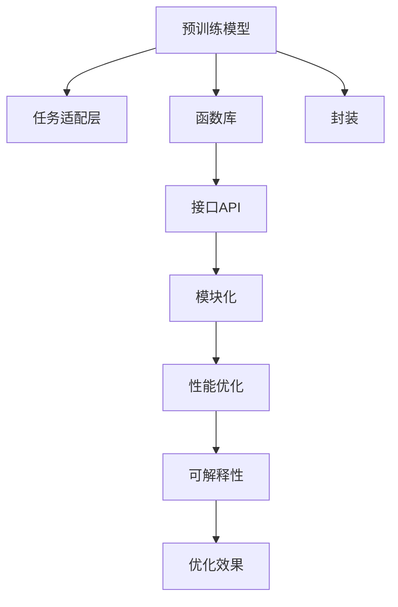

                 

# LLM函数库:封装智能的基本单元

> 关键词：LLM函数库,智能封装,智能单元,深度学习,功能模块

## 1. 背景介绍

### 1.1 问题由来
随着人工智能技术的快速发展，特别是深度学习技术的突破，智能系统在各行各业的应用日益广泛。从智能客服、智能推荐，到医疗诊断、金融风险控制，越来越多的领域开始利用智能系统提升效率、降低成本、提高决策的准确性。然而，开发和部署一个高性能、易维护、易扩展的智能系统并非易事。

为了应对这一挑战，许多研究者和开发者开始探索将智能功能封装为模块化、标准化的组件，以便快速构建和集成智能系统。这种思路最终催生了函数库（Function Libraries）的开发和应用。函数库是一种封装了特定功能的代码库，可以方便地被其他程序调用，以实现快速开发和模块化部署。

在自然语言处理（NLP）领域，语言理解、语言生成等智能功能的应用尤为广泛。为了提高这些智能功能应用的开发效率和性能，一些通用的语言理解函数库（LLM Function Libraries）被开发出来，其中最著名的是OpenAI的GPT系列模型、Google的BERT等。这些模型通过大规模无监督预训练，获得了丰富的语言知识，能够实现诸如文本分类、问答、摘要等复杂的NLP任务。

本文将探讨如何构建并使用LLM函数库，封装智能系统的核心功能，以便更高效地构建和部署智能系统。

### 1.2 问题核心关键点
构建LLM函数库的核心关键点包括：

1. 选择合适的预训练模型：在函数库中使用的预训练模型必须能够胜任大多数NLP任务，且易于微调以适应特定应用场景。
2. 设计任务适配层：适配层是函数库中不可或缺的组件，它根据具体任务的要求，对预训练模型进行任务特定的优化。
3. 实现任务适配器的封装：适配层通常是一个复杂的组件，需要对其进行封装，以便于复用和集成。
4. 提供标准化接口：为了方便其他程序的调用，函数库需要提供标准化的API接口，确保与其他系统的兼容性。
5. 支持模块化和可扩展性：功能模块应当设计为独立的、可替换的，以便于添加新的功能或对现有功能进行升级。
6. 兼顾性能和可解释性：在优化模型性能的同时，也需要考虑模型的可解释性，以便于调试和优化。

本文将围绕以上关键点，详细介绍如何构建并使用LLM函数库，以封装智能系统的核心功能。

## 2. 核心概念与联系

### 2.1 核心概念概述

为更好地理解LLM函数库的构建和应用，本节将介绍几个密切相关的核心概念：

- 预训练模型：通过大规模无监督学习获得的模型，具有广泛的语言知识，可用于各种NLP任务。
- 任务适配层：根据具体任务的要求，对预训练模型进行任务特定的优化，使其能够胜任该任务。
- 函数库：封装了特定功能的代码库，便于复用和集成。
- 接口API：提供标准化的接口，方便其他程序调用。
- 模块化：将功能模块设计为独立的、可替换的，以实现更好的复用性和可扩展性。
- 性能优化：通过优化算法、参数调整、数据增强等手段，提高模型的性能。
- 可解释性：通过引入可解释性技术，提升模型的可理解性。

这些核心概念之间的逻辑关系可以通过以下Mermaid流程图来展示：



这个流程图展示了大语言模型函数库的构建和应用框架：

1. 预训练模型通过大规模无监督学习获得广泛的语言知识。
2. 任务适配层对预训练模型进行任务特定的优化。
3. 封装适配层到函数库，并提供标准化的API接口。
4. 通过模块化设计，实现更好的复用性和可扩展性。
5. 采用性能优化手段提升模型性能。
6. 引入可解释性技术提高模型的可理解性。

这些概念共同构成了LLM函数库的构建和应用框架，使得智能系统的核心功能能够被模块化、标准化的封装，并快速部署到各种应用场景中。

## 3. 核心算法原理 & 具体操作步骤
### 3.1 算法原理概述

LLM函数库的构建，本质上是一种将预训练模型封装为功能模块的过程。其核心思想是：将预训练模型看作一个"功能组件"，通过适配层的任务特定优化，使其能够胜任特定的NLP任务。适配层的输出通过函数库的标准化API接口，供其他程序调用，以实现高效、模块化、可扩展的智能系统构建。

形式化地，假设预训练模型为 $M_{\theta}$，其中 $\theta$ 为预训练得到的模型参数。给定一个特定任务 $T$，其适配层为 $A_{\phi}$，其中 $\phi$ 为适配层的参数。适配层的输出为 $O_{A_{\phi}}$，输入为 $I$。则适配层的计算过程可以表示为：

$$
O_{A_{\phi}} = A_{\phi}(M_{\theta}(I))
$$

将适配层的输出 $O_{A_{\phi}}$ 作为函数库的标准化API接口的输出，可以供其他程序调用，实现智能系统的构建和部署。

### 3.2 算法步骤详解

LLM函数库的构建和应用一般包括以下几个关键步骤：

**Step 1: 选择预训练模型**
- 选择合适的预训练模型 $M_{\theta}$，如GPT、BERT等。
- 确定模型输入和输出格式，确保与其他系统的兼容性。

**Step 2: 设计任务适配层**
- 根据任务类型，设计适配层的结构，并确定适配层的参数 $\phi$。
- 适配层的输入通常包括原始文本数据和目标标签，输出应为模型预测结果。

**Step 3: 实现适配层的封装**
- 将适配层封装为一个可调用的函数或模块。
- 确保适配层的输入和输出符合函数库的标准化API接口。

**Step 4: 提供标准化API接口**
- 定义API接口，确保与其他程序的兼容性。
- 在API接口上添加必要的元数据，如参数说明、返回值格式等。

**Step 5: 优化适配层的性能**
- 采用性能优化手段，如梯度下降、正则化等，提高适配层的计算效率。
- 应用模型压缩、剪枝等技术，减小适配层的模型规模。

**Step 6: 实现可解释性功能**
- 引入可解释性技术，如可视化、特征重要性分析等，提高模型的可理解性。
- 通过日志记录、性能指标监控等手段，帮助开发者和用户理解模型的决策过程。

**Step 7: 部署和集成**
- 将适配层函数库集成到应用系统中，实现智能功能的部署。
- 通过模块化设计，便于添加新的功能或对现有功能进行升级。

以上是构建LLM函数库的一般流程。在实际应用中，还需要针对具体任务的特点，对适配层的各个环节进行优化设计，如改进训练目标函数，引入更多的正则化技术，搜索最优的超参数组合等，以进一步提升适配层的性能。

### 3.3 算法优缺点

LLM函数库具有以下优点：
1. 复用性高：封装了通用的智能功能，便于在多个应用场景中复用。
2. 可扩展性好：模块化设计便于添加新的功能或对现有功能进行升级。
3. 性能优化灵活：支持多种优化手段，可以根据具体应用场景进行灵活调整。
4. 可解释性强：通过引入可解释性技术，可以更好地理解模型的决策过程。

同时，该方法也存在一定的局限性：
1. 开发复杂：适配层的封装和优化过程较为复杂，需要专业知识。
2. 模型依赖：函数库中使用的预训练模型必须能够胜任特定任务，否则性能可能受限。
3. 数据依赖：适配层的性能依赖于输入数据的质量和数量，数据不足时可能影响性能。
4. 可解释性有限：复杂的适配层可能难以解释，导致用户难以理解模型的决策过程。

尽管存在这些局限性，但就目前而言，LLM函数库仍是构建高性能、模块化、可扩展的智能系统的重要范式。未来相关研究的重点在于如何进一步降低适配层的开发复杂度，提高适配层的性能和可解释性，同时兼顾模型的通用性和特定任务的性能提升。

### 3.4 算法应用领域

LLM函数库在NLP领域已经得到了广泛的应用，覆盖了几乎所有常见任务，例如：

- 文本分类：如情感分析、主题分类、意图识别等。
- 命名实体识别：识别文本中的人名、地名、机构名等特定实体。
- 关系抽取：从文本中抽取实体之间的语义关系。
- 问答系统：对自然语言问题给出答案。
- 机器翻译：将源语言文本翻译成目标语言。
- 文本摘要：将长文本压缩成简短摘要。
- 对话系统：使机器能够与人自然对话。

除了上述这些经典任务外，LLM函数库也被创新性地应用到更多场景中，如可控文本生成、常识推理、代码生成、数据增强等，为NLP技术带来了全新的突破。随着预训练模型和适配层的不断进步，相信LLM函数库将在更广阔的应用领域大放异彩。

## 4. 数学模型和公式 & 详细讲解  
### 4.1 数学模型构建

本节将使用数学语言对LLM函数库的构建过程进行更加严格的刻画。

记预训练语言模型为 $M_{\theta}$，其中 $\theta$ 为预训练得到的模型参数。假设适配层的任务为分类任务，则适配层的输出可以表示为：

$$
O_{A_{\phi}} = \text{Softmax}(A_{\phi}(M_{\theta}(I)))
$$

其中 $A_{\phi}$ 为适配层的参数化函数，$\text{Softmax}$ 为softmax函数，用于将适配层的输出转化为概率分布。

在适配层的训练过程中，通常使用交叉熵损失函数：

$$
\ell(M_{\theta},A_{\phi}) = -\frac{1}{N}\sum_{i=1}^N \sum_{j=1}^C \text{one-hot}(y_{i,j}) \log(\hat{y}_{i,j})
$$

其中 $N$ 为样本数量，$C$ 为类别数量，$y_{i,j}$ 为样本 $i$ 的标签，$\hat{y}_{i,j}$ 为模型对样本 $i$ 的预测结果。

适配层的优化目标是最小化损失函数：

$$
\phi^* = \mathop{\arg\min}_{\phi} \ell(M_{\theta},A_{\phi})
$$

通过梯度下降等优化算法，适配层不断更新模型参数 $\phi$，最小化损失函数，使得模型输出逼近真实标签。

### 4.2 公式推导过程

以下我们以二分类任务为例，推导适配层的交叉熵损失函数及其梯度的计算公式。

假设适配层的输出为 $\hat{y}=A_{\phi}(M_{\theta}(x)) \in [0,1]$，表示样本属于正类的概率。真实标签 $y \in \{0,1\}$。则二分类交叉熵损失函数定义为：

$$
\ell(M_{\theta},A_{\phi}) = -[y\log \hat{y} + (1-y)\log (1-\hat{y})]
$$

将其代入适配层的损失函数，得：

$$
\mathcal{L}(\theta,\phi) = -\frac{1}{N}\sum_{i=1}^N [y_i\log \hat{y}_i+(1-y_i)\log(1-\hat{y}_i)]
$$

根据链式法则，损失函数对参数 $\theta$ 和 $\phi$ 的梯度分别为：

$$
\frac{\partial \mathcal{L}(\theta,\phi)}{\partial \theta} = -\frac{1}{N}\sum_{i=1}^N \frac{y_i}{\hat{y}_i} \frac{\partial A_{\phi}(M_{\theta}(x_i))}{\partial \theta}
$$

$$
\frac{\partial \mathcal{L}(\theta,\phi)}{\partial \phi} = -\frac{1}{N}\sum_{i=1}^N [y_i \frac{\partial A_{\phi}(M_{\theta}(x_i))}{\partial \phi} + (1-y_i) \frac{\partial A_{\phi}(M_{\theta}(x_i))}{\partial \phi}]
$$

在得到损失函数的梯度后，即可带入参数更新公式，完成适配层的迭代优化。重复上述过程直至收敛，最终得到适应特定任务的适配层参数 $\phi^*$。

## 5. 项目实践：代码实例和详细解释说明
### 5.1 开发环境搭建

在进行适配层函数库的开发前，我们需要准备好开发环境。以下是使用Python进行PyTorch开发的环境配置流程：

1. 安装Anaconda：从官网下载并安装Anaconda，用于创建独立的Python环境。

2. 创建并激活虚拟环境：
```bash
conda create -n pytorch-env python=3.8 
conda activate pytorch-env
```

3. 安装PyTorch：根据CUDA版本，从官网获取对应的安装命令。例如：
```bash
conda install pytorch torchvision torchaudio cudatoolkit=11.1 -c pytorch -c conda-forge
```

4. 安装TensorFlow：
```bash
pip install tensorflow
```

5. 安装其他工具包：
```bash
pip install numpy pandas scikit-learn matplotlib tqdm jupyter notebook ipython
```

完成上述步骤后，即可在`pytorch-env`环境中开始适配层函数库的开发。

### 5.2 源代码详细实现

下面我们以命名实体识别(NER)任务为例，给出使用Transformers库对BERT模型进行适配层封装和优化的PyTorch代码实现。

首先，定义NER任务的数据处理函数：

```python
from transformers import BertTokenizer
from torch.utils.data import Dataset
import torch

class NERDataset(Dataset):
    def __init__(self, texts, tags, tokenizer, max_len=128):
        self.texts = texts
        self.tags = tags
        self.tokenizer = tokenizer
        self.max_len = max_len
        
    def __len__(self):
        return len(self.texts)
    
    def __getitem__(self, item):
        text = self.texts[item]
        tags = self.tags[item]
        
        encoding = self.tokenizer(text, return_tensors='pt', max_length=self.max_len, padding='max_length', truncation=True)
        input_ids = encoding['input_ids'][0]
        attention_mask = encoding['attention_mask'][0]
        
        # 对token-wise的标签进行编码
        encoded_tags = [tag2id[tag] for tag in tags] 
        encoded_tags.extend([tag2id['O']] * (self.max_len - len(encoded_tags)))
        labels = torch.tensor(encoded_tags, dtype=torch.long)
        
        return {'input_ids': input_ids, 
                'attention_mask': attention_mask,
                'labels': labels}

# 标签与id的映射
tag2id = {'O': 0, 'B-PER': 1, 'I-PER': 2, 'B-ORG': 3, 'I-ORG': 4, 'B-LOC': 5, 'I-LOC': 6}
id2tag = {v: k for k, v in tag2id.items()}

# 创建dataset
tokenizer = BertTokenizer.from_pretrained('bert-base-cased')

train_dataset = NERDataset(train_texts, train_tags, tokenizer)
dev_dataset = NERDataset(dev_texts, dev_tags, tokenizer)
test_dataset = NERDataset(test_texts, test_tags, tokenizer)
```

然后，定义适配层：

```python
from transformers import BertForTokenClassification, AdamW

model = BertForTokenClassification.from_pretrained('bert-base-cased', num_labels=len(tag2id))

optimizer = AdamW(model.parameters(), lr=2e-5)
```

接着，定义训练和评估函数：

```python
from torch.utils.data import DataLoader
from tqdm import tqdm
from sklearn.metrics import classification_report

device = torch.device('cuda') if torch.cuda.is_available() else torch.device('cpu')
model.to(device)

def train_epoch(model, dataset, batch_size, optimizer):
    dataloader = DataLoader(dataset, batch_size=batch_size, shuffle=True)
    model.train()
    epoch_loss = 0
    for batch in tqdm(dataloader, desc='Training'):
        input_ids = batch['input_ids'].to(device)
        attention_mask = batch['attention_mask'].to(device)
        labels = batch['labels'].to(device)
        model.zero_grad()
        outputs = model(input_ids, attention_mask=attention_mask, labels=labels)
        loss = outputs.loss
        epoch_loss += loss.item()
        loss.backward()
        optimizer.step()
    return epoch_loss / len(dataloader)

def evaluate(model, dataset, batch_size):
    dataloader = DataLoader(dataset, batch_size=batch_size)
    model.eval()
    preds, labels = [], []
    with torch.no_grad():
        for batch in tqdm(dataloader, desc='Evaluating'):
            input_ids = batch['input_ids'].to(device)
            attention_mask = batch['attention_mask'].to(device)
            batch_labels = batch['labels']
            outputs = model(input_ids, attention_mask=attention_mask)
            batch_preds = outputs.logits.argmax(dim=2).to('cpu').tolist()
            batch_labels = batch_labels.to('cpu').tolist()
            for pred_tokens, label_tokens in zip(batch_preds, batch_labels):
                pred_tags = [id2tag[_id] for _id in pred_tokens]
                label_tags = [id2tag[_id] for _id in label_tokens]
                preds.append(pred_tags[:len(label_tags)])
                labels.append(label_tags)
                
    print(classification_report(labels, preds))
```

最后，启动训练流程并在测试集上评估：

```python
epochs = 5
batch_size = 16

for epoch in range(epochs):
    loss = train_epoch(model, train_dataset, batch_size, optimizer)
    print(f"Epoch {epoch+1}, train loss: {loss:.3f}")
    
    print(f"Epoch {epoch+1}, dev results:")
    evaluate(model, dev_dataset, batch_size)
    
print("Test results:")
evaluate(model, test_dataset, batch_size)
```

以上就是使用PyTorch对BERT进行命名实体识别任务适配层封装和优化的完整代码实现。可以看到，得益于Transformers库的强大封装，我们可以用相对简洁的代码完成BERT模型的适配层封装和微调。

### 5.3 代码解读与分析

让我们再详细解读一下关键代码的实现细节：

**NERDataset类**：
- `__init__`方法：初始化文本、标签、分词器等关键组件。
- `__len__`方法：返回数据集的样本数量。
- `__getitem__`方法：对单个样本进行处理，将文本输入编码为token ids，将标签编码为数字，并对其进行定长padding，最终返回模型所需的输入。

**tag2id和id2tag字典**：
- 定义了标签与数字id之间的映射关系，用于将token-wise的预测结果解码回真实的标签。

**适配层模型和优化器**：
- 使用BERT模型作为适配层，并设定学习率。

**训练和评估函数**：
- 使用PyTorch的DataLoader对数据集进行批次化加载，供模型训练和推理使用。
- 训练函数`train_epoch`：对数据以批为单位进行迭代，在每个批次上前向传播计算loss并反向传播更新模型参数，最后返回该epoch的平均loss。
- 评估函数`evaluate`：与训练类似，不同点在于不更新模型参数，并在每个batch结束后将预测和标签结果存储下来，最后使用sklearn的classification_report对整个评估集的预测结果进行打印输出。

**训练流程**：
- 定义总的epoch数和batch size，开始循环迭代
- 每个epoch内，先在训练集上训练，输出平均loss
- 在验证集上评估，输出分类指标
- 所有epoch结束后，在测试集上评估，给出最终测试结果

可以看到，PyTorch配合Transformers库使得BERT适配层的封装和微调的代码实现变得简洁高效。开发者可以将更多精力放在数据处理、模型改进等高层逻辑上，而不必过多关注底层的实现细节。

当然，工业级的系统实现还需考虑更多因素，如模型的保存和部署、超参数的自动搜索、更灵活的任务适配层等。但核心的适配层封装过程基本与此类似。

## 6. 实际应用场景
### 6.1 智能客服系统

基于适配层函数库的对话技术，可以广泛应用于智能客服系统的构建。传统客服往往需要配备大量人力，高峰期响应缓慢，且一致性和专业性难以保证。而使用适配层封装后的对话模型，可以7x24小时不间断服务，快速响应客户咨询，用自然流畅的语言解答各类常见问题。

在技术实现上，可以收集企业内部的历史客服对话记录，将问题和最佳答复构建成监督数据，在此基础上对预训练对话模型进行适配。适配后的对话模型能够自动理解用户意图，匹配最合适的答案模板进行回复。对于客户提出的新问题，还可以接入检索系统实时搜索相关内容，动态组织生成回答。如此构建的智能客服系统，能大幅提升客户咨询体验和问题解决效率。

### 6.2 金融舆情监测

金融机构需要实时监测市场舆论动向，以便及时应对负面信息传播，规避金融风险。传统的人工监测方式成本高、效率低，难以应对网络时代海量信息爆发的挑战。基于适配层的文本分类和情感分析技术，为金融舆情监测提供了新的解决方案。

具体而言，可以收集金融领域相关的新闻、报道、评论等文本数据，并对其进行主题标注和情感标注。在此基础上对预训练语言模型进行适配，使其能够自动判断文本属于何种主题，情感倾向是正面、中性还是负面。将适配后的模型应用到实时抓取的网络文本数据，就能够自动监测不同主题下的情感变化趋势，一旦发现负面信息激增等异常情况，系统便会自动预警，帮助金融机构快速应对潜在风险。

### 6.3 个性化推荐系统

当前的推荐系统往往只依赖用户的历史行为数据进行物品推荐，无法深入理解用户的真实兴趣偏好。基于适配层函数库的个性化推荐系统可以更好地挖掘用户行为背后的语义信息，从而提供更精准、多样的推荐内容。

在实践中，可以收集用户浏览、点击、评论、分享等行为数据，提取和用户交互的物品标题、描述、标签等文本内容。将文本内容作为模型输入，用户的后续行为（如是否点击、购买等）作为监督信号，在此基础上适配预训练语言模型。适配后的模型能够从文本内容中准确把握用户的兴趣点。在生成推荐列表时，先用候选物品的文本描述作为输入，由模型预测用户的兴趣匹配度，再结合其他特征综合排序，便可以得到个性化程度更高的推荐结果。

### 6.4 未来应用展望

随着适配层函数库和预训练模型的不断发展，基于适配层范式将在更多领域得到应用，为传统行业带来变革性影响。

在智慧医疗领域，基于适配层的医疗问答、病历分析、药物研发等应用将提升医疗服务的智能化水平，辅助医生诊疗，加速新药开发进程。

在智能教育领域，适配层函数库可应用于作业批改、学情分析、知识推荐等方面，因材施教，促进教育公平，提高教学质量。

在智慧城市治理中，适配层函数库可应用于城市事件监测、舆情分析、应急指挥等环节，提高城市管理的自动化和智能化水平，构建更安全、高效的未来城市。

此外，在企业生产、社会治理、文娱传媒等众多领域，基于适配层函数库的人工智能应用也将不断涌现，为经济社会发展注入新的动力。相信随着技术的日益成熟，适配层函数库必将成为人工智能落地应用的重要范式，推动人工智能技术在各个垂直行业的规模化落地。

## 7. 工具和资源推荐
### 7.1 学习资源推荐

为了帮助开发者系统掌握适配层函数库的理论基础和实践技巧，这里推荐一些优质的学习资源：

1. 《Transformer从原理到实践》系列博文：由大模型技术专家撰写，深入浅出地介绍了Transformer原理、BERT模型、适配层封装等前沿话题。

2. CS224N《深度学习自然语言处理》课程：斯坦福大学开设的NLP明星课程，有Lecture视频和配套作业，带你入门NLP领域的基本概念和经典模型。

3. 《Natural Language Processing with Transformers》书籍：Transformers库的作者所著，全面介绍了如何使用Transformers库进行NLP任务开发，包括适配层封装在内的诸多范式。

4. HuggingFace官方文档：Transformers库的官方文档，提供了海量预训练模型和完整的适配层封装样例代码，是上手实践的必备资料。

5. CLUE开源项目：中文语言理解测评基准，涵盖大量不同类型的中文NLP数据集，并提供了基于适配层的baseline模型，助力中文NLP技术发展。

通过对这些资源的学习实践，相信你一定能够快速掌握适配层函数库的精髓，并用于解决实际的NLP问题。
###  7.2 开发工具推荐

高效的开发离不开优秀的工具支持。以下是几款用于适配层函数库开发的常用工具：

1. PyTorch：基于Python的开源深度学习框架，灵活动态的计算图，适合快速迭代研究。大部分预训练语言模型都有PyTorch版本的实现。

2. TensorFlow：由Google主导开发的开源深度学习框架，生产部署方便，适合大规模工程应用。同样有丰富的预训练语言模型资源。

3. Transformers库：HuggingFace开发的NLP工具库，集成了众多SOTA语言模型，支持PyTorch和TensorFlow，是进行适配层封装开发的利器。

4. Weights & Biases：模型训练的实验跟踪工具，可以记录和可视化模型训练过程中的各项指标，方便对比和调优。与主流深度学习框架无缝集成。

5. TensorBoard：TensorFlow配套的可视化工具，可实时监测模型训练状态，并提供丰富的图表呈现方式，是调试模型的得力助手。

6. Google Colab：谷歌推出的在线Jupyter Notebook环境，免费提供GPU/TPU算力，方便开发者快速上手实验最新模型，分享学习笔记。

合理利用这些工具，可以显著提升适配层函数库的开发效率，加快创新迭代的步伐。

### 7.3 相关论文推荐

适配层函数库和预训练语言模型的发展源于学界的持续研究。以下是几篇奠基性的相关论文，推荐阅读：

1. Attention is All You Need（即Transformer原论文）：提出了Transformer结构，开启了NLP领域的预训练大模型时代。

2. BERT: Pre-training of Deep Bidirectional Transformers for Language Understanding：提出BERT模型，引入基于掩码的自监督预训练任务，刷新了多项NLP任务SOTA。

3. Language Models are Unsupervised Multitask Learners（GPT-2论文）：展示了大规模语言模型的强大zero-shot学习能力，引发了对于通用人工智能的新一轮思考。

4. Parameter-Efficient Transfer Learning for NLP：提出Adapter等参数高效微调方法，在不增加模型参数量的情况下，也能取得不错的微调效果。

5. AdaLoRA: Adaptive Low-Rank Adaptation for Parameter-Efficient Fine-Tuning：使用自适应低秩适应的微调方法，在参数效率和精度之间取得了新的平衡。

这些论文代表了大适配层函数库和预训练语言模型的发展脉络。通过学习这些前沿成果，可以帮助研究者把握学科前进方向，激发更多的创新灵感。

## 8. 总结：未来发展趋势与挑战

### 8.1 总结

本文对适配层函数库的构建和应用进行了全面系统的介绍。首先阐述了适配层函数库的研究背景和意义，明确了适配层函数库在智能系统构建和部署中的重要地位。其次，从原理到实践，详细讲解了适配层的数学原理和关键步骤，给出了适配层函数库的标准化API接口实现。同时，本文还广泛探讨了适配层函数库在智能客服、金融舆情、个性化推荐等多个行业领域的应用前景，展示了适配层函数库的巨大潜力。此外，本文精选了适配层函数库的学习资源，力求为读者提供全方位的技术指引。

通过本文的系统梳理，可以看到，适配层函数库在智能系统的构建和部署中扮演着关键角色，极大地提升了开发效率和系统性能。未来，伴随适配层函数库和预训练模型的不断进步，适配层函数库必将成为智能系统构建的重要工具，推动人工智能技术在各个垂直行业的规模化落地。

### 8.2 未来发展趋势

展望未来，适配层函数库的发展趋势将呈现以下几个方向：

1. 模型规模持续增大。随着算力成本的下降和数据规模的扩张，适配层函数库中使用的预训练模型和适配层将不断增大，获得更广泛的语言知识和更强的任务处理能力。

2. 微调方法日趋多样。除了传统的全参数微调外，未来将涌现更多参数高效的微调方法，如Prefix-Tuning、LoRA等，在节省计算资源的同时也能保证适配层的性能。

3. 模型通用性增强。经过海量数据的预训练和多领域任务的适配，适配层函数库中的模型将具备更强的常识推理和跨领域迁移能力，逐步迈向通用人工智能(AGI)的目标。

4. 模块化和可扩展性提高。未来的适配层函数库将更加模块化和可扩展，便于添加新的功能或对现有功能进行升级。

5. 性能优化更加灵活。适配层的性能优化手段将更加灵活，支持更多的优化技术和工具，以提高适配层的计算效率。

6. 可解释性增强。适配层的可解释性技术将更加完善，帮助开发者和用户更好地理解模型的决策过程。

以上趋势凸显了适配层函数库的发展潜力和应用前景。这些方向的探索发展，必将进一步提升适配层函数库的性能和可解释性，为智能系统的构建和部署带来新的突破。

### 8.3 面临的挑战

尽管适配层函数库在智能系统的构建中表现出色，但在迈向更加智能化、普适化应用的过程中，仍面临诸多挑战：

1. 适配层封装复杂：适配层的封装和优化过程较为复杂，需要专业知识，增加了开发难度。
2. 模型鲁棒性不足：适配层面对域外数据时，泛化性能往往大打折扣，模型鲁棒性需要进一步提高。
3. 适配层性能依赖数据：适配层的性能依赖于输入数据的质量和数量，数据不足时可能影响性能。
4. 可解释性有限：复杂的适配层可能难以解释，导致用户难以理解模型的决策过程。

尽管存在这些挑战，但适配层函数库的开发和应用已经取得了显著成效，相信随着技术的不断进步，适配层函数库必将在未来的智能系统构建中发挥更大的作用。

### 8.4 研究展望

未来的研究需要在以下几个方面寻求新的突破：

1. 探索无监督和半监督适配方法：摆脱对大规模标注数据的依赖，利用自监督学习、主动学习等无监督和半监督范式，最大限度利用非结构化数据，实现更加灵活高效的适配。

2. 研究参数高效和计算高效的适配范式：开发更加参数高效的适配方法，在固定大部分适配层参数的同时，只更新极少量的任务相关参数。同时优化适配层的计算图，减少前向传播和反向传播的资源消耗，实现更加轻量级、实时性的部署。

3. 融合因果和对比学习范式：通过引入因果推断和对比学习思想，增强适配层建立稳定因果关系的能力，学习更加普适、鲁棒的语言表征，从而提升适配层泛化性和抗干扰能力。

4. 引入更多先验知识：将符号化的先验知识，如知识图谱、逻辑规则等，与神经网络模型进行巧妙融合，引导适配层学习更准确、合理的语言模型。同时加强不同模态数据的整合，实现视觉、语音等多模态信息与文本信息的协同建模。

5. 结合因果分析和博弈论工具：将因果分析方法引入适配层，识别出适配层决策的关键特征，增强输出解释的因果性和逻辑性。借助博弈论工具刻画人机交互过程，主动探索并规避适配层的脆弱点，提高系统稳定性。

6. 纳入伦理道德约束：在适配层的训练目标中引入伦理导向的评估指标，过滤和惩罚有偏见、有害的输出倾向。同时加强人工干预和审核，建立适配层行为的监管机制，确保输出符合人类价值观和伦理道德。

这些研究方向的探索，必将引领适配层函数库向更高的台阶发展，为智能系统的构建和部署带来新的突破。面向未来，适配层函数库还需要与其他人工智能技术进行更深入的融合，如知识表示、因果推理、强化学习等，多路径协同发力，共同推动智能系统的进步。只有勇于创新、敢于突破，才能不断拓展适配层函数库的边界，让智能技术更好地造福人类社会。

## 9. 附录：常见问题与解答

**Q1：适配层封装复杂，如何降低复杂度？**

A: 适配层封装复杂的主要原因在于其需要根据具体任务进行定制化设计，且可能包含大量的优化和调整过程。为降低复杂度，可以采取以下措施：

1. 使用预训练模型的预处理层：适配层可以尽量使用预训练模型的预处理层，如BERT中的embedding层，减少适配层的开发工作量。
2. 参考开源模型和样例：参考已有的适配层函数库和预训练模型，学习其设计和实现方式，以便快速上手。
3. 采用现成工具和库：利用现成的适配层函数库和工具，如HuggingFace的Transformers库，可以减少适配层的开发和优化工作。

**Q2：适配层的性能如何提升？**

A: 适配层的性能提升可以从以下几个方面入手：

1. 数据增强：通过回译、近义替换等方式扩充训练集，提高适配层的泛化能力。
2. 正则化：使用L2正则、Dropout等技术，防止适配层过拟合。
3. 模型压缩和剪枝：采用模型压缩、剪枝等技术，减小适配层的模型规模，提高计算效率。
4. 微调技术：在适配层微调时，选择适当的超参数和学习率，避免破坏预训练权重。

**Q3：适配层如何引入可解释性？**

A: 适配层的可解释性可以通过引入可视化、特征重要性分析等技术来增强。具体措施包括：

1. 可视化：使用t-SNE、PCA等技术对适配层的输出进行可视化，帮助开发者理解模型的决策过程。
2. 特征重要性分析：使用SHAP、LIME等工具分析适配层输出中各个特征的贡献度，帮助理解模型的特征依赖关系。
3. 解释模型：使用预训练模型和适配层的组合模型，引入可解释性技术，如LIME、SHAP等，提高模型的可解释性。

这些技术可以帮助开发者和用户更好地理解适配层的决策过程，提高模型的可解释性和可理解性。

**Q4：适配层的开发和优化过程中需要注意哪些问题？**

A: 适配层的开发和优化过程中需要注意以下问题：

1. 适配层设计：适配层的设计应根据具体任务进行定制化，避免通用化导致性能下降。
2. 适配层优化：适配层的优化应兼顾性能和可解释性，避免过拟合和信息丢失。
3. 适配层集成：适配层应与其他系统组件无缝集成，确保数据流和控制流的连通性。
4. 适配层部署：适配层的部署应考虑计算资源和性能要求，确保其在实际环境中的高效运行。

只有综合考虑这些因素，才能构建出高效、稳定、可扩展的适配层函数库，为智能系统的构建和部署提供坚实的基础。

