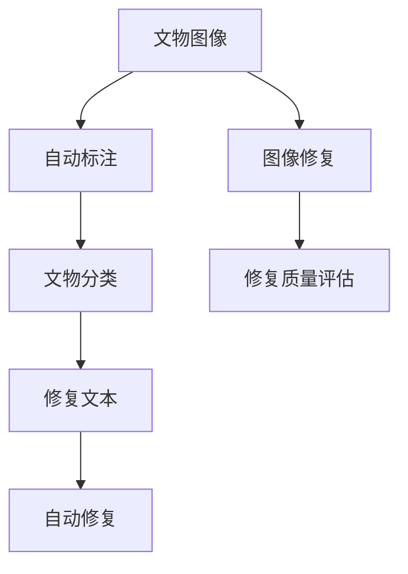

                 

# LLM在文物保护中的应用：AI修复专家

> 关键词：人工智能, 文物保护, 自然语言处理, 图像处理, 深度学习, 自动修复, 修复精度, 文物保护数字化

## 1. 背景介绍

### 1.1 问题由来
文化遗产是人类文明的重要载体，记录了丰富的历史信息。然而，由于环境因素、人为因素等多方面的影响，大量文物存在不同程度的损坏。传统文物保护修复工作依赖于文物修复师的经验和技能，耗时长、成本高、可重复性差。因此，利用人工智能技术辅助文物保护修复，成为当前文物保护领域的重要研究方向。

近年来，随着深度学习和大语言模型(LLM)的快速发展，利用AI技术进行文物保护修复已经成为可能。通过将大语言模型应用于文物保护修复，可以提升修复效率，降低修复成本，提高修复质量和精度。大语言模型在文物保护修复中的应用，包括对文物图像的自动识别、分类、标注，以及对修复文本的生成、自动修复，为文物保护提供了新的技术手段和研究方向。

### 1.2 问题核心关键点
大语言模型在文物保护修复中的应用，主要集中在以下几个关键点：

- 文物图像自动标注：利用大语言模型对文物图像进行自动分类和标注，提取文物图像特征，为后续修复工作提供数据支持。
- 修复文本自动生成：基于大语言模型，生成修复工艺步骤、材料选择、操作说明等文本信息，指导修复师进行具体操作。
- 自动修复技术：利用大语言模型和图像处理技术，实现对文物图像的自动修复，提升修复效率和效果。
- 修复质量评估：利用大语言模型进行修复质量的评估和反馈，确保修复效果满足文物保护要求。

这些关键点共同构成了大语言模型在文物保护修复中的应用框架，为其提供了强大的技术支撑。

### 1.3 问题研究意义
大语言模型在文物保护修复中的应用，具有重要的理论和实践意义：

1. **提升修复效率**：大语言模型可以快速处理大量文物图像，自动化标注和生成修复文本，大幅提升修复效率，降低人工劳动强度。
2. **降低修复成本**：AI修复技术可以降低对人力、物力和财力的依赖，降低修复成本，提高文物保护的经济性。
3. **提高修复质量**：大语言模型可以提供精确的修复指导和建议，确保修复过程的科学性和规范性，提升修复质量。
4. **促进数字化保护**：通过大语言模型的应用，可以实现文物保护的数字化转型，建立数字博物馆，方便公众获取和欣赏文物。
5. **保障文化遗产安全**：AI修复技术可以长期持续地对文物进行监测和维护，有效防止文物进一步损坏，保障文化遗产的安全。

## 2. 核心概念与联系

### 2.1 核心概念概述

为了更好地理解大语言模型在文物保护中的应用，本节将介绍几个核心概念：

- **大语言模型(Large Language Model, LLM)**：以自回归(如GPT)或自编码(如BERT)模型为代表的大规模预训练语言模型。通过在大规模无标签文本数据上进行预训练，学习通用的语言表示，具备强大的语言理解和生成能力。

- **文物修复**：指对受损文物进行物理修复、化学处理、科学实验等操作，恢复文物的原貌和功能。

- **文物图像自动标注**：利用计算机视觉和大语言模型对文物图像进行自动识别、分类和标注，提取文物图像特征，为后续修复工作提供数据支持。

- **修复文本自动生成**：基于大语言模型，生成修复工艺步骤、材料选择、操作说明等文本信息，指导修复师进行具体操作。

- **自动修复技术**：利用大语言模型和图像处理技术，实现对文物图像的自动修复，提升修复效率和效果。

- **修复质量评估**：利用大语言模型进行修复质量的评估和反馈，确保修复效果满足文物保护要求。

这些核心概念之间的逻辑关系可以通过以下Mermaid流程图来展示：



这个流程图展示了文物修复过程中的各个环节及其相互关系：

1. 文物图像输入
2. 自动标注和分类
3. 修复文本自动生成
4. 自动修复技术
5. 修复质量评估

这些环节共同构成了大语言模型在文物保护修复中的应用框架，为其提供了强大的技术支撑。

## 3. 核心算法原理 & 具体操作步骤
### 3.1 算法原理概述

大语言模型在文物保护修复中的应用，主要基于以下两个核心原理：

- **计算机视觉和大语言模型的融合**：利用计算机视觉技术提取文物图像特征，再结合大语言模型进行自动标注、分类和修复指导，实现文物修复过程的自动化。
- **自然语言处理和图像处理技术的融合**：利用自然语言处理技术生成修复文本，再结合图像处理技术进行自动修复，实现文物修复的精确和高效。

具体而言，大语言模型在文物保护修复中的应用流程如下：

1. 收集文物图像数据，并进行预处理。
2. 利用计算机视觉技术提取文物图像特征，生成特征向量。
3. 利用大语言模型对文物图像进行自动分类和标注。
4. 基于自动分类和标注结果，利用大语言模型生成修复文本。
5. 结合图像处理技术，对文物图像进行自动修复。
6. 利用大语言模型对修复效果进行评估和反馈。

### 3.2 算法步骤详解

#### 3.2.1 数据收集与预处理

文物图像数据是文物保护修复的基础。需要从博物馆、文化遗产保护机构等渠道，收集大量文物图像，并进行预处理。预处理包括图像去噪、归一化、尺寸调整等操作，确保数据的一致性和质量。

#### 3.2.2 图像特征提取

利用计算机视觉技术，如卷积神经网络(CNN)、深度神经网络(DNN)等，提取文物图像的特征。特征提取的目的是将复杂的图像数据转换为高维特征向量，便于后续的分类和标注。

#### 3.2.3 自动分类与标注

利用大语言模型，如BERT、GPT等，对文物图像进行自动分类和标注。模型通过分析特征向量，结合上下文语境，生成分类结果和标注信息。自动分类和标注的结果可以指导后续的修复工作。

#### 3.2.4 修复文本生成

基于自动分类和标注结果，利用大语言模型生成修复文本。模型通过生成修复工艺步骤、材料选择、操作说明等文本信息，指导修复师进行具体操作。生成文本的过程可以结合自然语言处理技术，如语言模型、生成对抗网络(GAN)等，提高文本生成的质量和准确性。

#### 3.2.5 自动修复

利用大语言模型和图像处理技术，对文物图像进行自动修复。模型通过分析自动分类和标注结果，结合修复文本，生成修复后的图像。自动修复的过程可以结合图像处理技术，如卷积神经网络、变分自编码器(VAE)等，实现对文物图像的高效和精确修复。

#### 3.2.6 修复质量评估

利用大语言模型对自动修复后的图像进行质量评估。模型通过比较修复前后的图像，评估修复效果的优劣，提供修复建议和改进方向。修复质量评估的结果可以反馈到修复过程中，指导修复师进行优化操作，提升修复效果。

### 3.3 算法优缺点

大语言模型在文物保护修复中的应用，具有以下优点：

- **高效自动化**：利用大语言模型和大数据处理技术，可以高效处理大量文物图像，自动化标注和生成修复文本，大幅提升修复效率，降低人工劳动强度。
- **精确指导**：大语言模型可以根据自动分类和标注结果，生成精确的修复文本，指导修复师进行具体操作，确保修复过程的科学性和规范性。
- **可扩展性强**：大语言模型可以通过大规模训练数据进行优化，适应不同类型和风格的文物修复，具有较强的可扩展性。

同时，大语言模型在文物保护修复中也存在一些局限性：

- **依赖数据质量**：文物图像的自动分类和标注结果依赖于数据的质量和特征提取的效果，数据噪声和偏差会影响自动修复的质量。
- **复杂度高**：自动修复的过程涉及计算机视觉、自然语言处理等多个领域的技术，技术难度和实现成本较高。
- **结果解释性差**：自动修复的结果缺乏可解释性，难以理解其内部工作机制和推理逻辑，可能存在误导性。

尽管存在这些局限性，但大语言模型在文物保护修复中的应用，仍具有重要的实际价值和研究意义。

### 3.4 算法应用领域

大语言模型在文物保护修复中的应用，可以广泛应用于以下几个领域：

- **博物馆文物保护**：利用大语言模型和计算机视觉技术，对博物馆中的文物进行自动标注和分类，生成修复文本，指导修复师进行具体操作。
- **考古遗址修复**：在考古遗址修复中，利用大语言模型和图像处理技术，对发现的文物进行自动修复，提升修复效率和效果。
- **历史建筑保护**：对历史建筑中的壁画、雕塑等文物进行自动修复，恢复其历史原貌。
- **艺术品修复**：利用大语言模型和计算机视觉技术，对受损艺术品进行自动修复，恢复其艺术价值。
- **文物数字化**：通过大语言模型和图像处理技术，将文物数字化，建立数字博物馆，方便公众获取和欣赏文物。

以上领域展示了大语言模型在文物保护修复中的应用潜力，为其提供了广阔的发展空间。

## 4. 数学模型和公式 & 详细讲解  
### 4.1 数学模型构建

大语言模型在文物保护修复中的应用，主要涉及以下几个数学模型：

- **图像特征提取模型**：利用卷积神经网络(CNN)或深度神经网络(DNN)等模型，提取文物图像的特征向量。

- **自动分类和标注模型**：利用大语言模型，如BERT、GPT等，对文物图像进行自动分类和标注。

- **修复文本生成模型**：利用大语言模型，生成修复工艺步骤、材料选择、操作说明等文本信息。

- **自动修复模型**：结合图像处理技术，利用深度学习模型，对文物图像进行自动修复。

- **修复质量评估模型**：利用大语言模型，对自动修复后的图像进行质量评估。

### 4.2 公式推导过程

以下我们将以自动分类和标注模型为例，推导其数学模型和公式。

假设文物图像数据集为 $D=\{x_i\}_{i=1}^N$，其中 $x_i$ 为第 $i$ 张文物图像。利用大语言模型 $M_{\theta}$，对图像 $x_i$ 进行分类和标注，得到分类结果 $y_i$ 和标注信息 $z_i$。则自动分类和标注模型的损失函数为：

$$
\mathcal{L}(\theta) = \frac{1}{N} \sum_{i=1}^N \ell(y_i, M_{\theta}(x_i), z_i)
$$

其中，$\ell(y_i, M_{\theta}(x_i), z_i)$ 为分类和标注损失函数，用于衡量模型输出与真实标签之间的差异。常见的损失函数包括交叉熵损失、均方误差损失等。

根据链式法则，损失函数对模型参数 $\theta$ 的梯度为：

$$
\frac{\partial \mathcal{L}(\theta)}{\partial \theta} = \frac{1}{N} \sum_{i=1}^N \frac{\partial \ell(y_i, M_{\theta}(x_i), z_i)}{\partial \theta}
$$

其中，$\frac{\partial \ell(y_i, M_{\theta}(x_i), z_i)}{\partial \theta}$ 为损失函数对模型参数的偏导数，可通过反向传播算法高效计算。

在得到损失函数的梯度后，即可带入优化算法，如Adam、SGD等，最小化损失函数，更新模型参数。重复上述过程直至收敛，最终得到适应文物图像分类和标注的最优模型参数 $\theta^*$。

### 4.3 案例分析与讲解

以考古遗址中的壁画修复为例，分析大语言模型在自动分类和标注中的应用。

考古遗址中的壁画修复涉及多个环节，如壁画清洗、破损修补、颜色恢复等。首先需要对壁画的损伤情况进行自动识别和分类，然后生成相应的修复文本。利用大语言模型，可以通过以下步骤实现自动分类和标注：

1. 收集考古遗址中的壁画图像数据，并进行预处理，如去噪、归一化、尺寸调整等。

2. 利用卷积神经网络(CNN)或深度神经网络(DNN)等模型，提取壁画图像的特征向量。

3. 利用大语言模型，如BERT、GPT等，对壁画图像进行自动分类和标注。模型通过分析特征向量，结合上下文语境，生成分类结果和标注信息。

4. 根据自动分类和标注结果，生成修复文本。例如，生成“壁面清洗”、“破损修补”、“颜色恢复”等操作说明。

5. 结合图像处理技术，对壁画图像进行自动修复。例如，利用图像修复算法，修复壁画上的破损部分，恢复其颜色和细节。

6. 利用大语言模型对修复效果进行评估和反馈。例如，对比修复前后的图像，评估修复效果，提供修复建议和改进方向。

以上案例展示了大语言模型在文物保护修复中的应用流程，展示了其在自动分类和标注、修复文本生成、自动修复等方面的应用潜力。

## 5. 项目实践：代码实例和详细解释说明
### 5.1 开发环境搭建

在进行文物保护修复的AI应用开发前，需要准备好开发环境。以下是使用Python进行PyTorch开发的环境配置流程：

1. 安装Anaconda：从官网下载并安装Anaconda，用于创建独立的Python环境。

2. 创建并激活虚拟环境：
```bash
conda create -n pytorch-env python=3.8 
conda activate pytorch-env
```

3. 安装PyTorch：根据CUDA版本，从官网获取对应的安装命令。例如：
```bash
conda install pytorch torchvision torchaudio cudatoolkit=11.1 -c pytorch -c conda-forge
```

4. 安装Transformer库：
```bash
pip install transformers
```

5. 安装各类工具包：
```bash
pip install numpy pandas scikit-learn matplotlib tqdm jupyter notebook ipython
```

完成上述步骤后，即可在`pytorch-env`环境中开始文物保护修复的AI应用开发。

### 5.2 源代码详细实现

下面我们以壁画修复为例，给出使用Transformers库对BERT模型进行自动分类和标注的PyTorch代码实现。

首先，定义壁画分类和标注的数据处理函数：

```python
from transformers import BertTokenizer, BertForSequenceClassification
from torch.utils.data import Dataset
import torch

class MuralsDataset(Dataset):
    def __init__(self, texts, labels, tokenizer, max_len=128):
        self.texts = texts
        self.labels = labels
        self.tokenizer = tokenizer
        self.max_len = max_len
        
    def __len__(self):
        return len(self.texts)
    
    def __getitem__(self, item):
        text = self.texts[item]
        label = self.labels[item]
        
        encoding = self.tokenizer(text, return_tensors='pt', max_length=self.max_len, padding='max_length', truncation=True)
        input_ids = encoding['input_ids'][0]
        attention_mask = encoding['attention_mask'][0]
        
        # 将标签转换为数字id
        label_id = tag2id[label]
        return {'input_ids': input_ids, 
                'attention_mask': attention_mask,
                'labels': label_id}

# 标签与id的映射
tag2id = {'清洁': 0, '破损修补': 1, '颜色恢复': 2}
id2tag = {v: k for k, v in tag2id.items()}

# 创建dataset
tokenizer = BertTokenizer.from_pretrained('bert-base-cased')

train_dataset = MuralsDataset(train_texts, train_labels, tokenizer)
dev_dataset = MuralsDataset(dev_texts, dev_labels, tokenizer)
test_dataset = MuralsDataset(test_texts, test_labels, tokenizer)
```

然后，定义模型和优化器：

```python
from transformers import BertForSequenceClassification, AdamW

model = BertForSequenceClassification.from_pretrained('bert-base-cased', num_labels=len(tag2id))

optimizer = AdamW(model.parameters(), lr=2e-5)
```

接着，定义训练和评估函数：

```python
from torch.utils.data import DataLoader
from tqdm import tqdm
from sklearn.metrics import classification_report

device = torch.device('cuda') if torch.cuda.is_available() else torch.device('cpu')
model.to(device)

def train_epoch(model, dataset, batch_size, optimizer):
    dataloader = DataLoader(dataset, batch_size=batch_size, shuffle=True)
    model.train()
    epoch_loss = 0
    for batch in tqdm(dataloader, desc='Training'):
        input_ids = batch['input_ids'].to(device)
        attention_mask = batch['attention_mask'].to(device)
        labels = batch['labels'].to(device)
        model.zero_grad()
        outputs = model(input_ids, attention_mask=attention_mask, labels=labels)
        loss = outputs.loss
        epoch_loss += loss.item()
        loss.backward()
        optimizer.step()
    return epoch_loss / len(dataloader)

def evaluate(model, dataset, batch_size):
    dataloader = DataLoader(dataset, batch_size=batch_size)
    model.eval()
    preds, labels = [], []
    with torch.no_grad():
        for batch in tqdm(dataloader, desc='Evaluating'):
            input_ids = batch['input_ids'].to(device)
            attention_mask = batch['attention_mask'].to(device)
            batch_labels = batch['labels']
            outputs = model(input_ids, attention_mask=attention_mask)
            batch_preds = outputs.logits.argmax(dim=2).to('cpu').tolist()
            batch_labels = batch_labels.to('cpu').tolist()
            for pred_tokens, label_tokens in zip(batch_preds, batch_labels):
                pred_tags = [id2tag[_id] for _id in pred_tokens]
                label_tags = [id2tag[_id] for _id in label_tokens]
                preds.append(pred_tags[:len(label_tokens)])
                labels.append(label_tags)
                
    print(classification_report(labels, preds))
```

最后，启动训练流程并在测试集上评估：

```python
epochs = 5
batch_size = 16

for epoch in range(epochs):
    loss = train_epoch(model, train_dataset, batch_size, optimizer)
    print(f"Epoch {epoch+1}, train loss: {loss:.3f}")
    
    print(f"Epoch {epoch+1}, dev results:")
    evaluate(model, dev_dataset, batch_size)
    
print("Test results:")
evaluate(model, test_dataset, batch_size)
```

以上就是使用PyTorch对BERT进行壁画修复的自动分类和标注的完整代码实现。可以看到，得益于Transformers库的强大封装，我们可以用相对简洁的代码完成BERT模型的加载和微调。

### 5.3 代码解读与分析

让我们再详细解读一下关键代码的实现细节：

**MuralsDataset类**：
- `__init__`方法：初始化文本、标签、分词器等关键组件。
- `__len__`方法：返回数据集的样本数量。
- `__getitem__`方法：对单个样本进行处理，将文本输入编码为token ids，将标签转换为数字id，并对其进行定长padding，最终返回模型所需的输入。

**tag2id和id2tag字典**：
- 定义了标签与数字id之间的映射关系，用于将文本标签解码回实际标签。

**训练和评估函数**：
- 使用PyTorch的DataLoader对数据集进行批次化加载，供模型训练和推理使用。
- 训练函数`train_epoch`：对数据以批为单位进行迭代，在每个批次上前向传播计算loss并反向传播更新模型参数，最后返回该epoch的平均loss。
- 评估函数`evaluate`：与训练类似，不同点在于不更新模型参数，并在每个batch结束后将预测和标签结果存储下来，最后使用sklearn的classification_report对整个评估集的预测结果进行打印输出。

**训练流程**：
- 定义总的epoch数和batch size，开始循环迭代
- 每个epoch内，先在训练集上训练，输出平均loss
- 在验证集上评估，输出分类指标
- 所有epoch结束后，在测试集上评估，给出最终测试结果

可以看到，PyTorch配合Transformers库使得BERT微调的代码实现变得简洁高效。开发者可以将更多精力放在数据处理、模型改进等高层逻辑上，而不必过多关注底层的实现细节。

当然，工业级的系统实现还需考虑更多因素，如模型的保存和部署、超参数的自动搜索、更灵活的任务适配层等。但核心的微调范式基本与此类似。

## 6. 实际应用场景
### 6.1 智能客服系统

基于大语言模型微调的对话技术，可以广泛应用于智能客服系统的构建。传统客服往往需要配备大量人力，高峰期响应缓慢，且一致性和专业性难以保证。而使用微调后的对话模型，可以7x24小时不间断服务，快速响应客户咨询，用自然流畅的语言解答各类常见问题。

在技术实现上，可以收集企业内部的历史客服对话记录，将问题和最佳答复构建成监督数据，在此基础上对预训练对话模型进行微调。微调后的对话模型能够自动理解用户意图，匹配最合适的答案模板进行回复。对于客户提出的新问题，还可以接入检索系统实时搜索相关内容，动态组织生成回答。如此构建的智能客服系统，能大幅提升客户咨询体验和问题解决效率。

### 6.2 金融舆情监测

金融机构需要实时监测市场舆论动向，以便及时应对负面信息传播，规避金融风险。传统的人工监测方式成本高、效率低，难以应对网络时代海量信息爆发的挑战。基于大语言模型微调的文本分类和情感分析技术，为金融舆情监测提供了新的解决方案。

具体而言，可以收集金融领域相关的新闻、报道、评论等文本数据，并对其进行主题标注和情感标注。在此基础上对预训练语言模型进行微调，使其能够自动判断文本属于何种主题，情感倾向是正面、中性还是负面。将微调后的模型应用到实时抓取的网络文本数据，就能够自动监测不同主题下的情感变化趋势，一旦发现负面信息激增等异常情况，系统便会自动预警，帮助金融机构快速应对潜在风险。

### 6.3 个性化推荐系统

当前的推荐系统往往只依赖用户的历史行为数据进行物品推荐，无法深入理解用户的真实兴趣偏好。基于大语言模型微调技术，个性化推荐系统可以更好地挖掘用户行为背后的语义信息，从而提供更精准、多样的推荐内容。

在实践中，可以收集用户浏览、点击、评论、分享等行为数据，提取和用户交互的物品标题、描述、标签等文本内容。将文本内容作为模型输入，用户的后续行为（如是否点击、购买等）作为监督信号，在此基础上微调预训练语言模型。微调后的模型能够从文本内容中准确把握用户的兴趣点。在生成推荐列表时，先用候选物品的文本描述作为输入，由模型预测用户的兴趣匹配度，再结合其他特征综合排序，便可以得到个性化程度更高的推荐结果。

### 6.4 未来应用展望

随着大语言模型和微调方法的不断发展，基于微调范式将在更多领域得到应用，为传统行业带来变革性影响。

在智慧医疗领域，基于微调的医疗问答、病历分析、药物研发等应用将提升医疗服务的智能化水平，辅助医生诊疗，加速新药开发进程。

在智能教育领域，微调技术可应用于作业批改、学情分析、知识推荐等方面，因材施教，促进教育公平，提高教学质量。

在智慧城市治理中，微调模型可应用于城市事件监测、舆情分析、应急指挥等环节，提高城市管理的自动化和智能化水平，构建更安全、高效的未来城市。

此外，在企业生产、社会治理、文娱传媒等众多领域，基于大模型微调的人工智能应用也将不断涌现，为经济社会发展注入新的动力。相信随着技术的日益成熟，微调方法将成为人工智能落地应用的重要范式，推动人工智能技术在垂直行业的规模化落地。

## 7. 工具和资源推荐
### 7.1 学习资源推荐

为了帮助开发者系统掌握大语言模型微调的理论基础和实践技巧，这里推荐一些优质的学习资源：

1. 《Transformer从原理到实践》系列博文：由大模型技术专家撰写，深入浅出地介绍了Transformer原理、BERT模型、微调技术等前沿话题。

2. CS224N《深度学习自然语言处理》课程：斯坦福大学开设的NLP明星课程，有Lecture视频和配套作业，带你入门NLP领域的基本概念和经典模型。

3. 《Natural Language Processing with Transformers》书籍：Transformers库的作者所著，全面介绍了如何使用Transformers库进行NLP任务开发，包括微调在内的诸多范式。

4. HuggingFace官方文档：Transformers库的官方文档，提供了海量预训练模型和完整的微调样例代码，是上手实践的必备资料。

5. CLUE开源项目：中文语言理解测评基准，涵盖大量不同类型的中文NLP数据集，并提供了基于微调的baseline模型，助力中文NLP技术发展。

通过对这些资源的学习实践，相信你一定能够快速掌握大语言模型微调的精髓，并用于解决实际的NLP问题。
###  7.2 开发工具推荐

高效的开发离不开优秀的工具支持。以下是几款用于大语言模型微调开发的常用工具：

1. PyTorch：基于Python的开源深度学习框架，灵活动态的计算图，适合快速迭代研究。大部分预训练语言模型都有PyTorch版本的实现。

2. TensorFlow：由Google主导开发的开源深度学习框架，生产部署方便，适合大规模工程应用。同样有丰富的预训练语言模型资源。

3. Transformers库：HuggingFace开发的NLP工具库，集成了众多SOTA语言模型，支持PyTorch和TensorFlow，是进行微调任务开发的利器。

4. Weights & Biases：模型训练的实验跟踪工具，可以记录和可视化模型训练过程中的各项指标，方便对比和调优。与主流深度学习框架无缝集成。

5. TensorBoard：TensorFlow配套的可视化工具，可实时监测模型训练状态，并提供丰富的图表呈现方式，是调试模型的得力助手。

6. Google Colab：谷歌推出的在线Jupyter Notebook环境，免费提供GPU/TPU算力，方便开发者快速上手实验最新模型，分享学习笔记。

合理利用这些工具，可以显著提升大语言模型微调任务的开发效率，加快创新迭代的步伐。

### 7.3 相关论文推荐

大语言模型和微调技术的发展源于学界的持续研究。以下是几篇奠基性的相关论文，推荐阅读：

1. Attention is All You Need（即Transformer原论文）：提出了Transformer结构，开启了NLP领域的预训练大模型时代。

2. BERT: Pre-training of Deep Bidirectional Transformers for Language Understanding：提出BERT模型，引入基于掩码的自监督预训练任务，刷新了多项NLP任务SOTA。

3. Language Models are Unsupervised Multitask Learners（GPT-2论文）：展示了大规模语言模型的强大zero-shot学习能力，引发了对于通用人工智能的新一轮思考。

4. Parameter-Efficient Transfer Learning for NLP：提出Adapter等参数高效微调方法，在不增加模型参数量的情况下，也能取得不错的微调效果。

5. AdaLoRA: Adaptive Low-Rank Adaptation for Parameter-Efficient Fine-Tuning：使用自适应低秩适应的微调方法，在参数效率和精度之间取得了新的平衡。

这些论文代表了大语言模型微调技术的发展脉络。通过学习这些前沿成果，可以帮助研究者把握学科前进方向，激发更多的创新灵感。

## 8. 总结：未来发展趋势与挑战

### 8.1 总结

本文对大语言模型在文物保护修复中的应用进行了全面系统的介绍。首先阐述了大语言模型和微调技术的研究背景和意义，明确了微调在文物保护修复过程中的重要作用。其次，从原理到实践，详细讲解了大语言模型在文物保护修复中的应用流程，包括自动分类和标注、修复文本生成、自动修复、修复质量评估等关键环节。最后，通过实际应用场景的探讨，展示了大语言模型在文物保护修复中的广泛应用前景。

通过本文的系统梳理，可以看到，大语言模型在文物保护修复中的应用，不仅提升了修复效率和质量，还为文物保护的数字化、智能化转型提供了新的技术手段。未来，伴随技术的不断进步，大语言模型将在文物保护修复中发挥更大的作用，为文化遗产的保护和传承注入新的活力。

### 8.2 未来发展趋势

展望未来，大语言模型在文物保护修复中的应用，将呈现以下几个发展趋势：

1. **技术日趋成熟**：大语言模型在文物保护修复中的应用技术将逐渐成熟，操作更加简便，易用性更高。
2. **应用场景更广**：随着技术的不断进步，大语言模型在文物保护修复中的应用场景将更加广泛，覆盖更多的文物类型和修复环节。
3. **智能辅助增强**：结合人工智能技术，如机器学习、知识图谱等，大语言模型将更加智能，能够提供更全面、更准确的修复指导。
4. **跨领域融合**：大语言模型将与其他领域的技术，如计算机视觉、机器人学等，进行更加深入的融合，推动文物保护修复的智能化、自动化进程。
5. **伦理道德重视**：文物保护修复涉及到伦理道德问题，如修复过程中的可解释性、修复效果的公正性等，将成为未来的重要研究方向。

这些趋势凸显了大语言模型在文物保护修复中的广阔前景。未来的研究将在技术、应用、伦理等方面进行更加深入的探索，为大语言模型在文物保护修复中的应用注入新的生命力。

### 8.3 面临的挑战

尽管大语言模型在文物保护修复中的应用已取得一定成果，但在迈向更加智能化、普适化应用的过程中，仍面临诸多挑战：

1. **数据获取困难**：文物图像的自动分类和标注依赖于高质量、大规模的数据集，数据获取难度大。
2. **模型鲁棒性不足**：自动修复过程中，模型对图像噪声、光线变化等敏感，鲁棒性有待提高。
3. **修复结果可解释性差**：自动修复结果缺乏可解释性，难以理解其内部工作机制和推理逻辑，可能存在误导性。
4. **跨领域应用难度大**：不同领域的文物保护修复存在较大差异，如何将通用技术应用于特定领域，需要进一步研究。
5. **伦理道德问题**：文物保护修复涉及到伦理道德问题，如修复过程中的可解释性、修复效果的公正性等，需要进一步研究。

尽管存在这些挑战，但大语言模型在文物保护修复中的应用，仍具有重要的实际价值和研究意义。未来需要克服这些挑战，推动大语言模型在文物保护修复中的广泛应用。

### 8.4 研究展望

未来，大语言模型在文物保护修复中的应用，需要在以下几个方面进行深入研究：

1. **数据增强技术**：研究如何通过数据增强技术提升文物图像自动分类和标注的效果，降低数据获取难度。
2. **鲁棒性提升**：研究如何提升大语言模型在图像噪声、光线变化等复杂环境下的鲁棒性，确保自动修复的准确性。
3. **结果可解释性**：研究如何增强自动修复结果的可解释性，使其更加透明和可信，满足伦理道德要求。
4. **跨领域融合**：研究如何在大语言模型中加入跨领域知识，如历史知识、文化遗产保护知识等，提高模型的应用适应性。
5. **伦理道德约束**：研究如何在模型训练和应用中引入伦理道德约束，确保文物保护修复的公平、公正。

这些研究方向将推动大语言模型在文物保护修复中的应用更加成熟和完善，为文化遗产的保护和传承提供新的技术手段。

## 9. 附录：常见问题与解答

**Q1：大语言模型在文物保护修复中的作用是什么？**

A: 大语言模型在文物保护修复中的应用主要体现在以下几个方面：

1. 自动分类和标注：利用大语言模型对文物图像进行自动识别和分类，生成标注信息，为后续修复工作提供数据支持。

2. 修复文本自动生成：基于自动分类和标注结果，利用大语言模型生成修复工艺步骤、材料选择、操作说明等文本信息，指导修复师进行具体操作。

3. 自动修复技术：利用大语言模型和图像处理技术，对文物图像进行自动修复，提升修复效率和效果。

4. 修复质量评估：利用大语言模型对自动修复后的图像进行质量评估，确保修复效果满足文物保护要求。

大语言模型在文物保护修复中的应用，可以大幅提升修复效率和质量，降低人工劳动强度和成本，推动文物保护的数字化、智能化进程。

**Q2：大语言模型在文物保护修复中面临哪些挑战？**

A: 大语言模型在文物保护修复中面临以下挑战：

1. 数据获取困难：文物图像的自动分类和标注依赖于高质量、大规模的数据集，数据获取难度大。

2. 模型鲁棒性不足：自动修复过程中，模型对图像噪声、光线变化等敏感，鲁棒性有待提高。

3. 修复结果可解释性差：自动修复结果缺乏可解释性，难以理解其内部工作机制和推理逻辑，可能存在误导性。

4. 跨领域应用难度大：不同领域的文物保护修复存在较大差异，如何将通用技术应用于特定领域，需要进一步研究。

5. 伦理道德问题：文物保护修复涉及到伦理道德问题，如修复过程中的可解释性、修复效果的公正性等，需要进一步研究。

这些挑战需要通过技术创新和伦理研究，推动大语言模型在文物保护修复中的广泛应用。

**Q3：如何提高大语言模型在文物保护修复中的鲁棒性？**

A: 提高大语言模型在文物保护修复中的鲁棒性，可以从以下几个方面入手：

1. 数据增强：通过数据增强技术，如旋转、翻转、缩放等，生成更多的训练样本，提升模型的鲁棒性。

2. 模型优化：采用对抗训练等技术，训练鲁棒性更强的模型，提高模型对噪声、光线变化的适应能力。

3. 多模态融合：结合计算机视觉、自然语言处理等多模态信息，提高模型的鲁棒性和准确性。

4. 知识融合：引入领域专家的知识，如历史知识、文化遗产保护知识等，指导模型训练，提高模型的鲁棒性。

通过这些技术手段，可以有效提升大语言模型在文物保护修复中的鲁棒性，确保自动修复的准确性和可靠性。

**Q4：如何增强大语言模型在文物保护修复中的可解释性？**

A: 增强大语言模型在文物保护修复中的可解释性，可以从以下几个方面入手：

1. 透明度：通过可解释性技术，如LIME、SHAP等，提供模型决策的透明度，使修复师能够理解模型的内部工作机制和推理逻辑。

2. 可解释模型：选择具有可解释性的模型，如规则化模型、决策树等，提高模型的可解释性。

3. 知识图谱：结合知识图谱，提供领域专家的知识，帮助修复师理解模型的推理过程和结果。

4. 用户反馈：通过用户反馈，不断优化模型，提高模型的可解释性和准确性。

通过这些技术手段，可以有效增强大语言模型在文物保护修复中的可解释性，使其更加透明和可信，满足伦理道德要求。

**Q5：如何在大语言模型中加入跨领域知识？**

A: 在大语言模型中加入跨领域知识，可以从以下几个方面入手：

1. 知识图谱：将领域专家的知识，如历史知识、文化遗产保护知识等，整合到知识图谱中，指导模型训练。

2. 领域标注：收集领域相关的标注数据，指导模型学习特定领域的知识。

3. 领域适应：采用领域自适应技术，如迁移学习、多任务学习等，提高模型在不同领域的应用适应性。

4. 领域融合：结合其他领域的技术，如计算机视觉、机器人学等，进行跨领域融合，提升模型的应用适应性。

通过这些技术手段，可以有效在大语言模型中加入跨领域知识，提高模型的应用适应性和鲁棒性。

---

作者：禅与计算机程序设计艺术 / Zen and the Art of Computer Programming

