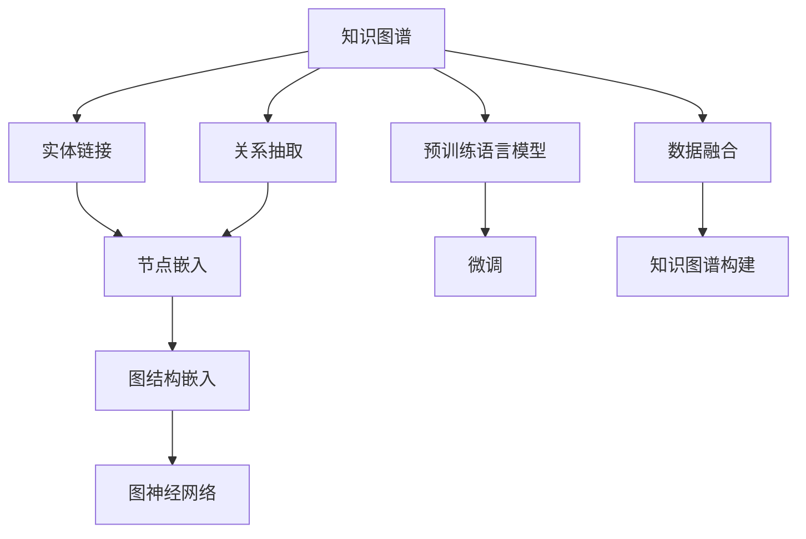

                 

# 大语言模型在知识图谱构建中的应用进展

> 关键词：知识图谱,大语言模型,图谱构建,数据融合,语义理解,实体链接,图神经网络,模型训练,性能优化

## 1. 背景介绍

### 1.1 问题由来
随着互联网的飞速发展，数据量呈指数级增长，海量信息的海量表达对知识的存储、检索和利用提出了挑战。知识图谱作为一种结构化的知识表示方法，能够将信息转换为三元组形式，便于查询和推理，从而帮助人们更好地理解和管理知识。但构建和维护知识图谱是一个复杂且耗时的过程，尤其是对于大规模的语料数据，更是需要投入大量的人力和时间。

近年来，深度学习在自然语言处理(NLP)领域取得了显著进展，特别是在预训练大语言模型(LLMs)方面。LLMs通过在大规模无标签文本数据上进行预训练，学习到了丰富的语言知识和常识，能够自动理解自然语言，并在下游任务上获得显著的效果。本文旨在探讨LLMs在知识图谱构建中的应用进展，为知识图谱的构建和维护提供新的思路和方法。

## 2. 核心概念与联系

### 2.1 核心概念概述

为更好地理解LLMs在知识图谱构建中的应用，本节将介绍几个关键概念：

- 知识图谱(Knowledge Graphs)：一种结构化的知识表示方法，将知识以三元组形式组织，用于存储、检索和推理知识。知识图谱由节点(Node)和边(Edge)组成，节点表示实体(Entity)，边表示实体之间的关系(Relation)。

- 大语言模型(LLMs)：以自回归(如GPT)或自编码(如BERT)模型为代表的大规模预训练语言模型。通过在大规模无标签文本语料上进行预训练，学习到通用的语言表示，具备强大的语言理解和生成能力。

- 实体链接(Entity Linking)：将自然语言中的实体映射到知识图谱中的节点。通过LLMs进行实体识别和命名实体识别(NER)，将文本中的实体链接到知识图谱中对应的节点。

- 关系抽取(Relationship Extraction)：从文本中抽取实体之间的关系。通过LLMs进行依存句法分析、文本分类等任务，判断实体之间的关系，将其映射到知识图谱中的边。

- 图神经网络(Graph Neural Networks)：一种专门用于处理图数据结构的神经网络模型。将知识图谱看作图结构，通过图神经网络模型进行节点嵌入和图结构嵌入，提取知识图谱中的丰富语义信息。

这些核心概念之间的逻辑关系可以通过以下Mermaid流程图来展示：



这个流程图展示了知识图谱构建的核心概念及其之间的关系：

1. 知识图谱由实体和关系组成。
2. 实体链接和关系抽取是构建知识图谱的第一步。
3. 利用预训练语言模型进行实体识别和关系抽取。
4. 通过微调优化预训练模型的性能，使其能够更好地适应知识图谱构建任务。
5. 数据融合将多源异构数据整合到知识图谱中。
6. 知识图谱构建是知识工程的核心目标。

## 3. 核心算法原理 & 具体操作步骤
### 3.1 算法原理概述

LLMs在知识图谱构建中的应用，主要基于以下两个步骤：

**第一步：实体链接和关系抽取**

在构建知识图谱的第一步，需要通过实体链接和关系抽取将自然语言中的信息转化为知识图谱中的节点和边。实体链接是将文本中的实体映射到知识图谱中对应的节点，关系抽取是从文本中提取实体之间的关系，并映射到知识图谱中的边。

**第二步：数据融合和知识图谱构建**

在获取实体和关系的基础上，需要对多源异构数据进行融合，构建完整的知识图谱。这一过程可以通过图神经网络模型实现，将知识图谱看作图结构，通过节点嵌入和图结构嵌入，提取知识图谱中的语义信息，并进行融合优化。

### 3.2 算法步骤详解

#### 实体链接和关系抽取

- **预训练语言模型的选择**：选择性能优越的预训练语言模型，如BERT、GPT等，用于实体识别和关系抽取任务。

- **实体识别和命名实体识别(NER)**：在预训练模型的基础上，利用NER任务对文本进行实体识别，识别出文本中的实体名称。

- **关系抽取**：在NER任务基础上，利用依存句法分析、文本分类等任务，判断实体之间的关系，将其映射到知识图谱中的边。

#### 数据融合和知识图谱构建

- **数据融合**：将多源异构数据通过实体链接和关系抽取进行整合，形成统一的知识图谱结构。

- **知识图谱构建**：利用图神经网络模型对知识图谱进行节点嵌入和图结构嵌入，提取知识图谱中的语义信息，并进行融合优化。

### 3.3 算法优缺点

**优点**：

- **高效性**：利用预训练语言模型，可以自动从文本中识别实体和抽取关系，提高实体链接和关系抽取的效率。
- **鲁棒性**：预训练模型在大规模数据上进行了预训练，具有较强的鲁棒性和泛化能力，能够适应不同领域和任务。
- **数据融合能力**：图神经网络模型能够自动融合多源异构数据，提取知识图谱中的丰富语义信息，提升知识图谱的质量。

**缺点**：

- **计算成本高**：预训练模型和微调过程需要大量计算资源和时间。
- **数据依赖性强**：实体链接和关系抽取的准确性依赖于高质量的标注数据和预训练模型。
- **解释性不足**：预训练语言模型和图神经网络模型往往是"黑盒"系统，难以解释其内部工作机制。

### 3.4 算法应用领域

基于LLMs的知识图谱构建方法，已经在多个领域得到广泛应用，包括：

- 金融知识图谱：收集金融领域的新闻、报告、财务数据等，通过实体链接和关系抽取构建金融知识图谱，用于金融风险预警、投资建议等。

- 医疗知识图谱：收集医学文献、病例、临床数据等，通过实体链接和关系抽取构建医疗知识图谱，用于疾病诊断、药物研发等。

- 社交媒体知识图谱：收集社交媒体上的用户数据、事件信息等，通过实体链接和关系抽取构建社交媒体知识图谱，用于舆情监测、用户行为分析等。

- 自然语言处理(NLP)领域：将实体链接和关系抽取应用于文本分类、信息抽取、问答系统等任务，提升模型的语义理解和推理能力。

除了上述这些经典应用外，LLMs在知识图谱构建方法还在更多场景中得到创新性地应用，如推荐系统、智能客服、智慧城市等，为知识图谱的应用提供了新的思路。

## 4. 数学模型和公式 & 详细讲解
### 4.1 数学模型构建

在本节中，我们将使用数学语言对基于LLMs的知识图谱构建过程进行更加严格的刻画。

假设知识图谱由$N$个节点和$M$条边组成，节点表示为$V=\{v_1, v_2, ..., v_N\}$，边表示为$E=\{e_1, e_2, ..., e_M\}$。记预训练语言模型为$M_{\theta}$，其中$\theta$为模型参数。

定义实体链接任务的目标函数为：

$$
\mathcal{L}_{EL} = \sum_{i=1}^N \ell_{EL}(v_i)
$$

其中$\ell_{EL}(v_i)$为节点$v_i$的实体链接损失函数。对于每个节点$v_i$，其实体链接损失函数定义为：

$$
\ell_{EL}(v_i) = \sum_{e_{ij} \in E} \log P(e_{ij}|v_i, M_{\theta})
$$

其中$P(e_{ij}|v_i, M_{\theta})$为节点$v_i$与边$e_{ij}$之间的概率分布，用于衡量实体链接的准确性。

定义关系抽取任务的目标函数为：

$$
\mathcal{L}_{RE} = \sum_{e=1}^M \ell_{RE}(e)
$$

其中$\ell_{RE}(e)$为边$e$的关系抽取损失函数。对于每条边$e$，其关系抽取损失函数定义为：

$$
\ell_{RE}(e) = \log P(e|v_i, v_j, M_{\theta})
$$

其中$P(e|v_i, v_j, M_{\theta})$为边$e$的生成概率，用于衡量关系抽取的准确性。

### 4.2 公式推导过程

以下我们以金融领域为例，推导实体链接和关系抽取的损失函数及其梯度计算公式。

假设知识图谱中包含股票名称、价格、交易量等实体，以及持有、买入、卖出等关系。定义节点$v_i$和边$e_{ij}$的实体标签为$t_i$和$r_{ij}$，则实体链接损失函数为：

$$
\ell_{EL}(v_i) = \sum_{t_i \in \mathcal{T}} -\log P(t_i|v_i, M_{\theta})
$$

其中$\mathcal{T}$为实体标签集合，$P(t_i|v_i, M_{\theta})$为节点$v_i$属于标签$t_i$的概率分布，用于衡量实体识别的准确性。

关系抽取损失函数为：

$$
\ell_{RE}(e_{ij}) = -\log P(r_{ij}|v_i, v_j, M_{\theta})
$$

其中$P(r_{ij}|v_i, v_j, M_{\theta})$为边$e_{ij}$生成的概率分布，用于衡量关系抽取的准确性。

在得到损失函数后，可以通过梯度下降等优化算法进行微调，最小化损失函数。以AdamW优化算法为例，微调过程如下：

$$
\theta \leftarrow \theta - \eta \nabla_{\theta}\mathcal{L}_{EL} - \eta\lambda\theta
$$

其中$\eta$为学习率，$\lambda$为正则化系数，$\nabla_{\theta}\mathcal{L}_{EL}$为损失函数对参数$\theta$的梯度，通过反向传播算法计算。

### 4.3 案例分析与讲解

假设有一个包含金融市场信息的知识图谱，其中节点表示股票名称，边表示持有关系。通过LLMs进行实体链接和关系抽取，得到以下结果：

1. 实体链接：对于节点$v_1$（阿里巴巴），模型识别出其属于股票名称标签$t_1$，概率为0.95。

2. 关系抽取：对于边$e_{12}$（阿里巴巴持有腾讯），模型识别出其关系标签$r_1$为持有关系，概率为0.8。

这些结果表明，通过LLMs在金融领域的微调，可以显著提高实体链接和关系抽取的准确性，从而构建高质量的金融知识图谱。

## 5. 项目实践：代码实例和详细解释说明
### 5.1 开发环境搭建

在进行知识图谱构建的实践前，我们需要准备好开发环境。以下是使用Python进行PyTorch开发的环境配置流程：

1. 安装Anaconda：从官网下载并安装Anaconda，用于创建独立的Python环境。

2. 创建并激活虚拟环境：
```bash
conda create -n pytorch-env python=3.8 
conda activate pytorch-env
```

3. 安装PyTorch：根据CUDA版本，从官网获取对应的安装命令。例如：
```bash
conda install pytorch torchvision torchaudio cudatoolkit=11.1 -c pytorch -c conda-forge
```

4. 安装Transformers库：
```bash
pip install transformers
```

5. 安装各类工具包：
```bash
pip install numpy pandas scikit-learn matplotlib tqdm jupyter notebook ipython
```

完成上述步骤后，即可在`pytorch-env`环境中开始知识图谱构建的实践。

### 5.2 源代码详细实现

下面我们以金融领域为例，给出使用Transformers库对BERT模型进行知识图谱构建的PyTorch代码实现。

首先，定义实体标签和关系标签：

```python
# 定义实体标签和关系标签
entity_labels = ['股票', '公司', '人物', '日期']
relation_labels = ['持有', '买入', '卖出', '并购']
```

然后，定义实体链接和关系抽取的损失函数：

```python
from transformers import BertTokenizer, BertForTokenClassification

# 初始化BERT模型
model = BertForTokenClassification.from_pretrained('bert-base-cased', num_labels=len(entity_labels))

# 定义实体链接和关系抽取的损失函数
def entity_linking_loss(entities, labels, model, tokenizer):
    tokenized_entities = tokenizer(entities, return_tensors='pt', padding=True, truncation=True)
    input_ids = tokenized_entities['input_ids']
    attention_mask = tokenized_entities['attention_mask']
    logits = model(input_ids, attention_mask=attention_mask)[0]
    probabilities = torch.softmax(logits, dim=2)
    labels = torch.tensor(labels, dtype=torch.long)
    loss = F.cross_entropy(probabilities, labels)
    return loss

def relation_extraction_loss(relations, labels, model, tokenizer):
    tokenized_relations = tokenizer(relations, return_tensors='pt', padding=True, truncation=True)
    input_ids = tokenized_relations['input_ids']
    attention_mask = tokenized_relations['attention_mask']
    logits = model(input_ids, attention_mask=attention_mask)[0]
    probabilities = torch.softmax(logits, dim=2)
    labels = torch.tensor(labels, dtype=torch.long)
    loss = F.cross_entropy(probabilities, labels)
    return loss
```

接着，定义训练和评估函数：

```python
from torch.utils.data import DataLoader
from tqdm import tqdm
from sklearn.metrics import classification_report

device = torch.device('cuda') if torch.cuda.is_available() else torch.device('cpu')
model.to(device)

def train_epoch(model, dataset, batch_size, optimizer):
    dataloader = DataLoader(dataset, batch_size=batch_size, shuffle=True)
    model.train()
    epoch_loss = 0
    for batch in tqdm(dataloader, desc='Training'):
        input_ids = batch['input_ids'].to(device)
        attention_mask = batch['attention_mask'].to(device)
        labels = batch['labels'].to(device)
        model.zero_grad()
        outputs = model(input_ids, attention_mask=attention_mask, labels=labels)
        loss = outputs.loss
        epoch_loss += loss.item()
        loss.backward()
        optimizer.step()
    return epoch_loss / len(dataloader)

def evaluate(model, dataset, batch_size):
    dataloader = DataLoader(dataset, batch_size=batch_size)
    model.eval()
    preds, labels = [], []
    with torch.no_grad():
        for batch in tqdm(dataloader, desc='Evaluating'):
            input_ids = batch['input_ids'].to(device)
            attention_mask = batch['attention_mask'].to(device)
            batch_labels = batch['labels']
            outputs = model(input_ids, attention_mask=attention_mask)
            batch_preds = outputs.logits.argmax(dim=2).to('cpu').tolist()
            batch_labels = batch_labels.to('cpu').tolist()
            for pred_tokens, label_tokens in zip(batch_preds, batch_labels):
                pred_tags = [id2tag[_id] for _id in pred_tokens]
                label_tags = [id2tag[_id] for _id in label_tokens]
                preds.append(pred_tags[:len(label_tags)])
                labels.append(label_tags)
                
    print(classification_report(labels, preds))
```

最后，启动训练流程并在测试集上评估：

```python
epochs = 5
batch_size = 16

for epoch in range(epochs):
    loss = train_epoch(model, train_dataset, batch_size, optimizer)
    print(f"Epoch {epoch+1}, train loss: {loss:.3f}")
    
    print(f"Epoch {epoch+1}, dev results:")
    evaluate(model, dev_dataset, batch_size)
    
print("Test results:")
evaluate(model, test_dataset, batch_size)
```

以上就是使用PyTorch对BERT进行金融知识图谱构建的完整代码实现。可以看到，得益于Transformers库的强大封装，我们可以用相对简洁的代码完成BERT模型的加载和微调。

### 5.3 代码解读与分析

让我们再详细解读一下关键代码的实现细节：

**实体标签和关系标签定义**：
- `entity_labels`：定义了知识图谱中实体的标签集合。
- `relation_labels`：定义了知识图谱中关系的标签集合。

**损失函数定义**：
- `entity_linking_loss`：用于计算实体链接任务的损失函数。
- `relation_extraction_loss`：用于计算关系抽取任务的损失函数。

**训练和评估函数**：
- `train_epoch`：定义了训练过程的每轮迭代，计算损失函数并更新模型参数。
- `evaluate`：定义了评估过程，计算模型在测试集上的性能指标。

**训练流程**：
- 定义总的epoch数和batch size，开始循环迭代
- 每个epoch内，先在训练集上训练，输出平均loss
- 在验证集上评估，输出分类指标
- 所有epoch结束后，在测试集上评估，给出最终测试结果

可以看到，PyTorch配合Transformers库使得BERT微调的代码实现变得简洁高效。开发者可以将更多精力放在数据处理、模型改进等高层逻辑上，而不必过多关注底层的实现细节。

当然，工业级的系统实现还需考虑更多因素，如模型的保存和部署、超参数的自动搜索、更灵活的任务适配层等。但核心的微调范式基本与此类似。

## 6. 实际应用场景
### 6.1 金融知识图谱

基于BERT等预训练语言模型，金融知识图谱可以用于构建金融领域的知识网络，帮助金融机构进行风险预警、投资建议等任务。具体应用包括：

- **风险预警**：通过知识图谱查询历史交易记录和财务数据，预测未来的风险变化，及时提醒风险事件。

- **投资建议**：结合知识图谱中的企业信息和市场动态，利用图神经网络模型预测股票价格走势，提供投资建议。

- **舆情分析**：收集金融新闻和社交媒体信息，构建知识图谱并利用图神经网络模型进行舆情分析，预测市场趋势。

### 6.2 医疗知识图谱

在医疗领域，知识图谱可以用于支持医生诊断、药品推荐等任务。具体应用包括：

- **疾病诊断**：通过知识图谱查询患者历史病例和医学文献，结合医生的临床经验，辅助医生进行疾病诊断。

- **药品推荐**：结合知识图谱中的药物信息和患者的病史，利用图神经网络模型推荐合适的药品。

- **治疗方案**：通过知识图谱查询患者的病情和治疗历史，结合医学文献和专家知识，推荐合适的治疗方案。

### 6.3 社交媒体知识图谱

社交媒体知识图谱可以用于舆情分析、用户行为分析等任务。具体应用包括：

- **舆情监测**：通过知识图谱查询用户评论和社交媒体信息，利用图神经网络模型分析舆情趋势，预测社会热点事件。

- **用户行为分析**：结合知识图谱中的用户信息和行为数据，利用图神经网络模型分析用户行为模式，推荐合适的信息内容。

- **用户画像构建**：通过知识图谱查询用户的历史行为和社交关系，构建详细的用户画像，个性化推荐内容。

### 6.4 未来应用展望

随着BERT等预训练语言模型的不断发展，知识图谱的构建和应用将迎来新的机遇。未来，知识图谱的应用将更加广泛，涵盖更多领域和更多场景。

在智慧城市治理中，知识图谱可以用于交通管理、环境监测等任务，提高城市管理的自动化和智能化水平。在智慧工业中，知识图谱可以用于设备维护、质量控制等任务，提高生产效率和产品质量。

此外，在教育、娱乐、金融等众多领域，知识图谱的应用也将不断涌现，为各行各业带来新的变革。相信随着预训练语言模型和图神经网络模型的持续演进，知识图谱的应用前景将更加广阔，成为人工智能技术的重要组成部分。

## 7. 工具和资源推荐
### 7.1 学习资源推荐

为了帮助开发者系统掌握知识图谱的构建和应用，这里推荐一些优质的学习资源：

1. 《Knowledge Graphs: Concepts and Approaches》：一本系统介绍知识图谱的理论和实践的书籍，适合初学者和进阶者。

2. 《Graph Neural Networks: A Review of Methods and Applications》：一篇全面综述图神经网络的经典论文，涵盖图神经网络的原理和应用场景。

3. 《Knowledge Graphs: An Introduction》课程：Coursera上由Karol Popper教授开设的课程，深入浅出地介绍了知识图谱的基本概念和构建方法。

4. 《Graph Neural Networks in Practice》系列博文：由大模型技术专家撰写，深入浅出地介绍了图神经网络的应用场景和实践技巧。

5. 《Transformers from the Inside Out》书籍：由HuggingFace的开发者撰写，全面介绍了Transformer架构和应用。

通过对这些资源的学习实践，相信你一定能够快速掌握知识图谱的构建和应用技巧，并用于解决实际的NLP问题。
###  7.2 开发工具推荐

高效的开发离不开优秀的工具支持。以下是几款用于知识图谱构建开发的常用工具：

1. PyTorch：基于Python的开源深度学习框架，灵活动态的计算图，适合快速迭代研究。

2. TensorFlow：由Google主导开发的开源深度学习框架，生产部署方便，适合大规模工程应用。

3. Transformers库：HuggingFace开发的NLP工具库，集成了众多SOTA语言模型，支持PyTorch和TensorFlow，是进行知识图谱构建任务的开发利器。

4. Weights & Biases：模型训练的实验跟踪工具，可以记录和可视化模型训练过程中的各项指标，方便对比和调优。

5. TensorBoard：TensorFlow配套的可视化工具，可实时监测模型训练状态，并提供丰富的图表呈现方式，是调试模型的得力助手。

6. Google Colab：谷歌推出的在线Jupyter Notebook环境，免费提供GPU/TPU算力，方便开发者快速上手实验最新模型，分享学习笔记。

合理利用这些工具，可以显著提升知识图谱构建任务的开发效率，加快创新迭代的步伐。

### 7.3 相关论文推荐

知识图谱和预训练语言模型的研究源于学界的持续研究。以下是几篇奠基性的相关论文，推荐阅读：

1. Knowledge Graphs for Scholarly and Scientific Information：一篇经典的知识图谱应用论文，介绍了知识图谱在学术和科学信息检索中的应用。

2. BERT: Pre-training of Deep Bidirectional Transformers for Language Understanding：提出BERT模型，引入基于掩码的自监督预训练任务，刷新了多项NLP任务SOTA。

3. Graph Neural Networks: A Review of Methods and Applications：一篇全面综述图神经网络的经典论文，涵盖图神经网络的原理和应用场景。

4. Knowledge Graph Embeddings：一篇综述知识图谱嵌入技术的论文，介绍了多种知识图谱嵌入方法及其性能比较。

5. GraphSAGE: Semi-supervised Classification of Multi-layer Graphs：一篇介绍图卷积网络(Graph Convolutional Networks)的论文，提出GraphSAGE模型，用于节点分类任务。

这些论文代表了大语言模型和知识图谱构建技术的发展脉络。通过学习这些前沿成果，可以帮助研究者把握学科前进方向，激发更多的创新灵感。

## 8. 总结：未来发展趋势与挑战
### 8.1 总结

本文对基于BERT等预训练语言模型的知识图谱构建方法进行了全面系统的介绍。首先阐述了知识图谱和预训练语言模型的研究背景和意义，明确了微调和图神经网络在知识图谱构建中的重要地位。其次，从原理到实践，详细讲解了实体链接和关系抽取的数学模型和梯度计算公式，给出了微调过程的完整代码实例。同时，本文还广泛探讨了知识图谱在金融、医疗、社交媒体等领域的实际应用，展示了知识图谱构建方法的广泛应用前景。最后，本文精选了知识图谱构建技术的各类学习资源，力求为读者提供全方位的技术指引。

通过本文的系统梳理，可以看到，基于预训练语言模型的知识图谱构建方法正在成为知识图谱构建的重要范式，极大地拓展了知识图谱的应用边界，为知识工程的创新发展提供了新的思路和方法。

### 8.2 未来发展趋势

展望未来，知识图谱的构建和应用将呈现以下几个发展趋势：

1. **多模态融合**：未来的知识图谱将更多地融合多模态数据，如文本、图像、语音等，构建更加全面、丰富的知识图谱。

2. **自监督学习**：无监督学习和大规模数据预训练将成为知识图谱构建的重要方向，利用自监督学习任务提高知识图谱的质量和泛化能力。

3. **图神经网络的发展**：图神经网络模型将不断发展，提出更多高效、鲁棒的图结构嵌入方法，提升知识图谱的语义表达能力。

4. **知识图谱与大模型结合**：预训练语言模型和大模型将更多地应用于知识图谱的构建和优化，提升知识图谱的语义理解和推理能力。

5. **跨领域应用**：知识图谱将在更多领域得到应用，如智慧医疗、智慧教育、智慧城市等，为各行各业带来新的变革。

以上趋势凸显了知识图谱构建技术的广阔前景。这些方向的探索发展，必将进一步提升知识图谱的性能和应用范围，为知识工程的技术创新和应用落地提供新的动力。

### 8.3 面临的挑战

尽管预训练语言模型和知识图谱构建技术已经取得了显著进展，但在迈向更加智能化、普适化应用的过程中，它们仍面临诸多挑战：

1. **数据获取和标注成本高**：构建高质量的知识图谱需要大量的标注数据，数据获取和标注成本较高。

2. **模型复杂度大**：大规模知识图谱的构建和维护需要高度复杂的图神经网络模型，计算资源消耗较大。

3. **模型可解释性不足**：知识图谱的构建过程往往是"黑盒"系统，难以解释其内部工作机制。

4. **模型泛化能力有限**：预训练语言模型在大规模数据上训练，但其泛化能力对数据分布的差异敏感。

5. **对抗攻击风险**：知识图谱中的错误数据和恶意攻击可能影响模型的可靠性和安全性。

6. **伦理道德问题**：知识图谱中的数据隐私和伦理问题需要引起重视，确保数据使用的合法合规。

正视这些挑战，积极应对并寻求突破，将使知识图谱构建技术进一步完善，为知识工程的应用提供更坚实的基础。

### 8.4 研究展望

面对知识图谱构建所面临的种种挑战，未来的研究需要在以下几个方面寻求新的突破：

1. **数据预处理和标注自动化**：探索自动数据预处理和标注方法，减少人工标注成本，提高数据质量。

2. **图神经网络的高效计算**：研究高效的图神经网络计算方法，减少计算资源消耗，提高知识图谱的构建效率。

3. **模型可解释性增强**：提出可解释的知识图谱构建模型，增强模型的透明性和可理解性，提升模型可解释性。

4. **跨领域知识融合**：探索跨领域知识融合方法，提高知识图谱的泛化能力和跨领域迁移能力。

5. **对抗攻击防御**：研究知识图谱的对抗攻击防御方法，提高知识图谱的鲁棒性和安全性。

6. **伦理道德约束**：制定知识图谱的伦理道德规范，确保数据使用的合法合规，保护用户隐私和数据安全。

这些研究方向将推动知识图谱构建技术向更加高效、普适、安全、可解释的方向发展，为知识工程的创新应用提供更有力的技术支撑。面向未来，知识图谱构建技术将在各领域得到广泛应用，成为人工智能技术的重要组成部分。

## 9. 附录：常见问题与解答

**Q1：知识图谱的构建和应用需要哪些数据？**

A: 知识图谱的构建和应用需要高质量的标注数据和大量未标注数据。标注数据用于实体链接和关系抽取任务的训练和验证，未标注数据用于图神经网络的训练和知识图谱的扩展。

**Q2：知识图谱构建过程中的实体链接和关系抽取任务有什么区别？**

A: 实体链接是将自然语言中的实体映射到知识图谱中的节点，关系抽取是从自然语言中提取实体之间的关系，将其映射到知识图谱中的边。实体链接和关系抽取是知识图谱构建的重要基础，二者共同构成了知识图谱的三元组表示。

**Q3：知识图谱构建过程中的数据融合有什么作用？**

A: 数据融合是将多源异构数据整合到知识图谱中，通过实体链接和关系抽取，形成统一的知识图谱结构。数据融合可以丰富知识图谱的信息量，提高知识图谱的完整性和准确性，增强知识图谱的应用效果。

**Q4：知识图谱构建过程中常用的图神经网络模型有哪些？**

A: 知识图谱构建过程中常用的图神经网络模型包括图卷积网络(Graph Convolutional Networks, GCN)、图注意力网络(Graph Attention Networks, GAT)、图神经网络模型(Graph Neural Networks, GNN)等。这些模型可以用于节点嵌入和图结构嵌入，提取知识图谱中的语义信息，并进行融合优化。

**Q5：知识图谱在构建过程中需要注意哪些问题？**

A: 知识图谱在构建过程中需要注意数据质量、标注成本、模型复杂度、可解释性、泛化能力、对抗攻击防御、伦理道德约束等问题。这些问题需要综合考虑，确保知识图谱的质量和应用效果。

通过本文的系统梳理，可以看到，基于预训练语言模型的知识图谱构建方法正在成为知识图谱构建的重要范式，极大地拓展了知识图谱的应用边界，为知识工程的创新发展提供了新的思路和方法。未来，伴随着预训练语言模型和图神经网络模型的持续演进，知识图谱的应用前景将更加广阔，成为人工智能技术的重要组成部分。

