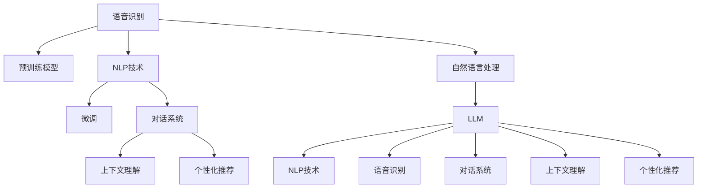

                 

# LLM在语音助手中的应用：更自然的人机交互

## 1. 背景介绍

在智能语音助手的开发中，大语言模型(LLM)的应用成为了关键。传统的语音识别和自然语言处理技术虽然已经取得了一定的进展，但仍然面临诸多挑战，如上下文理解能力不足、响应不自然、缺乏个性化等。LLM的大规模语言理解和生成能力，使得智能语音助手能够更自然地与用户交互，提供更加智能、个性化的服务。

### 1.1 问题由来

语音助手的主要功能是理解用户自然语言指令，并根据指令执行相应操作，如回答问题、控制设备、提供信息等。传统的语音识别和自然语言处理技术往往依赖于手工设计的特征和规则，对于复杂的语言结构、上下文关联和语境理解能力有限。

尽管目前已经出现了一些基于深度学习的语音助手，如Apple的Siri、Google Assistant等，但其表现仍未达到理想状态。在处理长对话、多轮交互时，现有的技术还存在理解不准确、响应不自然、难以个性化等问题。

### 1.2 问题核心关键点

语音助手领域的核心问题是如何在更自然、更智能地理解用户指令和上下文，从而提供个性化、高质量的响应。大语言模型通过预训练和微调，能够学习到丰富的语言知识和上下文理解能力，为语音助手应用提供了强大的技术支撑。

## 2. 核心概念与联系

### 2.1 核心概念概述

以下是语音助手开发中涉及的关键概念：

- **大语言模型(LLM)**：以自回归(如GPT)或自编码(如BERT)模型为代表的大规模预训练语言模型。通过在大规模无标签文本语料上进行预训练，学习通用的语言表示，具备强大的语言理解和生成能力。

- **预训练**：指在大规模无标签文本语料上，通过自监督学习任务训练通用语言模型的过程。常见的预训练任务包括言语建模、遮挡语言模型等。

- **微调**：指在预训练模型的基础上，使用下游任务的少量标注数据，通过有监督学习优化模型在特定任务上的性能。通常只需要调整顶层分类器或解码器，并以较小的学习率更新全部或部分的模型参数。

- **自然语言处理(NLP)**：涉及计算机理解和生成人类语言的技术，包括语音识别、语言理解、对话系统等。

- **语音识别**：将语音转换成文本，是智能语音助手的第一步。

- **对话系统**：使机器能够与人自然对话，提供信息检索、任务执行等服务。

- **个性化推荐**：根据用户的历史行为和偏好，提供个性化的信息和服务。

- **上下文理解**：识别并理解用户指令所处的上下文环境，包括当前对话历史、用户情绪、场景等。

这些概念之间的逻辑关系可以通过以下Mermaid流程图来展示：



## 3. 核心算法原理 & 具体操作步骤

### 3.1 算法原理概述

基于大语言模型的语音助手系统，主要依赖于语音识别、自然语言处理和对话系统三大核心技术。其中，大语言模型作为理解和生成自然语言的关键组件，通过预训练和微调，学习到通用的语言表示，能够自然地处理复杂指令和上下文。

语音助手的主要任务是：

1. **语音识别**：将用户语音转换成文本。
2. **自然语言理解(NLU)**：理解用户指令的意图和上下文。
3. **自然语言生成(NLG)**：根据用户指令生成自然语言响应。
4. **对话管理**：管理多轮对话历史，记录用户上下文，并根据当前对话生成恰当响应。
5. **个性化推荐**：根据用户历史行为，提供个性化推荐。

在基于大语言模型的语音助手系统中，自然语言理解与生成是核心，对话管理与个性化推荐则是补充。下面我们将详细介绍基于大语言模型的语音助手系统的设计和实现。

### 3.2 算法步骤详解

基于大语言模型的语音助手系统主要包括以下几个关键步骤：

**Step 1: 准备预训练模型和数据集**
- 选择合适的预训练语言模型 $M_{\theta}$ 作为初始化参数，如 BERT、GPT 等。
- 准备下游任务（如问答、对话、推荐等）的少量标注数据集 $D$，划分为训练集、验证集和测试集。

**Step 2: 添加任务适配层**
- 根据任务类型，在预训练模型顶层设计合适的输出层和损失函数。
- 对于分类任务，通常在顶层添加线性分类器和交叉熵损失函数。
- 对于生成任务，通常使用语言模型的解码器输出概率分布，并以负对数似然为损失函数。

**Step 3: 设置微调超参数**
- 选择合适的优化算法及其参数，如 AdamW、SGD 等，设置学习率、批大小、迭代轮数等。
- 设置正则化技术及强度，包括权重衰减、Dropout、Early Stopping 等。
- 确定冻结预训练参数的策略，如仅微调顶层，或全部参数都参与微调。

**Step 4: 执行梯度训练**
- 将训练集数据分批次输入模型，前向传播计算损失函数。
- 反向传播计算参数梯度，根据设定的优化算法和学习率更新模型参数。
- 周期性在验证集上评估模型性能，根据性能指标决定是否触发 Early Stopping。
- 重复上述步骤直到满足预设的迭代轮数或 Early Stopping 条件。

**Step 5: 测试和部署**
- 在测试集上评估微调后模型 $M_{\hat{\theta}}$ 的性能，对比微调前后的精度提升。
- 使用微调后的模型对新样本进行推理预测，集成到实际的应用系统中。
- 持续收集新的数据，定期重新微调模型，以适应数据分布的变化。

### 3.3 算法优缺点

基于大语言模型的语音助手系统具有以下优点：

- 自然语言处理能力强：大语言模型能够自然地理解复杂的语言结构和上下文，提供更加自然的交互体验。
- 多轮对话支持：大语言模型具备长对话处理能力，能够持续跟踪用户上下文，提供连贯的对话响应。
- 可扩展性强：大语言模型可以通过微调，适应特定的领域和任务，满足不同应用场景的需求。
- 低成本开发：大语言模型预训练和微调可以显著减少开发成本，加速产品的上市速度。

同时，该方法也存在一些局限性：

- 数据标注成本高：高质量的数据集是微调的前提，标注成本较高。
- 上下文理解能力有限：尽管大语言模型在自然语言处理方面表现出色，但上下文理解能力仍然有待提升。
- 个性化推荐难度大：个性化推荐需要大量的用户数据，如何保护用户隐私和数据安全是一个挑战。
- 模型复杂度高：大语言模型参数众多，计算和存储资源消耗较大。

尽管存在这些局限性，但就目前而言，基于大语言模型的语音助手系统仍是最主流、最具潜力的解决方案。

### 3.4 算法应用领域

基于大语言模型的语音助手系统已经在多个领域得到了广泛应用，例如：

- **智能家居**：控制家电、查询信息、提供个性化建议等。
- **车载导航**：导航路径规划、实时路况更新、语音播报等。
- **医疗咨询**：诊断症状、推荐医生、查询医疗信息等。
- **客服系统**：解答常见问题、引导用户进行下一步操作等。
- **商务会议**：记录会议纪要、生成会议纪要、提醒会议日程等。

除了上述这些经典应用外，语音助手还被创新性地应用到更多场景中，如可控文本生成、常识推理、数据增强等，为语音助手技术带来了全新的突破。

## 4. 数学模型和公式 & 详细讲解  
### 4.1 数学模型构建

在基于大语言模型的语音助手系统中，我们通常使用语言模型的自回归形式来表示自然语言生成任务。假设预训练语言模型为 $M_{\theta}:\mathcal{X} \rightarrow \mathcal{Y}$，其中 $\mathcal{X}$ 为输入空间，$\mathcal{Y}$ 为输出空间，$\theta \in \mathbb{R}^d$ 为模型参数。假设微调任务的训练集为 $D=\{(x_i,y_i)\}_{i=1}^N, x_i \in \mathcal{X}, y_i \in \mathcal{Y}$。

定义模型 $M_{\theta}$ 在输入 $x$ 上的输出为 $\hat{y}=M_{\theta}(x) \in [0,1]$，表示样本属于正类的概率。真实标签 $y \in \{0,1\}$。则二分类交叉熵损失函数定义为：

$$
\ell(M_{\theta}(x),y) = -[y\log \hat{y} + (1-y)\log (1-\hat{y})]
$$

将其代入经验风险公式，得：

$$
\mathcal{L}(\theta) = -\frac{1}{N}\sum_{i=1}^N [y_i\log M_{\theta}(x_i)+(1-y_i)\log(1-M_{\theta}(x_i))]
$$

根据链式法则，损失函数对参数 $\theta_k$ 的梯度为：

$$
\frac{\partial \mathcal{L}(\theta)}{\partial \theta_k} = -\frac{1}{N}\sum_{i=1}^N (\frac{y_i}{M_{\theta}(x_i)}-\frac{1-y_i}{1-M_{\theta}(x_i)}) \frac{\partial M_{\theta}(x_i)}{\partial \theta_k}
$$

其中 $\frac{\partial M_{\theta}(x_i)}{\partial \theta_k}$ 可进一步递归展开，利用自动微分技术完成计算。

### 4.2 公式推导过程

以问答系统为例，我们推导大语言模型作为问答系统的组成部分时，如何通过微调进行任务适配。

假设问答系统的输入为问题 $q$，输出为答案 $a$。则问题 $q$ 和答案 $a$ 的联合概率可以表示为：

$$
p(a,q) = p(a|q) p(q)
$$

其中 $p(a|q)$ 为给定问题 $q$ 时答案 $a$ 的条件概率，$p(q)$ 为问题 $q$ 的概率分布。在基于大语言模型的问答系统中，$p(a|q)$ 可以通过预训练语言模型的概率输出直接计算：

$$
p(a|q) = \frac{\exp[\log p(a|q)]}{\sum_k \exp[\log p(a|k)]}
$$

其中 $\log p(a|q)$ 表示语言模型的输出概率，$\sum_k$ 表示对所有可能的答案 $k$ 求和。

问题 $q$ 的概率分布 $p(q)$ 可以通过语言模型在问题空间上的概率输出计算：

$$
p(q) = \frac{\exp[\log p(q)]}{\sum_j \exp[\log p(j)]}
$$

其中 $\log p(q)$ 表示语言模型对问题的概率输出，$\sum_j$ 表示对所有可能的问题 $j$ 求和。

在问答系统中，我们希望最大化问题 $q$ 和答案 $a$ 的联合概率 $p(a,q)$。因此，我们需要最小化联合概率的对数：

$$
\mathcal{L}(\theta) = -\log p(a,q) = -(\log p(a|q) + \log p(q))
$$

通过反向传播算法计算梯度，并利用梯度下降法更新模型参数，最小化经验损失函数，即可完成问答系统的微调。

## 5. 项目实践：代码实例和详细解释说明
### 5.1 开发环境搭建

在进行微调实践前，我们需要准备好开发环境。以下是使用Python进行PyTorch开发的环境配置流程：

1. 安装Anaconda：从官网下载并安装Anaconda，用于创建独立的Python环境。

2. 创建并激活虚拟环境：
```bash
conda create -n pytorch-env python=3.8 
conda activate pytorch-env
```

3. 安装PyTorch：根据CUDA版本，从官网获取对应的安装命令。例如：
```bash
conda install pytorch torchvision torchaudio cudatoolkit=11.1 -c pytorch -c conda-forge
```

4. 安装Transformers库：
```bash
pip install transformers
```

5. 安装各类工具包：
```bash
pip install numpy pandas scikit-learn matplotlib tqdm jupyter notebook ipython
```

完成上述步骤后，即可在`pytorch-env`环境中开始微调实践。

### 5.2 源代码详细实现

下面我们以问答系统为例，给出使用Transformers库对BERT模型进行微调的PyTorch代码实现。

首先，定义问答系统任务的数据处理函数：

```python
from transformers import BertTokenizer
from torch.utils.data import Dataset
import torch

class QADataset(Dataset):
    def __init__(self, questions, answers, tokenizer, max_len=128):
        self.questions = questions
        self.answers = answers
        self.tokenizer = tokenizer
        self.max_len = max_len
        
    def __len__(self):
        return len(self.questions)
    
    def __getitem__(self, item):
        question = self.questions[item]
        answer = self.answers[item]
        
        encoding = self.tokenizer(question, return_tensors='pt', max_length=self.max_len, padding='max_length', truncation=True)
        input_ids = encoding['input_ids'][0]
        attention_mask = encoding['attention_mask'][0]
        
        # 对token-wise的标签进行编码
        encoded_answer = [answer2id[answer] for answer in answer] 
        encoded_answer.extend([answer2id['']]*(self.max_len - len(encoded_answer)))
        labels = torch.tensor(encoded_answer, dtype=torch.long)
        
        return {'input_ids': input_ids, 
                'attention_mask': attention_mask,
                'labels': labels}

# 标签与id的映射
answer2id = {'': 0, 'yes': 1, 'no': 2}
id2answer = {v: k for k, v in answer2id.items()}

# 创建dataset
tokenizer = BertTokenizer.from_pretrained('bert-base-cased')

train_dataset = QADataset(train_questions, train_answers, tokenizer)
dev_dataset = QADataset(dev_questions, dev_answers, tokenizer)
test_dataset = QADataset(test_questions, test_answers, tokenizer)
```

然后，定义模型和优化器：

```python
from transformers import BertForQuestionAnswering, AdamW

model = BertForQuestionAnswering.from_pretrained('bert-base-cased', num_labels=len(answer2id))

optimizer = AdamW(model.parameters(), lr=2e-5)
```

接着，定义训练和评估函数：

```python
from torch.utils.data import DataLoader
from tqdm import tqdm
from sklearn.metrics import accuracy_score

device = torch.device('cuda') if torch.cuda.is_available() else torch.device('cpu')
model.to(device)

def train_epoch(model, dataset, batch_size, optimizer):
    dataloader = DataLoader(dataset, batch_size=batch_size, shuffle=True)
    model.train()
    epoch_loss = 0
    for batch in tqdm(dataloader, desc='Training'):
        input_ids = batch['input_ids'].to(device)
        attention_mask = batch['attention_mask'].to(device)
        labels = batch['labels'].to(device)
        model.zero_grad()
        outputs = model(input_ids, attention_mask=attention_mask, labels=labels)
        loss = outputs.loss
        epoch_loss += loss.item()
        loss.backward()
        optimizer.step()
    return epoch_loss / len(dataloader)

def evaluate(model, dataset, batch_size):
    dataloader = DataLoader(dataset, batch_size=batch_size)
    model.eval()
    preds, labels = [], []
    with torch.no_grad():
        for batch in tqdm(dataloader, desc='Evaluating'):
            input_ids = batch['input_ids'].to(device)
            attention_mask = batch['attention_mask'].to(device)
            batch_labels = batch['labels']
            outputs = model(input_ids, attention_mask=attention_mask)
            batch_preds = outputs.logits.argmax(dim=2).to('cpu').tolist()
            batch_labels = batch_labels.to('cpu').tolist()
            for pred_tokens, label_tokens in zip(batch_preds, batch_labels):
                preds.append(pred_tokens[:len(label_tokens)])
                labels.append(label_tokens)
                
    return accuracy_score(labels, preds)
```

最后，启动训练流程并在测试集上评估：

```python
epochs = 5
batch_size = 16

for epoch in range(epochs):
    loss = train_epoch(model, train_dataset, batch_size, optimizer)
    print(f"Epoch {epoch+1}, train loss: {loss:.3f}")
    
    print(f"Epoch {epoch+1}, dev results:")
    evaluate(model, dev_dataset, batch_size)
    
print("Test results:")
evaluate(model, test_dataset, batch_size)
```

以上就是使用PyTorch对BERT进行问答系统任务微调的完整代码实现。可以看到，得益于Transformers库的强大封装，我们可以用相对简洁的代码完成BERT模型的加载和微调。

### 5.3 代码解读与分析

让我们再详细解读一下关键代码的实现细节：

**QADataset类**：
- `__init__`方法：初始化问题、答案、分词器等关键组件。
- `__len__`方法：返回数据集的样本数量。
- `__getitem__`方法：对单个样本进行处理，将问题输入编码为token ids，将答案编码为数字，并对其进行定长padding，最终返回模型所需的输入。

**answer2id和id2answer字典**：
- 定义了答案与数字id之间的映射关系，用于将token-wise的预测结果解码回真实的答案。

**训练和评估函数**：
- 使用PyTorch的DataLoader对数据集进行批次化加载，供模型训练和推理使用。
- 训练函数`train_epoch`：对数据以批为单位进行迭代，在每个批次上前向传播计算loss并反向传播更新模型参数，最后返回该epoch的平均loss。
- 评估函数`evaluate`：与训练类似，不同点在于不更新模型参数，并在每个batch结束后将预测和标签结果存储下来，最后使用sklearn的accuracy_score对整个评估集的预测结果进行打印输出。

**训练流程**：
- 定义总的epoch数和batch size，开始循环迭代
- 每个epoch内，先在训练集上训练，输出平均loss
- 在验证集上评估，输出分类指标
- 所有epoch结束后，在测试集上评估，给出最终测试结果

可以看到，PyTorch配合Transformers库使得BERT微调的代码实现变得简洁高效。开发者可以将更多精力放在数据处理、模型改进等高层逻辑上，而不必过多关注底层的实现细节。

当然，工业级的系统实现还需考虑更多因素，如模型的保存和部署、超参数的自动搜索、更灵活的任务适配层等。但核心的微调范式基本与此类似。

## 6. 实际应用场景

### 6.1 智能家居

智能家居设备的语音助手系统，可以大大提升用户的生活便利性。用户可以通过简单的语音指令控制家电、查询天气、播放音乐等。

在技术实现上，可以收集用户的使用习惯和语音指令数据，将常见指令和对应操作构建成监督数据，在此基础上对预训练语言模型进行微调。微调后的语言模型能够自动理解用户指令，并根据指令执行相应的操作。例如，用户说“打开空调”，模型能够识别出指令并控制空调开启。

### 6.2 车载导航

车载导航系统通过语音助手可以实现语音输入指令，指引用户前往目的地。在行驶过程中，语音助手可以实时更新路况信息，提供最新的导航建议。

在技术实现上，可以通过车载设备的摄像头和传感器数据，实时采集驾驶环境信息，与用户的语音指令一起作为监督数据，对预训练语言模型进行微调。微调后的模型能够理解路况变化，并提供相应的导航建议，如建议改变路线、提醒注意减速等。

### 6.3 医疗咨询

医疗咨询系统的语音助手，可以帮助医生解答患者的健康问题，推荐医生或医院，提供相关医疗信息。

在技术实现上，可以收集患者的健康咨询记录和语音数据，将问题和答案构建成监督数据，在此基础上对预训练语言模型进行微调。微调后的模型能够自然地理解患者的病情描述，提供合适的解答和建议。

### 6.4 客服系统

客服系统的语音助手，可以帮助用户解答常见问题，引导用户进行下一步操作。

在技术实现上，可以收集客服中心的对话记录和语音数据，将问题和答案构建成监督数据，在此基础上对预训练语言模型进行微调。微调后的模型能够自动理解用户的问题，并提供合适的回答或建议。

### 6.5 商务会议

商务会议系统的语音助手，可以帮助记录会议内容、生成会议纪要，提醒会议日程等。

在技术实现上，可以收集会议的语音数据和会议纪要，将问题和答案构建成监督数据，在此基础上对预训练语言模型进行微调。微调后的模型能够自动理解会议内容，并生成相关的纪要或提醒。

## 7. 工具和资源推荐

### 7.1 学习资源推荐

为了帮助开发者系统掌握大语言模型微调的理论基础和实践技巧，这里推荐一些优质的学习资源：

1. 《Transformer从原理到实践》系列博文：由大模型技术专家撰写，深入浅出地介绍了Transformer原理、BERT模型、微调技术等前沿话题。

2. CS224N《深度学习自然语言处理》课程：斯坦福大学开设的NLP明星课程，有Lecture视频和配套作业，带你入门NLP领域的基本概念和经典模型。

3. 《Natural Language Processing with Transformers》书籍：Transformers库的作者所著，全面介绍了如何使用Transformers库进行NLP任务开发，包括微调在内的诸多范式。

4. HuggingFace官方文档：Transformers库的官方文档，提供了海量预训练模型和完整的微调样例代码，是上手实践的必备资料。

5. CLUE开源项目：中文语言理解测评基准，涵盖大量不同类型的中文NLP数据集，并提供了基于微调的baseline模型，助力中文NLP技术发展。

通过对这些资源的学习实践，相信你一定能够快速掌握大语言模型微调的精髓，并用于解决实际的NLP问题。

### 7.2 开发工具推荐

高效的开发离不开优秀的工具支持。以下是几款用于大语言模型微调开发的常用工具：

1. PyTorch：基于Python的开源深度学习框架，灵活动态的计算图，适合快速迭代研究。大部分预训练语言模型都有PyTorch版本的实现。

2. TensorFlow：由Google主导开发的开源深度学习框架，生产部署方便，适合大规模工程应用。同样有丰富的预训练语言模型资源。

3. Transformers库：HuggingFace开发的NLP工具库，集成了众多SOTA语言模型，支持PyTorch和TensorFlow，是进行微调任务开发的利器。

4. Weights & Biases：模型训练的实验跟踪工具，可以记录和可视化模型训练过程中的各项指标，方便对比和调优。与主流深度学习框架无缝集成。

5. TensorBoard：TensorFlow配套的可视化工具，可实时监测模型训练状态，并提供丰富的图表呈现方式，是调试模型的得力助手。

6. Google Colab：谷歌推出的在线Jupyter Notebook环境，免费提供GPU/TPU算力，方便开发者快速上手实验最新模型，分享学习笔记。

合理利用这些工具，可以显著提升大语言模型微调任务的开发效率，加快创新迭代的步伐。

### 7.3 相关论文推荐

大语言模型和微调技术的发展源于学界的持续研究。以下是几篇奠基性的相关论文，推荐阅读：

1. Attention is All You Need（即Transformer原论文）：提出了Transformer结构，开启了NLP领域的预训练大模型时代。

2. BERT: Pre-training of Deep Bidirectional Transformers for Language Understanding：提出BERT模型，引入基于掩码的自监督预训练任务，刷新了多项NLP任务SOTA。

3. Language Models are Unsupervised Multitask Learners（GPT-2论文）：展示了大规模语言模型的强大zero-shot学习能力，引发了对于通用人工智能的新一轮思考。

4. Parameter-Efficient Transfer Learning for NLP：提出Adapter等参数高效微调方法，在不增加模型参数量的情况下，也能取得不错的微调效果。

5. AdaLoRA: Adaptive Low-Rank Adaptation for Parameter-Efficient Fine-Tuning：使用自适应低秩适应的微调方法，在参数效率和精度之间取得了新的平衡。

6. Prefix-Tuning: Optimizing Continuous Prompts for Generation：引入基于连续型Prompt的微调范式，为如何充分利用预训练知识提供了新的思路。

这些论文代表了大语言模型微调技术的发展脉络。通过学习这些前沿成果，可以帮助研究者把握学科前进方向，激发更多的创新灵感。

## 8. 总结：未来发展趋势与挑战

### 8.1 总结

本文对基于大语言模型的语音助手系统进行了全面系统的介绍。首先阐述了语音助手开发中涉及的关键概念和技术，明确了大语言模型在自然语言理解和生成方面的优势。其次，从原理到实践，详细讲解了语音助手系统的设计和实现过程，给出了微调任务开发的完整代码实例。同时，本文还广泛探讨了语音助手系统在智能家居、车载导航、医疗咨询、客服系统等领域的实际应用前景，展示了大语言模型微调技术的强大潜力。最后，本文精选了微调技术的各类学习资源，力求为开发者提供全方位的技术指引。

通过本文的系统梳理，可以看到，基于大语言模型的语音助手系统已经成为智能家居、车载导航、医疗咨询等众多场景下最主流、最具潜力的解决方案。大语言模型通过微调，具备了自然语言处理和生成能力，能够提供更加智能、自然的交互体验。未来，伴随预训练语言模型和微调方法的持续演进，语音助手技术必将更加成熟，为人们的生活带来更多便利。

### 8.2 未来发展趋势

展望未来，基于大语言模型的语音助手系统将呈现以下几个发展趋势：

1. **多模态融合**：语音助手将从单一的语音输入拓展到多模态输入，如语音、文本、图像、视频等，提高系统的感知能力和交互灵活性。

2. **上下文理解增强**：通过引入记忆网络、上下文表示等技术，提高语音助手的上下文理解能力，使其能够更好地理解用户意图和场景。

3. **自适应学习能力**：引入自适应学习算法，使得语音助手能够根据用户行为和偏好进行动态调整，提供更加个性化的服务。

4. **离线学习支持**：引入离线学习技术，使得语音助手能够在没有网络连接的场景下仍能正常运行，提升系统的可靠性和适用性。

5. **联邦学习**：通过联邦学习技术，使得语音助手能够在保护用户隐私的前提下，进行模型参数更新和优化，提高模型的泛化能力和安全性。

6. **跨领域迁移**：大语言模型可以通过微调，适应不同的领域和任务，如医疗、法律、教育等，拓展语音助手的应用范围。

以上趋势凸显了大语言模型在语音助手领域的发展潜力和应用前景。这些方向的探索发展，必将进一步提升语音助手的感知能力、交互灵活性和个性化程度，为人们的日常生活和工作带来更多便利。

### 8.3 面临的挑战

尽管基于大语言模型的语音助手系统已经取得了一定的进展，但在迈向更加智能化、普适化应用的过程中，它仍面临诸多挑战：

1. **计算资源消耗大**：大语言模型的训练和推理需要消耗大量的计算资源，这对硬件设备提出了较高的要求。如何降低计算成本，提高模型效率，是一个重要的研究方向。

2. **用户隐私保护**：语音助手系统需要收集用户的语音数据和行为数据，如何保护用户隐私，防止数据泄露，是一个亟待解决的问题。

3. **语言多样性支持**：语音助手系统需要支持多种语言和方言，而不同语言和方言之间的差异较大，如何提高系统的语言多样性支持能力，是一个技术难题。

4. **上下文管理复杂**：多轮对话和复杂场景下的上下文管理是一个复杂问题，如何提高系统的上下文理解能力，是一个挑战。

5. **模型泛化能力**：语音助手系统需要具备良好的泛化能力，能够应对未见过的数据和场景，如何提高模型的泛化性能，是一个关键问题。

6. **实时性要求高**：语音助手系统需要在实时环境下响应用户指令，如何提高系统的实时性，是一个技术挑战。

尽管存在这些挑战，但就目前而言，基于大语言模型的语音助手系统仍是最主流、最具潜力的解决方案。未来的研究需要在技术创新和工程实践中不断突破，才能真正实现语音助手技术的广泛应用。

### 8.4 研究展望

面对语音助手系统所面临的种种挑战，未来的研究需要在以下几个方面寻求新的突破：

1. **高效推理算法**：开发高效的推理算法，减少模型的计算量和内存占用，提高系统的实时性和可用性。

2. **分布式计算**：利用分布式计算技术，提高语音助手的计算能力，支持大规模模型训练和推理。

3. **隐私保护技术**：引入隐私保护技术，如差分隐私、联邦学习等，保护用户隐私和数据安全。

4. **多模态融合**：引入多模态融合技术，提高语音助手的感知能力和交互灵活性，支持语音、文本、图像、视频等多模态输入。

5. **上下文理解增强**：通过引入上下文理解技术，如记忆网络、上下文表示等，提高语音助手的上下文理解能力。

6. **自适应学习能力**：引入自适应学习算法，使得语音助手能够根据用户行为和偏好进行动态调整，提供更加个性化的服务。

7. **跨领域迁移**：通过微调，使得语音助手能够适应不同的领域和任务，如医疗、法律、教育等，拓展语音助手的应用范围。

8. **实时性优化**：通过优化模型结构和推理算法，提高语音助手的实时性，支持在实时环境下响应用户指令。

这些研究方向将推动语音助手系统的不断进步，使得大语言模型在语音助手领域的应用更加广泛和深入，为人们的日常生活和工作带来更多便利。

## 9. 附录：常见问题与解答

**Q1：大语言模型微调是否适用于所有语音助手任务？**

A: 大语言模型微调在大多数语音助手任务上都能取得不错的效果，特别是对于数据量较小的任务。但对于一些特定领域的任务，如医疗、法律等，仅仅依靠通用语料预训练的模型可能难以很好地适应。此时需要在特定领域语料上进一步预训练，再进行微调，才能获得理想效果。此外，对于一些需要时效性、个性化很强的任务，如对话、推荐等，微调方法也需要针对性的改进优化。

**Q2：如何选择合适的学习率？**

A: 微调的学习率一般要比预训练时小1-2个数量级，如果使用过大的学习率，容易破坏预训练权重，导致过拟合。一般建议从1e-5开始调参，逐步减小学习率，直至收敛。也可以使用warmup策略，在开始阶段使用较小的学习率，再逐渐过渡到预设值。需要注意的是，不同的优化器(如AdamW、Adafactor等)以及不同的学习率调度策略，可能需要设置不同的学习率阈值。

**Q3：语音助手系统如何保护用户隐私？**

A: 语音助手系统需要收集用户的语音数据和行为数据，如何保护用户隐私，防止数据泄露，是一个亟待解决的问题。以下是一些保护用户隐私的措施：

1. **数据加密**：对用户数据进行加密存储和传输，防止数据泄露。
2. **匿名化处理**：对用户数据进行匿名化处理，去除敏感信息。
3. **差分隐私**：在数据收集和分析过程中，使用差分隐私技术，保护用户隐私。
4. **联邦学习**：通过联邦学习技术，在保护用户隐私的前提下，进行模型参数更新和优化。

通过这些措施，可以有效地保护用户隐私，防止数据泄露。

**Q4：大语言模型在语音助手系统中的计算资源消耗如何？**

A: 大语言模型的训练和推理需要消耗大量的计算资源，这对硬件设备提出了较高的要求。以下是一些优化计算资源的措施：

1. **模型裁剪**：去除不必要的层和参数，减小模型尺寸，加快推理速度。
2. **量化加速**：将浮点模型转为定点模型，压缩存储空间，提高计算效率。
3. **混合精度训练**：使用混合精度训练技术，降低计算资源消耗。
4. **模型并行**：利用模型并行技术，提高计算效率。

通过这些措施，可以显著降低大语言模型在语音助手系统中的计算资源消耗，提高系统的效率和可扩展性。

**Q5：如何提高语音助手系统的实时性？**

A: 语音助手系统需要在实时环境下响应用户指令，如何提高系统的实时性，是一个技术挑战。以下是一些提高实时性的措施：

1. **模型裁剪**：去除不必要的层和参数，减小模型尺寸，加快推理速度。
2. **量化加速**：将浮点模型转为定点模型，压缩存储空间，提高计算效率。
3. **混合精度训练**：使用混合精度训练技术，降低计算资源消耗。
4. **模型并行**：利用模型并行技术，提高计算效率。
5. **分布式计算**：利用分布式计算技术，提高语音助手的计算能力，支持大规模模型训练和推理。
6. **离线学习**：引入离线学习技术，使得语音助手能够在没有网络连接的场景下仍能正常运行，提升系统的可靠性和适用性。

通过这些措施，可以显著提高语音助手系统的实时性，支持在实时环境下响应用户指令。

---

作者：禅与计算机程序设计艺术 / Zen and the Art of Computer Programming

